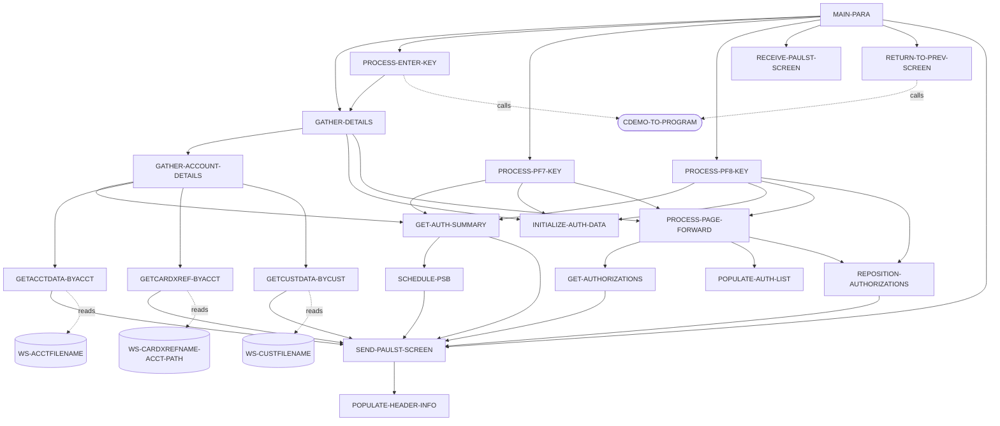

# COPAUS0C

**File**: `cbl/COPAUS0C.cbl`
**Type**: FileType.COBOL
**Analyzed**: 2026-03-03 16:45:45.288791

## Purpose

COPAUS0C is a CICS program that displays pending authorization summaries for a given account. It retrieves authorization details from an IMS database and presents them on a CICS screen, allowing users to select an authorization for further details.

**Business Context**: This program is used to review and manage pending authorizations, likely as part of a fraud detection or risk management process.

## Inputs

| Name | Type | Description |
|------|------|-------------|
| DFHCOMMAREA | IOType.CICS_COMMAREA | Communication area passed between CICS transactions, containing account ID and program context. |
| PAUTDTL1 | IOType.IMS_SEGMENT | IMS segment containing pending authorization details. |

## Outputs

| Name | Type | Description |
|------|------|-------------|
| COPAU0AO | IOType.CICS_MAP | CICS map containing the authorization summary screen. |
| DFHCOMMAREA | IOType.CICS_COMMAREA | Updated communication area passed to subsequent transactions. |

## Called Programs

| Program | Call Type | Purpose |
|---------|-----------|---------|
| CDEMO-TO-PROGRAM | CallType.CICS_XCTL | Transfers control to the authorization detail program when an authorization is selected. |

## Business Rules

- **BR001**: Account ID must be numeric.
- **BR002**: Authorization selection must be 'S' to view details.

## Paragraphs/Procedures

### COPAUS0C
> [Source: COPAUS0C.cbl.md](COPAUS0C.cbl.d/COPAUS0C.cbl.md)
This is the program entry point. It doesn't contain any executable code other than the PROGRAM-ID declaration. It serves as the starting point for the CICS transaction.

### MAIN-PARA
> [Source: MAIN-PARA.cbl.md](COPAUS0C.cbl.d/MAIN-PARA.cbl.md)

```
MAIN-PARA  (52 statements, depth=9)
PARAGRAPH
├── SET: SET ERR-FLG-OFF TO TRUE
├── SET: SET AUTHS-NOT-EOF TO TRUE
├── SET: SET NEXT-PAGE-NO TO TRUE
├── SET: SET SEND-ERASE-YES TO TRUE
├── MOVE: MOVE SPACES TO WS-MESSAGE ERRMSGO OF COPAU0AO
├── MOVE: MOVE -1 TO ACCTIDL OF COPAU0AI
├── IF: IF EIBCALEN = 0 INITIALIZE CARDDEMO-COMMAREA MOVE WS-PGM-AUTH-SMRY TO...
│   ├── INITIALIZE: INITIALIZE CARDDEMO-COMMAREA
│   ├── MOVE: MOVE WS-PGM-AUTH-SMRY TO CDEMO-TO-PROGRAM
│   ├── SET: SET CDEMO-PGM-REENTER TO TRUE
│   ├── MOVE: MOVE LOW-VALUES TO COPAU0AO
│   ├── MOVE: MOVE -1 TO ACCTIDL OF COPAU0AI
│   ├── PERFORM: PERFORM SEND-PAULST-SCREEN
│   └── ELSE: ELSE
│       ├── MOVE: MOVE DFHCOMMAREA(1:EIBCALEN) TO CARDDEMO-COMMAREA
│       └── IF: IF NOT CDEMO-PGM-REENTER SET CDEMO-PGM-REENTER TO TRUE MOVE LOW-VALUE...
│           ├── SET: SET CDEMO-PGM-REENTER TO TRUE
│           ├── MOVE: MOVE LOW-VALUES TO COPAU0AO
│           ├── IF: IF CDEMO-ACCT-ID IS NUMERIC MOVE CDEMO-ACCT-ID TO WS-ACCT-ID ACCTIDO ...
│           │   ├── MOVE: MOVE CDEMO-ACCT-ID TO WS-ACCT-ID ACCTIDO OF COPAU0AO
│           │   └── ELSE: ELSE
│           │       ├── MOVE: MOVE SPACE TO ACCTIDO OF COPAU0AO
│           │       └── MOVE: MOVE LOW-VALUES TO WS-ACCT-ID
│           ├── PERFORM: PERFORM GATHER-DETAILS
│           ├── SET: SET SEND-ERASE-YES TO TRUE
│           ├── PERFORM: PERFORM SEND-PAULST-SCREEN
│           └── ELSE: ELSE
│               ├── PERFORM: PERFORM RECEIVE-PAULST-SCREEN
│               └── EVALUATE: EVALUATE EIBAID WHEN DFHENTER PERFORM PROCESS-ENTER-KEY IF WS-ACCT-ID...
│                   ├── WHEN: WHEN WHEN DFHENTER
│                   │   ├── PERFORM: PERFORM PROCESS-ENTER-KEY
│                   │   ├── IF: IF WS-ACCT-ID = LOW-VALUES MOVE SPACE TO ACCTIDO OF COPAU0AO ELSE MOV...
│                   │   │   ├── MOVE: MOVE SPACE TO ACCTIDO OF COPAU0AO
│                   │   │   └── ELSE: ELSE
│                   │   │       └── MOVE: MOVE WS-ACCT-ID TO ACCTIDO OF COPAU0AO
│                   │   └── PERFORM: PERFORM SEND-PAULST-SCREEN
│                   ├── WHEN: WHEN WHEN DFHPF3
│                   │   ├── MOVE: MOVE WS-PGM-MENU TO CDEMO-TO-PROGRAM
│                   │   ├── PERFORM: PERFORM RETURN-TO-PREV-SCREEN
│                   │   └── PERFORM: PERFORM SEND-PAULST-SCREEN
│                   ├── WHEN: WHEN WHEN DFHPF7
│                   │   ├── PERFORM: PERFORM PROCESS-PF7-KEY
│                   │   └── PERFORM: PERFORM SEND-PAULST-SCREEN
│                   ├── WHEN: WHEN WHEN DFHPF8
│                   │   ├── PERFORM: PERFORM PROCESS-PF8-KEY
│                   │   └── PERFORM: PERFORM SEND-PAULST-SCREEN
│                   └── WHEN: WHEN OTHER
│                       ├── MOVE: MOVE 'Y' TO WS-ERR-FLG
│                       ├── MOVE: MOVE -1 TO ACCTIDL OF COPAU0AI
│                       ├── MOVE: MOVE CCDA-MSG-INVALID-KEY TO WS-MESSAGE
│                       └── PERFORM: PERFORM SEND-PAULST-SCREEN
└── EXEC_CICS: *>EXECCICS EXEC CICS RETURN *>EXECCICS TRANSID (WS-CICS-TRANID) *>EXE...
```
This paragraph controls the main program flow. It first initializes flags and the CICS screen. If the communication area (DFHCOMMAREA) is empty (EIBCALEN = 0), it initializes the CARDDEMO-COMMAREA, sets the program context to 'Authorization Summary', and sends the initial screen. Otherwise, it receives the data from the screen (RECEIVE-PAULST-SCREEN) and processes user actions based on the EIBAID (AID key pressed). It handles ENTER key (PROCESS-ENTER-KEY), PF3 (RETURN-TO-PREV-SCREEN), PF7 (PROCESS-PF7-KEY), PF8 (PROCESS-PF8-KEY), and invalid key presses. After processing, it returns to CICS with the updated communication area.

### PROCESS-ENTER-KEY
> [Source: PROCESS-ENTER-KEY.cbl.md](COPAUS0C.cbl.d/PROCESS-ENTER-KEY.cbl.md)

```
PROCESS-ENTER-KEY  (45 statements, depth=8)
PARAGRAPH
├── IF: IF ACCTIDI OF COPAU0AI = SPACES OR LOW-VALUES MOVE LOW-VALUES TO WS-A...
│   ├── MOVE: MOVE LOW-VALUES TO WS-ACCT-ID
│   ├── MOVE: MOVE 'Y' TO WS-ERR-FLG
│   ├── MOVE: MOVE 'Please enter Acct Id...' TO WS-MESSAGE
│   ├── MOVE: MOVE -1 TO ACCTIDL OF COPAU0AI
│   └── ELSE: ELSE
│       └── IF: IF ACCTIDI OF COPAU0AI IS NOT NUMERIC MOVE LOW-VALUES TO WS-ACCT-ID M...
│           ├── MOVE: MOVE LOW-VALUES TO WS-ACCT-ID
│           ├── MOVE: MOVE 'Y' TO WS-ERR-FLG
│           ├── MOVE: MOVE 'Acct Id must be Numeric ...' TO WS-MESSAGE
│           ├── MOVE: MOVE -1 TO ACCTIDL OF COPAU0AI
│           └── ELSE: ELSE
│               ├── MOVE: MOVE ACCTIDI OF COPAU0AI TO WS-ACCT-ID CDEMO-ACCT-ID
│               ├── EVALUATE: EVALUATE TRUE WHEN SEL0001I OF COPAU0AI NOT = SPACES AND LOW-VALUES M...
│               │   ├── WHEN: WHEN WHEN SEL0001I OF COPAU0AI NOT = SPACES AND LOW-VALUES
│               │   │   ├── MOVE: MOVE SEL0001I OF COPAU0AI TO CDEMO-CPVS-PAU-SEL-FLG
│               │   │   └── MOVE: MOVE CDEMO-CPVS-AUTH-KEYS(1) TO CDEMO-CPVS-PAU-SELECTED
│               │   ├── WHEN: WHEN WHEN SEL0002I OF COPAU0AI NOT = SPACES AND LOW-VALUES
│               │   │   ├── MOVE: MOVE SEL0002I OF COPAU0AI TO CDEMO-CPVS-PAU-SEL-FLG
│               │   │   └── MOVE: MOVE CDEMO-CPVS-AUTH-KEYS(2) TO CDEMO-CPVS-PAU-SELECTED
│               │   ├── WHEN: WHEN WHEN SEL0003I OF COPAU0AI NOT = SPACES AND LOW-VALUES
│               │   │   ├── MOVE: MOVE SEL0003I OF COPAU0AI TO CDEMO-CPVS-PAU-SEL-FLG
│               │   │   └── MOVE: MOVE CDEMO-CPVS-AUTH-KEYS(3) TO CDEMO-CPVS-PAU-SELECTED
│               │   ├── WHEN: WHEN WHEN SEL0004I OF COPAU0AI NOT = SPACES AND LOW-VALUES
│               │   │   ├── MOVE: MOVE SEL0004I OF COPAU0AI TO CDEMO-CPVS-PAU-SEL-FLG
│               │   │   └── MOVE: MOVE CDEMO-CPVS-AUTH-KEYS(4) TO CDEMO-CPVS-PAU-SELECTED
│               │   ├── WHEN: WHEN WHEN SEL0005I OF COPAU0AI NOT = SPACES AND LOW-VALUES
│               │   │   ├── MOVE: MOVE SEL0005I OF COPAU0AI TO CDEMO-CPVS-PAU-SEL-FLG
│               │   │   └── MOVE: MOVE CDEMO-CPVS-AUTH-KEYS(5) TO CDEMO-CPVS-PAU-SELECTED
│               │   └── WHEN: WHEN OTHER
│               │       ├── MOVE: MOVE SPACES TO CDEMO-CPVS-PAU-SEL-FLG
│               │       └── MOVE: MOVE SPACES TO CDEMO-CPVS-PAU-SELECTED
│               └── IF: IF (CDEMO-CPVS-PAU-SEL-FLG NOT = SPACES AND LOW-VALUES) AND (CDEMO-CP...
│                   └── EVALUATE: EVALUATE CDEMO-CPVS-PAU-SEL-FLG WHEN 'S' WHEN 's' MOVE WS-PGM-AUTH-DT...
│                       ├── WHEN: WHEN WHEN 'S'
│                       │   ├── MOVE: MOVE WS-PGM-AUTH-DTL TO CDEMO-TO-PROGRAM
│                       │   ├── MOVE: MOVE WS-CICS-TRANID TO CDEMO-FROM-TRANID
│                       │   ├── MOVE: MOVE WS-PGM-AUTH-SMRY TO CDEMO-FROM-PROGRAM
│                       │   ├── MOVE: MOVE 0 TO CDEMO-PGM-CONTEXT
│                       │   ├── SET: SET CDEMO-PGM-ENTER TO TRUE
│                       │   └── EXEC_CICS: *>EXECCICS EXEC CICS *>EXECCICS XCTL PROGRAM(CDEMO-TO-PROGRAM) *>EXEC...
│                       └── WHEN: WHEN OTHER
│                           ├── MOVE: MOVE 'Invalid selection. Valid value is S' TO WS-MESSAGE
│                           └── MOVE: MOVE -1 TO ACCTIDL OF COPAU0AI
└── PERFORM: PERFORM GATHER-DETAILS
```
This paragraph processes the ENTER key press. It validates the account ID entered by the user. If the account ID is blank or non-numeric, it sets an error message. Otherwise, it moves the account ID to working storage and evaluates the selected authorization. If a valid authorization is selected ('S'), it transfers control to the authorization detail program (CDEMO-TO-PROGRAM) using XCTL. If the selection is invalid, it displays an error message. Finally, it calls GATHER-DETAILS to refresh account details.

### GATHER-DETAILS
> [Source: GATHER-DETAILS.cbl.md](COPAUS0C.cbl.d/GATHER-DETAILS.cbl.md)

```
GATHER-DETAILS  (7 statements, depth=3)
PARAGRAPH
├── MOVE: MOVE -1 TO ACCTIDL OF COPAU0AI
├── MOVE: MOVE 0 TO CDEMO-CPVS-PAGE-NUM
└── IF: IF WS-ACCT-ID NOT = LOW-VALUES PERFORM GATHER-ACCOUNT-DETAILS PERFORM...
    ├── PERFORM: PERFORM GATHER-ACCOUNT-DETAILS
    ├── PERFORM: PERFORM INITIALIZE-AUTH-DATA
    └── IF: IF FOUND-PAUT-SMRY-SEG PERFORM PROCESS-PAGE-FORWARD END-IF
        └── PERFORM: PERFORM PROCESS-PAGE-FORWARD
```
This paragraph orchestrates the gathering of account and authorization details. It resets ACCTIDL and CDEMO-CPVS-PAGE-NUM. If a valid account ID exists (WS-ACCT-ID NOT = LOW-VALUES), it performs GATHER-ACCOUNT-DETAILS to retrieve account-specific information, then calls INITIALIZE-AUTH-DATA to prepare for authorization retrieval. If authorization summary segments are found (FOUND-PAUT-SMRY-SEG), it calls PROCESS-PAGE-FORWARD to retrieve and display the authorization list.

### PROCESS-PF7-KEY
> [Source: PROCESS-PF7-KEY.cbl.md](COPAUS0C.cbl.d/PROCESS-PF7-KEY.cbl.md)

```
PROCESS-PF7-KEY  (12 statements, depth=3)
PARAGRAPH
└── IF: IF CDEMO-CPVS-PAGE-NUM > 1 COMPUTE CDEMO-CPVS-PAGE-NUM = CDEMO-CPVS-P...
    ├── COMPUTE: COMPUTE CDEMO-CPVS-PAGE-NUM = CDEMO-CPVS-PAGE-NUM - 1
    ├── MOVE: MOVE CDEMO-CPVS-PAUKEY-PREV-PG(CDEMO-CPVS-PAGE-NUM) TO WS-AUTH-KEY-SAVE
    ├── PERFORM: PERFORM GET-AUTH-SUMMARY
    ├── SET: SET SEND-ERASE-NO TO TRUE
    ├── SET: SET NEXT-PAGE-YES TO TRUE
    ├── MOVE: MOVE -1 TO ACCTIDL OF COPAU0AI
    ├── PERFORM: PERFORM INITIALIZE-AUTH-DATA
    ├── PERFORM: PERFORM PROCESS-PAGE-FORWARD
    └── ELSE: ELSE
        ├── MOVE: MOVE 'You are already at the top of the page...' TO WS-MESSAGE
        └── SET: SET SEND-ERASE-NO TO TRUE
```
This paragraph handles the PF7 key press, which requests the previous page of authorizations. If the current page number is greater than 1, it decrements the page number, retrieves the authorization key for the previous page, calls GET-AUTH-SUMMARY, sets flags for screen display, and calls INITIALIZE-AUTH-DATA and PROCESS-PAGE-FORWARD to display the previous page. If already at the top page, it displays a message.

### PROCESS-PF8-KEY
> [Source: PROCESS-PF8-KEY.cbl.md](COPAUS0C.cbl.d/PROCESS-PF8-KEY.cbl.md)

```
PROCESS-PF8-KEY  (13 statements, depth=3)
PARAGRAPH
├── IF: IF CDEMO-CPVS-PAUKEY-LAST = SPACES OR LOW-VALUES MOVE LOW-VALUES TO W...
│   ├── MOVE: MOVE LOW-VALUES TO WS-AUTH-KEY-SAVE
│   └── ELSE: ELSE
│       ├── MOVE: MOVE CDEMO-CPVS-PAUKEY-LAST TO WS-AUTH-KEY-SAVE
│       ├── PERFORM: PERFORM GET-AUTH-SUMMARY
│       └── PERFORM: PERFORM REPOSITION-AUTHORIZATIONS
├── MOVE: MOVE -1 TO ACCTIDL OF COPAU0AI
├── SET: SET SEND-ERASE-NO TO TRUE
└── IF: IF NEXT-PAGE-YES PERFORM INITIALIZE-AUTH-DATA PERFORM PROCESS-PAGE-FO...
    ├── PERFORM: PERFORM INITIALIZE-AUTH-DATA
    ├── PERFORM: PERFORM PROCESS-PAGE-FORWARD
    └── ELSE: ELSE
        └── MOVE: MOVE 'You are already at the bottom of the page...' TO WS-MESSAGE
```
This paragraph handles the PF8 key press, which requests the next page of authorizations. If the last authorization key is not SPACES or LOW-VALUES, it moves the last authorization key to WS-AUTH-KEY-SAVE, calls GET-AUTH-SUMMARY and REPOSITION-AUTHORIZATIONS. It then sets flags for screen display. If NEXT-PAGE-YES is set, it calls INITIALIZE-AUTH-DATA and PROCESS-PAGE-FORWARD to display the next page. If already at the bottom page, it displays a message.

### PROCESS-PAGE-FORWARD
> [Source: PROCESS-PAGE-FORWARD.cbl.md](COPAUS0C.cbl.d/PROCESS-PAGE-FORWARD.cbl.md)

```
PROCESS-PAGE-FORWARD  (21 statements, depth=5)
PARAGRAPH
└── IF: IF ERR-FLG-OFF MOVE 1 TO WS-IDX MOVE LOW-VALUES TO CDEMO-CPVS-PAUKEY-...
    ├── MOVE: MOVE 1 TO WS-IDX
    ├── MOVE: MOVE LOW-VALUES TO CDEMO-CPVS-PAUKEY-LAST
    ├── PERFORM_INLINE: PERFORM UNTIL WS-IDX > 5 OR AUTHS-EOF OR ERR-FLG-ON IF EIBAID = DFHPF...
    │   ├── IF: IF EIBAID = DFHPF7 AND WS-IDX = 1 PERFORM REPOSITION-AUTHORIZATIONS E...
    │   │   ├── PERFORM: PERFORM REPOSITION-AUTHORIZATIONS
    │   │   └── ELSE: ELSE
    │   │       └── PERFORM: PERFORM GET-AUTHORIZATIONS
    │   └── IF: IF AUTHS-NOT-EOF AND ERR-FLG-OFF PERFORM POPULATE-AUTH-LIST COMPUTE W...
    │       ├── PERFORM: PERFORM POPULATE-AUTH-LIST
    │       ├── COMPUTE: COMPUTE WS-IDX = WS-IDX + 1
    │       ├── MOVE: MOVE PA-AUTHORIZATION-KEY TO CDEMO-CPVS-PAUKEY-LAST
    │       └── IF: IF WS-IDX = 2 COMPUTE CDEMO-CPVS-PAGE-NUM = CDEMO-CPVS-PAGE-NUM + 1 M...
    │           ├── COMPUTE: COMPUTE CDEMO-CPVS-PAGE-NUM = CDEMO-CPVS-PAGE-NUM + 1
    │           └── MOVE: MOVE PA-AUTHORIZATION-KEY TO CDEMO-CPVS-PAUKEY-PREV-PG(CDEMO-CPVS-PAG...
    └── IF: IF AUTHS-NOT-EOF AND ERR-FLG-OFF PERFORM GET-AUTHORIZATIONS IF AUTHS-...
        ├── PERFORM: PERFORM GET-AUTHORIZATIONS
        └── IF: IF AUTHS-NOT-EOF AND ERR-FLG-OFF SET NEXT-PAGE-YES TO TRUE ELSE SET N...
            ├── SET: SET NEXT-PAGE-YES TO TRUE
            └── ELSE: ELSE
                └── SET: SET NEXT-PAGE-NO TO TRUE
```
This paragraph retrieves and displays the next set of authorizations. It initializes WS-IDX to 1 and CDEMO-CPVS-PAUKEY-LAST to LOW-VALUES. It then enters a loop that continues until WS-IDX exceeds 5, or AUTHS-EOF is set, or ERR-FLG-ON is set. Inside the loop, it calls REPOSITION-AUTHORIZATIONS if PF7 was pressed and WS-IDX is 1, otherwise it calls GET-AUTHORIZATIONS to retrieve the next authorization. If authorizations are found and no errors occurred, it calls POPULATE-AUTH-LIST to populate the screen fields, increments WS-IDX, and saves the authorization key. If WS-IDX is 2, it increments the page number and saves the authorization key for the previous page. After the loop, if authorizations are still available and no errors occurred, it calls GET-AUTHORIZATIONS to check if there is another page available.

### GET-AUTHORIZATIONS
> [Source: GET-AUTHORIZATIONS.cbl.md](COPAUS0C.cbl.d/GET-AUTHORIZATIONS.cbl.md)

```
GET-AUTHORIZATIONS  (0 statements, depth=0)
PARAGRAPH
```
This paragraph retrieves the next authorization detail segment (PAUTDTL1) from the IMS database using DLI GNP. It moves the DIBSTAT to IMS-RETURN-CODE and evaluates the status. If the status is OK, it sets AUTHS-NOT-EOF to TRUE. If the segment is not found or end of database is reached, it sets AUTHS-EOF to TRUE. If any other error occurs, it sets WS-ERR-FLG to 'Y', constructs an error message, and calls SEND-PAULST-SCREEN to display the error.

### REPOSITION-AUTHORIZATIONS
> [Source: REPOSITION-AUTHORIZATIONS.cbl.md](COPAUS0C.cbl.d/REPOSITION-AUTHORIZATIONS.cbl.md)
This paragraph repositions the IMS database cursor to a specific authorization key. It moves WS-AUTH-KEY-SAVE to PA-AUTHORIZATION-KEY and then retrieves the PAUTDTL1 segment using DLI GNP with a WHERE clause to match the authorization key. It moves the DIBSTAT to IMS-RETURN-CODE and evaluates the status. If the status is OK, it sets AUTHS-NOT-EOF to TRUE. If the segment is not found or end of database is reached, it sets AUTHS-EOF to TRUE. If any other error occurs, it sets WS-ERR-FLG to 'Y', constructs an error message, and calls SEND-PAULST-SCREEN to display the error.

### POPULATE-AUTH-LIST
> [Source: POPULATE-AUTH-LIST.cbl.md](COPAUS0C.cbl.d/POPULATE-AUTH-LIST.cbl.md)
This paragraph populates the authorization list on the screen. It moves data from the PENDING-AUTH-DETAILS segment to the corresponding fields in the COPAU0AI map based on the current index (WS-IDX). It formats the authorization amount, time, and date. It also converts the authorization response code to an approval status ('A' for approved, 'D' for denied). The EVALUATE statement assigns the authorization details to the appropriate row on the screen based on WS-IDX. The DFHBMUNP is moved to SEL000xA to allow the user to select the authorization.

### INITIALIZE-AUTH-DATA
> [Source: INITIALIZE-AUTH-DATA.cbl.md](COPAUS0C.cbl.d/INITIALIZE-AUTH-DATA.cbl.md)
This paragraph initializes the authorization data fields in the COPAU0AI map. It iterates through five sets of fields (SEL0001A to SEL0005A) using a PERFORM VARYING loop. For each iteration, it moves 'DFHBMPRO' to the selection field (e.g., SEL0001A) and spaces to the transaction ID, date, time, type, approval, status, and amount fields (e.g., TRNID01I, PDATE01I, etc.). This effectively clears any previous authorization data displayed on the screen, preparing it for new data. The paragraph does not directly consume any input data but initializes the output map COPAU0AI. It does not call any other paragraphs or programs and does not perform any error handling.

### RETURN-TO-PREV-SCREEN
> [Source: RETURN-TO-PREV-SCREEN.cbl.md](COPAUS0C.cbl.d/RETURN-TO-PREV-SCREEN.cbl.md)
This paragraph prepares to return to the previous CICS screen by transferring control to another program. It first checks if CDEMO-TO-PROGRAM is empty; if so, it defaults to 'COSGN00C'. It then moves the current transaction ID (WS-CICS-TRANID) to CDEMO-FROM-TRANID and the current program name (WS-PGM-AUTH-SMRY) to CDEMO-FROM-PROGRAM in the CARDDEMO-COMMAREA. Finally, it executes a CICS XCTL command to transfer control to the program specified in CDEMO-TO-PROGRAM, passing the CARDDEMO-COMMAREA. The paragraph consumes WS-CICS-TRANID and WS-PGM-AUTH-SMRY and updates the CARDDEMO-COMMAREA. It calls the CDEMO-TO-PROGRAM via CICS XCTL. No error handling is explicitly performed in this paragraph.

### SEND-PAULST-SCREEN
> [Source: SEND-PAULST-SCREEN.cbl.md](COPAUS0C.cbl.d/SEND-PAULST-SCREEN.cbl.md)
This paragraph sends the COPAU0A screen to the terminal. It first checks if IMS-PSB-SCHD is set to TRUE; if so, it sets IMS-PSB-NOT-SCHD to TRUE and issues a CICS SYNCPOINT command. Then, it performs the POPULATE-HEADER-INFO paragraph to populate the header fields of the output map. It moves the content of WS-MESSAGE to the ERRMSGO field of the COPAU0AO map. Finally, it sends the COPAU0A map using a CICS SEND command, either with the ERASE option (if SEND-ERASE-YES is true) or without it. The paragraph consumes WS-MESSAGE, IMS-PSB-SCHD, and SEND-ERASE-YES. It calls POPULATE-HEADER-INFO and uses the COPAU0AO map as output. No explicit error handling is present, but CICS handles potential errors during the SEND operation.

### RECEIVE-PAULST-SCREEN
> [Source: RECEIVE-PAULST-SCREEN.cbl.md](COPAUS0C.cbl.d/RECEIVE-PAULST-SCREEN.cbl.md)
This paragraph receives data from the COPAU0A screen. It executes a CICS RECEIVE command to receive the data from the screen into the COPAU0AI map. The RESP and RESP2 options capture the CICS response codes in WS-RESP-CD and WS-REAS-CD, respectively. The paragraph consumes data from the COPAU0A screen and populates the COPAU0AI map. It does not call any other paragraphs or programs. The CICS RECEIVE command handles potential errors, with the response codes stored in WS-RESP-CD and WS-REAS-CD.

### POPULATE-HEADER-INFO
> [Source: POPULATE-HEADER-INFO.cbl.md](COPAUS0C.cbl.d/POPULATE-HEADER-INFO.cbl.md)
This paragraph populates the header information in the output map COPAU0AO. It moves the current date to WS-CURDATE-DATA using the FUNCTION CURRENT-DATE. It then moves CCDA-TITLE01 and CCDA-TITLE02 to TITLE01O and TITLE02O, respectively. The current transaction ID (WS-CICS-TRANID) is moved to TRNNAMEO, and the current program name (WS-PGM-AUTH-SMRY) is moved to PGMNAMEO. The paragraph then formats the current date and time into WS-CURDATE-MM-DD-YY and WS-CURTIME-HH-MM-SS, respectively, and moves them to CURDATEO and CURTIMEO in the output map. This paragraph consumes the current date and time, CCDA-TITLE01, CCDA-TITLE02, WS-CICS-TRANID, and WS-PGM-AUTH-SMRY. It produces output in the COPAU0AO map. It does not call any other paragraphs or programs and does not perform any explicit error handling.

### GATHER-ACCOUNT-DETAILS
> [Source: GATHER-ACCOUNT-DETAILS.cbl.md](COPAUS0C.cbl.d/GATHER-ACCOUNT-DETAILS.cbl.md)
This paragraph orchestrates the retrieval and formatting of account details from various sources. It first performs GETCARDXREF-BYACCT to retrieve card cross-reference information. Then, it performs GETACCTDATA-BYACCT to retrieve account data and GETCUSTDATA-BYCUST to retrieve customer data. It then formats the customer's name and address into CNAMEO, ADDR001O, and ADDR002O in the output map. It moves the customer's phone number to PHONE1O. It moves the account credit limit and cash credit limit to CREDLIMO and CASHLIMO, respectively, after formatting them for display. Finally, it performs GET-AUTH-SUMMARY to retrieve the authorization summary. If a pending authorization summary segment is found, it moves the approved and declined authorization counts and amounts, as well as credit and cash balances, to the corresponding fields in the output map. Otherwise, it sets these fields to zero. This paragraph consumes data from CARD-XREF-RECORD, ACCOUNT-RECORD, CUSTOMER-RECORD, and PENDING-AUTH-SUMMARY. It produces output in the COPAU0AO map. It calls GETCARDXREF-BYACCT, GETACCTDATA-BYACCT, GETCUSTDATA-BYCUST, and GET-AUTH-SUMMARY. No explicit error handling is performed within this paragraph, but the called paragraphs handle their own errors.

### GETCARDXREF-BYACCT
> [Source: GETCARDXREF-BYACCT.cbl.md](COPAUS0C.cbl.d/GETCARDXREF-BYACCT.cbl.md)
This paragraph retrieves the card cross-reference record from the CARDXREF file based on the account ID. It moves the account ID (WS-ACCT-ID) to WS-CARD-RID-ACCT-ID-X and then executes a CICS READ command to read the CARD-XREF-RECORD from the WS-CARDXREFNAME-ACCT-PATH dataset using the alternate index ACCTID. The CICS response codes are stored in WS-RESP-CD and WS-REAS-CD. If the read is successful (DFHRESP(NORMAL)), it moves the customer ID (XREF-CUST-ID) to CDEMO-CUST-ID and the card number (XREF-CARD-NUM) to CDEMO-CARD-NUM. If the record is not found (DFHRESP(NOTFND)), it constructs an error message and performs SEND-PAULST-SCREEN. If any other error occurs, it sets WS-ERR-FLG to 'Y', constructs an error message, and performs SEND-PAULST-SCREEN. The paragraph consumes WS-ACCT-ID and produces CDEMO-CUST-ID and CDEMO-CARD-NUM. It calls SEND-PAULST-SCREEN in case of errors. Error handling is performed based on the CICS response codes.

### GETACCTDATA-BYACCT
> [Source: GETACCTDATA-BYACCT.cbl.md](COPAUS0C.cbl.d/GETACCTDATA-BYACCT.cbl.md)
This paragraph retrieves the account record from the ACCT file based on the account ID. It moves the account ID (XREF-ACCT-ID) to WS-CARD-RID-ACCT-ID-X and then executes a CICS READ command to read the ACCOUNT-RECORD from the WS-ACCTFILENAME dataset. The CICS response codes are stored in WS-RESP-CD and WS-REAS-CD. If the read is successful (DFHRESP(NORMAL)), it continues processing. If the record is not found (DFHRESP(NOTFND)), it constructs an error message and performs SEND-PAULST-SCREEN. If any other error occurs, it sets WS-ERR-FLG to 'Y', constructs an error message, and performs SEND-PAULST-SCREEN. The paragraph consumes XREF-ACCT-ID. It calls SEND-PAULST-SCREEN in case of errors. Error handling is performed based on the CICS response codes.

### GETCUSTDATA-BYCUST
> [Source: GETCUSTDATA-BYCUST.cbl.md](COPAUS0C.cbl.d/GETCUSTDATA-BYCUST.cbl.md)
This paragraph retrieves the customer record from the CUST file based on the customer ID. It moves the customer ID (XREF-CUST-ID) to WS-CARD-RID-CUST-ID-X and then executes a CICS READ command to read the CUSTOMER-RECORD from the WS-CUSTFILENAME dataset. The CICS response codes are stored in WS-RESP-CD and WS-REAS-CD. If the read is successful (DFHRESP(NORMAL)), it continues processing. If the record is not found (DFHRESP(NOTFND)), it constructs an error message and performs SEND-PAULST-SCREEN. If any other error occurs, it sets WS-ERR-FLG to 'Y', constructs an error message, and performs SEND-PAULST-SCREEN. The paragraph consumes XREF-CUST-ID. It calls SEND-PAULST-SCREEN in case of errors. Error handling is performed based on the CICS response codes.

### GET-AUTH-SUMMARY
> [Source: GET-AUTH-SUMMARY.cbl.md](COPAUS0C.cbl.d/GET-AUTH-SUMMARY.cbl.md)
This paragraph retrieves the authorization summary from the IMS database. It first performs SCHEDULE-PSB to schedule the PSB. It then moves the account ID (CDEMO-ACCT-ID) to PA-ACCT-ID and executes a DLI GU (Get Unique) command to retrieve the PAUTSUM0 segment from the IMS database using the PAUT-PCB-NUM PCB. The retrieved segment is placed into PENDING-AUTH-SUMMARY. The IMS return code is stored in DIBSTAT and moved to IMS-RETURN-CODE. If the segment is found (STATUS-OK), it sets FOUND-PAUT-SMRY-SEG to TRUE. If the segment is not found (SEGMENT-NOT-FOUND), it sets NFOUND-PAUT-SMRY-SEG to TRUE. If any other error occurs, it sets WS-ERR-FLG to 'Y', constructs an error message, and performs SEND-PAULST-SCREEN. This paragraph consumes CDEMO-ACCT-ID. It calls SCHEDULE-PSB and SEND-PAULST-SCREEN. Error handling is performed based on the IMS return code.

### SCHEDULE-PSB
> [Source: SCHEDULE-PSB.cbl.md](COPAUS0C.cbl.d/SCHEDULE-PSB.cbl.md)
The SCHEDULE-PSB paragraph is responsible for scheduling a Program Specification Block (PSB) for IMS database interaction. It first attempts to schedule the PSB using the EXEC DLI SCHD command, specifying the PSB name and disabling the Dhabend exit. The DIBSTAT field is then moved to IMS-RETURN-CODE to capture the IMS return code. If the PSB has been scheduled more than once, it terminates the current PSB and reschedules it. If the scheduling is successful (STATUS-OK), it sets the IMS-PSB-SCHD flag to TRUE. Otherwise, it sets the WS-ERR-FLG to 'Y', constructs an error message including the IMS return code, sets ACCTIDL to -1, and performs the SEND-PAULST-SCREEN paragraph to display the error message to the user. This paragraph ensures the program connects to the IMS database and handles potential scheduling errors.

## Dead Code

The following artifacts were identified as dead code by static analysis:

| Artifact | Type | Line | Reason |
|----------|------|------|--------|
| exec-006 | function | 686 | Function 'exec-006' is never called by any other artifact |
| exec-007 | function | 695 | Function 'exec-007' is never called by any other artifact |
| exec-008 | function | 703 | Function 'exec-008' is never called by any other artifact |
| exec-009 | function | 715 | Function 'exec-009' is never called by any other artifact |
| exec-010 | function | 818 | Function 'exec-010' is never called by any other artifact |
| exec-011 | function | 869 | Function 'exec-011' is never called by any other artifact |
| exec-012 | function | 920 | Function 'exec-012' is never called by any other artifact |
| exec-013 | function | 973 | Function 'exec-013' is never called by any other artifact |
| exec-014 | function | 1002 | Function 'exec-014' is never called by any other artifact |
| exec-015 | function | 1008 | Function 'exec-015' is never called by any other artifact |
| exec-016 | function | 1011 | Function 'exec-016' is never called by any other artifact |
| COPAU0AI | record_layout | 17 | Record layout 'COPAU0AI' is never used by any program |
| COPAU0AO | record_layout | 391 | Record layout 'COPAU0AO' is never used by any program |
| PENDING-AUTH-DETAILS | record_layout | 164 | Record layout 'PENDING-AUTH-DETAILS' is never used by any program |
| PENDING-AUTH-SUMMARY | record_layout | 160 | Record layout 'PENDING-AUTH-SUMMARY' is never used by any program |
| WS-IMS-VARIABLES | record_layout | 74 | Record layout 'WS-IMS-VARIABLES' is never used by any program |
| WS-SWITCHES | record_layout | 93 | Record layout 'WS-SWITCHES' is never used by any program |

## Control Flow


```mermaid
flowchart TD
    %% Title: COPAUS0C.cbl
    GATHER_ACCOUNT_DETAILS["GATHER-ACCOUNT-DETAILS"]
    GET_AUTH_SUMMARY["GET-AUTH-SUMMARY"]
    GETACCTDATA_BYACCT["GETACCTDATA-BYACCT"]
    GETCARDXREF_BYACCT["GETCARDXREF-BYACCT"]
    GETCUSTDATA_BYCUST["GETCUSTDATA-BYCUST"]
    GATHER_DETAILS["GATHER-DETAILS"]
    INITIALIZE_AUTH_DATA["INITIALIZE-AUTH-DATA"]
    PROCESS_PAGE_FORWARD["PROCESS-PAGE-FORWARD"]
    SCHEDULE_PSB["SCHEDULE-PSB"]
    SEND_PAULST_SCREEN["SEND-PAULST-SCREEN"]
    GET_AUTHORIZATIONS["GET-AUTHORIZATIONS"]
    WS_ACCTFILENAME__ext[("WS-ACCTFILENAME")]
    WS_CARDXREFNAME_ACCT_PATH__ext[("WS-CARDXREFNAME-ACCT-PATH")]
    WS_CUSTFILENAME__ext[("WS-CUSTFILENAME")]
    MAIN_PARA["MAIN-PARA"]
    PROCESS_ENTER_KEY["PROCESS-ENTER-KEY"]
    PROCESS_PF7_KEY["PROCESS-PF7-KEY"]
    PROCESS_PF8_KEY["PROCESS-PF8-KEY"]
    RECEIVE_PAULST_SCREEN["RECEIVE-PAULST-SCREEN"]
    RETURN_TO_PREV_SCREEN["RETURN-TO-PREV-SCREEN"]
    POPULATE_AUTH_LIST["POPULATE-AUTH-LIST"]
    POPULATE_HEADER_INFO["POPULATE-HEADER-INFO"]
    CDEMO_TO_PROGRAM__ext(["CDEMO-TO-PROGRAM"])
    REPOSITION_AUTHORIZATIONS["REPOSITION-AUTHORIZATIONS"]
    GATHER_ACCOUNT_DETAILS --> GET_AUTH_SUMMARY
    GATHER_ACCOUNT_DETAILS --> GETACCTDATA_BYACCT
    GATHER_ACCOUNT_DETAILS --> GETCARDXREF_BYACCT
    GATHER_ACCOUNT_DETAILS --> GETCUSTDATA_BYCUST
    GATHER_DETAILS --> GATHER_ACCOUNT_DETAILS
    GATHER_DETAILS --> INITIALIZE_AUTH_DATA
    GATHER_DETAILS --> PROCESS_PAGE_FORWARD
    GET_AUTH_SUMMARY --> SCHEDULE_PSB
    GET_AUTH_SUMMARY --> SEND_PAULST_SCREEN
    GET_AUTHORIZATIONS --> SEND_PAULST_SCREEN
    GETACCTDATA_BYACCT --> SEND_PAULST_SCREEN
    GETACCTDATA_BYACCT -.->|reads| WS_ACCTFILENAME__ext
    GETCARDXREF_BYACCT --> SEND_PAULST_SCREEN
    GETCARDXREF_BYACCT -.->|reads| WS_CARDXREFNAME_ACCT_PATH__ext
    GETCUSTDATA_BYCUST --> SEND_PAULST_SCREEN
    GETCUSTDATA_BYCUST -.->|reads| WS_CUSTFILENAME__ext
    MAIN_PARA --> GATHER_DETAILS
    MAIN_PARA --> PROCESS_ENTER_KEY
    MAIN_PARA --> PROCESS_PF7_KEY
    MAIN_PARA --> PROCESS_PF8_KEY
    MAIN_PARA --> RECEIVE_PAULST_SCREEN
    MAIN_PARA --> RETURN_TO_PREV_SCREEN
    MAIN_PARA --> SEND_PAULST_SCREEN
    PROCESS_ENTER_KEY --> GATHER_DETAILS
    PROCESS_ENTER_KEY -.->|calls| CDEMO_TO_PROGRAM__ext
    PROCESS_PAGE_FORWARD --> GET_AUTHORIZATIONS
    PROCESS_PAGE_FORWARD --> POPULATE_AUTH_LIST
    PROCESS_PAGE_FORWARD --> REPOSITION_AUTHORIZATIONS
    PROCESS_PF7_KEY --> GET_AUTH_SUMMARY
    PROCESS_PF7_KEY --> INITIALIZE_AUTH_DATA
    PROCESS_PF7_KEY --> PROCESS_PAGE_FORWARD
    PROCESS_PF8_KEY --> GET_AUTH_SUMMARY
    PROCESS_PF8_KEY --> INITIALIZE_AUTH_DATA
    PROCESS_PF8_KEY --> PROCESS_PAGE_FORWARD
    PROCESS_PF8_KEY --> REPOSITION_AUTHORIZATIONS
    REPOSITION_AUTHORIZATIONS --> SEND_PAULST_SCREEN
    RETURN_TO_PREV_SCREEN -.->|calls| CDEMO_TO_PROGRAM__ext
    SCHEDULE_PSB --> SEND_PAULST_SCREEN
    SEND_PAULST_SCREEN --> POPULATE_HEADER_INFO
```

## Open Questions

- ? What is the purpose of the INITIALIZE-AUTH-DATA paragraph, which is called in multiple places?
  - Context: The code does not provide enough context to understand the exact initialization performed.
- ? What is the structure and purpose of the PAUT-PCB-NUM?
  - Context: The code uses PAUT-PCB-NUM as a parameter for IMS calls, but its definition is not available.
- ? What is the purpose of the GET-AUTH-SUMMARY paragraph?
  - Context: The code calls GET-AUTH-SUMMARY, but its definition is not available.
- ? What is the purpose of the GATHER-ACCOUNT-DETAILS paragraph?
  - Context: The code calls GATHER-ACCOUNT-DETAILS, but its definition is not available.

## Sequence Diagram

### Part 1 of 2

```mermaid
sequenceDiagram
    participant COPAUS0C as COPAUS0C
    participant COCOM01Y as COCOM01Y
    participant COPAU00 as COPAU00
    participant COTTL01Y as COTTL01Y
    participant CSDAT01Y as CSDAT01Y
    participant CSMSG01Y as CSMSG01Y
    participant CSMSG02Y as CSMSG02Y
    participant CVACT01Y as CVACT01Y
    participant CVACT02Y as CVACT02Y
    participant CVACT03Y as CVACT03Y
    participant CVCUS01Y as CVCUS01Y
    participant CIPAUSMY as CIPAUSMY
    participant CIPAUDTY as CIPAUDTY
    participant DFHAID as DFHAID
    participant DFHBMSCA as DFHBMSCA
    participant MAIN_PARA as MAIN-PARA
    participant SEND_PAULST_SCREEN as SEND-PAULST-SCREEN
    participant GATHER_DETAILS as GATHER-DETAILS
    participant RECEIVE_PAULST_SCREEN as RECEIVE-PAULST-SCREEN
    participant PROCESS_ENTER_KEY as PROCESS-ENTER-KEY
    participant RETURN_TO_PREV_SCREEN as RETURN-TO-PREV-SCREEN
    participant PROCESS_PF7_KEY as PROCESS-PF7-KEY
    participant PROCESS_PF8_KEY as PROCESS-PF8-KEY
    participant CDEMO_TO_PROGRAM as CDEMO-TO-PROGRAM
    participant GATHER_ACCOUNT_DETAILS as GATHER-ACCOUNT-DETAILS
    participant INITIALIZE_AUTH_DATA as INITIALIZE-AUTH-DATA
    participant PROCESS_PAGE_FORWARD as PROCESS-PAGE-FORWARD
    participant GET_AUTH_SUMMARY as GET-AUTH-SUMMARY
    COPAUS0C->>COCOM01Y: performs
    COPAUS0C->>COPAU00: performs
    COPAUS0C->>COTTL01Y: performs
    COPAUS0C->>CSDAT01Y: performs
    COPAUS0C->>CSMSG01Y: performs
    COPAUS0C->>CSMSG02Y: performs
    COPAUS0C->>CVACT01Y: performs
    COPAUS0C->>CVACT02Y: performs
    COPAUS0C->>CVACT03Y: performs
    COPAUS0C->>CVCUS01Y: performs
    COPAUS0C->>CIPAUSMY: performs
    COPAUS0C->>CIPAUDTY: performs
    COPAUS0C->>DFHAID: performs
    COPAUS0C->>DFHBMSCA: performs
    MAIN_PARA->>SEND_PAULST_SCREEN: IMS-PSB-SCHD / WS-MESSAGE / SEND-ERASE-YES / ...
    MAIN_PARA->>GATHER_DETAILS: WS-ACCT-ID
    GATHER_DETAILS-->>MAIN_PARA: ACCTIDL OF COPAU0AI / CDEMO-CPVS-PAGE-NUM
    MAIN_PARA->>SEND_PAULST_SCREEN: IMS-PSB-SCHD / WS-MESSAGE / SEND-ERASE-YES / ...
    MAIN_PARA->>RECEIVE_PAULST_SCREEN: performs
    RECEIVE_PAULST_SCREEN-->>MAIN_PARA: WS-RESP-CD / WS-REAS-CD
    MAIN_PARA->>PROCESS_ENTER_KEY: ACCTIDI OF COPAU0AI / SEL0001I OF COPAU0AI / SEL0002I OF COPAU0AI / ...
    PROCESS_ENTER_KEY-->>MAIN_PARA: WS-ACCT-ID / WS-ERR-FLG / WS-MESSAGE / ...
    MAIN_PARA->>SEND_PAULST_SCREEN: IMS-PSB-SCHD / WS-MESSAGE / SEND-ERASE-YES / ...
    MAIN_PARA->>RETURN_TO_PREV_SCREEN: WS-CICS-TRANID / WS-PGM-AUTH-SMRY / CDEMO-TO-PROGRAM
    RETURN_TO_PREV_SCREEN-->>MAIN_PARA: CDEMO-TO-PROGRAM / CDEMO-FROM-TRANID / CDEMO-FROM-PROGRAM / ...
    MAIN_PARA->>SEND_PAULST_SCREEN: IMS-PSB-SCHD / WS-MESSAGE / SEND-ERASE-YES / ...
    MAIN_PARA->>PROCESS_PF7_KEY: CDEMO-CPVS-PAGE-NUM / CDEMO-CPVS-PAUKEY-PREV-PG
    PROCESS_PF7_KEY-->>MAIN_PARA: CDEMO-CPVS-PAGE-NUM / WS-AUTH-KEY-SAVE / SEND-ERASE-NO / ...
    MAIN_PARA->>SEND_PAULST_SCREEN: IMS-PSB-SCHD / WS-MESSAGE / SEND-ERASE-YES / ...
    MAIN_PARA->>PROCESS_PF8_KEY: CDEMO-CPVS-PAUKEY-LAST / NEXT-PAGE-YES
    PROCESS_PF8_KEY-->>MAIN_PARA: WS-AUTH-KEY-SAVE
    MAIN_PARA->>SEND_PAULST_SCREEN: IMS-PSB-SCHD / WS-MESSAGE / SEND-ERASE-YES / ...
    MAIN_PARA->>SEND_PAULST_SCREEN: IMS-PSB-SCHD / WS-MESSAGE / SEND-ERASE-YES / ...
    PROCESS_ENTER_KEY->>GATHER_DETAILS: WS-ACCT-ID
    GATHER_DETAILS-->>PROCESS_ENTER_KEY: ACCTIDL / CDEMO-CPVS-PAGE-NUM
    PROCESS_ENTER_KEY->>CDEMO_TO_PROGRAM: performs
    GATHER_DETAILS->>GATHER_ACCOUNT_DETAILS: WS-ACCT-ID
    GATHER_ACCOUNT_DETAILS-->>GATHER_DETAILS: CUSTIDO / CNAMEO / ADDR001O / ...
    GATHER_DETAILS->>INITIALIZE_AUTH_DATA: performs
    INITIALIZE_AUTH_DATA-->>GATHER_DETAILS: WS-IDX
    GATHER_DETAILS->>PROCESS_PAGE_FORWARD: ERR-FLG-OFF / EIBAID / DFHPF7 / ...
    PROCESS_PAGE_FORWARD-->>GATHER_DETAILS: WS-IDX / CDEMO-CPVS-PAUKEY-LAST / CDEMO-CPVS-PAGE-NUM / ...
    PROCESS_PF7_KEY->>GET_AUTH_SUMMARY: CDEMO-ACCT-ID / PA-ACCT-ID / PAUT-PCB-NUM / ...
    GET_AUTH_SUMMARY-->>PROCESS_PF7_KEY: IMS-RETURN-CODE / FOUND-PAUT-SMRY-SEG / NFOUND-PAUT-SMRY-SEG / ...
    PROCESS_PF7_KEY->>INITIALIZE_AUTH_DATA: performs
    INITIALIZE_AUTH_DATA-->>PROCESS_PF7_KEY: WS-IDX
    PROCESS_PF7_KEY->>PROCESS_PAGE_FORWARD: ERR-FLG-OFF / EIBAID / DFHPF7 / ...
    PROCESS_PAGE_FORWARD-->>PROCESS_PF7_KEY: WS-IDX / CDEMO-CPVS-PAUKEY-LAST / CDEMO-CPVS-PAGE-NUM / ...
    PROCESS_PF8_KEY->>GET_AUTH_SUMMARY: CDEMO-ACCT-ID
    GET_AUTH_SUMMARY-->>PROCESS_PF8_KEY: IMS-RETURN-CODE / WS-ERR-FLG / WS-MESSAGE / ...
```

### Part 2 of 2

```mermaid
sequenceDiagram
    participant SEND_PAULST_SCREEN as SEND-PAULST-SCREEN
    participant RETURN_TO_PREV_SCREEN as RETURN-TO-PREV-SCREEN
    participant PROCESS_PF8_KEY as PROCESS-PF8-KEY
    participant CDEMO_TO_PROGRAM as CDEMO-TO-PROGRAM
    participant GATHER_ACCOUNT_DETAILS as GATHER-ACCOUNT-DETAILS
    participant INITIALIZE_AUTH_DATA as INITIALIZE-AUTH-DATA
    participant PROCESS_PAGE_FORWARD as PROCESS-PAGE-FORWARD
    participant GET_AUTH_SUMMARY as GET-AUTH-SUMMARY
    participant REPOSITION_AUTHORIZATIONS as REPOSITION-AUTHORIZATIONS
    participant GET_AUTHORIZATIONS as GET-AUTHORIZATIONS
    participant POPULATE_AUTH_LIST as POPULATE-AUTH-LIST
    participant POPULATE_HEADER_INFO as POPULATE-HEADER-INFO
    participant GETCARDXREF_BYACCT as GETCARDXREF-BYACCT
    participant GETACCTDATA_BYACCT as GETACCTDATA-BYACCT
    participant GETCUSTDATA_BYCUST as GETCUSTDATA-BYCUST
    participant WS_CARDXREFNAME_ACCT_PATH as WS-CARDXREFNAME-ACCT-PATH
    participant WS_ACCTFILENAME as WS-ACCTFILENAME
    participant WS_CUSTFILENAME as WS-CUSTFILENAME
    participant SCHEDULE_PSB as SCHEDULE-PSB
    PROCESS_PF8_KEY->>REPOSITION_AUTHORIZATIONS: WS-AUTH-KEY-SAVE
    REPOSITION_AUTHORIZATIONS-->>PROCESS_PF8_KEY: IMS-RETURN-CODE / WS-ERR-FLG / WS-MESSAGE / ...
    PROCESS_PF8_KEY->>INITIALIZE_AUTH_DATA: performs
    INITIALIZE_AUTH_DATA-->>PROCESS_PF8_KEY: SEL0001A OF COPAU0AI / TRNID01I OF COPAU0AI / PDATE01I OF COPAU0AI / ...
    PROCESS_PF8_KEY->>PROCESS_PAGE_FORWARD: ERR-FLG-OFF / EIBAID / DFHPF7 / ...
    PROCESS_PAGE_FORWARD-->>PROCESS_PF8_KEY: WS-IDX / CDEMO-CPVS-PAUKEY-LAST / CDEMO-CPVS-PAGE-NUM / ...
    PROCESS_PAGE_FORWARD->>REPOSITION_AUTHORIZATIONS: WS-AUTH-KEY-SAVE
    REPOSITION_AUTHORIZATIONS-->>PROCESS_PAGE_FORWARD: IMS-RETURN-CODE / WS-ERR-FLG / WS-MESSAGE / ...
    PROCESS_PAGE_FORWARD->>GET_AUTHORIZATIONS: performs
    PROCESS_PAGE_FORWARD->>POPULATE_AUTH_LIST: PA-APPROVED-AMT / PA-AUTH-ORIG-TIME / PA-AUTH-ORIG-DATE / ...
    POPULATE_AUTH_LIST-->>PROCESS_PAGE_FORWARD: WS-AUTH-AMT / WS-AUTH-TIME / WS-CURDATE-YY / ...
    PROCESS_PAGE_FORWARD->>GET_AUTHORIZATIONS: performs
    GET_AUTHORIZATIONS->>SEND_PAULST_SCREEN: IMS-PSB-SCHD / WS-MESSAGE / SEND-ERASE-YES
    REPOSITION_AUTHORIZATIONS->>SEND_PAULST_SCREEN: IMS-PSB-SCHD / WS-MESSAGE / SEND-ERASE-YES
    RETURN_TO_PREV_SCREEN->>CDEMO_TO_PROGRAM: performs
    SEND_PAULST_SCREEN->>POPULATE_HEADER_INFO: WS-CICS-TRANID / WS-PGM-AUTH-SMRY / WS-CURDATE-MONTH / ...
    GATHER_ACCOUNT_DETAILS->>GETCARDXREF_BYACCT: WS-ACCT-ID / WS-CARDXREFNAME-ACCT-PATH
    GETCARDXREF_BYACCT-->>GATHER_ACCOUNT_DETAILS: WS-RESP-CD / WS-REAS-CD / WS-RESP-CD-DIS / ...
    GATHER_ACCOUNT_DETAILS->>GETACCTDATA_BYACCT: XREF-ACCT-ID / WS-ACCTFILENAME
    GETACCTDATA_BYACCT-->>GATHER_ACCOUNT_DETAILS: WS-RESP-CD / WS-REAS-CD / WS-RESP-CD-DIS / ...
    GATHER_ACCOUNT_DETAILS->>GETCUSTDATA_BYCUST: XREF-CUST-ID / WS-CUSTFILENAME
    GETCUSTDATA_BYCUST-->>GATHER_ACCOUNT_DETAILS: WS-RESP-CD / WS-REAS-CD / WS-RESP-CD-DIS / ...
    GATHER_ACCOUNT_DETAILS->>GET_AUTH_SUMMARY: CDEMO-ACCT-ID
    GET_AUTH_SUMMARY-->>GATHER_ACCOUNT_DETAILS: IMS-RETURN-CODE / WS-ERR-FLG / WS-MESSAGE
    GETCARDXREF_BYACCT->>SEND_PAULST_SCREEN: WS-MESSAGE / IMS-PSB-SCHD / SEND-ERASE-YES
    GETCARDXREF_BYACCT->>SEND_PAULST_SCREEN: WS-MESSAGE / IMS-PSB-SCHD / SEND-ERASE-YES
    GETCARDXREF_BYACCT->>WS_CARDXREFNAME_ACCT_PATH: performs
    GETACCTDATA_BYACCT->>SEND_PAULST_SCREEN: WS-MESSAGE / IMS-PSB-SCHD / SEND-ERASE-YES
    GETACCTDATA_BYACCT->>SEND_PAULST_SCREEN: WS-MESSAGE / IMS-PSB-SCHD / SEND-ERASE-YES
    GETACCTDATA_BYACCT->>WS_ACCTFILENAME: performs
    GETCUSTDATA_BYCUST->>SEND_PAULST_SCREEN: WS-MESSAGE / IMS-PSB-SCHD / SEND-ERASE-YES
    GETCUSTDATA_BYCUST->>SEND_PAULST_SCREEN: WS-MESSAGE / IMS-PSB-SCHD / SEND-ERASE-YES
    GETCUSTDATA_BYCUST->>WS_CUSTFILENAME: performs
    GET_AUTH_SUMMARY->>SCHEDULE_PSB: PSB-NAME
    SCHEDULE_PSB-->>GET_AUTH_SUMMARY: IMS-RETURN-CODE / IMS-PSB-SCHD
    GET_AUTH_SUMMARY->>SEND_PAULST_SCREEN: WS-MESSAGE / IMS-PSB-SCHD / SEND-ERASE-YES
    SCHEDULE_PSB->>SEND_PAULST_SCREEN: WS-MESSAGE / IMS-PSB-SCHD / SEND-ERASE-YES
```
