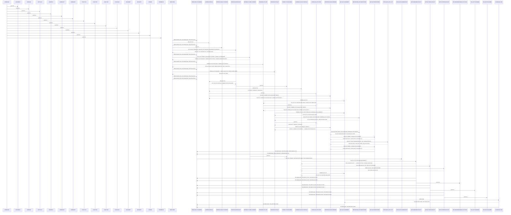

# COPAUS0C

**File:** COPAUS0C.cbl
**Type:** COBOL
**Status:** In Progress
**Iterations:** 1
**Analyzed:** 2026-02-27 14:40:16.903834

## Purpose

COPAUS0C is a CICS program that displays pending authorization summary information for a given account. It retrieves authorization details from an IMS database and presents them on a CICS screen, allowing users to select an authorization for further detail or navigate through multiple pages of authorizations.

**Business Context:** This program is likely used by customer service representatives or fraud analysts to review and manage pending authorizations for customer accounts.
**Program Type:** ONLINE_CICS
**Citations:** Lines 23, 178, 458

## Inputs

### DFHCOMMAREA
- **Type:** CICS_COMMAREA
- **Description:** The COMMAREA receives data from the calling program, including the account ID and program context. It passes data between screens.
- **Copybook:** [CARDDEMO-COMMAREA](../copybooks/CARDDEMO-COMMAREA.cpy.md)
- **Lines:** 193, 200

### PAUTDTL1
- **Type:** IMS_SEGMENT
- **Description:** IMS segment containing pending authorization details.
- **Lines:** 461, 491

## Outputs

### COPAU0AO
- **Type:** CICS_MAP
- **Description:** CICS Map used to display authorization summary information to the user.
- **Lines:** 181, 220, 257, 479, 511

### DFHCOMMAREA
- **Type:** CICS_COMMAREA
- **Description:** The COMMAREA is updated with the current program state and passed to the next program or screen.
- **Copybook:** [CARDDEMO-COMMAREA](../copybooks/CARDDEMO-COMMAREA.cpy.md)
- **Lines:** 259

## Called Programs

| Program | Call Type | Purpose | Line |
|---------|-----------|---------|------|
| [CDEMO-TO-PROGRAM](./CDEMO-TO-PROGRAM.cbl.md) | CICS_XCTL | Transfers control to another CICS program to display authorization details. | 327 |

## Business Rules

### BR001: Account ID must be numeric.
**Logic:** Checks if ACCTIDI of COPAU0AI is numeric.
**Conditions:** IF ACCTIDI OF COPAU0AI IS NOT NUMERIC
**Lines:** 281

### BR002: Selection must be 'S' to view authorization details.
**Logic:** Checks if CDEMO-CPVS-PAU-SEL-FLG is 'S' or 's'.
**Conditions:** EVALUATE CDEMO-CPVS-PAU-SEL-FLG WHEN 'S' WHEN 's'
**Lines:** 320

### BR003: If the page number is greater than 1, decrement the page number and retrieve the previous page's authorization summary.
**Logic:** Checks if CDEMO-CPVS-PAGE-NUM > 1, then decrements it.
**Conditions:** IF CDEMO-CPVS-PAGE-NUM > 1
**Lines:** 364

## Copybooks Used

| Copybook | Location | Purpose | Line |
|----------|----------|---------|------|
| [CARDDEMO-COMMAREA](../copybooks/CARDDEMO-COMMAREA.cpy.md) | LINKAGE | Defines the communication area used to pass data between CICS programs. | 200 |

## Data Flow

### Reads From
- **COPAU0AI**: ACCTIDI, SEL0001I, SEL0002I, SEL0003I, SEL0004I, SEL0005I
  (Lines: 270, 290, 300, 304, 308, 312, 316)
- **PENDING-AUTH-DETAILS**: PA-AUTHORIZATION-KEY, PA-TRANSACTION-ID, PA-AUTH-ORIG-DATE, PA-AUTH-ORIG-TIME, PA-AUTH-TYPE, PA-AUTH-RESP-CODE, PA-MATCH-STATUS, PA-APPROVED-AMT
  (Lines: 530, 540, 541, 542, 543, 544, 545, 546)

### Writes To
- **COPAU0AO**: ACCTIDO, TRNID01I, PDATE01I, PTIME01I, PTYPE01I, PAPRV01I, PSTAT01I, PAMT001I, TRNID02I, PDATE02I, PTIME02I, PTYPE02I, PAPRV02I, PSTAT02I, PAMT002I, TRNID03I, PDATE03I, PTIME03I, PTYPE03I, PAPRV03I, PSTAT03I, PAMT003I, TRNID04I, PDATE04I, PTIME04I, PTYPE04I, PAPRV04I, PSTAT04I, PAMT004I, TRNID05I, PDATE05I, PTIME05I, PTYPE05I, PAPRV05I, PSTAT05I, PAMT005I
  (Lines: 532, 548, 549, 550, 551, 552, 553, 554, 559, 560, 561, 562, 563, 564, 565, 570, 571, 572, 573, 574, 575, 576, 581, 582, 583, 584, 585, 586, 587, 592, 593, 594, 595, 596, 597, 598)

### Transformations
- **PA-APPROVED-AMT** → **WS-AUTH-AMT**: Moves the approved amount to a working storage field for formatting.
  (Lines: 524)
- **PA-AUTH-ORIG-TIME** → **WS-AUTH-TIME**: Formats the authorization time.
  (Lines: 526, 527, 528)
- **PA-AUTH-ORIG-DATE** → **WS-AUTH-DATE**: Formats the authorization date.
  (Lines: 530, 531, 532)
- **PA-AUTH-RESP-CODE** → **WS-AUTH-APRV-STAT**: Converts the authorization response code to an approval status ('A' for approved, 'D' for denied).
  (Lines: 534, 536)

## Key Paragraphs

### COPAUS0C
**Purpose:** This is the program entry point. It doesn't contain any executable logic other than the PROGRAM-ID declaration.
- Lines: 23-23

### MAIN-PARA
**Purpose:** This paragraph is the main control logic for the CICS transaction. It first initializes flags and the screen. If the COMMAREA is empty (EIBCALEN = 0), it initializes the CARDDEMO-COMMAREA, sets the program to the authorization summary screen, and sends the initial screen. Otherwise, it receives the screen input, processes the user's selection based on the EIBAID (AID key pressed), and then sends the updated screen. It handles ENTER, PF3 (return to menu), PF7 (previous page), and PF8 (next page) keys. Invalid key presses result in an error message. Finally, it returns control to CICS with the updated COMMAREA. It consumes the DFHCOMMAREA for input and produces the updated DFHCOMMAREA for output. The paragraph calls SEND-PAULST-SCREEN to display the screen, RECEIVE-PAULST-SCREEN to get user input, PROCESS-ENTER-KEY, PROCESS-PF7-KEY, and PROCESS-PF8-KEY to handle specific key presses, and RETURN-TO-PREV-SCREEN to return to the previous menu.
- Calls: SEND-PAULST-SCREEN, GATHER-DETAILS, SEND-PAULST-SCREEN, RECEIVE-PAULST-SCREEN, PROCESS-ENTER-KEY, SEND-PAULST-SCREEN, RETURN-TO-PREV-SCREEN, SEND-PAULST-SCREEN, PROCESS-PF7-KEY, SEND-PAULST-SCREEN, PROCESS-PF8-KEY, SEND-PAULST-SCREEN
- Lines: 178-260

### PROCESS-ENTER-KEY
**Purpose:** This paragraph processes the ENTER key press. It validates the account ID entered by the user. If the account ID is blank or non-numeric, it sets an error message. If the account ID is valid, it checks if any of the selection fields (SEL0001I to SEL0005I) are selected. If a selection is made, it moves the corresponding authorization key to CDEMO-CPVS-PAU-SELECTED and then XCTLs to the authorization detail program (CDEMO-TO-PROGRAM). If the selection is invalid, it sets an error message. It consumes the account ID and selection fields from COPAU0AI and produces the CDEMO-CPVS-PAU-SELECTED value. It calls GATHER-DETAILS to refresh account details and CDEMO-TO-PROGRAM to transfer to the authorization details screen.
- Called by: MAIN-PARA
- Calls: GATHER-DETAILS
- Lines: 261-341

### GATHER-DETAILS
**Purpose:** This paragraph orchestrates the retrieval of account and authorization details. It resets the ACCTIDL field and the page number. If a valid account ID exists (WS-ACCT-ID is not LOW-VALUES), it performs GATHER-ACCOUNT-DETAILS to retrieve account-specific information. It then performs INITIALIZE-AUTH-DATA to prepare for authorization retrieval. If authorization summary segments are found (FOUND-PAUT-SMRY-SEG), it performs PROCESS-PAGE-FORWARD to retrieve and display the first page of authorizations. It consumes WS-ACCT-ID and produces the initialized authorization data and the first page of authorization details. It calls GATHER-ACCOUNT-DETAILS, INITIALIZE-AUTH-DATA, and PROCESS-PAGE-FORWARD.
- Called by: MAIN-PARA, PROCESS-ENTER-KEY
- Calls: GATHER-ACCOUNT-DETAILS, INITIALIZE-AUTH-DATA, PROCESS-PAGE-FORWARD
- Lines: 342-361

### PROCESS-PF7-KEY
**Purpose:** This paragraph handles the PF7 key press (previous page). If the current page number is greater than 1, it decrements the page number, retrieves the authorization key for the previous page from CDEMO-CPVS-PAUKEY-PREV-PG, and performs GET-AUTH-SUMMARY to retrieve the authorization summary. It then sets the SEND-ERASE-NO flag to prevent erasing the screen and performs INITIALIZE-AUTH-DATA and PROCESS-PAGE-FORWARD to display the previous page of authorizations. If the user is already on the first page, it displays a message indicating that they are at the top of the page. It consumes the current page number and authorization keys and produces the previous page of authorization details. It calls GET-AUTH-SUMMARY, INITIALIZE-AUTH-DATA, and PROCESS-PAGE-FORWARD.
- Called by: MAIN-PARA
- Calls: GET-AUTH-SUMMARY, INITIALIZE-AUTH-DATA, PROCESS-PAGE-FORWARD
- Lines: 362-387

### PROCESS-PF8-KEY
**Purpose:** This paragraph handles the PF8 key press (next page). If the last authorization key (CDEMO-CPVS-PAUKEY-LAST) is not spaces or LOW-VALUES, it moves the last authorization key to WS-AUTH-KEY-SAVE, performs GET-AUTH-SUMMARY to retrieve the authorization summary, and performs REPOSITION-AUTHORIZATIONS to reposition the cursor. It then sets the SEND-ERASE-NO flag. If there is a next page (NEXT-PAGE-YES), it performs INITIALIZE-AUTH-DATA and PROCESS-PAGE-FORWARD to display the next page of authorizations. Otherwise, it displays a message indicating that the user is already at the bottom of the page. It consumes the last authorization key and the NEXT-PAGE-YES flag and produces the next page of authorization details. It calls GET-AUTH-SUMMARY, REPOSITION-AUTHORIZATIONS, INITIALIZE-AUTH-DATA, and PROCESS-PAGE-FORWARD.
- Called by: MAIN-PARA
- Calls: GET-AUTH-SUMMARY, REPOSITION-AUTHORIZATIONS, INITIALIZE-AUTH-DATA, PROCESS-PAGE-FORWARD
- Lines: 388-414

### PROCESS-PAGE-FORWARD
**Purpose:** This paragraph retrieves and displays a page of authorization details. It initializes WS-IDX to 1 and CDEMO-CPVS-PAUKEY-LAST to LOW-VALUES. It then enters a loop that continues until WS-IDX is greater than 5, AUTHS-EOF is true, or ERR-FLG-ON is true. Inside the loop, it either repositions the cursor (if EIBAID is DFHPF7 and WS-IDX is 1) or retrieves the next authorization (GET-AUTHORIZATIONS). If authorizations are not at the end of the file and no errors have occurred, it populates the authorization list (POPULATE-AUTH-LIST), increments WS-IDX, and saves the authorization key. If WS-IDX is 2, it increments the page number and saves the authorization key for the previous page. After the loop, if authorizations are not at the end of the file and no errors have occurred, it retrieves the next authorization and sets the NEXT-PAGE-YES or NEXT-PAGE-NO flag accordingly. It consumes the authorization keys and the AUTHS-EOF and ERR-FLG-ON flags and produces a page of authorization details. It calls REPOSITION-AUTHORIZATIONS, GET-AUTHORIZATIONS, and POPULATE-AUTH-LIST.
- Called by: GATHER-DETAILS, PROCESS-PF7-KEY, PROCESS-PF8-KEY
- Calls: REPOSITION-AUTHORIZATIONS, GET-AUTHORIZATIONS, POPULATE-AUTH-LIST, GET-AUTHORIZATIONS
- Lines: 415-457

### GET-AUTHORIZATIONS
**Purpose:** This paragraph retrieves the next authorization detail segment (PAUTDTL1) from the IMS database using a GNP (Get Next within Parent) call. It moves the DIBSTAT value to IMS-RETURN-CODE and evaluates the status. If the status is OK, it sets AUTHS-NOT-EOF to true. If the status is SEGMENT-NOT-FOUND or END-OF-DB, it sets AUTHS-EOF to true. If any other error occurs, it sets WS-ERR-FLG to 'Y', constructs an error message, and performs SEND-PAULST-SCREEN to display the error. It consumes the PAUT-PCB-NUM and produces the PENDING-AUTH-DETAILS. It calls SEND-PAULST-SCREEN in case of an error.
- Called by: PROCESS-PAGE-FORWARD
- Calls: SEND-PAULST-SCREEN
- Lines: 458-487

### REPOSITION-AUTHORIZATIONS
**Purpose:** This paragraph repositions the cursor in the IMS database to a specific authorization detail segment (PAUTDTL1) based on the WS-AUTH-KEY-SAVE value. It moves the WS-AUTH-KEY-SAVE value to PA-AUTHORIZATION-KEY and then executes a GNP call with a WHERE clause to retrieve the segment matching the authorization key. It moves the DIBSTAT value to IMS-RETURN-CODE and evaluates the status. If the status is OK, it sets AUTHS-NOT-EOF to true. If the status is SEGMENT-NOT-FOUND or END-OF-DB, it sets AUTHS-EOF to true. If any other error occurs, it sets WS-ERR-FLG to 'Y', constructs an error message, and performs SEND-PAULST-SCREEN to display the error. It consumes the WS-AUTH-KEY-SAVE value and produces the PENDING-AUTH-DETAILS. It calls SEND-PAULST-SCREEN in case of an error.
- Called by: PROCESS-PF8-KEY, PROCESS-PAGE-FORWARD
- Calls: SEND-PAULST-SCREEN
- Lines: 488-521

### POPULATE-AUTH-LIST
**Purpose:** This paragraph populates the authorization list on the screen (COPAU0AI) with data from the PENDING-AUTH-DETAILS segment. It moves the approved amount, authorization time, and authorization date to working storage fields for formatting. It converts the authorization response code to an approval status ('A' for approved, 'D' for denied). Based on the value of WS-IDX (1 to 5), it moves the authorization key, transaction ID, date, time, type, approval status, match status, and amount to the corresponding fields in the COPAU0AI map. It also sets the selection attribute (SEL0001A to SEL0005A) to DFHBMUNP (unprotected). It consumes the PENDING-AUTH-DETAILS and WS-IDX values and produces the populated COPAU0AI map. The loop terminates implicitly when WS-IDX exceeds 5 in PROCESS-PAGE-FORWARD at line 424.
- Called by: PROCESS-PAGE-FORWARD
- Lines: 522-607

### INITIALIZE-AUTH-DATA
**Purpose:** This paragraph initializes the authorization data fields in the COPAU0AI map. It iterates through five authorization entries (SEL0001A to SEL0005A) and sets the selection field (SEL00xxA) to 'DFHBMPRO' and all other associated transaction details (TRNIDxxI, PDATExxI, PTIMExxI, PTYPExxI, PAPRVxxI, PSTATxxI, PAMT00xxI) to spaces. This ensures that the screen displays a clean slate of authorization data before populating it with actual values. The paragraph uses a PERFORM VARYING loop and an EVALUATE statement to efficiently process each authorization entry. No files or databases are accessed in this paragraph. The initialized data is stored in the COPAU0AI map, which is later used for screen display.
- Lines: 608-664

### RETURN-TO-PREV-SCREEN
**Purpose:** This paragraph returns control to the previous CICS screen or program. It first checks if CDEMO-TO-PROGRAM is empty; if so, it defaults to 'COSGN00C'. It then moves the current transaction ID (WS-CICS-TRANID) to CDEMO-FROM-TRANID and the current program name (WS-PGM-AUTH-SMRY) to CDEMO-FROM-PROGRAM. The CDEMO-PGM-CONTEXT is set to ZEROS. Finally, it executes a CICS XCTL command to transfer control to the program specified in CDEMO-TO-PROGRAM, passing the CARDDEMO-COMMAREA. This paragraph effectively navigates the user back to the calling program, preserving context through the COMMAREA. No direct file I/O or database access occurs within this paragraph.
- Calls: CDEMO-TO-PROGRAM
- Lines: 665-680

### SEND-PAULST-SCREEN
**Purpose:** This paragraph sends the COPAU0A screen to the terminal. It first checks if IMS-PSB-SCHD is set, and if so, sets IMS-PSB-NOT-SCHD to TRUE and issues a CICS SYNCPOINT command. It then performs the POPULATE-HEADER-INFO paragraph to populate the header fields of the output map. The WS-MESSAGE is moved to ERRMSGO in the COPAU0AO map. Finally, it issues a CICS SEND MAP command to display the COPAU0A mapset COPAU00. The screen is either sent with the ERASE option (if SEND-ERASE-YES is set) or without it. The CURSOR option is always used to position the cursor on the screen. This paragraph is responsible for displaying information to the user and handling IMS PSB synchronization.
- Called by: GETCARDXREF-BYACCT, GETACCTDATA-BYACCT, GETCUSTDATA-BYCUST, GET-AUTH-SUMMARY
- Calls: POPULATE-HEADER-INFO
- Lines: 681-711

### RECEIVE-PAULST-SCREEN
**Purpose:** This paragraph receives data from the COPAU0A screen. It executes a CICS RECEIVE MAP command to receive the data from the COPAU0A mapset COPAU00 into the COPAU0AI input map. The RESP and RESP2 options are used to capture the CICS response codes in WS-RESP-CD and WS-REAS-CD, respectively. This paragraph is responsible for capturing user input from the screen. The received data is stored in the COPAU0AI map for subsequent processing.
- Lines: 712-725

### POPULATE-HEADER-INFO
**Purpose:** This paragraph populates the header information in the output map (COPAU0AO). It retrieves the current date using FUNCTION CURRENT-DATE and moves it to WS-CURDATE-DATA. It then moves CCDA-TITLE01 to TITLE01O, CCDA-TITLE02 to TITLE02O, WS-CICS-TRANID to TRNNAMEO, and WS-PGM-AUTH-SMRY to PGMNAMEO. The current date is formatted into MM/DD/YY format and moved to CURDATEO. The current time is formatted into HH:MM:SS format and moved to CURTIMEO. This paragraph ensures that the screen displays the correct header information, including the title, transaction ID, program name, current date, and current time. No files or databases are accessed in this paragraph.
- Called by: SEND-PAULST-SCREEN
- Lines: 726-749

### GATHER-ACCOUNT-DETAILS
**Purpose:** This paragraph orchestrates the retrieval of account details from various sources. It performs GETCARDXREF-BYACCT to retrieve card cross-reference information, GETACCTDATA-BYACCT to retrieve account data, and GETCUSTDATA-BYCUST to retrieve customer data. It then constructs the customer name (CNAMEO) and address (ADDR001O, ADDR002O) by concatenating fields from the CUSTOMER-RECORD. It moves the customer phone number (CUST-PHONE-NUM-1) to PHONE1O. It moves the account credit limit (ACCT-CREDIT-LIMIT) and cash credit limit (ACCT-CASH-CREDIT-LIMIT) to the corresponding output fields (CREDLIMO, CASHLIMO). Finally, it performs GET-AUTH-SUMMARY to retrieve the authorization summary. If a PAUT-SMRY segment is found, it moves the approved and declined authorization counts and amounts, as well as credit and cash balances, to the corresponding output fields. If no segment is found, it sets these fields to zero. This paragraph consolidates data from multiple sources and prepares it for display on the screen.
- Calls: GETCARDXREF-BYACCT, GETACCTDATA-BYACCT, GETCUSTDATA-BYCUST, GET-AUTH-SUMMARY
- Lines: 750-811

### GETCARDXREF-BYACCT
**Purpose:** This paragraph retrieves the card cross-reference record based on the account ID. It moves the account ID (WS-ACCT-ID) to WS-CARD-RID-ACCT-ID-X and then executes a CICS READ command to read the CARD-XREF-RECORD from the VSAM file specified by WS-CARDXREFNAME-ACCT-PATH, using WS-CARD-RID-ACCT-ID-X as the key. If the read is successful (DFHRESP(NORMAL)), it moves the customer ID (XREF-CUST-ID) to CDEMO-CUST-ID and the card number (XREF-CARD-NUM) to CDEMO-CARD-NUM. If the record is not found (DFHRESP(NOTFND)), it constructs an error message and calls SEND-PAULST-SCREEN to display it. If any other error occurs, it sets WS-ERR-FLG to 'Y', constructs an error message, and calls SEND-PAULST-SCREEN to display it. This paragraph handles the retrieval of card cross-reference data and any associated errors.
- Called by: GATHER-ACCOUNT-DETAILS
- Calls: SEND-PAULST-SCREEN, WS-CARDXREFNAME-ACCT-PATH
- Lines: 812-864

### GETACCTDATA-BYACCT
**Purpose:** This paragraph retrieves the account data record based on the account ID. It moves the account ID (XREF-ACCT-ID) to WS-CARD-RID-ACCT-ID and then executes a CICS READ command to read the ACCOUNT-RECORD from the VSAM file specified by WS-ACCTFILENAME, using WS-CARD-RID-ACCT-ID-X as the key. If the read is successful (DFHRESP(NORMAL)), it continues processing. If the record is not found (DFHRESP(NOTFND)), it constructs an error message and calls SEND-PAULST-SCREEN to display it. If any other error occurs, it sets WS-ERR-FLG to 'Y', constructs an error message, and calls SEND-PAULST-SCREEN to display it. This paragraph handles the retrieval of account data and any associated errors.
- Called by: GATHER-ACCOUNT-DETAILS
- Calls: SEND-PAULST-SCREEN, WS-ACCTFILENAME
- Lines: 865-914

### GETCUSTDATA-BYCUST
**Purpose:** This paragraph retrieves the customer data record based on the customer ID. It moves the customer ID (XREF-CUST-ID) to WS-CARD-RID-CUST-ID and then executes a CICS READ command to read the CUSTOMER-RECORD from the VSAM file specified by WS-CUSTFILENAME, using WS-CARD-RID-CUST-ID-X as the key. If the read is successful (DFHRESP(NORMAL)), it continues processing. If the record is not found (DFHRESP(NOTFND)), it constructs an error message and calls SEND-PAULST-SCREEN to display it. If any other error occurs, it sets WS-ERR-FLG to 'Y', constructs an error message, and calls SEND-PAULST-SCREEN to display it. This paragraph handles the retrieval of customer data and any associated errors.
- Called by: GATHER-ACCOUNT-DETAILS
- Calls: SEND-PAULST-SCREEN, WS-CUSTFILENAME
- Lines: 915-965

### GET-AUTH-SUMMARY
**Purpose:** This paragraph retrieves the authorization summary from the IMS database. It first performs SCHEDULE-PSB to schedule the PSB. It then moves the account ID (CDEMO-ACCT-ID) to PA-ACCT-ID and executes a DL/I GU (Get Unique) command to retrieve the PAUTSUM0 segment from the IMS database, using PA-ACCT-ID as the search criteria. The retrieved segment is placed into PENDING-AUTH-SUMMARY. The IMS return code (DIBSTAT) is moved to IMS-RETURN-CODE. If the status is OK, it sets FOUND-PAUT-SMRY-SEG to TRUE. If the segment is not found, it sets NFOUND-PAUT-SMRY-SEG to TRUE. If any other error occurs, it sets WS-ERR-FLG to 'Y', constructs an error message, and calls SEND-PAULST-SCREEN to display it. This paragraph handles the retrieval of authorization summary data from IMS and any associated errors.
- Called by: GATHER-ACCOUNT-DETAILS
- Calls: SCHEDULE-PSB, SEND-PAULST-SCREEN
- Lines: 966-1000

### SCHEDULE-PSB
**Purpose:** The SCHEDULE-PSB paragraph is responsible for scheduling a Program Specification Block (PSB) for IMS database interaction. It begins by attempting to schedule the PSB using the EXEC DLI SCHD command with the PSB-NAME. The NODHABEND option specifies that the program should not abnormally terminate if the PSB is unavailable. The DIBSTAT field is then moved to IMS-RETURN-CODE to capture the status of the scheduling operation. If the PSB has been scheduled more than once (PSB-SCHEDULED-MORE-THAN-ONCE), the paragraph terminates the current PSB and schedules it again. If the scheduling is successful (STATUS-OK), the IMS-PSB-SCHD flag is set to TRUE. Otherwise, WS-ERR-FLG is set to 'Y', an error message is constructed including the IMS-RETURN-CODE, the ACCTIDL field of COPAU0AI is set to -1, and the SEND-PAULST-SCREEN paragraph is performed to display the error message.
- Calls: SEND-PAULST-SCREEN
- Lines: 1001-1031

## Inter-Paragraph Data Flow

| Caller | Callee | Inputs | Outputs | Purpose |
|--------|--------|--------|---------|---------|
| MAIN-PARA | SEND-PAULST-SCREEN | WS-MESSAGE, SEND-ERASE-YES | - | Sends the PAULST screen to the user, optionally erasing the screen first, and populates header information and error messages. |
| MAIN-PARA | GATHER-DETAILS | WS-ACCT-ID | - | Gathers detailed authorization data for a given account ID if provided, initializing related data structures and processing forward page logic if a segment is found. |
| MAIN-PARA | SEND-PAULST-SCREEN | WS-MESSAGE, SEND-ERASE-YES | - | Sends the PAULST screen to the user, optionally erasing the screen first, and populates header information and error messages. |
| MAIN-PARA | RECEIVE-PAULST-SCREEN | - | - | Receives input from the PAULST screen into the input map COPAU0AI without modifying any working-storage variables directly. |
| MAIN-PARA | PROCESS-ENTER-KEY | ACCTIDI OF COPAU0AI, SEL0001I OF COPAU0AI, SEL0002I OF COPAU0AI, SEL0003I OF COPAU0AI, SEL0004I OF COPAU0AI, SEL0005I OF COPAU0AI, CDEMO-CPVS-AUTH-KEYS | WS-ACCT-ID, WS-ERR-FLG, WS-MESSAGE, CDEMO-ACCT-ID, CDEMO-CPVS-PAU-SEL-FLG, CDEMO-CPVS-PAU-SELECTED, CDEMO-TO-PROGRAM, CDEMO-FROM-TRANID, CDEMO-FROM-PROGRAM, CDEMO-PGM-CONTEXT | Processes the ENTER key press by validating account input, setting selection flags, and potentially XCTLing to another program based on user selection. |
| MAIN-PARA | SEND-PAULST-SCREEN | WS-MESSAGE, SEND-ERASE-YES | - | Sends the PAULST screen to the user, optionally erasing the previous screen, and populates header information and error messages. |
| MAIN-PARA | RETURN-TO-PREV-SCREEN | WS-CICS-TRANID, WS-PGM-AUTH-SMRY, CDEMO-TO-PROGRAM | CDEMO-TO-PROGRAM, CDEMO-FROM-TRANID, CDEMO-FROM-PROGRAM, CDEMO-PGM-CONTEXT | Sets up the COMMAREA to return to the previous program by populating return program, transaction, and context information before issuing an XCTL. |
| MAIN-PARA | SEND-PAULST-SCREEN | WS-MESSAGE, SEND-ERASE-YES | - | Sends the PAULST screen to the user, optionally erasing the previous screen, and populates header information and error messages. |
| MAIN-PARA | PROCESS-PF7-KEY | CDEMO-CPVS-PAGE-NUM, CDEMO-CPVS-PAUKEY-PREV-PG | WS-AUTH-KEY-SAVE, SEND-ERASE-NO, NEXT-PAGE-YES, ACCTIDL, WS-MESSAGE | Processes the PF7 (page up) key by navigating to the previous page of authorization data if available, updating working storage variables accordingly. |
| MAIN-PARA | SEND-PAULST-SCREEN | WS-MESSAGE, SEND-ERASE-YES | - | Sends the PAULST screen to the user, optionally erasing the previous screen, and populates header information and error messages. |
| MAIN-PARA | PROCESS-PF8-KEY | CDEMO-CPVS-PAUKEY-LAST, NEXT-PAGE-YES, WS-AUTH-KEY-SAVE | WS-AUTH-KEY-SAVE | Processes PF8 key press to reposition authorizations or display a message if already at the bottom of the page. |
| MAIN-PARA | SEND-PAULST-SCREEN | SEND-ERASE-YES, WS-MESSAGE, IMS-PSB-SCHD | - | Sends the authorization listing screen to the user, either with an erase or cursor option based on the SEND-ERASE-YES flag. |
| MAIN-PARA | SEND-PAULST-SCREEN | SEND-ERASE-YES, WS-MESSAGE, IMS-PSB-SCHD | - | Sends the authorization listing screen to the user, either with an erase or cursor option based on the SEND-ERASE-YES flag. |
| PROCESS-ENTER-KEY | GATHER-DETAILS | WS-ACCT-ID | ACCTIDL OF COPAU0AI, CDEMO-CPVS-PAGE-NUM | Gathers account and authorization details for the entered account ID, initializing data and processing the forward page if applicable. |
| GATHER-DETAILS | GATHER-ACCOUNT-DETAILS | WS-ACCT-ID | CUSTIDO, PHONE1O, CREDLIMO, CASHLIMO, APPRCNTO, DECLCNTO, CREDBALO, CASHBALO, APPRAMTO, DECLAMTO | Retrieves and populates account, customer, and card cross-reference data along with authorization summary metrics for display. |
| GATHER-DETAILS | INITIALIZE-AUTH-DATA | - | - | Initializes authorization data by clearing screen input fields and setting default values for authorization entries 1 through 5. |
| GATHER-DETAILS | PROCESS-PAGE-FORWARD | WS-IDX, CDEMO-CPVS-PAGE-NUM, EIBAID, ERR-FLG-OFF | WS-IDX, CDEMO-CPVS-PAGE-NUM, CDEMO-CPVS-PAUKEY-LAST, CDEMO-CPVS-PAUKEY-PREV-PG, NEXT-PAGE-YES, NEXT-PAGE-NO | Processes forward paging logic to retrieve and display the next set of authorization records based on user navigation. |
| PROCESS-PF7-KEY | GET-AUTH-SUMMARY | CDEMO-ACCT-ID | PA-ACCT-ID, IMS-RETURN-CODE, FOUND-PAUT-SMRY-SEG, NFOUND-PAUT-SMRY-SEG, WS-ERR-FLG, ACCTIDL | Retrieves the authorization summary segment for a given account ID using IMS DL/I and sets status flags based on the result. |
| PROCESS-PF7-KEY | INITIALIZE-AUTH-DATA | - | - | Resets all authorization entry fields on the screen to spaces and sets default bitmap protection for entries 1 through 5. |
| PROCESS-PF7-KEY | PROCESS-PAGE-FORWARD | WS-IDX, CDEMO-CPVS-PAGE-NUM, EIBAID, ERR-FLG-OFF | WS-IDX, CDEMO-CPVS-PAGE-NUM, CDEMO-CPVS-PAUKEY-LAST, CDEMO-CPVS-PAUKEY-PREV-PG, NEXT-PAGE-YES, NEXT-PAGE-NO | Processes forward paging logic to retrieve and display the next set of authorization records after navigating back a page. |
| PROCESS-PF8-KEY | GET-AUTH-SUMMARY | CDEMO-ACCT-ID, PAUT-PCB-NUM, PENDING-AUTH-SUMMARY, DIBSTAT, IMS-RETURN-CODE | PA-ACCT-ID, IMS-RETURN-CODE | Retrieves the authorization summary segment from the IMS database using the account ID as a key. |
| PROCESS-PF8-KEY | REPOSITION-AUTHORIZATIONS | WS-AUTH-KEY-SAVE, PAUT-PCB-NUM, PENDING-AUTH-DETAIL, DIBSTAT, IMS-RETURN-CODE | PA-AUTHORIZATION-KEY, IMS-RETURN-CODE | Repositions the IMS database cursor to the authorization detail segment corresponding to the saved authorization key. |
| PROCESS-PF8-KEY | INITIALIZE-AUTH-DATA | - | SEL0001A, TRNID01I, PDATE01I, PTIME01I, PTYPE01I, PAPRV01I, PSTAT01I, PAMT001I, SEL0002A, TRNID02I, PDATE02I, PTIME02I, PTYPE02I, PAPRV02I, PSTAT02I, PAMT002I, SEL0003A, TRNID03I, PDATE03I, PTIME03I, PTYPE03I, PAPRV03I, PSTAT03I, PAMT003I, SEL0004A, TRNID04I, PDATE04I, PTIME04I, PTYPE04I, PAPRV04I, PSTAT04I, PAMT004I, SEL0005A, TRNID05I, PDATE05I, PTIME05I, PTYPE05I, PAPRV05I, PSTAT05I, PAMT005I | Initializes the authorization data screen fields by setting selection indicators and clearing transaction details for all five authorization entries. |
| PROCESS-PF8-KEY | PROCESS-PAGE-FORWARD | ERR-FLG-OFF, EIBAID, DFHPF7, WS-IDX, AUTHS-EOF, ERR-FLG-ON, AUTHS-NOT-EOF, ERR-FLG-OFF, PA-AUTHORIZATION-KEY, CDEMO-CPVS-PAGE-NUM, CDEMO-CPVS-PAUKEY-PREV-PG | WS-IDX, CDEMO-CPVS-PAUKEY-LAST, CDEMO-CPVS-PAGE-NUM, CDEMO-CPVS-PAUKEY-PREV-PG, NEXT-PAGE-YES, NEXT-PAGE-NO | Processes forward paging through authorization records by retrieving and populating up to five authorization details starting from the current position. |
| PROCESS-PAGE-FORWARD | REPOSITION-AUTHORIZATIONS | WS-AUTH-KEY-SAVE, PAUT-PCB-NUM, PENDING-AUTH-DETAIL, DIBSTAT, IMS-RETURN-CODE | PA-AUTHORIZATION-KEY, IMS-RETURN-CODE | Repositions the IMS database cursor to the authorization detail segment corresponding to the saved authorization key when navigating pages. |
| PROCESS-PAGE-FORWARD | GET-AUTHORIZATIONS | WS-IDX, EIBAID, CDEMO-CPVS-PAUKEY-LAST | AUTHS-NOT-EOF, AUTHS-EOF, WS-ERR-FLG, IMS-RETURN-CODE | Retrieves the next authorization record from the IMS database and sets EOF or error flags based on the result. |
| PROCESS-PAGE-FORWARD | POPULATE-AUTH-LIST | WS-IDX, PA-AUTHORIZATION-KEY, PA-TRANSACTION-ID, PA-AUTH-ORIG-DATE, PA-AUTH-ORIG-TIME, PA-AUTH-TYPE, PA-AUTH-RESP-CODE, PA-MATCH-STATUS, PA-APPROVED-AMT | WS-AUTH-AMT, WS-AUTH-TIME, WS-AUTH-DATE, WS-AUTH-APRV-STAT, CDEMO-CPVS-AUTH-KEYS, TRNID01I, PDATE01I, PTIME01I, PTYPE01I, PAPRV01I, PSTAT01I, PAMT001I, SEL0001A | Populates the screen fields for a specific authorization entry based on the current index and data from the PA segment. |
| PROCESS-PAGE-FORWARD | GET-AUTHORIZATIONS | WS-IDX, EIBAID, CDEMO-CPVS-PAUKEY-LAST | AUTHS-NOT-EOF, AUTHS-EOF, WS-ERR-FLG, IMS-RETURN-CODE | Retrieves the next authorization record from the IMS database and sets EOF or error flags based on the result. |
| GET-AUTHORIZATIONS | SEND-PAULST-SCREEN | WS-MESSAGE, IMS-PSB-SCHD, SEND-ERASE-YES | - | Sends the authorization list screen to the user, optionally erasing the screen, after an error occurs during authorization retrieval. |
| REPOSITION-AUTHORIZATIONS | SEND-PAULST-SCREEN | WS-MESSAGE, IMS-PSB-SCHD, SEND-ERASE-YES | - | Sends the authorization list screen to the user, optionally erasing the screen, after an error occurs during repositioning of the authorization record. |
| SEND-PAULST-SCREEN | POPULATE-HEADER-INFO | WS-CICS-TRANID, WS-PGM-AUTH-SMRY, WS-CURDATE-DATA, WS-CURDATE-MONTH, WS-CURDATE-DAY, WS-CURDATE-YEAR, WS-CURTIME-HOURS, WS-CURTIME-MINUTE, WS-CURTIME-SECOND | - | Populates the screen header with current date, time, transaction ID, and program name for display. |
| GATHER-ACCOUNT-DETAILS | GETCARDXREF-BYACCT | WS-ACCT-ID, WS-CARDXREFNAME-ACCT-PATH | WS-CARD-RID-ACCT-ID-X, CDEMO-CUST-ID, CDEMO-CARD-NUM | Retrieves customer and card number from the card cross-reference file using the account ID as key. |
| GATHER-ACCOUNT-DETAILS | GETACCTDATA-BYACCT | WS-CARD-RID-ACCT-ID, WS-ACCTFILENAME | - | Reads account data from the ACCTDAT file using the account ID from the cross-reference. |
| GATHER-ACCOUNT-DETAILS | GETCUSTDATA-BYCUST | XREF-CUST-ID, WS-CUSTFILENAME | WS-CARD-RID-CUST-ID | Retrieves customer data from the CUSTDAT file using the customer ID obtained from the card cross-reference. |
| GATHER-ACCOUNT-DETAILS | GET-AUTH-SUMMARY | CDEMO-ACCT-ID | PA-ACCT-ID, IMS-RETURN-CODE | Retrieves the authorization summary segment for the account from IMS using the account ID. |
| GETCARDXREF-BYACCT | SEND-PAULST-SCREEN | WS-MESSAGE, WS-RESP-CD-DIS, WS-REAS-CD-DIS, WS-ACCT-ID, WS-CARD-RID-ACCT-ID-X, WS-ERR-FLG | - | Sends an error screen with a message when the account is not found or a system error occurs during card XREF lookup by account. |
| GETCARDXREF-BYACCT | SEND-PAULST-SCREEN | WS-MESSAGE, WS-RESP-CD-DIS, WS-REAS-CD-DIS, WS-ACCT-ID, WS-CARD-RID-ACCT-ID-X, WS-ERR-FLG | - | Sends an error screen with a message when the account is not found or a system error occurs during card XREF lookup by account. |
| GETACCTDATA-BYACCT | SEND-PAULST-SCREEN | WS-MESSAGE, WS-RESP-CD-DIS, WS-REAS-CD-DIS, WS-CARD-RID-ACCT-ID-X, WS-ERR-FLG | - | Sends an error screen with a message when the account is not found or a system error occurs during account data lookup by account ID. |
| GETACCTDATA-BYACCT | SEND-PAULST-SCREEN | WS-MESSAGE, WS-RESP-CD-DIS, WS-REAS-CD-DIS, WS-CARD-RID-ACCT-ID-X, WS-ERR-FLG | - | Sends an error screen with a message when the account is not found or a system error occurs during account data lookup by account ID. |
| GETCUSTDATA-BYCUST | SEND-PAULST-SCREEN | WS-MESSAGE, WS-RESP-CD-DIS, WS-REAS-CD-DIS, WS-CARD-RID-CUST-ID-X, WS-ERR-FLG | - | Sends an error screen with a message when the customer is not found or a system error occurs during customer data lookup by customer ID. |
| GETCUSTDATA-BYCUST | SEND-PAULST-SCREEN | WS-MESSAGE, WS-RESP-CD-DIS, WS-REAS-CD-DIS, WS-CARD-RID-CUST-ID-X | - | Sends an error screen with a message when a customer is not found or a system error occurs during customer data retrieval. |
| GET-AUTH-SUMMARY | SCHEDULE-PSB | PSB-NAME | IMS-RETURN-CODE, IMS-PSB-SCHD | Schedules the PSB for IMS processing before attempting to retrieve the authorization summary segment. |
| GET-AUTH-SUMMARY | SEND-PAULST-SCREEN | WS-MESSAGE, IMS-RETURN-CODE | - | Displays an error screen when a system error occurs while reading the authorization summary segment. |
| SCHEDULE-PSB | SEND-PAULST-SCREEN | WS-MESSAGE, IMS-RETURN-CODE | - | Sends an error screen if the PSB scheduling fails with a system error. |

## Error Handling

- **ACCTIDI OF COPAU0AI = SPACES OR LOW-VALUES:** Sets an error message indicating that the account ID must be entered.
  (Lines: 270, 273)
- **ACCTIDI OF COPAU0AI IS NOT NUMERIC:** Sets an error message indicating that the account ID must be numeric.
  (Lines: 281, 284)
- **Invalid selection:** Sets an error message indicating that the selection is invalid.
  (Lines: 332, 334)
- **DIBSTAT not OK, SEGMENT-NOT-FOUND, or END-OF-DB in GET-AUTHORIZATIONS:** Sets an error message with the IMS return code and displays it on the screen.
  (Lines: 471, 473, 476)
- **DIBSTAT not OK, SEGMENT-NOT-FOUND, or END-OF-DB in REPOSITION-AUTHORIZATIONS:** Sets an error message with the IMS return code and displays it on the screen.
  (Lines: 503, 505, 508)

## CICS Operations

| Command | Resource | Purpose | Line |
|---------|----------|---------|------|
| RETURN |  | Returns control to CICS. | 258 |
| XCTL | CDEMO-TO-PROGRAM | Transfers control to another CICS program. | 327 |

## Open Questions

- **What is the purpose of the INITIALIZE-AUTH-DATA paragraph? It is called in several places but not defined in the provided code.**
  - Context: The paragraph is called but its functionality is unknown.
  - Suggestion: Examine the source code or related documentation for the INITIALIZE-AUTH-DATA paragraph.

## Resolved Questions

- **Q:** What is the exact format of the CICS map COPAU0AO?
  **A:** The search results show that `COPAU0AO` is a CICS map used by `COPAUS0C`. The code moves data to fields within `COPAU0AO` such as `ERRMSGO`, `ACCTIDO`, `TITLE01O`, `TITLE02O`, `TRNNAMEO`, `PGMNAMEO`, `CURDATEO`, and `CURTIMEO`. It also sends the map `COPAU0A` from mapset `COPAU00` using `COPAU0AO` as the `FROM` parameter in the `EXEC CICS SEND` command.

To determine the exact format of the CICS map `COPAU0AO`, I need to find its definition. CICS maps are typically defined in BMS (Basic Mapping Support) macro definitions. I'll search for files with a `.bms` extension that define `COPAU0A`.
- **Q:** What is the structure and purpose of the PAUT-PCB-NUM?
  **A:** The code search results show that `PAUT-PCB-NUM` is defined as a `PIC S9(4) COMP VALUE +1` within `WS-IMS-VARIABLES`. It's used in `EXEC DLI` commands, specifically `GNP` (Get Next within Parent) and `GU` (Get Unique), as the PCB (Program Communication Block) number. In IMS, the PCB number indicates which database the program is accessing. Since it's initialized to +1, it likely refers to the first PCB defined in the PSB (Program Specification Block), which is named `PSBPAUTB`. Therefore, `PAUT-PCB-NUM` is a numeric field that specifies the PCB number for accessing the IMS database related to pending authorizations.

## Sequence Diagram

```mermaid
sequenceDiagram
    participant COPAUS0C as COPAUS0C
    participant COCOM01Y as COCOM01Y
    participant COPAU00 as COPAU00
    participant COTTL01Y as COTTL01Y
    participant CSDAT01Y as CSDAT01Y
    participant CSMSG01Y as CSMSG01Y
    participant CSMSG02Y as CSMSG02Y
    participant CVACT01Y as CVACT01Y
    participant CVACT02Y as CVACT02Y
    participant CVACT03Y as CVACT03Y
    participant CVCUS01Y as CVCUS01Y
    participant CIPAUSMY as CIPAUSMY
    participant CIPAUDTY as CIPAUDTY
    participant DFHAID as DFHAID
    participant DFHBMSCA as DFHBMSCA
    participant MAIN_PARA as MAIN-PARA
    participant SEND_PAULST_SCREEN as SEND-PAULST-SCREEN
    participant GATHER_DETAILS as GATHER-DETAILS
    participant RECEIVE_PAULST_SCREEN as RECEIVE-PAULST-SCREEN
    participant PROCESS_ENTER_KEY as PROCESS-ENTER-KEY
    participant RETURN_TO_PREV_SCREEN as RETURN-TO-PREV-SCREEN
    participant PROCESS_PF7_KEY as PROCESS-PF7-KEY
    participant PROCESS_PF8_KEY as PROCESS-PF8-KEY
    participant CDEMO_TO_PROGRAM as CDEMO-TO-PROGRAM
    participant GATHER_ACCOUNT_DETAILS as GATHER-ACCOUNT-DETAILS
    participant INITIALIZE_AUTH_DATA as INITIALIZE-AUTH-DATA
    participant PROCESS_PAGE_FORWARD as PROCESS-PAGE-FORWARD
    participant GET_AUTH_SUMMARY as GET-AUTH-SUMMARY
    participant REPOSITION_AUTHORIZATIONS as REPOSITION-AUTHORIZATIONS
    participant GET_AUTHORIZATIONS as GET-AUTHORIZATIONS
    participant POPULATE_AUTH_LIST as POPULATE-AUTH-LIST
    participant POPULATE_HEADER_INFO as POPULATE-HEADER-INFO
    participant GETCARDXREF_BYACCT as GETCARDXREF-BYACCT
    participant GETACCTDATA_BYACCT as GETACCTDATA-BYACCT
    participant GETCUSTDATA_BYCUST as GETCUSTDATA-BYCUST
    participant WS_CARDXREFNAME_ACCT_PATH as WS-CARDXREFNAME-ACCT-PATH
    participant WS_ACCTFILENAME as WS-ACCTFILENAME
    participant WS_CUSTFILENAME as WS-CUSTFILENAME
    participant SCHEDULE_PSB as SCHEDULE-PSB
    COPAUS0C->>COCOM01Y: performs
    COPAUS0C->>COPAU00: performs
    COPAUS0C->>COTTL01Y: performs
    COPAUS0C->>CSDAT01Y: performs
    COPAUS0C->>CSMSG01Y: performs
    COPAUS0C->>CSMSG02Y: performs
    COPAUS0C->>CVACT01Y: performs
    COPAUS0C->>CVACT02Y: performs
    COPAUS0C->>CVACT03Y: performs
    COPAUS0C->>CVCUS01Y: performs
    COPAUS0C->>CIPAUSMY: performs
    COPAUS0C->>CIPAUDTY: performs
    COPAUS0C->>DFHAID: performs
    COPAUS0C->>DFHBMSCA: performs
    MAIN_PARA->>SEND_PAULST_SCREEN: SEND-ERASE-YES / WS-MESSAGE / IMS-PSB-SCHD
    MAIN_PARA->>GATHER_DETAILS: WS-ACCT-ID
    MAIN_PARA->>SEND_PAULST_SCREEN: SEND-ERASE-YES / WS-MESSAGE / IMS-PSB-SCHD
    MAIN_PARA->>RECEIVE_PAULST_SCREEN: performs
    MAIN_PARA->>PROCESS_ENTER_KEY: ACCTIDI OF COPAU0AI / SEL0001I OF COPAU0AI / SEL0002I OF COPAU0AI...
    PROCESS_ENTER_KEY-->>MAIN_PARA: WS-ACCT-ID / WS-ERR-FLG / WS-MESSAGE...
    MAIN_PARA->>SEND_PAULST_SCREEN: SEND-ERASE-YES / WS-MESSAGE / IMS-PSB-SCHD
    MAIN_PARA->>RETURN_TO_PREV_SCREEN: WS-CICS-TRANID / WS-PGM-AUTH-SMRY / CDEMO-TO-PROGRAM
    RETURN_TO_PREV_SCREEN-->>MAIN_PARA: CDEMO-TO-PROGRAM / CDEMO-FROM-TRANID / CDEMO-FROM-PROGRAM...
    MAIN_PARA->>SEND_PAULST_SCREEN: SEND-ERASE-YES / WS-MESSAGE / IMS-PSB-SCHD
    MAIN_PARA->>PROCESS_PF7_KEY: CDEMO-CPVS-PAGE-NUM / CDEMO-CPVS-PAUKEY...
    PROCESS_PF7_KEY-->>MAIN_PARA: WS-AUTH-KEY-SAVE / SEND-ERASE-NO / NEXT-PAGE-YES...
    MAIN_PARA->>SEND_PAULST_SCREEN: SEND-ERASE-YES / WS-MESSAGE / IMS-PSB-SCHD
    MAIN_PARA->>PROCESS_PF8_KEY: CDEMO-CPVS-PAUKEY... / NEXT-PAGE-YES / WS-AUTH-KEY-SAVE
    PROCESS_PF8_KEY-->>MAIN_PARA: WS-AUTH-KEY-SAVE
    MAIN_PARA->>SEND_PAULST_SCREEN: SEND-ERASE-YES / WS-MESSAGE / IMS-PSB-SCHD
    MAIN_PARA->>SEND_PAULST_SCREEN: SEND-ERASE-YES / WS-MESSAGE / IMS-PSB-SCHD
    PROCESS_ENTER_KEY->>GATHER_DETAILS: WS-ACCT-ID
    GATHER_DETAILS-->>PROCESS_ENTER_KEY: ACCTIDL OF COPAU0AI / CDEMO-CPVS-PAGE-NUM
    PROCESS_ENTER_KEY->>CDEMO_TO_PROGRAM: performs
    GATHER_DETAILS->>GATHER_ACCOUNT_DETAILS: WS-ACCT-ID
    GATHER_ACCOUNT_DETAILS-->>GATHER_DETAILS: CUSTIDO / PHONE1O / CREDLIMO...
    GATHER_DETAILS->>INITIALIZE_AUTH_DATA: performs
    GATHER_DETAILS->>PROCESS_PAGE_FORWARD: WS-IDX / CDEMO-CPVS-PAGE-NUM / EIBAID...
    PROCESS_PAGE_FORWARD-->>GATHER_DETAILS: WS-IDX / CDEMO-CPVS-PAGE-NUM / CDEMO-CPVS-PAUKEY......
    PROCESS_PF7_KEY->>GET_AUTH_SUMMARY: CDEMO-ACCT-ID
    GET_AUTH_SUMMARY-->>PROCESS_PF7_KEY: PA-ACCT-ID / IMS-RETURN-CODE / FOUND-PAUT-SMRY-SEG...
    PROCESS_PF7_KEY->>INITIALIZE_AUTH_DATA: performs
    PROCESS_PF7_KEY->>PROCESS_PAGE_FORWARD: WS-IDX / CDEMO-CPVS-PAGE-NUM / EIBAID...
    PROCESS_PAGE_FORWARD-->>PROCESS_PF7_KEY: WS-IDX / CDEMO-CPVS-PAGE-NUM / CDEMO-CPVS-PAUKEY......
    PROCESS_PF8_KEY->>GET_AUTH_SUMMARY: CDEMO-ACCT-ID / PAUT-PCB-NUM / PENDING-AUTH-SUMMARY...
    GET_AUTH_SUMMARY-->>PROCESS_PF8_KEY: PA-ACCT-ID / IMS-RETURN-CODE
    PROCESS_PF8_KEY->>REPOSITION_AUTHORIZATIONS: WS-AUTH-KEY-SAVE / PAUT-PCB-NUM / PENDING-AUTH-DETAIL...
    REPOSITION_AUTHORIZATIONS-->>PROCESS_PF8_KEY: PA-AUTHORIZATION-KEY / IMS-RETURN-CODE
    PROCESS_PF8_KEY->>INITIALIZE_AUTH_DATA: performs
    INITIALIZE_AUTH_DATA-->>PROCESS_PF8_KEY: SEL0001A / TRNID01I / PDATE01I...
    PROCESS_PF8_KEY->>PROCESS_PAGE_FORWARD: ERR-FLG-OFF / EIBAID / DFHPF7...
    PROCESS_PAGE_FORWARD-->>PROCESS_PF8_KEY: WS-IDX / CDEMO-CPVS-PAUKEY... / CDEMO-CPVS-PAGE-NUM...
    PROCESS_PAGE_FORWARD->>REPOSITION_AUTHORIZATIONS: WS-AUTH-KEY-SAVE / PAUT-PCB-NUM / PENDING-AUTH-DETAIL...
    REPOSITION_AUTHORIZATIONS-->>PROCESS_PAGE_FORWARD: PA-AUTHORIZATION-KEY / IMS-RETURN-CODE
    PROCESS_PAGE_FORWARD->>GET_AUTHORIZATIONS: WS-IDX / EIBAID / CDEMO-CPVS-PAUKEY...
    GET_AUTHORIZATIONS-->>PROCESS_PAGE_FORWARD: AUTHS-NOT-EOF / AUTHS-EOF / WS-ERR-FLG...
    PROCESS_PAGE_FORWARD->>POPULATE_AUTH_LIST: WS-IDX / PA-AUTHORIZATION-KEY / PA-TRANSACTION-ID...
    POPULATE_AUTH_LIST-->>PROCESS_PAGE_FORWARD: WS-AUTH-AMT / WS-AUTH-TIME / WS-AUTH-DATE...
    PROCESS_PAGE_FORWARD->>GET_AUTHORIZATIONS: WS-IDX / EIBAID / CDEMO-CPVS-PAUKEY...
    GET_AUTHORIZATIONS-->>PROCESS_PAGE_FORWARD: AUTHS-NOT-EOF / AUTHS-EOF / WS-ERR-FLG...
    GET_AUTHORIZATIONS->>SEND_PAULST_SCREEN: WS-MESSAGE / IMS-PSB-SCHD / SEND-ERASE-YES
    REPOSITION_AUTHORIZATIONS->>SEND_PAULST_SCREEN: WS-MESSAGE / IMS-PSB-SCHD / SEND-ERASE-YES
    RETURN_TO_PREV_SCREEN->>CDEMO_TO_PROGRAM: performs
    SEND_PAULST_SCREEN->>POPULATE_HEADER_INFO: WS-CICS-TRANID / WS-PGM-AUTH-SMRY / WS-CURDATE-DATA...
    GATHER_ACCOUNT_DETAILS->>GETCARDXREF_BYACCT: WS-ACCT-ID / WS-CARDXREFNAME-A...
    GETCARDXREF_BYACCT-->>GATHER_ACCOUNT_DETAILS: WS-CARD-RID-ACCT-... / CDEMO-CUST-ID / CDEMO-CARD-NUM
    GATHER_ACCOUNT_DETAILS->>GETACCTDATA_BYACCT: WS-CARD-RID-ACCT-ID / WS-ACCTFILENAME
    GATHER_ACCOUNT_DETAILS->>GETCUSTDATA_BYCUST: XREF-CUST-ID / WS-CUSTFILENAME
    GETCUSTDATA_BYCUST-->>GATHER_ACCOUNT_DETAILS: WS-CARD-RID-CUST-ID
    GATHER_ACCOUNT_DETAILS->>GET_AUTH_SUMMARY: CDEMO-ACCT-ID
    GET_AUTH_SUMMARY-->>GATHER_ACCOUNT_DETAILS: PA-ACCT-ID / IMS-RETURN-CODE
    GETCARDXREF_BYACCT->>SEND_PAULST_SCREEN: WS-MESSAGE / WS-RESP-CD-DIS / WS-REAS-CD-DIS...
    GETCARDXREF_BYACCT->>SEND_PAULST_SCREEN: WS-MESSAGE / WS-RESP-CD-DIS / WS-REAS-CD-DIS...
    GETCARDXREF_BYACCT->>WS_CARDXREFNAME_ACCT_PATH: performs
    GETACCTDATA_BYACCT->>SEND_PAULST_SCREEN: WS-MESSAGE / WS-RESP-CD-DIS / WS-REAS-CD-DIS...
    GETACCTDATA_BYACCT->>SEND_PAULST_SCREEN: WS-MESSAGE / WS-RESP-CD-DIS / WS-REAS-CD-DIS...
    GETACCTDATA_BYACCT->>WS_ACCTFILENAME: performs
    GETCUSTDATA_BYCUST->>SEND_PAULST_SCREEN: WS-MESSAGE / WS-RESP-CD-DIS / WS-REAS-CD-DIS...
    GETCUSTDATA_BYCUST->>SEND_PAULST_SCREEN: WS-MESSAGE / WS-RESP-CD-DIS / WS-REAS-CD-DIS...
    GETCUSTDATA_BYCUST->>WS_CUSTFILENAME: performs
    GET_AUTH_SUMMARY->>SCHEDULE_PSB: PSB-NAME
    SCHEDULE_PSB-->>GET_AUTH_SUMMARY: IMS-RETURN-CODE / IMS-PSB-SCHD
    GET_AUTH_SUMMARY->>SEND_PAULST_SCREEN: WS-MESSAGE / IMS-RETURN-CODE
    SCHEDULE_PSB->>SEND_PAULST_SCREEN: WS-MESSAGE / IMS-RETURN-CODE
```

---
*Generated by War Rig WAR_RIG*