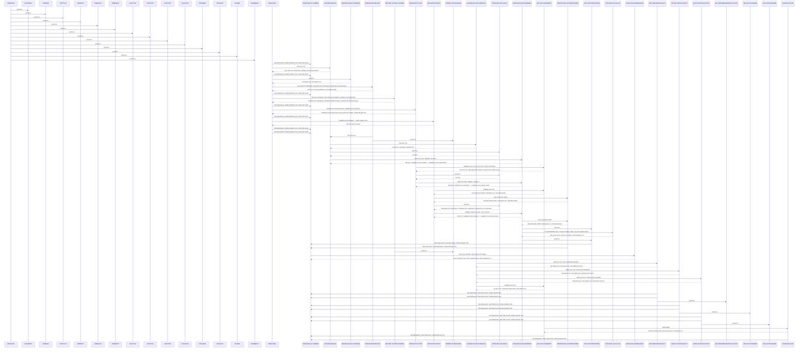

# COPAUS0C

**File:** COPAUS0C.cbl
**Type:** COBOL
**Status:** In Progress
**Iterations:** 1
**Analyzed:** 2026-03-04 04:50:15.216468

## Purpose

This is an empty COBOL program. It does not perform any operations or contain any logic.
**Program Type:** BATCH
**Citations:** Lines 1

## Key Paragraphs

### COPAUS0C
**Purpose:** This is the main program paragraph and serves as the entry point for the CICS transaction. It does not contain any executable code, but it is required for the COBOL program structure.
- Lines: 23-23

### MAIN-PARA
**Purpose:** This paragraph controls the main flow of the CICS transaction. It first checks if the commarea (EIBCALEN) is empty, indicating a first-time call. If so, it initializes the CARDDEMO-COMMAREA, sets the program context, and sends the initial screen (COPAU0AO) using SEND-PAULST-SCREEN. If the commarea is not empty, it means the program is re-entering, so it receives the screen input (COPAU0AI) using RECEIVE-PAULST-SCREEN. Based on the EIBAID (AID key pressed), it performs different actions: DFHENTER calls PROCESS-ENTER-KEY to validate the account ID and selection, DFHPF3 calls RETURN-TO-PREV-SCREEN to return to the previous menu, DFHPF7 calls PROCESS-PF7-KEY to navigate to the previous page, DFHPF8 calls PROCESS-PF8-KEY to navigate to the next page, and OTHER displays an error message. Finally, it returns to CICS with the updated commarea.
- Calls: SEND-PAULST-SCREEN, GATHER-DETAILS, SEND-PAULST-SCREEN, RECEIVE-PAULST-SCREEN, PROCESS-ENTER-KEY, SEND-PAULST-SCREEN, RETURN-TO-PREV-SCREEN, SEND-PAULST-SCREEN, PROCESS-PF7-KEY, SEND-PAULST-SCREEN, PROCESS-PF8-KEY, SEND-PAULST-SCREEN
- Lines: 178-260

### PROCESS-ENTER-KEY
**Purpose:** This paragraph processes the user's input after pressing the ENTER key. It validates the account ID entered on the screen (COPAU0AI). If the account ID is spaces, LOW-VALUES, or non-numeric, it sets an error flag (WS-ERR-FLG) and displays an appropriate error message. If the account ID is valid, it moves the account ID to WS-ACCT-ID and CDEMO-ACCT-ID. It then evaluates the selection fields (SEL0001I - SEL0005I) to determine which authorization was selected. If a valid authorization is selected ('S'), it sets up the commarea and XCTLs to the authorization detail program (CDEMO-TO-PROGRAM). If an invalid selection is made, it displays an error message. Finally, it calls GATHER-DETAILS to refresh the authorization summary.
- Called by: MAIN-PARA
- Calls: GATHER-DETAILS, CDEMO-TO-PROGRAM
- Lines: 261-341

### GATHER-DETAILS
**Purpose:** This paragraph orchestrates the retrieval of account and authorization details. It first moves -1 to ACCTIDL of COPAU0AI and 0 to CDEMO-CPVS-PAGE-NUM. If WS-ACCT-ID is not LOW-VALUES, it calls GATHER-ACCOUNT-DETAILS to retrieve account-specific details. Then, it calls INITIALIZE-AUTH-DATA to initialize authorization data. If FOUND-PAUT-SMRY-SEG is true, it calls PROCESS-PAGE-FORWARD to process and display the authorization data page by page.
- Called by: MAIN-PARA, PROCESS-ENTER-KEY
- Calls: GATHER-ACCOUNT-DETAILS, INITIALIZE-AUTH-DATA, PROCESS-PAGE-FORWARD
- Lines: 342-361

### PROCESS-PF7-KEY
**Purpose:** This paragraph handles the processing when the PF7 key (previous page) is pressed. It checks if the current page number (CDEMO-CPVS-PAGE-NUM) is greater than 1. If it is, it decrements the page number, retrieves the authorization key for the previous page from CDEMO-CPVS-PAUKEY-PREV-PG, and moves it to WS-AUTH-KEY-SAVE. It then calls GET-AUTH-SUMMARY and INITIALIZE-AUTH-DATA to prepare for displaying the previous page. Finally, it calls PROCESS-PAGE-FORWARD to display the previous page of authorizations. If the user is already on the first page, it displays a message indicating they are at the top of the page.
- Called by: MAIN-PARA
- Calls: GET-AUTH-SUMMARY, INITIALIZE-AUTH-DATA, PROCESS-PAGE-FORWARD
- Lines: 362-387

### PROCESS-PF8-KEY
**Purpose:** This paragraph handles the processing when the PF8 key (next page) is pressed. It checks if the last authorization key (CDEMO-CPVS-PAUKEY-LAST) is SPACES or LOW-VALUES. If it is, it means there are no more authorizations to display, so it moves LOW-VALUES to WS-AUTH-KEY-SAVE. Otherwise, it moves CDEMO-CPVS-PAUKEY-LAST to WS-AUTH-KEY-SAVE, calls GET-AUTH-SUMMARY and REPOSITION-AUTHORIZATIONS to position to the last authorization. It then calls INITIALIZE-AUTH-DATA to initialize authorization data. If NEXT-PAGE-YES is set, it calls PROCESS-PAGE-FORWARD to display the next page of authorizations. If NEXT-PAGE-NO is set, it displays a message indicating they are at the bottom of the page.
- Called by: MAIN-PARA
- Calls: GET-AUTH-SUMMARY, REPOSITION-AUTHORIZATIONS, INITIALIZE-AUTH-DATA, PROCESS-PAGE-FORWARD
- Lines: 388-414

### PROCESS-PAGE-FORWARD
**Purpose:** This paragraph processes and displays a page of authorizations. It initializes WS-IDX to 1 and CDEMO-CPVS-PAUKEY-LAST to LOW-VALUES. It then enters a loop that continues until WS-IDX is greater than 5, AUTHS-EOF is true, or ERR-FLG-ON is true. Inside the loop, it calls REPOSITION-AUTHORIZATIONS if EIBAID is DFHPF7 and WS-IDX is 1, otherwise it calls GET-AUTHORIZATIONS to retrieve the next authorization. If AUTHS-NOT-EOF and ERR-FLG-OFF are true, it calls POPULATE-AUTH-LIST to populate the screen fields with the authorization data, increments WS-IDX, and moves the PA-AUTHORIZATION-KEY to CDEMO-CPVS-PAUKEY-LAST. If WS-IDX is 2, it increments CDEMO-CPVS-PAGE-NUM and moves PA-AUTHORIZATION-KEY to CDEMO-CPVS-PAUKEY-PREV-PG. After the loop, if AUTHS-NOT-EOF and ERR-FLG-OFF are true, it calls GET-AUTHORIZATIONS to check if there are more authorizations. If there are, it sets NEXT-PAGE-YES to true, otherwise it sets NEXT-PAGE-NO to true.
- Called by: GATHER-DETAILS, PROCESS-PF7-KEY, PROCESS-PF8-KEY
- Calls: REPOSITION-AUTHORIZATIONS, GET-AUTHORIZATIONS, POPULATE-AUTH-LIST, GET-AUTHORIZATIONS
- Lines: 415-457

### GET-AUTHORIZATIONS
**Purpose:** This paragraph retrieves the next authorization detail segment (PAUTDTL1) from the IMS database using a GNP (Get Next within Parent) call. It moves the DIBSTAT (IMS return code) to IMS-RETURN-CODE. If the status is STATUS-OK, it sets AUTHS-NOT-EOF to true. If the status is SEGMENT-NOT-FOUND or END-OF-DB, it sets AUTHS-EOF to true. If the status is OTHER, it sets WS-ERR-FLG to 'Y', constructs an error message containing the IMS return code, and calls SEND-PAULST-SCREEN to display the error message.
- Called by: PROCESS-PAGE-FORWARD
- Calls: SEND-PAULST-SCREEN
- Lines: 458-487

### REPOSITION-AUTHORIZATIONS
**Purpose:** This paragraph repositions the IMS database to a specific authorization detail segment (PAUTDTL1) based on the authorization key (WS-AUTH-KEY-SAVE). It moves WS-AUTH-KEY-SAVE to PA-AUTHORIZATION-KEY and then uses a GNP (Get Next within Parent) call with a WHERE clause to retrieve the segment. It moves the DIBSTAT (IMS return code) to IMS-RETURN-CODE. If the status is STATUS-OK, it sets AUTHS-NOT-EOF to true. If the status is SEGMENT-NOT-FOUND or END-OF-DB, it sets AUTHS-EOF to true. If the status is OTHER, it sets WS-ERR-FLG to 'Y', constructs an error message containing the IMS return code, and calls SEND-PAULST-SCREEN to display the error message.
- Called by: PROCESS-PF8-KEY, PROCESS-PAGE-FORWARD
- Calls: SEND-PAULST-SCREEN
- Lines: 488-521

### POPULATE-AUTH-LIST
**Purpose:** This paragraph populates the CICS screen (COPAU0AI) with authorization data retrieved from the PAUTDTL1 segment. It moves the approved amount (PA-APPROVED-AMT) to WS-AUTH-AMT. It reformats the authorization original time (PA-AUTH-ORIG-TIME) and date (PA-AUTH-ORIG-DATE) into WS-AUTH-TIME and WS-AUTH-DATE, respectively. It sets the authorization approval status (WS-AUTH-APRV-STAT) to 'A' if the response code (PA-AUTH-RESP-CODE) is '00', otherwise it sets it to 'D'. Based on the current index (WS-IDX), it moves the authorization key (PA-AUTHORIZATION-KEY), transaction ID (PA-TRANSACTION-ID), authorization date (WS-AUTH-DATE), authorization time (WS-AUTH-TIME), authorization type (PA-AUTH-TYPE), authorization approval status (WS-AUTH-APRV-STAT), match status (PA-MATCH-STATUS), and authorization amount (WS-AUTH-AMT) to the corresponding fields in the COPAU0AI map. It also sets the unprotect attribute (DFHBMUNP) for the selection field (SEL0001A - SEL0005A) to allow the user to select the authorization.
- Called by: PROCESS-PAGE-FORWARD
- Lines: 522-607

### INITIALIZE-AUTH-DATA
**Purpose:** This paragraph initializes the authorization data fields in the COPAU0AI map. It iterates through five authorization slots (SEL0001A to SEL0005A) and sets the corresponding transaction ID (TRNIDnnI), date (PDATEnnI), time (PTIMEnnI), type (PTYPEnnI), approval (PAPRVnnI), status (PSTATnnI), and amount (PAMT00nI) fields to spaces. The SEL000nA field is initialized to DFHBMPRO. This initialization ensures that the screen displays empty values for authorization details when no data is available. The paragraph uses a PERFORM VARYING loop to iterate through the authorization slots and an EVALUATE statement to set the values for each slot individually. No error handling is performed in this paragraph, and no other paragraphs or programs are called.
- Lines: 1-55

### RETURN-TO-PREV-SCREEN
**Purpose:** This paragraph handles the return to the previous screen by transferring control to another CICS program. It first checks if the CDEMO-TO-PROGRAM field is empty (LOW-VALUES or SPACES). If it is, it defaults the target program to 'COSGN00C'. It then moves the current transaction ID (WS-CICS-TRANID) to CDEMO-FROM-TRANID, the program ID (WS-PGM-AUTH-SMRY) to CDEMO-FROM-PROGRAM, and sets CDEMO-PGM-CONTEXT to ZEROS. Finally, it executes a CICS XCTL command to transfer control to the program specified in CDEMO-TO-PROGRAM, passing the CARDDEMO-COMMAREA as the communication area. This allows the user to navigate back to the calling screen while preserving context information. No specific error handling is implemented within this paragraph.
- Calls: CDEMO-TO-PROGRAM
- Lines: 57-70

### SEND-PAULST-SCREEN
**Purpose:** This paragraph sends the COPAU0A screen to the terminal. It first checks if IMS-PSB-SCHD is set to true, indicating that an IMS PSB schedule is active. If so, it sets IMS-PSB-NOT-SCHD to true and issues a CICS SYNCPOINT command. Then, it calls the POPULATE-HEADER-INFO paragraph to populate the header information on the screen. It moves the WS-MESSAGE to the ERRMSGO field in the COPAU0AO map. Finally, it sends the COPAU0A map using the CICS SEND command. If SEND-ERASE-YES is true, the screen is erased before sending the map; otherwise, the screen is not erased. The CURSOR option is used to position the cursor on the screen. The paragraph handles IMS PSB scheduling and screen erasure before sending the map.
- Called by: GETCARDXREF-BYACCT, GETACCTDATA-BYACCT, GETCUSTDATA-BYCUST, GET-AUTH-SUMMARY
- Calls: POPULATE-HEADER-INFO
- Lines: 71-99

### RECEIVE-PAULST-SCREEN
**Purpose:** This paragraph receives data from the COPAU0A screen. It executes a CICS RECEIVE command to receive the map COPAU0A from mapset COPAU00 into the COPAU0AI structure. The RESP and RESP2 options are used to capture the CICS response codes in WS-RESP-CD and WS-REAS-CD, respectively. This paragraph retrieves the data entered by the user on the screen, such as the account ID, which is then used in subsequent processing steps. No specific data validation or error handling is performed within this paragraph; the response codes are checked in the calling paragraphs. The received data is stored in the COPAU0AI map for further processing.
- Lines: 101-111

### POPULATE-HEADER-INFO
**Purpose:** This paragraph populates the header information on the COPAU0AO map. It moves the current date to WS-CURDATE-DATA using the FUNCTION CURRENT-DATE. It then moves CCDA-TITLE01 and CCDA-TITLE02 to TITLE01O and TITLE02O, respectively. The transaction ID (WS-CICS-TRANID) is moved to TRNNAMEO, and the program ID (WS-PGM-AUTH-SMRY) is moved to PGMNAMEO. The current date is then formatted into MM-DD-YY format and moved to CURDATEO. Similarly, the current time is formatted into HH-MM-SS format and moved to CURTIMEO. This paragraph ensures that the header of the screen displays the current date, time, transaction ID, and program ID. The data is moved from working storage variables to the corresponding output fields in the COPAU0AO map.
- Called by: SEND-PAULST-SCREEN
- Lines: 113-134

### GATHER-ACCOUNT-DETAILS
**Purpose:** This paragraph orchestrates the retrieval of account details from various sources and populates the COPAU0AO map. It first calls GETCARDXREF-BYACCT to retrieve the customer ID and card number from the CARDXREF file using the account ID. Then, it calls GETACCTDATA-BYACCT to retrieve account data from the ACCT file. Subsequently, it calls GETCUSTDATA-BYCUST to retrieve customer data from the CUST file. After retrieving the data, it moves the customer ID to CUSTIDO and concatenates the customer's first name, middle initial, and last name into CNAMEO. It also concatenates the customer's address lines into ADDR001O and ADDR002O. The customer's phone number is moved to PHONE1O, and the account's credit limit and cash credit limit are moved to CREDLIMO and CASHLIMO, respectively. Finally, it calls GET-AUTH-SUMMARY to retrieve the authorization summary data. If the authorization summary segment is found, it moves the approved and declined authorization counts and amounts, as well as the credit and cash balances, to the corresponding output fields in the COPAU0AO map. If the segment is not found, it moves zeros to these fields. This paragraph integrates data from multiple sources to provide a comprehensive view of the customer's account and authorization information.
- Calls: GETCARDXREF-BYACCT, GETACCTDATA-BYACCT, GETCUSTDATA-BYCUST, GET-AUTH-SUMMARY
- Lines: 136-194

### GETCARDXREF-BYACCT
**Purpose:** This paragraph retrieves the card cross-reference record from the CARDXREF file based on the account ID. It moves the account ID (WS-ACCT-ID) to the key field (WS-CARD-RID-ACCT-ID-X). It then executes a CICS READ command to read the CARDXREF record using the alternate index ACCTID. If the read is successful (DFHRESP(NORMAL)), it moves the customer ID (XREF-CUST-ID) to CDEMO-CUST-ID and the card number (XREF-CARD-NUM) to CDEMO-CARD-NUM. If the record is not found (DFHRESP(NOTFND)), it constructs an error message and calls SEND-PAULST-SCREEN to display the message. If any other error occurs, it sets WS-ERR-FLG to 'Y', constructs an error message, and calls SEND-PAULST-SCREEN to display the error. The paragraph handles different response codes from the CICS READ command and displays appropriate messages on the screen.
- Called by: GATHER-ACCOUNT-DETAILS
- Calls: SEND-PAULST-SCREEN, SEND-PAULST-SCREEN, WS-CARDXREFNAME-ACCT-PATH
- Lines: 196-246

### GETACCTDATA-BYACCT
**Purpose:** This paragraph retrieves the account record from the ACCT file based on the account ID. It moves the account ID (XREF-ACCT-ID) to the key field (WS-CARD-RID-ACCT-ID-X). It then executes a CICS READ command to read the ACCOUNT record. If the read is successful (DFHRESP(NORMAL)), it continues processing. If the record is not found (DFHRESP(NOTFND)), it constructs an error message and calls SEND-PAULST-SCREEN to display the message. If any other error occurs, it sets WS-ERR-FLG to 'Y', constructs an error message, and calls SEND-PAULST-SCREEN to display the error. The paragraph handles different response codes from the CICS READ command and displays appropriate messages on the screen.
- Called by: GATHER-ACCOUNT-DETAILS
- Calls: SEND-PAULST-SCREEN, SEND-PAULST-SCREEN, WS-ACCTFILENAME
- Lines: 248-295

### GETCUSTDATA-BYCUST
**Purpose:** This paragraph retrieves the customer record from the CUST file based on the customer ID. It moves the customer ID (XREF-CUST-ID) to the key field (WS-CARD-RID-CUST-ID-X). It then executes a CICS READ command to read the CUSTOMER record. If the read is successful (DFHRESP(NORMAL)), it continues processing. If the record is not found (DFHRESP(NOTFND)), it constructs an error message and calls SEND-PAULST-SCREEN to display the message. If any other error occurs, it sets WS-ERR-FLG to 'Y', constructs an error message, and calls SEND-PAULST-SCREEN to display the error. The paragraph handles different response codes from the CICS READ command and displays appropriate messages on the screen.
- Called by: GATHER-ACCOUNT-DETAILS
- Calls: SEND-PAULST-SCREEN, SEND-PAULST-SCREEN, WS-CUSTFILENAME
- Lines: 297-345

### GET-AUTH-SUMMARY
**Purpose:** This paragraph retrieves the authorization summary data from the IMS database. It first calls SCHEDULE-PSB to schedule the required PSB. It then moves the account ID (CDEMO-ACCT-ID) to the PA-ACCT-ID field. It executes a DLI GU (Get Unique) command to retrieve the PAUTSUM0 segment from the IMS database using the PAUT-PCB-NUM PCB. If the segment is found (STATUS-OK), it sets the FOUND-PAUT-SMRY-SEG flag to true. If the segment is not found (SEGMENT-NOT-FOUND), it sets the NFOUND-PAUT-SMRY-SEG flag to true. If any other error occurs, it sets WS-ERR-FLG to 'Y', constructs an error message, and calls SEND-PAULST-SCREEN to display the error. The paragraph handles different return codes from the IMS call and displays appropriate messages on the screen.
- Called by: GATHER-ACCOUNT-DETAILS
- Calls: SCHEDULE-PSB, SEND-PAULST-SCREEN
- Lines: 347-378

### SCHEDULE-PSB
**Purpose:** This paragraph is responsible for scheduling a PSB (Program Specification Block) for IMS database interaction. It first attempts to schedule the PSB using the `EXEC DLI SCHD` command, specifying the PSB name. The `NODHABEND` option prevents an abend if the PSB is not found. The DIBSTAT field is then moved to IMS-RETURN-CODE to capture the status of the scheduling attempt. If the PSB has been scheduled more than once, it terminates the current PSB and schedules it again. If the scheduling is successful (STATUS-OK), it sets the IMS-PSB-SCHD flag to TRUE. Otherwise, it sets an error flag (WS-ERR-FLG) to 'Y', constructs an error message containing the IMS return code, moves -1 to ACCTIDL of COPAU0AI, and calls the SEND-PAULST-SCREEN paragraph to display the error message to the user.
- Calls: SEND-PAULST-SCREEN
- Lines: 1-31

## Inter-Paragraph Data Flow

| Caller | Callee | Inputs | Outputs | Purpose |
|--------|--------|--------|---------|---------|
| MAIN-PARA | SEND-PAULST-SCREEN | WS-MESSAGE, SEND-ERASE-YES | - | Sends the COPAU0A screen to the user, optionally erasing the screen first, after populating header information and moving the message field. |
| MAIN-PARA | GATHER-DETAILS | WS-ACCT-ID | ACCTIDL OF COPAU0AI, CDEMO-CPVS-PAGE-NUM | Initializes account ID and page number fields, and gathers account and authorization details if a valid account ID is provided. |
| MAIN-PARA | SEND-PAULST-SCREEN | WS-MESSAGE, SEND-ERASE-YES | - | Sends the COPAU0A screen to the user, optionally erasing the screen first, after populating header information and moving the message field. |
| MAIN-PARA | RECEIVE-PAULST-SCREEN | - | WS-RESP-CD, WS-REAS-CD | Receives input from the COPAU0A screen into the input map COPAU0AI and captures CICS response codes. |
| MAIN-PARA | PROCESS-ENTER-KEY | ACCTIDI OF COPAU0AI, SEL0001I OF COPAU0AI, SEL0002I OF COPAU0AI, SEL0003I OF COPAU0AI, SEL0004I OF COPAU0AI, SEL0005I OF COPAU0AI | WS-ACCT-ID, WS-ERR-FLG, WS-MESSAGE, ACCTIDL OF COPAU0AI, CDEMO-ACCT-ID, CDEMO-CPVS-PAU-SEL-FLG, CDEMO-CPVS-PAU-SELECTED, CDEMO-TO-PROGRAM, CDEMO-FROM-TRANID, CDEMO-FROM-PROGRAM, CDEMO-PGM-CONTEXT, CDEMO-PGM-ENTER | Processes the ENTER key press by validating the account ID, capturing selected authorization records, and setting up for program transfer if a valid selection is made. |
| MAIN-PARA | SEND-PAULST-SCREEN | WS-MESSAGE, SEND-ERASE-YES | - | Sends the COPAU0A map to the screen, optionally erasing the display, after populating header information and moving the message from WS-MESSAGE to the map output field. |
| MAIN-PARA | RETURN-TO-PREV-SCREEN | WS-CICS-TRANID, WS-PGM-AUTH-SMRY, CDEMO-TO-PROGRAM | CDEMO-TO-PROGRAM, CDEMO-FROM-TRANID, CDEMO-FROM-PROGRAM, CDEMO-PGM-CONTEXT | Prepares and executes an XCTL to return to a previous program by setting commarea fields including the target program, transaction ID, and context before transferring control. |
| MAIN-PARA | SEND-PAULST-SCREEN | WS-MESSAGE, SEND-ERASE-YES | - | Sends the COPAU0A map to the screen, optionally erasing the display, after populating header information and moving the message from WS-MESSAGE to the map output field. |
| MAIN-PARA | PROCESS-PF7-KEY | CDEMO-CPVS-PAGE-NUM, CDEMO-CPVS-PAUKEY-PREV-PG | CDEMO-CPVS-PAGE-NUM, WS-AUTH-KEY-SAVE, SEND-ERASE-NO, NEXT-PAGE-YES, ACCTIDL | Processes the PF7 (page up) key by decrementing the page number, retrieving the previous page's authorization key, and reinitializing data for display, or setting an error message if already at the first page. |
| MAIN-PARA | SEND-PAULST-SCREEN | WS-MESSAGE, SEND-ERASE-YES | - | Sends the COPAU0A map to the screen, optionally erasing the display, after populating header information and moving the message from WS-MESSAGE to the map output field. |
| MAIN-PARA | PROCESS-PF8-KEY | CDEMO-CPVS-PAUKEY-LAST, NEXT-PAGE-YES | WS-AUTH-KEY-SAVE | Processes PF8 key press by saving the last authorization key and attempting to move forward through the authorization list if more pages are available. |
| MAIN-PARA | SEND-PAULST-SCREEN | WS-MESSAGE, SEND-ERASE-YES, IMS-PSB-SCHD | - | Sends the COPAU0A screen to the user, optionally erasing the screen first, after syncing IMS if scheduled and populating header information. |
| MAIN-PARA | SEND-PAULST-SCREEN | WS-MESSAGE, SEND-ERASE-YES, IMS-PSB-SCHD | - | Sends the COPAU0A screen to the user, optionally erasing the screen first, after syncing IMS if scheduled and populating header information. |
| PROCESS-ENTER-KEY | GATHER-DETAILS | WS-ACCT-ID | - | Gathers account and authorization details for the entered account ID, initializing data and processing the first page of authorizations if the account is valid. |
| GATHER-DETAILS | GATHER-ACCOUNT-DETAILS | WS-ACCT-ID | CUSTIDO, CNAMEO, ADDR001O, ADDR002O, PHONE1O, CREDLIMO, CASHLIMO, APPRCNTO, DECLCNTO, CREDBALO, CASHBALO, APPRAMTO, DECLAMTO | Retrieves account, customer, card, and authorization summary data for the current account and populates screen output fields with formatted customer and financial information. |
| GATHER-DETAILS | INITIALIZE-AUTH-DATA | - | WS-IDX | Initializes authorization detail screen fields by clearing them and setting default values for display. |
| GATHER-DETAILS | PROCESS-PAGE-FORWARD | ERR-FLG-OFF, EIBAID, DFHPF7, AUTHS-EOF, AUTHS-NOT-EOF, PA-AUTHORIZATION-KEY, CDEMO-CPVS-PAGE-NUM, CDEMO-CPVS-PAG, CDEMO-CPVS-PAUKEY-PREV-PG | WS-IDX, CDEMO-CPVS-PAUKEY-LAST, CDEMO-CPVS-PAGE-NUM, NEXT-PAGE-YES, NEXT-PAGE-NO | Processes forward page navigation by retrieving and populating authorization records for display. |
| PROCESS-PF7-KEY | GET-AUTH-SUMMARY | CDEMO-ACCT-ID, PA-ACCT-ID, PAUT-PCB-NUM, PENDING-AUTH-SUMMARY, DIBSTAT, IMS-RETURN-CODE, WS-ERR-FLG, WS-MESSAGE, ACCTIDL, COPAU0AI | PA-ACCT-ID, IMS-RETURN-CODE, FOUND-PAUT-SMRY-SEG, NFOUND-PAUT-SMRY-SEG, WS-ERR-FLG, WS-MESSAGE, ACCTIDL, COPAU0AI | Retrieves the pending authorization summary segment from IMS for the given account ID. |
| PROCESS-PF7-KEY | INITIALIZE-AUTH-DATA | - | WS-IDX | Clears and resets the authorization data display fields on the screen for reinitialization. |
| PROCESS-PF7-KEY | PROCESS-PAGE-FORWARD | ERR-FLG-OFF, EIBAID, DFHPF7, AUTHS-EOF, AUTHS-NOT-EOF, PA-AUTHORIZATION-KEY, CDEMO-CPVS-PAGE-NUM, CDEMO-CPVS-PAG, CDEMO-CPVS-PAUKEY-PREV-PG | WS-IDX, CDEMO-CPVS-PAUKEY-LAST, CDEMO-CPVS-PAGE-NUM, NEXT-PAGE-YES, NEXT-PAGE-NO | Processes forward page navigation by retrieving and populating authorization records after a PF7 key action. |
| PROCESS-PF8-KEY | GET-AUTH-SUMMARY | CDEMO-ACCT-ID | IMS-RETURN-CODE, WS-ERR-FLG, WS-MESSAGE, ACCTIDL OF COPAU0AI | Retrieves the pending authorization summary segment from IMS database using the account ID. |
| PROCESS-PF8-KEY | REPOSITION-AUTHORIZATIONS | WS-AUTH-KEY-SAVE | IMS-RETURN-CODE, WS-ERR-FLG, WS-MESSAGE, ACCTIDL OF COPAU0AI | Repositions the IMS database cursor to the pending authorization detail segment using the saved authorization key. |
| PROCESS-PF8-KEY | INITIALIZE-AUTH-DATA | - | SEL0001A OF COPAU0AI, TRNID01I OF COPAU0AI, PDATE01I OF COPAU0AI, PTIME01I OF COPAU0AI, PTYPE01I OF COPAU0AI, PAPRV01I OF COPAU0AI, PSTAT01I OF COPAU0AI, PAMT001I OF COPAU0AI, SEL0002A OF COPAU0AI, TRNID02I OF COPAU0AI, PDATE02I OF COPAU0AI, PTIME02I OF COPAU0AI, PTYPE02I OF COPAU0AI, PAPRV02I OF COPAU0AI, PSTAT02I OF COPAU0AI, PAMT002I OF COPAU0AI, SEL0003A OF COPAU0AI, TRNID03I OF COPAU0AI, PDATE03I OF COPAU0AI, PTIME03I OF COPAU0AI, PTYPE03I OF COPAU0AI, PAPRV03I OF COPAU0AI, PSTAT03I OF COPAU0AI, PAMT003I OF COPAU0AI, SEL0004A OF COPAU0AI, TRNID04I OF COPAU0AI, PDATE04I OF COPAU0AI, PTIME04I OF COPAU0AI, PTYPE04I OF COPAU0AI, PAPRV04I OF COPAU0AI, PSTAT04I OF COPAU0AI, PAMT004I OF COPAU0AI, SEL0005A OF COPAU0AI, TRNID05I OF COPAU0AI, PDATE05I OF COPAU0AI, PTIME05I OF COPAU0AI, PTYPE05I OF COPAU0AI, PAPRV05I OF COPAU0AI, PSTAT05I OF COPAU0AI, PAMT005I OF COPAU0AI | Initializes the authorization data screen fields by clearing all transaction details and setting default values for display. |
| PROCESS-PF8-KEY | PROCESS-PAGE-FORWARD | EIBAID, ERR-FLG-OFF, AUTHS-EOF, AUTHS-NOT-EOF | WS-IDX, CDEMO-CPVS-PAUKEY-LAST, CDEMO-CPVS-PAGE-NUM, CDEMO-CPVS-PAUKEY-PREV-PG, NEXT-PAGE-YES, NEXT-PAGE-NO | Processes forward pagination of authorization records by retrieving and populating up to five authorization details for display. |
| PROCESS-PAGE-FORWARD | REPOSITION-AUTHORIZATIONS | WS-AUTH-KEY-SAVE | IMS-RETURN-CODE, WS-ERR-FLG, WS-MESSAGE, ACCTIDL OF COPAU0AI | Repositions the IMS database cursor to the pending authorization detail segment using the saved authorization key when navigating pages. |
| PROCESS-PAGE-FORWARD | GET-AUTHORIZATIONS | - | - | Retrieve authorization records for display, though specific data flow is not visible in the provided code. |
| PROCESS-PAGE-FORWARD | POPULATE-AUTH-LIST | PA-APPROVED-AMT, PA-AUTH-ORIG-TIME, PA-AUTH-ORIG-DATE, PA-AUTH-RESP-CODE, PA-AUTHORIZATION-KEY, PA-TRANSACTION-ID, PA-AUTH-TYPE, PA-MATCH-STATUS, WS-IDX | WS-AUTH-AMT, WS-AUTH-TIME, WS-CURDATE-YY, WS-CURDATE-MM, WS-CURDATE-DD, WS-AUTH-DATE, WS-AUTH-APRV-STAT, CDEMO-CPVS-AUTH-KEYS, TRNID01I, PDATE01I, PTIME01I, PTYPE01I, PAPRV01I, PSTAT01I, PAMT001I, SEL0001A, TRNID02I, PDATE02I, PTIME02I, PTYPE02I, PAPRV02I, PSTAT02I, PAMT002I, SEL0002A, TRNID03I, PDATE03I, PTIME03I, PTYPE03I, PAPRV03I, PSTAT03I, PAMT003I, SEL0003A, TRNID04I, PDATE04I, PTIME04I, PTYPE04I, PAPRV04I, PSTAT04I, PAMT004I, SEL0004A, TRNID05I, PDATE05I, PTIME05I, PTYPE05I, PAPRV05I, PSTAT05I, PAMT005I, SEL0005A | Populate the screen list with authorization details based on the current record and index position. |
| PROCESS-PAGE-FORWARD | GET-AUTHORIZATIONS | - | - | Retrieve additional authorization records when paging forward, though no explicit variable usage is shown in the provided code. |
| GET-AUTHORIZATIONS | SEND-PAULST-SCREEN | IMS-PSB-SCHD, WS-MESSAGE, SEND-ERASE-YES | - | Display the authorization list screen with optional message and erase mode based on current flags and message content. |
| REPOSITION-AUTHORIZATIONS | SEND-PAULST-SCREEN | IMS-PSB-SCHD, WS-MESSAGE, SEND-ERASE-YES | - | Send the authorization list screen after repositioning, potentially displaying an error message if repositioning failed. |
| SEND-PAULST-SCREEN | POPULATE-HEADER-INFO | WS-CICS-TRANID, WS-PGM-AUTH-SMRY | WS-CURDATE-MM, WS-CURDATE-DD, WS-CURDATE-YY, WS-CURDATE-MM-DD-YY, WS-CURTIME-HH, WS-CURTIME-MM, WS-CURTIME-SS, WS-CURTIME-HH-MM-SS | Populates the screen header with current date, time, transaction ID, program name, and titles. |
| GATHER-ACCOUNT-DETAILS | GETCARDXREF-BYACCT | WS-ACCT-ID, WS-CARDXREFNAME-ACCT-PATH | WS-RESP-CD, WS-REAS-CD, WS-RESP-CD-DIS, WS-REAS-CD-DIS, WS-MESSAGE, CDEMO-CUST-ID, CDEMO-CARD-NUM | Retrieves card cross-reference data by account ID and updates customer and card details if found; otherwise displays an error message. |
| GATHER-ACCOUNT-DETAILS | GETACCTDATA-BYACCT | XREF-ACCT-ID, WS-ACCTFILENAME | WS-RESP-CD, WS-REAS-CD, WS-RESP-CD-DIS, WS-REAS-CD-DIS, WS-MESSAGE | Reads account data using the account ID from the cross-reference and displays an error if not found or on system failure. |
| GATHER-ACCOUNT-DETAILS | GETCUSTDATA-BYCUST | XREF-CUST-ID, WS-CUSTFILENAME | WS-RESP-CD, WS-REAS-CD, WS-RESP-CD-DIS, WS-REAS-CD-DIS, WS-MESSAGE | Retrieves customer data using the customer ID from the cross-reference and displays an error if the record is not found or on system failure. |
| GATHER-ACCOUNT-DETAILS | GET-AUTH-SUMMARY | CDEMO-ACCT-ID | PA-ACCT-ID, IMS-RETURN-CODE, WS-ERR-FLG, WS-MESSAGE | Retrieves the pending authorization summary for the account via IMS call and sets status flags based on success, not found, or error. |
| GETCARDXREF-BYACCT | SEND-PAULST-SCREEN | WS-MESSAGE, IMS-PSB-SCHD, SEND-ERASE-YES | - | Sends an error message to the screen when the card XREF record is not found or a system error occurs during file read. |
| GETCARDXREF-BYACCT | SEND-PAULST-SCREEN | WS-MESSAGE, IMS-PSB-SCHD, SEND-ERASE-YES | - | Sends an error message to the screen when the card XREF record is not found or a system error occurs during file read. |
| GETACCTDATA-BYACCT | SEND-PAULST-SCREEN | WS-MESSAGE, IMS-PSB-SCHD, SEND-ERASE-YES | - | Displays an error message on screen when the account record is not found or a system error occurs during file read. |
| GETACCTDATA-BYACCT | SEND-PAULST-SCREEN | WS-MESSAGE, IMS-PSB-SCHD, SEND-ERASE-YES | - | Displays an error message on screen when the account record is not found or a system error occurs during file read. |
| GETCUSTDATA-BYCUST | SEND-PAULST-SCREEN | WS-MESSAGE, IMS-PSB-SCHD, SEND-ERASE-YES | - | Sends an error message to the screen when the customer record is not found or a system error occurs during file read. |
| GETCUSTDATA-BYCUST | SEND-PAULST-SCREEN | WS-MESSAGE, IMS-PSB-SCHD, SEND-ERASE-YES | - | Sends an error message to the screen when a customer record is not found or a system error occurs during file read. |
| GET-AUTH-SUMMARY | SCHEDULE-PSB | PSB-NAME | IMS-RETURN-CODE, IMS-PSB-SCHD, WS-ERR-FLG, WS-MESSAGE | Schedules the IMS PSB for processing and handles any scheduling errors by setting status flags and error messages. |
| GET-AUTH-SUMMARY | SEND-PAULST-SCREEN | WS-MESSAGE, IMS-PSB-SCHD, SEND-ERASE-YES | - | Displays an error message on the screen when a system error occurs while reading the authorization summary segment. |
| SCHEDULE-PSB | SEND-PAULST-SCREEN | WS-MESSAGE, IMS-PSB-SCHD, SEND-ERASE-YES | - | Displays an error message on the screen if the PSB scheduling fails with a system error. |

## Resolved Questions

- **Q:** What is the intended purpose of this empty COBOL program?
  **A:** Based on the file header and the code, the purpose of `COPAUS0C` is to display a summary view of authorization messages within the CardDemo application. It's a CICS COBOL program that interacts with an IMS database and uses BMS for screen management. The program allows users to view a list of pending authorizations, navigate through them, and select one for detailed viewing in program `COPAUS1C`.

## Sequence Diagram

```mermaid
sequenceDiagram
    participant COPAUS0C as COPAUS0C
    participant COCOM01Y as COCOM01Y
    participant COPAU00 as COPAU00
    participant COTTL01Y as COTTL01Y
    participant CSDAT01Y as CSDAT01Y
    participant CSMSG01Y as CSMSG01Y
    participant CSMSG02Y as CSMSG02Y
    participant CVACT01Y as CVACT01Y
    participant CVACT02Y as CVACT02Y
    participant CVACT03Y as CVACT03Y
    participant CVCUS01Y as CVCUS01Y
    participant CIPAUSMY as CIPAUSMY
    participant CIPAUDTY as CIPAUDTY
    participant DFHAID as DFHAID
    participant DFHBMSCA as DFHBMSCA
    participant MAIN_PARA as MAIN-PARA
    participant SEND_PAULST_SCREEN as SEND-PAULST-SCREEN
    participant GATHER_DETAILS as GATHER-DETAILS
    participant RECEIVE_PAULST_SCREEN as RECEIVE-PAULST-SCREEN
    participant PROCESS_ENTER_KEY as PROCESS-ENTER-KEY
    participant RETURN_TO_PREV_SCREEN as RETURN-TO-PREV-SCREEN
    participant PROCESS_PF7_KEY as PROCESS-PF7-KEY
    participant PROCESS_PF8_KEY as PROCESS-PF8-KEY
    participant CDEMO_TO_PROGRAM as CDEMO-TO-PROGRAM
    participant GATHER_ACCOUNT_DETAILS as GATHER-ACCOUNT-DETAILS
    participant INITIALIZE_AUTH_DATA as INITIALIZE-AUTH-DATA
    participant PROCESS_PAGE_FORWARD as PROCESS-PAGE-FORWARD
    participant GET_AUTH_SUMMARY as GET-AUTH-SUMMARY
    participant REPOSITION_AUTHORIZATIONS as REPOSITION-AUTHORIZATIONS
    participant GET_AUTHORIZATIONS as GET-AUTHORIZATIONS
    participant POPULATE_AUTH_LIST as POPULATE-AUTH-LIST
    participant POPULATE_HEADER_INFO as POPULATE-HEADER-INFO
    participant GETCARDXREF_BYACCT as GETCARDXREF-BYACCT
    participant GETACCTDATA_BYACCT as GETACCTDATA-BYACCT
    participant GETCUSTDATA_BYCUST as GETCUSTDATA-BYCUST
    participant WS_CARDXREFNAME_ACCT_PATH as WS-CARDXREFNAME-ACCT-PATH
    participant WS_ACCTFILENAME as WS-ACCTFILENAME
    participant WS_CUSTFILENAME as WS-CUSTFILENAME
    participant SCHEDULE_PSB as SCHEDULE-PSB
    COPAUS0C->>COCOM01Y: performs
    COPAUS0C->>COPAU00: performs
    COPAUS0C->>COTTL01Y: performs
    COPAUS0C->>CSDAT01Y: performs
    COPAUS0C->>CSMSG01Y: performs
    COPAUS0C->>CSMSG02Y: performs
    COPAUS0C->>CVACT01Y: performs
    COPAUS0C->>CVACT02Y: performs
    COPAUS0C->>CVACT03Y: performs
    COPAUS0C->>CVCUS01Y: performs
    COPAUS0C->>CIPAUSMY: performs
    COPAUS0C->>CIPAUDTY: performs
    COPAUS0C->>DFHAID: performs
    COPAUS0C->>DFHBMSCA: performs
    MAIN_PARA->>SEND_PAULST_SCREEN: WS-MESSAGE / SEND-ERASE-YES / IMS-PSB-SCHD
    MAIN_PARA->>GATHER_DETAILS: WS-ACCT-ID
    GATHER_DETAILS-->>MAIN_PARA: ACCTIDL OF COPAU0AI / CDEMO-CPVS-PAGE-NUM
    MAIN_PARA->>SEND_PAULST_SCREEN: WS-MESSAGE / SEND-ERASE-YES / IMS-PSB-SCHD
    MAIN_PARA->>RECEIVE_PAULST_SCREEN: performs
    RECEIVE_PAULST_SCREEN-->>MAIN_PARA: WS-RESP-CD / WS-REAS-CD
    MAIN_PARA->>PROCESS_ENTER_KEY: ACCTIDI OF COPAU0AI / SEL0001I OF COPAU0AI / SEL0002I OF COPAU0AI...
    PROCESS_ENTER_KEY-->>MAIN_PARA: WS-ACCT-ID / WS-ERR-FLG / WS-MESSAGE...
    MAIN_PARA->>SEND_PAULST_SCREEN: WS-MESSAGE / SEND-ERASE-YES / IMS-PSB-SCHD
    MAIN_PARA->>RETURN_TO_PREV_SCREEN: WS-CICS-TRANID / WS-PGM-AUTH-SMRY / CDEMO-TO-PROGRAM
    RETURN_TO_PREV_SCREEN-->>MAIN_PARA: CDEMO-TO-PROGRAM / CDEMO-FROM-TRANID / CDEMO-FROM-PROGRAM...
    MAIN_PARA->>SEND_PAULST_SCREEN: WS-MESSAGE / SEND-ERASE-YES / IMS-PSB-SCHD
    MAIN_PARA->>PROCESS_PF7_KEY: CDEMO-CPVS-PAGE-NUM / CDEMO-CPVS-PAUKEY...
    PROCESS_PF7_KEY-->>MAIN_PARA: CDEMO-CPVS-PAGE-NUM / WS-AUTH-KEY-SAVE / SEND-ERASE-NO...
    MAIN_PARA->>SEND_PAULST_SCREEN: WS-MESSAGE / SEND-ERASE-YES / IMS-PSB-SCHD
    MAIN_PARA->>PROCESS_PF8_KEY: CDEMO-CPVS-PAUKEY... / NEXT-PAGE-YES
    PROCESS_PF8_KEY-->>MAIN_PARA: WS-AUTH-KEY-SAVE
    MAIN_PARA->>SEND_PAULST_SCREEN: WS-MESSAGE / SEND-ERASE-YES / IMS-PSB-SCHD
    MAIN_PARA->>SEND_PAULST_SCREEN: WS-MESSAGE / SEND-ERASE-YES / IMS-PSB-SCHD
    PROCESS_ENTER_KEY->>GATHER_DETAILS: WS-ACCT-ID
    PROCESS_ENTER_KEY->>CDEMO_TO_PROGRAM: performs
    GATHER_DETAILS->>GATHER_ACCOUNT_DETAILS: WS-ACCT-ID
    GATHER_ACCOUNT_DETAILS-->>GATHER_DETAILS: CUSTIDO / CNAMEO / ADDR001O...
    GATHER_DETAILS->>INITIALIZE_AUTH_DATA: performs
    INITIALIZE_AUTH_DATA-->>GATHER_DETAILS: WS-IDX
    GATHER_DETAILS->>PROCESS_PAGE_FORWARD: ERR-FLG-OFF / EIBAID / DFHPF7...
    PROCESS_PAGE_FORWARD-->>GATHER_DETAILS: WS-IDX / CDEMO-CPVS-PAUKEY... / CDEMO-CPVS-PAGE-NUM...
    PROCESS_PF7_KEY->>GET_AUTH_SUMMARY: CDEMO-ACCT-ID / PA-ACCT-ID / PAUT-PCB-NUM...
    GET_AUTH_SUMMARY-->>PROCESS_PF7_KEY: PA-ACCT-ID / IMS-RETURN-CODE / FOUND-PAUT-SMRY-SEG...
    PROCESS_PF7_KEY->>INITIALIZE_AUTH_DATA: performs
    INITIALIZE_AUTH_DATA-->>PROCESS_PF7_KEY: WS-IDX
    PROCESS_PF7_KEY->>PROCESS_PAGE_FORWARD: ERR-FLG-OFF / EIBAID / DFHPF7...
    PROCESS_PAGE_FORWARD-->>PROCESS_PF7_KEY: WS-IDX / CDEMO-CPVS-PAUKEY... / CDEMO-CPVS-PAGE-NUM...
    PROCESS_PF8_KEY->>GET_AUTH_SUMMARY: CDEMO-ACCT-ID
    GET_AUTH_SUMMARY-->>PROCESS_PF8_KEY: IMS-RETURN-CODE / WS-ERR-FLG / WS-MESSAGE...
    PROCESS_PF8_KEY->>REPOSITION_AUTHORIZATIONS: WS-AUTH-KEY-SAVE
    REPOSITION_AUTHORIZATIONS-->>PROCESS_PF8_KEY: IMS-RETURN-CODE / WS-ERR-FLG / WS-MESSAGE...
    PROCESS_PF8_KEY->>INITIALIZE_AUTH_DATA: performs
    INITIALIZE_AUTH_DATA-->>PROCESS_PF8_KEY: SEL0001A OF COPAU0AI / TRNID01I OF COPAU0AI / PDATE01I OF COPAU0AI...
    PROCESS_PF8_KEY->>PROCESS_PAGE_FORWARD: EIBAID / ERR-FLG-OFF / AUTHS-EOF...
    PROCESS_PAGE_FORWARD-->>PROCESS_PF8_KEY: WS-IDX / CDEMO-CPVS-PAUKEY... / CDEMO-CPVS-PAGE-NUM...
    PROCESS_PAGE_FORWARD->>REPOSITION_AUTHORIZATIONS: WS-AUTH-KEY-SAVE
    REPOSITION_AUTHORIZATIONS-->>PROCESS_PAGE_FORWARD: IMS-RETURN-CODE / WS-ERR-FLG / WS-MESSAGE...
    PROCESS_PAGE_FORWARD->>GET_AUTHORIZATIONS: performs
    PROCESS_PAGE_FORWARD->>POPULATE_AUTH_LIST: PA-APPROVED-AMT / PA-AUTH-ORIG-TIME / PA-AUTH-ORIG-DATE...
    POPULATE_AUTH_LIST-->>PROCESS_PAGE_FORWARD: WS-AUTH-AMT / WS-AUTH-TIME / WS-CURDATE-YY...
    PROCESS_PAGE_FORWARD->>GET_AUTHORIZATIONS: performs
    GET_AUTHORIZATIONS->>SEND_PAULST_SCREEN: IMS-PSB-SCHD / WS-MESSAGE / SEND-ERASE-YES
    REPOSITION_AUTHORIZATIONS->>SEND_PAULST_SCREEN: IMS-PSB-SCHD / WS-MESSAGE / SEND-ERASE-YES
    RETURN_TO_PREV_SCREEN->>CDEMO_TO_PROGRAM: performs
    SEND_PAULST_SCREEN->>POPULATE_HEADER_INFO: WS-CICS-TRANID / WS-PGM-AUTH-SMRY
    POPULATE_HEADER_INFO-->>SEND_PAULST_SCREEN: WS-CURDATE-MM / WS-CURDATE-DD / WS-CURDATE-YY...
    GATHER_ACCOUNT_DETAILS->>GETCARDXREF_BYACCT: WS-ACCT-ID / WS-CARDXREFNAME-A...
    GETCARDXREF_BYACCT-->>GATHER_ACCOUNT_DETAILS: WS-RESP-CD / WS-REAS-CD / WS-RESP-CD-DIS...
    GATHER_ACCOUNT_DETAILS->>GETACCTDATA_BYACCT: XREF-ACCT-ID / WS-ACCTFILENAME
    GETACCTDATA_BYACCT-->>GATHER_ACCOUNT_DETAILS: WS-RESP-CD / WS-REAS-CD / WS-RESP-CD-DIS...
    GATHER_ACCOUNT_DETAILS->>GETCUSTDATA_BYCUST: XREF-CUST-ID / WS-CUSTFILENAME
    GETCUSTDATA_BYCUST-->>GATHER_ACCOUNT_DETAILS: WS-RESP-CD / WS-REAS-CD / WS-RESP-CD-DIS...
    GATHER_ACCOUNT_DETAILS->>GET_AUTH_SUMMARY: CDEMO-ACCT-ID
    GET_AUTH_SUMMARY-->>GATHER_ACCOUNT_DETAILS: PA-ACCT-ID / IMS-RETURN-CODE / WS-ERR-FLG...
    GETCARDXREF_BYACCT->>SEND_PAULST_SCREEN: WS-MESSAGE / IMS-PSB-SCHD / SEND-ERASE-YES
    GETCARDXREF_BYACCT->>SEND_PAULST_SCREEN: WS-MESSAGE / IMS-PSB-SCHD / SEND-ERASE-YES
    GETCARDXREF_BYACCT->>WS_CARDXREFNAME_ACCT_PATH: performs
    GETACCTDATA_BYACCT->>SEND_PAULST_SCREEN: WS-MESSAGE / IMS-PSB-SCHD / SEND-ERASE-YES
    GETACCTDATA_BYACCT->>SEND_PAULST_SCREEN: WS-MESSAGE / IMS-PSB-SCHD / SEND-ERASE-YES
    GETACCTDATA_BYACCT->>WS_ACCTFILENAME: performs
    GETCUSTDATA_BYCUST->>SEND_PAULST_SCREEN: WS-MESSAGE / IMS-PSB-SCHD / SEND-ERASE-YES
    GETCUSTDATA_BYCUST->>SEND_PAULST_SCREEN: WS-MESSAGE / IMS-PSB-SCHD / SEND-ERASE-YES
    GETCUSTDATA_BYCUST->>WS_CUSTFILENAME: performs
    GET_AUTH_SUMMARY->>SCHEDULE_PSB: PSB-NAME
    SCHEDULE_PSB-->>GET_AUTH_SUMMARY: IMS-RETURN-CODE / IMS-PSB-SCHD / WS-ERR-FLG...
    GET_AUTH_SUMMARY->>SEND_PAULST_SCREEN: WS-MESSAGE / IMS-PSB-SCHD / SEND-ERASE-YES
    SCHEDULE_PSB->>SEND_PAULST_SCREEN: WS-MESSAGE / IMS-PSB-SCHD / SEND-ERASE-YES
```

---
*Generated by War Rig WAR_RIG*