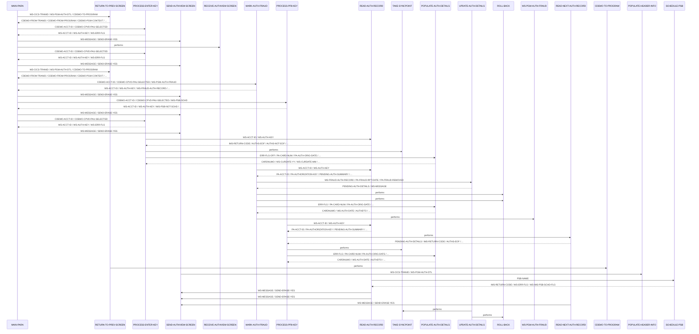
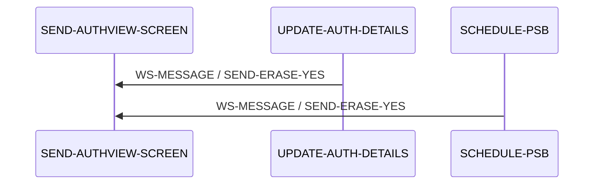

# COPAUS1C

**File**: `cbl/COPAUS1C.cbl`
**Type**: COBOL
**Analyzed**: 2026-02-24 17:45:24.976709

## Purpose

This CICS COBOL program, COPAUS1C, provides a detailed view of an authorization message. It retrieves authorization details from an IMS database, displays them on a screen, and allows the user to mark the authorization as fraudulent or navigate to the next authorization record. The program interacts with other CICS programs for fraud processing and screen navigation.

**Business Context**: Card authorization process within a card demo application.

## Inputs

| Name | Type | Description |
|------|------|-------------|
| CARDDEMO-COMMAREA | CICS_COMMAREA | Communication area passed between CICS programs, containing account ID, authorization key, and other relevant data for the card demo application. |
| PAUTSUM0 | IMS_SEGMENT | Pending Authorization Summary segment from IMS database, containing summary information about the authorization. |
| PAUTDTL1 | IMS_SEGMENT | Pending Authorization Details segment from IMS database, containing detailed information about the authorization. |

## Outputs

| Name | Type | Description |
|------|------|-------------|
| COPAU1A | CICS_MAP | BMS map displaying the authorization details to the user. |
| WS-FRAUD-DATA | CICS_COMMAREA | Communication area passed to COPAUS2C containing fraud related data. |

## Called Programs

| Program | Call Type | Purpose |
|---------|-----------|---------|
| COPAUS0C | XCTL | Return to the authorization summary screen. |
| COPAUS2C | CICS_LINK | Mark or unmark an authorization as fraudulent. |

## Business Rules

- **BR001**: If the account ID is numeric and an authorization is selected, read the authorization record from the IMS database.
- **BR002**: Determine if the authorization is already marked as fraud. If so, remove the fraud flag; otherwise, set the fraud flag.

## Paragraphs/Procedures

### MAIN-PARA
> [Source: MAIN-PARA.cbl.md](COPAUS1C.cbl.d/MAIN-PARA.cbl.md)
This is the main paragraph that controls the program flow. It first initializes flags and variables, including setting the error flag off and the send-erase flag on. It then checks if the communication area (COMMAREA) is empty. If it is, it initializes the CARDDEMO-COMMAREA and calls RETURN-TO-PREV-SCREEN to return to the previous screen (COPAUS0C). If the COMMAREA is not empty, it moves the data from DFHCOMMAREA to CARDDEMO-COMMAREA. If the program is not re-entered, it sets the CDEMO-PGM-REENTER flag to true and performs PROCESS-ENTER-KEY and SEND-AUTHVIEW-SCREEN. If the program is re-entered, it receives the screen input using RECEIVE-AUTHVIEW-SCREEN and then evaluates the EIBAID to determine which action to perform based on the user's input (ENTER, PF3, PF5, PF8, or other). Based on the AID key, it calls different paragraphs such as PROCESS-ENTER-KEY, RETURN-TO-PREV-SCREEN, MARK-AUTH-FRAUD, or PROCESS-PF8-KEY. Finally, it returns control to CICS using EXEC CICS RETURN, passing the CARDDEMO-COMMAREA.

### PROCESS-ENTER-KEY
> [Source: PROCESS-ENTER-KEY.cbl.md](COPAUS1C.cbl.d/PROCESS-ENTER-KEY.cbl.md)
This paragraph processes the ENTER key press. It first moves LOW-VALUES to the COPAU1AO map structure to clear the output fields. It then validates that the account ID (CDEMO-ACCT-ID) is numeric and that an authorization is selected (CDEMO-CPVD-PAU-SELECTED). If both conditions are met, it moves the account ID and authorization key to working storage variables (WS-ACCT-ID, WS-AUTH-KEY) and calls READ-AUTH-RECORD to retrieve the authorization details from the IMS database. If the PSB is scheduled, it sets the IMS-PSB-NOT-SCHD flag to TRUE and performs TAKE-SYNCPOINT. If the account ID is not numeric or no authorization is selected, it sets the error flag (ERR-FLG-ON) to TRUE. Finally, it calls POPULATE-AUTH-DETAILS to populate the screen fields with the retrieved authorization details.

### MARK-AUTH-FRAUD
> [Source: MARK-AUTH-FRAUD.cbl.md](COPAUS1C.cbl.d/MARK-AUTH-FRAUD.cbl.md)
This paragraph handles the process of marking or unmarking an authorization as fraudulent. It moves the account ID and selected authorization key to working storage. It then calls READ-AUTH-RECORD to retrieve the authorization details. It checks if the authorization is already marked as fraud (PA-FRAUD-CONFIRMED). If it is, it sets the PA-FRAUD-REMOVED flag to TRUE and the WS-REMOVE-FRAUD flag to TRUE. Otherwise, it sets the PA-FRAUD-CONFIRMED flag to TRUE and the WS-REPORT-FRAUD flag to TRUE. It then moves the PENDING-AUTH-DETAILS to WS-FRAUD-AUTH-RECORD, the account ID to WS-FRD-ACCT-ID, and the customer ID to WS-FRD-CUST-ID. It then calls COPAUS2C via CICS LINK to update the fraud status. After the LINK, it checks the EIBRESP and WS-FRD-UPDT-SUCCESS flags. If the update was successful, it calls UPDATE-AUTH-DETAILS. Otherwise, it moves the fraud action message to WS-MESSAGE and calls ROLL-BACK. Finally, it moves the authorization key to CDEMO-CPVD-PAU-SELECTED and calls POPULATE-AUTH-DETAILS to refresh the screen.

### PROCESS-PF8-KEY
> [Source: PROCESS-PF8-KEY.cbl.md](COPAUS1C.cbl.d/PROCESS-PF8-KEY.cbl.md)
This paragraph processes the PF8 key press, which is used to navigate to the next authorization record. It moves the account ID and selected authorization key to working storage. It then calls READ-AUTH-RECORD to retrieve the current authorization details and READ-NEXT-AUTH-RECORD to retrieve the next authorization record. If the PSB is scheduled, it sets the IMS-PSB-NOT-SCHD flag to TRUE and performs TAKE-SYNCPOINT. It checks if the end of the authorization records has been reached (AUTHS-EOF). If it has, it sets the SEND-ERASE-NO flag to TRUE and moves a message indicating that the last authorization has been reached to WS-MESSAGE. Otherwise, it moves the authorization key to CDEMO-CPVD-PAU-SELECTED and calls POPULATE-AUTH-DETAILS to display the next authorization record.

### POPULATE-AUTH-DETAILS
> [Source: POPULATE-AUTH-DETAILS.cbl.md](COPAUS1C.cbl.d/POPULATE-AUTH-DETAILS.cbl.md)
This paragraph populates the authorization details on the screen. It first checks if the error flag (ERR-FLG-OFF) is off. If it is, it moves data from the PENDING-AUTH-SUMMARY and PENDING-AUTH-DETAILS segments to the output map structure (COPAU1AO). It moves the card number, authorization date and time, approved amount, authorization response code, processing code, POS entry mode, message source, merchant category code, card expiry date, authorization type, transaction ID, match status, fraud information, and merchant details to the corresponding fields in the output map. It uses a SEARCH ALL statement to find the description for the authorization response reason code in the WS-DECLINE-REASON-TAB table. If the authorization response code is '00', it sets the authorization response indicator to 'A' (Approved) and the color to green. Otherwise, it sets the indicator to 'D' (Declined) and the color to red.

### RETURN-TO-PREV-SCREEN
> [Source: RETURN-TO-PREV-SCREEN.cbl.md](COPAUS1C.cbl.d/RETURN-TO-PREV-SCREEN.cbl.md)
This paragraph returns control to the previous screen, COPAUS0C. It moves the CICS transaction ID (WS-CICS-TRANID) to CDEMO-FROM-TRANID and the program ID (WS-PGM-AUTH-DTL) to CDEMO-FROM-PROGRAM. It moves ZEROS to CDEMO-PGM-CONTEXT and sets the CDEMO-PGM-ENTER flag to TRUE. It then performs a CICS XCTL to the program specified in CDEMO-TO-PROGRAM (COPAUS0C), passing the CARDDEMO-COMMAREA.

### SEND-AUTHVIEW-SCREEN
> [Source: SEND-AUTHVIEW-SCREEN.cbl.md](COPAUS1C.cbl.d/SEND-AUTHVIEW-SCREEN.cbl.md)
This paragraph sends the authorization details screen to the terminal. It first calls POPULATE-HEADER-INFO to populate the header information on the screen. It then moves the message in WS-MESSAGE to the error message field (ERRMSGO) in the output map structure (COPAU1AO). It moves -1 to CARDNUML. It then checks the SEND-ERASE-YES flag. If it is TRUE, it executes a CICS SEND command with the ERASE option to clear the screen before sending the map. Otherwise, it executes a CICS SEND command without the ERASE option. The CICS SEND command sends the COPAU1A map from the COPAU01 mapset, using the data in the COPAU1AO structure, and positions the cursor.

### RECEIVE-AUTHVIEW-SCREEN
> [Source: RECEIVE-AUTHVIEW-SCREEN.cbl.md](COPAUS1C.cbl.d/RECEIVE-AUTHVIEW-SCREEN.cbl.md)
This paragraph receives data from the authorization details screen. It executes a CICS RECEIVE command to receive the COPAU1A map from the COPAU01 mapset into the COPAU1AI structure. The NOHANDLE option is used to suppress the handling of exceptional conditions.

### POPULATE-HEADER-INFO
> [Source: POPULATE-HEADER-INFO.cbl.md](COPAUS1C.cbl.d/POPULATE-HEADER-INFO.cbl.md)
This paragraph populates the header information on the authorization details screen. It moves the current date to WS-CURDATE-DATA using the FUNCTION CURRENT-DATE. It then moves the title strings (CCDA-TITLE01, CCDA-TITLE02), transaction name (WS-CICS-TRANID), and program name (WS-PGM-AUTH-DTL) to the corresponding fields in the output map structure (COPAU1AO). It moves the month, day, and year from WS-CURDATE-DATA to WS-CURDATE-MM, WS-CURDATE-DD, and WS-CURDATE-YY, respectively. It then moves the formatted date (WS-CURDATE-MM-DD-YY) to the CURDATEO field in the output map. Similarly, it moves the hours, minutes, and seconds to WS-CURTIME-HH, WS-CURTIME-MM and WS-CURTIME-SS and then the formatted time to CURTIMEO.

### READ-AUTH-RECORD
> [Source: READ-AUTH-RECORD.cbl.md](COPAUS1C.cbl.d/READ-AUTH-RECORD.cbl.md)
This paragraph reads the authorization record from the IMS database. It first calls SCHEDULE-PSB to schedule the PSB. It then moves the account ID (WS-ACCT-ID) and authorization key (WS-AUTH-KEY) to the corresponding fields in the PENDING-AUTH-SUMMARY segment (PA-ACCT-ID, PA-AUTHORIZATION-KEY). It then executes a DLI GU (Get Unique) command to retrieve the PENDING-AUTH-SUMMARY segment from the IMS database, using the PAUT-PCB-NUM PCB and the ACCNTID field as the search criteria. It then moves the DIBSTAT code to IMS-RETURN-CODE and evaluates the return code. If the status is OK, it sets the AUTHS-NOT-EOF flag to TRUE. If the status is SEGMENT-NOT-FOUND or END-OF-DB, it sets the AUTHS-EOF flag to TRUE. If any other error occurs, it sets the error flag (WS-ERR-FLG) to 'Y' and displays an error message. If the AUTHS-NOT-EOF flag is TRUE, it executes a DLI GNP (Get Next within Parent) command to retrieve the PENDING-AUTH-DETAILS segment, using the PAUT9CTS field as the search criteria. It then moves the DIBSTAT code to IMS-RETURN-CODE and evaluates the return code, handling errors similarly to the PENDING-AUTH-SUMMARY segment retrieval.

### READ-NEXT-AUTH-RECORD
> [Source: READ-NEXT-AUTH-RECORD.cbl.md](COPAUS1C.cbl.d/READ-NEXT-AUTH-RECORD.cbl.md)
This paragraph reads the next authorization detail record from the IMS database. It executes a DLI GNP (Get Next within Parent) command to retrieve the next PENDING-AUTH-DETAILS segment. It then moves the DIBSTAT code to IMS-RETURN-CODE and evaluates the return code. If the status is OK, it sets the AUTHS-NOT-EOF flag to TRUE. If the status is SEGMENT-NOT-FOUND or END-OF-DB, it sets the AUTHS-EOF flag to TRUE. If any other error occurs, it sets the error flag (WS-ERR-FLG) to 'Y' and displays an error message.

### UPDATE-AUTH-DETAILS
> [Source: UPDATE-AUTH-DETAILS.cbl.md](COPAUS1C.cbl.d/UPDATE-AUTH-DETAILS.cbl.md)
This paragraph updates the authorization details in the IMS database. It moves the fraud authorization record (WS-FRAUD-AUTH-RECORD) to the PENDING-AUTH-DETAILS segment. It then executes a DLI REPL (Replace) command to update the PENDING-AUTH-DETAILS segment in the IMS database. It then moves the DIBSTAT code to IMS-RETURN-CODE and evaluates the return code. If the status is OK, it calls TAKE-SYNCPOINT to commit the changes. If the fraud was removed, it moves a message indicating that the authorization fraud was removed to WS-MESSAGE. Otherwise, it moves a message indicating that the authorization was marked as fraud to WS-MESSAGE. If any other error occurs, it calls ROLL-BACK to undo the changes and displays an error message.

### TAKE-SYNCPOINT
> [Source: TAKE-SYNCPOINT.cbl.md](COPAUS1C.cbl.d/TAKE-SYNCPOINT.cbl.md)
This paragraph takes a syncpoint, committing the database changes. It executes a CICS SYNCPOINT command.

### ROLL-BACK
> [Source: ROLL-BACK.cbl.md](COPAUS1C.cbl.d/ROLL-BACK.cbl.md)
This paragraph rolls back the database changes. It executes a CICS SYNCPOINT ROLLBACK command.

### SCHEDULE-PSB
> [Source: SCHEDULE-PSB.cbl.md](COPAUS1C.cbl.d/SCHEDULE-PSB.cbl.md)
This paragraph schedules the PSB (Program Specification Block) for IMS database access. It executes a DLI SCHD command to schedule the PSB specified in PSB-NAME. If the PSB was scheduled more than once, it terminates the PSB and schedules it again. If the status is OK, it sets the IMS-PSB-SCHD flag to TRUE. Otherwise, it sets the error flag (WS-ERR-FLG) to 'Y' and displays an error message.

## Control Flow

## Open Questions

- ? What is the exact structure and purpose of the IMS segments CIPAUSMY and CIPAUDTY?
  - Context: The copybooks for these segments are not provided, so their exact field definitions and purposes are unclear.

## Sequence Diagram

### Part 1 of 2

### Part 2 of 2

