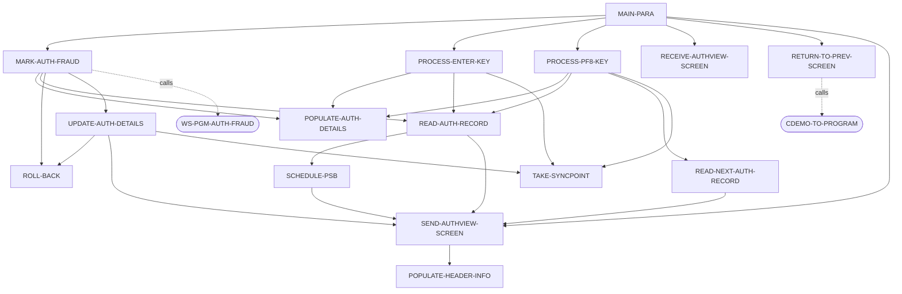

# COPAUS1C

**File**: `cbl/COPAUS1C.cbl`
**Type**: FileType.COBOL
**Analyzed**: 2026-02-10 17:07:16.901366

## Purpose

The COPAUS1C program is a CICS transaction that displays authorization details and allows users to mark authorizations as fraudulent. It receives input from a calling program via the COMMAREA, displays an authorization view screen (COPAU1A), and allows the user to page through authorizations or mark them as fraudulent.

**Business Context**: This program is likely part of a fraud detection and prevention system, allowing users to review and flag potentially fraudulent authorization transactions.

## Inputs

| Name | Type | Description |
|------|------|-------------|
| CARDDEMO-COMMAREA | IOType.CICS_COMMAREA | Communication area passed from the calling program, containing account ID, authorization key, and other context information. |
| COPAU1AI | IOType.CICS_MAP | Input map structure received from the CICS terminal user, containing screen input values. |

## Outputs

| Name | Type | Description |
|------|------|-------------|
| COPAU1AO | IOType.CICS_MAP | Output map structure sent to the CICS terminal user, containing authorization details and screen display information. |
| CARDDEMO-COMMAREA | IOType.CICS_COMMAREA | Communication area passed back to the calling program, containing updated context information. |

## Called Programs

| Program | Call Type | Purpose |
|---------|-----------|---------|
| CDEMO-TO-PROGRAM | CallType.CICS_XCTL | Transfers control back to the calling program. |
| WS-PGM-AUTH-FRAUD | CallType.CICS_LINK | Links to a program to handle fraud processing. |

## Business Rules

- **BR001**: If the account ID is numeric and an authorization is selected, read the authorization record.
- **BR002**: If the user presses PF5, mark the authorization as fraudulent.
- **BR003**: If the user presses PF8, page to the next authorization record.

## Paragraphs/Procedures

### COPAUS1C
> [Source: COPAUS1C.cbl](COPAUS1C.cbl.d/COPAUS1C.cbl)
This is the program ID declaration. It does not contain any executable code. It simply identifies the program as COPAUS1C. This paragraph serves as a placeholder and does not perform any specific function in the program's execution. It is a required element in COBOL programs but does not contribute to the program's logic or data processing. It is not called by any other paragraphs and does not call any other paragraphs. It does not handle any errors or perform any validation.

### MAIN-PARA
> [Source: MAIN-PARA.cbl](COPAUS1C.cbl.d/MAIN-PARA.cbl)
This paragraph is the main control flow for the CICS transaction. It first initializes the error flag and message fields. It then checks if the COMMAREA length (EIBCALEN) is zero, indicating a first-time call. If so, it initializes the CARDDEMO-COMMAREA, sets the CDEMO-TO-PROGRAM field, and performs RETURN-TO-PREV-SCREEN to return to the calling program. Otherwise, it moves the DFHCOMMAREA to CARDDEMO-COMMAREA and checks if the program is re-entering. If not, it sets the CDEMO-PGM-REENTER flag and performs PROCESS-ENTER-KEY and SEND-AUTHVIEW-SCREEN. If re-entering, it performs RECEIVE-AUTHVIEW-SCREEN and then evaluates the EIBAID to determine the user's action (ENTER, PF3, PF5, PF8, or other). Based on the EIBAID, it performs different actions, such as processing the enter key, returning to the previous screen, marking authorization as fraud, or paging to the next authorization. Finally, it executes a CICS RETURN command to return control to CICS with the updated COMMAREA.

### PROCESS-ENTER-KEY
> [Source: PROCESS-ENTER-KEY.cbl](COPAUS1C.cbl.d/PROCESS-ENTER-KEY.cbl)
This paragraph processes the user's input when the ENTER key is pressed. It first initializes the COPAU1AO map. It then checks if the account ID (CDEMO-ACCT-ID) is numeric and an authorization is selected (CDEMO-CPVD-PAU-SELECTED). If both conditions are met, it moves the account ID and authorization key to working storage variables (WS-ACCT-ID and WS-AUTH-KEY) and performs READ-AUTH-RECORD to retrieve the authorization details. If IMS-PSB-SCHD is set, it performs TAKE-SYNCPOINT. If either condition is not met, it sets the error flag. Finally, it performs POPULATE-AUTH-DETAILS to populate the screen fields with the retrieved authorization details.

### MARK-AUTH-FRAUD
> [Source: MARK-AUTH-FRAUD.cbl](COPAUS1C.cbl.d/MARK-AUTH-FRAUD.cbl)
This paragraph handles the logic for marking an authorization as fraudulent when the user presses PF5. It moves the account ID and authorization key to working storage variables. It then performs READ-AUTH-RECORD to retrieve the authorization details. It checks if the authorization is already marked as fraud confirmed. If so, it sets flags to remove the fraud indicator; otherwise, it sets flags to confirm the fraud. It then moves pending authorization details and customer information to the WS-FRAUD-DATA area and links to the WS-PGM-AUTH-FRAUD program to update the fraud information. After the link, it checks the EIBRESP for normal completion. If normal, it checks if the fraud update was successful. If successful, it performs UPDATE-AUTH-DETAILS; otherwise, it moves an error message to WS-MESSAGE and performs ROLL-BACK. If the EIBRESP is not normal, it performs ROLL-BACK. Finally, it moves the authorization key to CDEMO-CPVD-PAU-SELECTED and performs POPULATE-AUTH-DETAILS to refresh the screen.

### PROCESS-PF8-KEY
> [Source: PROCESS-PF8-KEY.cbl](COPAUS1C.cbl.d/PROCESS-PF8-KEY.cbl)
This paragraph handles the logic for paging to the next authorization record when the user presses PF8. It moves the account ID and authorization key to working storage variables. It then performs READ-AUTH-RECORD to retrieve the current authorization details and READ-NEXT-AUTH-RECORD to retrieve the next authorization details. If IMS-PSB-SCHD is set, it performs TAKE-SYNCPOINT. It checks if the end of the authorization list has been reached (AUTHS-EOF). If so, it sets a flag to prevent erasing the screen and moves a message to WS-MESSAGE. Otherwise, it moves the authorization key to CDEMO-CPVD-PAU-SELECTED and performs POPULATE-AUTH-DETAILS to display the next authorization details.

### POPULATE-AUTH-DETAILS
> [Source: POPULATE-AUTH-DETAILS.cbl](COPAUS1C.cbl.d/POPULATE-AUTH-DETAILS.cbl)
This paragraph populates the output map (COPAU1AO) with the authorization details retrieved from the PA-AUTHORIZATION-RECORD. It moves various fields from the PA-AUTHORIZATION-RECORD to the corresponding output fields in the map, including the card number, authorization date and time, approved amount, response code, decline reason, processing code, POS entry mode, message source, merchant category code, card expiry date, authorization type, transaction ID, match status, fraud information, and merchant details. It also handles formatting the authorization date and time. It searches the WS-DECLINE-REASON-TAB to find the description for the decline reason code. If the error flag is off, it populates the fields; otherwise, it skips the population. It also handles the fraud indicator display based on PA-FRAUD-CONFIRMED and PA-FRAUD-REMOVED flags.

### RETURN-TO-PREV-SCREEN
> [Source: RETURN-TO-PREV-SCREEN.cbl](COPAUS1C.cbl.d/RETURN-TO-PREV-SCREEN.cbl)
This paragraph prepares to return control to the calling program. It moves the current transaction ID (WS-CICS-TRANID) and program ID (WS-PGM-AUTH-DTL) to the CARDDEMO-COMMAREA. It sets the program context to zeros and sets the CDEMO-PGM-ENTER flag to true. Finally, it executes a CICS XCTL command to transfer control to the program specified in CDEMO-TO-PROGRAM, passing the CARDDEMO-COMMAREA.

### SEND-AUTHVIEW-SCREEN
> [Source: SEND-AUTHVIEW-SCREEN.cbl](COPAUS1C.cbl.d/SEND-AUTHVIEW-SCREEN.cbl)
This paragraph sends the authorization view screen (COPAU1A) to the CICS terminal. It first performs POPULATE-HEADER-INFO to populate the header information on the screen. It then moves the message in WS-MESSAGE to the error message field (ERRMSGO) on the screen. It moves -1 to CARDNUML. It checks the SEND-ERASE-YES flag. If set, it executes a CICS SEND command with the ERASE option to clear the screen before sending the map. Otherwise, it executes a CICS SEND command without the ERASE option. The CURSOR option is used to position the cursor on the screen.

### RECEIVE-AUTHVIEW-SCREEN
> [Source: RECEIVE-AUTHVIEW-SCREEN.cbl](COPAUS1C.cbl.d/RECEIVE-AUTHVIEW-SCREEN.cbl)
This paragraph receives the input from the CICS terminal user. It executes a CICS RECEIVE command to receive the data from the COPAU1A map into the COPAU1AI structure. The NOHANDLE option is used to suppress CICS abend if an error occurs during the receive operation. The program will handle the error checking manually.

### POPULATE-HEADER-INFO
> [Source: POPULATE-HEADER-INFO.cbl](COPAUS1C.cbl.d/POPULATE-HEADER-INFO.cbl)
This paragraph populates the header information in the output map (COPAU1AO). It moves the current date and time to working storage variables. It moves the title fields (CCDA-TITLE01 and CCDA-TITLE02), transaction ID (WS-CICS-TRANID), and program name (WS-PGM-AUTH-DTL) to the corresponding output fields in the COPAU1AO map. It extracts the month, day, and year from the current date and moves them to working storage variables. It then moves the formatted date and time to the output fields in the COPAU1AO map.

### READ-AUTH-RECORD
> [Source: READ-AUTH-RECORD.cbl](COPAUS1C.cbl.d/READ-AUTH-RECORD.cbl)
This paragraph retrieves authorization records from the IMS database. It first calls SCHEDULE-PSB to schedule the PSB required for IMS access. It then moves the account ID (WS-ACCT-ID) and authorization key (WS-AUTH-KEY) into the corresponding fields in the PAUTSUM0 segment. An IMS 'GU' (Get Unique) call is executed to retrieve the authorization summary based on the account ID. If the summary record is found, a 'GNP' (Get Next within Parent) call is made to retrieve the authorization details based on the authorization key. Error handling is performed by checking the DIBSTAT return code after each IMS call. If an error occurs, WS-ERR-FLG is set to 'Y', an error message is constructed, and SEND-AUTHVIEW-SCREEN is called to display the error. The paragraph sets AUTHS-EOF or AUTHS-NOT-EOF based on the DIBSTAT value. It calls SCHEDULE-PSB, SEND-AUTHVIEW-SCREEN.

### READ-NEXT-AUTH-RECORD
> [Source: READ-NEXT-AUTH-RECORD.cbl](COPAUS1C.cbl.d/READ-NEXT-AUTH-RECORD.cbl)
This paragraph retrieves the next authorization detail record from the IMS database. It executes an IMS 'GNP' (Get Next within Parent) call to retrieve the next PAUTDTL1 segment. The retrieved data is moved into the PENDING-AUTH-DETAILS area. Error handling is performed by checking the DIBSTAT return code after the IMS call. If an error occurs, WS-ERR-FLG is set to 'Y', an error message is constructed, and SEND-AUTHVIEW-SCREEN is called to display the error. The paragraph sets AUTHS-EOF or AUTHS-NOT-EOF based on the DIBSTAT value. It calls SEND-AUTHVIEW-SCREEN.

### UPDATE-AUTH-DETAILS
> [Source: UPDATE-AUTH-DETAILS.cbl](COPAUS1C.cbl.d/UPDATE-AUTH-DETAILS.cbl)
This paragraph updates the authorization details in the IMS database. It moves the fraud authorization record (WS-FRAUD-AUTH-RECORD) into the PENDING-AUTH-DETAILS area. An IMS 'REPL' (Replace) call is executed to update the PAUTDTL1 segment in the database. After the update, the DIBSTAT return code is checked. If the update is successful (STATUS-OK), TAKE-SYNCPOINT is called to commit the changes. A message indicating whether the authorization was marked or removed as fraudulent is moved to WS-MESSAGE. If an error occurs during the update, ROLL-BACK is called to undo the changes, WS-ERR-FLG is set to 'Y', an error message is constructed, and SEND-AUTHVIEW-SCREEN is called to display the error. It calls TAKE-SYNCPOINT, ROLL-BACK, SEND-AUTHVIEW-SCREEN.

### TAKE-SYNCPOINT
> [Source: TAKE-SYNCPOINT.cbl](COPAUS1C.cbl.d/TAKE-SYNCPOINT.cbl)
This paragraph issues a CICS SYNCPOINT command to commit changes to the IMS database. This ensures that all updates made are permanently saved. There are no specific inputs or outputs for this paragraph other than the implicit effect on the IMS database. No error handling is explicitly performed within this paragraph. It does not call any other paragraphs or programs. The primary purpose of this paragraph is to ensure data consistency and durability by committing the transaction.

### ROLL-BACK
> [Source: ROLL-BACK.cbl](COPAUS1C.cbl.d/ROLL-BACK.cbl)
This paragraph issues a CICS SYNCPOINT ROLLBACK command to undo any changes made to the IMS database since the last syncpoint. This is typically called when an error occurs during processing to ensure data integrity. There are no specific inputs or outputs for this paragraph other than the implicit effect on the IMS database. No explicit error handling is present within this paragraph. It does not call any other paragraphs or programs. The primary purpose is to revert the database to its previous consistent state in case of errors.

### SCHEDULE-PSB
> [Source: SCHEDULE-PSB.cbl](COPAUS1C.cbl.d/SCHEDULE-PSB.cbl)
This paragraph schedules the Program Specification Block (PSB) required for accessing the IMS database. It first issues an IMS 'SCHD' command with the PSB name obtained from PSB-NAME. The NODHABEND option is specified to prevent abnormal termination. The DIBSTAT return code is checked. If the PSB has been scheduled more than once (PSB-SCHEDULED-MORE-THAN-ONCE), the PSB is terminated and then scheduled again. If the scheduling is successful (STATUS-OK), IMS-PSB-SCHD is set to TRUE. If an error occurs during scheduling, WS-ERR-FLG is set to 'Y', an error message is constructed, and SEND-AUTHVIEW-SCREEN is called to display the error. It calls SEND-AUTHVIEW-SCREEN.

## Control Flow

## Open Questions

- ? What is the purpose and structure of the PA-AUTHORIZATION-RECORD?
  - Context: The code extensively uses fields from PA-AUTHORIZATION-RECORD, but its structure and source are not defined in the provided code snippet.
- ? What is the purpose of the WS-FRAUD-DATA and the WS-PGM-AUTH-FRAUD program?
  - Context: The code links to WS-PGM-AUTH-FRAUD with WS-FRAUD-DATA, but the details of this interaction are unclear.
- ? What is the purpose of the TAKE-SYNCPOINT and ROLL-BACK paragraphs?
  - Context: These paragraphs are called in error handling scenarios, but their exact implementation is not visible in the provided code.

## Sequence Diagram

```mermaid
sequenceDiagram
    COPAUS1C->>COCOM01Y: performs
    COPAUS1C->>COPAU01: performs
    COPAUS1C->>COTTL01Y: performs
    COPAUS1C->>CSDAT01Y: performs
    COPAUS1C->>CSMSG01Y: performs
    COPAUS1C->>CSMSG02Y: performs
    COPAUS1C->>CIPAUSMY: performs
    COPAUS1C->>CIPAUDTY: performs
    COPAUS1C->>DFHAID: performs
    COPAUS1C->>DFHBMSCA: performs
    MAIN-PARA->>RETURN-TO-PREV-SCREEN: WS-CICS-TRANID, WS-PGM-AUTH-DTL, CDEMO-TO-PROGRAM
    RETURN-TO-PREV-SCREEN-->>MAIN-PARA: CDEMO-FROM-TRANID, CDEMO-FROM-PROGRAM, CDEMO-PGM-CONTEXT, ...
    MAIN-PARA->>PROCESS-ENTER-KEY: CDEMO-ACCT-ID, CDEMO-CPVD-PAU-SELECTED
    PROCESS-ENTER-KEY-->>MAIN-PARA: WS-ACCT-ID, WS-AUTH-KEY, WS-ERR-FLG
    MAIN-PARA->>SEND-AUTHVIEW-SCREEN: WS-MESSAGE, SEND-ERASE-YES
    MAIN-PARA->>RECEIVE-AUTHVIEW-SCREEN: performs
    MAIN-PARA->>PROCESS-ENTER-KEY: CDEMO-ACCT-ID, CDEMO-CPVD-PAU-SELECTED
    PROCESS-ENTER-KEY-->>MAIN-PARA: WS-ACCT-ID, WS-AUTH-KEY, WS-ERR-FLG
    MAIN-PARA->>SEND-AUTHVIEW-SCREEN: WS-MESSAGE, SEND-ERASE-YES
    MAIN-PARA->>RETURN-TO-PREV-SCREEN: WS-CICS-TRANID, WS-PGM-AUTH-DTL, CDEMO-TO-PROGRAM
    RETURN-TO-PREV-SCREEN-->>MAIN-PARA: CDEMO-FROM-TRANID, CDEMO-FROM-PROGRAM, CDEMO-PGM-CONTEXT, ...
    MAIN-PARA->>MARK-AUTH-FRAUD: CDEMO-ACCT-ID, CDEMO-CPVD-PAU-SELECTED, CDEMO-CUST-ID, ...
    MARK-AUTH-FRAUD-->>MAIN-PARA: WS-ACCT-ID, WS-AUTH-KEY, WS-FRAUD-AUTH-RECORD, ...
    MAIN-PARA->>SEND-AUTHVIEW-SCREEN: WS-MESSAGE, SEND-ERASE-YES
    MAIN-PARA->>PROCESS-PF8-KEY: CDEMO-ACCT-ID, CDEMO-CPVD-PAU-SELECTED, IMS-PSB-SCHD
    PROCESS-PF8-KEY-->>MAIN-PARA: WS-ACCT-ID, WS-AUTH-KEY, SEND-ERASE-NO, ...
    MAIN-PARA->>SEND-AUTHVIEW-SCREEN: WS-MESSAGE, SEND-ERASE-YES
    MAIN-PARA->>PROCESS-ENTER-KEY: CDEMO-ACCT-ID, CDEMO-CPVD-PAU-SELECTED
    PROCESS-ENTER-KEY-->>MAIN-PARA: WS-ACCT-ID, WS-AUTH-KEY, WS-ERR-FLG
    MAIN-PARA->>SEND-AUTHVIEW-SCREEN: WS-MESSAGE, SEND-ERASE-YES
    PROCESS-ENTER-KEY->>READ-AUTH-RECORD: WS-ACCT-ID, WS-AUTH-KEY
    READ-AUTH-RECORD-->>PROCESS-ENTER-KEY: IMS-RETURN-CODE, WS-ERR-FLG, WS-MESSAGE, ...
    PROCESS-ENTER-KEY->>TAKE-SYNCPOINT: performs
    PROCESS-ENTER-KEY->>POPULATE-AUTH-DETAILS: ERR-FLG-ON, ERR-FLG-OFF, PA-CARD-NUM, ...
    POPULATE-AUTH-DETAILS-->>PROCESS-ENTER-KEY: WS-AUTH-DATE, WS-AUTH-TIME, WS-AUTH-AMT
    MARK-AUTH-FRAUD->>READ-AUTH-RECORD: CDEMO-ACCT-ID, CDEMO-CPVD-PAU-SELECTED, WS-ACCT-ID, ...
    READ-AUTH-RECORD-->>MARK-AUTH-FRAUD: WS-ACCT-ID, WS-AUTH-KEY, PENDING-AUTH-SUMMARY, ...
    MARK-AUTH-FRAUD->>UPDATE-AUTH-DETAILS: WS-FRAUD-AUTH-RECORD, PA-FRAUD-RPT-DATE, PA-FRAUD-REMOVED
    UPDATE-AUTH-DETAILS-->>MARK-AUTH-FRAUD: PENDING-AUTH-DETAILS, IMS-RETURN-CODE, WS-ERR-FLG, ...
    MARK-AUTH-FRAUD->>ROLL-BACK: performs
    MARK-AUTH-FRAUD->>ROLL-BACK: performs
    MARK-AUTH-FRAUD->>POPULATE-AUTH-DETAILS: PA-CARD-NUM, PA-AUTH-ORIG-DATE, PA-AUTH-ORIG-TIME, ...
    POPULATE-AUTH-DETAILS-->>MARK-AUTH-FRAUD: CARDNUMO, WS-CURDATE-YY, WS-CURDATE-MM, ...
    MARK-AUTH-FRAUD->>WS-PGM-AUTH-FRAUD: performs
    PROCESS-PF8-KEY->>READ-AUTH-RECORD: WS-ACCT-ID, WS-AUTH-KEY
    READ-AUTH-RECORD-->>PROCESS-PF8-KEY: PENDING-AUTH-SUMMARY, PENDING-AUTH-DETAILS, IMS-RETURN-CODE, ...
    PROCESS-PF8-KEY->>READ-NEXT-AUTH-RECORD: performs
    READ-NEXT-AUTH-RECORD-->>PROCESS-PF8-KEY: PENDING-AUTH-DETAILS, IMS-RETURN-CODE, AUTHS-EOF, ...
    PROCESS-PF8-KEY->>TAKE-SYNCPOINT: performs
    PROCESS-PF8-KEY->>POPULATE-AUTH-DETAILS: PA-CARD-NUM, PA-AUTH-ORIG-DATE, PA-AUTH-ORIG-TIME, ...
    POPULATE-AUTH-DETAILS-->>PROCESS-PF8-KEY: CARDNUMO, WS-CURDATE-YY, WS-CURDATE-MM, ...
    RETURN-TO-PREV-SCREEN->>CDEMO-TO-PROGRAM: performs
    SEND-AUTHVIEW-SCREEN->>POPULATE-HEADER-INFO: WS-CICS-TRANID, WS-PGM-AUTH-DTL
    READ-AUTH-RECORD->>SCHEDULE-PSB: PSB-NAME
    SCHEDULE-PSB-->>READ-AUTH-RECORD: IMS-RETURN-CODE, WS-ERR-FLG, WS-IMS-PSB-SCHD-FLG
    READ-AUTH-RECORD->>SEND-AUTHVIEW-SCREEN: WS-MESSAGE, SEND-ERASE-YES
    READ-AUTH-RECORD->>SEND-AUTHVIEW-SCREEN: WS-MESSAGE, SEND-ERASE-YES
    READ-NEXT-AUTH-RECORD->>SEND-AUTHVIEW-SCREEN: WS-MESSAGE, SEND-ERASE-YES
    UPDATE-AUTH-DETAILS->>TAKE-SYNCPOINT: performs
    UPDATE-AUTH-DETAILS->>ROLL-BACK: performs
    UPDATE-AUTH-DETAILS->>SEND-AUTHVIEW-SCREEN: WS-MESSAGE, SEND-ERASE-YES
    SCHEDULE-PSB->>SEND-AUTHVIEW-SCREEN: WS-MESSAGE, SEND-ERASE-YES
```

