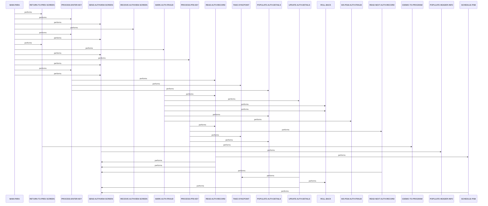

# COPAUS1C

**File**: `cbl/COPAUS1C.cbl`
**Type**: FileType.COBOL
**Analyzed**: 2026-02-24 04:03:23.439394

## Purpose

COPAUS1C is a CICS transaction program that provides a detailed view of pending authorization records from an IMS database. It retrieves and displays authorization details on a BMS screen (COPAU1A), supports navigation to next records (PF8), toggles fraud status via a linked program, and handles user inputs like ENTER and PF keys. The program manages IMS DL/I calls for GU, GNP, and REPL operations on PAUTSUM0 root and PAUTDTL1 child segments.

**Business Context**: CardDemo authorization module for viewing and managing pending credit card authorization details, including fraud marking.

## Inputs

| Name | Type | Description |
|------|------|-------------|
| CARDDEMO-COMMAREA | IOType.CICS_COMMAREA | Communication area containing account ID, selected auth key, page info, and fraud data from previous screen (COPAUS0C) |
| COPAU1AI | IOType.CICS_MAP | Input map fields from BMS screen for user selections like account ID and selected authorization key |
| PAUTSUM0 | IOType.IMS_SEGMENT | Pending authorization summary root segment qualified by account ID |
| PAUTDTL1 | IOType.IMS_SEGMENT | Pending authorization details child segment qualified by authorization key |

## Outputs

| Name | Type | Description |
|------|------|-------------|
| COPAU1AO | IOType.CICS_MAP | Output map populated with authorization details, header info, messages, and fraud status for screen display |
| PAUTDTL1 | IOType.IMS_SEGMENT | Updated authorization details segment after fraud marking |

## Called Programs

| Program | Call Type | Purpose |
|---------|-----------|---------|
| COPAUS2C | CallType.CICS_LINK | To report or remove fraud status on the authorization record |
| COPAUS0C | CallType.CICS_XCTL | To return to the authorization summary screen |

## Business Rules

- **BR001**: Toggle fraud status on authorization: if already confirmed, remove; else report as fraud
- **BR002**: Display approval/decline status and reason from response code and lookup table
- **BR003**: Validate input for numeric account ID and non-blank selected key before IMS read

## Paragraphs/Procedures

### MAIN-PARA
> [Source: MAIN-PARA.cbl.md](COPAUS1C.cbl.d/MAIN-PARA.cbl.md)
This is the primary entry point and orchestration paragraph that handles the overall program flow for the CICS transaction CPVD. It initializes flags and messages, checks if first entry (EIBCALEN=0) to XCTL back to summary screen, or processes commarea from caller. For reentry, it receives the map if needed, evaluates AID keys (ENTER, PF3, PF5, PF8, OTHER), and dispatches to appropriate handlers like PROCESS-ENTER-KEY for detail load, MARK-AUTH-FRAUD for fraud toggle, PROCESS-PF8-KEY for next record, or RETURN-TO-PREV-SCREEN for exit. It consumes inputs from DFHCOMMAREA (CARDDEMO-COMMAREA) and COPAU1AI map, producing outputs to COPAU1AO map via SEND and finally CICS RETURN with updated commarea. Business logic includes reentry flag management and invalid key error messaging. Error handling is delegated to subordinate paragraphs. It calls RECEIVE-AUTHVIEW-SCREEN, PROCESS-ENTER-KEY, SEND-AUTHVIEW-SCREEN, MARK-AUTH-FRAUD, PROCESS-PF8-KEY, RETURN-TO-PREV-SCREEN based on AID.

### PROCESS-ENTER-KEY
> [Source: PROCESS-ENTER-KEY.cbl.md](COPAUS1C.cbl.d/PROCESS-ENTER-KEY.cbl.md)
This paragraph processes the ENTER key to load selected authorization details into the screen map. It validates numeric CDEMO-ACCT-ID and non-blank CDEMO-CPVD-PAU-SELECTED, moving them to WS-ACCT-ID/WS-AUTH-KEY if valid, then performs READ-AUTH-RECORD to fetch IMS segments; sets error flag otherwise. It consumes commarea fields and produces populated map fields via subsequent POPULATE-AUTH-DETAILS. Business logic enforces input validation before DB access. Errors from validation set ERR-FLG-ON without DB call. It unschedules PSB after read if scheduled. Calls READ-AUTH-RECORD and POPULATE-AUTH-DETAILS.

### MARK-AUTH-FRAUD
> [Source: MARK-AUTH-FRAUD.cbl.md](COPAUS1C.cbl.d/MARK-AUTH-FRAUD.cbl.md)
This paragraph handles PF5 to toggle fraud status on the current authorization record. It reads the current record via READ-AUTH-RECORD using acct/auth key from commarea, toggles PA-FRAUD-CONFIRMED to REMOVED or sets CONFIRMED based on current state, prepares WS-FRAUD-DATA, and LINKs to COPAUS2C for processing. On success (WS-FRD-UPDT-SUCCESS), updates the details via UPDATE-AUTH-DETAILS and syncpoint; else rolls back and messages error. Consumes IMS details and commarea, produces updated IMS segment and refreshed map. Business logic implements fraud report/remove toggle. Error handling via ROLL-BACK on LINK or update failure. Calls READ-AUTH-RECORD, UPDATE-AUTH-DETAILS, ROLL-BACK.

### PROCESS-PF8-KEY
> [Source: PROCESS-PF8-KEY.cbl.md](COPAUS1C.cbl.d/PROCESS-PF8-KEY.cbl.md)
This paragraph processes PF8 to navigate to the next authorization detail record under the same account. It reads current record, then GNP next PAUTDTL1 child segment, sets EOF flag if end reached, messages 'Already at last' if EOF else updates selected key and populates details. Consumes current IMS position and acct/auth key, produces next record details or error message. Business logic handles sequential navigation with EOF check. Errors set ERR-FLG and message. Unchedules PSB post-read. Calls READ-AUTH-RECORD, READ-NEXT-AUTH-RECORD, POPULATE-AUTH-DETAILS.

### POPULATE-AUTH-DETAILS
> [Source: POPULATE-AUTH-DETAILS.cbl.md](COPAUS1C.cbl.d/POPULATE-AUTH-DETAILS.cbl.md)
This paragraph maps IMS PENDING-AUTH-DETAILS fields to BMS output map COPAU1AO fields if no error. It formats dates/times, sets approve/decline indicators with colors, searches decline reason table for description, populates merchant/transaction fields, and handles fraud display if flagged. Consumes PA* fields from IMS and WS variables, produces all detail fields in COPAU1AO like CARDNUMO, AUTHDTO, AUTHRSNO, AUTHFRDO. Business logic includes conditional formatting (green/red, fraud date) and table lookup. No direct error handling, skips if ERR-FLG-ON. Called unconditionally after reads.

### RETURN-TO-PREV-SCREEN
> [Source: RETURN-TO-PREV-SCREEN.cbl.md](COPAUS1C.cbl.d/RETURN-TO-PREV-SCREEN.cbl.md)
This paragraph XCTLs back to the authorization summary program COPAUS0C. It sets commarea fields for from-program/transaction, enter context, and zero context. Consumes current commarea, produces updated commarea for caller. Business logic for PF3/exit or initial entry. No error handling shown. Called on PF3 or initial.

### SEND-AUTHVIEW-SCREEN
> [Source: SEND-AUTHVIEW-SCREEN.cbl.md](COPAUS1C.cbl.d/SEND-AUTHVIEW-SCREEN.cbl.md)
This paragraph sends the populated BMS map COPAU1A to the terminal, erasing if flagged. It first calls POPULATE-HEADER-INFO for titles/date/time, moves message, sets length -1. Consumes populated COPAU1AO and WS-MESSAGE, produces screen display. Business logic controls ERASE option via SEND-ERASE-FLG. No error handling. Called after most processing.

### RECEIVE-AUTHVIEW-SCREEN
> [Source: RECEIVE-AUTHVIEW-SCREEN.cbl.md](COPAUS1C.cbl.d/RECEIVE-AUTHVIEW-SCREEN.cbl.md)
This paragraph receives user input from BMS map COPAU1A into COPAU1AI. Simple CICS RECEIVE NOHANDLE. Consumes screen input, produces map fields for AID evaluation. No validation or error handling here. Called on reenter.

### POPULATE-HEADER-INFO
> [Source: POPULATE-HEADER-INFO.cbl.md](COPAUS1C.cbl.d/POPULATE-HEADER-INFO.cbl.md)
This paragraph populates screen header with titles, program/transaction names, current date/time from FUNCTION CURRENT-DATE. Formats date/time using WS-CURDATE/CURTIME vars from copy CSDAT01Y. Consumes system date/time, produces TITLE*/TRNNAMEO/PGMNAMEO/CURDATEO/CURTIMEO. No conditions or errors. Called before every SEND.

### READ-AUTH-RECORD
> [Source: READ-AUTH-RECORD.cbl.md](COPAUS1C.cbl.d/READ-AUTH-RECORD.cbl.md)
This paragraph schedules PSB if needed, then GU PAUTSUM0 by ACCT-ID, GNP PAUTDTL1 by AUTH-KEY, handling IMS statuses: OK continues, GE/GB sets EOF, others error message and SEND. Consumes WS-ACCT-ID/KEY, produces PENDING-AUTH-SUMMARY/DETAILS populated. Business logic for qualified hierarchical read. Errors branch to SEND with message. Calls SCHEDULE-PSB.

### READ-NEXT-AUTH-RECORD
> [Source: READ-NEXT-AUTH-RECORD.cbl.md](COPAUS1C.cbl.d/READ-NEXT-AUTH-RECORD.cbl.md)
This paragraph performs GNP next PAUTDTL1 under current parent, sets NOT-EOF or EOF, errors message/SEND. Consumes current PCB position, produces next PENDING-AUTH-DETAILS. Sequential navigation logic. Errors set ERR-FLG and SEND.

### UPDATE-AUTH-DETAILS
> [Source: UPDATE-AUTH-DETAILS.cbl.md](COPAUS1C.cbl.d/UPDATE-AUTH-DETAILS.cbl.md)
This paragraph REPL the PAUTDTL1 segment with updated fraud data from WS-FRAUD-AUTH-RECORD, syncpoints on OK with success message, else ROLL-BACK/error SEND. Consumes updated details, produces persistent IMS update. Fraud tag persistence logic. Errors rollback and message.

### TAKE-SYNCPOINT
> [Source: TAKE-SYNCPOINT.cbl.md](COPAUS1C.cbl.d/TAKE-SYNCPOINT.cbl.md)
Executes CICS SYNCPOINT to commit changes. No inputs/outputs beyond CICS state. Called post-successful updates.

### ROLL-BACK
> [Source: ROLL-BACK.cbl.md](COPAUS1C.cbl.d/ROLL-BACK.cbl.md)
Executes CICS SYNCPOINT ROLLBACK to undo changes. Called on errors.

### SCHEDULE-PSB
> [Source: SCHEDULE-PSB.cbl.md](COPAUS1C.cbl.d/SCHEDULE-PSB.cbl.md)
Schedules IMS PSB PSBPAUTB, handles TC by TERM/SCHD retry, sets flag or error/SEND. Ensures PSB availability before DL/I calls.

## Control Flow

## Open Questions

- ? Exact field layouts and values in copybooks like CIPAUSMY, CIPAUDTY, COPAU01
  - Context: Source shows COPY but not expanded contents
- ? Full logic in called COPAUS2C fraud program
  - Context: LINK parameters returned but internals unknown

## Sequence Diagram

