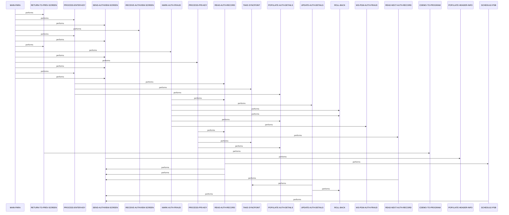

# COPAUS1C

**File**: `cbl/COPAUS1C.cbl`
**Type**: FileType.COBOL
**Analyzed**: 2026-02-25 15:35:43.046933

## Purpose

This CICS program displays detailed view of a selected pending authorization record from IMS database for a given account. It supports user interactions to validate selection, navigate to next record (PF8), toggle fraud status (PF5), and return to summary screen (PF3). Handles IMS DL/I calls for read, get next, replace, and CICS BMS for screen I/O with error messaging.

**Business Context**: CardDemo Authorization Module - Detail view for authorization messages

## Inputs

| Name | Type | Description |
|------|------|-------------|
| CARDDEMO-COMMAREA | IOType.CICS_COMMAREA | Common commarea containing account ID, selected PAU key, page info, fraud data from previous screens |
| PENDING-AUTH-SUMMARY | IOType.IMS_SEGMENT | Root segment PAUTSUM0 qualified by account ID |
| PENDING-AUTH-DETAILS | IOType.IMS_SEGMENT | Child segment PAUTDTL1 qualified by auth key or get next |
| COPAU1A | IOType.CICS_MAP | BMS map for authorization detail view input from user selections and keys |

## Outputs

| Name | Type | Description |
|------|------|-------------|
| COPAU1A | IOType.CICS_MAP | BMS map populated with auth details, header, messages for screen display |
| PENDING-AUTH-DETAILS | IOType.IMS_SEGMENT | Updated child segment with fraud flag toggled via REPL |
| CARDDEMO-COMMAREA | IOType.CICS_COMMAREA | Updated commarea returned to caller with current selection and context |

## Called Programs

| Program | Call Type | Purpose |
|---------|-----------|---------|
| COPAUS2C | CallType.CICS_LINK | Invoke fraud processing program to handle fraud report or removal |
| COPAUS0C | CallType.CICS_XCTL | Transfer control to authorization summary screen |

## Business Rules

- **BR001**: Validate account ID numeric and selected auth key not spaces/low-values before reading IMS
- **BR002**: Toggle fraud status: if confirmed set removed, else set confirmed
- **BR003**: Display approved 'A' green or declined 'D' red based on resp code '00'

## Paragraphs/Procedures

### MAIN-PARA
> [Source: MAIN-PARA.cbl.md](COPAUS1C.cbl.d/MAIN-PARA.cbl.md)

```
MAIN-PARA  (35 statements, depth=5)
PARAGRAPH
├── SET: SET ERR-FLG-OFF     TO TRUE
├── SET: SET SEND-ERASE-YES  TO TRUE
├── MOVE: MOVE SPACES TO WS-MESSAGE ERRMSGO OF COPAU1AO
├── IF: IF EIBCALEN = 0
│   ├── INITIALIZE: INITIALIZE CARDDEMO-COMMAREA
│   ├── MOVE: MOVE WS-PGM-AUTH-SMRY        TO CDEMO-TO-PROGRAM
│   ├── PERFORM: PERFORM RETURN-TO-PREV-SCREEN
│   └── ELSE: ELSE
│       ├── MOVE: MOVE DFHCOMMAREA(1:EIBCALEN) TO CARDDEMO-COMMAREA
│       ├── MOVE: MOVE SPACES                  TO CDEMO-CPVD-FRAUD-DATA
│       └── IF: IF NOT CDEMO-PGM-REENTER
│           ├── SET: SET CDEMO-PGM-REENTER    TO TRUE
│           ├── PERFORM: PERFORM PROCESS-ENTER-KEY
│           ├── PERFORM: PERFORM SEND-AUTHVIEW-SCREEN
│           └── ELSE: ELSE
│               ├── PERFORM: PERFORM RECEIVE-AUTHVIEW-SCREEN
│               └── EVALUATE: EVALUATE EIBAID
│                   ├── WHEN: WHEN DFHENTER
│                   │   ├── PERFORM: PERFORM PROCESS-ENTER-KEY
│                   │   └── PERFORM: PERFORM SEND-AUTHVIEW-SCREEN
│                   ├── WHEN: WHEN DFHPF3
│                   │   ├── MOVE: MOVE WS-PGM-AUTH-SMRY     TO CDEMO-TO-PROGRAM
│                   │   └── PERFORM: PERFORM RETURN-TO-PREV-SCREEN
│                   ├── WHEN: WHEN DFHPF5
│                   │   ├── PERFORM: PERFORM MARK-AUTH-FRAUD
│                   │   └── PERFORM: PERFORM SEND-AUTHVIEW-SCREEN
│                   ├── WHEN: WHEN DFHPF8
│                   │   ├── PERFORM: PERFORM PROCESS-PF8-KEY
│                   │   └── PERFORM: PERFORM SEND-AUTHVIEW-SCREEN
│                   └── WHEN: WHEN OTHER
│                       ├── PERFORM: PERFORM PROCESS-ENTER-KEY
│                       ├── MOVE: MOVE CCDA-MSG-INVALID-KEY TO WS-MESSAGE
│                       └── PERFORM: PERFORM SEND-AUTHVIEW-SCREEN
├── EXEC_CICS: EXEC CICS RETURN TRANSID (WS-CICS-TRANID) COMMAREA (CARDDEMO-COMMAREA...
└── UNKNOWN
```
This is the main orchestration paragraph serving as the program entry point for all invocations in the CICS transaction CPVD. It initializes flags like ERR-FLG-OFF and SEND-ERASE-YES, clears messages. Checks EIBCALEN: if 0 (initial), initializes CARDDEMO-COMMAREA and XCTLs to summary program COPAUS0C. Otherwise loads commarea from DFHCOMMAREA. If not reenter, processes ENTER key and sends screen. If reenter, receives map, evaluates EIBAID: DFHENTER processes selection, DFHPF3 returns to summary, DFHPF5 marks fraud via MARK-AUTH-FRAUD, DFHPF8 next record, other invalid key message. Delegates I/O to sub-paragraphs like SEND-AUTHVIEW-SCREEN. Handles no direct errors but relies on called paras to set WS-ERR-FLG and WS-MESSAGE. Finally executes CICS RETURN with TRANSID CPVD and updated commarea. Controls overall flow ensuring proper screen navigation and context preservation.

### PROCESS-ENTER-KEY
> [Source: PROCESS-ENTER-KEY.cbl.md](COPAUS1C.cbl.d/PROCESS-ENTER-KEY.cbl.md)

```
PROCESS-ENTER-KEY  (11 statements, depth=2)
PARAGRAPH
├── MOVE: MOVE LOW-VALUES          TO COPAU1AO
├── IF: IF CDEMO-ACCT-ID IS NUMERIC AND CDEMO-CPVD-PAU-SELECTED NOT = SPACES ...
│   ├── MOVE: MOVE CDEMO-ACCT-ID            TO WS-ACCT-ID
│   ├── MOVE: MOVE CDEMO-CPVD-PAU-SELECTED TO WS-AUTH-KEY
│   ├── PERFORM: PERFORM READ-AUTH-RECORD
│   ├── IF: IF IMS-PSB-SCHD
│   │   ├── SET: SET IMS-PSB-NOT-SCHD      TO TRUE
│   │   └── PERFORM: PERFORM TAKE-SYNCPOINT
│   └── ELSE: ELSE
│       └── SET: SET ERR-FLG-ON                TO TRUE
└── PERFORM: PERFORM POPULATE-AUTH-DETAILS
```
This paragraph handles user selection of an authorization record via ENTER key. It consumes CDEMO-ACCT-ID and CDEMO-CPVD-PAU-SELECTED from commarea/map. Validates if ACCT-ID numeric and selected key not spaces/low-values, else sets ERR-FLG-ON. If valid, moves to WS-ACCT-ID/WS-AUTH-KEY, performs READ-AUTH-RECORD to fetch IMS segments. If PSB scheduled, unschedules and syncpoints. Always performs POPULATE-AUTH-DETAILS to prepare screen data. Implements business rule for input validation before DB access. No outputs written directly, sets flags for upper levels. Errors from read handled in READ-AUTH-RECORD. Called from MAIN-PARA on initial load or ENTER.

### MARK-AUTH-FRAUD
> [Source: MARK-AUTH-FRAUD.cbl.md](COPAUS1C.cbl.d/MARK-AUTH-FRAUD.cbl.md)

```
MARK-AUTH-FRAUD  (23 statements, depth=2)
PARAGRAPH
├── MOVE: MOVE CDEMO-ACCT-ID            TO WS-ACCT-ID
├── MOVE: MOVE CDEMO-CPVD-PAU-SELECTED  TO WS-AUTH-KEY
├── PERFORM: PERFORM READ-AUTH-RECORD
├── IF: IF PA-FRAUD-CONFIRMED
│   ├── SET: SET PA-FRAUD-REMOVED          TO TRUE
│   ├── SET: SET WS-REMOVE-FRAUD           TO TRUE
│   └── ELSE: ELSE
│       ├── SET: SET PA-FRAUD-CONFIRMED        TO TRUE
│       └── SET: SET WS-REPORT-FRAUD           TO TRUE
├── MOVE: MOVE PENDING-AUTH-DETAILS        TO WS-FRAUD-AUTH-RECORD
├── MOVE: MOVE CDEMO-ACCT-ID               TO WS-FRD-ACCT-ID
├── MOVE: MOVE CDEMO-CUST-ID               TO WS-FRD-CUST-ID
├── EXEC_CICS: EXEC CICS LINK PROGRAM(WS-PGM-AUTH-FRAUD) COMMAREA(WS-FRAUD-DATA) NOH...
├── IF: IF EIBRESP = DFHRESP(NORMAL)
│   ├── IF: IF WS-FRD-UPDT-SUCCESS
│   │   ├── PERFORM: PERFORM UPDATE-AUTH-DETAILS
│   │   └── ELSE: ELSE
│   │       ├── MOVE: MOVE WS-FRD-ACT-MSG     TO WS-MESSAGE
│   │       └── PERFORM: PERFORM ROLL-BACK
│   └── ELSE: ELSE
│       └── PERFORM: PERFORM ROLL-BACK
├── MOVE: MOVE PA-AUTHORIZATION-KEY     TO CDEMO-CPVD-PAU-SELECTED
└── PERFORM: PERFORM POPULATE-AUTH-DETAILS
```
This paragraph processes PF5 to toggle fraud status on selected auth record. Consumes CDEMO-ACCT-ID and CDEMO-CPVD-PAU-SELECTED, reads IMS record via READ-AUTH-RECORD. If PA-FRAUD-CONFIRMED set to removed else confirmed, prepares WS-FRAUD-DATA with record and cust/acct IDs. Links to COPAUS2C program. If normal resp and success, updates details via UPDATE-AUTH-DETAILS, else rollback and message from fraud msg. Repopulates details with current key. Implements toggle business rule BR002. Handles errors via ROLL-BACK. Outputs updated IMS segment and screen refresh. Called from MAIN-PARA on PF5.

### PROCESS-PF8-KEY
> [Source: PROCESS-PF8-KEY.cbl.md](COPAUS1C.cbl.d/PROCESS-PF8-KEY.cbl.md)

```
PROCESS-PF8-KEY  (13 statements, depth=1)
PARAGRAPH
├── MOVE: MOVE CDEMO-ACCT-ID            TO WS-ACCT-ID
├── MOVE: MOVE CDEMO-CPVD-PAU-SELECTED  TO WS-AUTH-KEY
├── PERFORM: PERFORM READ-AUTH-RECORD
├── PERFORM: PERFORM READ-NEXT-AUTH-RECORD
├── IF: IF IMS-PSB-SCHD
│   ├── SET: SET IMS-PSB-NOT-SCHD      TO TRUE
│   └── PERFORM: PERFORM TAKE-SYNCPOINT
└── IF: IF AUTHS-EOF
    ├── SET: SET SEND-ERASE-NO          TO TRUE
    ├── MOVE: MOVE 'Already at the last Authorization...' TO WS-MESSAGE
    └── ELSE: ELSE
        ├── MOVE: MOVE PA-AUTHORIZATION-KEY  TO CDEMO-CPVD-PAU-SELECTED
        └── PERFORM: PERFORM POPULATE-AUTH-DETAILS
```
This paragraph handles PF8 to navigate to next authorization detail record. Consumes current selection, reads current via READ-AUTH-RECORD then READ-NEXT-AUTH-RECORD for GNP on details. If PSB scheduled, unschedules and syncpoints. If EOF, sets no erase, message 'Already at last'. Else moves new PA-AUTHORIZATION-KEY to selected, populates details. No validation beyond IMS status. Produces next record data for screen. Errors set message and flag in read paras. Called from MAIN-PARA on PF8.

### POPULATE-AUTH-DETAILS
> [Source: POPULATE-AUTH-DETAILS.cbl.md](COPAUS1C.cbl.d/POPULATE-AUTH-DETAILS.cbl.md)

```
POPULATE-AUTH-DETAILS  (48 statements, depth=3)
PARAGRAPH
└── IF: IF ERR-FLG-OFF
    ├── MOVE: MOVE PA-CARD-NUM               TO CARDNUMO
    ├── MOVE: MOVE PA-AUTH-ORIG-DATE(1:2)    TO WS-CURDATE-YY
    ├── MOVE: MOVE PA-AUTH-ORIG-DATE(3:2)    TO WS-CURDATE-MM
    ├── MOVE: MOVE PA-AUTH-ORIG-DATE(5:2)    TO WS-CURDATE-DD
    ├── MOVE: MOVE WS-CURDATE-MM-DD-YY       TO WS-AUTH-DATE
    ├── MOVE: MOVE WS-AUTH-DATE              TO AUTHDTO
    ├── MOVE: MOVE PA-AUTH-ORIG-TIME(1:2)    TO WS-AUTH-TIME(1:2)
    ├── MOVE: MOVE PA-AUTH-ORIG-TIME(3:2)    TO WS-AUTH-TIME(4:2)
    ├── MOVE: MOVE PA-AUTH-ORIG-TIME(5:2)    TO WS-AUTH-TIME(7:2)
    ├── MOVE: MOVE WS-AUTH-TIME              TO AUTHTMO
    ├── MOVE: MOVE PA-APPROVED-AMT           TO WS-AUTH-AMT
    ├── MOVE: MOVE WS-AUTH-AMT               TO AUTHAMTO
    ├── IF: IF PA-AUTH-RESP-CODE = '00'
    │   ├── MOVE: MOVE 'A'                    TO AUTHRSPO
    │   ├── MOVE: MOVE DFHGREEN               TO AUTHRSPC
    │   └── ELSE: ELSE
    │       ├── MOVE: MOVE 'D'                    TO AUTHRSPO
    │       └── MOVE: MOVE DFHRED                 TO AUTHRSPC
    ├── SEARCH: SEARCH ALL WS-DECLINE-REASON-TAB AT END
    ├── MOVE: MOVE '9999'                     TO AUTHRSNO
    ├── MOVE: MOVE '-'                        TO AUTHRSNO(5:1)
    ├── MOVE: MOVE 'ERROR'                    TO AUTHRSNO(6:)
    └── WHEN: WHEN DECL-CODE(WS-DECL-RSN-IDX) = PA-AUTH-RESP-REASON
        ├── MOVE: MOVE PA-AUTH-RESP-REASON        TO AUTHRSNO
        ├── MOVE: MOVE '-'                        TO AUTHRSNO(5:1)
        ├── MOVE: MOVE DECL-DESC(WS-DECL-RSN-IDX) TO AUTHRSNO(6:) END-SEARCH
        ├── MOVE: MOVE PA-PROCESSING-CODE        TO AUTHCDO
        ├── MOVE: MOVE PA-POS-ENTRY-MODE         TO POSEMDO
        ├── MOVE: MOVE PA-MESSAGE-SOURCE         TO AUTHSRCO
        ├── MOVE: MOVE PA-MERCHANT-CATAGORY-CODE TO MCCCDO
        ├── MOVE: MOVE PA-CARD-EXPIRY-DATE(1:2)  TO CRDEXPO(1:2)
        ├── MOVE: MOVE '/'                       TO CRDEXPO(3:1)
        ├── MOVE: MOVE PA-CARD-EXPIRY-DATE(3:2)  TO CRDEXPO(4:2)
        ├── MOVE: MOVE PA-AUTH-TYPE              TO AUTHTYPO
        ├── MOVE: MOVE PA-TRANSACTION-ID         TO TRNIDO
        ├── MOVE: MOVE PA-MATCH-STATUS           TO AUTHMTCO
        ├── IF: IF PA-FRAUD-CONFIRMED OR PA-FRAUD-REMOVED
        │   ├── MOVE: MOVE PA-AUTH-FRAUD          TO AUTHFRDO(1:1)
        │   ├── MOVE: MOVE '-'                    TO AUTHFRDO(2:1)
        │   ├── MOVE: MOVE PA-FRAUD-RPT-DATE      TO AUTHFRDO(3:)
        │   └── ELSE: ELSE
        │       └── MOVE: MOVE '-'                    TO AUTHFRDO
        ├── MOVE: MOVE PA-MERCHANT-NAME          TO MERNAMEO
        ├── MOVE: MOVE PA-MERCHANT-ID            TO MERIDO
        ├── MOVE: MOVE PA-MERCHANT-CITY          TO MERCITYO
        ├── MOVE: MOVE PA-MERCHANT-STATE         TO MERSTO
        └── MOVE: MOVE PA-MERCHANT-ZIP           TO MERZIPO
```
This paragraph formats and moves IMS data to BMS map fields if no error. Consumes PENDING-AUTH-DETAILS fields like PA-CARD-NUM, dates, amounts, resp codes. Transforms dates to MM/DD/YY and HH:MM:SS, searches decline reason table for description, sets colors green/red for A/D, formats fraud date. Moves merchant info, expiry, etc. to mapset fields like CARDNUMO, AUTHDTO, AUTHRSNO, AUTHFRDO. Implements transforms in data_flow. Skips if ERR-FLG-ON. No calls, no writes to DB. Error handling none direct. Called after reads to prepare screen output.

### RETURN-TO-PREV-SCREEN
> [Source: RETURN-TO-PREV-SCREEN.cbl.md](COPAUS1C.cbl.d/RETURN-TO-PREV-SCREEN.cbl.md)

```
RETURN-TO-PREV-SCREEN  (5 statements, depth=0)
PARAGRAPH
├── MOVE: MOVE WS-CICS-TRANID TO CDEMO-FROM-TRANID
├── MOVE: MOVE WS-PGM-AUTH-DTL TO CDEMO-FROM-PROGRAM
├── MOVE: MOVE ZEROS          TO CDEMO-PGM-CONTEXT
├── SET: SET CDEMO-PGM-ENTER TO TRUE
└── EXEC_CICS: EXEC CICS XCTL PROGRAM(CDEMO-TO-PROGRAM) COMMAREA(CARDDEMO-COMMAREA) ...
```
This paragraph handles return to authorization summary screen on PF3 or initial. Sets commarea fields CDEMO-FROM-TRANID 'CPVD', CDEMO-FROM-PROGRAM 'COPAUS1C', context zeros, enter true, CDEMO-TO-PROGRAM 'COPAUS0C'. Executes CICS XCTL to COPAUS0C with commarea. No inputs consumed beyond locals, no validation. Produces control transfer. No errors handled. Called from MAIN-PARA.

### SEND-AUTHVIEW-SCREEN
> [Source: SEND-AUTHVIEW-SCREEN.cbl.md](COPAUS1C.cbl.d/SEND-AUTHVIEW-SCREEN.cbl.md)

```
SEND-AUTHVIEW-SCREEN  (7 statements, depth=1)
PARAGRAPH
├── PERFORM: PERFORM POPULATE-HEADER-INFO
├── MOVE: MOVE WS-MESSAGE TO ERRMSGO OF COPAU1AO
├── MOVE: MOVE -1       TO CARDNUML
└── IF: IF SEND-ERASE-YES
    ├── EXEC_CICS: EXEC CICS SEND MAP('COPAU1A') MAPSET('COPAU01') FROM(COPAU1AO) ERASE ...
    └── ELSE: ELSE
        └── EXEC_CICS: EXEC CICS SEND MAP('COPAU1A') MAPSET('COPAU01') FROM(COPAU1AO) CURSOR...
```
This paragraph sends the populated BMS map to user terminal. Performs POPULATE-HEADER-INFO first for titles/date/time. Moves WS-MESSAGE to map error field, sets CARDNUML -1 for cursor. If SEND-ERASE-YES sends with ERASE, else without. Uses MAP COPAU1A MAPSET COPAU01 CURSOR. No inputs beyond globals, no business logic. Called frequently after processes. Errors none direct.

### RECEIVE-AUTHVIEW-SCREEN
> [Source: RECEIVE-AUTHVIEW-SCREEN.cbl.md](COPAUS1C.cbl.d/RECEIVE-AUTHVIEW-SCREEN.cbl.md)

```
RECEIVE-AUTHVIEW-SCREEN  (2 statements, depth=0)
PARAGRAPH
├── EXEC_CICS: EXEC CICS RECEIVE MAP('COPAU1A') MAPSET('COPAU01') INTO(COPAU1AI) NOH...
└── UNKNOWN
```
This paragraph receives user input from BMS map into COPAU1AI. Executes CICS RECEIVE MAP COPAU1A INTO(COPAU1AI) NOHANDLE. Minimal, no validation or transforms. Consumes map data for AID and selections. Called on reenter in MAIN-PARA. No calls, no errors explicit.

### POPULATE-HEADER-INFO
> [Source: POPULATE-HEADER-INFO.cbl.md](COPAUS1C.cbl.d/POPULATE-HEADER-INFO.cbl.md)

```
POPULATE-HEADER-INFO  (13 statements, depth=0)
PARAGRAPH
├── MOVE: MOVE FUNCTION CURRENT-DATE  TO WS-CURDATE-DATA
├── MOVE: MOVE CCDA-TITLE01           TO TITLE01O OF COPAU1AO
├── MOVE: MOVE CCDA-TITLE02           TO TITLE02O OF COPAU1AO
├── MOVE: MOVE WS-CICS-TRANID         TO TRNNAMEO OF COPAU1AO
├── MOVE: MOVE WS-PGM-AUTH-DTL        TO PGMNAMEO OF COPAU1AO
├── MOVE: MOVE WS-CURDATE-MONTH       TO WS-CURDATE-MM
├── MOVE: MOVE WS-CURDATE-DAY         TO WS-CURDATE-DD
├── MOVE: MOVE WS-CURDATE-YEAR(3:2)   TO WS-CURDATE-YY
├── MOVE: MOVE WS-CURDATE-MM-DD-YY    TO CURDATEO OF COPAU1AO
├── MOVE: MOVE WS-CURTIME-HOURS       TO WS-CURTIME-HH
├── MOVE: MOVE WS-CURTIME-MINUTE      TO WS-CURTIME-MM
├── MOVE: MOVE WS-CURTIME-SECOND      TO WS-CURTIME-SS
└── MOVE: MOVE WS-CURTIME-HH-MM-SS    TO CURTIMEO OF COPAU1AO
```
This paragraph populates common screen header fields. Gets current date via FUNCTION CURRENT-DATE, formats MM-DD-YY and HH:MM:SS. Moves titles CCDA-TITLE01/02, TRNNAMEO 'CPVD', PGMNAMEO 'COPAUS1C', CURDATEO, CURTIMEO from copies. No conditions or errors. Called by SEND-AUTHVIEW-SCREEN. Outputs static header data.

### READ-AUTH-RECORD
> [Source: READ-AUTH-RECORD.cbl.md](COPAUS1C.cbl.d/READ-AUTH-RECORD.cbl.md)

```
READ-AUTH-RECORD  (28 statements, depth=2)
PARAGRAPH
├── PERFORM: PERFORM SCHEDULE-PSB
├── MOVE: MOVE WS-ACCT-ID                TO PA-ACCT-ID
├── MOVE: MOVE WS-AUTH-KEY               TO PA-AUTHORIZATION-KEY
├── EXEC_DLI: EXEC DLI GU USING PCB(PAUT-PCB-NUM) SEGMENT (PAUTSUM0) INTO (PENDING-...
├── MOVE: MOVE DIBSTAT                          TO IMS-RETURN-CODE
├── EVALUATE: EVALUATE TRUE
│   ├── WHEN: WHEN STATUS-OK
│   │   └── SET: SET AUTHS-NOT-EOF              TO TRUE
│   ├── WHEN: WHEN SEGMENT-NOT-FOUND
│   ├── WHEN: WHEN END-OF-DB
│   │   └── SET: SET AUTHS-EOF                  TO TRUE
│   └── WHEN: WHEN OTHER
│       ├── MOVE: MOVE 'Y'     TO WS-ERR-FLG
│       ├── STRING: STRING ' System error while reading Auth Summary: Code:' IMS-RETURN-C...
│       └── PERFORM: PERFORM SEND-AUTHVIEW-SCREEN
└── IF: IF AUTHS-NOT-EOF
    ├── EXEC_DLI: EXEC DLI GNP USING PCB(PAUT-PCB-NUM) SEGMENT (PAUTDTL1) INTO (PENDING...
    ├── MOVE: MOVE DIBSTAT                          TO IMS-RETURN-CODE
    └── EVALUATE: EVALUATE TRUE
        ├── WHEN: WHEN STATUS-OK
        │   └── SET: SET AUTHS-NOT-EOF              TO TRUE
        ├── WHEN: WHEN SEGMENT-NOT-FOUND
        ├── WHEN: WHEN END-OF-DB
        │   └── SET: SET AUTHS-EOF                  TO TRUE
        └── WHEN: WHEN OTHER
            ├── MOVE: MOVE 'Y'     TO WS-ERR-FLG
            ├── STRING: STRING ' System error while reading Auth Details: Code:' IMS-RETURN-C...
            └── PERFORM: PERFORM SEND-AUTHVIEW-SCREEN
```
This paragraph performs IMS DL/I calls to read specific auth summary and details. Schedules PSB first. GU PAUTSUM0 by ACCNTID=WS-ACCT-ID into summary. Evaluates IMS-RETURN-CODE: OK not EOF, GE/GB EOF, other error message and send screen. If not EOF, GNP PAUTDTL1 by PAUT9CTS=WS-AUTH-KEY into details, similar eval. Sets AUTHS-EOF flags. Business logic for qualified reads. Errors branch to send screen with msg. Called by process paras.

### READ-NEXT-AUTH-RECORD
> [Source: READ-NEXT-AUTH-RECORD.cbl.md](COPAUS1C.cbl.d/READ-NEXT-AUTH-RECORD.cbl.md)

```
READ-NEXT-AUTH-RECORD  (12 statements, depth=1)
PARAGRAPH
├── EXEC_DLI: EXEC DLI GNP USING PCB(PAUT-PCB-NUM) SEGMENT (PAUTDTL1) INTO (PENDING...
├── MOVE: MOVE DIBSTAT                          TO IMS-RETURN-CODE
└── EVALUATE: EVALUATE TRUE
    ├── WHEN: WHEN STATUS-OK
    │   └── SET: SET AUTHS-NOT-EOF              TO TRUE
    ├── WHEN: WHEN SEGMENT-NOT-FOUND
    ├── WHEN: WHEN END-OF-DB
    │   └── SET: SET AUTHS-EOF                  TO TRUE
    └── WHEN: WHEN OTHER
        ├── MOVE: MOVE 'Y'     TO WS-ERR-FLG
        ├── STRING: STRING ' System error while reading next Auth: Code:' IMS-RETURN-CODE...
        └── PERFORM: PERFORM SEND-AUTHVIEW-SCREEN
```
This paragraph performs GNP on details segment for next record under same parent. EXEC DLI GNP PAUTDTL1 into details. Evaluates IMS-RETURN-CODE: OK not EOF, GE/GB EOF, other error msg and send screen. Sets flags. No qualification. Called after read current in PF8.

### UPDATE-AUTH-DETAILS
> [Source: UPDATE-AUTH-DETAILS.cbl.md](COPAUS1C.cbl.d/UPDATE-AUTH-DETAILS.cbl.md)

```
UPDATE-AUTH-DETAILS  (16 statements, depth=3)
PARAGRAPH
├── MOVE: MOVE WS-FRAUD-AUTH-RECORD           TO PENDING-AUTH-DETAILS
├── DISPLAY: DISPLAY 'RPT DT: ' PA-FRAUD-RPT-DATE
├── EXEC_DLI: EXEC DLI REPL USING PCB(PAUT-PCB-NUM) SEGMENT (PAUTDTL1) FROM (PENDIN...
├── MOVE: MOVE DIBSTAT                        TO IMS-RETURN-CODE
└── EVALUATE: EVALUATE TRUE
    ├── WHEN: WHEN STATUS-OK
    │   ├── PERFORM: PERFORM TAKE-SYNCPOINT
    │   └── IF: IF PA-FRAUD-REMOVED
    │       ├── MOVE: MOVE 'AUTH FRAUD REMOVED...'   TO WS-MESSAGE
    │       └── ELSE: ELSE
    │           └── MOVE: MOVE 'AUTH MARKED FRAUD...'    TO WS-MESSAGE
    └── WHEN: WHEN OTHER
        ├── PERFORM: PERFORM ROLL-BACK
        ├── MOVE: MOVE 'Y'     TO WS-ERR-FLG
        ├── STRING: STRING ' System error while FRAUD Tagging, ROLLBACK||' IMS-RETURN-COD...
        └── PERFORM: PERFORM SEND-AUTHVIEW-SCREEN
```
This paragraph replaces IMS details segment after fraud update. Moves WS-FRAUD-AUTH-RECORD to PENDING-AUTH-DETAILS. EXEC DLI REPL PAUTDTL1 FROM details. Eval IMS-RETURN-CODE: OK syncpoint and set success message based on removed or marked, other rollback error msg send screen. Implements post-link update. Called from MARK-AUTH-FRAUD.

### TAKE-SYNCPOINT
> [Source: TAKE-SYNCPOINT.cbl.md](COPAUS1C.cbl.d/TAKE-SYNCPOINT.cbl.md)

```
TAKE-SYNCPOINT  (2 statements, depth=0)
PARAGRAPH
├── EXEC_CICS: EXEC CICS SYNCPOINT END-EXEC
└── UNKNOWN
```
This utility paragraph commits current CICS/IMS changes. Executes EXEC CICS SYNCPOINT. No inputs, no conditions, no errors handled. Called after successful reads or updates to commit. Minimal role in transaction boundary.

### ROLL-BACK
> [Source: ROLL-BACK.cbl.md](COPAUS1C.cbl.d/ROLL-BACK.cbl.md)

```
ROLL-BACK  (2 statements, depth=0)
PARAGRAPH
├── EXEC_CICS: EXEC CICS SYNCPOINT ROLLBACK END-EXEC
└── UNKNOWN
```
This utility paragraph rolls back current CICS/IMS changes on error. Executes EXEC CICS SYNCPOINT ROLLBACK. No inputs or conditions. Called on fraud link failure or update error. Ensures data integrity on exceptions.

### SCHEDULE-PSB
> [Source: SCHEDULE-PSB.cbl.md](COPAUS1C.cbl.d/SCHEDULE-PSB.cbl.md)

```
SCHEDULE-PSB  (12 statements, depth=1)
PARAGRAPH
├── EXEC_DLI: EXEC DLI SCHD PSB((PSB-NAME)) NODHABEND END-EXEC
├── MOVE: MOVE DIBSTAT        TO IMS-RETURN-CODE
├── IF: IF PSB-SCHEDULED-MORE-THAN-ONCE
│   ├── EXEC_DLI: EXEC DLI TERM END-EXEC
│   ├── EXEC_DLI: EXEC DLI SCHD PSB((PSB-NAME)) NODHABEND END-EXEC
│   └── MOVE: MOVE DIBSTAT     TO IMS-RETURN-CODE
└── IF: IF STATUS-OK
    ├── SET: SET IMS-PSB-SCHD           TO TRUE
    └── ELSE: ELSE
        ├── MOVE: MOVE 'Y'     TO WS-ERR-FLG
        ├── STRING: STRING ' System error while scheduling PSB: Code:' IMS-RETURN-CODE DE...
        └── PERFORM: PERFORM SEND-AUTHVIEW-SCREEN
```
This utility paragraph schedules IMS PSB 'PSBPAUTB' for DL/I access. EXEC DLI SCHD PSB NODHABEND, checks if TC (scheduled more than once) then TERM and reschedule. Eval STATUS-OK set schd true, else error msg send screen. Handles PSB scheduling idempotency. Called before reads. Sets IMS-PSB-SCHD flag.

## Dead Code

The following artifacts were identified as dead code by static analysis:

| Artifact | Type | Line | Reason |
|----------|------|------|--------|
| COPAU1AI | record_layout | 17 | Record layout 'COPAU1AI' is never used by any program |
| COPAU1AO | record_layout | 181 | Record layout 'COPAU1AO' is never used by any program |
| WS-FRAUD-DATA | record_layout | 93 | Record layout 'WS-FRAUD-DATA' is never used by any program |
| WS-TABLES | record_layout | 56 | Record layout 'WS-TABLES' is never used by any program |

## Control Flow


## Sequence Diagram


