# COPAUS1C

**File**: `cbl/COPAUS1C.cbl`
**Type**: FileType.COBOL
**Analyzed**: 2026-02-09 15:27:30.597490

## Purpose

The COPAUS1C program is a CICS transaction that displays authorization details and allows users to mark authorizations as fraudulent. It receives input from a calling program (CDEMO), retrieves authorization records, and displays them on a screen (COPAU1A). The program also allows navigation between authorization records and linking to a fraud processing program.

**Business Context**: This program is likely used in a customer service or fraud investigation context to review and manage authorization records.

## Inputs

| Name | Type | Description |
|------|------|-------------|
| DFHCOMMAREA | IOType.CICS_COMMAREA | Communication area passed from the calling program (CDEMO). Contains account ID, authorization key, and other context information. |
| COPAU1AI | IOType.CICS_MAP | Input map structure for the COPAU1A screen. Contains user input such as account ID and authorization key. |

## Outputs

| Name | Type | Description |
|------|------|-------------|
| COPAU1AO | IOType.CICS_MAP | Output map structure for the COPAU1A screen. Contains authorization details and messages to be displayed to the user. |
| CARDDEMO-COMMAREA | IOType.CICS_COMMAREA | Communication area passed back to the calling program (CDEMO). Contains updated context information. |

## Called Programs

| Program | Call Type | Purpose |
|---------|-----------|---------|
| CDEMO-TO-PROGRAM | CallType.CICS_XCTL | Transfers control back to the calling program (CDEMO). |
| WS-PGM-AUTH-FRAUD | CallType.CICS_LINK | Links to a fraud processing program to update fraud details. |

## Business Rules

- **BR001**: If the account ID is numeric and the authorization key is not spaces or low-values, read the authorization record.
- **BR002**: If the authorization response code is '00', set the authorization response to 'A' (Approved) and the color to green. Otherwise, set the response to 'D' (Declined) and the color to red.
- **BR003**: If the user presses PF5, mark the authorization as fraudulent by linking to the fraud processing program.
- **BR004**: If the user presses PF8, read the next authorization record and display it.

## Paragraphs/Procedures

### COPAUS1C
This is the program ID declaration. It doesn't contain any executable code but serves as the entry point for the program's definition. It is not directly called but is the name used to invoke the transaction within the CICS environment. It defines the scope and context for all subsequent code within this program. The program's logic starts in MAIN-PARA.

### MAIN-PARA
This paragraph is the main control logic for the COPAUS1C transaction. It determines the program's execution path based on whether it's the first entry or a re-entry. On the first entry (EIBCALEN = 0), it initializes the CARDDEMO-COMMAREA, sets the CDEMO-TO-PROGRAM field, and performs RETURN-TO-PREV-SCREEN to return to the calling program. On subsequent entries, it receives the COMMAREA, processes the EIBAID (AID key pressed by the user), and calls different paragraphs based on the key pressed. It calls PROCESS-ENTER-KEY for DFHENTER, RETURN-TO-PREV-SCREEN for DFHPF3, MARK-AUTH-FRAUD for DFHPF5, PROCESS-PF8-KEY for DFHPF8, and PROCESS-ENTER-KEY for other keys. It also calls SEND-AUTHVIEW-SCREEN to display the screen after processing. Finally, it returns control to CICS with the updated COMMAREA.

### PROCESS-ENTER-KEY
This paragraph processes the ENTER key press. It moves LOW-VALUES to the COPAU1AO map structure to clear the screen. It then checks if the account ID (CDEMO-ACCT-ID) is numeric and the authorization key (CDEMO-CPVD-PAU-SELECTED) is not spaces or low-values. If both conditions are met, it moves the account ID and authorization key to working storage variables (WS-ACCT-ID, WS-AUTH-KEY) and performs READ-AUTH-RECORD to retrieve the authorization details. If IMS is scheduled, it performs TAKE-SYNCPOINT. If either condition is not met, it sets the error flag (ERR-FLG-ON). Finally, it performs POPULATE-AUTH-DETAILS to populate the output map with the retrieved authorization details.

### MARK-AUTH-FRAUD
This paragraph handles the logic for marking an authorization as fraudulent. It moves the account ID and authorization key from the COMMAREA to working storage. It then performs READ-AUTH-RECORD to retrieve the authorization record. Based on whether the authorization is already marked as fraud confirmed (PA-FRAUD-CONFIRMED), it either sets the PA-FRAUD-REMOVED flag or the PA-FRAUD-CONFIRMED flag. It then moves data to WS-FRAUD-DATA and links to the WS-PGM-AUTH-FRAUD program to update the fraud details. If the link is successful and the update is successful (WS-FRD-UPDT-SUCCESS), it performs UPDATE-AUTH-DETAILS. Otherwise, it moves an error message to WS-MESSAGE and performs ROLL-BACK. If the link fails, it performs ROLL-BACK. Finally, it moves the authorization key to the COMMAREA and performs POPULATE-AUTH-DETAILS to refresh the screen.

### PROCESS-PF8-KEY
This paragraph handles the logic for processing the PF8 key, which is used to navigate to the next authorization record. It moves the account ID and authorization key from the COMMAREA to working storage. It then performs READ-AUTH-RECORD to retrieve the current authorization record and READ-NEXT-AUTH-RECORD to retrieve the next authorization record. If IMS is scheduled, it performs TAKE-SYNCPOINT. If the end of the authorization records is reached (AUTHS-EOF), it sets the SEND-ERASE-NO flag and moves a message to WS-MESSAGE. Otherwise, it moves the authorization key to the COMMAREA and performs POPULATE-AUTH-DETAILS to display the next authorization record.

### POPULATE-AUTH-DETAILS
This paragraph populates the output map (COPAU1AO) with the authorization details retrieved from the PA-AUTHORIZATION-RECORD. It moves various fields from the PA-AUTHORIZATION-RECORD to the corresponding fields in the output map, including the card number, authorization date, authorization time, approved amount, response code, decline reason, processing code, POS entry mode, message source, merchant category code, card expiry date, authorization type, transaction ID, match status, fraud information, merchant name, merchant ID, merchant city, merchant state, and merchant zip code. It also handles the formatting of the authorization date and time. If the ERR-FLG-OFF flag is set, it performs the data population. It searches the WS-DECLINE-REASON-TAB to find the description of the decline reason code.

### RETURN-TO-PREV-SCREEN
This paragraph prepares to return control to the calling program (CDEMO). It moves the current transaction ID (WS-CICS-TRANID) and program ID (WS-PGM-AUTH-DTL) to the CARDDEMO-COMMAREA. It sets the CDEMO-PGM-CONTEXT to ZEROS and sets the CDEMO-PGM-ENTER flag to TRUE. Finally, it executes a CICS XCTL command to transfer control to the program specified in CDEMO-TO-PROGRAM, passing the CARDDEMO-COMMAREA.

### SEND-AUTHVIEW-SCREEN
This paragraph sends the COPAU1A screen to the terminal. It first performs POPULATE-HEADER-INFO to populate the header information on the screen. It then moves the message from WS-MESSAGE to the ERRMSGO field in the output map. It moves -1 to CARDNUML. If the SEND-ERASE-YES flag is set, it executes a CICS SEND MAP command with the ERASE option to clear the screen before sending the map. Otherwise, it executes a CICS SEND MAP command without the ERASE option. The CURSOR option is used to position the cursor on the screen.

### RECEIVE-AUTHVIEW-SCREEN
This paragraph receives data from the COPAU1A screen. It executes a CICS RECEIVE MAP command to receive the data entered by the user into the COPAU1AI input map. The NOHANDLE option is used to suppress CICS error handling.

### POPULATE-HEADER-INFO
This paragraph populates the header information in the output map (COPAU1AO). It moves the current date and time to working storage variables. It moves the title fields (CCDA-TITLE01, CCDA-TITLE02), transaction ID (WS-CICS-TRANID), and program name (WS-PGM-AUTH-DTL) to the corresponding fields in the output map. It formats the current date and time and moves them to the CURDATEO and CURTIMEO fields in the output map.

### READ-AUTH-RECORD
This paragraph retrieves pending authorization records from the IMS database. It first calls SCHEDULE-PSB to schedule the PSB. Then, it moves the account ID and authorization key from working storage to the PAUTSUM0 segment fields. It performs a GU (Get Unique) DL/I call to retrieve the PAUTSUM0 segment (Pending Authorization Summary) into PENDING-AUTH-SUMMARY based on the account ID. If the segment is found, it sets AUTHS-NOT-EOF to TRUE; otherwise, it sets AUTHS-EOF to TRUE or handles errors by setting WS-ERR-FLG and displaying an error message via SEND-AUTHVIEW-SCREEN. If a summary record is found, it then performs a GNP (Get Next within Parent) DL/I call to retrieve the PAUTDTL1 segment (Pending Authorization Details) into PENDING-AUTH-DETAILS based on the authorization key. Similar error handling is performed for the detail segment retrieval. This paragraph is the starting point for reading authorization records.

### READ-NEXT-AUTH-RECORD
This paragraph retrieves the next pending authorization detail record from the IMS database. It performs a GNP (Get Next within Parent) DL/I call to retrieve the PAUTDTL1 segment (Pending Authorization Details) into PENDING-AUTH-DETAILS. It then checks the DIBSTAT return code to determine the status of the call. If the call is successful (STATUS-OK), it sets AUTHS-NOT-EOF to TRUE. If the segment is not found or the end of the database is reached, it sets AUTHS-EOF to TRUE. If any other error occurs, it sets WS-ERR-FLG to 'Y', constructs an error message including the IMS return code, and displays the message using the SEND-AUTHVIEW-SCREEN paragraph. This paragraph is used to iterate through the authorization details for a given account.

### UPDATE-AUTH-DETAILS
This paragraph updates the pending authorization details in the IMS database. It moves the fraud authorization record from WS-FRAUD-AUTH-RECORD to PENDING-AUTH-DETAILS. It then performs a REPL (Replace) DL/I call to update the PAUTDTL1 segment (Pending Authorization Details) in the database with the data from PENDING-AUTH-DETAILS. After the update, it checks the DIBSTAT return code. If the update is successful (STATUS-OK), it calls TAKE-SYNCPOINT to commit the changes. It also sets a message indicating whether the authorization was marked or removed as fraud. If the update fails, it calls ROLL-BACK to undo the changes, sets WS-ERR-FLG to 'Y', constructs an error message including the IMS return code, and displays the message using the SEND-AUTHVIEW-SCREEN paragraph. This paragraph is responsible for marking or removing authorizations as fraudulent.

### TAKE-SYNCPOINT
This paragraph issues a CICS SYNCPOINT command to commit any recoverable resource changes made during the current unit of work. This includes IMS database updates. It ensures that the changes made to the database are permanently saved. There are no specific inputs or outputs for this paragraph other than the implicit commitment of resources. It is called by UPDATE-AUTH-DETAILS after a successful update of the authorization details.

### ROLL-BACK
This paragraph issues a CICS SYNCPOINT ROLLBACK command to reverse any recoverable resource changes made during the current unit of work. This includes IMS database updates. It is used to undo changes in case of an error. There are no specific inputs or outputs for this paragraph other than the implicit rollback of resources. It is called by UPDATE-AUTH-DETAILS when an error occurs during the update of authorization details.

### SCHEDULE-PSB
This paragraph schedules the PSB (Program Specification Block) for accessing the IMS database. It performs a SCHD (Schedule) DL/I call to schedule the PSB specified by PSB-NAME. The NODHABEND option prevents a DHABEND abend if the PSB is already scheduled. It checks the DIBSTAT return code. If the PSB was scheduled more than once, it terminates the PSB using a TERM DL/I call and then schedules it again. If the scheduling is successful (STATUS-OK), it sets IMS-PSB-SCHD to TRUE. If an error occurs during scheduling, it sets WS-ERR-FLG to 'Y', constructs an error message including the IMS return code, and displays the message using the SEND-AUTHVIEW-SCREEN paragraph. This paragraph prepares the program to access the IMS database.

## Control Flow

## Open Questions

- ? What is the purpose of the TAKE-SYNCPOINT paragraph?
  - Context: The code calls TAKE-SYNCPOINT after READ-AUTH-RECORD, but the paragraph's code is not provided in the snippet.
- ? What is the purpose of the ROLL-BACK paragraph?
  - Context: The code calls ROLL-BACK after errors, but the paragraph's code is not provided in the snippet.
- ? What is the purpose of the UPDATE-AUTH-DETAILS paragraph?
  - Context: The code calls UPDATE-AUTH-DETAILS after linking to the fraud program, but the paragraph's code is not provided in the snippet.
- ? What is the purpose of the READ-AUTH-RECORD and READ-NEXT-AUTH-RECORD paragraphs?
  - Context: The code calls these paragraphs to read authorization records, but the paragraph's code is not provided in the snippet.

## Sequence Diagram

```mermaid
sequenceDiagram
    COPAUS1C->>COCOM01Y: performs
    COPAUS1C->>COPAU01: performs
    COPAUS1C->>COTTL01Y: performs
    COPAUS1C->>CSDAT01Y: performs
    COPAUS1C->>CSMSG01Y: performs
    COPAUS1C->>CSMSG02Y: performs
    COPAUS1C->>CIPAUSMY: performs
    COPAUS1C->>CIPAUDTY: performs
    COPAUS1C->>DFHAID: performs
    COPAUS1C->>DFHBMSCA: performs
    MAIN-PARA->>RETURN-TO-PREV-SCREEN: WS-CICS-TRANID, WS-PGM-AUTH-DTL, CDEMO-TO-PROGRAM
    RETURN-TO-PREV-SCREEN-->>MAIN-PARA: CDEMO-FROM-TRANID, CDEMO-FROM-PROGRAM, CDEMO-PGM-CONTEXT, ...
    MAIN-PARA->>PROCESS-ENTER-KEY: CDEMO-ACCT-ID, CDEMO-CPVD-PAU-SELECTED
    PROCESS-ENTER-KEY-->>MAIN-PARA: WS-ACCT-ID, WS-AUTH-KEY, ERR-FLG-ON, ...
    MAIN-PARA->>SEND-AUTHVIEW-SCREEN: WS-MESSAGE, SEND-ERASE-YES
    MAIN-PARA->>RECEIVE-AUTHVIEW-SCREEN: performs
    MAIN-PARA->>PROCESS-ENTER-KEY: CDEMO-ACCT-ID, CDEMO-CPVD-PAU-SELECTED
    PROCESS-ENTER-KEY-->>MAIN-PARA: WS-ACCT-ID, WS-AUTH-KEY, ERR-FLG-ON, ...
    MAIN-PARA->>SEND-AUTHVIEW-SCREEN: WS-MESSAGE, SEND-ERASE-YES
    MAIN-PARA->>RETURN-TO-PREV-SCREEN: WS-CICS-TRANID, WS-PGM-AUTH-DTL, CDEMO-TO-PROGRAM
    RETURN-TO-PREV-SCREEN-->>MAIN-PARA: CDEMO-FROM-TRANID, CDEMO-FROM-PROGRAM, CDEMO-PGM-CONTEXT, ...
    MAIN-PARA->>MARK-AUTH-FRAUD: CDEMO-ACCT-ID, CDEMO-CPVD-PAU-SELECTED, CDEMO-CUST-ID
    MARK-AUTH-FRAUD-->>MAIN-PARA: WS-ACCT-ID, WS-AUTH-KEY, WS-FRAUD-AUTH-RECORD, ...
    MAIN-PARA->>SEND-AUTHVIEW-SCREEN: WS-MESSAGE, SEND-ERASE-YES
    MAIN-PARA->>PROCESS-PF8-KEY: CDEMO-ACCT-ID, CDEMO-CPVD-PAU-SELECTED
    PROCESS-PF8-KEY-->>MAIN-PARA: WS-ACCT-ID, WS-AUTH-KEY, SEND-ERASE-NO, ...
    MAIN-PARA->>SEND-AUTHVIEW-SCREEN: WS-MESSAGE, SEND-ERASE-YES
    MAIN-PARA->>PROCESS-ENTER-KEY: CDEMO-ACCT-ID, CDEMO-CPVD-PAU-SELECTED
    PROCESS-ENTER-KEY-->>MAIN-PARA: WS-ACCT-ID, WS-AUTH-KEY, ERR-FLG-ON, ...
    MAIN-PARA->>SEND-AUTHVIEW-SCREEN: WS-MESSAGE, SEND-ERASE-YES
    PROCESS-ENTER-KEY->>READ-AUTH-RECORD: WS-ACCT-ID, WS-AUTH-KEY
    READ-AUTH-RECORD-->>PROCESS-ENTER-KEY: IMS-RETURN-CODE, AUTHS-EOF, AUTHS-NOT-EOF, ...
    PROCESS-ENTER-KEY->>TAKE-SYNCPOINT: performs
    PROCESS-ENTER-KEY->>POPULATE-AUTH-DETAILS: ERR-FLG-ON, PA-CARD-NUM, PA-AUTH-ORIG-DATE, ...
    POPULATE-AUTH-DETAILS-->>PROCESS-ENTER-KEY: CARDNUMO, WS-AUTH-DATE, AUTHDTO, ...
    MARK-AUTH-FRAUD->>READ-AUTH-RECORD: WS-ACCT-ID, WS-AUTH-KEY
    READ-AUTH-RECORD-->>MARK-AUTH-FRAUD: PA-ACCT-ID, PA-AUTHORIZATION-KEY, PENDING-AUTH-SUMMARY, ...
    MARK-AUTH-FRAUD->>UPDATE-AUTH-DETAILS: WS-FRAUD-AUTH-RECORD, PA-FRAUD-RPT-DATE, PA-FRAUD-REMOVED
    UPDATE-AUTH-DETAILS-->>MARK-AUTH-FRAUD: PENDING-AUTH-DETAILS, WS-MESSAGE
    MARK-AUTH-FRAUD->>ROLL-BACK: performs
    MARK-AUTH-FRAUD->>ROLL-BACK: performs
    MARK-AUTH-FRAUD->>POPULATE-AUTH-DETAILS: ERR-FLG, PA-CARD-NUM, PA-AUTH-ORIG-DATE, ...
    POPULATE-AUTH-DETAILS-->>MARK-AUTH-FRAUD: WS-AUTH-DATE, WS-AUTH-TIME, WS-AUTH-AMT, ...
    MARK-AUTH-FRAUD->>WS-PGM-AUTH-FRAUD: performs
    PROCESS-PF8-KEY->>READ-AUTH-RECORD: WS-ACCT-ID, WS-AUTH-KEY
    READ-AUTH-RECORD-->>PROCESS-PF8-KEY: PA-ACCT-ID, PA-AUTHORIZATION-KEY, PENDING-AUTH-SUMMARY, ...
    PROCESS-PF8-KEY->>READ-NEXT-AUTH-RECORD: performs
    READ-NEXT-AUTH-RECORD-->>PROCESS-PF8-KEY: PENDING-AUTH-DETAILS, IMS-RETURN-CODE, AUTHS-EOF, ...
    PROCESS-PF8-KEY->>TAKE-SYNCPOINT: performs
    PROCESS-PF8-KEY->>POPULATE-AUTH-DETAILS: ERR-FLG, PA-CARD-NUM, PA-AUTH-ORIG-DATE, ...
    POPULATE-AUTH-DETAILS-->>PROCESS-PF8-KEY: WS-AUTH-DATE, WS-AUTH-TIME, WS-AUTH-AMT, ...
    RETURN-TO-PREV-SCREEN->>CDEMO-TO-PROGRAM: performs
    SEND-AUTHVIEW-SCREEN->>POPULATE-HEADER-INFO: WS-CICS-TRANID, WS-PGM-AUTH-DTL
    READ-AUTH-RECORD->>SCHEDULE-PSB: PSB-NAME
    SCHEDULE-PSB-->>READ-AUTH-RECORD: IMS-RETURN-CODE, WS-ERR-FLG, WS-IMS-PSB-SCHD-FLG
    READ-AUTH-RECORD->>SEND-AUTHVIEW-SCREEN: WS-MESSAGE, SEND-ERASE-YES
    READ-AUTH-RECORD->>SEND-AUTHVIEW-SCREEN: WS-MESSAGE, SEND-ERASE-YES
    READ-NEXT-AUTH-RECORD->>SEND-AUTHVIEW-SCREEN: WS-MESSAGE, SEND-ERASE-YES
    UPDATE-AUTH-DETAILS->>TAKE-SYNCPOINT: performs
    UPDATE-AUTH-DETAILS->>ROLL-BACK: performs
    UPDATE-AUTH-DETAILS->>SEND-AUTHVIEW-SCREEN: WS-MESSAGE, SEND-ERASE-YES
    SCHEDULE-PSB->>SEND-AUTHVIEW-SCREEN: WS-MESSAGE, SEND-ERASE-YES
```

