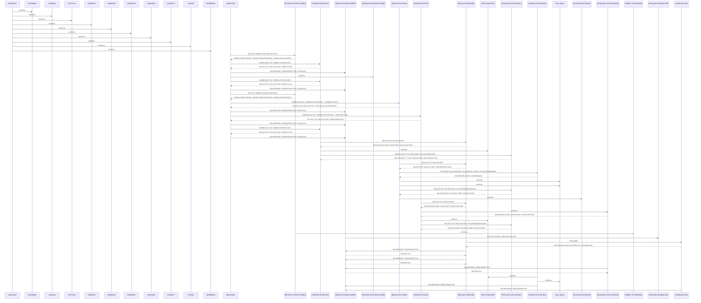

# COPAUS1C

**File:** COPAUS1C.cbl
**Type:** COBOL
**Status:** In Progress
**Iterations:** 1
**Analyzed:** 2026-02-27 14:38:52.873621

## Purpose

The COPAUS1C program is a CICS transaction that displays authorization details and allows users to mark authorizations as fraudulent. It retrieves authorization records based on account ID and authorization key, displays the information on a screen, and provides options to return to the previous screen, mark an authorization as fraudulent, or navigate to the next authorization record.

**Business Context:** This program is likely used by customer service representatives or fraud investigators to review and manage authorization records.
**Program Type:** ONLINE_CICS
**Citations:** Lines 23, 157, 230

## Inputs

### DFHCOMMAREA
- **Type:** CICS_COMMAREA
- **Description:** The COMMAREA receives data from the calling program, including the account ID and authorization key. It also passes data back to the calling program.
- **Copybook:** [CARDDEMO-COMMAREA](../copybooks/CARDDEMO-COMMAREA.cpy.md)
- **Lines:** 164, 167

### COPAU1AI
- **Type:** CICS_MAP
- **Description:** Input map for receiving data from the screen.
- **Lines:** 401

## Outputs

### COPAU1AO
- **Type:** CICS_MAP
- **Description:** Output map sent to the screen, containing authorization details and header information.
- **Lines:** 380, 388

### DFHCOMMAREA
- **Type:** CICS_COMMAREA
- **Description:** The COMMAREA is updated and passed back to the calling program with updated context and data.
- **Copybook:** [CARDDEMO-COMMAREA](../copybooks/CARDDEMO-COMMAREA.cpy.md)
- **Lines:** 199

## Called Programs

| Program | Call Type | Purpose | Line |
|---------|-----------|---------|------|
| [CDEMO-TO-PROGRAM](./CDEMO-TO-PROGRAM.cbl.md) | CICS_XCTL | Returns control to the previous screen or program. | 367 |
| [WS-PGM-AUTH-FRAUD](./WS-PGM-AUTH-FRAUD.cbl.md) | CICS_LINK | Links to the fraud processing program to update fraud details. | 246 |

## Business Rules

### BR001: If the account ID and authorization key are numeric and not spaces, read the authorization record.
**Logic:** Checks CDEMO-ACCT-ID and CDEMO-CPVD-PAU-SELECTED for valid values before reading the authorization record.
**Conditions:** IF CDEMO-ACCT-ID IS NUMERIC, IF CDEMO-CPVD-PAU-SELECTED NOT = SPACES AND LOW-VALUES
**Lines:** 211, 212

### BR002: If the authorization is not already marked as fraudulent, mark it as fraudulent; otherwise, remove the fraud flag.
**Logic:** Toggles the PA-FRAUD-CONFIRMED flag based on its current state.
**Conditions:** IF PA-FRAUD-CONFIRMED
**Lines:** 236

### BR003: If the authorization response code is '00', display 'A' (Approved) in green; otherwise, display 'D' (Declined) in red.
**Logic:** Sets the AUTHRSPO and AUTHRSPC fields based on PA-AUTH-RESP-CODE.
**Conditions:** IF PA-AUTH-RESP-CODE = '00'
**Lines:** 324

### BR004: If at the end of file, display message.
**Logic:** Checks AUTHS-EOF to determine if the end of the authorization file has been reached.
**Conditions:** IF AUTHS-EOF
**Lines:** 281

## Copybooks Used

| Copybook | Location | Purpose | Line |
|----------|----------|---------|------|
| [CARDDEMO-COMMAREA](../copybooks/CARDDEMO-COMMAREA.cpy.md) | LINKAGE | Defines the communication area used to pass data between programs. | 164 |
| [COPAU01](../copybooks/COPAU01.cpy.md) | WORKING_STORAGE | Defines the screen layout for the authorization view. | 382 |

## Data Flow

### Reads From
- **DFHCOMMAREA**: CDEMO-ACCT-ID, CDEMO-CPVD-PAU-SELECTED, EIBCALEN, EIBAID
  (Lines: 164, 175, 182)
- **COPAU1AI**: all fields
  (Lines: 401)
- **PENDING-AUTH-DETAILS**: PA-CARD-NUM, PA-AUTH-ORIG-DATE, PA-AUTH-ORIG-TIME, PA-APPROVED-AMT, PA-AUTH-RESP-CODE, PA-AUTH-RESP-REASON, PA-PROCESSING-CODE, PA-POS-ENTRY-MODE, PA-MESSAGE-SOURCE, PA-MERCHANT-CATAGORY-CODE, PA-CARD-EXPIRY-DATE, PA-AUTH-TYPE, PA-TRANSACTION-ID, PA-MATCH-STATUS, PA-FRAUD-CONFIRMED, PA-FRAUD-REMOVED, PA-FRAUD-RPT-DATE, PA-MERCHANT-NAME, PA-MERCHANT-ID, PA-MERCHANT-CITY, PA-MERCHANT-STATE, PA-MERCHANT-ZIP
  (Lines: 300, 302, 306, 312, 318, 323, 337, 338, 339, 340, 342, 344, 345, 346, 348, 350, 352, 354, 355, 356, 357, 358)

### Writes To
- **COPAU1AO**: CARDNUMO, AUTHDTO, AUTHTMO, AUTHAMTO, AUTHRSPO, AUTHRSPC, AUTHRSNO, AUTHCDO, POSEMDO, AUTHSRCO, MCCCDO, CRDEXPO, AUTHTYPO, TRNIDO, AUTHMTCO, AUTHFRDO, MERNAMEO, MERIDO, MERCITYO, MERSTO, MERZIPO, ERRMSGO, TITLE01O, TITLE02O, TRNNAMEO, PGMNAMEO, CURDATEO, CURTIMEO
  (Lines: 300, 304, 308, 313, 319, 320, 323, 326, 331, 332, 333, 334, 336, 338, 339, 340, 341, 343, 344, 345, 346, 347, 377, 412, 413, 414, 415, 419, 425)
- **DFHCOMMAREA**: CDEMO-FROM-TRANID, CDEMO-FROM-PROGRAM, CDEMO-PGM-CONTEXT, CDEMO-PGM-ENTER
  (Lines: 362, 363, 364, 365)

### Transformations
- **PA-AUTH-ORIG-DATE** → **AUTHDTO**: Formats the authorization date from YYMMDD to MM/DD/YY.
  (Lines: 302, 304)
- **PA-AUTH-ORIG-TIME** → **AUTHTMO**: Formats the authorization time from HHMMSS to HH:MM:SS.
  (Lines: 306, 308)
- **FUNCTION CURRENT-DATE** → **CURDATEO**: Formats the current date to MM/DD/YY.
  (Lines: 411, 419)
- **FUNCTION CURRENT-DATE** → **CURTIMEO**: Formats the current time to HH:MM:SS.
  (Lines: 411, 425)

## Key Paragraphs

### COPAUS1C
**Purpose:** This is the program entry point. It doesn't contain any executable code other than the PROGRAM-ID declaration. The program logic starts in the MAIN-PARA paragraph.
- Calls: COCOM01Y, COPAU01, COTTL01Y, CSDAT01Y, CSMSG01Y, CSDDY01, CSMSG02Y, CSDDY02, CSDDY03, CSDDY04
- Lines: 23-23

### MAIN-PARA
**Purpose:** This paragraph is the main control logic for the CICS transaction. It first checks if the COMMAREA is empty, indicating a first-time call. If so, it initializes the CARDDEMO-COMMAREA and calls RETURN-TO-PREV-SCREEN to return to the calling program. Otherwise, it moves the COMMAREA data into CARDDEMO-COMMAREA and checks if the program is re-entering. If not, it sets the re-enter flag, performs PROCESS-ENTER-KEY to read the authorization record, and then sends the authorization view screen. If the program is re-entering, it receives the screen data, evaluates the EIBAID (AID key pressed), and performs different actions based on the key pressed, such as processing the enter key, returning to the previous screen, marking the authorization as fraudulent, or processing PF8 to view the next authorization. Finally, it returns to CICS with the updated COMMAREA.
- Calls: RETURN-TO-PREV-SCREEN, PROCESS-ENTER-KEY, SEND-AUTHVIEW-SCREEN, RECEIVE-AUTHVIEW-SCREEN, PROCESS-ENTER-KEY, RETURN-TO-PREV-SCREEN, MARK-AUTH-FRAUD, PROCESS-PF8-KEY, PROCESS-ENTER-KEY
- Lines: 157-206

### PROCESS-ENTER-KEY
**Purpose:** This paragraph processes the ENTER key press. It initializes the COPAU1AO map with LOW-VALUES. It then checks if the account ID and authorization key are numeric and not spaces. If they are valid, it moves the account ID and authorization key to working storage variables, performs READ-AUTH-RECORD to retrieve the authorization record, and performs TAKE-SYNCPOINT if IMS PSB is scheduled. If the account ID or authorization key are invalid, it sets the error flag. Finally, it performs POPULATE-AUTH-DETAILS to populate the screen fields with the authorization details.
- Called by: MAIN-PARA
- Calls: READ-AUTH-RECORD, TAKE-SYNCPOINT, POPULATE-AUTH-DETAILS
- Lines: 208-228

### MARK-AUTH-FRAUD
**Purpose:** This paragraph marks an authorization as fraudulent. It moves the account ID and authorization key to working storage variables and performs READ-AUTH-RECORD to retrieve the authorization record. It then checks if the authorization is already marked as fraudulent. If not, it sets the PA-FRAUD-CONFIRMED flag to true; otherwise, it sets the PA-FRAUD-REMOVED flag to true. It moves the pending authorization details to the fraud authorization record and links to the fraud processing program (WS-PGM-AUTH-FRAUD). If the link is successful and the fraud update is successful, it performs UPDATE-AUTH-DETAILS. Otherwise, it moves an error message to WS-MESSAGE and performs ROLL-BACK. If the link fails, it performs ROLL-BACK. Finally, it moves the authorization key to CDEMO-CPVD-PAU-SELECTED and performs POPULATE-AUTH-DETAILS to refresh the screen.
- Called by: MAIN-PARA
- Calls: READ-AUTH-RECORD, UPDATE-AUTH-DETAILS, ROLL-BACK, ROLL-BACK, POPULATE-AUTH-DETAILS
- Lines: 230-266

### PROCESS-PF8-KEY
**Purpose:** This paragraph processes the PF8 key press to view the next authorization record. It moves the account ID and authorization key to working storage variables. It performs READ-AUTH-RECORD to retrieve the current authorization record and then performs READ-NEXT-AUTH-RECORD to retrieve the next authorization record. If IMS PSB is scheduled, it performs TAKE-SYNCPOINT. If the end of the authorization file has been reached (AUTHS-EOF is set), it sets the SEND-ERASE-NO flag to true and moves a message to WS-MESSAGE. Otherwise, it moves the authorization key to CDEMO-CPVD-PAU-SELECTED and performs POPULATE-AUTH-DETAILS to display the next authorization record.
- Called by: MAIN-PARA
- Calls: READ-AUTH-RECORD, READ-NEXT-AUTH-RECORD, TAKE-SYNCPOINT, POPULATE-AUTH-DETAILS
- Lines: 268-289

### POPULATE-AUTH-DETAILS
**Purpose:** This paragraph populates the authorization details on the screen. If the error flag is off, it moves data from the PA- (Pending Authorization) fields to the corresponding output fields in the COPAU1AO map. It formats the authorization date and time, sets the authorization response code and description, and moves other authorization details such as processing code, POS entry mode, message source, merchant category code, card expiry date, authorization type, transaction ID, match status, fraud information, and merchant information. It uses a SEARCH statement to find the decline reason description based on the PA-AUTH-RESP-REASON code. If the error flag is on, this paragraph is skipped, likely indicating an error condition handled elsewhere.
- Called by: PROCESS-ENTER-KEY, MARK-AUTH-FRAUD, PROCESS-PF8-KEY
- Lines: 291-358

### RETURN-TO-PREV-SCREEN
**Purpose:** This paragraph returns control to the previous screen or program. It moves the current transaction ID and program name to the CARDDEMO-COMMAREA. It sets the program context to zeros and sets the CDEMO-PGM-ENTER flag to true. It then performs a CICS XCTL to the CDEMO-TO-PROGRAM, passing the CARDDEMO-COMMAREA.
- Called by: MAIN-PARA
- Calls: CDEMO-TO-PROGRAM
- Lines: 360-370

### SEND-AUTHVIEW-SCREEN
**Purpose:** This paragraph sends the authorization view screen to the terminal. It first performs POPULATE-HEADER-INFO to populate the header information on the screen. It moves the WS-MESSAGE to the error message field in the COPAU1AO map. It sets the card number length to -1. If the SEND-ERASE-YES flag is set, it sends the map with the ERASE option, which clears the screen before sending the map. Otherwise, it sends the map without the ERASE option.
- Called by: MAIN-PARA
- Calls: POPULATE-HEADER-INFO
- Lines: 373-396

### RECEIVE-AUTHVIEW-SCREEN
**Purpose:** This paragraph receives data from the authorization view screen. It performs a CICS RECEIVE command to receive the data from the COPAU1A map into the COPAU1AI input map. The NOHANDLE option is used, indicating that the program will handle any errors that occur during the receive operation.
- Called by: MAIN-PARA
- Lines: 398-406

### POPULATE-HEADER-INFO
**Purpose:** This paragraph populates the header information on the screen. It moves the current date and time to working storage variables. It moves the CCDA-TITLE01 and CCDA-TITLE02 to the title fields in the COPAU1AO map. It moves the transaction ID and program name to the corresponding fields in the COPAU1AO map. It formats the current date and time and moves them to the date and time fields in the COPAU1AO map.
- Called by: SEND-AUTHVIEW-SCREEN
- Lines: 409-429

### READ-AUTH-RECORD
**Purpose:** This paragraph retrieves authorization summary and detail records from the IMS database. It first calls SCHEDULE-PSB to schedule the PSB. It then moves the account ID and authorization key from the work area to the corresponding fields in the PAUTSUM0 segment. A DLI GU (Get Unique) call is made to retrieve the PENDING-AUTH-SUMMARY segment based on the account ID. If the segment is found, a DLI GNP (Get Next within Parent) call is made to retrieve the PENDING-AUTH-DETAILS segment based on the authorization key. Error handling is performed after each DLI call, and if an error occurs, an error message is constructed and displayed using SEND-AUTHVIEW-SCREEN. The IMS return code (DIBSTAT) is checked to determine the success or failure of the DLI calls.
- Calls: SCHEDULE-PSB, SEND-AUTHVIEW-SCREEN, SEND-AUTHVIEW-SCREEN
- Lines: 431-491

### READ-NEXT-AUTH-RECORD
**Purpose:** This paragraph retrieves the next PENDING-AUTH-DETAILS segment within the current parent (authorization summary). It issues a DLI GNP (Get Next within Parent) call to retrieve the next PENDING-AUTH-DETAILS segment. The IMS return code (DIBSTAT) is checked to determine the success or failure of the DLI call. If an error occurs, an error message is constructed and displayed using SEND-AUTHVIEW-SCREEN. The paragraph sets the AUTHS-EOF flag if the end of the database is reached or a segment is not found.
- Calls: SEND-AUTHVIEW-SCREEN
- Lines: 493-518

### UPDATE-AUTH-DETAILS
**Purpose:** This paragraph updates the PENDING-AUTH-DETAILS segment in the IMS database with fraud reporting information. It moves the fraud authorization record from the work area (WS-FRAUD-AUTH-RECORD) to the PENDING-AUTH-DETAILS segment. A DLI REPL (Replace) call is then made to update the segment in the IMS database. The IMS return code (DIBSTAT) is checked to determine the success or failure of the DLI call. If the update is successful, TAKE-SYNCPOINT is performed to commit the changes. If an error occurs, ROLL-BACK is performed to undo the changes, and an error message is constructed and displayed using SEND-AUTHVIEW-SCREEN. The paragraph also displays a message indicating whether the authorization was marked or removed as fraudulent.
- Calls: TAKE-SYNCPOINT, ROLL-BACK, SEND-AUTHVIEW-SCREEN
- Lines: 520-556

### TAKE-SYNCPOINT
**Purpose:** This paragraph issues a CICS SYNCPOINT command to commit the changes made to the database. This ensures that the updates are permanently saved. There are no inputs or outputs specific to this paragraph other than the implicit effect on the database. No error handling is explicitly performed within this paragraph. It is called by UPDATE-AUTH-DETAILS after a successful update.
- Lines: 557-564

### ROLL-BACK
**Purpose:** This paragraph issues a CICS SYNCPOINT ROLLBACK command to undo any changes made to the database since the last syncpoint. This is used to handle errors during the update process. There are no inputs or outputs specific to this paragraph other than the implicit effect on the database. No error handling is explicitly performed within this paragraph. It is called by UPDATE-AUTH-DETAILS when an error occurs during the update process.
- Lines: 565-573

### SCHEDULE-PSB
**Purpose:** This paragraph schedules the PSB (Program Specification Block) required for accessing the IMS database. It issues a DLI SCHD command with the PSB name. The NODHABEND option is specified to prevent a transaction abend if the PSB is already scheduled. The IMS return code (DIBSTAT) is checked to determine the success or failure of the scheduling. If the PSB has been scheduled more than once, it is terminated and then rescheduled. If an error occurs during scheduling, an error message is constructed and displayed using SEND-AUTHVIEW-SCREEN. The paragraph sets the IMS-PSB-SCHD flag if the scheduling is successful.
- Called by: READ-AUTH-RECORD
- Calls: SEND-AUTHVIEW-SCREEN
- Lines: 574-603

## Inter-Paragraph Data Flow

| Caller | Callee | Inputs | Outputs | Purpose |
|--------|--------|--------|---------|---------|
| MAIN-PARA | RETURN-TO-PREV-SCREEN | WS-CICS-TRANID, WS-PGM-AUTH-DTL, CDEMO-TO-PROGRAM | CDEMO-FROM-TRANID, CDEMO-FROM-PROGRAM, CDEMO-PGM-CONTEXT, CDEMO-PGM-ENTER | Returns control to the previous screen by setting up the COMMAREA and XCTLing to the program specified in CDEMO-TO-PROGRAM. |
| MAIN-PARA | PROCESS-ENTER-KEY | CDEMO-ACCT-ID, CDEMO-CPVD-PAU-SELECTED | WS-ACCT-ID, WS-AUTH-KEY, ERR-FLG, IMS-PSB-SCHD-FLG | Processes the ENTER key by validating input data, setting up working storage variables, reading the authorization record, and populating authorization details. |
| MAIN-PARA | SEND-AUTHVIEW-SCREEN | WS-MESSAGE, SEND-ERASE-YES | CARDNUML | Sends the authorization view screen to the user, optionally erasing the screen first based on the SEND-ERASE-FLG flag. |
| MAIN-PARA | RECEIVE-AUTHVIEW-SCREEN | - | - | Receives the authorization view screen input from the user into the input map COPAU1AI. |
| MAIN-PARA | PROCESS-ENTER-KEY | CDEMO-ACCT-ID, CDEMO-CPVD-PAU-SELECTED | WS-ACCT-ID, WS-AUTH-KEY, ERR-FLG, IMS-PSB-SCHD-FLG | Processes the ENTER key by validating input data, setting up working storage variables, reading the authorization record, and populating authorization details. |
| MAIN-PARA | SEND-AUTHVIEW-SCREEN | WS-MESSAGE, SEND-ERASE-YES, SEND-ERASE-NO | - | Sends the authorization view screen to the user, optionally erasing the screen based on the SEND-ERASE-FLG flag. |
| MAIN-PARA | RETURN-TO-PREV-SCREEN | WS-CICS-TRANID, WS-PGM-AUTH-DTL | CDEMO-FROM-TRANID, CDEMO-FROM-PROGRAM, CDEMO-PGM-CONTEXT, CDEMO-PGM-ENTER | Returns control to the previous program by XCTL with updated COMMAREA fields indicating the calling context. |
| MAIN-PARA | MARK-AUTH-FRAUD | CDEMO-ACCT-ID, CDEMO-CPVD-PAU-SELECTED, CDEMO-CUST-ID | WS-ACCT-ID, WS-AUTH-KEY, WS-FRAUD-AUTH-RECORD, WS-FRD-ACCT-ID, WS-FRD-CUST-ID, CDEMO-CPVD-PAU-SELECTED | Marks the selected authorization as fraud or removes fraud status by updating the record and linking to the fraud processing program. |
| MAIN-PARA | SEND-AUTHVIEW-SCREEN | WS-MESSAGE, SEND-ERASE-YES, SEND-ERASE-NO | - | Sends the authorization view screen to the user, optionally erasing the screen based on the SEND-ERASE-FLG flag. |
| MAIN-PARA | PROCESS-PF8-KEY | CDEMO-ACCT-ID, CDEMO-CPVD-PAU-SELECTED, IMS-PSB-SCHD, AUTHS-EOF | WS-ACCT-ID, WS-AUTH-KEY, SEND-ERASE-NO, WS-MESSAGE, CDEMO-CPVD-PAU-SELECTED | Processes the PF8 key to navigate to the next authorization record for the account, updating screen data or displaying a message if at the end. |
| MAIN-PARA | SEND-AUTHVIEW-SCREEN | WS-MESSAGE, SEND-ERASE-YES, COPAU1AO | - | Sends the authorization view screen to the user, optionally erasing the screen first based on the SEND-ERASE-FLG. |
| MAIN-PARA | PROCESS-ENTER-KEY | CDEMO-ACCT-ID, CDEMO-CPVD-PAU-SELECTED | WS-ACCT-ID, WS-AUTH-KEY, ERR-FLG-ON | Processes the ENTER key by validating input data, setting up authorization key and account ID, and reading the corresponding authorization record. |
| MAIN-PARA | SEND-AUTHVIEW-SCREEN | WS-MESSAGE, SEND-ERASE-YES, COPAU1AO | - | Sends the authorization view screen to the user, optionally erasing the screen first based on the SEND-ERASE-FLG. |
| PROCESS-ENTER-KEY | READ-AUTH-RECORD | WS-ACCT-ID, WS-AUTH-KEY | IMS-RETURN-CODE, AUTHS-EOF, AUTHS-NOT-EOF, WS-ERR-FLG | Reads the authorization summary and detail records from IMS using the account ID and authorization key, setting appropriate flags based on the result. |
| PROCESS-ENTER-KEY | TAKE-SYNCPOINT | - | - | Commits the current unit of work by issuing a CICS SYNCPOINT to ensure data integrity. |
| PROCESS-ENTER-KEY | POPULATE-AUTH-DETAILS | ERR-FLG-OFF, PA-CARD-NUM, PA-AUTH-ORIG-DATE, PA-AUTH-ORIG-TIME, PA-APPROVED-AMT, PA-AUTH-RESP-CODE, PA-AUTH-RESP-REASON, PA-PROCESSING-CODE, PA-POS-ENTRY-MODE, PA-MESSAGE-SOURCE, PA-MERCHANT-CATAGORY-CODE, PA-CARD-EXPIRY-DATE, PA-AUTH-TYPE, PA-TRANSACTION-ID, PA-MATCH-STATUS, PA-FRAUD-CONFIRMED, PA-FRAUD-REMOVED, PA-AUTH-FRAUD, PA-FRAUD-RPT-DATE, PA-MERCHANT-NAME, PA-MERCHANT-ID, PA-MERCHANT-CITY, PA-MERCHANT-STATE, PA-MERCHANT-ZIP, WS-CURDATE-YY, WS-CURDATE-MM, WS-CURDATE-DD, WS-AUTH-DATE, WS-AUTH-AMT | WS-CURDATE-YY, WS-CURDATE-MM, WS-CURDATE-DD, WS-AUTH-DATE, WS-AUTH-AMT | Populates the authorization details screen fields using data from the PAUTDTL1 segment and working storage, including formatting dates, amounts, and decline reasons. |
| MARK-AUTH-FRAUD | READ-AUTH-RECORD | WS-ACCT-ID, WS-AUTH-KEY | WS-ACCT-ID, WS-AUTH-KEY, IMS-RETURN-CODE, AUTHS-EOF, AUTHS-NOT-EOF | Reads the authorization summary and detail records from the IMS database using the account ID and authorization key set in working storage. |
| MARK-AUTH-FRAUD | UPDATE-AUTH-DETAILS | WS-FRAUD-AUTH-RECORD, PA-FRAUD-RPT-DATE, PA-FRAUD-REMOVED | IMS-RETURN-CODE, WS-MESSAGE | Updates the authorization detail record in IMS with fraud status changes and performs a syncpoint or rollback based on success. |
| MARK-AUTH-FRAUD | ROLL-BACK | - | - | Executes a CICS rollback to undo database changes and ends the transaction abnormally. |
| MARK-AUTH-FRAUD | ROLL-BACK | - | - | Executes a CICS rollback to undo database changes and ends the transaction abnormally. |
| MARK-AUTH-FRAUD | POPULATE-AUTH-DETAILS | WS-ACCT-ID, WS-AUTH-KEY, PA-AUTHORIZATION-KEY, PA-AUTH-ORIG-DATE, PA-AUTH-ORIG-TIME, PA-APPROVED-AMT, PA-AUTH-RESP-CODE, PA-AUTH-RESP-REASON, PA-PROCESSING-CODE, PA-POS-ENTRY-MODE, PA-MESSAGE-SOURCE, PA-MERCHANT-CATAGORY-CODE, PA-CARD-EXPIRY-DATE, PA-AUTH-TYPE, PA-TRANSACTION-ID, PA-MATCH-STATUS, PA-FRAUD-CONFIRMED, PA-FRAUD-REMOVED, PA-AUTH-FRAUD, PA-FRAUD-RPT-DATE, PA-MERCHANT-NAME, PA-MERCHANT-ID, PA-MERCHANT-CITY, PA-MERCHANT-STATE, PA-MERCHANT-ZIP, WS-CURDATE-MM, WS-CURDATE-DD, WS-CURDATE-YY, WS-AUTH-AMT, WS-AUTH-DATE, WS-AUTH-TIME, WS-DECLINE-REASON-TAB, WS-DECL-RSN-IDX | WS-AUTH-DATE, WS-AUTH-TIME, WS-AUTH-AMT | Populates screen fields and working storage with authorization details from the current PA segment, including date, time, amount, response code, fraud status, and merchant information for display. |
| PROCESS-PF8-KEY | READ-AUTH-RECORD | WS-ACCT-ID, WS-AUTH-KEY | IMS-RETURN-CODE, AUTHS-EOF, AUTHS-NOT-EOF | Reads the authorization summary and detail records for a specific account and authorization key from IMS, setting EOF flag if not found. |
| PROCESS-PF8-KEY | READ-NEXT-AUTH-RECORD | - | IMS-RETURN-CODE, AUTHS-EOF, AUTHS-NOT-EOF | Retrieves the next authorization detail record in sequence from IMS and updates the EOF status accordingly. |
| PROCESS-PF8-KEY | TAKE-SYNCPOINT | - | - | Issues a CICS SYNCPOINT to commit the current unit of work to ensure data consistency. |
| PROCESS-PF8-KEY | POPULATE-AUTH-DETAILS | WS-ACCT-ID, WS-AUTH-KEY, PA-AUTHORIZATION-KEY, PA-AUTH-ORIG-DATE, PA-AUTH-ORIG-TIME, PA-APPROVED-AMT, PA-AUTH-RESP-CODE, PA-AUTH-RESP-REASON, PA-PROCESSING-CODE, PA-POS-ENTRY-MODE, PA-MESSAGE-SOURCE, PA-MERCHANT-CATAGORY-CODE, PA-CARD-EXPIRY-DATE, PA-AUTH-TYPE, PA-TRANSACTION-ID, PA-MATCH-STATUS, PA-FRAUD-CONFIRMED, PA-FRAUD-REMOVED, PA-AUTH-FRAUD, PA-FRAUD-RPT-DATE, PA-MERCHANT-NAME, PA-MERCHANT-ID, PA-MERCHANT-CITY, PA-MERCHANT-STATE, PA-MERCHANT-ZIP, WS-CURDATE-MM, WS-CURDATE-DD, WS-CURDATE-YY, WS-AUTH-AMT, WS-AUTH-DATE, WS-AUTH-TIME, WS-DECLINE-REASON-TAB, WS-DECL-RSN-IDX | WS-AUTH-DATE, WS-AUTH-TIME, WS-AUTH-AMT | Populates screen output fields with formatted authorization data from the current PA segment for display after reading the next record. |
| SEND-AUTHVIEW-SCREEN | POPULATE-HEADER-INFO | WS-CICS-TRANID, WS-PGM-AUTH-DTL | - | Populates the header information on the screen by moving current date, time, titles, transaction ID, and program name to the output map. |
| READ-AUTH-RECORD | SCHEDULE-PSB | PSB-NAME | IMS-RETURN-CODE, WS-ERR-FLG, WS-MESSAGE, IMS-PSB-SCHD-FLG | Schedules the IMS PSB and handles errors by setting the error flag and displaying a message if scheduling fails. |
| READ-AUTH-RECORD | SEND-AUTHVIEW-SCREEN | WS-MESSAGE, SEND-ERASE-FLG | WS-ERR-FLG | Sends the authorization view screen with error messages and clears or sets cursor based on erase flag when an IMS read error occurs. |
| READ-AUTH-RECORD | SEND-AUTHVIEW-SCREEN | WS-MESSAGE, SEND-ERASE-FLG | WS-ERR-FLG | Sends the authorization view screen with error messages and clears or sets cursor based on erase flag when an IMS read error occurs during detail record retrieval. |
| READ-NEXT-AUTH-RECORD | SEND-AUTHVIEW-SCREEN | WS-MESSAGE, SEND-ERASE-FLG | WS-ERR-FLG | Sends the authorization view screen with error messages and clears or sets cursor based on erase flag when an error occurs while reading the next authorization record. |
| UPDATE-AUTH-DETAILS | TAKE-SYNCPOINT | - | - | Commits the current transaction to ensure data integrity after successfully updating the authorization details. |
| UPDATE-AUTH-DETAILS | ROLL-BACK | - | - | Rolls back the current transaction due to an error during the authorization update process. |
| UPDATE-AUTH-DETAILS | SEND-AUTHVIEW-SCREEN | WS-MESSAGE, SEND-ERASE-YES | - | Sends the authorization view screen with an error message and cursor handling based on the erase flag. |
| SCHEDULE-PSB | SEND-AUTHVIEW-SCREEN | WS-MESSAGE, SEND-ERASE-YES | - | Displays the authorization view screen with an error message when PSB scheduling fails. |

## Error Handling

- **EIBRESP not equal to DFHRESP(NORMAL) after LINK to WS-PGM-AUTH-FRAUD:** ROLL-BACK
  (Lines: 253)
- **WS-FRD-UPDT-SUCCESS is false after LINK to WS-PGM-AUTH-FRAUD:** MOVE WS-FRD-ACT-MSG TO WS-MESSAGE and ROLL-BACK
  (Lines: 250, 251)
- **AUTHS-EOF is true in PROCESS-PF8-KEY:** SET SEND-ERASE-NO to TRUE and MOVE message to WS-MESSAGE
  (Lines: 281, 282)
- **AT END during SEARCH ALL WS-DECLINE-REASON-TAB:** MOVE '9999' to AUTHRSNO and 'ERROR' to AUTHRSNO(6:)
  (Lines: 320, 321, 322)

## CICS Operations

| Command | Resource | Purpose | Line |
|---------|----------|---------|------|
| RETURN |  | Returns control to CICS. | 199 |
| LINK | WS-PGM-AUTH-FRAUD | Links to the fraud processing program. | 246 |
| XCTL | CDEMO-TO-PROGRAM | Transfers control to the previous screen or program. | 367 |
| SEND MAP | COPAU1A | Sends the authorization view screen to the terminal. | 382 |
| RECEIVE MAP | COPAU1A | Receives data from the authorization view screen. | 401 |

## Resolved Questions

- **Q:** What is the purpose of the READ-AUTH-RECORD and READ-NEXT-AUTH-RECORD paragraphs?
  **A:** The purpose of the `READ-AUTH-RECORD` and `READ-NEXT-AUTH-RECORD` paragraphs are as follows:

*   **`READ-AUTH-RECORD`**: This paragraph appears to schedule the PSB (Program Specification Block) and move the account ID to `PA-ACCT-ID`. It seems to prepare the program to read an authorization record, likely by setting up the necessary parameters for the IMS database interaction. (Source: `cbl/COPAUS1C.cbl:431`)
*   **`READ-NEXT-AUTH-RECORD`**: This paragraph reads the next authorization record from the IMS database. It uses the `EXEC DLI GNP` command to retrieve the next `PAUTDTL1` segment into the `PENDING-AUTH-DETAILS` area. (Source: `cbl/COPAUS1C.cbl:493`)

In summary, `READ-AUTH-RECORD` sets up the read operation, and `READ-NEXT-AUTH-RECORD` actually performs the read of the next authorization record.
- **Q:** What is the purpose of the ROLL-BACK paragraph?
  **A:** The purpose of the `ROLL-BACK` paragraph in `COPAUS1C.cbl` is to rollback database changes. It executes a CICS `SYNCPOINT ROLLBACK` command, which undoes any changes made to recoverable resources since the last sync point. This is used in situations where an error occurs during processing, such as when updating authorization details or marking an authorization as fraudulent. The code comment at line 563 confirms this.
- **Q:** What is the purpose of the TAKE-SYNCPOINT paragraph?
  **A:** The `TAKE-SYNCPOINT` paragraph in `COPAUS1C.cbl` executes a CICS `SYNCPOINT` command. The CICS SYNCPOINT command ensures that all recoverable resources are synchronized to a point of consistency. This means that all updates made to recoverable resources within the current unit of work are either committed (made permanent) or backed out (discarded) as a single logical unit.

The paragraph is called after:
1. Reading an authorization record (`READ-AUTH-RECORD`) when `IMS-PSB-SCHD` is true.
2. Reading the next authorization record (`READ-NEXT-AUTH-RECORD`) when `IMS-PSB-SCHD` is true.
3. After marking an authorization as fraudulent.

In summary, `TAKE-SYNCPOINT` is used to commit changes to recoverable resources, ensuring data consistency after key operations like reading records or marking authorizations as fraudulent.

## Sequence Diagram

```mermaid
sequenceDiagram
    participant COPAUS1C as COPAUS1C
    participant COCOM01Y as COCOM01Y
    participant COPAU01 as COPAU01
    participant COTTL01Y as COTTL01Y
    participant CSDAT01Y as CSDAT01Y
    participant CSMSG01Y as CSMSG01Y
    participant CSMSG02Y as CSMSG02Y
    participant CIPAUSMY as CIPAUSMY
    participant CIPAUDTY as CIPAUDTY
    participant DFHAID as DFHAID
    participant DFHBMSCA as DFHBMSCA
    participant MAIN_PARA as MAIN-PARA
    participant RETURN_TO_PREV_SCREEN as RETURN-TO-PREV-SCREEN
    participant PROCESS_ENTER_KEY as PROCESS-ENTER-KEY
    participant SEND_AUTHVIEW_SCREEN as SEND-AUTHVIEW-SCREEN
    participant RECEIVE_AUTHVIEW_SCREEN as RECEIVE-AUTHVIEW-SCREEN
    participant MARK_AUTH_FRAUD as MARK-AUTH-FRAUD
    participant PROCESS_PF8_KEY as PROCESS-PF8-KEY
    participant READ_AUTH_RECORD as READ-AUTH-RECORD
    participant TAKE_SYNCPOINT as TAKE-SYNCPOINT
    participant POPULATE_AUTH_DETAILS as POPULATE-AUTH-DETAILS
    participant UPDATE_AUTH_DETAILS as UPDATE-AUTH-DETAILS
    participant ROLL_BACK as ROLL-BACK
    participant WS_PGM_AUTH_FRAUD as WS-PGM-AUTH-FRAUD
    participant READ_NEXT_AUTH_RECORD as READ-NEXT-AUTH-RECORD
    participant CDEMO_TO_PROGRAM as CDEMO-TO-PROGRAM
    participant POPULATE_HEADER_INFO as POPULATE-HEADER-INFO
    participant SCHEDULE_PSB as SCHEDULE-PSB
    COPAUS1C->>COCOM01Y: performs
    COPAUS1C->>COPAU01: performs
    COPAUS1C->>COTTL01Y: performs
    COPAUS1C->>CSDAT01Y: performs
    COPAUS1C->>CSMSG01Y: performs
    COPAUS1C->>CSMSG02Y: performs
    COPAUS1C->>CIPAUSMY: performs
    COPAUS1C->>CIPAUDTY: performs
    COPAUS1C->>DFHAID: performs
    COPAUS1C->>DFHBMSCA: performs
    MAIN_PARA->>RETURN_TO_PREV_SCREEN: WS-CICS-TRANID / WS-PGM-AUTH-DTL
    RETURN_TO_PREV_SCREEN-->>MAIN_PARA: CDEMO-FROM-TRANID / CDEMO-FROM-PROGRAM / CDEMO-PGM-CONTEXT...
    MAIN_PARA->>PROCESS_ENTER_KEY: CDEMO-ACCT-ID / CDEMO-CPVD-PAU-SE...
    PROCESS_ENTER_KEY-->>MAIN_PARA: WS-ACCT-ID / WS-AUTH-KEY / ERR-FLG-ON
    MAIN_PARA->>SEND_AUTHVIEW_SCREEN: WS-MESSAGE / SEND-ERASE-YES / COPAU1AO
    MAIN_PARA->>RECEIVE_AUTHVIEW_SCREEN: performs
    MAIN_PARA->>PROCESS_ENTER_KEY: CDEMO-ACCT-ID / CDEMO-CPVD-PAU-SE...
    PROCESS_ENTER_KEY-->>MAIN_PARA: WS-ACCT-ID / WS-AUTH-KEY / ERR-FLG-ON
    MAIN_PARA->>SEND_AUTHVIEW_SCREEN: WS-MESSAGE / SEND-ERASE-YES / COPAU1AO
    MAIN_PARA->>RETURN_TO_PREV_SCREEN: WS-CICS-TRANID / WS-PGM-AUTH-DTL
    RETURN_TO_PREV_SCREEN-->>MAIN_PARA: CDEMO-FROM-TRANID / CDEMO-FROM-PROGRAM / CDEMO-PGM-CONTEXT...
    MAIN_PARA->>MARK_AUTH_FRAUD: CDEMO-ACCT-ID / CDEMO-CPVD-PAU-SE... / CDEMO-CUST-ID
    MARK_AUTH_FRAUD-->>MAIN_PARA: WS-ACCT-ID / WS-AUTH-KEY / WS-FRAUD-AUTH-RECORD...
    MAIN_PARA->>SEND_AUTHVIEW_SCREEN: WS-MESSAGE / SEND-ERASE-YES / COPAU1AO
    MAIN_PARA->>PROCESS_PF8_KEY: CDEMO-ACCT-ID / CDEMO-CPVD-PAU-SE... / IMS-PSB-SCHD...
    PROCESS_PF8_KEY-->>MAIN_PARA: WS-ACCT-ID / WS-AUTH-KEY / SEND-ERASE-NO...
    MAIN_PARA->>SEND_AUTHVIEW_SCREEN: WS-MESSAGE / SEND-ERASE-YES / COPAU1AO
    MAIN_PARA->>PROCESS_ENTER_KEY: CDEMO-ACCT-ID / CDEMO-CPVD-PAU-SE...
    PROCESS_ENTER_KEY-->>MAIN_PARA: WS-ACCT-ID / WS-AUTH-KEY / ERR-FLG-ON
    MAIN_PARA->>SEND_AUTHVIEW_SCREEN: WS-MESSAGE / SEND-ERASE-YES / COPAU1AO
    PROCESS_ENTER_KEY->>READ_AUTH_RECORD: WS-ACCT-ID / WS-AUTH-KEY
    READ_AUTH_RECORD-->>PROCESS_ENTER_KEY: IMS-RETURN-CODE / AUTHS-EOF / AUTHS-NOT-EOF...
    PROCESS_ENTER_KEY->>TAKE_SYNCPOINT: performs
    PROCESS_ENTER_KEY->>POPULATE_AUTH_DETAILS: ERR-FLG-OFF / PA-CARD-NUM / PA-AUTH-ORIG-DATE...
    POPULATE_AUTH_DETAILS-->>PROCESS_ENTER_KEY: WS-CURDATE-YY / WS-CURDATE-MM / WS-CURDATE-DD...
    MARK_AUTH_FRAUD->>READ_AUTH_RECORD: WS-ACCT-ID / WS-AUTH-KEY
    READ_AUTH_RECORD-->>MARK_AUTH_FRAUD: WS-ACCT-ID / WS-AUTH-KEY / IMS-RETURN-CODE...
    MARK_AUTH_FRAUD->>UPDATE_AUTH_DETAILS: WS-FRAUD-AUTH-RECORD / PA-FRAUD-RPT-DATE / PA-FRAUD-REMOVED
    UPDATE_AUTH_DETAILS-->>MARK_AUTH_FRAUD: IMS-RETURN-CODE / WS-MESSAGE
    MARK_AUTH_FRAUD->>ROLL_BACK: performs
    MARK_AUTH_FRAUD->>ROLL_BACK: performs
    MARK_AUTH_FRAUD->>POPULATE_AUTH_DETAILS: WS-ACCT-ID / WS-AUTH-KEY / PA-AUTHORIZATION-KEY...
    POPULATE_AUTH_DETAILS-->>MARK_AUTH_FRAUD: WS-AUTH-DATE / WS-AUTH-TIME / WS-AUTH-AMT
    MARK_AUTH_FRAUD->>WS_PGM_AUTH_FRAUD: performs
    PROCESS_PF8_KEY->>READ_AUTH_RECORD: WS-ACCT-ID / WS-AUTH-KEY
    READ_AUTH_RECORD-->>PROCESS_PF8_KEY: IMS-RETURN-CODE / AUTHS-EOF / AUTHS-NOT-EOF
    PROCESS_PF8_KEY->>READ_NEXT_AUTH_RECORD: performs
    READ_NEXT_AUTH_RECORD-->>PROCESS_PF8_KEY: IMS-RETURN-CODE / AUTHS-EOF / AUTHS-NOT-EOF
    PROCESS_PF8_KEY->>TAKE_SYNCPOINT: performs
    PROCESS_PF8_KEY->>POPULATE_AUTH_DETAILS: WS-ACCT-ID / WS-AUTH-KEY / PA-AUTHORIZATION-KEY...
    POPULATE_AUTH_DETAILS-->>PROCESS_PF8_KEY: WS-AUTH-DATE / WS-AUTH-TIME / WS-AUTH-AMT
    RETURN_TO_PREV_SCREEN->>CDEMO_TO_PROGRAM: performs
    SEND_AUTHVIEW_SCREEN->>POPULATE_HEADER_INFO: WS-CICS-TRANID / WS-PGM-AUTH-DTL
    READ_AUTH_RECORD->>SCHEDULE_PSB: PSB-NAME
    SCHEDULE_PSB-->>READ_AUTH_RECORD: IMS-RETURN-CODE / WS-ERR-FLG / WS-MESSAGE...
    READ_AUTH_RECORD->>SEND_AUTHVIEW_SCREEN: WS-MESSAGE / SEND-ERASE-FLG
    SEND_AUTHVIEW_SCREEN-->>READ_AUTH_RECORD: WS-ERR-FLG
    READ_AUTH_RECORD->>SEND_AUTHVIEW_SCREEN: WS-MESSAGE / SEND-ERASE-FLG
    SEND_AUTHVIEW_SCREEN-->>READ_AUTH_RECORD: WS-ERR-FLG
    READ_NEXT_AUTH_RECORD->>SEND_AUTHVIEW_SCREEN: WS-MESSAGE / SEND-ERASE-FLG
    SEND_AUTHVIEW_SCREEN-->>READ_NEXT_AUTH_RECORD: WS-ERR-FLG
    UPDATE_AUTH_DETAILS->>TAKE_SYNCPOINT: performs
    UPDATE_AUTH_DETAILS->>ROLL_BACK: performs
    UPDATE_AUTH_DETAILS->>SEND_AUTHVIEW_SCREEN: WS-MESSAGE / SEND-ERASE-YES
    SCHEDULE_PSB->>SEND_AUTHVIEW_SCREEN: WS-MESSAGE / SEND-ERASE-YES
```

---
*Generated by War Rig WAR_RIG*