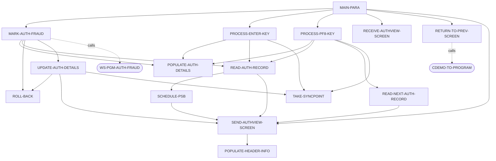
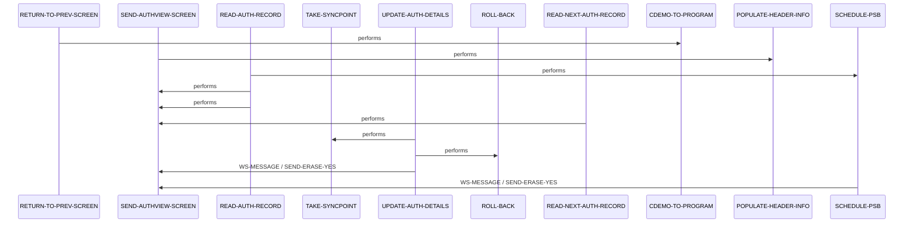

# COPAUS1C

**File**: `cbl/COPAUS1C.cbl`
**Type**: FileType.COBOL
**Analyzed**: 2026-03-04 04:47:44.070745

## Purpose

This CICS COBOL program, part of the CardDemo application's Authorization Module, provides a detailed view of an authorization message. It receives input from a BMS map, processes it, and displays the authorization details.

**Business Context**: Card authorization processing within the CardDemo application.

## Inputs

| Name | Type | Description |
|------|------|-------------|
| COPAU1AI | IOType.CICS_MAP | Authorization message details received from the screen. |

## Paragraphs/Procedures

### COPAUS1C
> [Source: COPAUS1C.cbl.md](COPAUS1C.cbl.d/COPAUS1C.cbl.md)
[Citadel] Paragraph identified by static analysis

### MAIN-PARA
> [Source: MAIN-PARA.cbl.md](COPAUS1C.cbl.d/MAIN-PARA.cbl.md)
[Citadel] Paragraph identified by static analysis

### PROCESS-ENTER-KEY
> [Source: PROCESS-ENTER-KEY.cbl.md](COPAUS1C.cbl.d/PROCESS-ENTER-KEY.cbl.md)
[Citadel] Paragraph identified by static analysis

### MARK-AUTH-FRAUD
> [Source: MARK-AUTH-FRAUD.cbl.md](COPAUS1C.cbl.d/MARK-AUTH-FRAUD.cbl.md)
[Citadel] Paragraph identified by static analysis

### PROCESS-PF8-KEY
> [Source: PROCESS-PF8-KEY.cbl.md](COPAUS1C.cbl.d/PROCESS-PF8-KEY.cbl.md)
[Citadel] Paragraph identified by static analysis

### POPULATE-AUTH-DETAILS
> [Source: POPULATE-AUTH-DETAILS.cbl.md](COPAUS1C.cbl.d/POPULATE-AUTH-DETAILS.cbl.md)
[Citadel] Paragraph identified by static analysis

### RETURN-TO-PREV-SCREEN
> [Source: RETURN-TO-PREV-SCREEN.cbl.md](COPAUS1C.cbl.d/RETURN-TO-PREV-SCREEN.cbl.md)
[Citadel] Paragraph identified by static analysis

### SEND-AUTHVIEW-SCREEN
> [Source: SEND-AUTHVIEW-SCREEN.cbl.md](COPAUS1C.cbl.d/SEND-AUTHVIEW-SCREEN.cbl.md)
[Citadel] Paragraph identified by static analysis

### RECEIVE-AUTHVIEW-SCREEN
> [Source: RECEIVE-AUTHVIEW-SCREEN.cbl.md](COPAUS1C.cbl.d/RECEIVE-AUTHVIEW-SCREEN.cbl.md)
[Citadel] Paragraph identified by static analysis

### POPULATE-HEADER-INFO
> [Source: POPULATE-HEADER-INFO.cbl.md](COPAUS1C.cbl.d/POPULATE-HEADER-INFO.cbl.md)
[Citadel] Paragraph identified by static analysis

### READ-AUTH-RECORD
> [Source: READ-AUTH-RECORD.cbl.md](COPAUS1C.cbl.d/READ-AUTH-RECORD.cbl.md)
[Citadel] Paragraph identified by static analysis

### READ-NEXT-AUTH-RECORD
> [Source: READ-NEXT-AUTH-RECORD.cbl.md](COPAUS1C.cbl.d/READ-NEXT-AUTH-RECORD.cbl.md)
[Citadel] Paragraph identified by static analysis

### UPDATE-AUTH-DETAILS
> [Source: UPDATE-AUTH-DETAILS.cbl.md](COPAUS1C.cbl.d/UPDATE-AUTH-DETAILS.cbl.md)
[Citadel] Paragraph identified by static analysis

### TAKE-SYNCPOINT
> [Source: TAKE-SYNCPOINT.cbl.md](COPAUS1C.cbl.d/TAKE-SYNCPOINT.cbl.md)
[Citadel] Paragraph identified by static analysis

### ROLL-BACK
> [Source: ROLL-BACK.cbl.md](COPAUS1C.cbl.d/ROLL-BACK.cbl.md)
[Citadel] Paragraph identified by static analysis

### SCHEDULE-PSB
> [Source: SCHEDULE-PSB.cbl.md](COPAUS1C.cbl.d/SCHEDULE-PSB.cbl.md)
[Citadel] Paragraph identified by static analysis

## Dead Code

The following artifacts were identified as dead code by static analysis:

| Artifact | Type | Line | Reason |
|----------|------|------|--------|
| COPAU1AI | record_layout | 17 | Record layout 'COPAU1AI' is never used by any program |
| COPAU1AO | record_layout | 181 | Record layout 'COPAU1AO' is never used by any program |
| WS-FRAUD-DATA | record_layout | 93 | Record layout 'WS-FRAUD-DATA' is never used by any program |
| WS-TABLES | record_layout | 56 | Record layout 'WS-TABLES' is never used by any program |

## Control Flow

```mermaid
flowchart TD
    %% Title: COPAUS1C.cbl
    MAIN_PARA["MAIN-PARA"]
    MARK_AUTH_FRAUD["MARK-AUTH-FRAUD"]
    PROCESS_ENTER_KEY["PROCESS-ENTER-KEY"]
    PROCESS_PF8_KEY["PROCESS-PF8-KEY"]
    RECEIVE_AUTHVIEW_SCREEN["RECEIVE-AUTHVIEW-SCREEN"]
    RETURN_TO_PREV_SCREEN["RETURN-TO-PREV-SCREEN"]
    SEND_AUTHVIEW_SCREEN["SEND-AUTHVIEW-SCREEN"]
    POPULATE_AUTH_DETAILS["POPULATE-AUTH-DETAILS"]
    READ_AUTH_RECORD["READ-AUTH-RECORD"]
    ROLL_BACK["ROLL-BACK"]
    UPDATE_AUTH_DETAILS["UPDATE-AUTH-DETAILS"]
    WS_PGM_AUTH_FRAUD__ext(["WS-PGM-AUTH-FRAUD"])
    POPULATE_HEADER_INFO["POPULATE-HEADER-INFO"]
    TAKE_SYNCPOINT["TAKE-SYNCPOINT"]
    READ_NEXT_AUTH_RECORD["READ-NEXT-AUTH-RECORD"]
    SCHEDULE_PSB["SCHEDULE-PSB"]
    CDEMO_TO_PROGRAM__ext(["CDEMO-TO-PROGRAM"])
    MAIN_PARA --> MARK_AUTH_FRAUD
    MAIN_PARA --> PROCESS_ENTER_KEY
    MAIN_PARA --> PROCESS_PF8_KEY
    MAIN_PARA --> RECEIVE_AUTHVIEW_SCREEN
    MAIN_PARA --> RETURN_TO_PREV_SCREEN
    MAIN_PARA --> SEND_AUTHVIEW_SCREEN
    MARK_AUTH_FRAUD --> POPULATE_AUTH_DETAILS
    MARK_AUTH_FRAUD --> READ_AUTH_RECORD
    MARK_AUTH_FRAUD --> ROLL_BACK
    MARK_AUTH_FRAUD --> UPDATE_AUTH_DETAILS
    MARK_AUTH_FRAUD -.->|calls| WS_PGM_AUTH_FRAUD__ext
    PROCESS_ENTER_KEY --> POPULATE_AUTH_DETAILS
    PROCESS_ENTER_KEY --> READ_AUTH_RECORD
    PROCESS_ENTER_KEY --> TAKE_SYNCPOINT
    PROCESS_PF8_KEY --> POPULATE_AUTH_DETAILS
    PROCESS_PF8_KEY --> READ_AUTH_RECORD
    PROCESS_PF8_KEY --> READ_NEXT_AUTH_RECORD
    PROCESS_PF8_KEY --> TAKE_SYNCPOINT
    READ_AUTH_RECORD --> SCHEDULE_PSB
    READ_AUTH_RECORD --> SEND_AUTHVIEW_SCREEN
    READ_NEXT_AUTH_RECORD --> SEND_AUTHVIEW_SCREEN
    RETURN_TO_PREV_SCREEN -.->|calls| CDEMO_TO_PROGRAM__ext
    SCHEDULE_PSB --> SEND_AUTHVIEW_SCREEN
    SEND_AUTHVIEW_SCREEN --> POPULATE_HEADER_INFO
    UPDATE_AUTH_DETAILS --> ROLL_BACK
    UPDATE_AUTH_DETAILS --> SEND_AUTHVIEW_SCREEN
    UPDATE_AUTH_DETAILS --> TAKE_SYNCPOINT
```

## Open Questions

- ? The source code provided is incomplete. A full analysis requires the complete source code to understand the program's data flow, business rules, and paragraph logic.
  - Context: The provided source code only includes the header.

## Sequence Diagram

### Part 1 of 2

```mermaid
sequenceDiagram
    participant COPAUS1C as COPAUS1C
    participant COCOM01Y as COCOM01Y
    participant COPAU01 as COPAU01
    participant COTTL01Y as COTTL01Y
    participant CSDAT01Y as CSDAT01Y
    participant CSMSG01Y as CSMSG01Y
    participant CSMSG02Y as CSMSG02Y
    participant CIPAUSMY as CIPAUSMY
    participant CIPAUDTY as CIPAUDTY
    participant DFHAID as DFHAID
    participant DFHBMSCA as DFHBMSCA
    participant MAIN_PARA as MAIN-PARA
    participant RETURN_TO_PREV_SCREEN as RETURN-TO-PREV-SCREEN
    participant PROCESS_ENTER_KEY as PROCESS-ENTER-KEY
    participant SEND_AUTHVIEW_SCREEN as SEND-AUTHVIEW-SCREEN
    participant RECEIVE_AUTHVIEW_SCREEN as RECEIVE-AUTHVIEW-SCREEN
    participant MARK_AUTH_FRAUD as MARK-AUTH-FRAUD
    participant PROCESS_PF8_KEY as PROCESS-PF8-KEY
    participant READ_AUTH_RECORD as READ-AUTH-RECORD
    participant TAKE_SYNCPOINT as TAKE-SYNCPOINT
    participant POPULATE_AUTH_DETAILS as POPULATE-AUTH-DETAILS
    participant UPDATE_AUTH_DETAILS as UPDATE-AUTH-DETAILS
    participant ROLL_BACK as ROLL-BACK
    participant WS_PGM_AUTH_FRAUD as WS-PGM-AUTH-FRAUD
    participant READ_NEXT_AUTH_RECORD as READ-NEXT-AUTH-RECORD
    COPAUS1C->>COCOM01Y: performs
    COPAUS1C->>COPAU01: performs
    COPAUS1C->>COTTL01Y: performs
    COPAUS1C->>CSDAT01Y: performs
    COPAUS1C->>CSMSG01Y: performs
    COPAUS1C->>CSMSG02Y: performs
    COPAUS1C->>CIPAUSMY: performs
    COPAUS1C->>CIPAUDTY: performs
    COPAUS1C->>DFHAID: performs
    COPAUS1C->>DFHBMSCA: performs
    MAIN_PARA->>RETURN_TO_PREV_SCREEN: WS-CICS-TRANID / WS-PGM-AUTH-DTL
    RETURN_TO_PREV_SCREEN-->>MAIN_PARA: CDEMO-FROM-TRANID / CDEMO-FROM-PROGRAM / CDEMO-PGM-CONTEXT / ...
    MAIN_PARA->>PROCESS_ENTER_KEY: CDEMO-ACCT-ID / CDEMO-CPVD-PAU-SELECTED
    PROCESS_ENTER_KEY-->>MAIN_PARA: WS-ACCT-ID / WS-AUTH-KEY / ERR-FLG
    MAIN_PARA->>SEND_AUTHVIEW_SCREEN: WS-MESSAGE / SEND-ERASE-YES
    MAIN_PARA->>RECEIVE_AUTHVIEW_SCREEN: performs
    MAIN_PARA->>PROCESS_ENTER_KEY: CDEMO-ACCT-ID / CDEMO-CPVD-PAU-SELECTED
    PROCESS_ENTER_KEY-->>MAIN_PARA: WS-ACCT-ID / WS-AUTH-KEY / ERR-FLG
    MAIN_PARA->>SEND_AUTHVIEW_SCREEN: WS-MESSAGE / SEND-ERASE-YES
    MAIN_PARA->>RETURN_TO_PREV_SCREEN: WS-CICS-TRANID / WS-PGM-AUTH-DTL
    RETURN_TO_PREV_SCREEN-->>MAIN_PARA: CDEMO-FROM-TRANID / CDEMO-FROM-PROGRAM / CDEMO-PGM-CONTEXT / ...
    MAIN_PARA->>MARK_AUTH_FRAUD: CDEMO-ACCT-ID / CDEMO-CPVD-PAU-SELECTED / PA-FRAUD-CONFIRMED / ...
    MARK_AUTH_FRAUD-->>MAIN_PARA: WS-ACCT-ID / WS-AUTH-KEY / WS-REMOVE-FRAUD / ...
    MAIN_PARA->>SEND_AUTHVIEW_SCREEN: WS-MESSAGE / SEND-ERASE-YES
    MAIN_PARA->>PROCESS_PF8_KEY: CDEMO-ACCT-ID / CDEMO-CPVD-PAU-SELECTED / IMS-PSB-SCHD / ...
    PROCESS_PF8_KEY-->>MAIN_PARA: WS-ACCT-ID / WS-AUTH-KEY / IMS-PSB-NOT-SCHD / ...
    MAIN_PARA->>SEND_AUTHVIEW_SCREEN: WS-MESSAGE / SEND-ERASE-YES
    MAIN_PARA->>PROCESS_ENTER_KEY: CDEMO-ACCT-ID / CDEMO-CPVD-PAU-SELECTED
    PROCESS_ENTER_KEY-->>MAIN_PARA: WS-ACCT-ID / WS-AUTH-KEY / ERR-FLG
    MAIN_PARA->>SEND_AUTHVIEW_SCREEN: WS-MESSAGE / SEND-ERASE-YES
    PROCESS_ENTER_KEY->>READ_AUTH_RECORD: WS-ACCT-ID / WS-AUTH-KEY
    PROCESS_ENTER_KEY->>TAKE_SYNCPOINT: performs
    PROCESS_ENTER_KEY->>POPULATE_AUTH_DETAILS: ERR-FLG / PA-CARD-NUM / PA-AUTH-ORIG-DATE / ...
    POPULATE_AUTH_DETAILS-->>PROCESS_ENTER_KEY: WS-AUTH-DATE / WS-AUTH-TIME / WS-AUTH-AMT
    MARK_AUTH_FRAUD->>READ_AUTH_RECORD: CDEMO-ACCT-ID / CDEMO-CPVD-PAU-SELECTED / WS-ACCT-ID / ...
    READ_AUTH_RECORD-->>MARK_AUTH_FRAUD: WS-ACCT-ID / WS-AUTH-KEY
    MARK_AUTH_FRAUD->>UPDATE_AUTH_DETAILS: WS-FRAUD-AUTH-RECORD / PA-FRAUD-RPT-DATE / PA-FRAUD-REMOVED / ...
    UPDATE_AUTH_DETAILS-->>MARK_AUTH_FRAUD: WS-MESSAGE / WS-ERR-FLG
    MARK_AUTH_FRAUD->>ROLL_BACK: performs
    MARK_AUTH_FRAUD->>ROLL_BACK: performs
    MARK_AUTH_FRAUD->>POPULATE_AUTH_DETAILS: PA-CARD-NUM / PA-AUTH-ORIG-DATE / PA-AUTH-ORIG-TIME / ...
    POPULATE_AUTH_DETAILS-->>MARK_AUTH_FRAUD: CARDNUMO / WS-CURDATE-YY / WS-CURDATE-MM / ...
    MARK_AUTH_FRAUD->>WS_PGM_AUTH_FRAUD: performs
    PROCESS_PF8_KEY->>READ_AUTH_RECORD: WS-ACCT-ID / WS-AUTH-KEY
    READ_AUTH_RECORD-->>PROCESS_PF8_KEY: PA-ACCT-ID / PA-AUTHORIZATION-KEY
    PROCESS_PF8_KEY->>READ_NEXT_AUTH_RECORD: performs
    READ_NEXT_AUTH_RECORD-->>PROCESS_PF8_KEY: PENDING-AUTH-DETAILS / IMS-RETURN-CODE / AUTHS-EOF / ...
    PROCESS_PF8_KEY->>TAKE_SYNCPOINT: performs
    PROCESS_PF8_KEY->>POPULATE_AUTH_DETAILS: PA-CARD-NUM / PA-AUTH-ORIG-DATE / PA-AUTH-ORIG-TIME / ...
    POPULATE_AUTH_DETAILS-->>PROCESS_PF8_KEY: CARDNUMO / WS-CURDATE-YY / WS-CURDATE-MM / ...
```

### Part 2 of 2

```mermaid
sequenceDiagram
    participant RETURN_TO_PREV_SCREEN as RETURN-TO-PREV-SCREEN
    participant SEND_AUTHVIEW_SCREEN as SEND-AUTHVIEW-SCREEN
    participant READ_AUTH_RECORD as READ-AUTH-RECORD
    participant TAKE_SYNCPOINT as TAKE-SYNCPOINT
    participant UPDATE_AUTH_DETAILS as UPDATE-AUTH-DETAILS
    participant ROLL_BACK as ROLL-BACK
    participant READ_NEXT_AUTH_RECORD as READ-NEXT-AUTH-RECORD
    participant CDEMO_TO_PROGRAM as CDEMO-TO-PROGRAM
    participant POPULATE_HEADER_INFO as POPULATE-HEADER-INFO
    participant SCHEDULE_PSB as SCHEDULE-PSB
    RETURN_TO_PREV_SCREEN->>CDEMO_TO_PROGRAM: performs
    SEND_AUTHVIEW_SCREEN->>POPULATE_HEADER_INFO: performs
    READ_AUTH_RECORD->>SCHEDULE_PSB: performs
    READ_AUTH_RECORD->>SEND_AUTHVIEW_SCREEN: performs
    READ_AUTH_RECORD->>SEND_AUTHVIEW_SCREEN: performs
    READ_NEXT_AUTH_RECORD->>SEND_AUTHVIEW_SCREEN: performs
    UPDATE_AUTH_DETAILS->>TAKE_SYNCPOINT: performs
    UPDATE_AUTH_DETAILS->>ROLL_BACK: performs
    UPDATE_AUTH_DETAILS->>SEND_AUTHVIEW_SCREEN: WS-MESSAGE / SEND-ERASE-YES
    SCHEDULE_PSB->>SEND_AUTHVIEW_SCREEN: WS-MESSAGE / SEND-ERASE-YES
```
