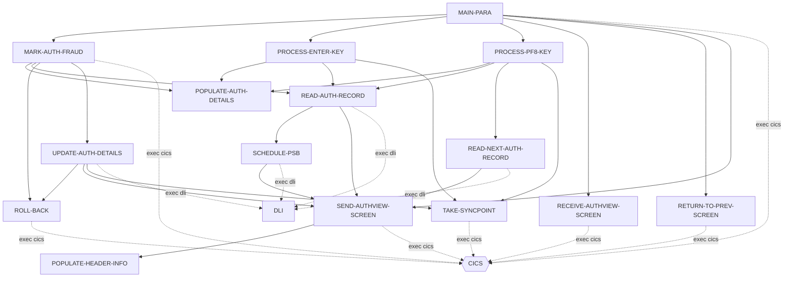

# COPAUS1C

**File**: `cbl/COPAUS1C.cbl`
**Type**: FileType.COBOL
**Analyzed**: 2026-03-16 19:44:41.846005

## Purpose

The COPAUS1C program is a CICS transaction that displays authorization details for a given account and authorization key. It allows users to mark authorizations as fraudulent and navigate through authorization records.

**Business Context**: This program is used to view and manage authorization details, potentially for fraud detection or customer service purposes.

## Inputs

| Name | Type | Description |
|------|------|-------------|
| CARDDEMO-COMMAREA | IOType.CICS_COMMAREA | Communication area passed between CICS transactions, containing account ID, authorization key, and other context data. |
| COPAU1AI | IOType.CICS_MAP | Input map for the COPAU1A screen, containing data entered by the user. |

## Outputs

| Name | Type | Description |
|------|------|-------------|
| COPAU1AO | IOType.CICS_MAP | Output map for the COPAU1A screen, containing authorization details and header information. |

## Called Programs

| Program | Call Type | Purpose |
|---------|-----------|---------|
| WS-PGM-AUTH-FRAUD | CallType.CICS_LINK | To update the authorization record with fraud information. |
| CDEMO-TO-PROGRAM | CallType.CICS_XCTL | To transfer control to the previous screen. |

## Business Rules

- **BR001**: If the authorization response code is '00', the authorization is approved, and the screen displays 'A' in green. Otherwise, it is declined, and the screen displays 'D' in red.
- **BR002**: If the user presses PF5, the program marks the authorization as fraudulent or removes the fraud flag, depending on its current state.
- **BR003**: If the user presses PF8, the program retrieves the next authorization record and displays it. If there are no more authorization records, a message is displayed.

## Paragraphs/Procedures

### COPAUS1C
This is the program identifier. It simply names the program COPAUS1C and does not contain any executable code.

### MAIN-PARA
> [Source: MAIN-PARA.cbl.md](COPAUS1C.cbl.d/MAIN-PARA.cbl.md)

```
MAIN-PARA  (85 statements, depth=7)
PARAGRAPH
├── UNKNOWN: 02  MERCITYL    COMP  PIC  S9(4)
├── UNKNOWN: 02  MERCITYF    PICTURE X
├── UNKNOWN: 02  FILLER REDEFINES MERCITYF
├── UNKNOWN: 03 MERCITYA    PICTURE X
├── UNKNOWN: 02  FILLER   PICTURE X(4)
├── UNKNOWN: 02  MERCITYI  PIC X(25)
├── UNKNOWN: 02  MERSTL    COMP  PIC  S9(4)
├── UNKNOWN: 02  MERSTF    PICTURE X
├── UNKNOWN: 02  FILLER REDEFINES MERSTF
├── UNKNOWN: 03 MERSTA    PICTURE X
├── UNKNOWN: 02  FILLER   PICTURE X(4)
├── UNKNOWN: 02  MERSTI  PIC X(2)
├── UNKNOWN: 02  MERZIPL    COMP  PIC  S9(4)
├── UNKNOWN: 02  MERZIPF    PICTURE X
├── UNKNOWN: 02  FILLER REDEFINES MERZIPF
├── UNKNOWN: 03 MERZIPA    PICTURE X
├── UNKNOWN: 02  FILLER   PICTURE X(4)
├── UNKNOWN: 02  MERZIPI  PIC X(10)
├── UNKNOWN: 02  ERRMSGL    COMP  PIC  S9(4)
├── UNKNOWN: 02  ERRMSGF    PICTURE X
├── UNKNOWN: 02  FILLER REDEFINES ERRMSGF
├── UNKNOWN: 03 ERRMSGA    PICTURE X
├── UNKNOWN: 02  FILLER   PICTURE X(4)
├── UNKNOWN: 02  ERRMSGI  PIC X(78)
├── UNKNOWN: 01  COPAU1AO REDEFINES COPAU1AI
├── UNKNOWN: 02  FILLER PIC X(12)
├── UNKNOWN: 02  FILLER PICTURE X(3)
├── UNKNOWN: 02  TRNNAMEC    PICTURE X
├── UNKNOWN: 02  TRNNAMEP    PICTURE X
├── UNKNOWN: 02  TRNNAMEH    PICTURE X
├── UNKNOWN: 02  TRNNAMEV    PICTURE X
├── UNKNOWN: 02  TRNNAMEO  PIC X(4)
├── UNKNOWN: 02  FILLER PICTURE X(3)
├── UNKNOWN: 02  TITLE01C    PICTURE X
├── UNKNOWN: 02  TITLE01P    PICTURE X
├── UNKNOWN: 02  TITLE01H    PICTURE X
├── UNKNOWN: 02  TITLE01V    PICTURE X
├── UNKNOWN: 02  TITLE01O  PIC X(40)
├── UNKNOWN: 02  FILLER PICTURE X(3)
├── UNKNOWN: 02  CURDATEC    PICTURE X
├── UNKNOWN: 02  CURDATEP    PICTURE X
├── UNKNOWN: 02  CURDATEH    PICTURE X
├── UNKNOWN: 02  CURDATEV    PICTURE X
├── UNKNOWN: 02  CURDATEO  PIC X(8)
├── UNKNOWN: 02  FILLER PICTURE X(3)
├── UNKNOWN: 02  PGMNAMEC    PICTURE X
├── UNKNOWN: 02  PGMNAMEP    PICTURE X
├── UNKNOWN: 02  PGMNAMEH    PICTURE X
├── UNKNOWN: 02  PGMNAMEV    PICTURE X
├── UNKNOWN: 02  PGMNAMEO  PIC X(8)
├── SET: SET ERR-FLG-OFF     TO TRUE
├── SET: SET SEND-ERASE-YES  TO TRUE
├── MOVE: MOVE SPACES TO WS-MESSAGE
ERRMSGO OF COPAU1AO
├── IF: IF EIBCALEN = 0
│   ├── INITIALIZE: INITIALIZE CARDDEMO-COMMAREA
│   ├── MOVE: MOVE WS-PGM-AUTH-SMRY        TO CDEMO-TO-PROGRAM
│   ├── PERFORM: PERFORM RETURN-TO-PREV-SCREEN
│   └── ELSE: ELSE
│       ├── MOVE: MOVE DFHCOMMAREA(1:EIBCALEN) TO CARDDEMO-COMMAREA
│       ├── MOVE: MOVE SPACES                  TO CDEMO-CPVD-FRAUD-DATA
│       └── IF: IF NOT CDEMO-PGM-REENTER
│           ├── SET: SET CDEMO-PGM-REENTER    TO TRUE
│           ├── PERFORM: PERFORM PROCESS-ENTER-KEY
│           ├── PERFORM: PERFORM SEND-AUTHVIEW-SCREEN
│           └── ELSE: ELSE
│               ├── PERFORM: PERFORM RECEIVE-AUTHVIEW-SCREEN
│               └── EVALUATE: EVALUATE EIBAID
│                   ├── WHEN: WHEN DFHENTER
│                   │   ├── PERFORM: PERFORM PROCESS-ENTER-KEY
│                   │   └── PERFORM: PERFORM SEND-AUTHVIEW-SCREEN
│                   ├── WHEN: WHEN DFHPF3
│                   │   ├── MOVE: MOVE WS-PGM-AUTH-SMRY     TO CDEMO-TO-PROGRAM
│                   │   └── PERFORM: PERFORM RETURN-TO-PREV-SCREEN
│                   ├── WHEN: WHEN DFHPF5
│                   │   ├── PERFORM: PERFORM MARK-AUTH-FRAUD
│                   │   └── PERFORM: PERFORM SEND-AUTHVIEW-SCREEN
│                   ├── WHEN: WHEN DFHPF8
│                   │   ├── PERFORM: PERFORM PROCESS-PF8-KEY
│                   │   └── PERFORM: PERFORM SEND-AUTHVIEW-SCREEN
│                   └── WHEN: WHEN OTHER
│                       ├── PERFORM: PERFORM PROCESS-ENTER-KEY
│                       ├── MOVE: MOVE CCDA-MSG-INVALID-KEY TO WS-MESSAGE
│                       └── PERFORM: PERFORM SEND-AUTHVIEW-SCREEN
├── EXEC_CICS: EXEC CICS RETURN TRANSID (WS-CICS-TRANID) COMMAREA (CARDDEMO-COMMAREA) END-EXEC
└── UNKNOWN
```
This is the main control paragraph for the COPAUS1C transaction. It determines the program flow based on whether the transaction is being entered for the first time or is re-entering. If it's the first entry (EIBCALEN = 0), it initializes the CARDDEMO-COMMAREA and calls RETURN-TO-PREV-SCREEN to return to the calling transaction. If it's a re-entry, it receives the screen data, then evaluates the EIBAID to determine which function to perform based on the key pressed (ENTER, PF3, PF5, PF8, or other). Based on the key pressed, it calls different paragraphs such as PROCESS-ENTER-KEY, RETURN-TO-PREV-SCREEN, MARK-AUTH-FRAUD, or PROCESS-PF8-KEY. Finally, it calls SEND-AUTHVIEW-SCREEN to display the screen and returns control to CICS with the updated CARDDEMO-COMMAREA.

### PROCESS-ENTER-KEY
> [Source: PROCESS-ENTER-KEY.cbl.md](COPAUS1C.cbl.d/PROCESS-ENTER-KEY.cbl.md)

```
PROCESS-ENTER-KEY  (32 statements, depth=3)
PARAGRAPH
├── UNKNOWN: 02  TITLE02C    PICTURE X
├── UNKNOWN: 02  TITLE02P    PICTURE X
├── UNKNOWN: 02  TITLE02H    PICTURE X
├── UNKNOWN: 02  TITLE02V    PICTURE X
├── UNKNOWN: 02  TITLE02O  PIC X(40)
├── UNKNOWN: 02  FILLER PICTURE X(3)
├── UNKNOWN: 02  CURTIMEC    PICTURE X
├── UNKNOWN: 02  CURTIMEP    PICTURE X
├── UNKNOWN: 02  CURTIMEH    PICTURE X
├── UNKNOWN: 02  CURTIMEV    PICTURE X
├── UNKNOWN: 02  CURTIMEO  PIC X(8)
├── UNKNOWN: 02  FILLER PICTURE X(3)
├── UNKNOWN: 02  CARDNUMC    PICTURE X
├── UNKNOWN: 02  CARDNUMP    PICTURE X
├── UNKNOWN: 02  CARDNUMH    PICTURE X
├── UNKNOWN: 02  CARDNUMV    PICTURE X
├── UNKNOWN: 02  CARDNUMO  PIC X(16)
├── UNKNOWN: 02  FILLER PICTURE X(3)
├── UNKNOWN: 02  AUTHDTC    PICTURE X
├── UNKNOWN: 02  AUTHDTP    PICTURE X
├── UNKNOWN: 02  AUTHDTH    PICTURE X
├── MOVE: MOVE LOW-VALUES          TO COPAU1AO
├── IF: IF CDEMO-ACCT-ID IS NUMERIC AND
CDEMO-CPVD-PAU-SELECTED NOT = SPACES AND LOW-VALUES
│   ├── MOVE: MOVE CDEMO-ACCT-ID            TO WS-ACCT-ID
│   ├── MOVE: MOVE CDEMO-CPVD-PAU-SELECTED
TO WS-AUTH-KEY
│   ├── PERFORM: PERFORM READ-AUTH-RECORD
│   ├── IF: IF IMS-PSB-SCHD
│   │   ├── SET: SET IMS-PSB-NOT-SCHD      TO TRUE
│   │   └── PERFORM: PERFORM TAKE-SYNCPOINT
│   └── ELSE: ELSE
│       └── SET: SET ERR-FLG-ON                TO TRUE
└── PERFORM: PERFORM POPULATE-AUTH-DETAILS
```
This paragraph processes the ENTER key press. It first initializes the COPAU1AO map. It then checks if the account ID (CDEMO-ACCT-ID) is numeric and if an authorization key (CDEMO-CPVD-PAU-SELECTED) is selected. If both conditions are met, it moves the account ID and authorization key to working storage variables (WS-ACCT-ID and WS-AUTH-KEY) and calls READ-AUTH-RECORD to read the authorization record. If the IMS PSB is scheduled, it performs a syncpoint. If either condition is not met, it sets an error flag. Finally, it calls POPULATE-AUTH-DETAILS to populate the screen fields with the authorization details.

### MARK-AUTH-FRAUD
> [Source: MARK-AUTH-FRAUD.cbl.md](COPAUS1C.cbl.d/MARK-AUTH-FRAUD.cbl.md)

```
MARK-AUTH-FRAUD  (60 statements, depth=4)
PARAGRAPH
├── UNKNOWN: 02  AUTHDTO  PIC X(10)
├── UNKNOWN: 02  FILLER PICTURE X(3)
├── UNKNOWN: 02  AUTHTMC    PICTURE X
├── UNKNOWN: 02  AUTHTMP    PICTURE X
├── UNKNOWN: 02  AUTHTMH    PICTURE X
├── UNKNOWN: 02  AUTHTMV    PICTURE X
├── UNKNOWN: 02  AUTHTMO  PIC X(10)
├── UNKNOWN: 02  FILLER PICTURE X(3)
├── UNKNOWN: 02  AUTHRSPC    PICTURE X
├── UNKNOWN: 02  AUTHRSPP    PICTURE X
├── UNKNOWN: 02  AUTHRSPH    PICTURE X
├── UNKNOWN: 02  AUTHRSPV    PICTURE X
├── UNKNOWN: 02  AUTHRSPO  PIC X(1)
├── UNKNOWN: 02  FILLER PICTURE X(3)
├── UNKNOWN: 02  AUTHRSNC    PICTURE X
├── UNKNOWN: 02  AUTHRSNP    PICTURE X
├── UNKNOWN: 02  AUTHRSNH    PICTURE X
├── UNKNOWN: 02  AUTHRSNV    PICTURE X
├── UNKNOWN: 02  AUTHRSNO  PIC X(20)
├── UNKNOWN: 02  FILLER PICTURE X(3)
├── UNKNOWN: 02  AUTHCDC    PICTURE X
├── UNKNOWN: 02  AUTHCDP    PICTURE X
├── UNKNOWN: 02  AUTHCDH    PICTURE X
├── UNKNOWN: 02  AUTHCDV    PICTURE X
├── UNKNOWN: 02  AUTHCDO  PIC X(6)
├── UNKNOWN: 02  FILLER PICTURE X(3)
├── UNKNOWN: 02  AUTHAMTC    PICTURE X
├── UNKNOWN: 02  AUTHAMTP    PICTURE X
├── UNKNOWN: 02  AUTHAMTH    PICTURE X
├── UNKNOWN: 02  AUTHAMTV    PICTURE X
├── UNKNOWN: 02  AUTHAMTO  PIC X(12)
├── UNKNOWN: 02  FILLER PICTURE X(3)
├── UNKNOWN: 02  POSEMDC    PICTURE X
├── UNKNOWN: 02  POSEMDP    PICTURE X
├── UNKNOWN: 02  POSEMDH    PICTURE X
├── UNKNOWN: 02  POSEMDV    PICTURE X
├── UNKNOWN: 02  POSEMDO  PIC X(4)
├── MOVE: MOVE CDEMO-ACCT-ID            TO WS-ACCT-ID
├── MOVE: MOVE CDEMO-CPVD-PAU-SELECTED  TO WS-AUTH-KEY
├── PERFORM: PERFORM READ-AUTH-RECORD
├── IF: IF PA-FRAUD-CONFIRMED
│   ├── SET: SET PA-FRAUD-REMOVED          TO TRUE
│   ├── SET: SET WS-REMOVE-FRAUD           TO TRUE
│   └── ELSE: ELSE
│       ├── SET: SET PA-FRAUD-CONFIRMED        TO TRUE
│       └── SET: SET WS-REPORT-FRAUD           TO TRUE
├── MOVE: MOVE PENDING-AUTH-DETAILS        TO WS-FRAUD-AUTH-RECORD
├── MOVE: MOVE CDEMO-ACCT-ID               TO WS-FRD-ACCT-ID
├── MOVE: MOVE CDEMO-CUST-ID               TO WS-FRD-CUST-ID
├── EXEC_CICS: EXEC CICS LINK PROGRAM(WS-PGM-AUTH-FRAUD) COMMAREA(WS-FRAUD-DATA) NOHANDLE END-EXEC
├── IF: IF EIBRESP = DFHRESP(NORMAL)
│   ├── IF: IF WS-FRD-UPDT-SUCCESS
│   │   ├── PERFORM: PERFORM UPDATE-AUTH-DETAILS
│   │   └── ELSE: ELSE
│   │       ├── MOVE: MOVE WS-FRD-ACT-MSG     TO WS-MESSAGE
│   │       └── PERFORM: PERFORM ROLL-BACK
│   └── ELSE: ELSE
│       └── PERFORM: PERFORM ROLL-BACK
├── MOVE: MOVE PA-AUTHORIZATION-KEY     TO CDEMO-CPVD-PAU-SELECTED
└── PERFORM: PERFORM POPULATE-AUTH-DETAILS
```
This paragraph handles the marking of an authorization as fraudulent. It moves the account ID and authorization key from the COMMAREA to working storage. It then calls READ-AUTH-RECORD to retrieve the authorization record. Based on whether the authorization is already marked as fraudulent (PA-FRAUD-CONFIRMED), it either sets the PA-FRAUD-REMOVED flag or the PA-FRAUD-CONFIRMED flag. It then moves data to WS-FRAUD-DATA and calls the WS-PGM-AUTH-FRAUD program via CICS LINK to update the authorization record. After the LINK, it checks the EIBRESP and WS-FRD-UPDT-SUCCESS to determine if the update was successful. If successful, it calls UPDATE-AUTH-DETAILS; otherwise, it calls ROLL-BACK. Finally, it moves the authorization key back to the COMMAREA and calls POPULATE-AUTH-DETAILS to refresh the screen.

### PROCESS-PF8-KEY
> [Source: PROCESS-PF8-KEY.cbl.md](COPAUS1C.cbl.d/PROCESS-PF8-KEY.cbl.md)

```
PROCESS-PF8-KEY  (35 statements, depth=3)
PARAGRAPH
├── UNKNOWN: 02  AUTHSRCC    PICTURE X
├── UNKNOWN: 02  AUTHSRCP    PICTURE X
├── UNKNOWN: 02  AUTHSRCH    PICTURE X
├── UNKNOWN: 02  AUTHSRCV    PICTURE X
├── UNKNOWN: 02  AUTHSRCO  PIC X(10)
├── UNKNOWN: 02  FILLER PICTURE X(3)
├── UNKNOWN: 02  MCCCDC    PICTURE X
├── UNKNOWN: 02  MCCCDP    PICTURE X
├── UNKNOWN: 02  MCCCDH    PICTURE X
├── UNKNOWN: 02  MCCCDV    PICTURE X
├── UNKNOWN: 02  MCCCDO  PIC X(4)
├── UNKNOWN: 02  FILLER PICTURE X(3)
├── UNKNOWN: 02  CRDEXPC    PICTURE X
├── UNKNOWN: 02  CRDEXPP    PICTURE X
├── UNKNOWN: 02  CRDEXPH    PICTURE X
├── UNKNOWN: 02  CRDEXPV    PICTURE X
├── UNKNOWN: 02  CRDEXPO  PIC X(5)
├── UNKNOWN: 02  FILLER PICTURE X(3)
├── UNKNOWN: 02  AUTHTYPC    PICTURE X
├── UNKNOWN: 02  AUTHTYPP    PICTURE X
├── UNKNOWN: 02  AUTHTYPH    PICTURE X
├── UNKNOWN: 02  AUTHTYPV    PICTURE X
├── MOVE: MOVE CDEMO-ACCT-ID            TO WS-ACCT-ID
├── MOVE: MOVE CDEMO-CPVD-PAU-SELECTED  TO WS-AUTH-KEY
├── PERFORM: PERFORM READ-AUTH-RECORD
├── PERFORM: PERFORM READ-NEXT-AUTH-RECORD
├── IF: IF IMS-PSB-SCHD
│   ├── SET: SET IMS-PSB-NOT-SCHD      TO TRUE
│   └── PERFORM: PERFORM TAKE-SYNCPOINT
└── IF: IF AUTHS-EOF
    ├── SET: SET SEND-ERASE-NO          TO TRUE
    ├── MOVE: MOVE 'Already at the last Authorization...'
TO WS-MESSAGE
    └── ELSE: ELSE
        ├── MOVE: MOVE PA-AUTHORIZATION-KEY  TO CDEMO-CPVD-PAU-SELECTED
        └── PERFORM: PERFORM POPULATE-AUTH-DETAILS
```
This paragraph processes the PF8 key, which is used to navigate to the next authorization record. It moves the account ID and authorization key from the COMMAREA to working storage. It then calls READ-AUTH-RECORD to read the current authorization record and READ-NEXT-AUTH-RECORD to read the next authorization record. If the IMS PSB is scheduled, it performs a syncpoint. It then checks if the end of the authorization records has been reached (AUTHS-EOF). If so, it sets a message indicating that the last authorization has been reached. Otherwise, it moves the authorization key to the COMMAREA and calls POPULATE-AUTH-DETAILS to display the next authorization record.

### POPULATE-AUTH-DETAILS
> [Source: POPULATE-AUTH-DETAILS.cbl.md](COPAUS1C.cbl.d/POPULATE-AUTH-DETAILS.cbl.md)

```
POPULATE-AUTH-DETAILS  (102 statements, depth=4)
PARAGRAPH
├── UNKNOWN: 02  FILLER PICTURE X(3)
├── UNKNOWN: 02  TRNIDC    PICTURE X
├── UNKNOWN: 02  TRNIDP    PICTURE X
├── UNKNOWN: 02  TRNIDH    PICTURE X
├── UNKNOWN: 02  TRNIDV    PICTURE X
├── UNKNOWN: 02  TRNIDO  PIC X(15)
├── UNKNOWN: 02  FILLER PICTURE X(3)
├── UNKNOWN: 02  AUTHMTCC    PICTURE X
├── UNKNOWN: 02  AUTHMTCP    PICTURE X
├── UNKNOWN: 02  AUTHMTCH    PICTURE X
├── UNKNOWN: 02  AUTHMTCV    PICTURE X
├── UNKNOWN: 02  AUTHMTCO  PIC X(1)
├── UNKNOWN: 02  FILLER PICTURE X(3)
├── UNKNOWN: 02  AUTHFRDC    PICTURE X
├── UNKNOWN: 02  AUTHFRDP    PICTURE X
├── UNKNOWN: 02  AUTHFRDH    PICTURE X
├── UNKNOWN: 02  AUTHFRDV    PICTURE X
├── UNKNOWN: 02  AUTHFRDO  PIC X(10)
├── UNKNOWN: 02  FILLER PICTURE X(3)
├── UNKNOWN: 02  MERNAMEC    PICTURE X
├── UNKNOWN: 02  MERNAMEP    PICTURE X
├── UNKNOWN: 02  MERNAMEH    PICTURE X
├── UNKNOWN: 02  MERNAMEV    PICTURE X
├── UNKNOWN: 02  MERNAMEO  PIC X(25)
├── UNKNOWN: 02  FILLER PICTURE X(3)
├── UNKNOWN: 02  MERIDC    PICTURE X
├── UNKNOWN: 02  MERIDP    PICTURE X
├── UNKNOWN: 02  MERIDH    PICTURE X
├── UNKNOWN: 02  MERIDV    PICTURE X
├── UNKNOWN: 02  MERIDO  PIC X(15)
├── UNKNOWN: 02  FILLER PICTURE X(3)
├── UNKNOWN: 02  MERCITYC    PICTURE X
├── UNKNOWN: 02  MERCITYP    PICTURE X
├── UNKNOWN: 02  MERCITYH    PICTURE X
├── UNKNOWN: 02  MERCITYV    PICTURE X
├── UNKNOWN: 02  MERCITYO  PIC X(25)
├── UNKNOWN: 02  FILLER PICTURE X(3)
├── UNKNOWN: 02  MERSTC    PICTURE X
├── UNKNOWN: 02  MERSTP    PICTURE X
├── UNKNOWN: 02  MERSTH    PICTURE X
├── UNKNOWN: 02  MERSTV    PICTURE X
├── UNKNOWN: 02  MERSTO  PIC X(2)
├── UNKNOWN: 02  FILLER PICTURE X(3)
├── UNKNOWN: 02  MERZIPC    PICTURE X
├── UNKNOWN: 02  MERZIPP    PICTURE X
├── UNKNOWN: 02  MERZIPH    PICTURE X
├── UNKNOWN: 02  MERZIPV    PICTURE X
├── UNKNOWN: 02  MERZIPO  PIC X(10)
├── UNKNOWN: 02  FILLER PICTURE X(3)
├── UNKNOWN: 02  ERRMSGC    PICTURE X
├── UNKNOWN: 02  ERRMSGP    PICTURE X
├── UNKNOWN: 02  ERRMSGH    PICTURE X
├── UNKNOWN: 02  ERRMSGV    PICTURE X
├── UNKNOWN: 02  ERRMSGO  PIC X(78)
└── IF: IF ERR-FLG-OFF
    ├── MOVE: MOVE PA-CARD-NUM               TO CARDNUMO
    ├── MOVE: MOVE PA-AUTH-ORIG-DATE(1:2)    TO WS-CURDATE-YY
    ├── MOVE: MOVE PA-AUTH-ORIG-DATE(3:2)    TO WS-CURDATE-MM
    ├── MOVE: MOVE PA-AUTH-ORIG-DATE(5:2)    TO WS-CURDATE-DD
    ├── MOVE: MOVE WS-CURDATE-MM-DD-YY       TO WS-AUTH-DATE
    ├── MOVE: MOVE WS-AUTH-DATE              TO AUTHDTO
    ├── MOVE: MOVE PA-AUTH-ORIG-TIME(1:2)    TO WS-AUTH-TIME(1:2)
    ├── MOVE: MOVE PA-AUTH-ORIG-TIME(3:2)    TO WS-AUTH-TIME(4:2)
    ├── MOVE: MOVE PA-AUTH-ORIG-TIME(5:2)    TO WS-AUTH-TIME(7:2)
    ├── MOVE: MOVE WS-AUTH-TIME              TO AUTHTMO
    ├── MOVE: MOVE PA-APPROVED-AMT           TO WS-AUTH-AMT
    ├── MOVE: MOVE WS-AUTH-AMT               TO AUTHAMTO
    ├── IF: IF PA-AUTH-RESP-CODE = '00'
    │   ├── MOVE: MOVE 'A'                    TO AUTHRSPO
    │   ├── MOVE: MOVE DFHGREEN               TO AUTHRSPC
    │   └── ELSE: ELSE
    │       ├── MOVE: MOVE 'D'                    TO AUTHRSPO
    │       └── MOVE: MOVE DFHRED                 TO AUTHRSPC
    ├── SEARCH: SEARCH ALL WS-DECLINE-REASON-TAB
AT END
    │   ├── MOVE: MOVE '9999'                     TO AUTHRSNO
    │   ├── MOVE: MOVE '-'                        TO AUTHRSNO(5:1)
    │   ├── MOVE: MOVE 'ERROR'                    TO AUTHRSNO(6:)
    │   └── WHEN: WHEN DECL-CODE(WS-DECL-RSN-IDX) = PA-AUTH-RESP-REASON
    │       ├── MOVE: MOVE PA-AUTH-RESP-REASON        TO AUTHRSNO
    │       ├── MOVE: MOVE '-'                        TO AUTHRSNO(5:1)
    │       └── MOVE: MOVE DECL-DESC(WS-DECL-RSN-IDX) TO AUTHRSNO(6:)
    ├── MOVE: MOVE PA-PROCESSING-CODE        TO AUTHCDO
    ├── MOVE: MOVE PA-POS-ENTRY-MODE         TO POSEMDO
    ├── MOVE: MOVE PA-MESSAGE-SOURCE         TO AUTHSRCO
    ├── MOVE: MOVE PA-MERCHANT-CATAGORY-CODE TO MCCCDO
    ├── MOVE: MOVE PA-CARD-EXPIRY-DATE(1:2)  TO CRDEXPO(1:2)
    ├── MOVE: MOVE '/'                       TO CRDEXPO(3:1)
    ├── MOVE: MOVE PA-CARD-EXPIRY-DATE(3:2)  TO CRDEXPO(4:2)
    ├── MOVE: MOVE PA-AUTH-TYPE              TO AUTHTYPO
    ├── MOVE: MOVE PA-TRANSACTION-ID         TO TRNIDO
    ├── MOVE: MOVE PA-MATCH-STATUS           TO AUTHMTCO
    ├── IF: IF PA-FRAUD-CONFIRMED OR PA-FRAUD-REMOVED
    │   ├── MOVE: MOVE PA-AUTH-FRAUD          TO AUTHFRDO(1:1)
    │   ├── MOVE: MOVE '-'                    TO AUTHFRDO(2:1)
    │   ├── MOVE: MOVE PA-FRAUD-RPT-DATE      TO AUTHFRDO(3:)
    │   └── ELSE: ELSE
    │       └── MOVE: MOVE '-'                    TO AUTHFRDO
    ├── MOVE: MOVE PA-MERCHANT-NAME          TO MERNAMEO
    ├── MOVE: MOVE PA-MERCHANT-ID            TO MERIDO
    ├── MOVE: MOVE PA-MERCHANT-CITY          TO MERCITYO
    ├── MOVE: MOVE PA-MERCHANT-STATE         TO MERSTO
    └── MOVE: MOVE PA-MERCHANT-ZIP           TO MERZIPO
```
This paragraph populates the output map (COPAU1AO) with authorization details from the PA- (Pending Authorization) fields. It first checks if the error flag is off. If so, it moves various fields from the PA- fields to the corresponding output fields in the COPAU1AO map, including card number, authorization date and time, approved amount, response code, decline reason, processing code, POS entry mode, message source, merchant category code, card expiry date, authorization type, transaction ID, match status, fraud information, and merchant details. It uses a SEARCH statement to find the description for the decline reason code. If the authorization is marked as fraudulent, it populates the AUTHFRDO field with the fraud report date. The AUTHRSPO field is populated with 'A' for approved or 'D' for declined, and the corresponding color is set in AUTHRSPC.

### RETURN-TO-PREV-SCREEN
> [Source: RETURN-TO-PREV-SCREEN.cbl.md](COPAUS1C.cbl.d/RETURN-TO-PREV-SCREEN.cbl.md)

```
RETURN-TO-PREV-SCREEN  (5 statements, depth=1)
PARAGRAPH
├── MOVE: MOVE WS-CICS-TRANID TO CDEMO-FROM-TRANID
├── MOVE: MOVE WS-PGM-AUTH-DTL TO CDEMO-FROM-PROGRAM
├── MOVE: MOVE ZEROS          TO CDEMO-PGM-CONTEXT
├── SET: SET CDEMO-PGM-ENTER TO TRUE
└── EXEC_CICS: EXEC CICS XCTL PROGRAM(CDEMO-TO-PROGRAM) COMMAREA(CARDDEMO-COMMAREA) END-EXEC
```
This paragraph returns control to the previous CICS transaction. It moves the current transaction ID (WS-CICS-TRANID) and program ID (WS-PGM-AUTH-DTL) to the CARDDEMO-COMMAREA. It then sets CDEMO-PGM-CONTEXT to ZEROS and sets CDEMO-PGM-ENTER to TRUE. Finally, it performs a CICS XCTL to the program specified in CDEMO-TO-PROGRAM, passing the CARDDEMO-COMMAREA.

### SEND-AUTHVIEW-SCREEN
> [Source: SEND-AUTHVIEW-SCREEN.cbl.md](COPAUS1C.cbl.d/SEND-AUTHVIEW-SCREEN.cbl.md)

```
SEND-AUTHVIEW-SCREEN  (7 statements, depth=3)
PARAGRAPH
├── PERFORM: PERFORM POPULATE-HEADER-INFO
├── MOVE: MOVE WS-MESSAGE TO ERRMSGO OF COPAU1AO
├── MOVE: MOVE -1       TO CARDNUML
└── IF: IF SEND-ERASE-YES
    ├── EXEC_CICS: EXEC CICS SEND MAP('COPAU1A') MAPSET('COPAU01') FROM(COPAU1AO) ERASE CURSOR END-EXEC
    └── ELSE: ELSE
        └── EXEC_CICS: EXEC CICS SEND MAP('COPAU1A') MAPSET('COPAU01') FROM(COPAU1AO) CURSOR END-EXEC
```
This paragraph sends the COPAU1A screen to the terminal. It first calls POPULATE-HEADER-INFO to populate the header information on the screen. It then moves any error message to the ERRMSGO field of the COPAU1AO map. It moves -1 to CARDNUML. It then checks the SEND-ERASE-YES flag. If it is set, it sends the map with the ERASE option, which clears the screen before sending the map. Otherwise, it sends the map without the ERASE option. In both cases, the CURSOR option is used to position the cursor on the screen.

### RECEIVE-AUTHVIEW-SCREEN
> [Source: RECEIVE-AUTHVIEW-SCREEN.cbl.md](COPAUS1C.cbl.d/RECEIVE-AUTHVIEW-SCREEN.cbl.md)

```
RECEIVE-AUTHVIEW-SCREEN  (2 statements, depth=1)
PARAGRAPH
├── EXEC_CICS: EXEC CICS RECEIVE MAP('COPAU1A') MAPSET('COPAU01') INTO(COPAU1AI) NOHANDLE END-EXEC
└── UNKNOWN
```
This paragraph receives data from the COPAU1A screen. It executes a CICS RECEIVE command to receive the data from the screen into the COPAU1AI map. The NOHANDLE option is used to suppress the handling of exceptional conditions.

### POPULATE-HEADER-INFO
> [Source: POPULATE-HEADER-INFO.cbl.md](COPAUS1C.cbl.d/POPULATE-HEADER-INFO.cbl.md)

```
POPULATE-HEADER-INFO  (13 statements, depth=1)
PARAGRAPH
├── MOVE: MOVE FUNCTION CURRENT-DATE  TO WS-CURDATE-DATA
├── MOVE: MOVE CCDA-TITLE01           TO TITLE01O OF COPAU1AO
├── MOVE: MOVE CCDA-TITLE02           TO TITLE02O OF COPAU1AO
├── MOVE: MOVE WS-CICS-TRANID         TO TRNNAMEO OF COPAU1AO
├── MOVE: MOVE WS-PGM-AUTH-DTL        TO PGMNAMEO OF COPAU1AO
├── MOVE: MOVE WS-CURDATE-MONTH       TO WS-CURDATE-MM
├── MOVE: MOVE WS-CURDATE-DAY         TO WS-CURDATE-DD
├── MOVE: MOVE WS-CURDATE-YEAR(3:2)   TO WS-CURDATE-YY
├── MOVE: MOVE WS-CURDATE-MM-DD-YY    TO CURDATEO OF COPAU1AO
├── MOVE: MOVE WS-CURTIME-HOURS       TO WS-CURTIME-HH
├── MOVE: MOVE WS-CURTIME-MINUTE      TO WS-CURTIME-MM
├── MOVE: MOVE WS-CURTIME-SECOND      TO WS-CURTIME-SS
└── MOVE: MOVE WS-CURTIME-HH-MM-SS    TO CURTIMEO OF COPAU1AO
```
This paragraph populates the header information on the COPAU1A screen. It moves the current date and time to working storage variables. It then moves the title fields (CCDA-TITLE01 and CCDA-TITLE02), the transaction name (WS-CICS-TRANID), and the program name (WS-PGM-AUTH-DTL) to the corresponding output fields in the COPAU1AO map. It formats the current date and time into the required formats and moves them to the CURDATEO and CURTIMEO fields of the COPAU1AO map.

### READ-AUTH-RECORD
> [Source: READ-AUTH-RECORD.cbl.md](COPAUS1C.cbl.d/READ-AUTH-RECORD.cbl.md)

```
READ-AUTH-RECORD  (28 statements, depth=4)
PARAGRAPH
├── PERFORM: PERFORM SCHEDULE-PSB
├── MOVE: MOVE WS-ACCT-ID                TO PA-ACCT-ID
├── MOVE: MOVE WS-AUTH-KEY               TO PA-AUTHORIZATION-KEY
├── EXEC_DLI: EXEC DLI GU USING PCB(PAUT-PCB-NUM) SEGMENT (PAUTSUM0) INTO (PENDING-AUTH-SUMMARY) WHERE (ACCNTID = PA-ACCT-ID) END-EXEC
├── MOVE: MOVE DIBSTAT                          TO IMS-RETURN-CODE
├── EVALUATE: EVALUATE TRUE
│   ├── WHEN: WHEN STATUS-OK
│   │   └── SET: SET AUTHS-NOT-EOF              TO TRUE
│   ├── WHEN: WHEN SEGMENT-NOT-FOUND
│   ├── WHEN: WHEN END-OF-DB
│   │   └── SET: SET AUTHS-EOF                  TO TRUE
│   └── WHEN: WHEN OTHER
│       ├── MOVE: MOVE 'Y'     TO WS-ERR-FLG
│       ├── STRING: STRING
' System error while reading Auth Summary: Code:'
IMS-RETURN-CODE
DELIMITED BY SIZE
INTO WS-MESSAGE
END-STRING
│       └── PERFORM: PERFORM SEND-AUTHVIEW-SCREEN
└── IF: IF AUTHS-NOT-EOF
    ├── EXEC_DLI: EXEC DLI GNP USING PCB(PAUT-PCB-NUM) SEGMENT (PAUTDTL1) INTO (PENDING-AUTH-DETAILS) WHERE (PAUT9CTS = PA-AUTHORIZATION-KEY) END-EXEC
    ├── MOVE: MOVE DIBSTAT                          TO IMS-RETURN-CODE
    └── EVALUATE: EVALUATE TRUE
        ├── WHEN: WHEN STATUS-OK
        │   └── SET: SET AUTHS-NOT-EOF              TO TRUE
        ├── WHEN: WHEN SEGMENT-NOT-FOUND
        ├── WHEN: WHEN END-OF-DB
        │   └── SET: SET AUTHS-EOF                  TO TRUE
        └── WHEN: WHEN OTHER
            ├── MOVE: MOVE 'Y'     TO WS-ERR-FLG
            ├── STRING: STRING
' System error while reading Auth Details: Code:'
IMS-RETURN-CODE
DELIMITED BY SIZE
INTO WS-MESSAGE
END-STRING
            └── PERFORM: PERFORM SEND-AUTHVIEW-SCREEN
```
This paragraph retrieves pending authorization records from an IMS database. It first schedules the PSB using SCHEDULE-PSB. It then retrieves the PAUTSUM0 segment based on WS-ACCT-ID and WS-AUTH-KEY, moving the data into PENDING-AUTH-SUMMARY. If the segment is found, it retrieves the PAUTDTL1 segment based on PA-AUTHORIZATION-KEY, moving the data into PENDING-AUTH-DETAILS. Error handling is performed by checking DIBSTAT after each DLI call; if an error occurs, WS-ERR-FLG is set to 'Y' and SEND-AUTHVIEW-SCREEN is performed to display an error message. The paragraph sets AUTHS-EOF to TRUE if the segment is not found or end of database is reached. It calls SCHEDULE-PSB to schedule the PSB before reading the IMS segments.

### READ-NEXT-AUTH-RECORD
> [Source: READ-NEXT-AUTH-RECORD.cbl.md](COPAUS1C.cbl.d/READ-NEXT-AUTH-RECORD.cbl.md)

```
READ-NEXT-AUTH-RECORD  (12 statements, depth=3)
PARAGRAPH
├── EXEC_DLI: EXEC DLI GNP USING PCB(PAUT-PCB-NUM) SEGMENT (PAUTDTL1) INTO (PENDING-AUTH-DETAILS) END-EXEC
├── MOVE: MOVE DIBSTAT                          TO IMS-RETURN-CODE
└── EVALUATE: EVALUATE TRUE
    ├── WHEN: WHEN STATUS-OK
    │   └── SET: SET AUTHS-NOT-EOF              TO TRUE
    ├── WHEN: WHEN SEGMENT-NOT-FOUND
    ├── WHEN: WHEN END-OF-DB
    │   └── SET: SET AUTHS-EOF                  TO TRUE
    └── WHEN: WHEN OTHER
        ├── MOVE: MOVE 'Y'     TO WS-ERR-FLG
        ├── STRING: STRING
' System error while reading next Auth: Code:'
IMS-RETURN-CODE
DELIMITED BY SIZE
INTO WS-MESSAGE
END-STRING
        └── PERFORM: PERFORM SEND-AUTHVIEW-SCREEN
```
This paragraph retrieves the next pending authorization detail record (PAUTDTL1) from the IMS database. It uses the DLI GNP (Get Next) command to retrieve the next segment and moves the data into PENDING-AUTH-DETAILS. The paragraph checks the DIBSTAT after the DLI call to determine the status of the read. If the segment is successfully read, AUTHS-NOT-EOF is set to TRUE. If the segment is not found or the end of the database is reached, AUTHS-EOF is set to TRUE. If any other error occurs, WS-ERR-FLG is set to 'Y', an error message is constructed, and SEND-AUTHVIEW-SCREEN is performed to display the error. This paragraph is used to iterate through multiple detail records associated with a summary record.

### UPDATE-AUTH-DETAILS
> [Source: UPDATE-AUTH-DETAILS.cbl.md](COPAUS1C.cbl.d/UPDATE-AUTH-DETAILS.cbl.md)

```
UPDATE-AUTH-DETAILS  (16 statements, depth=5)
PARAGRAPH
├── MOVE: MOVE WS-FRAUD-AUTH-RECORD           TO PENDING-AUTH-DETAILS
├── DISPLAY: DISPLAY 'RPT DT: ' PA-FRAUD-RPT-DATE
├── EXEC_DLI: EXEC DLI REPL USING PCB(PAUT-PCB-NUM) SEGMENT (PAUTDTL1) FROM (PENDING-AUTH-DETAILS) END-EXEC
├── MOVE: MOVE DIBSTAT                        TO IMS-RETURN-CODE
└── EVALUATE: EVALUATE TRUE
    ├── WHEN: WHEN STATUS-OK
    │   ├── PERFORM: PERFORM TAKE-SYNCPOINT
    │   └── IF: IF PA-FRAUD-REMOVED
    │       ├── MOVE: MOVE 'AUTH FRAUD REMOVED...'   TO WS-MESSAGE
    │       └── ELSE: ELSE
    │           └── MOVE: MOVE 'AUTH MARKED FRAUD...'    TO WS-MESSAGE
    └── WHEN: WHEN OTHER
        ├── PERFORM: PERFORM ROLL-BACK
        ├── MOVE: MOVE 'Y'     TO WS-ERR-FLG
        ├── STRING: STRING
' System error while FRAUD Tagging, ROLLBACK||'
IMS-RETURN-CODE
DELIMITED BY SIZE
INTO WS-MESSAGE
END-STRING
        └── PERFORM: PERFORM SEND-AUTHVIEW-SCREEN
```
This paragraph updates the PAUTDTL1 segment in the IMS database with fraud-related information. It moves the contents of WS-FRAUD-AUTH-RECORD to PENDING-AUTH-DETAILS, preparing the segment for update. It then uses the DLI REPL (Replace) command to update the segment in the database. After the update, the DIBSTAT is checked. If the update is successful (STATUS-OK), a CICS SYNCPOINT is taken to commit the changes, and a success message is moved to WS-MESSAGE. If the update fails, a CICS ROLL-BACK is performed to undo any changes, WS-ERR-FLG is set to 'Y', an error message is constructed, and SEND-AUTHVIEW-SCREEN is performed to display the error. The paragraph uses TAKE-SYNCPOINT and ROLL-BACK to manage transaction integrity.

### TAKE-SYNCPOINT
> [Source: TAKE-SYNCPOINT.cbl.md](COPAUS1C.cbl.d/TAKE-SYNCPOINT.cbl.md)

```
TAKE-SYNCPOINT  (2 statements, depth=1)
PARAGRAPH
├── EXEC_CICS: EXEC CICS SYNCPOINT END-EXEC
└── UNKNOWN
```
This paragraph issues a CICS SYNCPOINT command to commit the current unit of work. It ensures that all changes made to recoverable resources, such as the IMS database, are permanently saved. This is a critical step in maintaining data integrity after a successful update operation. The paragraph does not take any inputs or produce any specific outputs other than committing the transaction. It is called by UPDATE-AUTH-DETAILS after a successful update of the PAUTDTL1 segment.

### ROLL-BACK
> [Source: ROLL-BACK.cbl.md](COPAUS1C.cbl.d/ROLL-BACK.cbl.md)

```
ROLL-BACK  (2 statements, depth=1)
PARAGRAPH
├── EXEC_CICS: EXEC CICS SYNCPOINT ROLLBACK END-EXEC
└── UNKNOWN
```
This paragraph issues a CICS SYNCPOINT ROLLBACK command to undo any changes made during the current unit of work. It is used to restore the database and other recoverable resources to their previous state in case of an error during processing. This ensures data consistency and prevents partial updates from being committed. The paragraph does not take any inputs or produce any specific outputs other than rolling back the transaction. It is called by UPDATE-AUTH-DETAILS when an error occurs during the update of the PAUTDTL1 segment.

### SCHEDULE-PSB
> [Source: SCHEDULE-PSB.cbl.md](COPAUS1C.cbl.d/SCHEDULE-PSB.cbl.md)

```
SCHEDULE-PSB  (12 statements, depth=3)
PARAGRAPH
├── EXEC_DLI: EXEC DLI SCHD PSB((PSB-NAME)) NODHABEND END-EXEC
├── MOVE: MOVE DIBSTAT        TO IMS-RETURN-CODE
├── IF: IF PSB-SCHEDULED-MORE-THAN-ONCE
│   ├── EXEC_DLI: EXEC DLI TERM END-EXEC
│   ├── EXEC_DLI: EXEC DLI SCHD PSB((PSB-NAME)) NODHABEND END-EXEC
│   └── MOVE: MOVE DIBSTAT     TO IMS-RETURN-CODE
└── IF: IF STATUS-OK
    ├── SET: SET IMS-PSB-SCHD           TO TRUE
    └── ELSE: ELSE
        ├── MOVE: MOVE 'Y'     TO WS-ERR-FLG
        ├── STRING: STRING
' System error while scheduling PSB: Code:'
IMS-RETURN-CODE
DELIMITED BY SIZE
INTO WS-MESSAGE
END-STRING
        └── PERFORM: PERFORM SEND-AUTHVIEW-SCREEN
```
This paragraph schedules the PSB (Program Specification Block) required for accessing the IMS database. It uses the DLI SCHD command to schedule the PSB specified by PSB-NAME. If the PSB has been scheduled more than once (PSB-SCHEDULED-MORE-THAN-ONCE), it first terminates the current PSB using DLI TERM and then schedules it again. This ensures that the PSB is properly initialized before any IMS operations are performed. Error handling is performed by checking DIBSTAT after the DLI SCHD call; if an error occurs, WS-ERR-FLG is set to 'Y' and SEND-AUTHVIEW-SCREEN is performed to display an error message. The paragraph sets IMS-PSB-SCHD to TRUE if the PSB is successfully scheduled.

## Control Flow


```mermaid
flowchart TD
    %% Title: COPAUS1C.cbl
    MAIN_PARA["MAIN-PARA"]
    MARK_AUTH_FRAUD["MARK-AUTH-FRAUD"]
    PROCESS_ENTER_KEY["PROCESS-ENTER-KEY"]
    PROCESS_PF8_KEY["PROCESS-PF8-KEY"]
    RECEIVE_AUTHVIEW_SCREEN["RECEIVE-AUTHVIEW-SCREEN"]
    RETURN_TO_PREV_SCREEN["RETURN-TO-PREV-SCREEN"]
    SEND_AUTHVIEW_SCREEN["SEND-AUTHVIEW-SCREEN"]
    CICS__ext{{"CICS"}}
    POPULATE_AUTH_DETAILS["POPULATE-AUTH-DETAILS"]
    READ_AUTH_RECORD["READ-AUTH-RECORD"]
    ROLL_BACK["ROLL-BACK"]
    UPDATE_AUTH_DETAILS["UPDATE-AUTH-DETAILS"]
    POPULATE_HEADER_INFO["POPULATE-HEADER-INFO"]
    TAKE_SYNCPOINT["TAKE-SYNCPOINT"]
    READ_NEXT_AUTH_RECORD["READ-NEXT-AUTH-RECORD"]
    SCHEDULE_PSB["SCHEDULE-PSB"]
    DLI__ext["DLI"]
    MAIN_PARA --> MARK_AUTH_FRAUD
    MAIN_PARA --> PROCESS_ENTER_KEY
    MAIN_PARA --> PROCESS_PF8_KEY
    MAIN_PARA --> RECEIVE_AUTHVIEW_SCREEN
    MAIN_PARA --> RETURN_TO_PREV_SCREEN
    MAIN_PARA --> SEND_AUTHVIEW_SCREEN
    MAIN_PARA -.->|exec cics| CICS__ext
    MARK_AUTH_FRAUD --> POPULATE_AUTH_DETAILS
    MARK_AUTH_FRAUD --> READ_AUTH_RECORD
    MARK_AUTH_FRAUD --> ROLL_BACK
    MARK_AUTH_FRAUD --> UPDATE_AUTH_DETAILS
    MARK_AUTH_FRAUD -.->|exec cics| CICS__ext
    PROCESS_ENTER_KEY --> POPULATE_AUTH_DETAILS
    PROCESS_ENTER_KEY --> READ_AUTH_RECORD
    PROCESS_ENTER_KEY --> TAKE_SYNCPOINT
    PROCESS_PF8_KEY --> POPULATE_AUTH_DETAILS
    PROCESS_PF8_KEY --> READ_AUTH_RECORD
    PROCESS_PF8_KEY --> READ_NEXT_AUTH_RECORD
    PROCESS_PF8_KEY --> TAKE_SYNCPOINT
    READ_AUTH_RECORD --> SCHEDULE_PSB
    READ_AUTH_RECORD --> SEND_AUTHVIEW_SCREEN
    READ_AUTH_RECORD -.->|exec dli| DLI__ext
    READ_NEXT_AUTH_RECORD --> SEND_AUTHVIEW_SCREEN
    READ_NEXT_AUTH_RECORD -.->|exec dli| DLI__ext
    RECEIVE_AUTHVIEW_SCREEN -.->|exec cics| CICS__ext
    RETURN_TO_PREV_SCREEN -.->|exec cics| CICS__ext
    ROLL_BACK -.->|exec cics| CICS__ext
    SCHEDULE_PSB --> SEND_AUTHVIEW_SCREEN
    SCHEDULE_PSB -.->|exec dli| DLI__ext
    SEND_AUTHVIEW_SCREEN --> POPULATE_HEADER_INFO
    SEND_AUTHVIEW_SCREEN -.->|exec cics| CICS__ext
    TAKE_SYNCPOINT -.->|exec cics| CICS__ext
    UPDATE_AUTH_DETAILS --> ROLL_BACK
    UPDATE_AUTH_DETAILS --> SEND_AUTHVIEW_SCREEN
    UPDATE_AUTH_DETAILS --> TAKE_SYNCPOINT
    UPDATE_AUTH_DETAILS -.->|exec dli| DLI__ext
```
