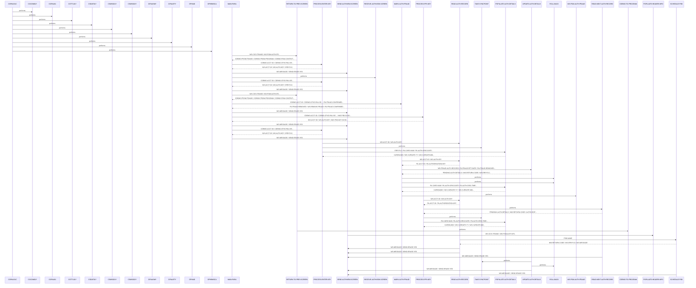

# COPAUS1C

**File:** cbl/COPAUS1C.cbl
**Type:** COBOL
**Status:** In Progress
**Iterations:** 1
**Analyzed:** 2026-03-04 03:22:49.004664

## Purpose

COPAUS1C is a CICS program that displays authorization details and allows users to mark authorizations as fraudulent. It retrieves authorization information based on account ID and authorization key, presents the data on a screen, and provides options to navigate through authorizations or report fraud.

**Business Context:** This program is used to view and manage authorization details, specifically to identify and report fraudulent authorizations.
**Program Type:** ONLINE_CICS
**Citations:** Lines 1, 34, 87

## Inputs

### DFHCOMMAREA
- **Type:** CICS_COMMAREA
- **Description:** Communication area passed from the calling program, containing account ID, authorization key, and other context information.
- **Copybook:** [CARDDEMO-COMMAREA](../copybooks/CARDDEMO-COMMAREA.cpy.md)
- **Lines:** 17, 50, 215

### COPAU1AI
- **Type:** CICS_MAP
- **Description:** Input map received from the CICS terminal, containing user input such as function keys.
- **Lines:** 248

## Outputs

### COPAU1AO
- **Type:** CICS_MAP
- **Description:** Output map sent to the CICS terminal, displaying authorization details and messages.
- **Lines:** 229, 237

## Called Programs

| Program | Call Type | Purpose | Line |
|---------|-----------|---------|------|
| [CDEMO-TO-PROGRAM](./CDEMO-TO-PROGRAM.cbl.md) | CICS_XCTL | Transfers control back to the calling program (CDEMO) after processing is complete or when the user presses PF3. | 214 |
| [WS-PGM-AUTH-FRAUD](./WS-PGM-AUTH-FRAUD.cbl.md) | CICS_LINK | Links to a program responsible for updating fraud details. | 95 |

## Business Rules

### BR001: If the account ID is numeric and an authorization key is selected, read the authorization record.
**Logic:** Checks if CDEMO-ACCT-ID is numeric and CDEMO-CPVD-PAU-SELECTED is not spaces or low-values before reading the authorization record.
**Conditions:** CDEMO-ACCT-ID IS NUMERIC, CDEMO-CPVD-PAU-SELECTED NOT = SPACES AND LOW-VALUES
**Lines:** 57, 58

### BR002: Determine the action to take based on whether the authorization is already marked as fraudulent.
**Logic:** Checks if PA-FRAUD-CONFIRMED is set. If true, remove the fraud flag; otherwise, set the fraud flag.
**Conditions:** PA-FRAUD-CONFIRMED
**Lines:** 82

### BR003: Determine the response code description based on PA-AUTH-RESP-CODE.
**Logic:** If PA-AUTH-RESP-CODE is '00', the authorization is approved, otherwise it is declined.
**Conditions:** PA-AUTH-RESP-CODE = '00'
**Lines:** 157

## Copybooks Used

| Copybook | Location | Purpose | Line |
|----------|----------|---------|------|
| [CARDDEMO-COMMAREA](../copybooks/CARDDEMO-COMMAREA.cpy.md) | LINKAGE | Defines the communication area passed between CICS programs. | 12 |
| [COPAU01](../copybooks/COPAU01.cpy.md) | WORKING_STORAGE | Defines the input and output maps for the COPAU1A screen. | 228 |

## Data Flow

### Reads From
- **CARDDEMO-COMMAREA**: CDEMO-ACCT-ID, CDEMO-CPVD-PAU-SELECTED, CDEMO-TO-PROGRAM, CDEMO-FROM-TRANID, CDEMO-FROM-PROGRAM
  (Lines: 17, 59, 60, 208, 209)
- **COPAU1AI**: all fields
  (Lines: 248)

### Writes To
- **COPAU1AO**: CARDNUMO, AUTHDTO, AUTHTMO, AUTHAMTO, AUTHRSPO, AUTHRSPC, AUTHRSNO, AUTHCDO, POSEMDO, AUTHSRCO, MCCCDO, CRDEXPO, AUTHTYPO, TRNIDO, AUTHMTCO, AUTHFRDO, MERNAMEO, MERIDO, MERCITYO, MERSTO, MERZIPO, ERRMSGO, TITLE01O, TITLE02O, TRNNAMEO, PGMNAMEO, CURDATEO, CURTIMEO
  (Lines: 141, 147, 152, 155, 158, 161, 167, 171, 177, 178, 179, 180, 182, 186, 187, 188, 191, 198, 199, 200, 201, 202, 222, 257, 258, 259, 260, 266, 272)

### Transformations
- **PA-AUTH-ORIG-DATE** → **AUTHDTO**: Formats the authorization date from PA-AUTH-ORIG-DATE into AUTHDTO.
  (Lines: 143, 144, 145, 146, 147)
- **PA-AUTH-ORIG-TIME** → **AUTHTMO**: Formats the authorization time from PA-AUTH-ORIG-TIME into AUTHTMO.
  (Lines: 149, 150, 151, 152)
- **PA-APPROVED-AMT** → **AUTHAMTO**: Moves the approved amount from PA-APPROVED-AMT to AUTHAMTO.
  (Lines: 154, 155)
- **PA-AUTH-RESP-CODE** → **AUTHRSPO**: Sets the authorization response based on PA-AUTH-RESP-CODE. 'A' for approved ('00'), 'D' for declined.
  (Lines: 157, 161)
- **PA-CARD-EXPIRY-DATE** → **CRDEXPO**: Formats the card expiry date from PA-CARD-EXPIRY-DATE into CRDEXPO.
  (Lines: 182, 183, 184)
- **WS-CURDATE-DATA** → **CURDATEO**: Formats the current date into CURDATEO.
  (Lines: 255, 262, 263, 264, 266)
- **WS-CURTIME-DATA** → **CURTIMEO**: Formats the current time into CURTIMEO.
  (Lines: 268, 269, 270, 272)

## Key Paragraphs

### COPAUS1C
**Purpose:** This is the program-id paragraph, it does not contain any executable code.
- Lines: 1-1

### MAIN-PARA
**Purpose:** This is the main control paragraph for the COPAUS1C program. It determines the program's flow based on whether it's the first time the program is entered (EIBCALEN = 0) or a subsequent re-entry. If it's the first entry, it initializes the CARDDEMO-COMMAREA, sets the CDEMO-TO-PROGRAM field, and performs RETURN-TO-PREV-SCREEN to return to the calling program. Otherwise, it receives the COMMAREA, checks for re-entry, and calls other paragraphs based on the EIBAID (AID key pressed). Depending on the AID key, it performs PROCESS-ENTER-KEY, RETURN-TO-PREV-SCREEN, MARK-AUTH-FRAUD, or PROCESS-PF8-KEY, followed by SEND-AUTHVIEW-SCREEN to display the updated screen. Finally, it returns control to CICS with the updated COMMAREA.
- Calls: RETURN-TO-PREV-SCREEN, PROCESS-ENTER-KEY, SEND-AUTHVIEW-SCREEN, RECEIVE-AUTHVIEW-SCREEN, PROCESS-ENTER-KEY, RETURN-TO-PREV-SCREEN, MARK-AUTH-FRAUD, PROCESS-PF8-KEY, PROCESS-ENTER-KEY, SEND-AUTHVIEW-SCREEN
- Lines: 3-52

### PROCESS-ENTER-KEY
**Purpose:** This paragraph processes the ENTER key press. It first initializes the COPAU1AO map. It then checks if the account ID (CDEMO-ACCT-ID) is numeric and an authorization key (CDEMO-CPVD-PAU-SELECTED) has been selected. If both conditions are met, it moves the account ID and authorization key to working storage variables and performs READ-AUTH-RECORD to retrieve the authorization details. If IMS-PSB-SCHD is set, it performs TAKE-SYNCPOINT. If either condition is not met, it sets the ERR-FLG-ON flag. Finally, it performs POPULATE-AUTH-DETAILS to populate the output map with the retrieved authorization details.
- Called by: MAIN-PARA
- Calls: READ-AUTH-RECORD, TAKE-SYNCPOINT, POPULATE-AUTH-DETAILS
- Lines: 54-74

### MARK-AUTH-FRAUD
**Purpose:** This paragraph handles the process of marking an authorization as fraudulent or removing the fraud flag. It moves the account ID and authorization key from the COMMAREA to working storage. It then calls READ-AUTH-RECORD to retrieve the authorization record. Based on the PA-FRAUD-CONFIRMED flag, it either sets the PA-FRAUD-REMOVED flag or the PA-FRAUD-CONFIRMED flag. It then moves data to WS-FRAUD-DATA and links to the WS-PGM-AUTH-FRAUD program to update the fraud details. If the link is successful and the update is successful, it performs UPDATE-AUTH-DETAILS. Otherwise, it moves an error message to WS-MESSAGE and performs ROLL-BACK. If the link fails, it performs ROLL-BACK. Finally, it moves the authorization key back to the COMMAREA and performs POPULATE-AUTH-DETAILS to refresh the screen.
- Called by: MAIN-PARA
- Calls: READ-AUTH-RECORD, UPDATE-AUTH-DETAILS, ROLL-BACK, ROLL-BACK, POPULATE-AUTH-DETAILS
- Lines: 76-112

### PROCESS-PF8-KEY
**Purpose:** This paragraph handles the processing when the PF8 key is pressed, which is intended to display the next authorization record. It moves the account ID and authorization key from the COMMAREA to working storage. It then performs READ-AUTH-RECORD to read the current authorization record and READ-NEXT-AUTH-RECORD to read the next authorization record. If IMS-PSB-SCHD is set, it performs TAKE-SYNCPOINT. If AUTHS-EOF is set, it indicates that the end of the authorizations has been reached, sets SEND-ERASE-NO to TRUE, and moves a message to WS-MESSAGE. Otherwise, it moves the authorization key to the COMMAREA and performs POPULATE-AUTH-DETAILS to display the next authorization record.
- Called by: MAIN-PARA
- Calls: READ-AUTH-RECORD, READ-NEXT-AUTH-RECORD, TAKE-SYNCPOINT, POPULATE-AUTH-DETAILS
- Lines: 114-135

### POPULATE-AUTH-DETAILS
**Purpose:** This paragraph populates the output map (COPAU1AO) with the authorization details retrieved from the authorization record. It moves various fields from the PA- prefixed fields to the corresponding fields in the output map, such as card number, authorization date and time, approved amount, response code, processing code, POS entry mode, message source, merchant category code, card expiry date, authorization type, transaction ID, match status, fraud information, and merchant details. It also handles the formatting of the authorization date and time. It uses SEARCH ALL to find the decline reason description based on the PA-AUTH-RESP-REASON. If ERR-FLG-OFF is set, it populates the map fields; otherwise, it skips the population.
- Called by: PROCESS-ENTER-KEY, MARK-AUTH-FRAUD, PROCESS-PF8-KEY, READ-AUTH-RECORD
- Lines: 137-204

### RETURN-TO-PREV-SCREEN
**Purpose:** This paragraph prepares to return to the calling program (CDEMO). It moves the current transaction ID (WS-CICS-TRANID) and program ID (WS-PGM-AUTH-DTL) to the CARDDEMO-COMMAREA. It sets CDEMO-PGM-CONTEXT to ZEROS and CDEMO-PGM-ENTER to TRUE. Finally, it performs a CICS XCTL to transfer control to the program specified in CDEMO-TO-PROGRAM, passing the CARDDEMO-COMMAREA.
- Called by: MAIN-PARA
- Calls: CDEMO-TO-PROGRAM
- Lines: 206-217

### SEND-AUTHVIEW-SCREEN
**Purpose:** This paragraph sends the COPAU1A screen to the terminal. It first performs POPULATE-HEADER-INFO to populate the header fields of the map. It then moves any message in WS-MESSAGE to the ERRMSGO field of the map. It sets the CARDNUML field to -1. Based on the SEND-ERASE-YES flag, it either sends the map with the ERASE option (clearing the screen) or without the ERASE option. The CURSOR option is used to position the cursor on the screen.
- Called by: MAIN-PARA
- Calls: POPULATE-HEADER-INFO
- Lines: 218-241

### RECEIVE-AUTHVIEW-SCREEN
**Purpose:** This paragraph receives data from the COPAU1A screen. It executes a CICS RECEIVE command to receive the map data into COPAU1AI. NOHANDLE is specified to suppress exception handling.
- Called by: MAIN-PARA
- Lines: 243-251

### POPULATE-HEADER-INFO
**Purpose:** This paragraph populates the header information in the output map (COPAU1AO). It moves the current date to WS-CURDATE-DATA using the FUNCTION CURRENT-DATE. It then moves the title fields (CCDA-TITLE01 and CCDA-TITLE02), transaction ID (WS-CICS-TRANID), and program name (WS-PGM-AUTH-DTL) to the corresponding fields in the output map. Finally, it formats the current date and time into the CURDATEO and CURTIMEO fields of the output map.
- Called by: SEND-AUTHVIEW-SCREEN
- Lines: 253-273

### READ-AUTH-RECORD
**Purpose:** This paragraph retrieves authorization records from the IMS database. It first calls SCHEDULE-PSB to schedule the PSB. It then moves the account ID and authorization key from working storage to the PAUTSUM0 segment fields. It performs a GU (Get Unique) call to retrieve the PAUTSUM0 segment based on the account ID. If the segment is found, it sets AUTHS-NOT-EOF to TRUE. If not found or at the end of the database, it sets AUTHS-EOF to TRUE. If any other error occurs, it sets WS-ERR-FLG to 'Y', constructs an error message, and calls SEND-AUTHVIEW-SCREEN to display the error. If the PAUTSUM0 segment is successfully retrieved, it performs a GNP (Get Next within Parent) call to retrieve the PAUTDTL1 segment based on the authorization key. Similar error handling is performed for the GNP call. The paragraph consumes WS-ACCT-ID and WS-AUTH-KEY as input, and outputs data to PENDING-AUTH-SUMMARY and PENDING-AUTH-DETAILS. It calls SCHEDULE-PSB and SEND-AUTHVIEW-SCREEN.
- Calls: SCHEDULE-PSB, SEND-AUTHVIEW-SCREEN, SEND-AUTHVIEW-SCREEN
- Lines: 431-491

### READ-NEXT-AUTH-RECORD
**Purpose:** This paragraph retrieves the next authorization detail record from the IMS database. It performs a GNP (Get Next within Parent) call to retrieve the PAUTDTL1 segment. If the segment is found, it sets AUTHS-NOT-EOF to TRUE. If not found or at the end of the database, it sets AUTHS-EOF to TRUE. If any other error occurs, it sets WS-ERR-FLG to 'Y', constructs an error message, and calls SEND-AUTHVIEW-SCREEN to display the error. This paragraph is used to iterate through the authorization details for a given account. It consumes no explicit input parameters but relies on the current position within the IMS database. It outputs data to PENDING-AUTH-DETAILS. It calls SEND-AUTHVIEW-SCREEN.
- Calls: SEND-AUTHVIEW-SCREEN
- Lines: 493-518

### UPDATE-AUTH-DETAILS
**Purpose:** This paragraph updates the authorization details in the IMS database. It moves the fraud authorization record from WS-FRAUD-AUTH-RECORD to the PENDING-AUTH-DETAILS segment. It then performs a REPL (Replace) call to update the PAUTDTL1 segment in the IMS database. If the update is successful (STATUS-OK), it performs TAKE-SYNCPOINT to commit the changes. It then moves a success message to WS-MESSAGE, indicating whether the authorization was marked or removed as fraudulent. If the update fails, it performs ROLL-BACK to undo any changes. It sets WS-ERR-FLG to 'Y', constructs an error message, and calls SEND-AUTHVIEW-SCREEN to display the error. This paragraph consumes WS-FRAUD-AUTH-RECORD as input and updates the PENDING-AUTH-DETAILS segment. It calls TAKE-SYNCPOINT, ROLL-BACK, and SEND-AUTHVIEW-SCREEN.
- Calls: TAKE-SYNCPOINT, ROLL-BACK, SEND-AUTHVIEW-SCREEN
- Lines: 520-556

### TAKE-SYNCPOINT
**Purpose:** This paragraph takes a CICS syncpoint to commit the changes made to the IMS database. It executes a CICS SYNCPOINT command. If the syncpoint is successful, the changes are committed. If it fails, the transaction may be left in an inconsistent state. This paragraph does not consume any specific input and does not produce any specific output other than committing the transaction. It does not call any other paragraphs or programs.
- Called by: UPDATE-AUTH-DETAILS
- Lines: 557-564

### ROLL-BACK
**Purpose:** This paragraph rolls back the CICS transaction to undo any changes made to the IMS database. It executes a CICS SYNCPOINT ROLLBACK command. This is typically called when an error occurs during the update process. This paragraph does not consume any specific input and does not produce any specific output other than rolling back the transaction. It does not call any other paragraphs or programs.
- Called by: UPDATE-AUTH-DETAILS
- Lines: 565-573

### SCHEDULE-PSB
**Purpose:** This paragraph schedules the PSB (Program Specification Block) for IMS database access. It executes a DLI SCHD command with the PSB name. If the PSB has been scheduled more than once (PSB-SCHEDULED-MORE-THAN-ONCE), it terminates the PSB and then schedules it again. If the scheduling is successful (STATUS-OK), it sets IMS-PSB-SCHD to TRUE. If the scheduling fails, it sets WS-ERR-FLG to 'Y', constructs an error message, and calls SEND-AUTHVIEW-SCREEN to display the error. This paragraph consumes the PSB-NAME as input and sets the IMS-PSB-SCHD indicator. It calls SEND-AUTHVIEW-SCREEN.
- Called by: READ-AUTH-RECORD
- Calls: SEND-AUTHVIEW-SCREEN
- Lines: 574-603

## Inter-Paragraph Data Flow

| Caller | Callee | Inputs | Outputs | Purpose |
|--------|--------|--------|---------|---------|
| MAIN-PARA | RETURN-TO-PREV-SCREEN | WS-CICS-TRANID, WS-PGM-AUTH-DTL, CDEMO-TO-PROGRAM | CDEMO-FROM-TRANID, CDEMO-FROM-PROGRAM, CDEMO-PGM-CONTEXT, CDEMO-PGM-ENTER | Returns control to the previous screen by setting up the COMMAREA and issuing an XCTL to the calling program. |
| MAIN-PARA | PROCESS-ENTER-KEY | CDEMO-ACCT-ID, CDEMO-CPVD-PAU-SELECTED | WS-ACCT-ID, WS-AUTH-KEY, ERR-FLG-ON, IMS-PSB-NOT-SCHD | Processes the ENTER key by validating input, reading the authorization record, and preparing for screen population. |
| MAIN-PARA | SEND-AUTHVIEW-SCREEN | WS-MESSAGE, SEND-ERASE-YES | CARDNUML, COPAU1AO | Sends the authorization details screen to the user, optionally erasing the screen first based on the flag. |
| MAIN-PARA | RECEIVE-AUTHVIEW-SCREEN | - | - | Receives the data from the authorization details screen entered by the user. |
| MAIN-PARA | PROCESS-ENTER-KEY | CDEMO-ACCT-ID, CDEMO-CPVD-PAU-SELECTED | WS-ACCT-ID, WS-AUTH-KEY, ERR-FLG-ON, IMS-PSB-NOT-SCHD | Processes the ENTER key by validating input, reading the authorization record, and preparing for screen population. |
| MAIN-PARA | SEND-AUTHVIEW-SCREEN | WS-MESSAGE, SEND-ERASE-YES | - | Sends the authorization view screen to the user, optionally erasing the screen first based on the SEND-ERASE-FLG flag. |
| MAIN-PARA | RETURN-TO-PREV-SCREEN | WS-CICS-TRANID, WS-PGM-AUTH-DTL | CDEMO-FROM-TRANID, CDEMO-FROM-PROGRAM, CDEMO-PGM-CONTEXT, CDEMO-PGM-ENTER | Returns control to the previous program by XCTL with updated COMMAREA fields indicating the calling context and program. |
| MAIN-PARA | MARK-AUTH-FRAUD | CDEMO-ACCT-ID, CDEMO-CPVD-PAU-SELECTED, PA-FRAUD-CONFIRMED, WS-PGM-AUTH-FRAUD, WS-FRD-UPDT-SUCCESS, WS-FRD-ACT-MSG | PA-FRAUD-REMOVED, WS-REMOVE-FRAUD, PA-FRAUD-CONFIRMED, WS-REPORT-FRAUD, WS-FRAUD-AUTH-RECORD, WS-FRD-ACCT-ID, WS-FRD-CUST-ID, CDEMO-CPVD-PAU-SELECTED, WS-MESSAGE | Marks or unmarks an authorization record as fraudulent, updates related data, and synchronizes changes via a linked program. |
| MAIN-PARA | SEND-AUTHVIEW-SCREEN | WS-MESSAGE, SEND-ERASE-YES | - | Sends the authorization view screen to the user, optionally erasing the screen first based on the SEND-ERASE-FLG flag. |
| MAIN-PARA | PROCESS-PF8-KEY | CDEMO-ACCT-ID, CDEMO-CPVD-PAU-SELECTED, IMS-PSB-SCHD, AUTHS-EOF | WS-ACCT-ID, WS-AUTH-KEY, IMS-PSB-NOT-SCHD, SEND-ERASE-NO, WS-MESSAGE, CDEMO-CPVD-PAU-SELECTED | Processes the PF8 key to navigate to the next authorization record for the account, handling end-of-file and syncpoint logic. |
| MAIN-PARA | SEND-AUTHVIEW-SCREEN | WS-MESSAGE, SEND-ERASE-YES | - | Sends the authorization view screen to the user, optionally erasing the screen based on the SEND-ERASE-YES flag. |
| MAIN-PARA | PROCESS-ENTER-KEY | CDEMO-ACCT-ID, CDEMO-CPVD-PAU-SELECTED | WS-ACCT-ID, WS-AUTH-KEY, ERR-FLG | Processes the ENTER key by validating input account and authorization key, setting up working storage variables, and preparing for record retrieval. |
| MAIN-PARA | SEND-AUTHVIEW-SCREEN | WS-MESSAGE, SEND-ERASE-YES | - | Sends the authorization view screen to the user, optionally erasing the screen based on the SEND-ERASE-YES flag. |
| PROCESS-ENTER-KEY | READ-AUTH-RECORD | WS-ACCT-ID, WS-AUTH-KEY | - | Prepares to read an authorization record by moving working storage account ID and authorization key to IMS PCB fields. |
| PROCESS-ENTER-KEY | TAKE-SYNCPOINT | - | - | Commits the current unit of work by issuing a CICS SYNCPOINT to ensure data consistency. |
| PROCESS-ENTER-KEY | POPULATE-AUTH-DETAILS | ERR-FLG, PA-CARD-NUM, PA-AUTH-ORIG-DATE, PA-AUTH-ORIG-TIME, PA-APPROVED-AMT, PA-AUTH-RESP-CODE, PA-PROCESSING-CODE, PA-POS-ENTRY-MODE, PA-MESSAGE-SOURCE, PA-MERCHANT-CATAGORY-CODE, PA-CARD-EXPIRY-DATE, PA-AUTH-TYPE, PA-TRANSACTION-ID, PA-MATCH-STATUS, PA-FRAUD-CONFIRMED, PA-FRAUD-REMOVED, PA-AUTH-FRAUD, PA-FRAUD-RPT-DATE, PA-MERCHANT-NAME, PA-MERCHANT-ID, PA-MERCHANT-CITY, PA-MERCHANT-STATE, PA-MERCHANT-ZIP, WS-CURDATE-YY, WS-CURDATE-MM, WS-CURDATE-DD, WS-AUTH-DATE, WS-AUTH-AMT, WS-DECLINE-REASON-TAB | CARDNUMO, WS-CURDATE-YY, WS-CURDATE-MM, WS-CURDATE-DD, WS-AUTH-DATE, AUTHDTO, WS-AUTH-TIME, AUTHTMO, WS-AUTH-AMT, AUTHAMTO, AUTHRSPO, AUTHRSPC, AUTHRSNO, AUTHCDO, POSEMDO, AUTHSRCO, MCCCDO, CRDEXPO, AUTHTYPO, TRNIDO, AUTHMTCO, AUTHFRDO, MERNAMEO, MERIDO, MERCITYO, MERSTO, MERZIPO | Populates the authorization details screen with data from the PA segment and working storage after validating no error flag is set. |
| MARK-AUTH-FRAUD | READ-AUTH-RECORD | WS-ACCT-ID, WS-AUTH-KEY | PA-ACCT-ID, PA-AUTHORIZATION-KEY | Sets the account ID and authorization key in the PA segment for reading the authorization record from IMS. |
| MARK-AUTH-FRAUD | UPDATE-AUTH-DETAILS | WS-FRAUD-AUTH-RECORD, PA-FRAUD-RPT-DATE, PA-FRAUD-REMOVED, WS-MESSAGE | PENDING-AUTH-DETAILS, IMS-RETURN-CODE, WS-ERR-FLG, WS-MESSAGE | Updates the pending authorization details in IMS with fraud status and performs a syncpoint or rollback based on success, while setting appropriate messages. |
| MARK-AUTH-FRAUD | ROLL-BACK | - | - | Performs a CICS rollback to undo database changes when an error occurs during fraud update processing. |
| MARK-AUTH-FRAUD | ROLL-BACK | - | - | Performs a CICS rollback to undo database changes when an error occurs during fraud update processing. |
| MARK-AUTH-FRAUD | POPULATE-AUTH-DETAILS | PA-CARD-NUM, PA-AUTH-ORIG-DATE, PA-AUTH-ORIG-TIME, PA-APPROVED-AMT, PA-AUTH-RESP-CODE, PA-PROCESSING-CODE, PA-POS-ENTRY-MODE, PA-MESSAGE-SOURCE, PA-MERCHANT-CATAGORY-CODE, PA-CARD-EXPIRY-DATE, PA-AUTH-TYPE, PA-TRANSACTION-ID, PA-MATCH-STATUS, PA-FRAUD-CONFIRMED, PA-FRAUD-REMOVED, PA-AUTH-FRAUD, PA-FRAUD-RPT-DATE, PA-MERCHANT-NAME, PA-MERCHANT-ID, PA-MERCHANT-CITY, PA-MERCHANT-STATE, PA-MERCHANT-ZIP, ERR-FLG, WS-CURDATE-YY, WS-CURDATE-MM, WS-CURDATE-DD, WS-AUTH-AMT, WS-AUTH-DATE, WS-AUTH-TIME, WS-DECLINE-REASON-TAB | CARDNUMO, WS-CURDATE-YY, WS-CURDATE-MM, WS-CURDATE-DD, WS-AUTH-DATE, AUTHDTO, WS-AUTH-TIME, AUTHTMO, WS-AUTH-AMT, AUTHAMTO, AUTHRSPO, AUTHRSPC, AUTHRSNO, AUTHCDO, POSEMDO, AUTHSRCO, MCCCDO, CRDEXPO, AUTHTYPO, TRNIDO, AUTHMTCO, AUTHFRDO, MERNAMEO, MERIDO, MERCITYO, MERSTO, MERZIPO | Populates the authorization details screen with data from the current authorization record and formats it for display. |
| PROCESS-PF8-KEY | READ-AUTH-RECORD | WS-ACCT-ID, WS-AUTH-KEY | PA-ACCT-ID, PA-AUTHORIZATION-KEY | Sets the account ID and authorization key in the IMS PCB for reading a specific authorization record. |
| PROCESS-PF8-KEY | READ-NEXT-AUTH-RECORD | - | PENDING-AUTH-DETAILS, IMS-RETURN-CODE, AUTHS-EOF, AUTHS-NOT-EOF, WS-ERR-FLG, WS-MESSAGE | Reads the next authorization record from the IMS database and updates EOF and error status accordingly. |
| PROCESS-PF8-KEY | TAKE-SYNCPOINT | - | - | Commits the current unit of work in CICS by issuing a syncpoint. |
| PROCESS-PF8-KEY | POPULATE-AUTH-DETAILS | PA-CARD-NUM, PA-AUTH-ORIG-DATE, PA-AUTH-ORIG-TIME, PA-APPROVED-AMT, PA-AUTH-RESP-CODE, PA-PROCESSING-CODE, PA-POS-ENTRY-MODE, PA-MESSAGE-SOURCE, PA-MERCHANT-CATAGORY-CODE, PA-CARD-EXPIRY-DATE, PA-AUTH-TYPE, PA-TRANSACTION-ID, PA-MATCH-STATUS, PA-FRAUD-CONFIRMED, PA-FRAUD-REMOVED, PA-AUTH-FRAUD, PA-FRAUD-RPT-DATE, PA-MERCHANT-NAME, PA-MERCHANT-ID, PA-MERCHANT-CITY, PA-MERCHANT-STATE, PA-MERCHANT-ZIP, ERR-FLG, WS-CURDATE-YY, WS-CURDATE-MM, WS-CURDATE-DD, WS-AUTH-AMT, WS-AUTH-DATE, WS-AUTH-TIME, WS-DECLINE-REASON-TAB | CARDNUMO, WS-CURDATE-YY, WS-CURDATE-MM, WS-CURDATE-DD, WS-AUTH-DATE, AUTHDTO, WS-AUTH-TIME, AUTHTMO, WS-AUTH-AMT, AUTHAMTO, AUTHRSPO, AUTHRSPC, AUTHRSNO, AUTHCDO, POSEMDO, AUTHSRCO, MCCCDO, CRDEXPO, AUTHTYPO, TRNIDO, AUTHMTCO, AUTHFRDO, MERNAMEO, MERIDO, MERCITYO, MERSTO, MERZIPO | Populates the authorization details screen with data from the current authorization record and formats it for display. |
| SEND-AUTHVIEW-SCREEN | POPULATE-HEADER-INFO | WS-CICS-TRANID, WS-PGM-AUTH-DTL | - | Populates the screen header with current date, time, transaction name, program name, and title information. |
| READ-AUTH-RECORD | SCHEDULE-PSB | PSB-NAME | IMS-RETURN-CODE, WS-ERR-FLG, WS-MESSAGE | Schedules the IMS PSB for database access and handles errors if scheduling fails. |
| READ-AUTH-RECORD | SEND-AUTHVIEW-SCREEN | WS-MESSAGE, SEND-ERASE-YES | - | Sends the authorization view screen to the user, displaying error messages and screen elements. |
| READ-AUTH-RECORD | SEND-AUTHVIEW-SCREEN | WS-MESSAGE, SEND-ERASE-YES | - | Sends the authorization view screen to the user, displaying error messages and screen elements. |
| READ-NEXT-AUTH-RECORD | SEND-AUTHVIEW-SCREEN | WS-MESSAGE, SEND-ERASE-YES | - | Sends the authorization view screen when an error occurs while reading the next authorization record. |
| UPDATE-AUTH-DETAILS | TAKE-SYNCPOINT | - | - | Commits the current unit of work to ensure data integrity after successfully updating an authorization detail in IMS. |
| UPDATE-AUTH-DETAILS | ROLL-BACK | - | - | Rolls back the current unit of work due to an error during the authorization update process in IMS. |
| UPDATE-AUTH-DETAILS | SEND-AUTHVIEW-SCREEN | WS-MESSAGE, SEND-ERASE-YES | - | Sends an error message to the terminal screen after a failure in fraud tagging, using the message stored in WS-MESSAGE and controlling screen erase behavior based on SEND-ERASE-YES. |
| SCHEDULE-PSB | SEND-AUTHVIEW-SCREEN | WS-MESSAGE, SEND-ERASE-YES | - | Displays an error message on the terminal screen when PSB scheduling fails, using WS-MESSAGE for the content and SEND-ERASE-YES to control screen handling. |

## Error Handling

- **EIBRESP NOT = DFHRESP(NORMAL) after CICS LINK:** ROLL-BACK
  (Lines: 99, 107)

## CICS Operations

| Command | Resource | Purpose | Line |
|---------|----------|---------|------|
| RETURN |  | Returns control to CICS. | 48 |
| XCTL | CDEMO-TO-PROGRAM | Transfers control to another CICS program. | 214 |
| SEND MAP | COPAU1A | Sends the map to the terminal. | 227 |
| RECEIVE MAP | COPAU1A | Receives the map from the terminal. | 246 |
| LINK | WS-PGM-AUTH-FRAUD | Links to the fraud processing program. | 94 |

## Resolved Questions

- **Q:** What is the purpose of the READ-AUTH-RECORD and READ-NEXT-AUTH-RECORD paragraphs?
  **A:** Based on the code snippets:

*   **READ-AUTH-RECORD:** This paragraph appears to schedule a PSB (Program Specification Block) for IMS database access and sets up the `PA-ACCT-ID` field with the value of `WS-ACCT-ID`. It seems to prepare the program to read authorization records from the database.
*   **READ-NEXT-AUTH-RECORD:** This paragraph executes a DLI (Data Language Interface) `GNP` (Get Next within Parent) call to retrieve the next `PAUTDTL1` segment (Pending Authorization Details) from the IMS database into the `PENDING-AUTH-DETAILS` area. This suggests it's used to iterate through authorization records for a given account.

In summary, `READ-AUTH-RECORD` prepares for reading authorization records, and `READ-NEXT-AUTH-RECORD` retrieves the next authorization record.
- **Q:** What is the purpose of the ROLL-BACK paragraph?
  **A:** The purpose of the `ROLL-BACK` paragraph in `COPAUS1C.cbl` is to rollback database changes. It executes a CICS `SYNCPOINT ROLLBACK` command. This is used to undo any changes made to recoverable resources (like databases) within the current unit of work, ensuring data consistency in case of errors or when a transaction needs to be aborted. The comments above the paragraph confirm this.
- **Q:** What is the purpose of the TAKE-SYNCPOINT paragraph?
  **A:** The purpose of the `TAKE-SYNCPOINT` paragraph in `COPAUS1C.cbl` is to initiate a CICS SYNCPOINT. This command ensures that all recoverable resources modified by the transaction are committed, providing data consistency and recovery capabilities. It's used after IMS database updates (lines 220, 278, 533) to commit the changes.

## Sequence Diagram

```mermaid
sequenceDiagram
    participant COPAUS1C as COPAUS1C
    participant COCOM01Y as COCOM01Y
    participant COPAU01 as COPAU01
    participant COTTL01Y as COTTL01Y
    participant CSDAT01Y as CSDAT01Y
    participant CSMSG01Y as CSMSG01Y
    participant CSMSG02Y as CSMSG02Y
    participant CIPAUSMY as CIPAUSMY
    participant CIPAUDTY as CIPAUDTY
    participant DFHAID as DFHAID
    participant DFHBMSCA as DFHBMSCA
    participant MAIN_PARA as MAIN-PARA
    participant RETURN_TO_PREV_SCREEN as RETURN-TO-PREV-SCREEN
    participant PROCESS_ENTER_KEY as PROCESS-ENTER-KEY
    participant SEND_AUTHVIEW_SCREEN as SEND-AUTHVIEW-SCREEN
    participant RECEIVE_AUTHVIEW_SCREEN as RECEIVE-AUTHVIEW-SCREEN
    participant MARK_AUTH_FRAUD as MARK-AUTH-FRAUD
    participant PROCESS_PF8_KEY as PROCESS-PF8-KEY
    participant READ_AUTH_RECORD as READ-AUTH-RECORD
    participant TAKE_SYNCPOINT as TAKE-SYNCPOINT
    participant POPULATE_AUTH_DETAILS as POPULATE-AUTH-DETAILS
    participant UPDATE_AUTH_DETAILS as UPDATE-AUTH-DETAILS
    participant ROLL_BACK as ROLL-BACK
    participant WS_PGM_AUTH_FRAUD as WS-PGM-AUTH-FRAUD
    participant READ_NEXT_AUTH_RECORD as READ-NEXT-AUTH-RECORD
    participant CDEMO_TO_PROGRAM as CDEMO-TO-PROGRAM
    participant POPULATE_HEADER_INFO as POPULATE-HEADER-INFO
    participant SCHEDULE_PSB as SCHEDULE-PSB
    COPAUS1C->>COCOM01Y: performs
    COPAUS1C->>COPAU01: performs
    COPAUS1C->>COTTL01Y: performs
    COPAUS1C->>CSDAT01Y: performs
    COPAUS1C->>CSMSG01Y: performs
    COPAUS1C->>CSMSG02Y: performs
    COPAUS1C->>CIPAUSMY: performs
    COPAUS1C->>CIPAUDTY: performs
    COPAUS1C->>DFHAID: performs
    COPAUS1C->>DFHBMSCA: performs
    MAIN_PARA->>RETURN_TO_PREV_SCREEN: WS-CICS-TRANID / WS-PGM-AUTH-DTL
    RETURN_TO_PREV_SCREEN-->>MAIN_PARA: CDEMO-FROM-TRANID / CDEMO-FROM-PROGRAM / CDEMO-PGM-CONTEXT...
    MAIN_PARA->>PROCESS_ENTER_KEY: CDEMO-ACCT-ID / CDEMO-CPVD-PAU-SE...
    PROCESS_ENTER_KEY-->>MAIN_PARA: WS-ACCT-ID / WS-AUTH-KEY / ERR-FLG
    MAIN_PARA->>SEND_AUTHVIEW_SCREEN: WS-MESSAGE / SEND-ERASE-YES
    MAIN_PARA->>RECEIVE_AUTHVIEW_SCREEN: performs
    MAIN_PARA->>PROCESS_ENTER_KEY: CDEMO-ACCT-ID / CDEMO-CPVD-PAU-SE...
    PROCESS_ENTER_KEY-->>MAIN_PARA: WS-ACCT-ID / WS-AUTH-KEY / ERR-FLG
    MAIN_PARA->>SEND_AUTHVIEW_SCREEN: WS-MESSAGE / SEND-ERASE-YES
    MAIN_PARA->>RETURN_TO_PREV_SCREEN: WS-CICS-TRANID / WS-PGM-AUTH-DTL
    RETURN_TO_PREV_SCREEN-->>MAIN_PARA: CDEMO-FROM-TRANID / CDEMO-FROM-PROGRAM / CDEMO-PGM-CONTEXT...
    MAIN_PARA->>MARK_AUTH_FRAUD: CDEMO-ACCT-ID / CDEMO-CPVD-PAU-SE... / PA-FRAUD-CONFIRMED...
    MARK_AUTH_FRAUD-->>MAIN_PARA: PA-FRAUD-REMOVED / WS-REMOVE-FRAUD / PA-FRAUD-CONFIRMED...
    MAIN_PARA->>SEND_AUTHVIEW_SCREEN: WS-MESSAGE / SEND-ERASE-YES
    MAIN_PARA->>PROCESS_PF8_KEY: CDEMO-ACCT-ID / CDEMO-CPVD-PAU-SE... / IMS-PSB-SCHD...
    PROCESS_PF8_KEY-->>MAIN_PARA: WS-ACCT-ID / WS-AUTH-KEY / IMS-PSB-NOT-SCHD...
    MAIN_PARA->>SEND_AUTHVIEW_SCREEN: WS-MESSAGE / SEND-ERASE-YES
    MAIN_PARA->>PROCESS_ENTER_KEY: CDEMO-ACCT-ID / CDEMO-CPVD-PAU-SE...
    PROCESS_ENTER_KEY-->>MAIN_PARA: WS-ACCT-ID / WS-AUTH-KEY / ERR-FLG
    MAIN_PARA->>SEND_AUTHVIEW_SCREEN: WS-MESSAGE / SEND-ERASE-YES
    PROCESS_ENTER_KEY->>READ_AUTH_RECORD: WS-ACCT-ID / WS-AUTH-KEY
    PROCESS_ENTER_KEY->>TAKE_SYNCPOINT: performs
    PROCESS_ENTER_KEY->>POPULATE_AUTH_DETAILS: ERR-FLG / PA-CARD-NUM / PA-AUTH-ORIG-DATE...
    POPULATE_AUTH_DETAILS-->>PROCESS_ENTER_KEY: CARDNUMO / WS-CURDATE-YY / WS-CURDATE-MM...
    MARK_AUTH_FRAUD->>READ_AUTH_RECORD: WS-ACCT-ID / WS-AUTH-KEY
    READ_AUTH_RECORD-->>MARK_AUTH_FRAUD: PA-ACCT-ID / PA-AUTHORIZATION-KEY
    MARK_AUTH_FRAUD->>UPDATE_AUTH_DETAILS: WS-FRAUD-AUTH-RECORD / PA-FRAUD-RPT-DATE / PA-FRAUD-REMOVED...
    UPDATE_AUTH_DETAILS-->>MARK_AUTH_FRAUD: PENDING-AUTH-DETAILS / IMS-RETURN-CODE / WS-ERR-FLG...
    MARK_AUTH_FRAUD->>ROLL_BACK: performs
    MARK_AUTH_FRAUD->>ROLL_BACK: performs
    MARK_AUTH_FRAUD->>POPULATE_AUTH_DETAILS: PA-CARD-NUM / PA-AUTH-ORIG-DATE / PA-AUTH-ORIG-TIME...
    POPULATE_AUTH_DETAILS-->>MARK_AUTH_FRAUD: CARDNUMO / WS-CURDATE-YY / WS-CURDATE-MM...
    MARK_AUTH_FRAUD->>WS_PGM_AUTH_FRAUD: performs
    PROCESS_PF8_KEY->>READ_AUTH_RECORD: WS-ACCT-ID / WS-AUTH-KEY
    READ_AUTH_RECORD-->>PROCESS_PF8_KEY: PA-ACCT-ID / PA-AUTHORIZATION-KEY
    PROCESS_PF8_KEY->>READ_NEXT_AUTH_RECORD: performs
    READ_NEXT_AUTH_RECORD-->>PROCESS_PF8_KEY: PENDING-AUTH-DETAILS / IMS-RETURN-CODE / AUTHS-EOF...
    PROCESS_PF8_KEY->>TAKE_SYNCPOINT: performs
    PROCESS_PF8_KEY->>POPULATE_AUTH_DETAILS: PA-CARD-NUM / PA-AUTH-ORIG-DATE / PA-AUTH-ORIG-TIME...
    POPULATE_AUTH_DETAILS-->>PROCESS_PF8_KEY: CARDNUMO / WS-CURDATE-YY / WS-CURDATE-MM...
    RETURN_TO_PREV_SCREEN->>CDEMO_TO_PROGRAM: performs
    SEND_AUTHVIEW_SCREEN->>POPULATE_HEADER_INFO: WS-CICS-TRANID / WS-PGM-AUTH-DTL
    READ_AUTH_RECORD->>SCHEDULE_PSB: PSB-NAME
    SCHEDULE_PSB-->>READ_AUTH_RECORD: IMS-RETURN-CODE / WS-ERR-FLG / WS-MESSAGE
    READ_AUTH_RECORD->>SEND_AUTHVIEW_SCREEN: WS-MESSAGE / SEND-ERASE-YES
    READ_AUTH_RECORD->>SEND_AUTHVIEW_SCREEN: WS-MESSAGE / SEND-ERASE-YES
    READ_NEXT_AUTH_RECORD->>SEND_AUTHVIEW_SCREEN: WS-MESSAGE / SEND-ERASE-YES
    UPDATE_AUTH_DETAILS->>TAKE_SYNCPOINT: performs
    UPDATE_AUTH_DETAILS->>ROLL_BACK: performs
    UPDATE_AUTH_DETAILS->>SEND_AUTHVIEW_SCREEN: WS-MESSAGE / SEND-ERASE-YES
    SCHEDULE_PSB->>SEND_AUTHVIEW_SCREEN: WS-MESSAGE / SEND-ERASE-YES
```

---
*Generated by War Rig WAR_RIG*