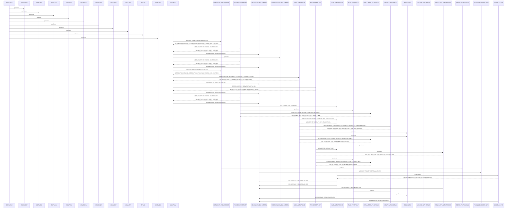

# COPAUS1C

**File:** COPAUS1C.cbl
**Type:** COBOL
**Status:** In Progress
**Iterations:** 1
**Analyzed:** 2026-03-03 16:44:06.866032

## Purpose

The COPAUS1C program is a CICS transaction that displays authorization details and allows users to mark authorizations as fraudulent. It retrieves authorization information from an IMS database and presents it on a CICS screen, providing options to return to the previous screen, mark an authorization as fraudulent, or navigate to the next authorization record.

**Business Context:** This program is used to review and manage authorization records, potentially as part of a fraud detection or investigation process.
**Program Type:** ONLINE_CICS
**Citations:** Lines 23, 166, 230

## Inputs

### CARDDEMO-COMMAREA
- **Type:** CICS_COMMAREA
- **Description:** Communication area passed from a calling program, containing account ID and authorization key.
- **Lines:** 166, 171

### PA-AUTHORIZATION-KEY
- **Type:** IMS_SEGMENT
- **Description:** Authorization key retrieved from the IMS database.
- **Lines:** 259, 284

## Outputs

### COPAU1AO
- **Type:** CICS_MAP
- **Description:** CICS map containing authorization details displayed on the screen.
- **Copybook:** [COPAU01](../copybooks/COPAU01.cpy.md)
- **Lines:** 380, 388

### WS-FRAUD-DATA
- **Type:** CICS_COMMAREA
- **Description:** Communication area passed to the fraud processing program.
- **Lines:** 247

## Called Programs

| Program | Call Type | Purpose | Line |
|---------|-----------|---------|------|
| [CDEMO-TO-PROGRAM](./CDEMO-TO-PROGRAM.cbl.md) | CICS_XCTL | Transfers control back to the calling program. | 367 |
| [WS-PGM-AUTH-FRAUD](./WS-PGM-AUTH-FRAUD.cbl.md) | CICS_LINK | Links to a program to process fraud information. | 247 |

## Business Rules

### BR001: If the authorization response code is '00', the authorization is considered approved and 'A' is displayed on the screen with green color.
**Logic:** Checks PA-AUTH-RESP-CODE and sets AUTHRSPO and AUTHRSPC accordingly.
**Conditions:** IF PA-AUTH-RESP-CODE = '00'
**Lines:** 323, 324, 325

### BR002: If the authorization response code is not '00', the authorization is considered declined and 'D' is displayed on the screen with red color.
**Logic:** Checks PA-AUTH-RESP-CODE and sets AUTHRSPO and AUTHRSPC accordingly.
**Conditions:** ELSE (PA-AUTH-RESP-CODE not = '00')
**Lines:** 326, 327, 328

### BR003: If the fraud is confirmed or removed, the fraud report date is displayed on the screen.
**Logic:** Checks PA-FRAUD-CONFIRMED or PA-FRAUD-REMOVED and moves PA-AUTH-FRAUD to AUTHFRDO.
**Conditions:** IF PA-FRAUD-CONFIRMED OR PA-FRAUD-REMOVED
**Lines:** 348, 349, 350

## Copybooks Used

| Copybook | Location | Purpose | Line |
|----------|----------|---------|------|
| [COPAU01](../copybooks/COPAU01.cpy.md) | FILE_SECTION | Defines the CICS map layout for the authorization view screen. | 381 |

## Data Flow

### Reads From
- **CARDDEMO-COMMAREA**: CDEMO-ACCT-ID, CDEMO-CPVD-PAU-SELECTED
  (Lines: 171, 211, 213)
- **IMS Database**: PA-CARD-NUM, PA-AUTH-ORIG-DATE, PA-AUTH-ORIG-TIME, PA-APPROVED-AMT, PA-AUTH-RESP-CODE, PA-AUTH-RESP-REASON, PA-PROCESSING-CODE, PA-POS-ENTRY-MODE, PA-MESSAGE-SOURCE, PA-MERCHANT-CATAGORY-CODE, PA-CARD-EXPIRY-DATE, PA-AUTH-TYPE, PA-TRANSACTION-ID, PA-MATCH-STATUS, PA-FRAUD-CONFIRMED, PA-FRAUD-REMOVED, PA-AUTH-FRAUD, PA-MERCHANT-NAME, PA-MERCHANT-ID, PA-MERCHANT-CITY, PA-MERCHANT-STATE, PA-MERCHANT-ZIP
  (Lines: 300, 303, 307, 313, 319, 322, 334, 335, 336, 337, 339, 342, 343, 344, 346, 347, 348, 352, 353, 354, 355, 356)

### Writes To
- **COPAU1AO**: CARDNUMO, AUTHDTO, AUTHTMO, AUTHAMTO, AUTHRSPO, AUTHRSPC, AUTHRSNO, AUTHCDO, POSEMDO, AUTHSRCO, MCCCDO, CRDEXPO, AUTHTYPO, TRNIDO, AUTHMTCO, AUTHFRDO, MERNAMEO, MERIDO, MERCITYO, MERSTO, MERZIPO, ERRMSGO, TITLE01O, TITLE02O, TRNNAMEO, PGMNAMEO, CURDATEO, CURTIMEO
  (Lines: 300, 306, 310, 314, 319, 323, 326, 330, 334, 335, 336, 337, 339, 342, 343, 344, 348, 352, 353, 354, 355, 356, 380, 412, 413, 414, 415, 418, 425)

### Transformations
- **PA-AUTH-ORIG-DATE** → **AUTHDTO**: Formats the authorization original date into MM/DD/YY format.
  (Lines: 303, 304, 305, 306)
- **PA-AUTH-ORIG-TIME** → **AUTHTMO**: Formats the authorization original time into HH:MM:SS format.
  (Lines: 307, 308, 309, 310)
- **PA-APPROVED-AMT** → **AUTHAMTO**: Moves the approved amount to the output field.
  (Lines: 313, 314)

## Key Paragraphs

### COPAUS1C
**Purpose:** This is the program entry point. It doesn't contain any logic, it just defines the program ID. It serves as the starting point for the CICS transaction.
- Lines: 23-23

### MAIN-PARA
**Purpose:** This paragraph is the main control flow for the CICS transaction. It first checks if the communication area (COMMAREA) is empty, indicating a first-time call. If so, it initializes the COMMAREA and calls RETURN-TO-PREV-SCREEN to return to the previous menu. Otherwise, it receives the COMMAREA, checks the EIBAID (AID code) to determine the user's action (ENTER, PF3, PF5, PF8, or other), and performs the corresponding action: PROCESS-ENTER-KEY, RETURN-TO-PREV-SCREEN, MARK-AUTH-FRAUD, PROCESS-PF8-KEY, or displays an error message. Finally, it returns to CICS with the updated COMMAREA. The paragraph consumes the DFHCOMMAREA and EIBAID, and produces an updated CARDDEMO-COMMAREA. It uses EVALUATE statement to handle different user actions. It calls RECEIVE-AUTHVIEW-SCREEN, PROCESS-ENTER-KEY, SEND-AUTHVIEW-SCREEN, RETURN-TO-PREV-SCREEN, MARK-AUTH-FRAUD, and PROCESS-PF8-KEY based on the user's input.
- Calls: RETURN-TO-PREV-SCREEN, PROCESS-ENTER-KEY, SEND-AUTHVIEW-SCREEN, RECEIVE-AUTHVIEW-SCREEN, PROCESS-ENTER-KEY, RETURN-TO-PREV-SCREEN, MARK-AUTH-FRAUD, PROCESS-PF8-KEY, PROCESS-ENTER-KEY, SEND-AUTHVIEW-SCREEN
- Lines: 157-206

### PROCESS-ENTER-KEY
**Purpose:** This paragraph processes the ENTER key press. It first initializes the COPAU1AO map. Then, it checks if the account ID and authorization key are valid (numeric and not spaces). If valid, it moves the account ID and authorization key to working storage and calls READ-AUTH-RECORD to retrieve the authorization record from the IMS database. If the PSB is scheduled, it performs a syncpoint. Finally, it calls POPULATE-AUTH-DETAILS to populate the screen fields with the authorization details. If the account ID or authorization key are invalid, it sets the error flag. The paragraph consumes CDEMO-ACCT-ID and CDEMO-CPVD-PAU-SELECTED from the COMMAREA and produces WS-ACCT-ID and WS-AUTH-KEY. It uses IF statement to validate the input data. It calls READ-AUTH-RECORD, TAKE-SYNCPOINT, and POPULATE-AUTH-DETAILS.
- Called by: MAIN-PARA
- Calls: READ-AUTH-RECORD, TAKE-SYNCPOINT, POPULATE-AUTH-DETAILS
- Lines: 208-228

### MARK-AUTH-FRAUD
**Purpose:** This paragraph marks an authorization as fraudulent. It moves the account ID and authorization key to working storage and calls READ-AUTH-RECORD to retrieve the authorization record. It then checks if the fraud is already confirmed. If not, it sets the fraud confirmed flag. It moves the pending authorization details to the fraud data area and links to the fraud processing program (WS-PGM-AUTH-FRAUD). If the fraud update is successful, it calls UPDATE-AUTH-DETAILS. Otherwise, it displays an error message and performs a rollback. If the link to the fraud processing program fails, it performs a rollback. Finally, it moves the authorization key to the COMMAREA and calls POPULATE-AUTH-DETAILS to refresh the screen. The paragraph consumes CDEMO-ACCT-ID, CDEMO-CPVD-PAU-SELECTED, and PENDING-AUTH-DETAILS and produces WS-ACCT-ID, WS-AUTH-KEY, and WS-FRAUD-DATA. It uses IF statement to check the fraud status and EIBRESP to check the link status. It calls READ-AUTH-RECORD, UPDATE-AUTH-DETAILS, ROLL-BACK, and POPULATE-AUTH-DETAILS.
- Called by: MAIN-PARA
- Calls: READ-AUTH-RECORD, UPDATE-AUTH-DETAILS, ROLL-BACK, ROLL-BACK, POPULATE-AUTH-DETAILS
- Lines: 230-266

### PROCESS-PF8-KEY
**Purpose:** This paragraph processes the PF8 key press, which is used to navigate to the next authorization record. It moves the account ID and authorization key to working storage and calls READ-AUTH-RECORD to retrieve the current authorization record. It then calls READ-NEXT-AUTH-RECORD to retrieve the next authorization record. If the PSB is scheduled, it performs a syncpoint. If the end of file is reached, it displays a message. Otherwise, it moves the authorization key to the COMMAREA and calls POPULATE-AUTH-DETAILS to display the next authorization record. The paragraph consumes CDEMO-ACCT-ID and CDEMO-CPVD-PAU-SELECTED and produces WS-ACCT-ID and WS-AUTH-KEY. It uses IF statement to check the end of file status. It calls READ-AUTH-RECORD, READ-NEXT-AUTH-RECORD, TAKE-SYNCPOINT, and POPULATE-AUTH-DETAILS.
- Called by: MAIN-PARA
- Calls: READ-AUTH-RECORD, READ-NEXT-AUTH-RECORD, TAKE-SYNCPOINT, POPULATE-AUTH-DETAILS
- Lines: 268-289

### POPULATE-AUTH-DETAILS
**Purpose:** This paragraph populates the authorization details on the CICS screen (COPAU1AO). It moves data from the IMS database (PA-*) to the corresponding fields in the CICS map. It formats the authorization date and time, and sets the authorization response code and reason. It also handles fraud information and merchant details. The paragraph consumes data from the IMS database (PA-*) and produces the output to the CICS map (COPAU1AO). It uses IF statements to handle different authorization response codes and fraud statuses. It also uses SEARCH ALL to find the decline reason description. It does not call any other paragraphs.
- Called by: PROCESS-ENTER-KEY, MARK-AUTH-FRAUD, PROCESS-PF8-KEY
- Lines: 291-358

### RETURN-TO-PREV-SCREEN
**Purpose:** This paragraph returns control to the previous CICS screen. It moves the current transaction ID and program name to the COMMAREA and then performs a CICS XCTL to the program specified in CDEMO-TO-PROGRAM, passing the COMMAREA. This effectively transfers control back to the calling program. The paragraph consumes WS-CICS-TRANID and WS-PGM-AUTH-DTL and produces CDEMO-FROM-TRANID and CDEMO-FROM-PROGRAM in the COMMAREA. It calls CDEMO-TO-PROGRAM using CICS XCTL.
- Called by: MAIN-PARA
- Calls: CDEMO-TO-PROGRAM
- Lines: 360-370

### SEND-AUTHVIEW-SCREEN
**Purpose:** This paragraph sends the authorization view screen (COPAU1A) to the terminal. It first calls POPULATE-HEADER-INFO to populate the header information on the screen. It then moves any error messages to the error message field on the screen. Finally, it sends the CICS map (COPAU1A) to the terminal, either erasing the screen first or not, depending on the SEND-ERASE-YES flag. The paragraph consumes WS-MESSAGE and COPAU1AO and produces the output to the CICS terminal. It uses IF statement to determine whether to erase the screen. It calls POPULATE-HEADER-INFO.
- Called by: MAIN-PARA
- Calls: POPULATE-HEADER-INFO
- Lines: 373-396

### RECEIVE-AUTHVIEW-SCREEN
**Purpose:** This paragraph receives data from the CICS screen (COPAU1A) into the COPAU1AI map. It executes a CICS RECEIVE command to receive the data entered by the user. It does not perform any data validation or processing. The paragraph consumes input from the CICS terminal and produces the COPAU1AI map. It does not call any other paragraphs.
- Called by: MAIN-PARA
- Lines: 398-406

### POPULATE-HEADER-INFO
**Purpose:** This paragraph populates the header information on the CICS screen (COPAU1AO). It moves the current date and time to the header fields on the screen. It also moves the transaction ID and program name to the header fields. The paragraph consumes the current date and time and produces the output to the CICS map (COPAU1AO). It does not call any other paragraphs.
- Called by: SEND-AUTHVIEW-SCREEN
- Lines: 409-429

### READ-AUTH-RECORD
**Purpose:** This paragraph retrieves pending authorization summary and detail records from an IMS database. It first schedules the PSB using SCHEDULE-PSB. It then moves the account ID (WS-ACCT-ID) and authorization key (WS-AUTH-KEY) to the corresponding fields in the PAUTSUM0 segment. It performs a GU (Get Unique) operation to retrieve the PAUTSUM0 segment based on the account ID. If successful, it then performs a GNP (Get Next within Parent) operation to retrieve the PAUTDTL1 segment based on the authorization key. Error handling is performed by checking the DIBSTAT return code after each IMS call. If an error occurs, an error message is constructed and displayed using SEND-AUTHVIEW-SCREEN. The paragraph sets AUTHS-EOF flag if segment is not found or end of database is reached.
- Calls: SCHEDULE-PSB, SEND-AUTHVIEW-SCREEN
- Lines: 431-491

### READ-NEXT-AUTH-RECORD
**Purpose:** This paragraph retrieves the next pending authorization detail record from the IMS database. It performs a GNP (Get Next within Parent) operation to retrieve the PAUTDTL1 segment. Error handling is performed by checking the DIBSTAT return code after the IMS call. If an error occurs, an error message is constructed and displayed using SEND-AUTHVIEW-SCREEN. The paragraph sets AUTHS-EOF flag if segment is not found or end of database is reached.
- Calls: SEND-AUTHVIEW-SCREEN
- Lines: 493-518

### UPDATE-AUTH-DETAILS
**Purpose:** This paragraph updates the pending authorization details record in the IMS database. It moves the fraud authorization record (WS-FRAUD-AUTH-RECORD) to the PENDING-AUTH-DETAILS segment. It then performs a REPL (Replace) operation to update the PAUTDTL1 segment in the IMS database. After the update, it checks the DIBSTAT return code. If successful, it performs TAKE-SYNCPOINT to commit the changes and constructs a message indicating whether the fraud was marked or removed. If an error occurs, it performs ROLL-BACK to undo the changes, constructs an error message, and displays it using SEND-AUTHVIEW-SCREEN.
- Calls: TAKE-SYNCPOINT, ROLL-BACK, SEND-AUTHVIEW-SCREEN
- Lines: 520-556

### TAKE-SYNCPOINT
**Purpose:** This paragraph issues a CICS SYNCPOINT command to commit the changes made to the database. This ensures that all updates are permanently saved. It does not take any inputs or produce any specific outputs other than committing the transaction. It is called after a successful update of the authorization details.
- Called by: UPDATE-AUTH-DETAILS
- Lines: 557-564

### ROLL-BACK
**Purpose:** This paragraph issues a CICS SYNCPOINT ROLLBACK command to undo any changes made to the database. This is used to revert the database to its previous state in case of an error during the update process. It does not take any inputs or produce any specific outputs other than rolling back the transaction. It is called when an error occurs during the update of authorization details.
- Called by: UPDATE-AUTH-DETAILS
- Lines: 565-573

### SCHEDULE-PSB
**Purpose:** This paragraph schedules the PSB (Program Specification Block) for the IMS database. It first attempts to schedule the PSB using the SCHD command with the PSB-NAME. If the PSB has been scheduled more than once (indicated by PSB-SCHEDULED-MORE-THAN-ONCE), it terminates the PSB using the TERM command and then schedules it again. Error handling is performed by checking the DIBSTAT return code. If an error occurs during scheduling, an error message is constructed and displayed using SEND-AUTHVIEW-SCREEN. If the scheduling is successful, the IMS-PSB-SCHD flag is set to TRUE.
- Called by: READ-AUTH-RECORD
- Calls: SEND-AUTHVIEW-SCREEN
- Lines: 574-603

## Inter-Paragraph Data Flow

| Caller | Callee | Inputs | Outputs | Purpose |
|--------|--------|--------|---------|---------|
| MAIN-PARA | RETURN-TO-PREV-SCREEN | WS-CICS-TRANID, WS-PGM-AUTH-DTL, WS-PGM-AUTH-SMRY | CDEMO-FROM-TRANID, CDEMO-FROM-PROGRAM, CDEMO-PGM-CONTEXT, CDEMO-PGM-ENTER | Returns control to the previous program by setting up the commarea and issuing an XCTL. |
| MAIN-PARA | PROCESS-ENTER-KEY | CDEMO-ACCT-ID, CDEMO-CPVD-PAU-SELECTED | WS-ACCT-ID, WS-AUTH-KEY, ERR-FLG-ON, IMS-PSB-NOT-SCHD | Processes the ENTER key by validating input, reading the authorization record, and preparing for screen population. |
| MAIN-PARA | SEND-AUTHVIEW-SCREEN | WS-MESSAGE, SEND-ERASE-YES | CARDNUML, ERRMSGO OF COPAU1AO | Sends the authorization details screen to the user, optionally erasing the screen first based on the flag. |
| MAIN-PARA | RECEIVE-AUTHVIEW-SCREEN | - | - | Receives the data from the authorization view screen entered by the user. |
| MAIN-PARA | PROCESS-ENTER-KEY | CDEMO-ACCT-ID, CDEMO-CPVD-PAU-SELECTED | WS-ACCT-ID, WS-AUTH-KEY, ERR-FLG-ON, IMS-PSB-NOT-SCHD | Processes the ENTER key by validating input, reading the authorization record, and preparing for screen population. |
| MAIN-PARA | SEND-AUTHVIEW-SCREEN | WS-MESSAGE, SEND-ERASE-YES | - | Sends the authorization view screen to the user, optionally erasing the screen first based on the SEND-ERASE-FLG flag. |
| MAIN-PARA | RETURN-TO-PREV-SCREEN | WS-CICS-TRANID, WS-PGM-AUTH-DTL | CDEMO-FROM-TRANID, CDEMO-FROM-PROGRAM, CDEMO-PGM-CONTEXT, CDEMO-PGM-ENTER | Resets the commarea to return control to the previous program by XCTLing to the program specified in CDEMO-TO-PROGRAM. |
| MAIN-PARA | MARK-AUTH-FRAUD | CDEMO-ACCT-ID, CDEMO-CPVD-PAU-SELECTED, CDEMO-CUST-ID | WS-ACCT-ID, WS-AUTH-KEY, WS-FRAUD-AUTH-RECORD, WS-FRD-ACCT-ID, WS-FRD-CUST-ID, WS-REMOVE-FRAUD, WS-REPORT-FRAUD, CDEMO-CPVD-PAU-SELECTED | Marks the selected authorization as fraudulent or removes fraud status, updates the fraud record, and refreshes the authorization details. |
| MAIN-PARA | SEND-AUTHVIEW-SCREEN | WS-MESSAGE, SEND-ERASE-YES | - | Sends the authorization view screen to the user, optionally erasing the screen first based on the SEND-ERASE-FLG flag. |
| MAIN-PARA | PROCESS-PF8-KEY | CDEMO-ACCT-ID, CDEMO-CPVD-PAU-SELECTED | WS-ACCT-ID, WS-AUTH-KEY, IMS-PSB-NOT-SCHD, SEND-ERASE-NO, WS-MESSAGE, CDEMO-CPVD-PAU-SELECTED | Processes the PF8 key to navigate to the next authorization record for the account, updating screen data or displaying a message if at the end. |
| MAIN-PARA | SEND-AUTHVIEW-SCREEN | WS-MESSAGE, SEND-ERASE-YES | - | Sends the authorization view screen to the user, optionally erasing the screen based on the SEND-ERASE-YES flag. |
| MAIN-PARA | PROCESS-ENTER-KEY | CDEMO-ACCT-ID, CDEMO-CPVD-PAU-SELECTED | WS-ACCT-ID, WS-AUTH-KEY, ERR-FLG | Processes the ENTER key by validating input account and authorization key, reading the corresponding record, and preparing details for display. |
| MAIN-PARA | SEND-AUTHVIEW-SCREEN | WS-MESSAGE, SEND-ERASE-YES | - | Sends the authorization view screen to the user, optionally erasing the screen based on the SEND-ERASE-YES flag. |
| PROCESS-ENTER-KEY | READ-AUTH-RECORD | WS-ACCT-ID, WS-AUTH-KEY | - | Prepares to read an authorization record by moving the account ID and authorization key into IMS PCB fields for database access. |
| PROCESS-ENTER-KEY | TAKE-SYNCPOINT | - | - | Commits the current unit of work in CICS by issuing a SYNCPOINT to ensure data consistency. |
| PROCESS-ENTER-KEY | POPULATE-AUTH-DETAILS | ERR-FLG, PA-CARD-NUM, PA-AUTH-ORIG-DATE, PA-AUTH-ORIG-TIME, PA-APPROVED-AMT, PA-AUTH-RESP-CODE, PA-PROCESSING-CODE, PA-POS-ENTRY-MODE, PA-MESSAGE-SOURCE, PA-MERCHANT-CATAGORY-CODE, PA-CARD-EXPIRY-DATE, PA-AUTH-TYPE, PA-TRANSACTION-ID, PA-MATCH-STATUS, PA-FRAUD-CONFIRMED, PA-FRAUD-REMOVED, PA-AUTH-FRAUD, PA-FRAUD-RPT-DATE, PA-MERCHANT-NAME, PA-MERCHANT-ID, PA-MERCHANT-CITY, PA-MERCHANT-STATE, PA-MERCHANT-ZIP, WS-CURDATE-YY, WS-CURDATE-MM, WS-CURDATE-DD, WS-AUTH-DATE, WS-AUTH-TIME, WS-AUTH-AMT, WS-DECLINE-REASON-TAB | CARDNUMO, WS-CURDATE-YY, WS-CURDATE-MM, WS-CURDATE-DD, WS-AUTH-DATE, AUTHDTO, WS-AUTH-TIME, AUTHTMO, WS-AUTH-AMT, AUTHAMTO, AUTHRSPO, AUTHRSPC, AUTHRSNO, AUTHCDO, POSEMDO, AUTHSRCO, MCCCDO, CRDEXPO, AUTHTYPO, TRNIDO, AUTHMTCO, AUTHFRDO, MERNAMEO, MERIDO, MERCITYO, MERSTO, MERZIPO | Populates the authorization details screen fields using data from the PA segment and working storage after validating no error flag is set. |
| MARK-AUTH-FRAUD | READ-AUTH-RECORD | CDEMO-ACCT-ID, CDEMO-CPVD-PAU-SELECTED, WS-ACCT-ID, WS-AUTH-KEY | WS-ACCT-ID, WS-AUTH-KEY, PA-ACCT-ID, PA-AUTHORIZATION-KEY | Sets the account ID and authorization key in the IMS PCB for reading the corresponding authorization record from the database. |
| MARK-AUTH-FRAUD | UPDATE-AUTH-DETAILS | WS-FRAUD-AUTH-RECORD, PA-FRAUD-RPT-DATE, PA-FRAUD-REMOVED, PA-FRAUD-CONFIRMED | PENDING-AUTH-DETAILS, IMS-RETURN-CODE, WS-MESSAGE, WS-ERR-FLG | Updates the authorization details in the IMS database with fraud status changes and performs a syncpoint or rollback based on the outcome. |
| MARK-AUTH-FRAUD | ROLL-BACK | - | - | Performs a CICS rollback to undo database changes when an error occurs during fraud update processing. |
| MARK-AUTH-FRAUD | ROLL-BACK | - | - | Performs a CICS rollback to undo database changes when an error occurs during fraud update processing. |
| MARK-AUTH-FRAUD | POPULATE-AUTH-DETAILS | PA-CARD-NUM, PA-AUTH-ORIG-DATE, PA-AUTH-ORIG-TIME, PA-APPROVED-AMT, PA-AUTH-RESP-CODE, PA-PROCESSING-CODE, PA-POS-ENTRY-MODE, PA-MESSAGE-SOURCE, PA-MERCHANT-CATAGORY-CODE, PA-CARD-EXPIRY-DATE, PA-AUTH-TYPE, PA-TRANSACTION-ID, PA-MATCH-STATUS, PA-FRAUD-CONFIRMED, PA-FRAUD-REMOVED, PA-AUTH-FRAUD, PA-FRAUD-RPT-DATE, PA-MERCHANT-NAME, PA-MERCHANT-ID, PA-MERCHANT-CITY, PA-MERCHANT-STATE, PA-MERCHANT-ZIP, ERR-FLG | WS-AUTH-DATE, WS-AUTH-TIME, WS-AUTH-AMT | Populates the authorization details screen with data from the current authorization record and formats related fields for display. |
| PROCESS-PF8-KEY | READ-AUTH-RECORD | WS-ACCT-ID, WS-AUTH-KEY | - | Sets up the account ID and authorization key in the IMS PCB for reading a specific authorization record. |
| PROCESS-PF8-KEY | READ-NEXT-AUTH-RECORD | - | IMS-RETURN-CODE, WS-ERR-FLG, WS-MESSAGE | Reads the next authorization record from the IMS database and updates EOF or error status based on the result. |
| PROCESS-PF8-KEY | TAKE-SYNCPOINT | - | - | Commits the current unit of work in CICS to ensure data consistency. |
| PROCESS-PF8-KEY | POPULATE-AUTH-DETAILS | PA-CARD-NUM, PA-AUTH-ORIG-DATE, PA-AUTH-ORIG-TIME, PA-APPROVED-AMT, PA-AUTH-RESP-CODE, PA-PROCESSING-CODE, PA-POS-ENTRY-MODE, PA-MESSAGE-SOURCE, PA-MERCHANT-CATAGORY-CODE, PA-CARD-EXPIRY-DATE, PA-AUTH-TYPE, PA-TRANSACTION-ID, PA-MATCH-STATUS, PA-FRAUD-CONFIRMED, PA-FRAUD-REMOVED, PA-AUTH-FRAUD, PA-FRAUD-RPT-DATE, PA-MERCHANT-NAME, PA-MERCHANT-ID, PA-MERCHANT-CITY, PA-MERCHANT-STATE, PA-MERCHANT-ZIP, ERR-FLG | WS-AUTH-DATE, WS-AUTH-TIME, WS-AUTH-AMT | Populates the authorization details screen with data from the current authorization record and formats related fields for display. |
| SEND-AUTHVIEW-SCREEN | POPULATE-HEADER-INFO | WS-CICS-TRANID, WS-PGM-AUTH-DTL | - | Populates the screen header with current date, time, transaction name, program name, and title information. |
| READ-AUTH-RECORD | SCHEDULE-PSB | PSB-NAME | IMS-RETURN-CODE, WS-ERR-FLG, WS-MESSAGE | Schedules the IMS PSB and handles errors by setting status flags and displaying an error message if scheduling fails. |
| READ-AUTH-RECORD | SEND-AUTHVIEW-SCREEN | WS-MESSAGE, SEND-ERASE-YES | - | Sends the authorization view screen with error message and current header information, optionally erasing the screen first. |
| READ-AUTH-RECORD | SEND-AUTHVIEW-SCREEN | WS-MESSAGE, SEND-ERASE-YES | - | Sends the authorization view screen with error message and current header information, optionally erasing the screen first. |
| READ-NEXT-AUTH-RECORD | SEND-AUTHVIEW-SCREEN | WS-MESSAGE, SEND-ERASE-YES | - | Displays the authorization view screen with an error message when a system error occurs while reading the next authorization record. |
| UPDATE-AUTH-DETAILS | TAKE-SYNCPOINT | - | - | Commits the current transaction unit of work to ensure data integrity after successfully updating an authorization detail in IMS. |
| UPDATE-AUTH-DETAILS | ROLL-BACK | - | - | Rolls back the current transaction unit of work due to an error encountered while updating an authorization detail in IMS. |
| UPDATE-AUTH-DETAILS | SEND-AUTHVIEW-SCREEN | WS-MESSAGE, SEND-ERASE-YES | - | Sends a message to the terminal screen to inform the user of an error condition during fraud tagging, using the content in WS-MESSAGE and controlling screen erase behavior based on SEND-ERASE-YES. |
| SCHEDULE-PSB | SEND-AUTHVIEW-SCREEN | WS-MESSAGE, SEND-ERASE-YES | - | Displays an error message on the terminal screen when PSB scheduling fails, using the message stored in WS-MESSAGE and respecting the SEND-ERASE-YES flag for screen handling. |

## Error Handling

- **EIBRESP not = DFHRESP(NORMAL) after EXEC CICS LINK:** ROLL-BACK
  (Lines: 253)
- **AUTHS-EOF is true in PROCESS-PF8-KEY:** Sets SEND-ERASE-NO to TRUE and displays a message indicating that the last authorization has been reached.
  (Lines: 281, 282, 283)

## CICS Operations

| Command | Resource | Purpose | Line |
|---------|----------|---------|------|
| RETURN |  | Returns control to CICS. | 166 |
| XCTL | CDEMO-TO-PROGRAM | Transfers control to another CICS program. | 367 |
| SEND MAP | COPAU1A | Sends the authorization view screen to the terminal. | 381 |
| RECEIVE MAP | COPAU1A | Receives data from the authorization view screen. | 399 |
| LINK | WS-PGM-AUTH-FRAUD | Links to the fraud processing program. | 247 |

## Open Questions

- **What is the purpose of the UPDATE-AUTH-DETAILS paragraph?**
  - Context: The code calls UPDATE-AUTH-DETAILS, but the paragraph itself is not defined in the provided code snippet.
  - Suggestion: Need to examine the complete source code to understand the implementation of UPDATE-AUTH-DETAILS.
- **What is the purpose of the READ-AUTH-RECORD and READ-NEXT-AUTH-RECORD paragraphs?**
  - Context: The code calls READ-AUTH-RECORD and READ-NEXT-AUTH-RECORD, but the paragraphs themselves are not defined in the provided code snippet.
  - Suggestion: Need to examine the complete source code to understand the implementation of READ-AUTH-RECORD and READ-NEXT-AUTH-RECORD.
- **What is the purpose of the ROLL-BACK paragraph?**
  - Context: The code calls ROLL-BACK, but the paragraph itself is not defined in the provided code snippet.
  - Suggestion: Need to examine the complete source code to understand the implementation of ROLL-BACK.

## Resolved Questions

- **Q:** What is the purpose of the TAKE-SYNCPOINT paragraph?
  **A:** The code search results show that `TAKE-SYNCPOINT` is a paragraph that executes the CICS `SYNCPOINT` command. The `SYNCPOINT` command ensures that all recoverable resources are synchronized to a point of consistency. This means that all updates made to recoverable resources within the current unit of work are either committed (made permanent) or backed out (discarded) as a single logical unit.

Therefore, the purpose of the `TAKE-SYNCPOINT` paragraph is to synchronize recoverable resources, ensuring data consistency within the CICS transaction. It is called after IMS database operations and after marking an authorization as fraudulent.

## Sequence Diagram

```mermaid
sequenceDiagram
    participant COPAUS1C as COPAUS1C
    participant COCOM01Y as COCOM01Y
    participant COPAU01 as COPAU01
    participant COTTL01Y as COTTL01Y
    participant CSDAT01Y as CSDAT01Y
    participant CSMSG01Y as CSMSG01Y
    participant CSMSG02Y as CSMSG02Y
    participant CIPAUSMY as CIPAUSMY
    participant CIPAUDTY as CIPAUDTY
    participant DFHAID as DFHAID
    participant DFHBMSCA as DFHBMSCA
    participant MAIN_PARA as MAIN-PARA
    participant RETURN_TO_PREV_SCREEN as RETURN-TO-PREV-SCREEN
    participant PROCESS_ENTER_KEY as PROCESS-ENTER-KEY
    participant SEND_AUTHVIEW_SCREEN as SEND-AUTHVIEW-SCREEN
    participant RECEIVE_AUTHVIEW_SCREEN as RECEIVE-AUTHVIEW-SCREEN
    participant MARK_AUTH_FRAUD as MARK-AUTH-FRAUD
    participant PROCESS_PF8_KEY as PROCESS-PF8-KEY
    participant READ_AUTH_RECORD as READ-AUTH-RECORD
    participant TAKE_SYNCPOINT as TAKE-SYNCPOINT
    participant POPULATE_AUTH_DETAILS as POPULATE-AUTH-DETAILS
    participant UPDATE_AUTH_DETAILS as UPDATE-AUTH-DETAILS
    participant ROLL_BACK as ROLL-BACK
    participant WS_PGM_AUTH_FRAUD as WS-PGM-AUTH-FRAUD
    participant READ_NEXT_AUTH_RECORD as READ-NEXT-AUTH-RECORD
    participant CDEMO_TO_PROGRAM as CDEMO-TO-PROGRAM
    participant POPULATE_HEADER_INFO as POPULATE-HEADER-INFO
    participant SCHEDULE_PSB as SCHEDULE-PSB
    COPAUS1C->>COCOM01Y: performs
    COPAUS1C->>COPAU01: performs
    COPAUS1C->>COTTL01Y: performs
    COPAUS1C->>CSDAT01Y: performs
    COPAUS1C->>CSMSG01Y: performs
    COPAUS1C->>CSMSG02Y: performs
    COPAUS1C->>CIPAUSMY: performs
    COPAUS1C->>CIPAUDTY: performs
    COPAUS1C->>DFHAID: performs
    COPAUS1C->>DFHBMSCA: performs
    MAIN_PARA->>RETURN_TO_PREV_SCREEN: WS-CICS-TRANID / WS-PGM-AUTH-DTL
    RETURN_TO_PREV_SCREEN-->>MAIN_PARA: CDEMO-FROM-TRANID / CDEMO-FROM-PROGRAM / CDEMO-PGM-CONTEXT...
    MAIN_PARA->>PROCESS_ENTER_KEY: CDEMO-ACCT-ID / CDEMO-CPVD-PAU-SE...
    PROCESS_ENTER_KEY-->>MAIN_PARA: WS-ACCT-ID / WS-AUTH-KEY / ERR-FLG
    MAIN_PARA->>SEND_AUTHVIEW_SCREEN: WS-MESSAGE / SEND-ERASE-YES
    MAIN_PARA->>RECEIVE_AUTHVIEW_SCREEN: performs
    MAIN_PARA->>PROCESS_ENTER_KEY: CDEMO-ACCT-ID / CDEMO-CPVD-PAU-SE...
    PROCESS_ENTER_KEY-->>MAIN_PARA: WS-ACCT-ID / WS-AUTH-KEY / ERR-FLG
    MAIN_PARA->>SEND_AUTHVIEW_SCREEN: WS-MESSAGE / SEND-ERASE-YES
    MAIN_PARA->>RETURN_TO_PREV_SCREEN: WS-CICS-TRANID / WS-PGM-AUTH-DTL
    RETURN_TO_PREV_SCREEN-->>MAIN_PARA: CDEMO-FROM-TRANID / CDEMO-FROM-PROGRAM / CDEMO-PGM-CONTEXT...
    MAIN_PARA->>MARK_AUTH_FRAUD: CDEMO-ACCT-ID / CDEMO-CPVD-PAU-SE... / CDEMO-CUST-ID
    MARK_AUTH_FRAUD-->>MAIN_PARA: WS-ACCT-ID / WS-AUTH-KEY / WS-FRAUD-AUTH-RECORD...
    MAIN_PARA->>SEND_AUTHVIEW_SCREEN: WS-MESSAGE / SEND-ERASE-YES
    MAIN_PARA->>PROCESS_PF8_KEY: CDEMO-ACCT-ID / CDEMO-CPVD-PAU-SE...
    PROCESS_PF8_KEY-->>MAIN_PARA: WS-ACCT-ID / WS-AUTH-KEY / IMS-PSB-NOT-SCHD...
    MAIN_PARA->>SEND_AUTHVIEW_SCREEN: WS-MESSAGE / SEND-ERASE-YES
    MAIN_PARA->>PROCESS_ENTER_KEY: CDEMO-ACCT-ID / CDEMO-CPVD-PAU-SE...
    PROCESS_ENTER_KEY-->>MAIN_PARA: WS-ACCT-ID / WS-AUTH-KEY / ERR-FLG
    MAIN_PARA->>SEND_AUTHVIEW_SCREEN: WS-MESSAGE / SEND-ERASE-YES
    PROCESS_ENTER_KEY->>READ_AUTH_RECORD: WS-ACCT-ID / WS-AUTH-KEY
    PROCESS_ENTER_KEY->>TAKE_SYNCPOINT: performs
    PROCESS_ENTER_KEY->>POPULATE_AUTH_DETAILS: ERR-FLG / PA-CARD-NUM / PA-AUTH-ORIG-DATE...
    POPULATE_AUTH_DETAILS-->>PROCESS_ENTER_KEY: CARDNUMO / WS-CURDATE-YY / WS-CURDATE-MM...
    MARK_AUTH_FRAUD->>READ_AUTH_RECORD: CDEMO-ACCT-ID / CDEMO-CPVD-PAU-SE... / WS-ACCT-ID...
    READ_AUTH_RECORD-->>MARK_AUTH_FRAUD: WS-ACCT-ID / WS-AUTH-KEY / PA-ACCT-ID...
    MARK_AUTH_FRAUD->>UPDATE_AUTH_DETAILS: WS-FRAUD-AUTH-RECORD / PA-FRAUD-RPT-DATE / PA-FRAUD-REMOVED...
    UPDATE_AUTH_DETAILS-->>MARK_AUTH_FRAUD: PENDING-AUTH-DETAILS / IMS-RETURN-CODE / WS-MESSAGE...
    MARK_AUTH_FRAUD->>ROLL_BACK: performs
    MARK_AUTH_FRAUD->>ROLL_BACK: performs
    MARK_AUTH_FRAUD->>POPULATE_AUTH_DETAILS: PA-CARD-NUM / PA-AUTH-ORIG-DATE / PA-AUTH-ORIG-TIME...
    POPULATE_AUTH_DETAILS-->>MARK_AUTH_FRAUD: WS-AUTH-DATE / WS-AUTH-TIME / WS-AUTH-AMT
    MARK_AUTH_FRAUD->>WS_PGM_AUTH_FRAUD: performs
    PROCESS_PF8_KEY->>READ_AUTH_RECORD: WS-ACCT-ID / WS-AUTH-KEY
    PROCESS_PF8_KEY->>READ_NEXT_AUTH_RECORD: performs
    READ_NEXT_AUTH_RECORD-->>PROCESS_PF8_KEY: IMS-RETURN-CODE / WS-ERR-FLG / WS-MESSAGE
    PROCESS_PF8_KEY->>TAKE_SYNCPOINT: performs
    PROCESS_PF8_KEY->>POPULATE_AUTH_DETAILS: PA-CARD-NUM / PA-AUTH-ORIG-DATE / PA-AUTH-ORIG-TIME...
    POPULATE_AUTH_DETAILS-->>PROCESS_PF8_KEY: WS-AUTH-DATE / WS-AUTH-TIME / WS-AUTH-AMT
    RETURN_TO_PREV_SCREEN->>CDEMO_TO_PROGRAM: performs
    SEND_AUTHVIEW_SCREEN->>POPULATE_HEADER_INFO: WS-CICS-TRANID / WS-PGM-AUTH-DTL
    READ_AUTH_RECORD->>SCHEDULE_PSB: PSB-NAME
    SCHEDULE_PSB-->>READ_AUTH_RECORD: IMS-RETURN-CODE / WS-ERR-FLG / WS-MESSAGE
    READ_AUTH_RECORD->>SEND_AUTHVIEW_SCREEN: WS-MESSAGE / SEND-ERASE-YES
    READ_AUTH_RECORD->>SEND_AUTHVIEW_SCREEN: WS-MESSAGE / SEND-ERASE-YES
    READ_NEXT_AUTH_RECORD->>SEND_AUTHVIEW_SCREEN: WS-MESSAGE / SEND-ERASE-YES
    UPDATE_AUTH_DETAILS->>TAKE_SYNCPOINT: performs
    UPDATE_AUTH_DETAILS->>ROLL_BACK: performs
    UPDATE_AUTH_DETAILS->>SEND_AUTHVIEW_SCREEN: WS-MESSAGE / SEND-ERASE-YES
    SCHEDULE_PSB->>SEND_AUTHVIEW_SCREEN: WS-MESSAGE / SEND-ERASE-YES
```

---
*Generated by War Rig WAR_RIG*