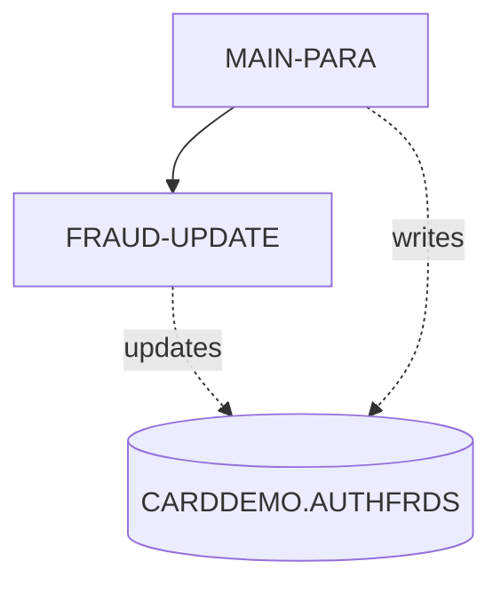
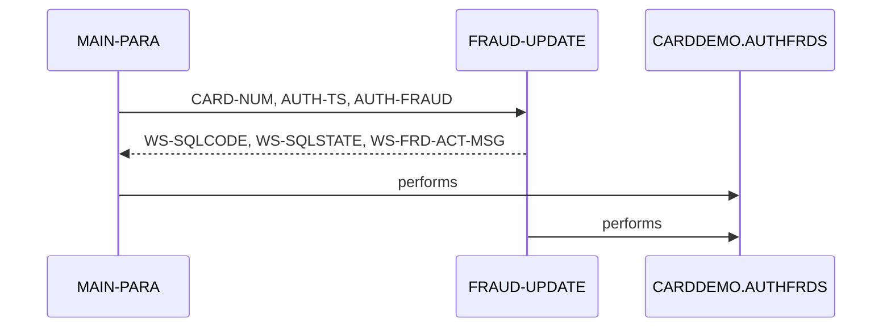

# COPAUS2C

**File**: `cbl/COPAUS2C.cbl`
**Type**: COBOL
**Analyzed**: 2026-02-10 17:18:30.886877

## Purpose

This CICS COBOL program, COPAUS2C, marks an authorization message as fraudulent by inserting a record into the CARDDEMO.AUTHFRDS table. If a record already exists, it updates the existing record to mark it as fraudulent.

**Business Context**: This program is part of the CardDemo application's authorization module and is used to report fraudulent transactions.

## Inputs

| Name | Type | Description |
|------|------|-------------|
| DFHCOMMAREA | CICS_COMMAREA | The CICS communication area containing the account ID (WS-ACCT-ID), customer ID (WS-CUST-ID), and the fraud authorization record (WS-FRAUD-AUTH-RECORD) which includes the CIPAUDTY copybook. It also contains the fraud status record (WS-FRAUD-STATUS-RECORD) indicating the action to take (report or remove fraud). |

## Outputs

| Name | Type | Description |
|------|------|-------------|
| CARDDEMO.AUTHFRDS | DB2_TABLE | This table stores authorization details and fraud status. The program inserts a new record or updates an existing record with fraud information. |
| WS-FRD-ACT-MSG | CICS_COMMAREA | A message indicating the success or failure of the fraud update, returned in the DFHCOMMAREA. |

## Business Rules

- **BR001**: If a record with the same card number and timestamp already exists in the AUTHFRDS table, update the existing record instead of inserting a new one.

## Paragraphs/Procedures

### MAIN-PARA
This is the main paragraph of the COPAUS2C program. Its primary purpose is to insert or update a record in the CARDDEMO.AUTHFRDS table to mark a transaction as fraudulent. It begins by obtaining the current date and time using CICS ASKTIME and FORMATTIME commands (lines 91-100), storing the formatted date in WS-CUR-DATE and moving it to PA-FRAUD-RPT-DATE. It then transforms the input authorization date and time from the communication area into usable formats (lines 103-111). The paragraph moves data from the input COMMAREA (DFHCOMMAREA) to corresponding fields required for the SQL INSERT statement (lines 113-139). It then executes an SQL INSERT statement to add a new record to the CARDDEMO.AUTHFRDS table (lines 141-198). If the INSERT is successful (SQLCODE = ZERO), it sets WS-FRD-UPDT-SUCCESS to TRUE and moves 'ADD SUCCESS' to WS-FRD-ACT-MSG. If the INSERT fails with a duplicate key error (SQLCODE = -803), it calls the FRAUD-UPDATE paragraph to update the existing record. If any other SQL error occurs, it sets WS-FRD-UPDT-FAILED to TRUE, moves the SQLCODE and SQLSTATE to working storage, and constructs an error message in WS-FRD-ACT-MSG. Finally, it returns control to CICS using EXEC CICS RETURN (lines 218-219).

### FRAUD-UPDATE
This paragraph is called when the initial INSERT statement in MAIN-PARA fails due to a duplicate key error, indicating that a record with the same card number and timestamp already exists in the CARDDEMO.AUTHFRDS table. Its primary purpose is to update the existing record to mark it as fraudulent. It executes an SQL UPDATE statement (lines 222-229) to set the AUTH_FRAUD and FRAUD_RPT_DATE columns for the matching record. The WHERE clause uses the CARD_NUM and AUTH_TS to identify the correct record. If the UPDATE is successful (SQLCODE = ZERO), it sets WS-FRD-UPDT-SUCCESS to TRUE and moves 'UPDT SUCCESS' to WS-FRD-ACT-MSG. If the UPDATE fails, it sets WS-FRD-UPDT-FAILED to TRUE, moves the SQLCODE and SQLSTATE to working storage, and constructs an error message in WS-FRD-ACT-MSG. The paragraph consumes the same input data as the MAIN-PARA, specifically CARD-NUM and AUTH-TS, to identify the record to be updated. The output of this paragraph is the updated record in the CARDDEMO.AUTHFRDS table and a status message in WS-FRD-ACT-MSG. No other paragraphs or programs are called from this paragraph.

## Control Flow

## Open Questions

- ? What is the structure of the CIPAUDTY copybook?
  - Context: The copybook is used in the LINKAGE SECTION but its contents are not available.
- ? What is the purpose of the DFHBMSCA copybook?
  - Context: The copybook is included but not explicitly used in the code. It might be a remnant from a previous version or included for potential future use.

## Sequence Diagram

