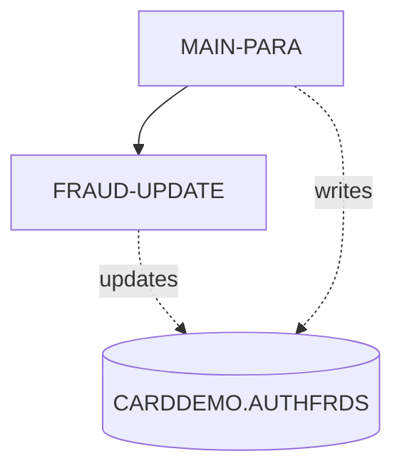
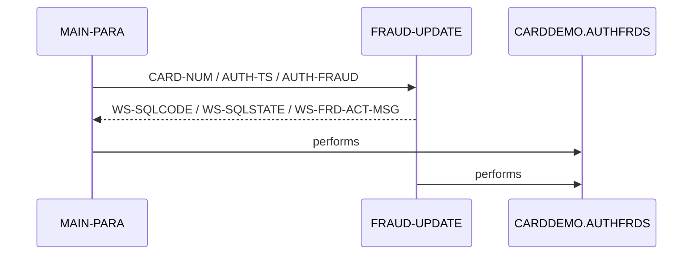

# COPAUS2C

**File**: `cbl/COPAUS2C.cbl`
**Type**: COBOL
**Analyzed**: 2026-02-24 17:37:50.673985

## Purpose

COPAUS2C is a CICS COBOL program that marks authorization messages as fraudulent by inserting or updating records in the CARDDEMO.AUTHFRDS table. It receives transaction details via the CICS COMMAREA, formats the data, and then performs an SQL INSERT or UPDATE operation.

**Business Context**: This program is part of an authorization module within the CardDemo application, likely used to flag suspicious transactions for further investigation.

## Inputs

| Name | Type | Description |
|------|------|-------------|
| DFHCOMMAREA | CICS_COMMAREA | CICS COMMAREA containing transaction details, account ID, customer ID, and fraud action. |
| CARDDEMO.AUTHFRDS | DB2_TABLE | Authorization fraud details table. |

## Outputs

| Name | Type | Description |
|------|------|-------------|
| CARDDEMO.AUTHFRDS | DB2_TABLE | Authorization fraud details table, updated with fraud information. |
| WS-FRD-ACT-MSG | CICS_COMMAREA | Message indicating the success or failure of the fraud update. |

## Business Rules

- **BR001**: If a record with the same card number and timestamp already exists in the AUTHFRDS table, update the existing record instead of inserting a new one.

## Paragraphs/Procedures

### MAIN-PARA
> [Source: MAIN-PARA.cbl.md](COPAUS2C.cbl.d/MAIN-PARA.cbl.md)
The MAIN-PARA paragraph is the primary control flow for the COPAUS2C program. It begins by retrieving the current date and time using CICS ASKTIME and FORMATTIME commands, storing the current date in WS-CUR-DATE and then moving it to PA-FRAUD-RPT-DATE. It then extracts the year, month, and day from PA-AUTH-ORIG-DATE and stores them in WS-AUTH-YY, WS-AUTH-MM, and WS-AUTH-DD, respectively. The authorization time is computed and formatted into WS-AUTH-TS. Subsequently, data from the COMMAREA (PA-*) and working storage (WS-FRD-ACTION, WS-ACCT-ID, WS-CUST-ID) are moved to corresponding fields for insertion into the CARDDEMO.AUTHFRDS table. An SQL INSERT statement is executed to add a new record to the AUTHFRDS table. If the insertion is successful (SQLCODE = ZERO), WS-FRD-UPDT-SUCCESS is set to TRUE, and a success message is moved to WS-FRD-ACT-MSG. If a duplicate record exists (SQLCODE = -803), the FRAUD-UPDATE paragraph is performed to update the existing record. If any other SQL error occurs, WS-FRD-UPDT-FAILED is set to TRUE, the SQLCODE and SQLSTATE are moved to WS-SQLCODE and WS-SQLSTATE, respectively, and an error message is constructed and moved to WS-FRD-ACT-MSG. Finally, the program returns to the calling CICS program using EXEC CICS RETURN.

### FRAUD-UPDATE
> [Source: FRAUD-UPDATE.cbl.md](COPAUS2C.cbl.d/FRAUD-UPDATE.cbl.md)
The FRAUD-UPDATE paragraph is executed when a duplicate record is found during the initial INSERT operation in MAIN-PARA. Its primary purpose is to update the existing record in the CARDDEMO.AUTHFRDS table with the fraud information. It constructs an SQL UPDATE statement to set the AUTH_FRAUD and FRAUD_RPT_DATE fields for the record matching the CARD_NUM and AUTH_TS from the input COMMAREA. If the update is successful (SQLCODE = ZERO), WS-FRD-UPDT-SUCCESS is set to TRUE, and a success message is moved to WS-FRD-ACT-MSG. If the update fails (SQLCODE is not ZERO), WS-FRD-UPDT-FAILED is set to TRUE, the SQLCODE and SQLSTATE are moved to WS-SQLCODE and WS-SQLSTATE, respectively, and an error message is constructed and moved to WS-FRD-ACT-MSG. This paragraph does not directly consume any input files or data other than the variables set in MAIN-PARA. It updates the CARDDEMO.AUTHFRDS table. The paragraph does not call any other paragraphs or programs. It handles SQL errors by setting flags and constructing error messages.

## Control Flow

## Open Questions

- ? What is the structure of the CIPAUDTY copybook?
  - Context: The CIPAUDTY copybook is used in the LINKAGE SECTION, but its contents are not available in the provided code. Knowing the structure is important to know what data is being passed into the program.

## Sequence Diagram

