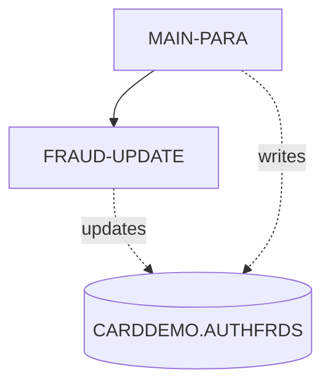

# COPAUS2C

**File**: `cbl/COPAUS2C.cbl`
**Type**: FileType.COBOL
**Analyzed**: 2026-01-27 23:04:57.421331

## Purpose

COPAUS2C is a CICS COBOL program that marks authorization messages as fraudulent by inserting or updating records in the CARDDEMO.AUTHFRDS table. It receives transaction details via the CICS COMMAREA, formats the data, and then performs the SQL INSERT or UPDATE operation.

**Business Context**: This program is part of the CardDemo application's authorization module, used to flag potentially fraudulent transactions.

## Inputs

| Name | Type | Description |
|------|------|-------------|
| DFHCOMMAREA | IOType.CICS_COMMAREA | CICS COMMAREA containing transaction details, account ID, customer ID, and fraud action. |
| CARDDEMO.AUTHFRDS | IOType.DB2_TABLE | DB2 table containing authorization details and fraud flags. |

## Outputs

| Name | Type | Description |
|------|------|-------------|
| CARDDEMO.AUTHFRDS | IOType.DB2_TABLE | Updated with fraud status for the transaction. |
| DFHCOMMAREA | IOType.CICS_COMMAREA | Updated with fraud update status and action message. |

## Business Rules

- **BR001**: If a record with the same card number and timestamp already exists, update the AUTH_FRAUD and FRAUD_RPT_DATE fields. Otherwise, insert a new record.

## Paragraphs/Procedures

### MAIN-PARA
The MAIN-PARA paragraph is the main control flow of the COPAUS2C program. It begins by retrieving the current date and time using CICS ASKTIME and FORMATTIME commands and storing them in WS-ABS-TIME and WS-CUR-DATE respectively. It then extracts the year, month, and day from the PA-AUTH-ORIG-DATE field in the COMMAREA and stores them in WS-AUTH-YY, WS-AUTH-MM and WS-AUTH-DD. Next, it computes the authorization time by subtracting PA-AUTH-TIME-9C from 999999999 and formats the time components into WS-AUTH-HH, WS-AUTH-MI, WS-AUTH-SS, and WS-AUTH-SSS. It moves data from the COMMAREA into host variables for the SQL INSERT statement. The program then executes an SQL INSERT statement to add a new record to the CARDDEMO.AUTHFRDS table, marking the authorization message as fraudulent. If the insert is successful (SQLCODE = ZERO), it sets WS-FRD-UPDT-SUCCESS to TRUE and moves 'ADD SUCCESS' to WS-FRD-ACT-MSG. If a duplicate key error occurs (SQLCODE = -803), it calls the FRAUD-UPDATE paragraph to update the existing record. If any other SQL error occurs, it sets WS-FRD-UPDT-FAILED to TRUE and constructs an error message in WS-FRD-ACT-MSG. Finally, it returns control to CICS.

### FRAUD-UPDATE
The FRAUD-UPDATE paragraph is called when an attempt to insert a new fraud record fails due to a duplicate key (SQLCODE = -803). This paragraph updates the existing record in the CARDDEMO.AUTHFRDS table with the fraud information. It executes an SQL UPDATE statement, setting the AUTH_FRAUD and FRAUD_RPT_DATE fields for the record matching the CARD_NUM and AUTH_TS. If the update is successful (SQLCODE = ZERO), it sets WS-FRD-UPDT-SUCCESS to TRUE and moves 'UPDT SUCCESS' to WS-FRD-ACT-MSG. If the update fails (SQLCODE is not ZERO), it sets WS-FRD-UPDT-FAILED to TRUE and constructs an error message in WS-FRD-ACT-MSG, including the SQLCODE and SQLSTATE. This paragraph consumes the host variables populated in MAIN-PARA, specifically CARD-NUM, AUTH-TS, and AUTH-FRAUD. It updates the CARDDEMO.AUTHFRDS table and sets the WS-FRD-UPDT-SUCCESS flag in the COMMAREA. No other paragraphs or programs are called from this paragraph. The paragraph concludes by returning to the calling paragraph (MAIN-PARA).

## Control Flow

