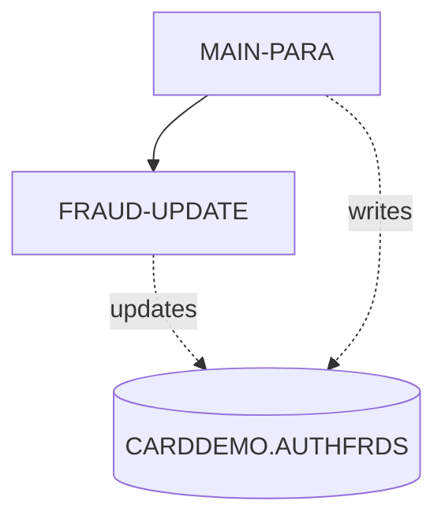
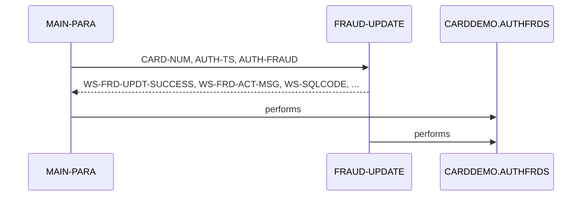

# COPAUS2C

**File**: `cbl/COPAUS2C.cbl`
**Type**: COBOL
**Analyzed**: 2026-02-09 15:46:49.408007

## Purpose

This CICS COBOL program, COPAUS2C, marks authorization messages as fraudulent in the CARDDEMO.AUTHFRDS DB2 table. It receives transaction details via the CICS COMMAREA, formats the data, and inserts a new record or updates an existing one if a duplicate is found.

**Business Context**: This program is part of a card authorization system and is used to flag potentially fraudulent transactions for review.

## Inputs

| Name | Type | Description |
|------|------|-------------|
| DFHCOMMAREA | CICS_COMMAREA | Contains transaction details including account ID, customer ID, and fraud authorization record (CIPAUDTY). |
| CIPAUDTY | COPYBOOK | Copybook containing the fraud authorization record details. |

## Outputs

| Name | Type | Description |
|------|------|-------------|
| CARDDEMO.AUTHFRDS | DB2_TABLE | DB2 table where fraudulent authorization messages are stored. |

## Business Rules

- **BR001**: If a record with the same card number and timestamp already exists in the AUTHFRDS table, update the existing record instead of inserting a new one.

## Paragraphs/Procedures

### MAIN-PARA
The MAIN-PARA paragraph is the main control flow of the COPAUS2C program. Its primary purpose is to receive transaction data via the COMMAREA, format the data, and insert or update a record in the CARDDEMO.AUTHFRDS DB2 table to mark a transaction as potentially fraudulent. It first retrieves the current date and time using CICS ASKTIME and FORMATTIME commands and moves the current date to PA-FRAUD-RPT-DATE. It then extracts and formats the authorization date and time from the input COMMAREA. The paragraph moves data from the COMMAREA (PA- prefixed fields) and working storage (WS- prefixed fields) to the corresponding fields required for the DB2 INSERT statement. It then executes the SQL INSERT statement to add a new record to the AUTHFRDS table. If the insert is successful (SQLCODE = 0), it sets WS-FRD-UPDT-SUCCESS to TRUE and moves 'ADD SUCCESS' to WS-FRD-ACT-MSG. If a duplicate record is found (SQLCODE = -803), it calls the FRAUD-UPDATE paragraph to update the existing record. If any other SQL error occurs, it sets WS-FRD-UPDT-FAILED to TRUE, moves the SQLCODE and SQLSTATE to working storage, and constructs an error message in WS-FRD-ACT-MSG. Finally, it returns control to CICS using EXEC CICS RETURN.

### FRAUD-UPDATE
The FRAUD-UPDATE paragraph is called when a duplicate record is found during the initial INSERT operation in MAIN-PARA. Its purpose is to update the existing record in the CARDDEMO.AUTHFRDS table with the fraud indicator and current date. It constructs an SQL UPDATE statement to set the AUTH_FRAUD and FRAUD_RPT_DATE columns for the record matching the CARD_NUM and AUTH_TS from the input COMMAREA. After executing the UPDATE statement, it checks the SQLCODE. If the update is successful (SQLCODE = 0), it sets WS-FRD-UPDT-SUCCESS to TRUE and moves 'UPDT SUCCESS' to WS-FRD-ACT-MSG. If the update fails (SQLCODE is not 0), it sets WS-FRD-UPDT-FAILED to TRUE, moves the SQLCODE and SQLSTATE to working storage, and constructs an error message in WS-FRD-ACT-MSG. This paragraph consumes the CARD_NUM and AUTH_TS from the COMMAREA to identify the record to be updated and writes the AUTH_FRAUD and FRAUD_RPT_DATE to the CARDDEMO.AUTHFRDS table. This paragraph is only called from MAIN-PARA when a duplicate record is found and does not call any other paragraphs.

## Control Flow

## Sequence Diagram

