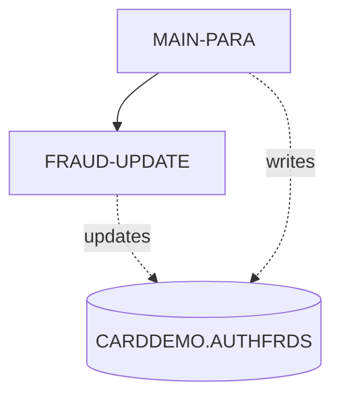
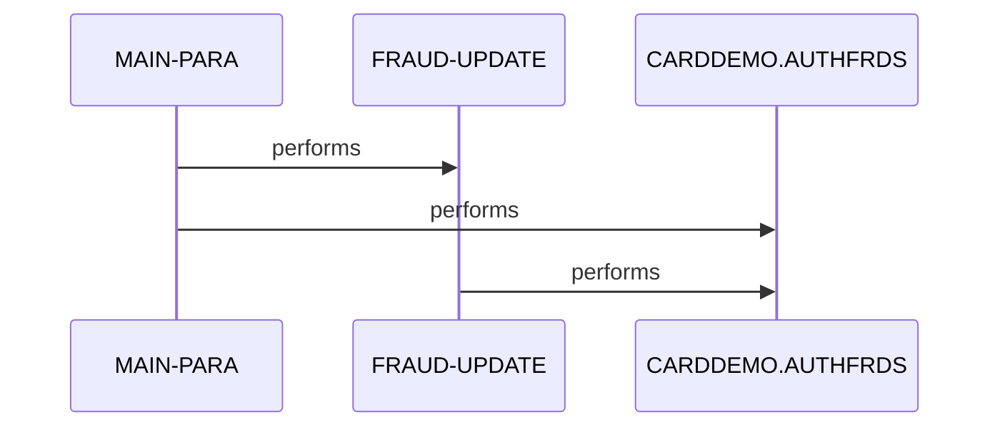

# COPAUS2C

**File**: `cbl/COPAUS2C.cbl`
**Type**: FileType.COBOL
**Analyzed**: 2026-02-24 04:00:46.162862

## Purpose

COPAUS2C is a CICS COBOL program in the CardDemo authorization module that marks an authorization message as fraud by inserting a new record into the DB2 AUTHFRDS table or updating an existing one if a duplicate key error occurs. It receives input via CICS COMMAREA including account ID, customer ID, authorization details from CIPAUDTY copybook, and fraud action flag. Upon success or handling duplicates, it updates status fields in COMMAREA and returns to CICS.

**Business Context**: Card authorization fraud reporting and management in a payment processing demo application

## Inputs

| Name | Type | Description |
|------|------|-------------|
| DFHCOMMAREA | IOType.CICS_COMMAREA | Contains WS-ACCT-ID, WS-CUST-ID, WS-FRAUD-AUTH-RECORD (authorization details via CIPAUDTY copybook), and WS-FRAUD-STATUS-RECORD (action flag 'F' for fraud or 'R' for remove, update status, and message) |

## Outputs

| Name | Type | Description |
|------|------|-------------|
| DFHCOMMAREA | IOType.CICS_COMMAREA | Updated with WS-FRD-UPDT-STATUS ('S' success or 'F' failed) and WS-FRD-ACT-MSG containing success/error details before CICS RETURN |
| CARDDEMO.AUTHFRDS | IOType.DB2_TABLE | Fraud authorization records storing card details, auth timestamp, fraud flag, report date, acct/cust IDs |

## Business Rules

- **BR001**: Insert new fraud authorization record into AUTHFRDS using input COMMAREA data and current fraud action flag
- **BR002**: If INSERT fails with duplicate key error (SQLCODE -803), update existing AUTHFRDS record with fraud flag and current report date
- **BR003**: Set success status and message on SQLCODE ZERO for INSERT or UPDATE, else set failed and build error message from SQLCODE/SQLSTATE
- **BR004**: Set AUTH_FRAUD field to WS-FRD-ACTION value ('F' report fraud or 'R' remove fraud) unconditionally for both INSERT and UPDATE

## Paragraphs/Procedures

### MAIN-PARA
> [Source: MAIN-PARA.cbl.md](COPAUS2C.cbl.d/MAIN-PARA.cbl.md)
MAIN-PARA serves as the primary entry point and orchestration paragraph for the entire program flow in this CICS transaction. It begins by invoking CICS ASKTIME to get absolute time and FORMATTIME to format the current date into WS-CUR-DATE, which is moved to PA-FRAUD-RPT-DATE for use in SQL. It consumes input data from LINKAGE DFHCOMMAREA, specifically parsing PA-AUTH-ORIG-DATE into date components and computing/formatting WS-AUTH-TIME from PA-AUTH-TIME-9C by subtracting from 999999999 to create a timestamp string WS-AUTH-TS. It then reads numerous PA- fields from the CIPAUDTY copybook structure (e.g., PA-CARD-NUM, PA-AUTH-TYPE, PA-TRANSACTION-AMT) and WS-ACCT-ID/WS-CUST-ID/WS-FRD-ACTION, moving them directly to SQL host variables defined by AUTHFRDS include. The core business logic performs an SQL INSERT into CARDDEMO.AUTHFRDS populating all authorization details, fraud flag from WS-FRD-ACTION, current date for FRAUD_RPT_DATE, and acct/cust IDs; if SQLCODE=0, sets success status/message in COMMAREA; if SQLCODE=-803 (duplicate), PERFORMs FRAUD-UPDATE paragraph; otherwise, builds error message from SQLCODE/SQLSTATE and sets failed status. No explicit file I/O errors beyond SQL are handled here, but SQL error handling decides flow. After processing, it EXEC CICS RETURN to end the transaction, passing updated status back via COMMAREA. This paragraph implements the fraud marking logic idempotently via insert-or-update pattern. It calls FRAUD-UPDATE only on duplicate key to avoid overwriting if record exists.

### FRAUD-UPDATE
> [Source: FRAUD-UPDATE.cbl.md](COPAUS2C.cbl.d/FRAUD-UPDATE.cbl.md)
FRAUD-UPDATE is a subordinate paragraph invoked only from MAIN-PARA when INSERT fails with SQLCODE=-803 (duplicate key violation). Its primary purpose is to update the existing matching AUTHFRDS record rather than abending, ensuring idempotent fraud flag updates. It consumes host variables already populated in MAIN-PARA, specifically using CARD-NUM and AUTH-TS (formatted timestamp) as the WHERE key to precisely identify the record. It produces an UPDATE to CARDDEMO.AUTHFRDS setting AUTH_FRAUD to the input action flag ('F' or 'R') and FRAUD_RPT_DATE to CURRENT DATE. Business logic checks SQLCODE post-UPDATE: if ZERO, sets WS-FRD-UPDT-SUCCESS and 'UPDT SUCCESS' message; else, sets failed status and builds error string from SQLCODE/SQLSTATE into WS-FRD-ACT-MSG. Error handling mirrors MAIN-PARA by capturing SQL diagnostics but does not propagate further or abend; control returns to caller after status update. No additional paragraphs or programs are called from here. This implements the fallback for duplicate authorizations, maintaining data integrity in fraud reporting. The update ensures the fraud status and report date are refreshed even for existing records.

## Control Flow

## Sequence Diagram

