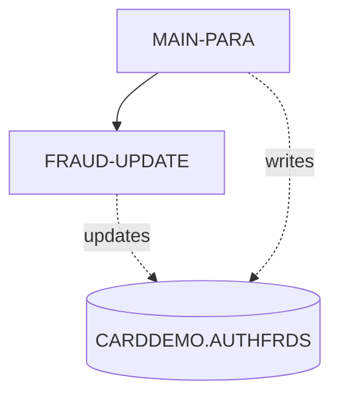
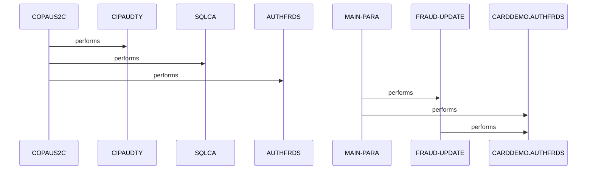

# COPAUS2C

**File**: `cbl/COPAUS2C.cbl`
**Type**: FileType.COBOL
**Analyzed**: 2026-02-25 15:20:46.974030

## Purpose

COPAUS2C is a CICS online program that processes authorization fraud data by formatting the current date and time, parsing authorization timestamps, moving input authorization details from the linkage section to a structured format, and inserting them into the CARDDEMO.AUTHFRDS DB2 table. If the insert fails due to a duplicate key (SQLCODE -803), it performs an update on the same table instead. Upon success or handling errors, it returns control to CICS.

**Business Context**: Supports fraud logging and updating for card authorization transactions in a payment processing system.

## Inputs

| Name | Type | Description |
|------|------|-------------|
| PA-RECORD | IOType.CICS_COMMAREA | Input authorization data including fraud report date, auth orig date, card number, auth time, auth type, card expiry, message type/source, auth codes, amounts, merchant details, transaction ID, and match status |

## Outputs

| Name | Type | Description |
|------|------|-------------|
| CARDDEMO.AUTHFRDS | IOType.DB2_TABLE | Fraud authorization details table storing card num, auth timestamp components, type, expiry, message info, auth responses, transaction details, merchant info, acct/cust IDs, and fraud action |

## Business Rules

- **BR001**: On successful INSERT (SQLCODE=0), set success flag and message; on duplicate key (SQLCODE=-803), perform UPDATE instead; on other errors, set failure flag and build error message

## Paragraphs/Procedures

### COPAUS2C
> [Source: COPAUS2C.cbl.md](COPAUS2C.cbl.d/COPAUS2C.cbl.md)
This is the program entry point paragraph, likely serving as the initial control point in the PROCEDURE DIVISION. It consumes no explicit inputs shown in the AST but sets up the environment by referencing or calling initialization elements. It produces control flow to subsequent paragraphs or external elements like CIPAUDTY for typing or setup, SQLCA for SQL handling, and AUTHFRDS context. No explicit business logic or decisions are detailed in the AST, but it orchestrates the start of fraud authorization processing. Error handling is not visible here, deferred to called paragraphs. It calls CIPAUDTY (possibly for audit typing), SQLCA initialization, and transitions to AUTHFRDS processing context, enabling the main fraud update logic.

### MAIN-PARA
> [Source: MAIN-PARA.cbl.md](COPAUS2C.cbl.d/MAIN-PARA.cbl.md)

```
MAIN-PARA  (51 statements, depth=3)
PARAGRAPH
├── EXEC_CICS: EXEC CICS ASKTIME NOHANDLE ABSTIME(WS-ABS-TIME) NOHANDLE END-EXEC
├── EXEC_CICS: EXEC CICS FORMATTIME ABSTIME(WS-ABS-TIME) MMDDYY(WS-CUR-DATE) DATESEP...
├── MOVE: MOVE WS-CUR-DATE       TO PA-FRAUD-RPT-DATE
├── MOVE: MOVE PA-AUTH-ORIG-DATE(1:2) TO WS-AUTH-YY
├── MOVE: MOVE PA-AUTH-ORIG-DATE(3:2) TO WS-AUTH-MM
├── MOVE: MOVE PA-AUTH-ORIG-DATE(5:2) TO WS-AUTH-DD
├── COMPUTE: COMPUTE WS-AUTH-TIME = 999999999 - PA-AUTH-TIME-9C
├── MOVE: MOVE WS-AUTH-TIME-AN(1:2) TO WS-AUTH-HH
├── MOVE: MOVE WS-AUTH-TIME-AN(3:2) TO WS-AUTH-MI
├── MOVE: MOVE WS-AUTH-TIME-AN(5:2) TO WS-AUTH-SS
├── MOVE: MOVE WS-AUTH-TIME-AN(7:3) TO WS-AUTH-SSS
├── MOVE: MOVE PA-CARD-NUM          TO CARD-NUM
├── MOVE: MOVE WS-AUTH-TS           TO AUTH-TS
├── MOVE: MOVE PA-AUTH-TYPE         TO AUTH-TYPE
├── MOVE: MOVE PA-CARD-EXPIRY-DATE  TO CARD-EXPIRY-DATE
├── MOVE: MOVE PA-MESSAGE-TYPE      TO MESSAGE-TYPE
├── MOVE: MOVE PA-MESSAGE-SOURCE    TO MESSAGE-SOURCE
├── MOVE: MOVE PA-AUTH-ID-CODE      TO AUTH-ID-CODE
├── MOVE: MOVE PA-AUTH-RESP-CODE    TO AUTH-RESP-CODE
├── MOVE: MOVE PA-AUTH-RESP-REASON  TO AUTH-RESP-REASON
├── MOVE: MOVE PA-PROCESSING-CODE   TO PROCESSING-CODE
├── MOVE: MOVE PA-TRANSACTION-AMT   TO TRANSACTION-AMT
├── MOVE: MOVE PA-APPROVED-AMT      TO APPROVED-AMT
├── MOVE: MOVE PA-MERCHANT-CATAGORY-CODE TO MERCHANT-CATAGORY-CODE
├── MOVE: MOVE PA-ACQR-COUNTRY-CODE TO ACQR-COUNTRY-CODE
├── MOVE: MOVE PA-POS-ENTRY-MODE    TO POS-ENTRY-MODE
├── MOVE: MOVE PA-MERCHANT-ID       TO MERCHANT-ID
├── MOVE: MOVE LENGTH OF PA-MERCHANT-NAME TO MERCHANT-NAME-LEN
├── MOVE: MOVE PA-MERCHANT-NAME     TO MERCHANT-NAME-TEXT
├── MOVE: MOVE PA-MERCHANT-CITY     TO MERCHANT-CITY
├── MOVE: MOVE PA-MERCHANT-STATE    TO MERCHANT-STATE
├── MOVE: MOVE PA-MERCHANT-ZIP      TO MERCHANT-ZIP
├── MOVE: MOVE PA-TRANSACTION-ID    TO TRANSACTION-ID
├── MOVE: MOVE PA-MATCH-STATUS      TO MATCH-STATUS
├── MOVE: MOVE WS-FRD-ACTION        TO AUTH-FRAUD
├── MOVE: MOVE WS-ACCT-ID           TO ACCT-ID
├── MOVE: MOVE WS-CUST-ID           TO CUST-ID
├── EXEC_SQL: EXEC SQL INSERT INTO CARDDEMO.AUTHFRDS (CARD_NUM ,AUTH_TS ,AUTH_TYPE ...
├── IF: IF SQLCODE = ZERO
│   ├── SET: SET WS-FRD-UPDT-SUCCESS TO TRUE
│   ├── MOVE: MOVE 'ADD SUCCESS'      TO WS-FRD-ACT-MSG
│   └── ELSE: ELSE
│       └── IF: IF SQLCODE = -803
│           ├── PERFORM: PERFORM FRAUD-UPDATE
│           └── ELSE: ELSE
│               ├── SET: SET WS-FRD-UPDT-FAILED  TO TRUE
│               ├── MOVE: MOVE SQLCODE            TO WS-SQLCODE
│               ├── MOVE: MOVE SQLSTATE           TO WS-SQLSTATE
│               └── STRING: STRING ' SYSTEM ERROR DB2: CODE:' WS-SQLCODE ', STATE: ' WS-SQLSTATE ...
├── EXEC_CICS: EXEC CICS RETURN END-EXEC
└── UNKNOWN
```
This is the primary orchestration paragraph handling the core fraud authorization logging logic in the program flow. It consumes CICS absolute time via ASKTIME and input linkage fields like PA-FRAUD-RPT-DATE, PA-AUTH-ORIG-DATE, PA-CARD-NUM, and numerous other PA- authorization details. It produces formatted WS-CUR-DATE, parsed WS-AUTH-YY/MM/DD/HH/MI/SS/SSS from date/time computations, structured output fields like CARD-NUM and AUTH-TS, and ultimately inserts a record into CARDDEMO.AUTHFRDS. Business logic includes time adjustment via COMPUTE WS-AUTH-TIME = 999999999 - PA-AUTH-TIME-9C (line 107), substring extractions for timestamp components, and numerous MOVE operations to prepare INSERT data; it checks SQLCODE post-INSERT: success sets WS-FRD-UPDT-SUCCESS and 'ADD SUCCESS' message; duplicate (-803) triggers PERFORM FRAUD-UPDATE; other errors set WS-FRD-UPDT-FAILED, capture SQLCODE/SQLSTATE, and STRING error message into WS-FRD-ACT-MSG. Error handling uses sqlcode_check logic (lines 199, 203) for recovery or failure logging without abend. It performs FRAUD-UPDATE for duplicate handling and ends with CICS RETURN to release control.

### FRAUD-UPDATE
> [Source: FRAUD-UPDATE.cbl.md](COPAUS2C.cbl.d/FRAUD-UPDATE.cbl.md)

```
FRAUD-UPDATE  (9 statements, depth=1)
PARAGRAPH
├── EXEC_SQL: EXEC SQL UPDATE CARDDEMO.AUTHFRDS SET   AUTH_FRAUD     = :AUTH-FRAUD,...
└── IF: IF SQLCODE = ZERO
    ├── SET: SET WS-FRD-UPDT-SUCCESS TO TRUE
    ├── MOVE: MOVE 'UPDT SUCCESS'     TO WS-FRD-ACT-MSG
    └── ELSE: ELSE
        ├── SET: SET WS-FRD-UPDT-FAILED  TO TRUE
        ├── MOVE: MOVE SQLCODE            TO WS-SQLCODE
        ├── MOVE: MOVE SQLSTATE           TO WS-SQLSTATE
        └── STRING: STRING ' UPDT ERROR DB2: CODE:' WS-SQLCODE ', STATE: ' WS-SQLSTATE   ...
```
This paragraph serves as an error recovery routine specifically for duplicate key violations during the initial INSERT, performing an UPDATE on CARDDEMO.AUTHFRDS to set AUTH_FRAUD and other fields from prepared working storage variables. It consumes the pre-moved fields like AUTH-FRAUD (from WS-FRD-ACTION), ACCT-ID, CUST-ID, and prior INSERT targets now used in SET clauses. It produces an updated record in the AUTHFRDS table and status messages in WS-FRD-ACT-MSG. Business logic executes an UPDATE SQL statement targeting the existing record based on CARD_NUM and AUTH_TS, then checks SQLCODE: zero sets WS-FRD-UPDT-SUCCESS and 'UPDT SUCCESS'; non-zero sets WS-FRD-UPDT-FAILED, captures SQLCODE/SQLSTATE, and STRINGs error into WS-FRD-ACT-MSG (sqlcode_check at line 230). Error handling mirrors MAIN-PARA with failure logging but no further recovery or abend shown. No subordinate calls are made; it returns control to the caller (MAIN-PARA post-duplicate detection).

## Control Flow



## Sequence Diagram


