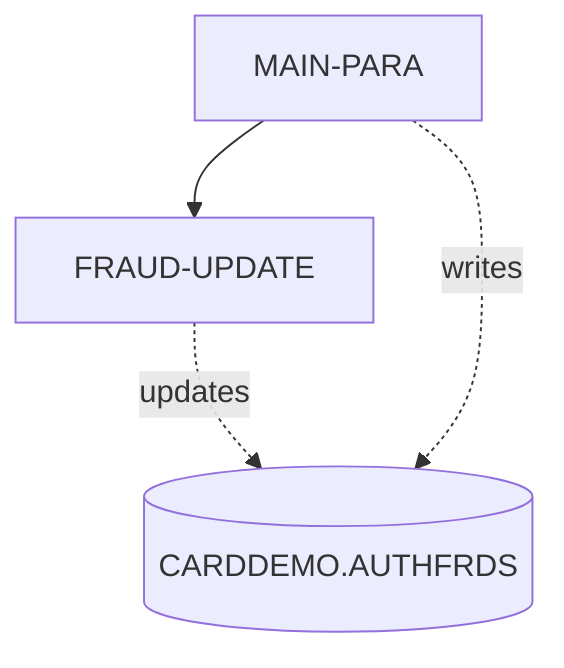
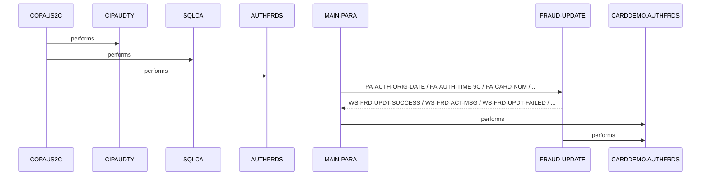

# COPAUS2C

**File**: `cbl/COPAUS2C.cbl`
**Type**: FileType.COBOL
**Analyzed**: 2026-03-03 16:46:36.163518

## Purpose

This COBOL program processes fraud reports and updates the CARDDEMO.AUTHFRDS table in a DB2 database. It inserts new records or updates existing ones based on the SQLCODE returned from the INSERT statement. The program is triggered by a CICS transaction.

**Business Context**: Fraud detection and reporting within a card authorization system.

## Inputs

| Name | Type | Description |
|------|------|-------------|
| PA-CARD-NUM | IOType.CICS_COMMAREA | Card number from the CICS COMMAREA. |
| PA-AUTH-ORIG-DATE | IOType.CICS_COMMAREA | Authorization original date from the CICS COMMAREA. |
| PA-AUTH-TIME-9C | IOType.CICS_COMMAREA | Authorization time from the CICS COMMAREA. |
| PA-AUTH-TYPE | IOType.CICS_COMMAREA | Authorization type from the CICS COMMAREA. |
| PA-CARD-EXPIRY-DATE | IOType.CICS_COMMAREA | Card expiry date from the CICS COMMAREA. |
| PA-MESSAGE-TYPE | IOType.CICS_COMMAREA | Message type from the CICS COMMAREA. |
| PA-MESSAGE-SOURCE | IOType.CICS_COMMAREA | Message source from the CICS COMMAREA. |
| PA-AUTH-ID-CODE | IOType.CICS_COMMAREA | Authorization ID code from the CICS COMMAREA. |
| PA-AUTH-RESP-CODE | IOType.CICS_COMMAREA | Authorization response code from the CICS COMMAREA. |
| PA-AUTH-RESP-REASON | IOType.CICS_COMMAREA | Authorization response reason from the CICS COMMAREA. |
| PA-PROCESSING-CODE | IOType.CICS_COMMAREA | Processing code from the CICS COMMAREA. |
| PA-TRANSACTION-AMT | IOType.CICS_COMMAREA | Transaction amount from the CICS COMMAREA. |
| PA-APPROVED-AMT | IOType.CICS_COMMAREA | Approved amount from the CICS COMMAREA. |
| PA-MERCHANT-CATAGORY-CODE | IOType.CICS_COMMAREA | Merchant category code from the CICS COMMAREA. |
| PA-ACQR-COUNTRY-CODE | IOType.CICS_COMMAREA | Acquirer country code from the CICS COMMAREA. |
| PA-POS-ENTRY-MODE | IOType.CICS_COMMAREA | POS entry mode from the CICS COMMAREA. |
| PA-MERCHANT-ID | IOType.CICS_COMMAREA | Merchant ID from the CICS COMMAREA. |
| PA-MERCHANT-NAME | IOType.CICS_COMMAREA | Merchant name from the CICS COMMAREA. |
| PA-MERCHANT-CITY | IOType.CICS_COMMAREA | Merchant city from the CICS COMMAREA. |
| PA-MERCHANT-STATE | IOType.CICS_COMMAREA | Merchant state from the CICS COMMAREA. |
| PA-MERCHANT-ZIP | IOType.CICS_COMMAREA | Merchant ZIP code from the CICS COMMAREA. |
| PA-TRANSACTION-ID | IOType.CICS_COMMAREA | Transaction ID from the CICS COMMAREA. |
| PA-MATCH-STATUS | IOType.CICS_COMMAREA | Match status from the CICS COMMAREA. |

## Outputs

| Name | Type | Description |
|------|------|-------------|
| CARDDEMO.AUTHFRDS | IOType.DB2_TABLE | Updated fraud information in the CARDDEMO.AUTHFRDS table. |
| CICS COMMAREA | IOType.CICS_COMMAREA | Updated COMMAREA with fraud action message. |

## Called Programs

| Program | Call Type | Purpose |
|---------|-----------|---------|
| CIPAUDTY | CallType.OTHER | UNKNOWN |

## Business Rules

- **BR001**: If the SQLCODE is zero after inserting a record into CARDDEMO.AUTHFRDS, the fraud update is considered successful.
- **BR002**: If the SQLCODE is -803 after inserting a record, it indicates a duplicate key, and the program attempts to update the existing record.
- **BR003**: If the SQLCODE is zero after updating a record in CARDDEMO.AUTHFRDS, the fraud update is considered successful.

## Paragraphs/Procedures

### COPAUS2C
> [Source: COPAUS2C.cbl.md](COPAUS2C.cbl.d/COPAUS2C.cbl.md)
This is the main program entry point. It doesn't contain any executable logic other than calling other programs or copybooks. It declares the program ID and includes necessary copybooks such as SQLCA for DB2 communication. The program also calls CIPAUDTY and AUTHFRDS, but their purpose cannot be determined from the provided code snippet.

### MAIN-PARA
> [Source: MAIN-PARA.cbl.md](COPAUS2C.cbl.d/MAIN-PARA.cbl.md)

```
MAIN-PARA  (49 statements, depth=5)
PARAGRAPH
├── EXEC_CICS: *>EXECCICS EXEC CICS ASKTIME NOHANDLE *>EXECCICS ABSTIME(WS-ABS-TIME)...
├── MOVE: MOVE WS-CUR-DATE TO PA-FRAUD-RPT-DATE
├── MOVE: MOVE PA-AUTH-ORIG-DATE(1:2) TO WS-AUTH-YY
├── MOVE: MOVE PA-AUTH-ORIG-DATE(3:2) TO WS-AUTH-MM
├── MOVE: MOVE PA-AUTH-ORIG-DATE(5:2) TO WS-AUTH-DD
├── COMPUTE: COMPUTE WS-AUTH-TIME = 999999999 - PA-AUTH-TIME-9C
├── MOVE: MOVE WS-AUTH-TIME-AN(1:2) TO WS-AUTH-HH
├── MOVE: MOVE WS-AUTH-TIME-AN(3:2) TO WS-AUTH-MI
├── MOVE: MOVE WS-AUTH-TIME-AN(5:2) TO WS-AUTH-SS
├── MOVE: MOVE WS-AUTH-TIME-AN(7:3) TO WS-AUTH-SSS
├── MOVE: MOVE PA-CARD-NUM TO CARD-NUM
├── MOVE: MOVE WS-AUTH-TS TO AUTH-TS
├── MOVE: MOVE PA-AUTH-TYPE TO AUTH-TYPE
├── MOVE: MOVE PA-CARD-EXPIRY-DATE TO CARD-EXPIRY-DATE
├── MOVE: MOVE PA-MESSAGE-TYPE TO MESSAGE-TYPE
├── MOVE: MOVE PA-MESSAGE-SOURCE TO MESSAGE-SOURCE
├── MOVE: MOVE PA-AUTH-ID-CODE TO AUTH-ID-CODE
├── MOVE: MOVE PA-AUTH-RESP-CODE TO AUTH-RESP-CODE
├── MOVE: MOVE PA-AUTH-RESP-REASON TO AUTH-RESP-REASON
├── MOVE: MOVE PA-PROCESSING-CODE TO PROCESSING-CODE
├── MOVE: MOVE PA-TRANSACTION-AMT TO TRANSACTION-AMT
├── MOVE: MOVE PA-APPROVED-AMT TO APPROVED-AMT
├── MOVE: MOVE PA-MERCHANT-CATAGORY-CODE TO MERCHANT-CATAGORY-CODE
├── MOVE: MOVE PA-ACQR-COUNTRY-CODE TO ACQR-COUNTRY-CODE
├── MOVE: MOVE PA-POS-ENTRY-MODE TO POS-ENTRY-MODE
├── MOVE: MOVE PA-MERCHANT-ID TO MERCHANT-ID
├── MOVE: MOVE LENGTH OF PA-MERCHANT-NAME TO MERCHANT-NAME-LEN
├── MOVE: MOVE PA-MERCHANT-NAME TO MERCHANT-NAME-TEXT
├── MOVE: MOVE PA-MERCHANT-CITY TO MERCHANT-CITY
├── MOVE: MOVE PA-MERCHANT-STATE TO MERCHANT-STATE
├── MOVE: MOVE PA-MERCHANT-ZIP TO MERCHANT-ZIP
├── MOVE: MOVE PA-TRANSACTION-ID TO TRANSACTION-ID
├── MOVE: MOVE PA-MATCH-STATUS TO MATCH-STATUS
├── MOVE: MOVE WS-FRD-ACTION TO AUTH-FRAUD
├── MOVE: MOVE WS-ACCT-ID TO ACCT-ID
├── MOVE: MOVE WS-CUST-ID TO CUST-ID
├── EXEC_SQL: *>EXECSQL EXEC SQL *>EXECSQL INSERT INTO CARDDEMO.AUTHFRDS *>EXECSQL ...
├── IF: IF SQLCODE = ZERO SET WS-FRD-UPDT-SUCCESS TO TRUE MOVE 'ADD SUCCESS' ...
│   ├── SET: SET WS-FRD-UPDT-SUCCESS TO TRUE
│   ├── MOVE: MOVE 'ADD SUCCESS' TO WS-FRD-ACT-MSG
│   └── ELSE: ELSE
│       └── IF: IF SQLCODE = -803 PERFORM FRAUD-UPDATE ELSE SET WS-FRD-UPDT-FAILED TO...
│           ├── PERFORM: PERFORM FRAUD-UPDATE
│           └── ELSE: ELSE
│               ├── SET: SET WS-FRD-UPDT-FAILED TO TRUE
│               ├── MOVE: MOVE SQLCODE TO WS-SQLCODE
│               ├── MOVE: MOVE SQLSTATE TO WS-SQLSTATE
│               └── STRING: STRING ' SYSTEM ERROR DB2: CODE:' WS-SQLCODE ', STATE: ' WS-SQLSTATE ...
└── EXEC_CICS: *>EXECCICS EXEC CICS RETURN *>EXECCICS END-EXEC }
```
This paragraph is the main processing logic of the program. It first retrieves the current date using EXEC CICS ASKTIME and moves it to PA-FRAUD-RPT-DATE. It then extracts year, month, and day from PA-AUTH-ORIG-DATE and calculates WS-AUTH-TIME by subtracting PA-AUTH-TIME-9C from 999999999. The calculated time is then split into hours, minutes, seconds, and milliseconds. After preparing the data, it moves data from the CICS COMMAREA (PA-*) to corresponding fields for insertion into the CARDDEMO.AUTHFRDS table. It then executes an SQL INSERT statement to add a new record to the CARDDEMO.AUTHFRDS table. If the insert is successful (SQLCODE = 0), it sets WS-FRD-UPDT-SUCCESS to TRUE and moves 'ADD SUCCESS' to WS-FRD-ACT-MSG. If a duplicate key error occurs (SQLCODE = -803), it performs the FRAUD-UPDATE paragraph to update the existing record. If any other SQL error occurs, it sets WS-FRD-UPDT-FAILED to TRUE, moves the SQLCODE and SQLSTATE to WS-SQLCODE and WS-SQLSTATE respectively, and constructs an error message. Finally, it returns control to CICS.

### FRAUD-UPDATE
> [Source: FRAUD-UPDATE.cbl.md](COPAUS2C.cbl.d/FRAUD-UPDATE.cbl.md)

```
FRAUD-UPDATE  (9 statements, depth=3)
PARAGRAPH
├── EXEC_SQL: *>EXECSQL EXEC SQL *>EXECSQL UPDATE CARDDEMO.AUTHFRDS *>EXECSQL SET A...
└── IF: IF SQLCODE = ZERO SET WS-FRD-UPDT-SUCCESS TO TRUE MOVE 'UPDT SUCCESS'...
    ├── SET: SET WS-FRD-UPDT-SUCCESS TO TRUE
    ├── MOVE: MOVE 'UPDT SUCCESS' TO WS-FRD-ACT-MSG
    └── ELSE: ELSE
        ├── SET: SET WS-FRD-UPDT-FAILED TO TRUE
        ├── MOVE: MOVE SQLCODE TO WS-SQLCODE
        ├── MOVE: MOVE SQLSTATE TO WS-SQLSTATE
        └── STRING: STRING ' UPDT ERROR DB2: CODE:' WS-SQLCODE ', STATE: ' WS-SQLSTATE DE...
```
This paragraph handles the update of an existing record in the CARDDEMO.AUTHFRDS table. It executes an SQL UPDATE statement to set AUTH-FRAUD, ACCT-ID, and CUST-ID based on WS-FRD-ACTION, WS-ACCT-ID, and WS-CUST-ID respectively, where the CARD-NUM and AUTH-TS match. If the update is successful (SQLCODE = 0), it sets WS-FRD-UPDT-SUCCESS to TRUE and moves 'UPDT SUCCESS' to WS-FRD-ACT-MSG. If any SQL error occurs, it sets WS-FRD-UPDT-FAILED to TRUE, moves the SQLCODE and SQLSTATE to WS-SQLCODE and WS-SQLSTATE respectively, and constructs an error message. The paragraph updates the CARDDEMO.AUTHFRDS table and potentially modifies the WS-FRD-ACT-MSG based on the success of the update.

## Dead Code

The following artifacts were identified as dead code by static analysis:

| Artifact | Type | Line | Reason |
|----------|------|------|--------|
| exec-001 | function | 91 | Function 'exec-001' is never called by any other artifact |
| exec-002 | function | 95 | Function 'exec-002' is never called by any other artifact |
| exec-003 | function | 141 | Function 'exec-003' is never called by any other artifact |
| exec-004 | function | 218 | Function 'exec-004' is never called by any other artifact |
| exec-005 | function | 222 | Function 'exec-005' is never called by any other artifact |
| DFHCOMMAREA | record_layout | 74 | Record layout 'DFHCOMMAREA' is never used by any program |
| WS-VARIABLES | record_layout | 32 | Record layout 'WS-VARIABLES' is never used by any program |

## Control Flow


```mermaid
flowchart TD
    %% Title: COPAUS2C.cbl
    FRAUD_UPDATE["FRAUD-UPDATE"]
    CARDDEMO_AUTHFRDS__ext[("CARDDEMO.AUTHFRDS")]
    MAIN_PARA["MAIN-PARA"]
    FRAUD_UPDATE -.->|updates| CARDDEMO_AUTHFRDS__ext
    MAIN_PARA --> FRAUD_UPDATE
    MAIN_PARA -.->|writes| CARDDEMO_AUTHFRDS__ext
```

## Open Questions

- ? What is the purpose of CIPAUDTY program?
  - Context: The code only shows that CIPAUDTY is called, but its function is unclear.
- ? What is the purpose of AUTHFRDS program?
  - Context: The code only shows that AUTHFRDS is called, but its function is unclear.
- ? What is the structure of the CICS COMMAREA?
  - Context: The code uses PA-* fields, but the structure of the COMMAREA is not defined in the provided code.

## Sequence Diagram


```mermaid
sequenceDiagram
    participant COPAUS2C as COPAUS2C
    participant CIPAUDTY as CIPAUDTY
    participant SQLCA as SQLCA
    participant AUTHFRDS as AUTHFRDS
    participant MAIN_PARA as MAIN-PARA
    participant FRAUD_UPDATE as FRAUD-UPDATE
    participant CARDDEMO_AUTHFRDS as CARDDEMO.AUTHFRDS
    COPAUS2C->>CIPAUDTY: performs
    COPAUS2C->>SQLCA: performs
    COPAUS2C->>AUTHFRDS: performs
    MAIN_PARA->>FRAUD_UPDATE: PA-AUTH-ORIG-DATE / PA-AUTH-TIME-9C / PA-CARD-NUM / ...
    FRAUD_UPDATE-->>MAIN_PARA: WS-FRD-UPDT-SUCCESS / WS-FRD-ACT-MSG / WS-FRD-UPDT-FAILED / ...
    MAIN_PARA->>CARDDEMO_AUTHFRDS: performs
    FRAUD_UPDATE->>CARDDEMO_AUTHFRDS: performs
```
