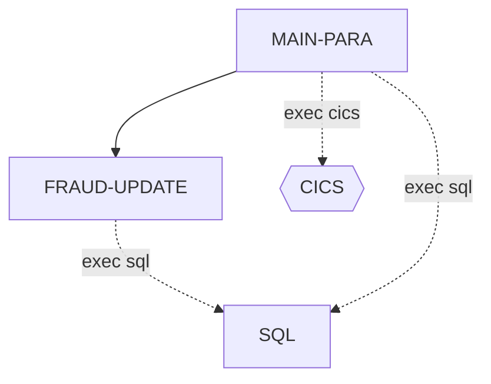

# COPAUS2C

**File**: `cbl/COPAUS2C.cbl`
**Type**: FileType.COBOL
**Analyzed**: 2026-04-21 13:42:54.531258

## Purpose

The COPAUS2C program is a CICS COBOL DB2 program that marks authorization messages as fraudulent in the CARDDEMO.AUTHFRDS table. It receives authorization data via the CICS COMMAREA, inserts a new record into the AUTHFRDS table, and updates the record if it already exists.

**Business Context**: This program is part of the CardDemo application and is used to report or remove fraud flags from authorization records.

## Inputs

| Name | Type | Description |
|------|------|-------------|
| DFHCOMMAREA | IOType.CICS_COMMAREA | CICS COMMAREA containing account ID, customer ID, and fraud authorization record data. |
| CARDDEMO.AUTHFRDS | IOType.DB2_TABLE | DB2 table containing authorization and fraud data. |

## Outputs

| Name | Type | Description |
|------|------|-------------|
| CARDDEMO.AUTHFRDS | IOType.DB2_TABLE | The AUTH_FRAUD column in the CARDDEMO.AUTHFRDS table is updated to indicate a fraudulent transaction, or a new record is inserted. |
| WS-FRD-ACT-MSG | IOType.CICS_COMMAREA | Message indicating the success or failure of the fraud update. |

## Business Rules

- **BR001**: If a record with the same CARD_NUM and AUTH_TS already exists in the AUTHFRDS table, update the AUTH_FRAUD and FRAUD_RPT_DATE columns.
- **BR002**: If a record with the same CARD_NUM and AUTH_TS does not exist in the AUTHFRDS table, insert a new record with the provided authorization and fraud data.

## Paragraphs/Procedures

### COPAUS2C
This paragraph is the program identifier. It does not contain any executable code and serves only to identify the program.

### MAIN-PARA
> [Source: MAIN-PARA.cbl.md](COPAUS2C.cbl.d/MAIN-PARA.cbl.md)

```
MAIN-PARA  (51 statements, depth=5)
PARAGRAPH
├── EXEC_CICS: EXEC CICS ASKTIME NOHANDLE ABSTIME(WS-ABS-TIME) NOHANDLE END-EXEC
├── EXEC_CICS: EXEC CICS FORMATTIME ABSTIME(WS-ABS-TIME) MMDDYY(WS-CUR-DATE) DATESEP NOHANDLE END-EXEC
├── MOVE: MOVE WS-CUR-DATE       TO PA-FRAUD-RPT-DATE
├── MOVE: MOVE PA-AUTH-ORIG-DATE(1:2) TO WS-AUTH-YY
├── MOVE: MOVE PA-AUTH-ORIG-DATE(3:2) TO WS-AUTH-MM
├── MOVE: MOVE PA-AUTH-ORIG-DATE(5:2) TO WS-AUTH-DD
├── COMPUTE: COMPUTE WS-AUTH-TIME = 999999999 - PA-AUTH-TIME-9C
├── MOVE: MOVE WS-AUTH-TIME-AN(1:2) TO WS-AUTH-HH
├── MOVE: MOVE WS-AUTH-TIME-AN(3:2) TO WS-AUTH-MI
├── MOVE: MOVE WS-AUTH-TIME-AN(5:2) TO WS-AUTH-SS
├── MOVE: MOVE WS-AUTH-TIME-AN(7:3) TO WS-AUTH-SSS
├── MOVE: MOVE PA-CARD-NUM          TO CARD-NUM
├── MOVE: MOVE WS-AUTH-TS           TO AUTH-TS
├── MOVE: MOVE PA-AUTH-TYPE         TO AUTH-TYPE
├── MOVE: MOVE PA-CARD-EXPIRY-DATE  TO CARD-EXPIRY-DATE
├── MOVE: MOVE PA-MESSAGE-TYPE      TO MESSAGE-TYPE
├── MOVE: MOVE PA-MESSAGE-SOURCE    TO MESSAGE-SOURCE
├── MOVE: MOVE PA-AUTH-ID-CODE      TO AUTH-ID-CODE
├── MOVE: MOVE PA-AUTH-RESP-CODE    TO AUTH-RESP-CODE
├── MOVE: MOVE PA-AUTH-RESP-REASON  TO AUTH-RESP-REASON
├── MOVE: MOVE PA-PROCESSING-CODE   TO PROCESSING-CODE
├── MOVE: MOVE PA-TRANSACTION-AMT   TO TRANSACTION-AMT
├── MOVE: MOVE PA-APPROVED-AMT      TO APPROVED-AMT
├── MOVE: MOVE PA-MERCHANT-CATAGORY-CODE
TO MERCHANT-CATAGORY-CODE
├── MOVE: MOVE PA-ACQR-COUNTRY-CODE TO ACQR-COUNTRY-CODE
├── MOVE: MOVE PA-POS-ENTRY-MODE    TO POS-ENTRY-MODE
├── MOVE: MOVE PA-MERCHANT-ID       TO MERCHANT-ID
├── MOVE: MOVE LENGTH OF PA-MERCHANT-NAME TO MERCHANT-NAME-LEN
├── MOVE: MOVE PA-MERCHANT-NAME     TO MERCHANT-NAME-TEXT
├── MOVE: MOVE PA-MERCHANT-CITY     TO MERCHANT-CITY
├── MOVE: MOVE PA-MERCHANT-STATE    TO MERCHANT-STATE
├── MOVE: MOVE PA-MERCHANT-ZIP      TO MERCHANT-ZIP
├── MOVE: MOVE PA-TRANSACTION-ID    TO TRANSACTION-ID
├── MOVE: MOVE PA-MATCH-STATUS      TO MATCH-STATUS
├── MOVE: MOVE WS-FRD-ACTION        TO AUTH-FRAUD
├── MOVE: MOVE WS-ACCT-ID           TO ACCT-ID
├── MOVE: MOVE WS-CUST-ID           TO CUST-ID
├── EXEC_SQL: EXEC SQL INSERT INTO CARDDEMO.AUTHFRDS (CARD_NUM ,AUTH_TS ,AUTH_TYPE ,CARD_EXPIRY_DATE ,MESSAGE_TYPE ,MESSAGE_SOURCE ,AUTH_ID_CODE ,AUTH_RESP_CODE ,AUTH_RESP_REASON ,PROCESSING_CODE ,TRANSACTION_AMT ,APPROVED_AMT ,MERCHANT_CATAGORY_CODE ,ACQR_COUNTRY_CODE ,POS_ENTRY_MODE ,MERCHANT_ID ,MERCHANT_NAME ,MERCHANT_CITY ,MERCHANT_STATE ,MERCHANT_ZIP ,TRANSACTION_ID ,MATCH_STATUS ,AUTH_FRAUD ,FRAUD_RPT_DATE ,ACCT_ID ,CUST_ID) VALUES ( :CARD-NUM ,TIMESTAMP_FORMAT (:AUTH-TS, 'YY-MM-DD HH24.MI.SSNNNNNN') ,:AUTH-TYPE ,:CARD-EXPIRY-DATE ,:MESSAGE-TYPE ,:MESSAGE-SOURCE ,:AUTH-ID-CODE ,:AUTH-RESP-CODE ,:AUTH-RESP-REASON ,:PROCESSING-CODE ,:TRANSACTION-AMT ,:APPROVED-AMT ,:MERCHANT-CATAGORY-CODE ,:ACQR-COUNTRY-CODE ,:POS-ENTRY-MODE ,:MERCHANT-ID ,:MERCHANT-NAME ,:MERCHANT-CITY ,:MERCHANT-STATE ,:MERCHANT-ZIP ,:TRANSACTION-ID ,:MATCH-STATUS ,:AUTH-FRAUD ,CURRENT DATE ,:ACCT-ID ,:CUST-ID ) END-EXEC
├── IF: IF SQLCODE = ZERO
│   ├── SET: SET WS-FRD-UPDT-SUCCESS TO TRUE
│   ├── MOVE: MOVE 'ADD SUCCESS'      TO WS-FRD-ACT-MSG
│   └── ELSE: ELSE
│       └── IF: IF SQLCODE = -803
│           ├── PERFORM: PERFORM FRAUD-UPDATE
│           └── ELSE: ELSE
│               ├── SET: SET WS-FRD-UPDT-FAILED  TO TRUE
│               ├── MOVE: MOVE SQLCODE            TO WS-SQLCODE
│               ├── MOVE: MOVE SQLSTATE           TO WS-SQLSTATE
│               └── STRING: STRING ' SYSTEM ERROR DB2: CODE:' WS-SQLCODE
', STATE: ' WS-SQLSTATE   DELIMITED BY SIZE
INTO WS-FRD-ACT-MSG
END-STRING
├── EXEC_CICS: EXEC CICS RETURN END-EXEC
└── UNKNOWN
```
This paragraph is the main processing logic of the COPAUS2C program. It first retrieves the current date and time using CICS ASKTIME and FORMATTIME commands and moves the current date to PA-FRAUD-RPT-DATE. It then extracts the year, month, and day from PA-AUTH-ORIG-DATE and calculates WS-AUTH-TIME by subtracting PA-AUTH-TIME-9C from 999999999. It moves data from the COMMAREA (PA-*) to the corresponding fields in the AUTHFRDS table structure. After preparing the data, it attempts to insert a new record into the CARDDEMO.AUTHFRDS table using an SQL INSERT statement. If the insert is successful (SQLCODE = ZERO), it sets WS-FRD-UPDT-SUCCESS to TRUE and moves 'ADD SUCCESS' to WS-FRD-ACT-MSG. If the insert fails due to a duplicate key (SQLCODE = -803), it performs the FRAUD-UPDATE paragraph to update the existing record. If any other SQL error occurs, it sets WS-FRD-UPDT-FAILED to TRUE, moves the SQLCODE and SQLSTATE to WS-SQLCODE and WS-SQLSTATE, respectively, and constructs an error message in WS-FRD-ACT-MSG. Finally, it returns control to CICS.

### FRAUD-UPDATE
> [Source: FRAUD-UPDATE.cbl.md](COPAUS2C.cbl.d/FRAUD-UPDATE.cbl.md)

```
FRAUD-UPDATE  (9 statements, depth=3)
PARAGRAPH
├── EXEC_SQL: EXEC SQL UPDATE CARDDEMO.AUTHFRDS SET   AUTH_FRAUD     = :AUTH-FRAUD, FRAUD_RPT_DATE = CURRENT DATE WHERE CARD_NUM = :CARD-NUM AND AUTH_TS  = TIMESTAMP_FORMAT (:AUTH-TS, 'YY-MM-DD HH24.MI.SSNNNNNN') END-EXEC
└── IF: IF SQLCODE = ZERO
    ├── SET: SET WS-FRD-UPDT-SUCCESS TO TRUE
    ├── MOVE: MOVE 'UPDT SUCCESS'     TO WS-FRD-ACT-MSG
    └── ELSE: ELSE
        ├── SET: SET WS-FRD-UPDT-FAILED  TO TRUE
        ├── MOVE: MOVE SQLCODE            TO WS-SQLCODE
        ├── MOVE: MOVE SQLSTATE           TO WS-SQLSTATE
        └── STRING: STRING ' UPDT ERROR DB2: CODE:' WS-SQLCODE
', STATE: ' WS-SQLSTATE   DELIMITED BY SIZE
INTO WS-FRD-ACT-MSG
END-STRING
```
This paragraph updates an existing record in the CARDDEMO.AUTHFRDS table. It executes an SQL UPDATE statement to set the AUTH_FRAUD and FRAUD_RPT_DATE columns for the record matching the CARD_NUM and AUTH_TS from the COMMAREA. If the update is successful (SQLCODE = ZERO), it sets WS-FRD-UPDT-SUCCESS to TRUE and moves 'UPDT SUCCESS' to WS-FRD-ACT-MSG. If the update fails, it sets WS-FRD-UPDT-FAILED to TRUE, moves the SQLCODE and SQLSTATE to WS-SQLCODE and WS-SQLSTATE, respectively, and constructs an error message in WS-FRD-ACT-MSG.

## Control Flow


```mermaid
flowchart TD
    %% Title: COPAUS2C.cbl
    FRAUD_UPDATE["FRAUD-UPDATE"]
    SQL__ext["SQL"]
    MAIN_PARA["MAIN-PARA"]
    CICS__ext{{"CICS"}}
    FRAUD_UPDATE -.->|exec sql| SQL__ext
    MAIN_PARA --> FRAUD_UPDATE
    MAIN_PARA -.->|exec cics| CICS__ext
    MAIN_PARA -.->|exec sql| SQL__ext
```
