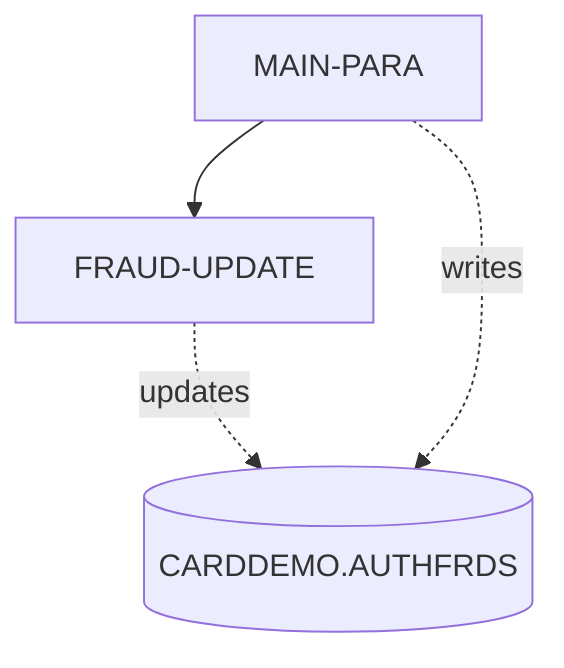
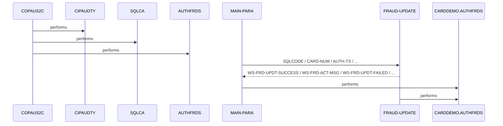

# COPAUS2C

**File**: `cbl/COPAUS2C.cbl`
**Type**: FileType.COBOL
**Analyzed**: 2026-03-04 03:23:58.861230

## Purpose

The COPAUS2C program is a CICS COBOL DB2 program that marks an authorization message as fraudulent. It inserts a record into the CARDDEMO.AUTHFRDS table, and if a duplicate record exists, it updates the existing record to mark it as fraudulent.

**Business Context**: This program is part of the CardDemo application and is used to report fraudulent authorization messages.

## Inputs

| Name | Type | Description |
|------|------|-------------|
| DFHCOMMAREA | IOType.CICS_COMMAREA | The CICS COMMAREA contains the account ID (WS-ACCT-ID), customer ID (WS-CUST-ID), and the fraud authorization record (WS-FRAUD-AUTH-RECORD) which includes the authorization details. It also contains the fraud status record (WS-FRAUD-STATUS-RECORD) which includes the fraud action (WS-FRD-ACTION), update status (WS-FRD-UPDATE-STATUS), and action message (WS-FRD-ACT-MSG). |

## Outputs

| Name | Type | Description |
|------|------|-------------|
| CARDDEMO.AUTHFRDS | IOType.DB2_TABLE | This table stores authorization details and fraud status. The program inserts a new record or updates an existing record in this table to mark an authorization as fraudulent. |
| DFHCOMMAREA | IOType.CICS_COMMAREA | The CICS COMMAREA is updated with the fraud update status (WS-FRD-UPDT-STATUS) and a message (WS-FRD-ACT-MSG) indicating the success or failure of the fraud update. |

## Business Rules

- **BR001**: If a record with the same card number and authorization timestamp already exists in the CARDDEMO.AUTHFRDS table, update the existing record instead of inserting a new one.

## Paragraphs/Procedures

### COPAUS2C
> [Source: COPAUS2C.cbl.md](COPAUS2C.cbl.d/COPAUS2C.cbl.md)
This is the program identification paragraph. It simply defines the program ID as COPAUS2C. It does not perform any processing logic or call any other paragraphs directly. It serves as the entry point for the program but delegates all functional responsibilities to other paragraphs. The program utilizes copybooks CIPAUDTY, SQLCA, and AUTHFRDS, which are included for data structure definitions and DB2 communication. The program's main function, marking authorization messages as fraudulent, is handled in subsequent paragraphs. This paragraph is essential for program identification and organization, but it does not directly contribute to the program's core functionality. It is the starting point for understanding the program's overall structure and purpose.

### MAIN-PARA
> [Source: MAIN-PARA.cbl.md](COPAUS2C.cbl.d/MAIN-PARA.cbl.md)

```
MAIN-PARA  (49 statements, depth=5)
PARAGRAPH
├── EXEC_CICS: *>EXECCICS EXEC CICS ASKTIME NOHANDLE *>EXECCICS ABSTIME(WS-ABS-TIME)...
├── MOVE: MOVE WS-CUR-DATE TO PA-FRAUD-RPT-DATE
├── MOVE: MOVE PA-AUTH-ORIG-DATE(1:2) TO WS-AUTH-YY
├── MOVE: MOVE PA-AUTH-ORIG-DATE(3:2) TO WS-AUTH-MM
├── MOVE: MOVE PA-AUTH-ORIG-DATE(5:2) TO WS-AUTH-DD
├── COMPUTE: COMPUTE WS-AUTH-TIME = 999999999 - PA-AUTH-TIME-9C
├── MOVE: MOVE WS-AUTH-TIME-AN(1:2) TO WS-AUTH-HH
├── MOVE: MOVE WS-AUTH-TIME-AN(3:2) TO WS-AUTH-MI
├── MOVE: MOVE WS-AUTH-TIME-AN(5:2) TO WS-AUTH-SS
├── MOVE: MOVE WS-AUTH-TIME-AN(7:3) TO WS-AUTH-SSS
├── MOVE: MOVE PA-CARD-NUM TO CARD-NUM
├── MOVE: MOVE WS-AUTH-TS TO AUTH-TS
├── MOVE: MOVE PA-AUTH-TYPE TO AUTH-TYPE
├── MOVE: MOVE PA-CARD-EXPIRY-DATE TO CARD-EXPIRY-DATE
├── MOVE: MOVE PA-MESSAGE-TYPE TO MESSAGE-TYPE
├── MOVE: MOVE PA-MESSAGE-SOURCE TO MESSAGE-SOURCE
├── MOVE: MOVE PA-AUTH-ID-CODE TO AUTH-ID-CODE
├── MOVE: MOVE PA-AUTH-RESP-CODE TO AUTH-RESP-CODE
├── MOVE: MOVE PA-AUTH-RESP-REASON TO AUTH-RESP-REASON
├── MOVE: MOVE PA-PROCESSING-CODE TO PROCESSING-CODE
├── MOVE: MOVE PA-TRANSACTION-AMT TO TRANSACTION-AMT
├── MOVE: MOVE PA-APPROVED-AMT TO APPROVED-AMT
├── MOVE: MOVE PA-MERCHANT-CATAGORY-CODE TO MERCHANT-CATAGORY-CODE
├── MOVE: MOVE PA-ACQR-COUNTRY-CODE TO ACQR-COUNTRY-CODE
├── MOVE: MOVE PA-POS-ENTRY-MODE TO POS-ENTRY-MODE
├── MOVE: MOVE PA-MERCHANT-ID TO MERCHANT-ID
├── MOVE: MOVE LENGTH OF PA-MERCHANT-NAME TO MERCHANT-NAME-LEN
├── MOVE: MOVE PA-MERCHANT-NAME TO MERCHANT-NAME-TEXT
├── MOVE: MOVE PA-MERCHANT-CITY TO MERCHANT-CITY
├── MOVE: MOVE PA-MERCHANT-STATE TO MERCHANT-STATE
├── MOVE: MOVE PA-MERCHANT-ZIP TO MERCHANT-ZIP
├── MOVE: MOVE PA-TRANSACTION-ID TO TRANSACTION-ID
├── MOVE: MOVE PA-MATCH-STATUS TO MATCH-STATUS
├── MOVE: MOVE WS-FRD-ACTION TO AUTH-FRAUD
├── MOVE: MOVE WS-ACCT-ID TO ACCT-ID
├── MOVE: MOVE WS-CUST-ID TO CUST-ID
├── EXEC_SQL: *>EXECSQL EXEC SQL *>EXECSQL INSERT INTO CARDDEMO.AUTHFRDS *>EXECSQL ...
├── IF: IF SQLCODE = ZERO SET WS-FRD-UPDT-SUCCESS TO TRUE MOVE 'ADD SUCCESS' ...
│   ├── SET: SET WS-FRD-UPDT-SUCCESS TO TRUE
│   ├── MOVE: MOVE 'ADD SUCCESS' TO WS-FRD-ACT-MSG
│   └── ELSE: ELSE
│       └── IF: IF SQLCODE = -803 PERFORM FRAUD-UPDATE ELSE SET WS-FRD-UPDT-FAILED TO...
│           ├── PERFORM: PERFORM FRAUD-UPDATE
│           └── ELSE: ELSE
│               ├── SET: SET WS-FRD-UPDT-FAILED TO TRUE
│               ├── MOVE: MOVE SQLCODE TO WS-SQLCODE
│               ├── MOVE: MOVE SQLSTATE TO WS-SQLSTATE
│               └── STRING: STRING ' SYSTEM ERROR DB2: CODE:' WS-SQLCODE ', STATE: ' WS-SQLSTATE ...
└── EXEC_CICS: *>EXECCICS EXEC CICS RETURN *>EXECCICS END-EXEC }
```
This paragraph is the main processing logic of the COPAUS2C program. It retrieves the current date and time using CICS ASKTIME and FORMATTIME commands and moves the current date to PA-FRAUD-RPT-DATE. It then extracts the year, month, and day from PA-AUTH-ORIG-DATE and calculates WS-AUTH-TIME by subtracting PA-AUTH-TIME-9C from 999999999. The paragraph moves data from the input COMMAREA (PA- fields) to corresponding fields in the AUTHFRDS table structure. It then attempts to insert a new record into the CARDDEMO.AUTHFRDS table using an embedded SQL INSERT statement. If the insert is successful (SQLCODE = ZERO), it sets WS-FRD-UPDT-SUCCESS to TRUE and moves 'ADD SUCCESS' to WS-FRD-ACT-MSG. If the insert fails with a duplicate key error (SQLCODE = -803), it calls the FRAUD-UPDATE paragraph to update the existing record. If any other SQL error occurs, it sets WS-FRD-UPDT-FAILED to TRUE, moves the SQLCODE and SQLSTATE to WS-SQLCODE and WS-SQLSTATE, respectively, and constructs an error message in WS-FRD-ACT-MSG. Finally, it returns control to CICS.

### FRAUD-UPDATE
> [Source: FRAUD-UPDATE.cbl.md](COPAUS2C.cbl.d/FRAUD-UPDATE.cbl.md)

```
FRAUD-UPDATE  (9 statements, depth=3)
PARAGRAPH
├── EXEC_SQL: *>EXECSQL EXEC SQL *>EXECSQL UPDATE CARDDEMO.AUTHFRDS *>EXECSQL SET A...
└── IF: IF SQLCODE = ZERO SET WS-FRD-UPDT-SUCCESS TO TRUE MOVE 'UPDT SUCCESS'...
    ├── SET: SET WS-FRD-UPDT-SUCCESS TO TRUE
    ├── MOVE: MOVE 'UPDT SUCCESS' TO WS-FRD-ACT-MSG
    └── ELSE: ELSE
        ├── SET: SET WS-FRD-UPDT-FAILED TO TRUE
        ├── MOVE: MOVE SQLCODE TO WS-SQLCODE
        ├── MOVE: MOVE SQLSTATE TO WS-SQLSTATE
        └── STRING: STRING ' UPDT ERROR DB2: CODE:' WS-SQLCODE ', STATE: ' WS-SQLSTATE DE...
```
This paragraph updates an existing record in the CARDDEMO.AUTHFRDS table. It constructs an SQL UPDATE statement to set the AUTH_FRAUD and FRAUD_RPT_DATE fields for the record matching the CARD_NUM and AUTH_TS from the input COMMAREA. If the update is successful (SQLCODE = ZERO), it sets WS-FRD-UPDT-SUCCESS to TRUE and moves 'UPDT SUCCESS' to WS-FRD-ACT-MSG. If the update fails, it sets WS-FRD-UPDT-FAILED to TRUE, moves the SQLCODE and SQLSTATE to WS-SQLCODE and WS-SQLSTATE, respectively, and constructs an error message in WS-FRD-ACT-MSG. This paragraph is called by MAIN-PARA when an attempt to insert a new record results in a duplicate key error, indicating that the record already exists and needs to be updated instead. The updated information includes marking the record as fraudulent and setting the fraud report date.

## Dead Code

The following artifacts were identified as dead code by static analysis:

| Artifact | Type | Line | Reason |
|----------|------|------|--------|
| exec-001 | function | 91 | Function 'exec-001' is never called by any other artifact |
| exec-002 | function | 95 | Function 'exec-002' is never called by any other artifact |
| exec-003 | function | 141 | Function 'exec-003' is never called by any other artifact |
| exec-004 | function | 218 | Function 'exec-004' is never called by any other artifact |
| exec-005 | function | 222 | Function 'exec-005' is never called by any other artifact |
| DFHCOMMAREA | record_layout | 74 | Record layout 'DFHCOMMAREA' is never used by any program |
| WS-VARIABLES | record_layout | 32 | Record layout 'WS-VARIABLES' is never used by any program |

## Control Flow


```mermaid
flowchart TD
    %% Title: COPAUS2C.cbl
    FRAUD_UPDATE["FRAUD-UPDATE"]
    CARDDEMO_AUTHFRDS__ext[("CARDDEMO.AUTHFRDS")]
    MAIN_PARA["MAIN-PARA"]
    FRAUD_UPDATE -.->|updates| CARDDEMO_AUTHFRDS__ext
    MAIN_PARA --> FRAUD_UPDATE
    MAIN_PARA -.->|writes| CARDDEMO_AUTHFRDS__ext
```

## Sequence Diagram


```mermaid
sequenceDiagram
    participant COPAUS2C as COPAUS2C
    participant CIPAUDTY as CIPAUDTY
    participant SQLCA as SQLCA
    participant AUTHFRDS as AUTHFRDS
    participant MAIN_PARA as MAIN-PARA
    participant FRAUD_UPDATE as FRAUD-UPDATE
    participant CARDDEMO_AUTHFRDS as CARDDEMO.AUTHFRDS
    COPAUS2C->>CIPAUDTY: performs
    COPAUS2C->>SQLCA: performs
    COPAUS2C->>AUTHFRDS: performs
    MAIN_PARA->>FRAUD_UPDATE: SQLCODE / CARD-NUM / AUTH-TS / ...
    FRAUD_UPDATE-->>MAIN_PARA: WS-FRD-UPDT-SUCCESS / WS-FRD-ACT-MSG / WS-FRD-UPDT-FAILED / ...
    MAIN_PARA->>CARDDEMO_AUTHFRDS: performs
    FRAUD_UPDATE->>CARDDEMO_AUTHFRDS: performs
```
