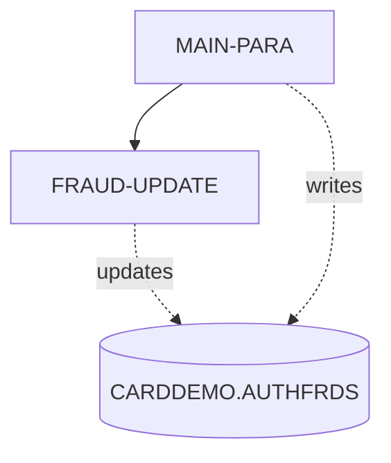
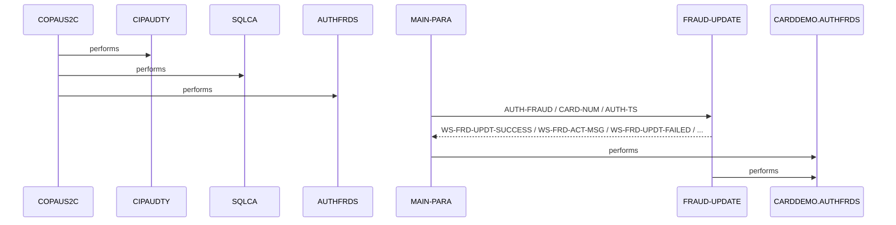

# COPAUS2C

**File**: `cbl/COPAUS2C.cbl`
**Type**: FileType.COBOL
**Analyzed**: 2026-02-27 14:40:40.370958

## Purpose

This COBOL program processes fraud reports, inserts them into the CARDDEMO.AUTHFRDS table, and updates existing records if a duplicate is found. It retrieves the current date and time, formats the time, and interacts with a DB2 database to manage fraud activity.

**Business Context**: Fraud detection and reporting within a card processing system.

## Inputs

| Name | Type | Description |
|------|------|-------------|
| PA-FRAUD-RPT | IOType.CICS_COMMAREA | Fraud report data passed from a calling program. |

## Outputs

| Name | Type | Description |
|------|------|-------------|
| CARDDEMO.AUTHFRDS | IOType.DB2_TABLE | Table storing fraud authorization details. |

## Called Programs

| Program | Call Type | Purpose |
|---------|-----------|---------|
| CIPAUDTY | CallType.STATIC_CALL | UNKNOWN |

## Business Rules

- **BR001**: If a record with the same key already exists in CARDDEMO.AUTHFRDS, update the existing record instead of inserting a new one.

## Paragraphs/Procedures

### COPAUS2C
> [Source: COPAUS2C.cbl.md](COPAUS2C.cbl.d/COPAUS2C.cbl.md)
This is the main program entry point. It does not contain any executable logic other than declaring called programs. It serves as a container for the program's overall structure and external dependencies. It declares calls to CIPAUDTY, SQLCA, and AUTHFRDS. The program's primary logic resides in the MAIN-PARA and FRAUD-UPDATE paragraphs. It does not directly consume any inputs or produce any outputs. It does not implement any business logic or error handling itself, delegating these tasks to its subordinate paragraphs. This paragraph essentially defines the program's interface and dependencies.

### MAIN-PARA
> [Source: MAIN-PARA.cbl.md](COPAUS2C.cbl.d/MAIN-PARA.cbl.md)

```
MAIN-PARA  (51 statements, depth=3)
PARAGRAPH
├── EXEC_CICS: EXEC CICS ASKTIME NOHANDLE ABSTIME(WS-ABS-TIME) NOHANDLE END-EXEC
├── EXEC_CICS: EXEC CICS FORMATTIME ABSTIME(WS-ABS-TIME) MMDDYY(WS-CUR-DATE) DATESEP...
├── MOVE: MOVE WS-CUR-DATE       TO PA-FRAUD-RPT-DATE
├── MOVE: MOVE PA-AUTH-ORIG-DATE(1:2) TO WS-AUTH-YY
├── MOVE: MOVE PA-AUTH-ORIG-DATE(3:2) TO WS-AUTH-MM
├── MOVE: MOVE PA-AUTH-ORIG-DATE(5:2) TO WS-AUTH-DD
├── COMPUTE: COMPUTE WS-AUTH-TIME = 999999999 - PA-AUTH-TIME-9C
├── MOVE: MOVE WS-AUTH-TIME-AN(1:2) TO WS-AUTH-HH
├── MOVE: MOVE WS-AUTH-TIME-AN(3:2) TO WS-AUTH-MI
├── MOVE: MOVE WS-AUTH-TIME-AN(5:2) TO WS-AUTH-SS
├── MOVE: MOVE WS-AUTH-TIME-AN(7:3) TO WS-AUTH-SSS
├── MOVE: MOVE PA-CARD-NUM          TO CARD-NUM
├── MOVE: MOVE WS-AUTH-TS           TO AUTH-TS
├── MOVE: MOVE PA-AUTH-TYPE         TO AUTH-TYPE
├── MOVE: MOVE PA-CARD-EXPIRY-DATE  TO CARD-EXPIRY-DATE
├── MOVE: MOVE PA-MESSAGE-TYPE      TO MESSAGE-TYPE
├── MOVE: MOVE PA-MESSAGE-SOURCE    TO MESSAGE-SOURCE
├── MOVE: MOVE PA-AUTH-ID-CODE      TO AUTH-ID-CODE
├── MOVE: MOVE PA-AUTH-RESP-CODE    TO AUTH-RESP-CODE
├── MOVE: MOVE PA-AUTH-RESP-REASON  TO AUTH-RESP-REASON
├── MOVE: MOVE PA-PROCESSING-CODE   TO PROCESSING-CODE
├── MOVE: MOVE PA-TRANSACTION-AMT   TO TRANSACTION-AMT
├── MOVE: MOVE PA-APPROVED-AMT      TO APPROVED-AMT
├── MOVE: MOVE PA-MERCHANT-CATAGORY-CODE TO MERCHANT-CATAGORY-CODE
├── MOVE: MOVE PA-ACQR-COUNTRY-CODE TO ACQR-COUNTRY-CODE
├── MOVE: MOVE PA-POS-ENTRY-MODE    TO POS-ENTRY-MODE
├── MOVE: MOVE PA-MERCHANT-ID       TO MERCHANT-ID
├── MOVE: MOVE LENGTH OF PA-MERCHANT-NAME TO MERCHANT-NAME-LEN
├── MOVE: MOVE PA-MERCHANT-NAME     TO MERCHANT-NAME-TEXT
├── MOVE: MOVE PA-MERCHANT-CITY     TO MERCHANT-CITY
├── MOVE: MOVE PA-MERCHANT-STATE    TO MERCHANT-STATE
├── MOVE: MOVE PA-MERCHANT-ZIP      TO MERCHANT-ZIP
├── MOVE: MOVE PA-TRANSACTION-ID    TO TRANSACTION-ID
├── MOVE: MOVE PA-MATCH-STATUS      TO MATCH-STATUS
├── MOVE: MOVE WS-FRD-ACTION        TO AUTH-FRAUD
├── MOVE: MOVE WS-ACCT-ID           TO ACCT-ID
├── MOVE: MOVE WS-CUST-ID           TO CUST-ID
├── EXEC_SQL: EXEC SQL INSERT INTO CARDDEMO.AUTHFRDS (CARD_NUM ,AUTH_TS ,AUTH_TYPE ...
├── IF: IF SQLCODE = ZERO
│   ├── SET: SET WS-FRD-UPDT-SUCCESS TO TRUE
│   ├── MOVE: MOVE 'ADD SUCCESS'      TO WS-FRD-ACT-MSG
│   └── ELSE: ELSE
│       └── IF: IF SQLCODE = -803
│           ├── PERFORM: PERFORM FRAUD-UPDATE
│           └── ELSE: ELSE
│               ├── SET: SET WS-FRD-UPDT-FAILED  TO TRUE
│               ├── MOVE: MOVE SQLCODE            TO WS-SQLCODE
│               ├── MOVE: MOVE SQLSTATE           TO WS-SQLSTATE
│               └── STRING: STRING ' SYSTEM ERROR DB2: CODE:' WS-SQLCODE ', STATE: ' WS-SQLSTATE ...
├── EXEC_CICS: EXEC CICS RETURN END-EXEC
└── UNKNOWN
```
This paragraph is the main processing logic of the program. It retrieves the current date and time using CICS services and formats the date. It then moves data from the input COMMAREA (PA-FRAUD-RPT) to working storage variables. It calculates WS-AUTH-TIME based on PA-AUTH-TIME-9C. It then constructs an SQL INSERT statement to add a new fraud record to the CARDDEMO.AUTHFRDS table. If the insertion is successful (SQLCODE = 0), it sets WS-FRD-UPDT-SUCCESS to TRUE and sets a success message. If a duplicate key error occurs (SQLCODE = -803), it performs the FRAUD-UPDATE paragraph to update the existing record. If any other SQL error occurs, it sets WS-FRD-UPDT-FAILED to TRUE, captures the SQLCODE and SQLSTATE, and constructs an error message. Finally, it returns to the calling program using EXEC CICS RETURN.

### FRAUD-UPDATE
> [Source: FRAUD-UPDATE.cbl.md](COPAUS2C.cbl.d/FRAUD-UPDATE.cbl.md)

```
FRAUD-UPDATE  (9 statements, depth=1)
PARAGRAPH
├── EXEC_SQL: EXEC SQL UPDATE CARDDEMO.AUTHFRDS SET   AUTH_FRAUD     = :AUTH-FRAUD,...
└── IF: IF SQLCODE = ZERO
    ├── SET: SET WS-FRD-UPDT-SUCCESS TO TRUE
    ├── MOVE: MOVE 'UPDT SUCCESS'     TO WS-FRD-ACT-MSG
    └── ELSE: ELSE
        ├── SET: SET WS-FRD-UPDT-FAILED  TO TRUE
        ├── MOVE: MOVE SQLCODE            TO WS-SQLCODE
        ├── MOVE: MOVE SQLSTATE           TO WS-SQLSTATE
        └── STRING: STRING ' UPDT ERROR DB2: CODE:' WS-SQLCODE ', STATE: ' WS-SQLSTATE   ...
```
This paragraph updates an existing fraud record in the CARDDEMO.AUTHFRDS table. It constructs an SQL UPDATE statement using data from working storage variables. If the update is successful (SQLCODE = 0), it sets WS-FRD-UPDT-SUCCESS to TRUE and sets a success message. If any SQL error occurs, it sets WS-FRD-UPDT-FAILED to TRUE, captures the SQLCODE and SQLSTATE, and constructs an error message. The paragraph is called when a duplicate key error occurs during the initial INSERT operation in MAIN-PARA, indicating that the record already exists. This paragraph ensures that existing fraud records are updated with the latest information. It uses AUTH-FRAUD to update the AUTH_FRAUD column in the CARDDEMO.AUTHFRDS table.

## Dead Code

The following artifacts were identified as dead code by static analysis:

| Artifact | Type | Line | Reason |
|----------|------|------|--------|
| exec-001 | function | 91 | Function 'exec-001' is never called by any other artifact |
| exec-002 | function | 95 | Function 'exec-002' is never called by any other artifact |
| exec-003 | function | 141 | Function 'exec-003' is never called by any other artifact |
| exec-004 | function | 218 | Function 'exec-004' is never called by any other artifact |
| exec-005 | function | 222 | Function 'exec-005' is never called by any other artifact |
| DFHCOMMAREA | record_layout | 74 | Record layout 'DFHCOMMAREA' is never used by any program |
| WS-VARIABLES | record_layout | 32 | Record layout 'WS-VARIABLES' is never used by any program |

## Control Flow


```mermaid
flowchart TD
    %% Title: COPAUS2C.cbl
    FRAUD_UPDATE["FRAUD-UPDATE"]
    CARDDEMO_AUTHFRDS__ext[("CARDDEMO.AUTHFRDS")]
    MAIN_PARA["MAIN-PARA"]
    FRAUD_UPDATE -.->|updates| CARDDEMO_AUTHFRDS__ext
    MAIN_PARA --> FRAUD_UPDATE
    MAIN_PARA -.->|writes| CARDDEMO_AUTHFRDS__ext
```

## Open Questions

- ? What is the purpose of CIPAUDTY?
  - Context: The code calls CIPAUDTY, but its function is not clear from the provided snippet.
- ? What is the structure of the PA-FRAUD-RPT COMMAREA?
  - Context: The program reads from PA-FRAUD-RPT, but the structure is not defined in the provided snippet.

## Sequence Diagram


```mermaid
sequenceDiagram
    participant COPAUS2C as COPAUS2C
    participant CIPAUDTY as CIPAUDTY
    participant SQLCA as SQLCA
    participant AUTHFRDS as AUTHFRDS
    participant MAIN_PARA as MAIN-PARA
    participant FRAUD_UPDATE as FRAUD-UPDATE
    participant CARDDEMO_AUTHFRDS as CARDDEMO.AUTHFRDS
    COPAUS2C->>CIPAUDTY: performs
    COPAUS2C->>SQLCA: performs
    COPAUS2C->>AUTHFRDS: performs
    MAIN_PARA->>FRAUD_UPDATE: AUTH-FRAUD / CARD-NUM / AUTH-TS
    FRAUD_UPDATE-->>MAIN_PARA: WS-FRD-UPDT-SUCCESS / WS-FRD-ACT-MSG / WS-FRD-UPDT-FAILED / ...
    MAIN_PARA->>CARDDEMO_AUTHFRDS: performs
    FRAUD_UPDATE->>CARDDEMO_AUTHFRDS: performs
```
