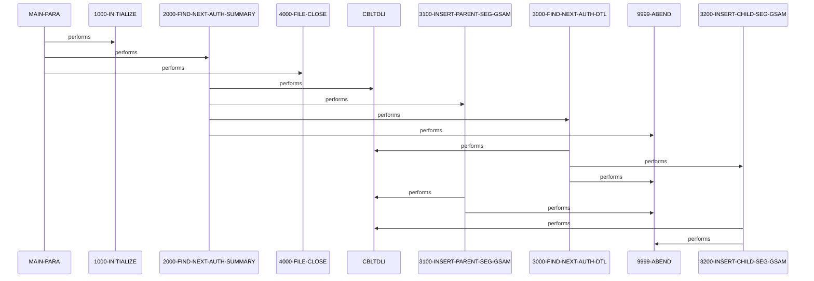

# DBUNLDGS

**File**: `cbl/DBUNLDGS.CBL`
**Type**: FileType.COBOL
**Analyzed**: 2026-02-25 15:35:16.622810

## Purpose

DBUNLDGS is an IMS batch utility that unloads pending authorization summary (root) and detail (child) segments from the hierarchical IMS database PAUT via sequential GN/GNP calls on PAUTBPCB. It then inserts the read segments into two GSAM databases: summary segments into PASFL via PASFLPCB and detail segments into PADFL via PADFLPCB. Alternate entry point 'DLITCBL' allows it to be invoked as a subroutine.

**Business Context**: Supports migration or replication of pending authorization data from hierarchical IMS DB to GSAM files for authorization processing.

## Inputs

| Name | Type | Description |
|------|------|-------------|
| PAUTBPCB | IOType.IMS_SEGMENT | IMS application PCB for PAUT database providing access to root PENDING-AUTH-SUMMARY (PAUTSUM0) and child PENDING-AUTH-DETAILS (PAUTDTL1) segments |

## Outputs

| Name | Type | Description |
|------|------|-------------|
| PASFLPCB | IOType.IMS_SEGMENT | GSAM PCB for inserting PENDING-AUTH-SUMMARY root segments |
| PADFLPCB | IOType.IMS_SEGMENT | GSAM PCB for inserting PENDING-AUTH-DETAILS child segments |

## Business Rules

- **BR001**: Process only numeric PA-ACCT-ID for root segments
- **BR002**: End root processing on IMS status 'GB' (end of database)
- **BR003**: End child processing on IMS status 'GE' (segment not found)

## Paragraphs/Procedures

### MAIN-PARA
> [Source: MAIN-PARA.cbl.md](DBUNLDGS.CBL.d/MAIN-PARA.cbl.md)

```
MAIN-PARA  (5 statements, depth=0)
PARAGRAPH
├── UNKNOWN: ENTRY 'DLITCBL'                 USING PAUTBPCB PASFLPCB PADFLPCB
├── PERFORM_THRU: PERFORM 1000-INITIALIZE                THRU 1000-EXIT
├── PERFORM_THRU: PERFORM 2000-FIND-NEXT-AUTH-SUMMARY    THRU 2000-EXIT UNTIL   WS-END-...
├── PERFORM_THRU: PERFORM 4000-FILE-CLOSE THRU 4000-EXIT
└── GOBACK: GOBACK
```
MAIN-PARA serves as the primary orchestration point for the program, including an alternate ENTRY 'DLITCBL' USING the three IMS PCBs to allow invocation as a linked subroutine. It consumes no direct inputs but relies on the passed PCBs for database access. It produces control flow to initialize, process all root summary records with their children, and terminate cleanly. Business logic involves looping over all root segments via 2000 until end-of-root flag is set on IMS 'GB' status. No explicit validation beyond IMS status checks handled in callees. It calls 1000-INITIALIZE for setup including date acceptance and display, 2000-FIND-NEXT-AUTH-SUMMARY in a loop for each root and its children inserts, and 4000-FILE-CLOSE for termination displays (file closes commented). Error handling defers to subordinate paragraphs which abend on IMS errors. After loop, it performs file close and GOBACKs with return code set only on abend path.

### 1000-INITIALIZE
> [Source: 1000-INITIALIZE.cbl.md](DBUNLDGS.CBL.d/1000-INITIALIZE.cbl.md)

```
1000-INITIALIZE  (6 statements, depth=0)
PARAGRAPH
├── ACCEPT: ACCEPT CURRENT-DATE     FROM DATE
├── ACCEPT: ACCEPT CURRENT-YYDDD    FROM DAY
├── DISPLAY: DISPLAY 'STARTING PROGRAM DBUNLDGS::'
├── DISPLAY: DISPLAY '*-------------------------------------*'
├── DISPLAY: DISPLAY 'TODAYS DATE            :' CURRENT-DATE
└── DISPLAY: DISPLAY ' '
```
This paragraph handles program startup initialization by accepting current date and YYDDD into working variables for potential logging or expiry checks (though expiry logic not active). It consumes no file or DB inputs, only system date. It produces populated date fields and display output to console showing program start and date. No business decisions or conditions checked. No error handling as operations are non-I/O. Displays startup banner but file opens are commented out. Calls no other paragraphs. Exits immediately after displays.

### 2000-FIND-NEXT-AUTH-SUMMARY
> [Source: 2000-FIND-NEXT-AUTH-SUMMARY.cbl.md](DBUNLDGS.CBL.d/2000-FIND-NEXT-AUTH-SUMMARY.cbl.md)

```
2000-FIND-NEXT-AUTH-SUMMARY  (20 statements, depth=2)
PARAGRAPH
├── INITIALIZE: INITIALIZE PAUT-PCB-STATUS
├── CALL: CALL 'CBLTDLI'            USING  FUNC-GN PAUTBPCB PENDING-AUTH-SUMMAR...
├── IF: IF PAUT-PCB-STATUS = SPACES
│   ├── ADD: ADD 1                 TO WS-NO-SUMRY-READ
│   ├── ADD: ADD 1                 TO WS-AUTH-SMRY-PROC-CNT
│   ├── MOVE: MOVE PENDING-AUTH-SUMMARY TO OPFIL1-REC
│   ├── INITIALIZE: INITIALIZE ROOT-SEG-KEY
│   ├── INITIALIZE: INITIALIZE CHILD-SEG-REC
│   ├── MOVE: MOVE PA-ACCT-ID           TO ROOT-SEG-KEY
│   └── IF: IF PA-ACCT-ID IS NUMERIC
│       ├── PERFORM_THRU: PERFORM 3100-INSERT-PARENT-SEG-GSAM THRU 3100-EXIT
│       ├── INITIALIZE: INITIALIZE WS-END-OF-CHILD-SEG
│       └── PERFORM_THRU: PERFORM 3000-FIND-NEXT-AUTH-DTL THRU 3000-EXIT UNTIL  WS-END-OF-CHILD...
├── IF: IF PAUT-PCB-STATUS = 'GB'
│   ├── SET: SET END-OF-AUTHDB     TO TRUE
│   └── MOVE: MOVE 'Y' TO WS-END-OF-ROOT-SEG
└── IF: IF PAUT-PCB-STATUS NOT EQUAL TO  SPACES AND 'GB'
    ├── DISPLAY: DISPLAY 'AUTH SUM  GN FAILED  :' PAUT-PCB-STATUS
    ├── DISPLAY: DISPLAY 'KEY FEEDBACK AREA    :' PAUT-KEYFB
    └── PERFORM: PERFORM 9999-ABEND
```
This paragraph is the core loop driver for processing each root PENDING-AUTH-SUMMARY segment from PAUT IMS DB, invoked repeatedly until end-of-root. It consumes root segments via GN call on PAUTBPCB and unqualified SSA 'PAUTSUM0'. It produces incremented read/process counters, ROOT-SEG-KEY set from PA-ACCT-ID, and triggers inserts for root and all its children. Business logic: initializes PCB status, performs GN, on spaces (success) increments counters, moves data to work recs (writes commented), sets key, checks PA-ACCT-ID numeric then inserts parent via 3100 and loops children via 3000 until child-end; on 'GB' sets root-end flag; other statuses display feedback and abend via 9999. Error handling immediate abend on non-spaces/'GB'. Calls 3100-INSERT-PARENT-SEG-GSAM to replicate summary to PASFL GSAM and 3000-FIND-NEXT-AUTH-DTL loop for details.

### 3000-FIND-NEXT-AUTH-DTL
> [Source: 3000-FIND-NEXT-AUTH-DTL.cbl.md](DBUNLDGS.CBL.d/3000-FIND-NEXT-AUTH-DTL.cbl.md)

```
3000-FIND-NEXT-AUTH-DTL  (15 statements, depth=1)
PARAGRAPH
├── CALL: CALL 'CBLTDLI'            USING  FUNC-GNP PAUTBPCB PENDING-AUTH-DETAI...
├── IF: IF PAUT-PCB-STATUS = SPACES
│   ├── SET: SET MORE-AUTHS       TO TRUE
│   ├── ADD: ADD 1                 TO WS-NO-SUMRY-READ
│   ├── ADD: ADD 1                 TO WS-AUTH-SMRY-PROC-CNT
│   ├── MOVE: MOVE PENDING-AUTH-DETAILS TO CHILD-SEG-REC
│   └── PERFORM_THRU: PERFORM 3200-INSERT-CHILD-SEG-GSAM THRU 3200-EXIT
├── IF: IF PAUT-PCB-STATUS = 'GE'
│   ├── MOVE: MOVE 'Y' TO WS-END-OF-CHILD-SEG
│   └── DISPLAY: DISPLAY 'CHILD SEG FLAG GE : ' WS-END-OF-CHILD-SEG
├── IF: IF PAUT-PCB-STATUS NOT EQUAL TO  SPACES AND 'GE'
│   ├── DISPLAY: DISPLAY 'GNP CALL FAILED  :' PAUT-PCB-STATUS
│   ├── DISPLAY: DISPLAY 'KFB AREA IN CHILD:' PAUT-KEYFB
│   └── PERFORM: PERFORM 9999-ABEND
└── INITIALIZE: INITIALIZE PAUT-PCB-STATUS
```
This paragraph processes child PENDING-AUTH-DETAILS segments under a given root by sequential GNP calls using parent ROOT-SEG-KEY. It consumes child segments from PAUTBPCB with unqualified SSA 'PAUTDTL1'. It produces incremented counters (mislabeled as summary), child work record, and insert to PADFL GSAM. Business logic: GNP call, on spaces sets more-auths flag, increments read counters, moves to CHILD-SEG-REC (write commented), performs 3200 insert; on 'GE' sets child-end flag and displays; other statuses display keyfb and abend. Initializes PCB status post-call. Error handling abend on non-spaces/'GE'. Called in loop from 2000 until child-end.

### 3100-INSERT-PARENT-SEG-GSAM
> [Source: 3100-INSERT-PARENT-SEG-GSAM.cbl.md](DBUNLDGS.CBL.d/3100-INSERT-PARENT-SEG-GSAM.cbl.md)

```
3100-INSERT-PARENT-SEG-GSAM  (5 statements, depth=1)
PARAGRAPH
├── CALL: CALL 'CBLTDLI'       USING  FUNC-ISRT PASFLPCB PENDING-AUTH-SUMMARY
└── IF: IF PASFL-PCB-STATUS NOT EQUAL TO SPACES
    ├── DISPLAY: DISPLAY 'GSAM PARENT FAIL :' PASFL-PCB-STATUS
    ├── DISPLAY: DISPLAY 'KFB AREA IN GSAM:' PASFL-KEYFB
    └── PERFORM: PERFORM 9999-ABEND
```
This utility paragraph inserts a single root PENDING-AUTH-SUMMARY segment into the PASFL GSAM database. It consumes the summary segment data from working storage populated by 2000. It produces the inserted segment in PASFL via ISRT call on PASFLPCB. No business decisions, unconditional insert. Error handling: if PASFL-PCB-STATUS not spaces, displays status/keyfb and abends via 9999. No calls to other paragraphs.

### 3200-INSERT-CHILD-SEG-GSAM
> [Source: 3200-INSERT-CHILD-SEG-GSAM.cbl.md](DBUNLDGS.CBL.d/3200-INSERT-CHILD-SEG-GSAM.cbl.md)

```
3200-INSERT-CHILD-SEG-GSAM  (5 statements, depth=1)
PARAGRAPH
├── CALL: CALL 'CBLTDLI'       USING  FUNC-ISRT PADFLPCB PENDING-AUTH-DETAILS
└── IF: IF PADFL-PCB-STATUS NOT EQUAL TO SPACES
    ├── DISPLAY: DISPLAY 'GSAM PARENT FAIL :' PADFL-PCB-STATUS
    ├── DISPLAY: DISPLAY 'KFB AREA IN GSAM:' PADFL-KEYFB
    └── PERFORM: PERFORM 9999-ABEND
```
This utility paragraph inserts a single child PENDING-AUTH-DETAILS segment into the PADFL GSAM database. It consumes the details segment data from working storage populated by 3000. It produces the inserted segment in PADFL via ISRT call on PADFLPCB. No business decisions, unconditional insert. Error handling: if PADFL-PCB-STATUS not spaces, displays status/keyfb and abends via 9999. No calls to other paragraphs.

### 4000-FILE-CLOSE
> [Source: 4000-FILE-CLOSE.cbl.md](DBUNLDGS.CBL.d/4000-FILE-CLOSE.cbl.md)

```
4000-FILE-CLOSE  (1 statements, depth=0)
PARAGRAPH
└── DISPLAY: DISPLAY 'CLOSING THE FILE'
```
This termination paragraph handles program shutdown by displaying close message; actual file closes are commented out. Consumes no inputs. Produces console display only. No logic or conditions. No error handling shown (closes commented). No calls.

### 9999-ABEND
> [Source: 9999-ABEND.cbl.md](DBUNLDGS.CBL.d/9999-ABEND.cbl.md)

```
9999-ABEND  (3 statements, depth=0)
PARAGRAPH
├── DISPLAY: DISPLAY 'DBUNLDGS ABENDING ...'
├── MOVE: MOVE 16 TO RETURN-CODE
└── GOBACK: GOBACK
```
This error termination paragraph is called on any IMS call failure to abend the program. Consumes error context from caller displays. Produces console abend message and sets RETURN-CODE to 16 before GOBACK. No conditions checked here. Handles all fatal errors by standard abend. No calls except implicit to 9999-EXIT.

### 9999-EXIT
> [Source: 9999-EXIT.cbl.md](DBUNLDGS.CBL.d/9999-EXIT.cbl.md)

```
9999-EXIT  (1 statements, depth=0)
PARAGRAPH
└── EXIT: EXIT
```
This is the exit point for the 9999-ABEND paragraph, performing a simple EXIT to return control to caller. It consumes nothing and produces no outputs or side effects. No logic, validation, or error handling. Serves only as procedural exit delimiter. Called implicitly by 9999-ABEND.

## Dead Code

The following artifacts were identified as dead code by static analysis:

| Artifact | Type | Line | Reason |
|----------|------|------|--------|
| PADFLPCB | record_layout | 17 | Record layout 'PADFLPCB' is never used by any program |
| PASFLPCB | record_layout | 17 | Record layout 'PASFLPCB' is never used by any program |

## Control Flow


## Sequence Diagram


