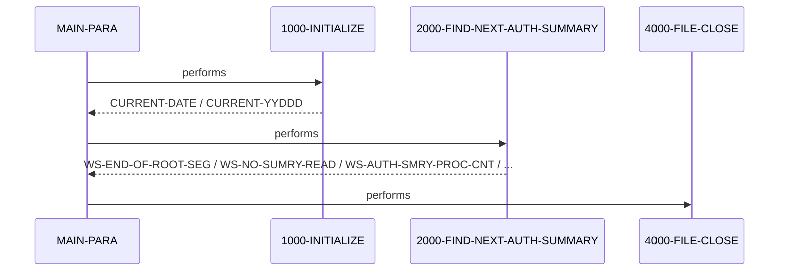

# DBUNLDGS

**File**: `cbl/DBUNLDGS.CBL`
**Type**: FileType.COBOL
**Analyzed**: 2026-02-24 17:43:44.226557

## Purpose

The COBOL program DBUNLDGS is designed to unload data from an IMS database. It retrieves pending authorization summary and detail segments and writes them to output files. The program initializes, retrieves summary records, and then closes the files upon completion.

**Business Context**: UNKNOWN

## Inputs

| Name | Type | Description |
|------|------|-------------|
| IMS Database | IOType.IMS_SEGMENT | Pending authorization summary and detail segments from an IMS database. |
| PAUTBPCB | IOType.PARAMETER | Pending Authorization PCB mask. |
| PASFLPCB | IOType.PARAMETER | Pending Authorization Summary File PCB mask. |
| PADFLPCB | IOType.PARAMETER | Pending Authorization Detail File PCB mask. |

## Outputs

| Name | Type | Description |
|------|------|-------------|
| OPFILE1 | IOType.FILE_SEQUENTIAL | Output file containing data from the IMS database. The structure is defined by OPFIL1-REC. |
| OPFILE2 | IOType.FILE_SEQUENTIAL | Output file containing data from the IMS database. The structure is defined by OPFIL2-REC, containing a root segment key and a child segment record. |

## Business Rules

- **BR001**: The program continues processing as long as the end-of-root-segment flag is not set to 'Y'.

## Paragraphs/Procedures

### MAIN-PARA
> [Source: MAIN-PARA.cbl.md](DBUNLDGS.CBL.d/MAIN-PARA.cbl.md)
This is the main paragraph of the DBUNLDGS program. It serves as the entry point and orchestrates the overall program flow. It first performs the 1000-INITIALIZE paragraph to set up the program environment, including accepting the current date and displaying program start messages. Then, it enters a loop, repeatedly performing the 2000-FIND-NEXT-AUTH-SUMMARY paragraph to retrieve and process pending authorization summary records from the IMS database. The loop continues until the WS-END-OF-ROOT-SEG flag is set to 'Y', indicating that all summary records have been processed. Finally, it performs the 4000-FILE-CLOSE paragraph to close the output files and terminates the program using GOBACK. The paragraph uses PAUTBPCB, PASFLPCB and PADFLPCB from the linkage section.

### 1000-INITIALIZE
> [Source: 1000-INITIALIZE.cbl.md](DBUNLDGS.CBL.d/1000-INITIALIZE.cbl.md)
This paragraph initializes the program environment. It accepts the current date and day from the system and stores them in CURRENT-DATE and CURRENT-YYDDD, respectively. It then displays a series of messages to the console indicating the start of the program and the current date. The commented-out code suggests that it was intended to accept parameters from SYSIN and open output files OPFILE1 and OPFILE2, with error handling for file open failures. However, these file operations are currently commented out. The paragraph consumes system date and day, and displays messages to the console. It does not directly produce any output data, but sets up the environment for subsequent processing. It does not call any other paragraphs.

## Control Flow

## Open Questions

- ? What is the purpose of the IMSFUNCS copybook?
  - Context: The code includes the IMSFUNCS copybook, but its contents and usage are not evident in the provided snippet.
- ? What are the exact record layouts for OPFILE1 and OPFILE2?
  - Context: The file definitions for OPFILE1 and OPFILE2 are commented out, so their exact structure and content are unclear.
- ? What is the purpose of the 2000-FIND-NEXT-AUTH-SUMMARY and 4000-FILE-CLOSE paragraphs?
  - Context: The code for these paragraphs is not provided in the snippet.
- ? What are the contents of the PASFLPCB and PADFLPCB copybooks?
  - Context: The copybooks PASFLPCB and PADFLPCB are included, but their contents are not shown.

## Sequence Diagram

