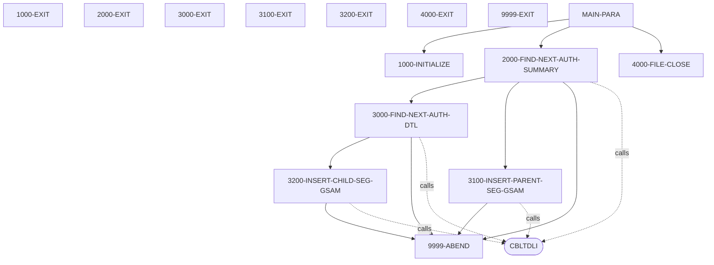

# DBUNLDGS

**File**: `cbl/DBUNLDGS.CBL`
**Type**: FileType.COBOL
**Analyzed**: 2026-01-27 23:04:45.279416

## Purpose

The COBOL program DBUNLDGS extracts pending authorization summary and detail records from an IMS database and writes them to output files. It reads the PAUTSUM0 and PAUTDTL1 segments from the IMS database, and writes them to GSAM datasets.

**Business Context**: This program is likely used for reporting or auditing purposes, extracting pending authorization data for analysis or transfer to another system.

## Inputs

| Name | Type | Description |
|------|------|-------------|
| IMS Database (PAUTSUM0, PAUTDTL1 Segments) | IOType.IMS_SEGMENT | Pending authorization summary and detail segments from an IMS database. |
| PAUTBPCB | IOType.PARAMETER | IMS Program Communication Block for PAUTSUM0 segment. |
| PASFLPCB | IOType.PARAMETER | IMS Program Communication Block for GSAM output of PAUTSUM0 segment. |
| PADFLPCB | IOType.PARAMETER | IMS Program Communication Block for GSAM output of PAUTDTL1 segment. |

## Outputs

| Name | Type | Description |
|------|------|-------------|
| GSAM Output for PAUTSUM0 | IOType.FILE_SEQUENTIAL | Sequential file containing extracted pending authorization summary records. |
| GSAM Output for PAUTDTL1 | IOType.FILE_SEQUENTIAL | Sequential file containing extracted pending authorization detail records. |

## Called Programs

| Program | Call Type | Purpose |
|---------|-----------|---------|
| CBLTDLI | CallType.STATIC_CALL | Interface with IMS DL/I to retrieve and insert segments. |
| CBLTDLI | CallType.STATIC_CALL | Interface with IMS DL/I to retrieve the next child segment. |
| CBLTDLI | CallType.STATIC_CALL | Interface with IMS DL/I to insert the parent segment into GSAM dataset. |
| CBLTDLI | CallType.STATIC_CALL | Interface with IMS DL/I to insert the child segment into GSAM dataset. |

## Business Rules

- **BR001**: The program extracts pending authorization summary records from the IMS database.
- **BR002**: The program extracts pending authorization detail records for each summary record.
- **BR003**: The program only writes records to the output file if the PA-ACCT-ID is numeric.

## Paragraphs/Procedures

### MAIN-PARA
This is the main entry point of the program. It first performs the 1000-INITIALIZE paragraph to set up the program environment. Then, it enters a loop, repeatedly performing 2000-FIND-NEXT-AUTH-SUMMARY until the end of the authorization database is reached, indicated by WS-END-OF-ROOT-SEG being set to 'Y'. Finally, it performs 4000-FILE-CLOSE to close the output files and terminates the program. The paragraph uses the DLITCBL entry point to receive the PCBs via the linkage section.

### 1000-INITIALIZE
This paragraph initializes the program environment. It accepts the current date and day from the system. It then displays a starting message to the console, including the current date. The commented-out code suggests that it was originally intended to open output files OPFILE1 and OPFILE2, but this functionality is currently disabled. If the file opening failed, the program would have abended. The paragraph does not consume any specific input files, but it does initialize working storage variables such as WS-OUTFL1-STATUS and WS-OUTFL2-STATUS. It does not call any other programs.

### 2000-FIND-NEXT-AUTH-SUMMARY
This paragraph retrieves the next pending authorization summary record from the IMS database. It initializes the PAUT-PCB-STATUS and then calls the CBLTDLI routine with the FUNC-GN (Get Next) function code to retrieve the next summary segment (PAUTSUM0) using the ROOT-UNQUAL-SSA. If the call is successful (PAUT-PCB-STATUS is spaces), it increments counters, moves the summary record to OPFIL1-REC, and then calls 3000-FIND-NEXT-AUTH-DTL to process the detail records for the current summary record. If the PA-ACCT-ID is numeric, it calls 3100-INSERT-PARENT-SEG-GSAM to write the summary record to the GSAM dataset. If the end of the database is reached (PAUT-PCB-STATUS is 'GB'), it sets the WS-END-OF-ROOT-SEG flag to 'Y'. If any other error occurs, the program abends.

### 3000-FIND-NEXT-AUTH-DTL
This paragraph retrieves the next pending authorization detail record for the current summary record from the IMS database. It calls the CBLTDLI routine with the FUNC-GNP (Get Next within Parent) function code to retrieve the next detail segment (PAUTDTL1) using the CHILD-UNQUAL-SSA. If the call is successful (PAUT-PCB-STATUS is spaces), it sets the MORE-AUTHS flag to TRUE, increments counters, and moves the detail record to CHILD-SEG-REC. It then calls 3200-INSERT-CHILD-SEG-GSAM to write the detail record to the GSAM dataset. If the end of the detail records is reached (PAUT-PCB-STATUS is 'GE'), it sets the WS-END-OF-CHILD-SEG flag to 'Y'. If any other error occurs, the program abends. The paragraph initializes PAUT-PCB-STATUS before exiting.

### 3100-INSERT-PARENT-SEG-GSAM
This paragraph inserts the parent segment (PENDING-AUTH-SUMMARY) into the GSAM dataset. It calls the CBLTDLI routine with the FUNC-ISRT (Insert) function code, using the PASFLPCB. If the call is not successful (PASFL-PCB-STATUS is not spaces), the program displays an error message and abends. This paragraph is called from 2000-FIND-NEXT-AUTH-SUMMARY after a parent segment has been successfully read from the IMS database, and the PA-ACCT-ID is numeric. It consumes the PENDING-AUTH-SUMMARY record and writes it to the GSAM dataset. It does not make any decisions based on business logic, but it does perform error handling by checking the PASFL-PCB-STATUS.

### 3200-INSERT-CHILD-SEG-GSAM
This paragraph inserts the child segment (PENDING-AUTH-DETAILS) into the GSAM dataset. It calls the CBLTDLI routine with the FUNC-ISRT (Insert) function code, using the PADFLPCB. If the call is not successful (PADFL-PCB-STATUS is not spaces), the program displays an error message and abends. This paragraph is called from 3000-FIND-NEXT-AUTH-DTL after a child segment has been successfully read from the IMS database. It consumes the PENDING-AUTH-DETAILS record and writes it to the GSAM dataset. It does not make any decisions based on business logic, but it does perform error handling by checking the PADFL-PCB-STATUS.

### 4000-FILE-CLOSE
This paragraph is responsible for closing the output files. It displays a message indicating that the files are being closed. The actual CLOSE statements are commented out, so this paragraph currently does nothing other than display the message. Originally, it would have closed OPFILE1 and OPFILE2 and checked the WS-OUTFL1-STATUS and WS-OUTFL2-STATUS for errors. If any errors were encountered during the close operation, the program would not abend. The paragraph does not consume any input data, nor does it produce any output other than the display message. It does not call any other paragraphs or programs.

### 9999-ABEND
This paragraph is the error handling routine for the program. It displays a message indicating that the program is abending. It then sets the RETURN-CODE to 16 and terminates the program using the GOBACK statement. This routine is called when a critical error is encountered, such as a failed DL/I call or a file I/O error. It does not take any input parameters and does not produce any output other than the display message and the return code. It does not call any other paragraphs or programs.

## Control Flow

## Open Questions

- ? What is the purpose of the commented-out code related to OPFILE1 and OPFILE2?
  - Context: The code suggests that the program was originally intended to write to sequential files, but this functionality is currently disabled.
- ? What are the exact layouts of the GSAM output files?
  - Context: The program writes segments to GSAM datasets, but the exact format of these datasets is not explicitly defined in the code.
- ? What are the values passed to the program via SYSIN?
  - Context: Line 163 is commented out, but it suggests that parameters were passed to the program. It is not clear what these parameters are.
