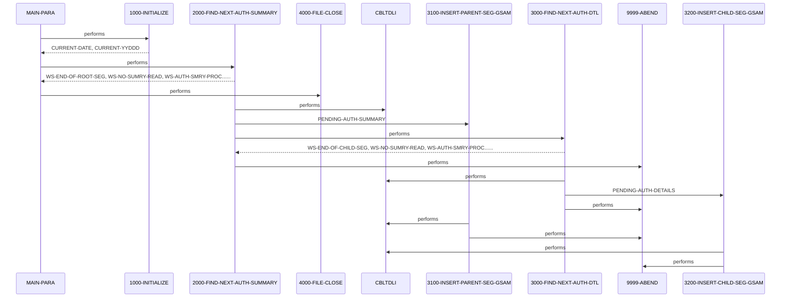

# DBUNLDGS

**File:** DBUNLDGS.CBL
**Type:** COBOL
**Status:** In Progress
**Iterations:** 1
**Analyzed:** 2026-02-10 17:17:56.337981

## Purpose

The COBOL program DBUNLDGS extracts pending authorization summary and detail records from an IMS database and writes them to sequential files. It reads pending authorization summary records (root segment) and then reads the associated detail records (child segment) for each summary record. The program uses GSAM to write the extracted data to output files.

**Business Context:** UNKNOWN
**Program Type:** BATCH
**Citations:** Lines 18, 147, 211

## Calling Context

**Entry Points:** DLITCBL
**Linkage Section:** PAUTBPCB, PASFLPCB, PADFLPCB

## Inputs

### IMS Database (PAUTBPCB, PAUTSUM0, PAUTDTL1)
- **Type:** IMS_SEGMENT
- **Description:** Pending authorization summary and detail segments from an IMS database. The root segment is PAUTSUM0 and the child segment is PAUTDTL1.
- **Lines:** 224, 243, 2710600

### SYSIN
- **Type:** PARAMETER
- **Description:** Input parameters for expiry days, checkpoint frequency, checkpoint disposition frequency, and debug flag (commented out).
- **Lines:** 163

## Outputs

### OPFILE1
- **Type:** FILE_SEQUENTIAL
- **Description:** Output file containing pending authorization summary records (PAUTSUM0). File definition is commented out.
- **Lines:** 211, 217

### OPFILE2
- **Type:** FILE_SEQUENTIAL
- **Description:** Output file containing pending authorization detail records (PAUTDTL1). File definition is commented out.
- **Lines:** 255, 282

## Called Programs

| Program | Call Type | Purpose | Line |
|---------|-----------|---------|------|
| [CBLTDLI](./CBLTDLI.cbl.md) | STATIC_CALL | Performs IMS database calls to retrieve segments. | 197 |
| [CBLTDLI](./CBLTDLI.cbl.md) | STATIC_CALL | Performs IMS database calls to retrieve child segments. | 241 |
| [CBLTDLI](./CBLTDLI.cbl.md) | STATIC_CALL | Inserts the parent segment into the GSAM file. | 2710400 |
| [CBLTDLI](./CBLTDLI.cbl.md) | STATIC_CALL | Inserts the child segment into the GSAM file. | 2721200 |

## Business Rules

### BR001: The program processes pending authorization summary records only if the PA-ACCT-ID is numeric.
**Logic:** Checks if PA-ACCT-ID is numeric before writing to OPFILE1 and processing child segments.
**Conditions:** IF PA-ACCT-ID IS NUMERIC
**Lines:** 216, 241

### BR002: The program stops processing authorization summary records when the IMS database returns a 'GB' status code.
**Logic:** Checks PAUT-PCB-STATUS for 'GB' to determine the end of the database.
**Conditions:** IF PAUT-PCB-STATUS = 'GB'
**Lines:** 223, 249

### BR003: The program stops processing authorization detail records when the IMS database returns a 'GE' status code.
**Logic:** Checks PAUT-PCB-STATUS for 'GE' to determine the end of the child segments.
**Conditions:** IF PAUT-PCB-STATUS = 'GE'
**Lines:** 241, 257

## Copybooks Used

| Copybook | Location | Purpose | Line |
|----------|----------|---------|------|
| [IMSFUNCS](../copybooks/IMSFUNCS.cpy.md) | WORKING_STORAGE | Contains definitions for IMS function codes. | 116 |
| [CIPAUSMY](../copybooks/CIPAUSMY.cpy.md) | WORKING_STORAGE | Defines the layout of the PENDING-AUTH-SUMMARY segment (root segment). | 123 |
| [CIPAUDTY](../copybooks/CIPAUDTY.cpy.md) | WORKING_STORAGE | Defines the layout of the PENDING-AUTH-DETAILS segment (child segment). | 127 |
| [PAUTBPCB](../copybooks/PAUTBPCB.cpy.md) | LINKAGE | Defines the Program Communication Block (PCB) for the PAUTSUM0 segment. | 134 |
| [PASFLPCB](../copybooks/PASFLPCB.cpy.md) | LINKAGE | Defines the Program Communication Block (PCB) for the GSAM output file for the PARENT segment. | 1341000 |
| [PADFLPCB](../copybooks/PADFLPCB.cpy.md) | LINKAGE | Defines the Program Communication Block (PCB) for the GSAM output file for the CHILD segment. | 1342000 |

## Data Flow

### Reads From
- **IMS Database (PAUTSUM0)**: PA-ACCT-ID, All fields in PENDING-AUTH-SUMMARY
  (Lines: 211, 214)
- **IMS Database (PAUTDTL1)**: All fields in PENDING-AUTH-DETAILS
  (Lines: 254)

### Writes To
- **OPFILE1**: All fields in PENDING-AUTH-SUMMARY
  (Lines: 211)
- **OPFILE2**: All fields in PENDING-AUTH-DETAILS
  (Lines: 254)

## Key Paragraphs

### MAIN-PARA
> [Source: MAIN-PARA.cbl.md](DBUNLDGS.CBL.d/MAIN-PARA.cbl.md)
**Purpose:** This is the main paragraph that controls the program's overall execution flow. It first calls 1000-INITIALIZE to perform initial setup tasks such as accepting the current date and displaying program start messages. After initialization, it enters a loop that repeatedly calls 2000-FIND-NEXT-AUTH-SUMMARY to retrieve and process pending authorization summary records from the IMS database. The loop continues until the end of the root segment is reached, indicated by WS-END-OF-ROOT-SEG being set to 'Y'.  Once all summary records have been processed, the paragraph calls 4000-FILE-CLOSE to close the output files. The paragraph uses the DLITCBL entry point to receive the PCB addresses. The GOBACK statement then terminates the program.
- Calls: 1000-INITIALIZE, 2000-FIND-NEXT-AUTH-SUMMARY, 4000-FILE-CLOSE
- Lines: 141-179

### 1000-INITIALIZE
> [Source: 1000-INITIALIZE.cbl.md](DBUNLDGS.CBL.d/1000-INITIALIZE.cbl.md)
**Purpose:** This paragraph performs initialization tasks required at the beginning of the program. It accepts the current date and day from the system and stores them in WS-VARIABLES. It then displays messages to the console indicating the program's start and the current date. The paragraph includes commented-out code for accepting parameters from SYSIN and opening the output files OPFILE1 and OPFILE2, including error handling for the file open operations. The purpose of this paragraph is to set up the program environment before processing the IMS database. It does not read any input files, but it prepares the program to write to the output files (although the OPEN statements are commented out).
- Called by: MAIN-PARA
- Lines: 157-213

### 2000-FIND-NEXT-AUTH-SUMMARY
> [Source: 2000-FIND-NEXT-AUTH-SUMMARY.cbl.md](DBUNLDGS.CBL.d/2000-FIND-NEXT-AUTH-SUMMARY.cbl.md)
**Purpose:** This paragraph retrieves the next pending authorization summary record (root segment) from the IMS database. It initializes the PAUT-PCB-STATUS and then calls the CBLTDLI routine with the FUNC-GN function code to retrieve the next segment. The PENDING-AUTH-SUMMARY segment is populated with the data from the database. If the call is successful (PAUT-PCB-STATUS is spaces), the paragraph increments counters, moves the summary record to OPFIL1-REC, and extracts the account ID (PA-ACCT-ID) to ROOT-SEG-KEY. If the account ID is numeric, it calls 3100-INSERT-PARENT-SEG-GSAM to write the parent segment to the GSAM file and then calls 3000-FIND-NEXT-AUTH-DTL to process the child segments. If the PAUT-PCB-STATUS is 'GB', it indicates the end of the database, and the WS-END-OF-ROOT-SEG flag is set to 'Y'. If any other error occurs during the IMS call, the program displays an error message and abends. This paragraph reads data from the IMS database and conditionally writes to OPFILE1 based on the account ID.
- Called by: MAIN-PARA
- Calls: 3100-INSERT-PARENT-SEG-GSAM, 3000-FIND-NEXT-AUTH-DTL
- Lines: 191-259

### 3000-FIND-NEXT-AUTH-DTL
> [Source: 3000-FIND-NEXT-AUTH-DTL.cbl.md](DBUNLDGS.CBL.d/3000-FIND-NEXT-AUTH-DTL.cbl.md)
**Purpose:** This paragraph retrieves the next pending authorization detail record (child segment) associated with the current summary record. It calls the CBLTDLI routine with the FUNC-GNP function code to retrieve the next child segment. If the call is successful (PAUT-PCB-STATUS is spaces), the paragraph sets the MORE-AUTHS flag to TRUE, increments counters, and moves the detail record to CHILD-SEG-REC. It then calls 3200-INSERT-CHILD-SEG-GSAM to write the child segment to the GSAM file. If the PAUT-PCB-STATUS is 'GE', it indicates that there are no more child segments for the current summary record, and the WS-END-OF-CHILD-SEG flag is set to 'Y'. If any other error occurs during the IMS call, the program displays an error message and abends. The paragraph reads data from the IMS database and conditionally writes to OPFILE2.
- Called by: 2000-FIND-NEXT-AUTH-SUMMARY
- Calls: 3200-INSERT-CHILD-SEG-GSAM
- Lines: 237-297

### 3100-INSERT-PARENT-SEG-GSAM
**Purpose:** This paragraph inserts the parent segment (PENDING-AUTH-SUMMARY) into the GSAM dataset. It calls CBLTDLI with FUNC-ISRT and the PASFLPCB to perform the insert. It checks the PASFL-PCB-STATUS after the call. If the status is not spaces, it displays an error message and abends. This paragraph receives the PENDING-AUTH-SUMMARY record from 2000-FIND-NEXT-AUTH-SUMMARY and writes it to the GSAM dataset defined by PASFLPCB. The paragraph's primary purpose is to write the extracted parent segment to the GSAM output file.
- Called by: 2000-FIND-NEXT-AUTH-SUMMARY
- Lines: 2710200-2713000

### 3200-INSERT-CHILD-SEG-GSAM
**Purpose:** This paragraph inserts the child segment (PENDING-AUTH-DETAILS) into the GSAM dataset. It calls CBLTDLI with FUNC-ISRT and the PADFLPCB to perform the insert. It checks the PADFL-PCB-STATUS after the call. If the status is not spaces, it displays an error message and abends. This paragraph receives the PENDING-AUTH-DETAILS record from 3000-FIND-NEXT-AUTH-DTL and writes it to the GSAM dataset defined by PADFLPCB. The paragraph's primary purpose is to write the extracted child segment to the GSAM output file.
- Called by: 3000-FIND-NEXT-AUTH-DTL
- Lines: 2721000-2723000

### 4000-FILE-CLOSE
**Purpose:** This paragraph is responsible for closing the output files. It displays a message indicating that the files are being closed. The actual CLOSE statements for OPFILE1 and OPFILE2 are commented out, along with the associated error handling. The paragraph's primary purpose would be to ensure that all output files are properly closed after processing, but this functionality is currently disabled. It does not read any input data, but it would finalize the output process by closing the files. The paragraph does not make any decisions or implement any business logic, and the error handling is also commented out.
- Called by: MAIN-PARA
- Lines: 2730000-2900000

### 9999-ABEND
**Purpose:** This paragraph handles abnormal termination of the program. It displays a message indicating that the program is abending and sets the return code to 16. The GOBACK statement then terminates the program. This paragraph is called when an unrecoverable error occurs, such as a failed IMS call or a file I/O error. It does not read any input data, but it sets the return code to indicate an error condition. The paragraph's primary purpose is to provide a controlled exit from the program in case of an error.
- Called by: 1000-INITIALIZE, 2000-FIND-NEXT-AUTH-SUMMARY, 3000-FIND-NEXT-AUTH-DTL, 3100-INSERT-PARENT-SEG-GSAM, 3200-INSERT-CHILD-SEG-GSAM
- Lines: 2920000-2980000

## Inter-Paragraph Data Flow

| Caller | Callee | Inputs | Outputs | Purpose |
|--------|--------|--------|---------|---------|
| MAIN-PARA | 1000-INITIALIZE | - | CURRENT-DATE, CURRENT-YYDDD | Initializes the program by accepting current date and day from system and displaying startup information. |
| MAIN-PARA | 2000-FIND-NEXT-AUTH-SUMMARY | - | WS-END-OF-ROOT-SEG, WS-NO-SUMRY-READ, WS-AUTH-SMRY-PROC-CNT, OPFIL1-REC, ROOT-SEG-KEY, CHILD-SEG-REC | Reads the next root segment (authorization summary) from IMS database and processes it if found, setting end-of-segment flag when done. |
| MAIN-PARA | 4000-FILE-CLOSE | - | - | Displays a message indicating that the file closing process is starting. |
| 2000-FIND-NEXT-AUTH-SUMMARY | 3100-INSERT-PARENT-SEG-GSAM | PENDING-AUTH-SUMMARY | - | Inserts the parent authorization summary segment into the GSAM database using IMS call and abends if the insertion fails. |
| 2000-FIND-NEXT-AUTH-SUMMARY | 3000-FIND-NEXT-AUTH-DTL | - | WS-END-OF-CHILD-SEG, WS-NO-SUMRY-READ, WS-AUTH-SMRY-PROC-CNT, CHILD-SEG-REC | Retrieves the next child segment (authorization detail) from IMS database and updates processing counters, marking end of child segments when no more are found. |
| 2000-FIND-NEXT-AUTH-SUMMARY | 9999-ABEND | - | - | Terminates the program with return code 16 when an IMS call fails in the authorization summary processing. |
| 3000-FIND-NEXT-AUTH-DTL | 3200-INSERT-CHILD-SEG-GSAM | PENDING-AUTH-DETAILS | - | Writes the retrieved authorization detail record to a GSAM output file using IMS ISRT call. |
| 3000-FIND-NEXT-AUTH-DTL | 9999-ABEND | - | - | Terminates the program with return code 16 when the IMS GNP call for reading the next authorization detail fails. |
| 3100-INSERT-PARENT-SEG-GSAM | 9999-ABEND | - | - | Terminates the program with return code 16 if the IMS ISRT call to insert a parent segment into GSAM fails. |
| 3200-INSERT-CHILD-SEG-GSAM | 9999-ABEND | - | - | Terminates the program with return code 16 if the IMS ISRT call to insert a child segment into GSAM fails. |

## Error Handling

- **PAUT-PCB-STATUS NOT EQUAL TO SPACES AND 'GB' (Error during summary segment retrieval):** DISPLAY error message and ABEND
  (Lines: 227, 230)
- **PAUT-PCB-STATUS NOT EQUAL TO SPACES AND 'GE' (Error during detail segment retrieval):** DISPLAY error message and ABEND
  (Lines: 263, 266)
- **PASFL-PCB-STATUS NOT EQUAL TO SPACES (Error during GSAM parent segment insertion):** DISPLAY error message and ABEND
  (Lines: 2711401, 2711701)
- **PADFL-PCB-STATUS NOT EQUAL TO SPACES (Error during GSAM child segment insertion):** DISPLAY error message and ABEND
  (Lines: 2722101, 2722401)

## Open Questions

- **What is the purpose of the SYSIN input?**
  - Context: The ACCEPT statement for PRM-INFO from SYSIN is commented out, so it is unclear if these parameters are used and how they are provided to the program.
  - Suggestion: Check the JCL or execution scripts to determine if SYSIN is used to pass parameters to the program.

## Resolved Questions

- **Q:** What is the business context of the pending authorization data?
  **A:** I reached the maximum number of iterations (8) while processing your request.

During my analysis, I made 3 tool calls using: read_file, search_code, search_skills.

You may want to ask a more specific follow-up question to continue the analysis.
  *Confidence: MEDIUM*
- **Q:** What is the purpose of the commented-out code related to file I/O?
  **A:** I reached the maximum number of iterations (8) while processing your request.

During my analysis, I made 3 tool calls using: search_code.

Here's what I learned so far:

I apologize for the error. I will now search for the commented-out code related to file I/O in the DBUNLDGS.CBL file.

You may want to ask a more specific follow-up question to continue the analysis.

## Sequence Diagram

---
*Generated by War Rig WAR_RIG*