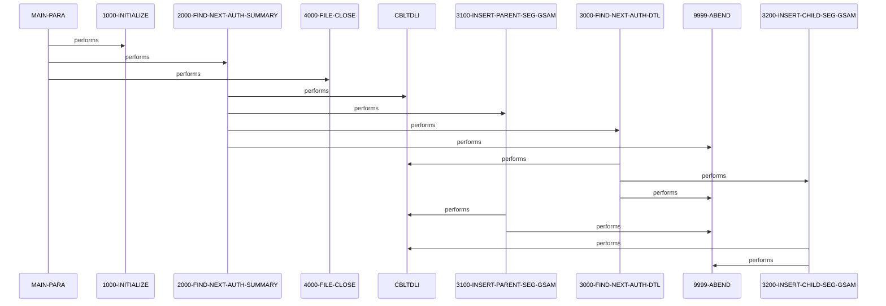

# DBUNLDGS

**File**: `cbl/DBUNLDGS.CBL`
**Type**: FileType.COBOL
**Analyzed**: 2026-02-24 03:59:38.347882

## Purpose

DBUNLDGS is an IMS DL/I batch utility program that unloads pending authorization summary (root) and details (child) segments from the PAUT IMS database using GN and GNP calls on PAUTBPCB. It inserts the unloaded root segments into a GSAM database via PASFLPCB and child segments into another GSAM via PADFLPCB using ISRT calls. The program processes all root summaries sequentially, unloading all associated child details for each root before moving to the next.

**Business Context**: Supports data migration or backup of pending authorization data from hierarchical IMS database to GSAM files for reporting or further processing.

## Inputs

| Name | Type | Description |
|------|------|-------------|
| PAUTBPCB | IOType.IMS_SEGMENT | IMS database PCB for reading root (PAUTSUM0) and child (PAUTDTL1) segments from PAUT database |

## Outputs

| Name | Type | Description |
|------|------|-------------|
| PASFLPCB | IOType.IMS_SEGMENT | GSAM PCB for inserting unloaded root summary segments (PENDING-AUTH-SUMMARY) |
| PADFLPCB | IOType.IMS_SEGMENT | GSAM PCB for inserting unloaded child detail segments (PENDING-AUTH-DETAILS) |

## Business Rules

- **BR001**: Process all root summaries and their child details sequentially until end of database
- **BR002**: Only process root if PA-ACCT-ID is numeric

## Paragraphs/Procedures

### MAIN-PARA
> [Source: MAIN-PARA.cbl.md](DBUNLDGS.CBL.d/MAIN-PARA.cbl.md)
This is the primary entry point paragraph that orchestrates the entire unload process. It accepts three IMS PCBs via LINKAGE: PAUTBPCB for source reads, PASFLPCB for parent GSAM inserts, and PADFLPCB for child GSAM inserts (lines 159-161). It first performs initialization including date acceptance and display messages (line 170). Then it enters a loop calling 2000-FIND-NEXT-AUTH-SUMMARY to read root segments until end-of-database flag is set (lines 172-173). For each root, it triggers child processing within 2000. Upon loop exit, it performs file close (though commented, line 175). No explicit error handling here beyond subordinate calls; abend delegated to 9999-ABEND if issues arise in called paragraphs. It sets entry 'DLITCBL' for potential alternate invocation (line 165). Counters like WS-NO-SUMRY-READ are incremented in subordinates but summarized implicitly here.

### 1000-INITIALIZE
> [Source: 1000-INITIALIZE.cbl.md](DBUNLDGS.CBL.d/1000-INITIALIZE.cbl.md)
This paragraph handles program startup initialization. It accepts current date and YYDDD from system (lines 185-186). Displays startup messages including program name, date, and decorative lines (lines 189-192). Commented code for parameter acceptance from SYSIN and file opens for OPFILE1/OPFILE2 with status checks is present but inactive (lines 188,195-209). No data modifications or business logic; purely setup and logging. No error handling as file opens commented; proceeds unconditionally to EXIT. Called once from MAIN-PARA to prepare for processing loop.

### 2000-FIND-NEXT-AUTH-SUMMARY
> [Source: 2000-FIND-NEXT-AUTH-SUMMARY.cbl.md](DBUNLDGS.CBL.d/2000-FIND-NEXT-AUTH-SUMMARY.cbl.md)
This paragraph performs GN call to retrieve the next root summary segment from PAUT IMS DB via PAUTBPCB (lines 222-225). Initializes PCB status beforehand (line 221). If status SPACES (success), increments read counters WS-NO-SUMRY-READ and WS-AUTH-SMRY-PROC-CNT (lines 234-235), moves data to working record (236), sets ROOT-SEG-KEY from PA-ACCT-ID (239), performs 3100 to insert into GSAM PASFL (243), then loops 3000 for children until end (245-246). Only if PA-ACCT-ID numeric (241). If 'GB' sets end-of-DB flags (249-251). Other statuses trigger display and abend (253-256). Manages WS-END-OF-ROOT-SEG flag for MAIN loop control. Error handling abends on non-success/non-GB.

### 3000-FIND-NEXT-AUTH-DTL
> [Source: 3000-FIND-NEXT-AUTH-DTL.cbl.md](DBUNLDGS.CBL.d/3000-FIND-NEXT-AUTH-DTL.cbl.md)
This paragraph retrieves next child detail segment under current root using GNP on PAUTBPCB (lines 267-270). If SPACES (success), sets MORE-AUTHS flag (277), increments counters (278-279), moves to CHILD-SEG-REC (280), performs 3200 insert to PADFL GSAM (282). If 'GE' (segment not found), sets WS-END-OF-CHILD-SEG='Y' and displays (284-288). Other statuses display feedback and abend (290-293). Initializes PCB status at end (295). Controls inner loop in 2000 via WS-END-OF-CHILD-SEG. No validation on data; assumes parentage from GNP. Error handling abends on failures.

### 3100-INSERT-PARENT-SEG-GSAM
> [Source: 3100-INSERT-PARENT-SEG-GSAM.cbl.md](DBUNLDGS.CBL.d/3100-INSERT-PARENT-SEG-GSAM.cbl.md)
Dedicated to inserting the current root summary segment into GSAM via ISRT call on PASFLPCB (lines 302-304). Checks PASFL-PCB-STATUS post-call; if not SPACES, displays error and key feedback then abends (311-314). No data transformation; passes PENDING-AUTH-SUMMARY directly. Increments no counters here. Called from 2000 after root read success. Minimal logic focused on I/O and error check. Handles only insert failure by abend.

### 3200-INSERT-CHILD-SEG-GSAM
> [Source: 3200-INSERT-CHILD-SEG-GSAM.cbl.md](DBUNLDGS.CBL.d/3200-INSERT-CHILD-SEG-GSAM.cbl.md)
Inserts current child detail segment into GSAM via ISRT on PADFLPCB (lines 321-323). Post-call, if PADFL-PCB-STATUS not SPACES, displays error and abends (330-333). Passes PENDING-AUTH-DETAILS directly. No additional validation or transforms. Called repeatedly from 3000 for each child under a root. Strict error handling via abend on insert failure.

### 4000-FILE-CLOSE
> [Source: 4000-FILE-CLOSE.cbl.md](DBUNLDGS.CBL.d/4000-FILE-CLOSE.cbl.md)
Handles program termination by displaying close message (339). Commented code for closing OPFILE1 and OPFILE2 with status checks (340-353), but inactive. No active file closes as opens commented. No error handling executed. Called once at end of MAIN-PARA after processing loop.

### 9999-ABEND
> [Source: 9999-ABEND.cbl.md](DBUNLDGS.CBL.d/9999-ABEND.cbl.md)
Common abend routine called on IMS call failures. Displays abend message (360), sets RETURN-CODE to 16 (362), and GOBACKs (363). No recovery; immediate termination. Used across program for consistent error exit.

## Control Flow

## Sequence Diagram

