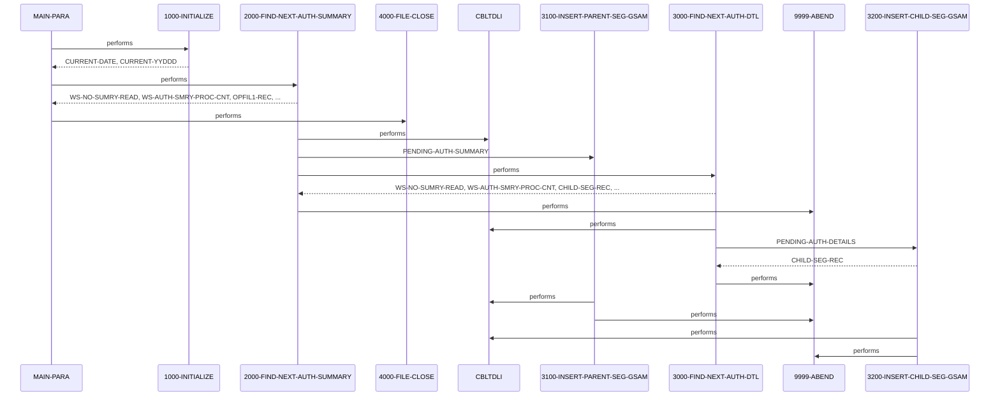

# DBUNLDGS

**File**: `cbl/DBUNLDGS.CBL`
**Type**: FileType.COBOL
**Analyzed**: 2026-02-09 15:45:49.197084

## Purpose

The COBOL program DBUNLDGS unloads data from an IMS database related to pending authorizations and writes it to GSAM datasets. It retrieves pending authorization summary records and their associated detail records, then inserts these records into GSAM files.

**Business Context**: UNKNOWN

## Inputs

| Name | Type | Description |
|------|------|-------------|
| IMS Database (PAUTBPCB) | IOType.IMS_SEGMENT | Pending authorization summary and detail segments are read from the IMS database. |
| SYSIN | IOType.PARAMETER | Input parameters such as expiry days, checkpoint frequency, and debug flag.  This is commented out. |

## Outputs

| Name | Type | Description |
|------|------|-------------|
| PASFLPCB | IOType.FILE_SEQUENTIAL | GSAM output file containing pending authorization summary segments. |
| PADFLPCB | IOType.FILE_SEQUENTIAL | GSAM output file containing pending authorization detail segments. |

## Called Programs

| Program | Call Type | Purpose |
|---------|-----------|---------|
| CBLTDLI | CallType.STATIC_CALL | Interface with IMS DL/I to retrieve and insert database segments. |

## Business Rules

- **BR001**: Only write the summary record to the output file if the account ID is numeric.

## Paragraphs/Procedures

### MAIN-PARA
This is the main paragraph and entry point of the program. It orchestrates the entire process of unloading data from the IMS database and writing it to GSAM datasets. It first calls 1000-INITIALIZE to perform initial setup tasks such as accepting the current date and displaying program information. Then, it enters a loop that repeatedly calls 2000-FIND-NEXT-AUTH-SUMMARY to retrieve pending authorization summary records from the IMS database. This loop continues until the end of the database is reached, indicated by WS-END-OF-ROOT-SEG being set to 'Y'. Finally, it calls 4000-FILE-CLOSE to close the output files before terminating the program. The program uses PAUTBPCB, PASFLPCB, and PADFLPCB from the linkage section.

### 1000-INITIALIZE
This paragraph performs initialization tasks required before the main processing loop. It accepts the current date and day from the system. It displays program start messages including the current date. The paragraph also contains commented-out code to accept parameters from SYSIN and to open the output files OPFILE1 and OPFILE2, with error handling for file open failures. The file opening and parameter acceptance are currently disabled. It consumes no specific inputs other than system date/time. It produces no direct outputs other than displaying messages to the console. It does not implement any business logic or error handling beyond the commented-out file open checks. It does not call any other paragraphs.

### 2000-FIND-NEXT-AUTH-SUMMARY
This paragraph retrieves the next pending authorization summary record from the IMS database. It initializes the PAUT-PCB-STATUS and then calls 'CBLTDLI' with the FUNC-GN (Get Next) function to retrieve the next summary segment using the PAUTBPCB PCB and the ROOT-UNQUAL-SSA. If the call is successful (PAUT-PCB-STATUS = SPACES), it increments counters, moves the retrieved data to OPFIL1-REC, and calls 3100-INSERT-PARENT-SEG-GSAM to insert the summary record into the GSAM file. It then calls 3000-FIND-NEXT-AUTH-DTL to retrieve the child segments. If the PA-ACCT-ID is numeric, the paragraph writes the summary record to the GSAM file. If the end of the database is reached (PAUT-PCB-STATUS = 'GB'), it sets the WS-END-OF-ROOT-SEG flag to 'Y'. If any other error occurs during the IMS call, it displays an error message and abends the program. The paragraph consumes data from the IMS database via the PAUTBPCB PCB and writes to OPFIL1-REC and the GSAM file.

### 3000-FIND-NEXT-AUTH-DTL
This paragraph retrieves the next pending authorization detail record (child segment) associated with the current summary record. It calls 'CBLTDLI' with the FUNC-GNP (Get Next within Parent) function to retrieve the next detail segment using the PAUTBPCB PCB and the CHILD-UNQUAL-SSA. If the call is successful (PAUT-PCB-STATUS = SPACES), it sets the MORE-AUTHS flag to TRUE, increments counters, and moves the retrieved data to CHILD-SEG-REC. It then calls 3200-INSERT-CHILD-SEG-GSAM to insert the detail record into the GSAM file. If there are no more detail segments (PAUT-PCB-STATUS = 'GE'), it sets the WS-END-OF-CHILD-SEG flag to 'Y'. If any other error occurs during the IMS call, it displays an error message and abends the program. The paragraph consumes data from the IMS database via the PAUTBPCB PCB and writes to CHILD-SEG-REC and the GSAM file.

### 3100-INSERT-PARENT-SEG-GSAM
This paragraph inserts the pending authorization summary segment into the GSAM dataset. It calls 'CBLTDLI' with the FUNC-ISRT (Insert) function, using the PASFLPCB PCB and the PENDING-AUTH-SUMMARY data. If the call is not successful (PASFL-PCB-STATUS is not equal to spaces), it displays an error message and abends the program. This paragraph is called by 2000-FIND-NEXT-AUTH-SUMMARY after a summary record is read from the IMS database. It consumes the PENDING-AUTH-SUMMARY data and writes to the GSAM dataset associated with PASFLPCB. It does not implement any business logic beyond the IMS call. It handles errors by checking the PASFL-PCB-STATUS and abending if the insert fails.

### 3200-INSERT-CHILD-SEG-GSAM
This paragraph inserts the pending authorization detail segment into the GSAM dataset. It calls 'CBLTDLI' with the FUNC-ISRT (Insert) function, using the PADFLPCB PCB and the PENDING-AUTH-DETAILS data. If the call is not successful (PADFL-PCB-STATUS is not equal to spaces), it displays an error message and abends the program. This paragraph is called by 3000-FIND-NEXT-AUTH-DTL after a detail record is read from the IMS database. It consumes the PENDING-AUTH-DETAILS data and writes to the GSAM dataset associated with PADFLPCB. It does not implement any business logic beyond the IMS call. It handles errors by checking the PADFL-PCB-STATUS and abending if the insert fails.

### 4000-FILE-CLOSE
This paragraph closes the output files. It displays a message indicating that the files are being closed. The actual CLOSE statements for OPFILE1 and OPFILE2 are commented out. It checks the file status after closing (also commented out) and displays an error message if the close operation fails. This paragraph is called by MAIN-PARA after all records have been processed. It consumes no specific inputs and produces no direct outputs other than displaying messages to the console. The error handling is currently disabled due to the commented-out CLOSE statements.

### 9999-ABEND
This paragraph handles program termination due to an error. It displays a message indicating that the program is abending. It sets the RETURN-CODE to 16 and then terminates the program using GOBACK. This paragraph is called by various other paragraphs when an unrecoverable error condition is encountered, such as a failed IMS call or a file I/O error. It consumes no specific inputs and produces no direct outputs other than displaying a message to the console and setting the return code. It does not implement any business logic beyond setting the return code and terminating the program.

## Control Flow

## Open Questions

- ? What is the purpose of the commented-out code related to OPFILE1 and OPFILE2?
  - Context: The code suggests the program was intended to write to sequential files, but this functionality is disabled.
- ? What is the structure and purpose of the GSAM datasets defined by PASFLPCB and PADFLPCB?
  - Context: The program inserts data into these datasets, but the specific format and usage are unclear.

## Sequence Diagram

