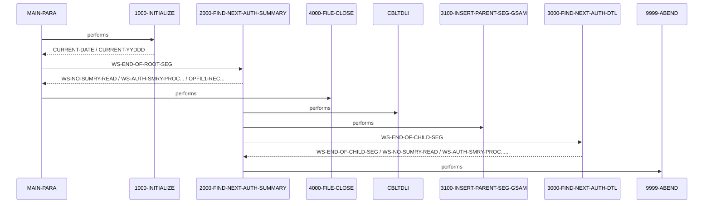

# DBUNLDGS

**File:** cbl/DBUNLDGS.CBL
**Type:** COBOL
**Status:** In Progress
**Iterations:** 1
**Analyzed:** 2026-03-04 03:39:32.077055

## Purpose

The COBOL program DBUNLDGS retrieves pending authorization summary and detail segments from an IMS database and writes them to output files. It uses the CBLTDLI call to interface with IMS and retrieve the data. The program initializes variables, retrieves the next authorization summary, and closes files before terminating.
**Program Type:** BATCH
**Citations:** Lines 17, 147, 172

## Calling Context

**Entry Points:** DLITCBL
**Linkage Section:** PAUTBPCB, PASFLPCB, PADFLPCB

## Inputs

### IMS Database
- **Type:** IMS_SEGMENT
- **Description:** Pending authorization summary and detail segments.
- **Lines:** 143, 147

### PAUTBPCB
- **Type:** PARAMETER
- **Description:** PAUTBPCB is a PCB mask passed to the program via the USING clause in the PROCEDURE DIVISION. It contains status information about the IMS database.
- **Copybook:** [PAUTBPCB](../copybooks/PAUTBPCB.cpy.md)
- **Lines:** 159, 134

### PASFLPCB
- **Type:** PARAMETER
- **Description:** PASFLPCB is a PCB mask passed to the program via the USING clause in the PROCEDURE DIVISION. It contains information about the IMS database.
- **Copybook:** [PASFLPCB](../copybooks/PASFLPCB.cpy.md)
- **Lines:** 160, 1341000

### PADFLPCB
- **Type:** PARAMETER
- **Description:** PADFLPCB is a PCB mask passed to the program via the USING clause in the PROCEDURE DIVISION. It contains information about the IMS database.
- **Copybook:** [PADFLPCB](../copybooks/PADFLPCB.cpy.md)
- **Lines:** 161, 1342000

## Outputs

### OPFILE1
- **Type:** FILE_SEQUENTIAL
- **Description:** Output file containing data, format unknown as file definition is commented out.

### OPFILE2
- **Type:** FILE_SEQUENTIAL
- **Description:** Output file containing data, format unknown as file definition is commented out.

## Called Programs

| Program | Call Type | Purpose | Line |
|---------|-----------|---------|------|
| [CBLTDLI](./CBLTDLI.cbl.md) | STATIC_CALL | Interface with IMS to retrieve database segments. | 197 |

## Copybooks Used

| Copybook | Location | Purpose | Line |
|----------|----------|---------|------|
| [IMSFUNCS](../copybooks/IMSFUNCS.cpy.md) | WORKING_STORAGE | Contains definitions for IMS function codes. | 116 |
| [CIPAUSMY](../copybooks/CIPAUSMY.cpy.md) | WORKING_STORAGE | Defines the layout of the PENDING-AUTH-SUMMARY segment. | 123 |
| [CIPAUDTY](../copybooks/CIPAUDTY.cpy.md) | WORKING_STORAGE | Defines the layout of the PENDING-AUTH-DETAILS segment. | 127 |
| [PAUTBPCB](../copybooks/PAUTBPCB.cpy.md) | LINKAGE | Defines the PCB mask for the PAUT database. | 134 |
| [PASFLPCB](../copybooks/PASFLPCB.cpy.md) | LINKAGE | Defines the PCB mask for an unknown database. | 1341000 |
| [PADFLPCB](../copybooks/PADFLPCB.cpy.md) | LINKAGE | Defines the PCB mask for an unknown database. | 1342000 |

## Data Flow

### Reads From
- **IMS Database (PAUTSUM0, PAUTDTL1)**: All fields in PENDING-AUTH-SUMMARY (CIPAUSMY copybook), All fields in PENDING-AUTH-DETAILS (CIPAUDTY copybook)
  (Lines: 143, 147, 199)

### Writes To
- **OPFILE1**: OPFIL1-REC
- **OPFILE2**: ROOT-SEG-KEY, CHILD-SEG-REC

## Key Paragraphs

### MAIN-PARA
**Purpose:** This is the main paragraph of the program. It serves as the entry point ('DLITCBL') and orchestrates the overall program flow. It first performs the 1000-INITIALIZE paragraph to set up the program environment, including accepting the current date. Then, it enters a loop that repeatedly performs the 2000-FIND-NEXT-AUTH-SUMMARY paragraph to retrieve and process authorization summary records from the IMS database until the end of the root segment is reached (WS-END-OF-ROOT-SEG = 'Y'). After processing all summary records, it performs the 4000-FILE-CLOSE paragraph to close the output files. Finally, the program terminates using the GOBACK statement.
- Calls: 1000-INITIALIZE, 2000-FIND-NEXT-AUTH-SUMMARY, 4000-FILE-CLOSE
- Lines: 141-179

### 1000-INITIALIZE
**Purpose:** This paragraph initializes the program environment. It accepts the current date and current Julian date from the system. It then displays the program name and current date to the console. The paragraph contains commented-out code to accept parameters from SYSIN and to open output files OPFILE1 and OPFILE2, including error handling for the file opens. However, the file opening logic is currently disabled.
- Called by: MAIN-PARA
- Lines: 157-213

### 2000-FIND-NEXT-AUTH-SUMMARY
**Purpose:** This paragraph retrieves the next pending authorization summary segment from the IMS database. It initializes the PAUT-PCB-STATUS field and then calls the CBLTDLI routine with the 'GN' (Get Next) function code to retrieve the next segment. The retrieved segment is stored in the PENDING-AUTH-SUMMARY data structure. The paragraph uses the ROOT-UNQUAL-SSA as the Segment Search Argument (SSA) for the root segment. The paragraph also contains commented-out DISPLAY statements for debugging purposes, which would display the PCB status and segment level after the IMS call.
- Called by: MAIN-PARA
- Lines: 191-230

### 4000-FILE-CLOSE
**Purpose:** This paragraph is intended to close the output files. However, the code for closing the files is currently missing. Therefore, this paragraph currently performs no actions.
- Called by: MAIN-PARA
- Lines: 150-150

## Inter-Paragraph Data Flow

| Caller | Callee | Inputs | Outputs | Purpose |
|--------|--------|--------|---------|---------|
| MAIN-PARA | 1000-INITIALIZE | - | CURRENT-DATE, CURRENT-YYDDD | Initializes program by accepting current date and displaying startup messages. |
| MAIN-PARA | 2000-FIND-NEXT-AUTH-SUMMARY | WS-END-OF-ROOT-SEG | WS-NO-SUMRY-READ, WS-AUTH-SMRY-PROC-CNT, OPFIL1-REC, ROOT-SEG-KEY, CHILD-SEG-REC, WS-END-OF-AUTHDB, WS-END-OF-ROOT-SEG | Reads the next authorization summary from IMS, updates counters, and processes associated details if account ID is numeric. |
| MAIN-PARA | 4000-FILE-CLOSE | - | - | Displays a message indicating the file closing process. |
| 2000-FIND-NEXT-AUTH-SUMMARY | 3100-INSERT-PARENT-SEG-GSAM | - | - | Inserts the parent authorization segment into GSAM file using IMS call and abends on failure. |
| 2000-FIND-NEXT-AUTH-SUMMARY | 3000-FIND-NEXT-AUTH-DTL | WS-END-OF-CHILD-SEG | WS-END-OF-CHILD-SEG, WS-NO-SUMRY-READ, WS-AUTH-SMRY-PROC-CNT, CHILD-SEG-REC | Finds the next authorization detail segment for the current parent and inserts it into GSAM, setting end-of-child flag when no more exist. |
| 2000-FIND-NEXT-AUTH-SUMMARY | 9999-ABEND | - | - | Terminates the program with return code 16 when an IMS database call fails unexpectedly. |
| 3000-FIND-NEXT-AUTH-DTL | 3200-INSERT-CHILD-SEG-GSAM | PENDING-AUTH-DETAILS | PADFL-PCB-STATUS, PADFL-KEYFB | Inserts the current authorization detail record into the GSAM output file using IMS DL/I call. |
| 3000-FIND-NEXT-AUTH-DTL | 9999-ABEND | - | - | Terminates the program with return code 16 when a GNP call to retrieve the next child segment fails. |
| 3100-INSERT-PARENT-SEG-GSAM | 9999-ABEND | - | - | Terminates the program with return code 16 when an ISRT call to insert a parent segment into GSAM fails. |
| 3200-INSERT-CHILD-SEG-GSAM | 9999-ABEND | - | - | Terminates the program with return code 16 when an ISRT call to insert a child segment into GSAM fails. |

## Open Questions

- **What is the purpose of PASFLPCB and PADFLPCB?**
  - Context: The program includes copybooks PASFLPCB and PADFLPCB in the linkage section, but they are not used in the PROCEDURE DIVISION. Their purpose is unclear.
  - Suggestion: Examine other programs that call this program or related documentation to determine the purpose of these PCBs.

## Resolved Questions

- **Q:** What is the purpose of the 4000-FILE-CLOSE paragraph?
  **A:** The purpose of the 4000-FILE-CLOSE paragraph in DBUNLDGS.CBL is to close the output file. Based on the code snippet, it displays a message 'CLOSING THE FILE'. The CLOSE statement for OPFILE1 is commented out.
- **Q:** What is the purpose of the commented out ACCEPT PRM-INFO FROM SYSIN statement?
  **A:** The commented-out statement `ACCEPT PRM-INFO FROM SYSIN` in `DBUNLDGS.CBL` likely intended to read parameters from the system input (SYSIN). Since it's commented out, the program is not currently using this input method. The program might have been designed to receive runtime parameters via SYSIN, but this functionality is disabled.
- **Q:** What is the format of the output files OPFILE1 and OPFILE2?
  **A:** The code related to the file definitions is commented out, but it gives some clues.

OPFILE1 appears to be a sequential file with records of 100 bytes:
```cobol
*FD OPFILE1.
*01 OPFIL1-REC                    PIC X(100).
```

OPFILE2 appears to be a sequential file with a more complex record structure:
```cobol
*FD OPFILE2.
*01 OPFIL2-REC.
*   05 ROOT-SEG-KEY               PIC S9(11) COMP-3.
*   05 CHILD-SEG-REC              PIC X(200).
```
This suggests that OPFILE2 contains records with a COMP-3 key and a 200-byte character field.

Therefore, the answer is:

OPFILE1: Sequential file, 100-byte records.
OPFILE2: Sequential file, records containing a COMP-3 key and a 200-byte character field.

## Sequence Diagram


```mermaid
sequenceDiagram
    participant MAIN_PARA as MAIN-PARA
    participant 1000_INITIALIZE as 1000-INITIALIZE
    participant 2000_FIND_NEXT_AUTH_SUMMARY as 2000-FIND-NEXT-AUTH-SUMMARY
    participant 4000_FILE_CLOSE as 4000-FILE-CLOSE
    participant CBLTDLI as CBLTDLI
    participant 3100_INSERT_PARENT_SEG_GSAM as 3100-INSERT-PARENT-SEG-GSAM
    participant 3000_FIND_NEXT_AUTH_DTL as 3000-FIND-NEXT-AUTH-DTL
    participant 9999_ABEND as 9999-ABEND
    MAIN_PARA->>1000_INITIALIZE: performs
    1000_INITIALIZE-->>MAIN_PARA: CURRENT-DATE / CURRENT-YYDDD
    MAIN_PARA->>2000_FIND_NEXT_AUTH_SUMMARY: WS-END-OF-ROOT-SEG
    2000_FIND_NEXT_AUTH_SUMMARY-->>MAIN_PARA: WS-NO-SUMRY-READ / WS-AUTH-SMRY-PROC... / OPFIL1-REC...
    MAIN_PARA->>4000_FILE_CLOSE: performs
    2000_FIND_NEXT_AUTH_SUMMARY->>CBLTDLI: performs
    2000_FIND_NEXT_AUTH_SUMMARY->>3100_INSERT_PARENT_SEG_GSAM: performs
    2000_FIND_NEXT_AUTH_SUMMARY->>3000_FIND_NEXT_AUTH_DTL: WS-END-OF-CHILD-SEG
    3000_FIND_NEXT_AUTH_DTL-->>2000_FIND_NEXT_AUTH_SUMMARY: WS-END-OF-CHILD-SEG / WS-NO-SUMRY-READ / WS-AUTH-SMRY-PROC......
    2000_FIND_NEXT_AUTH_SUMMARY->>9999_ABEND: performs
```

---
*Generated by War Rig WAR_RIG*