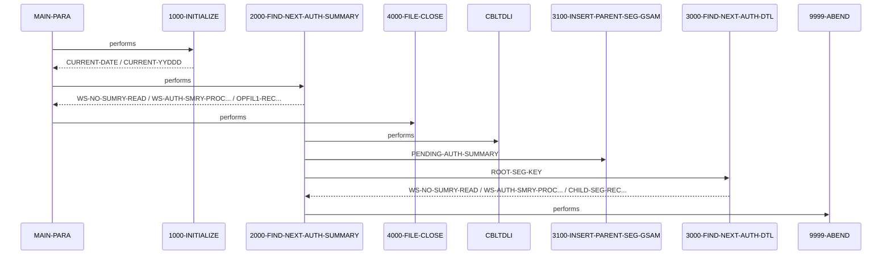

# DBUNLDGS

**File:** cbl/DBUNLDGS.CBL
**Type:** COBOL
**Status:** In Progress
**Iterations:** 1
**Analyzed:** 2026-03-04 04:47:36.242633

## Purpose

The COBOL program DBUNLDGS is designed to unload data from an IMS database related to pending authorizations. It retrieves pending authorization summary segments (root) and detail segments (child) and writes them to output files. The program uses IMS calls to navigate the database and extract the required data.

**Business Context:** This program likely supports auditing, reporting, or data migration related to pending authorization processes within a larger system.
**Program Type:** BATCH
**Citations:** Lines 18, 147, 222

## Calling Context

**Entry Points:** DLITCBL
**Linkage Section:** PAUTBPCB, PASFLPCB, PADFLPCB

## Inputs

### IMS Database
- **Type:** IMS_SEGMENT
- **Description:** Pending Authorization Summary (root segment PAUTSUM0) and Detail (child segment PAUTDTL1) segments from an IMS database.
- **Copybook:** [CIPAUSMY, CIPAUDTY](../copybooks/CIPAUSMY, CIPAUDTY.cpy.md)
- **Lines:** 224, 225

### PAUTBPCB
- **Type:** PARAMETER
- **Description:** The Pending Authorization Database PCB (Program Communication Block) mask, used for IMS database access.
- **Copybook:** [PAUTBPCB](../copybooks/PAUTBPCB.cpy.md)
- **Lines:** 159, 165

### PASFLPCB
- **Type:** PARAMETER
- **Description:** The Pending Authorization Summary File PCB mask.
- **Copybook:** [PASFLPCB](../copybooks/PASFLPCB.cpy.md)
- **Lines:** 160, 166

### PADFLPCB
- **Type:** PARAMETER
- **Description:** The Pending Authorization Detail File PCB mask.
- **Copybook:** [PADFLPCB](../copybooks/PADFLPCB.cpy.md)
- **Lines:** 161, 167

## Outputs

### OPFILE1
- **Type:** FILE_SEQUENTIAL
- **Description:** Output file containing data extracted from the IMS PAUTSUM0 segment.  The FD and OPEN statements are commented out, so it is unclear if this file is actually used.

### OPFILE2
- **Type:** FILE_SEQUENTIAL
- **Description:** Output file containing data extracted from the IMS PAUTDTL1 segment. The FD and OPEN statements are commented out, so it is unclear if this file is actually used.

## Called Programs

| Program | Call Type | Purpose | Line |
|---------|-----------|---------|------|
| [CBLTDLI](./CBLTDLI.cbl.md) | STATIC_CALL | Issue IMS DL/I calls to retrieve segments from the IMS database. | 197 |

## Copybooks Used

| Copybook | Location | Purpose | Line |
|----------|----------|---------|------|
| [IMSFUNCS](../copybooks/IMSFUNCS.cpy.md) | WORKING_STORAGE | Contains definitions for IMS function codes used in DL/I calls. | 116 |
| [CIPAUSMY](../copybooks/CIPAUSMY.cpy.md) | WORKING_STORAGE | Defines the layout of the PENDING-AUTH-SUMMARY segment (root segment). | 123 |
| [CIPAUDTY](../copybooks/CIPAUDTY.cpy.md) | WORKING_STORAGE | Defines the layout of the PENDING-AUTH-DETAILS segment (child segment). | 127 |
| [PAUTBPCB](../copybooks/PAUTBPCB.cpy.md) | LINKAGE | Defines the structure of the PAUTBPCB (Pending Authorization Batch PCB). | 134 |
| [PASFLPCB](../copybooks/PASFLPCB.cpy.md) | LINKAGE | Defines the structure of the PASFLPCB (Pending Authorization Summary File PCB). | 13410 |
| [PADFLPCB](../copybooks/PADFLPCB.cpy.md) | LINKAGE | Defines the structure of the PADFLPCB (Pending Authorization Detail File PCB). | 13420 |

## Data Flow

### Reads From
- **IMS Database (PAUTSUM0)**: all fields
  (Lines: 224)
- **IMS Database (PAUTDTL1)**: all fields

### Writes To
- **OPFILE1**: all fields
- **OPFILE2**: all fields

## Key Paragraphs

### MAIN-PARA
**Purpose:** This is the main paragraph of the program, serving as the entry point and orchestrating the overall process. It first performs 1000-INITIALIZE to set up the program environment, accepting the current date and displaying startup messages. Then, it enters a loop, repeatedly performing 2000-FIND-NEXT-AUTH-SUMMARY to retrieve and process pending authorization summary segments from the IMS database. The loop continues until the end of the root segment is reached, indicated by WS-END-OF-ROOT-SEG being set to 'Y'. Finally, it performs 4000-FILE-CLOSE to close the output files (although these are commented out) before terminating the program with a GOBACK statement. The entry point 'DLITCBL' is defined here, using the PCBs in the linkage section.
- Calls: 1000-INITIALIZE, 2000-FIND-NEXT-AUTH-SUMMARY, 4000-FILE-CLOSE
- Lines: 141-179

### 1000-INITIALIZE
**Purpose:** This paragraph initializes the program environment. It accepts the current date and day from the system and stores them in WS-VARIABLES. It then displays a series of messages to the console, including the program name and the current date. The paragraph also contains commented-out code to accept parameters from SYSIN and open output files OPFILE1 and OPFILE2, with error handling for file open failures that would lead to an ABEND. However, since the file operations are commented out, this paragraph primarily focuses on displaying initial messages and setting up date variables.
- Called by: MAIN-PARA
- Lines: 157-213

### 2000-FIND-NEXT-AUTH-SUMMARY
**Purpose:** This paragraph is responsible for retrieving the next pending authorization summary segment from the IMS database. It initializes the PAUT-PCB-STATUS field and then calls the CBLTDLI routine with the 'GN' (Get Next) function code to retrieve the next segment. The PCB (PAUTBPCB), the segment layout (PENDING-AUTH-SUMMARY), and the unqualified SSA (ROOT-UNQUAL-SSA) are passed as parameters to the CBLTDLI call. After the IMS call, the paragraph contains commented-out DISPLAY statements to output debugging information, such as the segment level, PCB status, and segment name. The paragraph sets WS-END-OF-ROOT-SEG to 'Y' when the end of the database is reached (PAUT-PCB-STATUS = 'GB').
- Called by: MAIN-PARA
- Calls: CBLTDLI
- Lines: 191-231

### 4000-FILE-CLOSE
**Purpose:** This paragraph is intended to close the output files (OPFILE1 and OPFILE2). However, the actual CLOSE statements are commented out. Therefore, this paragraph effectively does nothing. If the CLOSE statements were active, they would include error checking on the file status after the close operation, and call 9999-ABEND if an error occurred.
- Called by: MAIN-PARA
- Lines: 150-150

## Inter-Paragraph Data Flow

| Caller | Callee | Inputs | Outputs | Purpose |
|--------|--------|--------|---------|---------|
| MAIN-PARA | 1000-INITIALIZE | - | CURRENT-DATE, CURRENT-YYDDD | Initializes the program by accepting the current date and displaying startup messages. |
| MAIN-PARA | 2000-FIND-NEXT-AUTH-SUMMARY | - | WS-NO-SUMRY-READ, WS-AUTH-SMRY-PROC-CNT, OPFIL1-REC, ROOT-SEG-KEY, CHILD-SEG-REC, WS-END-OF-ROOT-SEG, WS-END-OF-AUTHDB | Reads the next authorization summary from IMS, updates counters, and processes associated details if the account ID is numeric. |
| MAIN-PARA | 4000-FILE-CLOSE | - | - | Displays a message indicating the file is being closed before program termination. |
| 2000-FIND-NEXT-AUTH-SUMMARY | 3100-INSERT-PARENT-SEG-GSAM | PENDING-AUTH-SUMMARY | - | Inserts the parent authorization summary segment into the GSAM file and abends if the insertion fails. |
| 2000-FIND-NEXT-AUTH-SUMMARY | 3000-FIND-NEXT-AUTH-DTL | ROOT-SEG-KEY | WS-NO-SUMRY-READ, WS-AUTH-SMRY-PROC-CNT, CHILD-SEG-REC, WS-END-OF-CHILD-SEG, WS-MORE-AUTHS-FLAG | Retrieves the next authorization detail segment for the current parent and inserts it into GSAM, setting end-of-child flag when no more exist. |
| 2000-FIND-NEXT-AUTH-SUMMARY | 9999-ABEND | - | - | Terminates the program with a return code of 16 when an IMS GN call for auth summary fails. |
| 3000-FIND-NEXT-AUTH-DTL | 3200-INSERT-CHILD-SEG-GSAM | PENDING-AUTH-DETAILS | CHILD-SEG-REC | Writes the current authorization detail record to the GSAM output file after retrieving it from IMS. |
| 3000-FIND-NEXT-AUTH-DTL | 9999-ABEND | - | - | Terminates the program with a return code of 16 when an IMS GNP call for auth detail fails. |
| 3100-INSERT-PARENT-SEG-GSAM | 9999-ABEND | - | - | Terminates the program with a return code of 16 when inserting a parent segment into GSAM fails. |
| 3200-INSERT-CHILD-SEG-GSAM | 9999-ABEND | - | - | Terminates the program with a return code of 16 when inserting a child segment into GSAM fails. |

## Error Handling

- **IMS call returns non-zero status in PAUT-PCB-STATUS:** The program continues processing, but the specific error handling for different IMS status codes is not explicitly defined in the provided code snippet.
  (Lines: 204, 207)

## Open Questions

- **What are the exact IMS function codes defined in the IMSFUNCS copybook?**
  - Context: The program calls CBLTDLI using FUNC-GN, but the definition of FUNC-GN is in the IMSFUNCS copybook, which is not provided.  The exact value of FUNC-GN is needed to fully understand the IMS call.
  - Suggestion: Obtain the IMSFUNCS copybook to determine the value of FUNC-GN.

## Resolved Questions

- **Q:** What is the purpose of the PASFLPCB and PADFLPCB PCBs, given that the file I/O operations are commented out?
  **A:** The PCBs `PASFLPCB` and `PADFLPCB` are used for IMS database calls, specifically with GSAM (Generalized Sequential Access Method). Even though the file I/O operations are commented out, the program still uses these PCBs when inserting segments into the GSAM dataset.

`PASFLPCB` is used in conjunction with the `PENDING-AUTH-SUMMARY` segment in paragraph `3100-INSERT-PARENT-SEG-GSAM`.
`PADFLPCB` is used in conjunction with the `PENDING-AUTH-DETAILS` segment in paragraph `3200-INSERT-CHILD-SEG-GSAM`.

These PCBs are passed to the `CBLTDLI` call, which is the IMS call interface. The PCB contains status information and other details about the IMS call. The commented-out `DISPLAY` statements suggest that the programmer intended to monitor the values within these PCBs for debugging purposes, specifically the database name (`DBDNAME`) and processing options (`PROCOPT` or `PCB-STATUS`).

## Sequence Diagram

```mermaid
sequenceDiagram
    participant MAIN_PARA as MAIN-PARA
    participant 1000_INITIALIZE as 1000-INITIALIZE
    participant 2000_FIND_NEXT_AUTH_SUMMARY as 2000-FIND-NEXT-AUTH-SUMMARY
    participant 4000_FILE_CLOSE as 4000-FILE-CLOSE
    participant CBLTDLI as CBLTDLI
    participant 3100_INSERT_PARENT_SEG_GSAM as 3100-INSERT-PARENT-SEG-GSAM
    participant 3000_FIND_NEXT_AUTH_DTL as 3000-FIND-NEXT-AUTH-DTL
    participant 9999_ABEND as 9999-ABEND
    MAIN_PARA->>1000_INITIALIZE: performs
    1000_INITIALIZE-->>MAIN_PARA: CURRENT-DATE / CURRENT-YYDDD
    MAIN_PARA->>2000_FIND_NEXT_AUTH_SUMMARY: performs
    2000_FIND_NEXT_AUTH_SUMMARY-->>MAIN_PARA: WS-NO-SUMRY-READ / WS-AUTH-SMRY-PROC... / OPFIL1-REC...
    MAIN_PARA->>4000_FILE_CLOSE: performs
    2000_FIND_NEXT_AUTH_SUMMARY->>CBLTDLI: performs
    2000_FIND_NEXT_AUTH_SUMMARY->>3100_INSERT_PARENT_SEG_GSAM: PENDING-AUTH-SUMMARY
    2000_FIND_NEXT_AUTH_SUMMARY->>3000_FIND_NEXT_AUTH_DTL: ROOT-SEG-KEY
    3000_FIND_NEXT_AUTH_DTL-->>2000_FIND_NEXT_AUTH_SUMMARY: WS-NO-SUMRY-READ / WS-AUTH-SMRY-PROC... / CHILD-SEG-REC...
    2000_FIND_NEXT_AUTH_SUMMARY->>9999_ABEND: performs
```

---
*Generated by War Rig WAR_RIG*