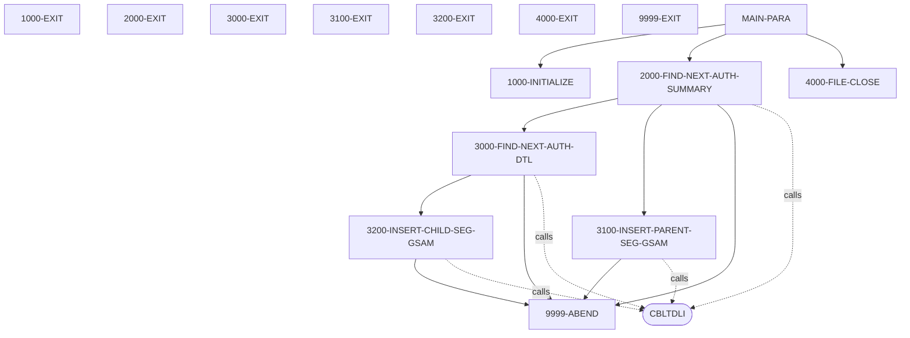

# DBUNLDGS

**File**: `cbl/DBUNLDGS.CBL`
**Type**: FileType.COBOL
**Analyzed**: 2026-04-21 13:50:15.048348

## Purpose

The COBOL program DBUNLDGS extracts data from an IMS database related to pending authorizations and writes it to sequential output files. It reads pending authorization summary segments (root) and their corresponding detail segments (child) from the IMS database, and outputs them to OPFILE1 and OPFILE2 respectively, after some basic validation. The program uses the CBLTDLI interface to interact with the IMS database.

**Business Context**: This program likely supports data migration, reporting, or auditing of pending authorization records within a financial or similar institution.

## Inputs

| Name | Type | Description |
|------|------|-------------|
| IMS Database (PAUTSUM0, PAUTDTL1) | IOType.IMS_SEGMENT | Pending Authorization Summary (root segment PAUTSUM0) and Detail (child segment PAUTDTL1) segments from an IMS database. |
| PAUTBPCB | IOType.PARAMETER | The database PCB (Program Communication Block) for the PAUTSUM0 segment. |
| PASFLPCB | IOType.PARAMETER | The database PCB (Program Communication Block) for an unknown segment. |
| PADFLPCB | IOType.PARAMETER | The database PCB (Program Communication Block) for an unknown segment. |

## Outputs

| Name | Type | Description |
|------|------|-------------|
| OPFILE1 | IOType.FILE_SEQUENTIAL | Sequential file containing the extracted PENDING-AUTH-SUMMARY records. |
| OPFILE2 | IOType.FILE_SEQUENTIAL | Sequential file containing the extracted PENDING-AUTH-DETAILS records. |

## Called Programs

| Program | Call Type | Purpose |
|---------|-----------|---------|
| CBLTDLI | CallType.STATIC_CALL | Interface with IMS database to retrieve segments. |
| DLITCBL | CallType.STATIC_CALL | Entry point to the program. |

## Business Rules

- **BR001**: Only write the PENDING-AUTH-SUMMARY record to OPFILE1 if PA-ACCT-ID is numeric.
- **BR002**: The program reads the next root segment until the end of the database is reached, indicated by PAUT-PCB-STATUS = 'GB'.

## Paragraphs/Procedures

### MAIN-PARA
> [Source: MAIN-PARA.cbl.md](DBUNLDGS.CBL.d/MAIN-PARA.cbl.md)

```
MAIN-PARA  (5 statements, depth=1)
PARAGRAPH
├── UNKNOWN: ENTRY 'DLITCBL'                 USING PAUTBPCB
PASFLPCB
PADFLPCB
├── PERFORM_THRU: PERFORM 1000-INITIALIZE                THRU 1000-EXIT
├── PERFORM_THRU: PERFORM 2000-FIND-NEXT-AUTH-SUMMARY    THRU 2000-EXIT
UNTIL   WS-END-OF-ROOT-SEG = 'Y'
├── PERFORM_THRU: PERFORM 4000-FILE-CLOSE THRU 4000-EXIT
└── GOBACK: GOBACK
```
This is the main paragraph of the program, serving as the entry point and orchestrating the overall data extraction process. It first performs 1000-INITIALIZE to set up the program environment, including accepting the current date and displaying startup messages. Then, it enters a loop, controlled by the WS-END-OF-ROOT-SEG flag, that repeatedly calls 2000-FIND-NEXT-AUTH-SUMMARY to retrieve and process pending authorization summary segments from the IMS database. The 2000-FIND-NEXT-AUTH-SUMMARY paragraph retrieves the root segment and calls 3000-FIND-NEXT-AUTH-DTL to process child segments. Once all root segments have been processed (WS-END-OF-ROOT-SEG is set to 'Y'), the program performs 4000-FILE-CLOSE to close the output files. Finally, the program terminates using the GOBACK statement.

### 1000-INITIALIZE
> [Source: 1000-INITIALIZE.cbl.md](DBUNLDGS.CBL.d/1000-INITIALIZE.cbl.md)

```
1000-INITIALIZE  (6 statements, depth=1)
PARAGRAPH
├── ACCEPT: ACCEPT CURRENT-DATE     FROM DATE
├── ACCEPT: ACCEPT CURRENT-YYDDD    FROM DAY
├── DISPLAY: DISPLAY 'STARTING PROGRAM DBUNLDGS::'
├── DISPLAY: DISPLAY '*-------------------------------------*'
├── DISPLAY: DISPLAY 'TODAYS DATE            :' CURRENT-DATE
└── DISPLAY: DISPLAY ' '
```
This paragraph initializes the program environment. It accepts the current date and day from the system. It then displays a series of messages to the console, including the program name and the current date. The paragraph also contains commented-out code to open output files OPFILE1 and OPFILE2, with error handling to abend the program if the open fails. The purpose of this paragraph is to prepare the program for processing by setting up initial values and displaying informational messages, but the file opening functionality is currently disabled.

### 2000-FIND-NEXT-AUTH-SUMMARY
> [Source: 2000-FIND-NEXT-AUTH-SUMMARY.cbl.md](DBUNLDGS.CBL.d/2000-FIND-NEXT-AUTH-SUMMARY.cbl.md)

```
2000-FIND-NEXT-AUTH-SUMMARY  (20 statements, depth=3)
PARAGRAPH
├── INITIALIZE: INITIALIZE PAUT-PCB-STATUS
├── CALL: CALL 'CBLTDLI'            USING  FUNC-GN
PAUTBPCB
PENDING-AUTH-SUMMARY
ROOT-UNQUAL-SSA
├── IF: IF PAUT-PCB-STATUS = SPACES
│   ├── ADD: ADD 1                 TO WS-NO-SUMRY-READ
│   ├── ADD: ADD 1                 TO WS-AUTH-SMRY-PROC-CNT
│   ├── MOVE: MOVE PENDING-AUTH-SUMMARY TO OPFIL1-REC
│   ├── INITIALIZE: INITIALIZE ROOT-SEG-KEY
│   ├── INITIALIZE: INITIALIZE CHILD-SEG-REC
│   ├── MOVE: MOVE PA-ACCT-ID           TO ROOT-SEG-KEY
│   └── IF: IF PA-ACCT-ID IS NUMERIC
│       ├── PERFORM_THRU: PERFORM 3100-INSERT-PARENT-SEG-GSAM THRU 3100-EXIT
│       ├── INITIALIZE: INITIALIZE WS-END-OF-CHILD-SEG
│       └── PERFORM_THRU: PERFORM 3000-FIND-NEXT-AUTH-DTL THRU 3000-EXIT
UNTIL  WS-END-OF-CHILD-SEG='Y'
├── IF: IF PAUT-PCB-STATUS = 'GB'
│   ├── SET: SET END-OF-AUTHDB     TO TRUE
│   └── MOVE: MOVE 'Y' TO WS-END-OF-ROOT-SEG
└── IF: IF PAUT-PCB-STATUS NOT EQUAL TO  SPACES AND 'GB'
    ├── DISPLAY: DISPLAY 'AUTH SUM  GN FAILED  :' PAUT-PCB-STATUS
    ├── DISPLAY: DISPLAY 'KEY FEEDBACK AREA    :' PAUT-KEYFB
    └── PERFORM: PERFORM 9999-ABEND
```
This paragraph retrieves the next pending authorization summary segment (root segment) from the IMS database. It initializes the PAUT-PCB-STATUS, then calls the CBLTDLI routine with the 'GN' (Get Next) function to retrieve the next segment. The program uses ROOT-UNQUAL-SSA as the SSA. If the call is successful (PAUT-PCB-STATUS is spaces), it increments counters for summary records read and processed, moves the retrieved summary data to OPFIL1-REC, and extracts the account ID (PA-ACCT-ID) to be used as the root segment key. It then calls 3100-INSERT-PARENT-SEG-GSAM to write the parent segment to OPFILE1, and then calls 3000-FIND-NEXT-AUTH-DTL to process the child segments associated with the current root segment, looping until all child segments are processed. If the PAUT-PCB-STATUS is 'GB' (end of database), it sets the END-OF-AUTHDB flag to TRUE and sets WS-END-OF-ROOT-SEG to 'Y' to terminate the main processing loop. If any other error occurs during the IMS call, it displays an error message and abends the program.

### 3000-FIND-NEXT-AUTH-DTL
> [Source: 3000-FIND-NEXT-AUTH-DTL.cbl.md](DBUNLDGS.CBL.d/3000-FIND-NEXT-AUTH-DTL.cbl.md)

```
3000-FIND-NEXT-AUTH-DTL  (15 statements, depth=2)
PARAGRAPH
├── CALL: CALL 'CBLTDLI'            USING  FUNC-GNP
PAUTBPCB
PENDING-AUTH-DETAILS
CHILD-UNQUAL-SSA
├── IF: IF PAUT-PCB-STATUS = SPACES
│   ├── SET: SET MORE-AUTHS       TO TRUE
│   ├── ADD: ADD 1                 TO WS-NO-SUMRY-READ
│   ├── ADD: ADD 1                 TO WS-AUTH-SMRY-PROC-CNT
│   ├── MOVE: MOVE PENDING-AUTH-DETAILS TO CHILD-SEG-REC
│   └── PERFORM_THRU: PERFORM 3200-INSERT-CHILD-SEG-GSAM THRU 3200-EXIT
├── IF: IF PAUT-PCB-STATUS = 'GE'
│   ├── MOVE: MOVE 'Y' TO WS-END-OF-CHILD-SEG
│   └── DISPLAY: DISPLAY 'CHILD SEG FLAG GE : '
WS-END-OF-CHILD-SEG
├── IF: IF PAUT-PCB-STATUS NOT EQUAL TO  SPACES AND 'GE'
│   ├── DISPLAY: DISPLAY 'GNP CALL FAILED  :' PAUT-PCB-STATUS
│   ├── DISPLAY: DISPLAY 'KFB AREA IN CHILD:' PAUT-KEYFB
│   └── PERFORM: PERFORM 9999-ABEND
└── INITIALIZE: INITIALIZE PAUT-PCB-STATUS
```
This paragraph's purpose is currently UNKNOWN. It is called by 2000-FIND-NEXT-AUTH-SUMMARY, suggesting it should retrieve and process the detail segments (child segments) associated with the current summary segment. However, the code for this paragraph is not provided in the extract. Therefore, it is impossible to determine what data it consumes, what outputs it produces, what business logic it implements, what error handling it performs, or what other paragraphs/programs it calls. Without the code, its functionality remains unclear.

### 3100-INSERT-PARENT-SEG-GSAM
> [Source: 3100-INSERT-PARENT-SEG-GSAM.cbl.md](DBUNLDGS.CBL.d/3100-INSERT-PARENT-SEG-GSAM.cbl.md)

```
3100-INSERT-PARENT-SEG-GSAM  (5 statements, depth=2)
PARAGRAPH
├── CALL: CALL 'CBLTDLI'       USING  FUNC-ISRT
PASFLPCB
PENDING-AUTH-SUMMARY
└── IF: IF PASFL-PCB-STATUS NOT EQUAL TO SPACES
    ├── DISPLAY: DISPLAY 'GSAM PARENT FAIL :' PASFL-PCB-STATUS
    ├── DISPLAY: DISPLAY 'KFB AREA IN GSAM:' PASFL-KEYFB
    └── PERFORM: PERFORM 9999-ABEND
```
This paragraph's purpose is to write the parent segment to OPFILE1. It is called by 2000-FIND-NEXT-AUTH-SUMMARY. However, the code for this paragraph is not provided in the extract. Therefore, it is impossible to determine what data it consumes, what outputs it produces, what business logic it implements, what error handling it performs, or what other paragraphs/programs it calls. Without the code, its functionality remains unclear.

### 4000-FILE-CLOSE
> [Source: 4000-FILE-CLOSE.cbl.md](DBUNLDGS.CBL.d/4000-FILE-CLOSE.cbl.md)

```
4000-FILE-CLOSE  (1 statements, depth=1)
PARAGRAPH
└── DISPLAY: DISPLAY 'CLOSING THE FILE'
```
This paragraph's purpose is to close the output files. However, the code for this paragraph is not provided in the extract. Therefore, it is impossible to determine what data it consumes, what outputs it produces, what business logic it implements, what error handling it performs, or what other paragraphs/programs it calls. Without the code, its functionality remains unclear.

## Control Flow


```mermaid
flowchart TD
    %% Title: DBUNLDGS.CBL
    1000_EXIT["1000-EXIT"]
    1000_INITIALIZE["1000-INITIALIZE"]
    2000_EXIT["2000-EXIT"]
    2000_FIND_NEXT_AUTH_SUMMARY["2000-FIND-NEXT-AUTH-SUMMARY"]
    3000_FIND_NEXT_AUTH_DTL["3000-FIND-NEXT-AUTH-DTL"]
    3100_INSERT_PARENT_SEG_GSAM["3100-INSERT-PARENT-SEG-GSAM"]
    9999_ABEND["9999-ABEND"]
    CBLTDLI__ext(["CBLTDLI"])
    3000_EXIT["3000-EXIT"]
    3200_INSERT_CHILD_SEG_GSAM["3200-INSERT-CHILD-SEG-GSAM"]
    3100_EXIT["3100-EXIT"]
    3200_EXIT["3200-EXIT"]
    4000_EXIT["4000-EXIT"]
    4000_FILE_CLOSE["4000-FILE-CLOSE"]
    9999_EXIT["9999-EXIT"]
    MAIN_PARA["MAIN-PARA"]
    2000_FIND_NEXT_AUTH_SUMMARY --> 3000_FIND_NEXT_AUTH_DTL
    2000_FIND_NEXT_AUTH_SUMMARY --> 3100_INSERT_PARENT_SEG_GSAM
    2000_FIND_NEXT_AUTH_SUMMARY --> 9999_ABEND
    2000_FIND_NEXT_AUTH_SUMMARY -.->|calls| CBLTDLI__ext
    3000_FIND_NEXT_AUTH_DTL --> 3200_INSERT_CHILD_SEG_GSAM
    3000_FIND_NEXT_AUTH_DTL --> 9999_ABEND
    3000_FIND_NEXT_AUTH_DTL -.->|calls| CBLTDLI__ext
    3100_INSERT_PARENT_SEG_GSAM --> 9999_ABEND
    3100_INSERT_PARENT_SEG_GSAM -.->|calls| CBLTDLI__ext
    3200_INSERT_CHILD_SEG_GSAM --> 9999_ABEND
    3200_INSERT_CHILD_SEG_GSAM -.->|calls| CBLTDLI__ext
    MAIN_PARA --> 1000_INITIALIZE
    MAIN_PARA --> 2000_FIND_NEXT_AUTH_SUMMARY
    MAIN_PARA --> 4000_FILE_CLOSE
```

## Open Questions

- ? What is the purpose of PASFLPCB and PADFLPCB?
  - Context: The program includes these PCBs in the linkage section and ENTRY statement, but they are not used in the provided code extract.
- ? What is the purpose and implementation of paragraph 3000-FIND-NEXT-AUTH-DTL?
  - Context: This paragraph is called to process child segments, but the code is missing from the extract.
- ? What is the purpose and implementation of paragraph 3100-INSERT-PARENT-SEG-GSAM?
  - Context: This paragraph is called to write the parent segment to OPFILE1, but the code is missing from the extract.
- ? What is the purpose and implementation of paragraph 4000-FILE-CLOSE?
  - Context: This paragraph is called to close the output files, but the code is missing from the extract.
