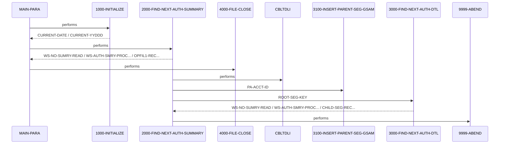

# DBUNLDGS

**File:** DBUNLDGS.CBL
**Type:** COBOL
**Status:** In Progress
**Iterations:** 1
**Analyzed:** 2026-02-27 14:51:33.825538

## Purpose

The COBOL program DBUNLDGS unloads data from an IMS database related to pending authorizations. It reads pending authorization summary segments (root) and writes them to a sequential output file. The program uses IMS calls to navigate the database and extracts data for further processing or archiving.

**Business Context:** UNKNOWN
**Program Type:** BATCH
**Citations:** Lines 2000, 2110

## Calling Context

**Entry Points:** DLITCBL
**Linkage Section:** PAUTBPCB, PASFLPCB, PADFLPCB

## Inputs

### IMS PAUTSUM0/PAUTDTL1
- **Type:** IMS_SEGMENT
- **Description:** Pending authorization summary (root) and detail (child) segments from an IMS database.
- **Copybook:** [CIPAUSMY/CIPAUDTY](../copybooks/CIPAUSMY/CIPAUDTY.cpy.md)
- **Lines:** 1990, 2000

### PAUTBPCB
- **Type:** PARAMETER
- **Description:** IMS database PCB
- **Copybook:** [PAUTBPCB](../copybooks/PAUTBPCB.cpy.md)
- **Lines:** 1370, 1980

### PASFLPCB
- **Type:** PARAMETER
- **Description:** IMS database PCB
- **Copybook:** [PASFLPCB](../copybooks/PASFLPCB.cpy.md)
- **Lines:** 1380, 14210

### PADFLPCB
- **Type:** PARAMETER
- **Description:** IMS database PCB
- **Copybook:** [PADFLPCB](../copybooks/PADFLPCB.cpy.md)
- **Lines:** 13810, 14220

## Outputs

### OPFILE1
- **Type:** FILE_SEQUENTIAL
- **Description:** Pending authorization summary records unloaded from the IMS database.
- **Lines:** 2110

### OPFILE2
- **Type:** FILE_SEQUENTIAL
- **Description:** Pending authorization detail records unloaded from the IMS database.  Although defined, this file is not used in the current code.

## Called Programs

| Program | Call Type | Purpose | Line |
|---------|-----------|---------|------|
| [CBLTDLI](./CBLTDLI.cbl.md) | STATIC_CALL | Issue IMS DL/I calls to retrieve segments from the IMS database. | 1970 |

## Copybooks Used

| Copybook | Location | Purpose | Line |
|----------|----------|---------|------|
| [IMSFUNCS](../copybooks/IMSFUNCS.cpy.md) | WORKING_STORAGE | Contains definitions for IMS function codes used in DL/I calls. | 1160 |
| [CIPAUSMY](../copybooks/CIPAUSMY.cpy.md) | WORKING_STORAGE | Defines the layout of the PENDING-AUTH-SUMMARY segment (root). | 1230 |
| [CIPAUDTY](../copybooks/CIPAUDTY.cpy.md) | WORKING_STORAGE | Defines the layout of the PENDING-AUTH-DETAILS segment (child). | 1270 |
| [PAUTBPCB](../copybooks/PAUTBPCB.cpy.md) | LINKAGE | Defines the structure of the database PCB. | 1340 |
| [PASFLPCB](../copybooks/PASFLPCB.cpy.md) | LINKAGE | Defines the structure of the database PCB. | 13410 |
| [PADFLPCB](../copybooks/PADFLPCB.cpy.md) | LINKAGE | Defines the structure of the database PCB. | 13420 |

## Data Flow

### Reads From
- **IMS PAUTSUM0**: PENDING-AUTH-SUMMARY
  (Lines: 1990)

### Writes To
- **OPFILE1**: PENDING-AUTH-SUMMARY
  (Lines: 2110)

## Key Paragraphs

### MAIN-PARA
**Purpose:** This is the main control paragraph of the DBUNLDGS program. It initializes the program by performing the 1000-INITIALIZE paragraph to set up the environment and open files. It then enters a loop, controlled by the WS-END-OF-ROOT-SEG flag, that repeatedly calls the 2000-FIND-NEXT-AUTH-SUMMARY paragraph to read and process pending authorization summary segments from the IMS database. Once all summary segments have been processed (WS-END-OF-ROOT-SEG is set to 'Y'), the program performs the 4000-FILE-CLOSE paragraph to close the output files. Finally, the program terminates using the GOBACK statement. The program uses linkage section parameters PAUTBPCB, PASFLPCB, and PADFLPCB.
- Calls: 1000-INITIALIZE, 2000-FIND-NEXT-AUTH-SUMMARY
- Lines: 1410-1540

### 1000-INITIALIZE
**Purpose:** This paragraph initializes the program environment. It accepts the current date and day from the system. It then displays a starting message including the current date. The paragraph contains commented-out code to accept parameters from SYSIN and to open output files OPFILE1 and OPFILE2, including error handling for the file opens. The file opening logic is currently disabled. The paragraph sets up the program for processing by obtaining the current date and displaying program start information.
- Called by: MAIN-PARA
- Lines: 1570-1880

### 2000-FIND-NEXT-AUTH-SUMMARY
**Purpose:** This paragraph retrieves the next pending authorization summary segment from the IMS database. It initializes the PAUT-PCB-STATUS field. It then calls the CBLTDLI routine with the FUNC-GN (Get Next) function code to retrieve the next segment. The PAUTBPCB, PENDING-AUTH-SUMMARY, and ROOT-UNQUAL-SSA are passed as parameters to the DL/I call. If the call is successful (PAUT-PCB-STATUS is spaces), the paragraph increments counters for summary records read and processed, moves the retrieved PENDING-AUTH-SUMMARY data to the OPFIL1-REC, and initializes the ROOT-SEG-KEY and CHILD-SEG-REC. If the IMS call returns a status other than spaces, the program logic to handle the error or end-of-data condition is not present in the provided code snippet.
- Called by: MAIN-PARA
- Lines: 1910-2130

### 4000-FILE-CLOSE
**Purpose:** This paragraph is intended to close the output files. However, the code to open the files is commented out in the 1000-INITIALIZE paragraph, so this paragraph effectively does nothing. If the file opening logic were active, this paragraph would close OPFILE1 and OPFILE2. The absence of file opening logic renders this paragraph non-functional in the current code.
- Called by: MAIN-PARA
- Lines: 1500-1500

## Inter-Paragraph Data Flow

| Caller | Callee | Inputs | Outputs | Purpose |
|--------|--------|--------|---------|---------|
| MAIN-PARA | 1000-INITIALIZE | - | CURRENT-DATE, CURRENT-YYDDD | Initializes program by accepting current date and displaying startup messages. |
| MAIN-PARA | 2000-FIND-NEXT-AUTH-SUMMARY | - | WS-NO-SUMRY-READ, WS-AUTH-SMRY-PROC-CNT, OPFIL1-REC, ROOT-SEG-KEY, CHILD-SEG-REC, WS-END-OF-ROOT-SEG, WS-END-OF-AUTHDB-FLAG | Reads the next authorization summary from IMS database and processes it by initializing keys and triggering child segment processing if valid. |
| MAIN-PARA | 4000-FILE-CLOSE | - | - | Displays a message indicating the file closing process. |
| 2000-FIND-NEXT-AUTH-SUMMARY | 3100-INSERT-PARENT-SEG-GSAM | PA-ACCT-ID | - | Inserts the parent authorization summary segment into the GSAM output file using IMS call, with error handling on failure. |
| 2000-FIND-NEXT-AUTH-SUMMARY | 3000-FIND-NEXT-AUTH-DTL | ROOT-SEG-KEY | WS-NO-SUMRY-READ, WS-AUTH-SMRY-PROC-CNT, CHILD-SEG-REC, WS-END-OF-CHILD-SEG, PAUT-PCB-STATUS | Finds and processes the next authorization detail (child) segment under the current parent in the IMS database, inserting it into GSAM output. |
| 2000-FIND-NEXT-AUTH-SUMMARY | 9999-ABEND | - | - | Abends the program with return code 16 when the IMS GN call fails for authorization summary. |
| 3000-FIND-NEXT-AUTH-DTL | 3200-INSERT-CHILD-SEG-GSAM | PENDING-AUTH-DETAILS | PADFL-PCB-STATUS, PADFL-KEYFB | Inserts the retrieved authorization detail segment into the GSAM output file using IMS ISRT call. |
| 3000-FIND-NEXT-AUTH-DTL | 9999-ABEND | - | - | Abends the program with return code 16 when the IMS GNP call fails for authorization detail. |
| 3100-INSERT-PARENT-SEG-GSAM | 9999-ABEND | - | - | Abends the program with return code 16 when the IMS ISRT call fails to insert the parent segment into GSAM. |
| 3200-INSERT-CHILD-SEG-GSAM | 9999-ABEND | - | - | Abends the program with return code 16 when the IMS ISRT call fails to insert the child segment into GSAM. |

## Open Questions

- **What is the purpose of the commented-out code related to file I/O and parameter acceptance?**
  - Context: The code to open and close files, as well as accept parameters from SYSIN, is commented out, suggesting it may have been used in a previous version or is intended for future use.
  - Suggestion: Review the program's change history or related documentation to understand the purpose of this commented-out code.

## Resolved Questions

- **Q:** What is the purpose of OPFILE2?
  **A:** The code snippets suggest that `OPFILE2` is a sequential output file, similar to `OPFILE1`. It appears to be used for writing data, as indicated by the `OPEN OUTPUT OPFILE2` statement. The file definition `FD OPFILE2` shows that it contains `ROOT-SEG-KEY` and `CHILD-SEG-REC`, suggesting it stores data related to the root segment and a child segment.

Therefore, the purpose of `OPFILE2` is to store records containing the root segment key and a child segment record, likely extracted from the IMS database.

```
OPFILE2 is a sequential output file used to store records containing the root segment key and a child segment record extracted from the IMS database.
```
- **Q:** What is the purpose of PASFLPCB and PADFLPCB?
  **A:** The code shows that `PASFLPCB` and `PADFLPCB` are Program Communication Blocks (PCBs) used in IMS database calls. They are copied into the program's linkage section

## Sequence Diagram


```mermaid
sequenceDiagram
    participant MAIN_PARA as MAIN-PARA
    participant 1000_INITIALIZE as 1000-INITIALIZE
    participant 2000_FIND_NEXT_AUTH_SUMMARY as 2000-FIND-NEXT-AUTH-SUMMARY
    participant 4000_FILE_CLOSE as 4000-FILE-CLOSE
    participant CBLTDLI as CBLTDLI
    participant 3100_INSERT_PARENT_SEG_GSAM as 3100-INSERT-PARENT-SEG-GSAM
    participant 3000_FIND_NEXT_AUTH_DTL as 3000-FIND-NEXT-AUTH-DTL
    participant 9999_ABEND as 9999-ABEND
    MAIN_PARA->>1000_INITIALIZE: performs
    1000_INITIALIZE-->>MAIN_PARA: CURRENT-DATE / CURRENT-YYDDD
    MAIN_PARA->>2000_FIND_NEXT_AUTH_SUMMARY: performs
    2000_FIND_NEXT_AUTH_SUMMARY-->>MAIN_PARA: WS-NO-SUMRY-READ / WS-AUTH-SMRY-PROC... / OPFIL1-REC...
    MAIN_PARA->>4000_FILE_CLOSE: performs
    2000_FIND_NEXT_AUTH_SUMMARY->>CBLTDLI: performs
    2000_FIND_NEXT_AUTH_SUMMARY->>3100_INSERT_PARENT_SEG_GSAM: PA-ACCT-ID
    2000_FIND_NEXT_AUTH_SUMMARY->>3000_FIND_NEXT_AUTH_DTL: ROOT-SEG-KEY
    3000_FIND_NEXT_AUTH_DTL-->>2000_FIND_NEXT_AUTH_SUMMARY: WS-NO-SUMRY-READ / WS-AUTH-SMRY-PROC... / CHILD-SEG-REC...
    2000_FIND_NEXT_AUTH_SUMMARY->>9999_ABEND: performs
```

---
*Generated by War Rig WAR_RIG*