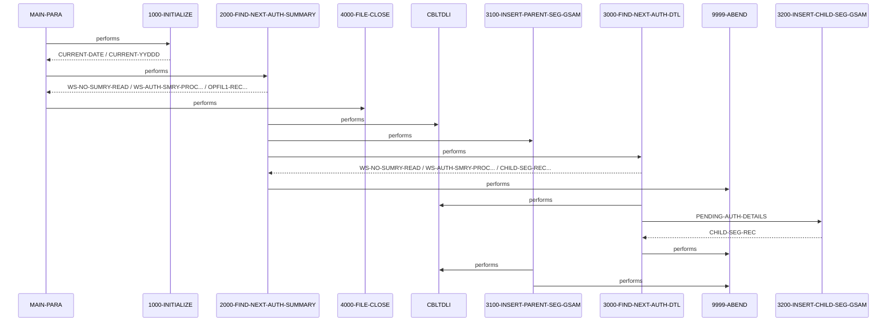

# DBUNLDGS

**File:** DBUNLDGS.CBL
**Type:** COBOL
**Status:** In Progress
**Iterations:** 1
**Analyzed:** 2026-03-03 16:54:54.935454

## Purpose

The COBOL program DBUNLDGS unloads data from an IMS database related to pending authorizations. It reads pending authorization summary segments (root) and detail segments (child) from the IMS database and writes them to sequential output files.

**Business Context:** This program likely supports data migration, archiving, or reporting related to pending authorization records.
**Program Type:** BATCH
**Citations:** Lines 2000, 2110, 2190

## Calling Context

**Entry Points:** DLITCBL
**Linkage Section:** PAUTBPCB, PASFLPCB, PADFLPCB

## Inputs

### IMS Database (PAUTSUM0, PAUTDTL1 Segments)
- **Type:** IMS_SEGMENT
- **Description:** Pending authorization summary (PAUTSUM0) and detail (PAUTDTL1) segments from an IMS database.
- **Copybook:** [CIPAUSMY, CIPAUDTY](../copybooks/CIPAUSMY, CIPAUDTY.cpy.md)
- **Lines:** 1970, 2190

### PAUTBPCB
- **Type:** PARAMETER
- **Description:** IMS database PCB mask for PAUTSUM0 segment.
- **Copybook:** [PAUTBPCB](../copybooks/PAUTBPCB.cpy.md)
- **Lines:** 1370, 1420

### PASFLPCB
- **Type:** PARAMETER
- **Description:** IMS database PCB mask for sequential file.
- **Copybook:** [PASFLPCB](../copybooks/PASFLPCB.cpy.md)
- **Lines:** 1380, 1421

### PADFLPCB
- **Type:** PARAMETER
- **Description:** IMS database PCB mask for detail file.
- **Copybook:** [PADFLPCB](../copybooks/PADFLPCB.cpy.md)
- **Lines:** 1381, 1422

## Outputs

### OPFILE1
- **Type:** FILE_SEQUENTIAL
- **Description:** Contains the unloaded pending authorization summary segments (PAUTSUM0).
- **Lines:** 2110, 2171

### OPFILE2
- **Type:** FILE_SEQUENTIAL
- **Description:** Contains the unloaded pending authorization detail segments (PAUTDTL1).
- **Lines:** 3110, 3171

## Called Programs

| Program | Call Type | Purpose | Line |
|---------|-----------|---------|------|
| [CBLTDLI](./CBLTDLI.cbl.md) | STATIC_CALL | Issue IMS DL/I calls to retrieve segments from the IMS database. | 1970 |
| [CBLTDLI](./CBLTDLI.cbl.md) | STATIC_CALL | Issue IMS DL/I calls to retrieve child segments from the IMS database. | 3010 |

## Business Rules

### BR001: The program processes pending authorization summary segments and their detail segments.
**Logic:** The program reads the root segment (PAUTSUM0) and then reads all child segments (PAUTDTL1) associated with that root.  It writes each root and child segment to separate sequential files.
**Conditions:** PAUT-PCB-STATUS = SPACES, WS-END-OF-ROOT-SEG = 'Y'
**Lines:** 2070, 1470

## Copybooks Used

| Copybook | Location | Purpose | Line |
|----------|----------|---------|------|
| [IMSFUNCS](../copybooks/IMSFUNCS.cpy.md) | WORKING_STORAGE | Contains definitions for IMS function codes used in DL/I calls. | 1160 |
| [CIPAUSMY](../copybooks/CIPAUSMY.cpy.md) | WORKING_STORAGE | Defines the layout of the PENDING-AUTH-SUMMARY segment (root segment). | 1230 |
| [CIPAUDTY](../copybooks/CIPAUDTY.cpy.md) | WORKING_STORAGE | Defines the layout of the PENDING-AUTH-DETAILS segment (child segment). | 1270 |
| [PAUTBPCB](../copybooks/PAUTBPCB.cpy.md) | LINKAGE | Defines the PCB mask for the PAUTSUM0 segment. | 1340 |
| [PASFLPCB](../copybooks/PASFLPCB.cpy.md) | LINKAGE | Defines the PCB mask for sequential file. | 1341 |
| [PADFLPCB](../copybooks/PADFLPCB.cpy.md) | LINKAGE | Defines the PCB mask for detail file. | 1342 |

## Data Flow

### Reads From
- **IMS Database (PAUTSUM0)**: PA-ACCT-ID, All fields in CIPAUSMY copybook
  (Lines: 1970, 1230)
- **IMS Database (PAUTDTL1)**: All fields in CIPAUDTY copybook
  (Lines: 3010, 1270)

### Writes To
- **OPFILE1**: All fields in PENDING-AUTH-SUMMARY (CIPAUSMY)
  (Lines: 2110, 1230)
- **OPFILE2**: ROOT-SEG-KEY, CHILD-SEG-REC
  (Lines: 3110)

### Transformations
- **PA-ACCT-ID** → **ROOT-SEG-KEY**: Moves the account ID from the pending authorization summary segment to the root segment key in the output record for OPFILE2.
  (Lines: 2140)

## Key Paragraphs

### MAIN-PARA
**Purpose:** This is the main control paragraph of the DBUNLDGS program. It first calls 1000-INITIALIZE to perform initial setup tasks such as accepting the current date and displaying program start messages. Then, it enters a loop that repeatedly calls 2000-FIND-NEXT-AUTH-SUMMARY to read and process pending authorization summary segments from the IMS database until the end of the database is reached, indicated by WS-END-OF-ROOT-SEG being set to 'Y'. Finally, after processing all summary segments, it calls 4000-FILE-CLOSE to close the output files before terminating the program with GOBACK.
- Calls: 1000-INITIALIZE, 2000-FIND-NEXT-AUTH-SUMMARY, 4000-FILE-CLOSE
- Lines: 1410-1540

### 1000-INITIALIZE
**Purpose:** This paragraph initializes the program by accepting the current date and displaying startup messages. It retrieves the current date from the system using ACCEPT CURRENT-DATE FROM DATE and ACCEPT CURRENT-YYDDD FROM DAY. It then displays a series of messages to the console indicating the program's start and the current date. The commented-out code suggests that the program was intended to read parameters from SYSIN and open output files, but these functionalities are currently disabled. No error handling is implemented in the current version of this paragraph.
- Called by: MAIN-PARA
- Lines: 1570-1880

### 2000-FIND-NEXT-AUTH-SUMMARY
**Purpose:** This paragraph retrieves the next pending authorization summary segment (root segment) from the IMS database. It initializes the PAUT-PCB-STATUS field and then calls the CBLTDLI routine with the GN (Get Next) function to read the next PAUTSUM0 segment using the PAUTBPCB. If the PAUT-PCB-STATUS is spaces, indicating a successful read, it increments counters for summary records read and processed. It then moves the data from the PENDING-AUTH-SUMMARY segment to the OPFIL1-REC for writing to the output file. The PA-ACCT-ID is moved to ROOT-SEG-KEY. It then calls 3000-FIND-NEXT-AUTH-DTL to process the child segments. If the PA-ACCT-ID is numeric, it performs 3100-INSERT-PARENT-SEG-GSAM to write the parent segment to the GSAM file.
- Called by: MAIN-PARA
- Calls: 3000-FIND-NEXT-AUTH-DTL, 3100-INSERT-PARENT-SEG-GSAM
- Lines: 1910-2190

### 3000-FIND-NEXT-AUTH-DTL
**Purpose:** This paragraph retrieves the next pending authorization detail segment (child segment) from the IMS database, associated with the current summary segment. It initializes the PAD-PCB-STATUS field and then calls the CBLTDLI routine with the GN (Get Next) function to read the next PAUTDTL1 segment using the PADFLPCB and the CHILD-UNQUAL-SSA. If the PAD-PCB-STATUS is spaces, indicating a successful read, it moves the PENDING-AUTH-DETAILS segment to the CHILD-SEG-REC and performs 3100-INSERT-PARENT-SEG-GSAM to write the child segment to the GSAM file. If the PAD-PCB-STATUS is 'GB', it sets WS-END-OF-CHILD-SEG to 'Y', indicating that there are no more child segments for the current summary segment. If the PAD-PCB-STATUS is not spaces or 'GB', it performs 9999-ABEND to terminate the program.
- Called by: 2000-FIND-NEXT-AUTH-SUMMARY
- Calls: 3100-INSERT-PARENT-SEG-GSAM, 9999-ABEND
- Lines: 2210-2470

### 3100-INSERT-PARENT-SEG-GSAM
**Purpose:** This paragraph writes the root or child segment to the OPFILE2. It checks the WS-OUTFL2-STATUS. If the status is spaces or '00', it writes the OPFIL2-REC to the output file and increments the WS-TOT-REC-WRITTEN counter. If the WS-OUTFL2-STATUS is not spaces or '00', it displays an error message and performs 9999-ABEND to terminate the program.
- Called by: 2000-FIND-NEXT-AUTH-SUMMARY, 3000-FIND-NEXT-AUTH-DTL
- Calls: 9999-ABEND
- Lines: 2490-2710

### 4000-FILE-CLOSE
**Purpose:** This paragraph closes the output files. It checks the WS-OUTFL1-STATUS and WS-OUTFL2-STATUS. If the status is spaces or '00', it closes the file. If the WS-OUTFL1-STATUS or WS-OUTFL2-STATUS is not spaces or '00', it displays an error message and performs 9999-ABEND to terminate the program.
- Called by: MAIN-PARA
- Calls: 9999-ABEND
- Lines: 2730-2950

### 9999-ABEND
**Purpose:** This paragraph terminates the program abnormally. It displays an error message indicating that the program is abending and then executes a GOBACK statement to terminate the program.
- Called by: 1000-INITIALIZE, 3000-FIND-NEXT-AUTH-DTL, 3100-INSERT-PARENT-SEG-GSAM, 4000-FILE-CLOSE
- Lines: 2970-3000

## Inter-Paragraph Data Flow

| Caller | Callee | Inputs | Outputs | Purpose |
|--------|--------|--------|---------|---------|
| MAIN-PARA | 1000-INITIALIZE | - | CURRENT-DATE, CURRENT-YYDDD | Initializes program by accepting current date and displaying startup messages. |
| MAIN-PARA | 2000-FIND-NEXT-AUTH-SUMMARY | - | WS-NO-SUMRY-READ, WS-AUTH-SMRY-PROC-CNT, OPFIL1-REC, ROOT-SEG-KEY, CHILD-SEG-REC, WS-END-OF-AUTHDB, WS-END-OF-ROOT-SEG | Reads the next authorization summary from IMS, updates counters, and processes associated details if account ID is numeric. |
| MAIN-PARA | 4000-FILE-CLOSE | - | - | Displays a message indicating the file closing process. |
| 2000-FIND-NEXT-AUTH-SUMMARY | 3100-INSERT-PARENT-SEG-GSAM | - | - | Inserts the parent segment of the authorization summary into GSAM file using IMS call and abends on failure. |
| 2000-FIND-NEXT-AUTH-SUMMARY | 3000-FIND-NEXT-AUTH-DTL | - | WS-NO-SUMRY-READ, WS-AUTH-SMRY-PROC-CNT, CHILD-SEG-REC, WS-END-OF-CHILD-SEG | Finds the next authorization detail segment using IMS GNP call, updates read counters, stores child segment data, and sets end-of-child flag if no more segments. |
| 2000-FIND-NEXT-AUTH-SUMMARY | 9999-ABEND | - | - | Abends the program with return code 16 when an unexpected IMS status code is encountered during retrieval of the next authorization summary. |
| 3000-FIND-NEXT-AUTH-DTL | 3200-INSERT-CHILD-SEG-GSAM | PENDING-AUTH-DETAILS | CHILD-SEG-REC | Inserts the retrieved authorization detail segment into the GSAM output file after moving it to the child segment record. |
| 3000-FIND-NEXT-AUTH-DTL | 9999-ABEND | - | - | Abends the program with return code 16 when the IMS GNP call fails with an unexpected status code during traversal of child segments. |
| 3100-INSERT-PARENT-SEG-GSAM | 9999-ABEND | - | - | Abends the program with return code 16 if the GSAM insertion of the parent authorization summary segment fails. |
| 3200-INSERT-CHILD-SEG-GSAM | 9999-ABEND | - | - | Abends the program with return code 16 if the GSAM insertion of the child authorization detail segment fails. |

## Error Handling

- **PAUT-PCB-STATUS not equal to SPACES:** The program continues processing to the next segment.
  (Lines: 2070)
- **PAD-PCB-STATUS not equal to SPACES or 'GB':** ABEND with 9999-ABEND
  (Lines: 2450, 2460)
- **WS-OUTFL2-STATUS not equal to SPACES or '00':** ABEND with 9999-ABEND
  (Lines: 2660, 2670)
- **WS-OUTFL1-STATUS not equal to SPACES or '00':** ABEND with 9999-ABEND
  (Lines: 2890, 2900)
- **WS-OUTFL2-STATUS not equal to SPACES or '00':** ABEND with 9999-ABEND
  (Lines: 2920, 2930)

## Open Questions

- **What is the purpose of PASFLPCB and PADFLPCB?**
  - Context: The program uses PASFLPCB and PADFLPCB as parameters in the procedure division, but their purpose is unclear.
  - Suggestion: Review previous versions of the code or consult with the developers to determine the original intent.

## Resolved Questions

- **Q:** What is the purpose of the commented-out code related to OPEN OUTPUT OPFILE1 and OPFILE2 in 1000-INITIALIZE?
  **A:** The commented-out code in `1000-INITIALIZE` related to `OPEN OUTPUT OPFILE1` and `OPFILE2` suggests that the program was originally designed to write to two sequential output files. The code includes file definitions in the `FILE-CONTROL` and `FILE SECTION`, `OPEN` statements in `1000-INITIALIZE`, and `CLOSE` statements in `4000-FILE-CLOSE`. Status variables (`WS-OUTFL1-STATUS`, `WS-OUTFL2-STATUS`) are also defined and checked for errors during the open and close processes.

The fact that this code is commented out indicates that the program's current implementation might not use these files directly. It's possible that the output is now directed elsewhere, perhaps to a different file format, a database, or another system via a message queue.

INCONCLUSIVE: Without further analysis, it's impossible to determine the exact reason why this code was commented out. It could be due to a change in requirements, a different output strategy, or simply a temporary measure during development.

## Sequence Diagram

```mermaid
sequenceDiagram
    participant MAIN_PARA as MAIN-PARA
    participant 1000_INITIALIZE as 1000-INITIALIZE
    participant 2000_FIND_NEXT_AUTH_SUMMARY as 2000-FIND-NEXT-AUTH-SUMMARY
    participant 4000_FILE_CLOSE as 4000-FILE-CLOSE
    participant CBLTDLI as CBLTDLI
    participant 3100_INSERT_PARENT_SEG_GSAM as 3100-INSERT-PARENT-SEG-GSAM
    participant 3000_FIND_NEXT_AUTH_DTL as 3000-FIND-NEXT-AUTH-DTL
    participant 9999_ABEND as 9999-ABEND
    participant 3200_INSERT_CHILD_SEG_GSAM as 3200-INSERT-CHILD-SEG-GSAM
    MAIN_PARA->>1000_INITIALIZE: performs
    1000_INITIALIZE-->>MAIN_PARA: CURRENT-DATE / CURRENT-YYDDD
    MAIN_PARA->>2000_FIND_NEXT_AUTH_SUMMARY: performs
    2000_FIND_NEXT_AUTH_SUMMARY-->>MAIN_PARA: WS-NO-SUMRY-READ / WS-AUTH-SMRY-PROC... / OPFIL1-REC...
    MAIN_PARA->>4000_FILE_CLOSE: performs
    2000_FIND_NEXT_AUTH_SUMMARY->>CBLTDLI: performs
    2000_FIND_NEXT_AUTH_SUMMARY->>3100_INSERT_PARENT_SEG_GSAM: performs
    2000_FIND_NEXT_AUTH_SUMMARY->>3000_FIND_NEXT_AUTH_DTL: performs
    3000_FIND_NEXT_AUTH_DTL-->>2000_FIND_NEXT_AUTH_SUMMARY: WS-NO-SUMRY-READ / WS-AUTH-SMRY-PROC... / CHILD-SEG-REC...
    2000_FIND_NEXT_AUTH_SUMMARY->>9999_ABEND: performs
    3000_FIND_NEXT_AUTH_DTL->>CBLTDLI: performs
    3000_FIND_NEXT_AUTH_DTL->>3200_INSERT_CHILD_SEG_GSAM: PENDING-AUTH-DETAILS
    3200_INSERT_CHILD_SEG_GSAM-->>3000_FIND_NEXT_AUTH_DTL: CHILD-SEG-REC
    3000_FIND_NEXT_AUTH_DTL->>9999_ABEND: performs
    3100_INSERT_PARENT_SEG_GSAM->>CBLTDLI: performs
    3100_INSERT_PARENT_SEG_GSAM->>9999_ABEND: performs
```

---
*Generated by War Rig WAR_RIG*