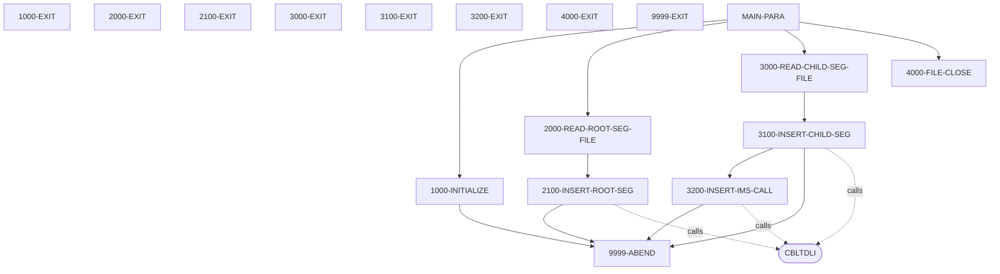
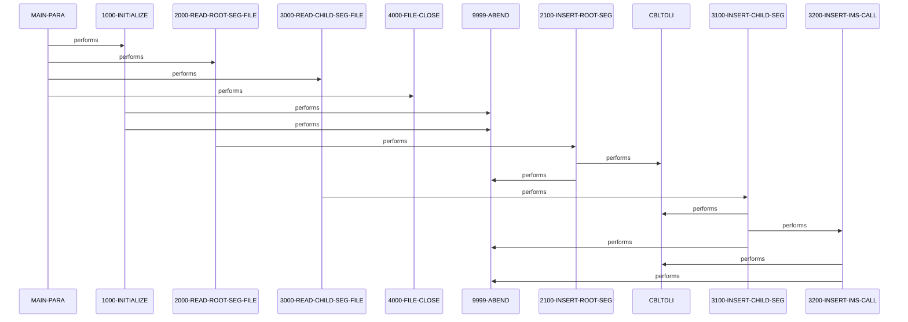

# PAUDBLOD

**File**: `cbl/PAUDBLOD.CBL`
**Type**: FileType.COBOL
**Analyzed**: 2026-02-25 15:38:36.824155

## Purpose

This program is a batch utility designed to load data into an IMS database from two sequential input files. It performs insertions for both root segments (PAUTSUM0) and child segments (PAUTDTL1) while handling existing records and potential I/O errors.

**Business Context**: This program likely serves as a data migration or initialization utility for the Pending Authorization (PAUT) system, ensuring that authorization summary and detail records are correctly populated in the IMS environment.

## Inputs

| Name | Type | Description |
|------|------|-------------|
| INFILE1 | IOType.FILE_SEQUENTIAL | Sequential input file containing data for the root segment (PAUTSUM0). |
| INFILE2 | IOType.FILE_SEQUENTIAL | Sequential input file containing data for the child segment (PAUTDTL1), including the root segment key for parentage. |

## Outputs

| Name | Type | Description |
|------|------|-------------|
| PAUTSUM0 | IOType.IMS_SEGMENT | Root segment in the IMS database representing Pending Authorization Summary. |
| PAUTDTL1 | IOType.IMS_SEGMENT | Child segment in the IMS database representing Pending Authorization Details. |

## Called Programs

| Program | Call Type | Purpose |
|---------|-----------|---------|
| CBLTDLI | CallType.STATIC_CALL | Interface with IMS for database operations including ISRT (Insert) and GU (Get Unique). |

## Business Rules

- **BR001**: Root Segment Insertion
- **BR002**: Child Segment Parentage
- **BR003**: Duplicate Handling

## Paragraphs/Procedures

### MAIN-PARA
> [Source: MAIN-PARA.cbl.md](PAUDBLOD.CBL.d/MAIN-PARA.cbl.md)
This is the primary orchestration paragraph for the PAUDBLOD program. It establishes the entry point for the DLITCBL interface and initializes the execution environment by calling 1000-INITIALIZE. The paragraph then executes two main processing loops: one to read and load root segments from INFILE1 via 2000-READ-ROOT-SEG-FILE, and another to read and load child segments from INFILE2 via 3000-READ-CHILD-SEG-FILE. After all records are processed and the end-of-file flags are set, it calls 4000-FILE-CLOSE to release file resources. Finally, it terminates the program execution using GOBACK to return control to the operating system or calling JCL.

### 1000-INITIALIZE
> [Source: 1000-INITIALIZE.cbl.md](PAUDBLOD.CBL.d/1000-INITIALIZE.cbl.md)
This paragraph handles the setup and initialization tasks required before data processing begins. It retrieves the current system date and day using ACCEPT statements and displays them for logging purposes. The paragraph's critical function is opening the two input sequential files, INFILE1 and INFILE2. It performs error checking on the file status codes (WS-INFIL1-STATUS and WS-INFIL2-STATUS) immediately after the OPEN commands. If either file fails to open (status not '00' or spaces), an error message is displayed and the program branches to 9999-ABEND to prevent further execution with invalid file handles.

### 2000-READ-ROOT-SEG-FILE
> [Source: 2000-READ-ROOT-SEG-FILE.cbl.md](PAUDBLOD.CBL.d/2000-READ-ROOT-SEG-FILE.cbl.md)
This paragraph manages the reading of the root segment input file, INFILE1. It executes a READ operation and checks the resulting file status. If the read is successful (status '00'), the record is moved from the file buffer (INFIL1-REC) to the IMS segment structure (PENDING-AUTH-SUMMARY), and the paragraph calls 2100-INSERT-ROOT-SEG to perform the database update. If the end of the file is reached (status '10'), it sets the END-ROOT-SEG-FILE flag to 'Y' to terminate the processing loop in the main paragraph. Any other status code results in an error message being displayed to the log.

### 2100-INSERT-ROOT-SEG
> [Source: 2100-INSERT-ROOT-SEG.cbl.md](PAUDBLOD.CBL.d/2100-INSERT-ROOT-SEG.cbl.md)
This paragraph performs the actual IMS database insertion for the root segment. It calls the 'CBLTDLI' interface using the ISRT (Insert) function, passing the PCB mask, the data buffer, and an unqualified SSA (ROOT-UNQUAL-SSA). After the call, it evaluates the PCB status code. A successful insertion (status spaces) or a duplicate record condition (status 'II') are handled gracefully with log messages. However, if any other error status is returned, the paragraph displays the failed status and triggers 9999-ABEND to stop the load process, ensuring data integrity.

### 3000-READ-CHILD-SEG-FILE
> [Source: 3000-READ-CHILD-SEG-FILE.cbl.md](PAUDBLOD.CBL.d/3000-READ-CHILD-SEG-FILE.cbl.md)
This paragraph is responsible for reading the child segment input file, INFILE2. Each record in this file contains both a root segment key and the child segment data. Upon a successful read, the paragraph validates that the root key is numeric before moving it to the qualified SSA (ROOT-QUAL-SSA) and moving the child data to the segment buffer (PENDING-AUTH-DETAILS). It then calls 3100-INSERT-CHILD-SEG to handle the database logic. If the end of INFILE2 is reached, it sets the END-CHILD-SEG-FILE flag to 'Y'. Unexpected file status codes trigger an error display message.

### 3100-INSERT-CHILD-SEG
> [Source: 3100-INSERT-CHILD-SEG.cbl.md](PAUDBLOD.CBL.d/3100-INSERT-CHILD-SEG.cbl.md)
This paragraph establishes the necessary parentage before inserting a child segment. It performs an IMS 'GU' (Get Unique) call on the root segment (PAUTSUM0) using a qualified SSA based on the key read from INFILE2. This step is required in IMS to point the database position to the correct parent. If the GU call is successful (status spaces), it proceeds to call 3200-INSERT-IMS-CALL to insert the child segment. If the GU call fails with an unexpected status (anything other than spaces or 'II'), the paragraph displays the error and the key feedback area before calling 9999-ABEND.

### 3200-INSERT-IMS-CALL
> [Source: 3200-INSERT-IMS-CALL.cbl.md](PAUDBLOD.CBL.d/3200-INSERT-IMS-CALL.cbl.md)
This paragraph executes the IMS insertion for the child segment (PAUTDTL1). It uses the 'CBLTDLI' interface with the ISRT function and an unqualified SSA for the child segment, relying on the parentage established in the previous GU call. It checks the PCB status for success (spaces) or duplicate records ('II'), logging the outcome. If the insertion fails for any other reason, it logs the failure status and the key feedback area, then performs 9999-ABEND to halt the program and prevent partial or corrupted data loads.

### 4000-FILE-CLOSE
> [Source: 4000-FILE-CLOSE.cbl.md](PAUDBLOD.CBL.d/4000-FILE-CLOSE.cbl.md)
This paragraph is responsible for the orderly shutdown of file resources. It issues CLOSE commands for both INFILE1 and INFILE2. After each close operation, it checks the file status variables (WS-INFIL1-STATUS and WS-INFIL2-STATUS). If the status is not '00' or spaces, it displays an error message indicating which file failed to close properly. This paragraph ensures that all input streams are released and buffers are flushed before the program terminates, which is a standard cleanup procedure in batch processing.

### 9999-ABEND
> [Source: 9999-ABEND.cbl.md](PAUDBLOD.CBL.d/9999-ABEND.cbl.md)
This paragraph serves as the centralized error termination routine for the program. When called, it displays a message indicating that the IMS load is abending. It sets the system RETURN-CODE to 16, which is a standard convention for a 'Fatal Error' or 'Abend' in mainframe batch processing. After setting the return code, it executes a GOBACK to immediately terminate the program and signal the failure to the job entry subsystem (JES), ensuring that subsequent job steps are not executed.

### 9999-EXIT
> [Source: 9999-EXIT.cbl.md](PAUDBLOD.CBL.d/9999-EXIT.cbl.md)
This paragraph provides a formal exit point for the 9999-ABEND routine. It contains only an EXIT statement, which serves as a procedural marker for the end of the abend logic block. While the GOBACK in the preceding paragraph typically prevents this exit from being reached during a failure, it is included to maintain structured programming standards and provide a clear boundary for the paragraph's scope within the Procedure Division.

## Dead Code

The following artifacts were identified as dead code by static analysis:

| Artifact | Type | Line | Reason |
|----------|------|------|--------|
| INFIL1-REC | record_layout | 44 | Record layout 'INFIL1-REC' is never used by any program |
| INFIL2-REC | record_layout | 46 | Record layout 'INFIL2-REC' is never used by any program |
| ROOT-QUAL-SSA | record_layout | 113 | Record layout 'ROOT-QUAL-SSA' is never used by any program |

## Control Flow

## Open Questions

- ? Are there specific requirements for the numeric format of ROOT-SEG-KEY?
  - Context: The code checks IF ROOT-SEG-KEY IS NUMERIC before processing child segments.

## Sequence Diagram

