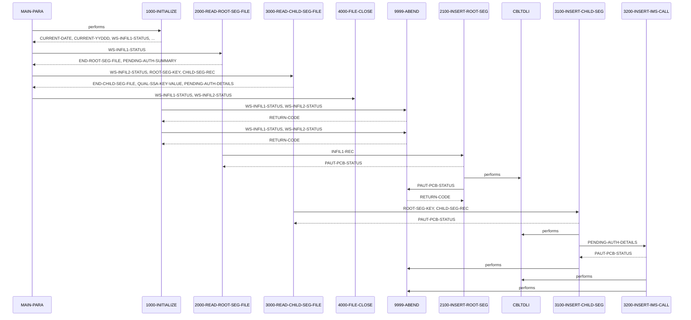

# PAUDBLOD

**File**: `cbl/PAUDBLOD.CBL`
**Type**: FileType.COBOL
**Analyzed**: 2026-02-09 15:45:27.624599

## Purpose

The PAUDBLOD program reads two sequential files, INFILE1 and INFILE2, and loads data into an IMS database. INFILE1 contains root segment data for 'PAUTSUM0' and INFILE2 contains child segment data for 'PAUTDTL1', which are then inserted into the IMS database using CBLTDLI calls.

## Inputs

| Name | Type | Description |
|------|------|-------------|
| INFILE1 | IOType.FILE_SEQUENTIAL | Sequential file containing root segment data for the 'PAUTSUM0' segment of the IMS database. |
| INFILE2 | IOType.FILE_SEQUENTIAL | Sequential file containing child segment data for the 'PAUTDTL1' segment of the IMS database.  It contains ROOT-SEG-KEY and CHILD-SEG-REC. |
| IO-PCB-MASK | IOType.PARAMETER | IO PCB Mask from Linkage Section |
| PAUTBPCB | IOType.PARAMETER | PAUTBPCB from Linkage Section |

## Called Programs

| Program | Call Type | Purpose |
|---------|-----------|---------|
| CBLTDLI | CallType.STATIC_CALL | Performs IMS database operations such as inserting root and child segments. |
| CBLTDLI | CallType.STATIC_CALL | Retrieves a root segment from the IMS database before inserting a child segment. |
| CBLTDLI | CallType.STATIC_CALL | Inserts a child segment into the IMS database. |

## Paragraphs/Procedures

### MAIN-PARA
The MAIN-PARA paragraph serves as the main control flow for the PAUDBLOD program. It begins by calling 1000-INITIALIZE to perform initial setup, including accepting the current date and opening input files (INFILE1 and INFILE2). After initialization, it enters a loop that reads root segments from INFILE1 using 2000-READ-ROOT-SEG-FILE until the end of the file is reached. For each root segment read, it calls 2100-INSERT-ROOT-SEG to insert the root segment into the IMS database. Subsequently, it enters another loop to read child segments from INFILE2 using 3000-READ-CHILD-SEG-FILE until the end of the file is reached. For each child segment read, it calls 3100-INSERT-CHILD-SEG to insert the child segment into the IMS database. Finally, it calls 4000-FILE-CLOSE to close the input files before terminating the program with a GOBACK statement.

### 1000-INITIALIZE
The 1000-INITIALIZE paragraph is responsible for initializing the program environment. It first accepts the current date and current year/day from the system. It then opens INFILE1 and INFILE2 for input. If either OPEN operation fails, it displays an error message including the file status and calls 9999-ABEND to terminate the program. If the OPEN operations are successful, the program continues to the next paragraph. This paragraph ensures that the necessary files are available and ready for processing before the main logic of the program begins.

### 2000-READ-ROOT-SEG-FILE
The 2000-READ-ROOT-SEG-FILE paragraph reads records from INFILE1, which contains data for the root segment (PAUTSUM0). It reads a record from INFILE1 and checks the file status. If the read is successful (WS-INFIL1-STATUS is SPACES or '00'), it moves the content of the input record (INFIL1-REC) to the PENDING-AUTH-SUMMARY area and then calls 2100-INSERT-ROOT-SEG to insert the root segment into the IMS database. If the end of the file is reached (WS-INFIL1-STATUS is '10'), it sets the END-ROOT-SEG-FILE flag to 'Y'. If any other error occurs during the read operation, it displays an error message. This paragraph handles reading the root segment data and preparing it for insertion into the IMS database.

### 2100-INSERT-ROOT-SEG
The 2100-INSERT-ROOT-SEG paragraph is responsible for inserting the root segment (PENDING-AUTH-SUMMARY) into the IMS database. It calls the CBLTDLI routine with the FUNC-ISRT function code to perform the insert operation, passing the PAUTBPCB, PENDING-AUTH-SUMMARY, and ROOT-UNQUAL-SSA as parameters. After the call, it checks the PAUT-PCB-STATUS. If the status is SPACES, it displays a message indicating a successful insert. If the status is 'II', it displays a message indicating that the segment already exists in the database. If the status is anything else, it displays an error message and calls 9999-ABEND to terminate the program. This paragraph handles the actual insertion of the root segment into the IMS database and checks for potential errors.

### 3000-READ-CHILD-SEG-FILE
The 3000-READ-CHILD-SEG-FILE paragraph reads records from INFILE2, which contains data for the child segment (PAUTDTL1). It reads a record from INFILE2 and checks the file status. If the read is successful (WS-INFIL2-STATUS is SPACES or '00') and the ROOT-SEG-KEY is numeric, it moves the ROOT-SEG-KEY to QUAL-SSA-KEY-VALUE and the CHILD-SEG-REC to PENDING-AUTH-DETAILS. It then calls 3100-INSERT-CHILD-SEG to insert the child segment into the IMS database. If the end of the file is reached (WS-INFIL2-STATUS is '10'), it sets the END-CHILD-SEG-FILE flag to 'Y'. If any other error occurs during the read operation, it displays an error message. This paragraph handles reading the child segment data and preparing it for insertion into the IMS database.

### 3100-INSERT-CHILD-SEG
The 3100-INSERT-CHILD-SEG paragraph is responsible for inserting the child segment (PENDING-AUTH-DETAILS) into the IMS database. Before inserting the child segment, it first attempts to retrieve the corresponding root segment using a Get Unique (GU) call to CBLTDLI with the ROOT-QUAL-SSA. If the GU call is successful (PAUT-PCB-STATUS = SPACES), it then calls 3200-INSERT-IMS-CALL to insert the child segment. If the GU call fails, it displays an error message and calls 9999-ABEND to terminate the program. This paragraph ensures that the parent segment exists before attempting to insert the child segment, maintaining data integrity.

### 3200-INSERT-IMS-CALL
The 3200-INSERT-IMS-CALL paragraph performs the actual IMS insert call for the child segment. It calls the CBLTDLI routine with the FUNC-ISRT function code to insert the PENDING-AUTH-DETAILS segment using the CHILD-UNQUAL-SSA. After the call, it checks the PAUT-PCB-STATUS. If the status is SPACES, it displays a message indicating a successful insert. If the status is 'II', it displays a message indicating that the segment already exists in the database. If the status is anything else, it displays an error message and calls 9999-ABEND to terminate the program. This paragraph handles the actual insertion of the child segment into the IMS database and checks for potential errors.

### 4000-FILE-CLOSE
The 4000-FILE-CLOSE paragraph is responsible for closing the input files, INFILE1 and INFILE2. It closes each file and checks the file status. If an error occurs during the close operation (WS-INFIL1-STATUS or WS-INFIL2-STATUS is not SPACES or '00'), it displays an error message. This paragraph ensures that the files are properly closed after processing is complete, releasing resources and preventing potential data corruption.

### 9999-ABEND
The 9999-ABEND paragraph is the program's abnormal termination routine. It displays a message indicating that the IMS load is abending, sets the RETURN-CODE to 16, and then terminates the program using GOBACK. This paragraph is called when a critical error occurs that prevents the program from continuing, ensuring a controlled and consistent exit.

## Control Flow

## Open Questions

- ? What is the purpose of the parameters defined in PRM-INFO?
  - Context: The parameters P-EXPIRY-DAYS, P-CHKP-FREQ, P-CHKP-DIS-FREQ, and P-DEBUG-FLAG are defined but not used in the program.

## Sequence Diagram

