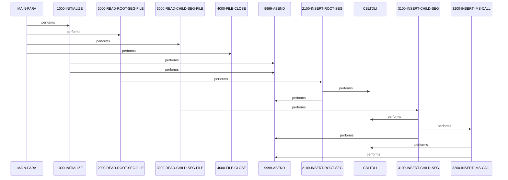

# PAUDBLOD

**File**: `cbl/PAUDBLOD.CBL`
**Type**: FileType.COBOL
**Analyzed**: 2026-02-24 04:01:53.737979

## Purpose

PAUDBLOD is a batch utility program that loads pending authorization data into an IMS hierarchical database. It reads sequential root segment records from INFILE1 and inserts them as PAUTSUM0 segments using IMS ISRT calls. It then reads child segment records from INFILE2 (prefixed with root key), performs a qualified GU on the parent root segment, and inserts the child as PAUTDTL1 segments using ISRT.

**Business Context**: Loads pending authorization summary and detail records into IMS for an authorization database supporting financial or payment processing systems.

## Inputs

| Name | Type | Description |
|------|------|-------------|
| INFILE1 | IOType.FILE_SEQUENTIAL | Sequential file containing pending authorization summary root segment records (PIC X(100)) |
| INFILE2 | IOType.FILE_SEQUENTIAL | Sequential file containing root segment key (S9(11) COMP-3) followed by pending authorization detail child segment records (PIC X(200)) |

## Outputs

| Name | Type | Description |
|------|------|-------------|
| PAUTSUM0 | IOType.IMS_SEGMENT | IMS root segments for pending authorization summaries inserted into the database |
| PAUTDTL1 | IOType.IMS_SEGMENT | IMS child segments for pending authorization details inserted under matching PAUTSUM0 parents |

## Business Rules

- **BR001**: Only process child records if ROOT-SEG-KEY is numeric
- **BR002**: Parent root segment must exist and be retrievable via qualified GU before inserting child
- **BR003**: Ignore duplicate segment inserts (status II)

## Paragraphs/Procedures

### MAIN-PARA
> [Source: MAIN-PARA.cbl.md](PAUDBLOD.CBL.d/MAIN-PARA.cbl.md)
MAIN-PARA serves as the primary orchestration point for the entire IMS data load process. It first establishes an alternate entry point with ENTRY 'DLITCBL' USING PAUTBPCB, allowing the program to be invoked under that name with the PCB passed in linkage. It then displays a 'STARTING PAUDBLOD' message for logging. Next, it performs 1000-INITIALIZE thru 1000-EXIT to handle date acceptance, displays, and input file opens with status validation. After initialization, it enters a processing loop that repeatedly performs 2000-READ-ROOT-SEG-FILE thru 2000-EXIT until END-ROOT-SEG-FILE is 'Y', loading all root segments from INFILE1. Once root processing completes, it enters a second loop performing 3000-READ-CHILD-SEG-FILE thru 3000-EXIT until END-CHILD-SEG-FILE is 'Y', which processes child segments from INFILE2 with parent qualification. Upon completion of both loops, it performs 4000-FILE-CLOSE thru 4000-EXIT to safely close input files with status checks. The paragraph concludes with GOBACK to terminate the program normally. Error handling is delegated to subordinate paragraphs, which abend on failures without returning control here. No direct data transformations or business decisions; purely flow control.

### 1000-INITIALIZE
> [Source: 1000-INITIALIZE.cbl.md](PAUDBLOD.CBL.d/1000-INITIALIZE.cbl.md)
The 1000-INITIALIZE paragraph performs startup initialization tasks essential before data processing. It accepts CURRENT-DATE from DATE and CURRENT-YYDDD from DAY for potential logging or validation use. It displays banner lines and the current date for operator visibility. It then opens INFILE1 as INPUT and immediately checks WS-INFIL1-STATUS; if not spaces or '00', it displays the error status and performs 9999-ABEND to terminate. Similarly, it opens INFILE2 as INPUT and validates WS-INFIL2-STATUS, abending on failure with a display message. No data is read or written to files here; outputs are limited to DISPLAY statements. No subordinate paragraphs are called. Business logic centers on file availability validation to prevent downstream I/O errors. Error handling is immediate and fatal for open failures. This ensures clean file handles before entering load loops.

### 2000-READ-ROOT-SEG-FILE
> [Source: 2000-READ-ROOT-SEG-FILE.cbl.md](PAUDBLOD.CBL.d/2000-READ-ROOT-SEG-FILE.cbl.md)
This paragraph implements the read logic for root segment input file within the main loop. It performs a READ on INFILE1, consuming INFIL1-REC. It checks WS-INFIL1-STATUS post-read; if spaces or '00', it moves INFIL1-REC to PENDING-AUTH-SUMMARY and performs 2100-INSERT-ROOT-SEG thru exit to insert into IMS. If status is '10', it sets END-ROOT-SEG-FILE to 'Y' to exit the loop. For other statuses, it displays an error message but does not abend (incomplete handling?). Inputs are from INFILE1; outputs are the moved data to WS and control to insert paragraph. Business logic is EOF detection and successful read validation. Error handling defers abend to the insert paragraph if IMS fails. It calls 2100-INSERT-ROOT-SEG only on successful reads. This drives the complete loading of all root segments sequentially.

### 2100-INSERT-ROOT-SEG
> [Source: 2100-INSERT-ROOT-SEG.cbl.md](PAUDBLOD.CBL.d/2100-INSERT-ROOT-SEG.cbl.md)
The 2100-INSERT-ROOT-SEG paragraph executes the IMS insert for a root segment after reading from INFILE1. It calls 'CBLTDLI' using FUNC-ISRT, PAUTBPCB, PENDING-AUTH-SUMMARY, and ROOT-UNQUAL-SSA to unconditionally insert the PAUTSUM0 segment. It displays banner messages around the call for debugging. Post-call, if PAUT-PCB-STATUS is spaces, it displays success; if 'II', displays duplicate message and continues. If any other status, it displays failure with status and performs 9999-ABEND. Inputs are pre-moved PENDING-AUTH-SUMMARY from read; outputs are the inserted IMS segment. No data transforms. Business logic tolerates duplicates (II) but abends on other IMS errors like GE or GP. Error handling is status-based with fatal abend for non-success/non-dupe. No subordinate calls.

### 3000-READ-CHILD-SEG-FILE
> [Source: 3000-READ-CHILD-SEG-FILE.cbl.md](PAUDBLOD.CBL.d/3000-READ-CHILD-SEG-FILE.cbl.md)
This paragraph handles reading child segments from INFILE2 in the main post-root loop. It performs READ INFILE2, populating ROOT-SEG-KEY and CHILD-SEG-REC. If WS-INFIL2-STATUS is spaces or '00' and ROOT-SEG-KEY IS NUMERIC, it moves ROOT-SEG-KEY to QUAL-SSA-KEY-VALUE, moves CHILD-SEG-REC to PENDING-AUTH-DETAILS, and performs 3100-INSERT-CHILD-SEG thru exit. If status '10', sets END-CHILD-SEG-FILE to 'Y' for loop exit. Other statuses trigger error display without abend. Inputs from INFILE2; outputs prepared WS data and control to child insert. Business logic validates key numeric before processing to avoid invalid GU. Error handling similar to root read, defers to insert. Calls 3100 only on valid reads. Drives sequential child loading with parent key dependency.

### 3100-INSERT-CHILD-SEG
> [Source: 3100-INSERT-CHILD-SEG.cbl.md](PAUDBLOD.CBL.d/3100-INSERT-CHILD-SEG.cbl.md)
3100-INSERT-CHILD-SEG manages the IMS operations to insert a child under its parent root. It initializes PAUT-PCB-STATUS, then calls 'CBLTDLI' with FUNC-GU, PAUTBPCB, PENDING-AUTH-SUMMARY (io area), and ROOT-QUAL-SSA to retrieve the parent by key. Displays banners around GU. If PAUT-PCB-STATUS spaces, displays success and performs 3200-INSERT-IMS-CALL thru exit for child insert. If not spaces or 'II', displays failure, key feedback area, and abends via 9999-ABEND. Inputs are qualified key and child data in WS; outputs updated PCB and potential parent fetch (not used). Business logic enforces parent existence before child insert. Error handling abends on GU failure (e.g., GE not found, GP wrong parentage). Calls 3200 only on successful GU.

### 3200-INSERT-IMS-CALL
> [Source: 3200-INSERT-IMS-CALL.cbl.md](PAUDBLOD.CBL.d/3200-INSERT-IMS-CALL.cbl.md)
This paragraph performs the actual IMS ISRT for the child detail segment after parent GU success. It calls 'CBLTDLI' using FUNC-ISRT, PAUTBPCB, PENDING-AUTH-DETAILS, and CHILD-UNQUAL-SSA for unqualified child insert under current parent. If PAUT-PCB-STATUS spaces, displays success. If 'II', displays duplicate and continues. Other statuses display failure with status and keyfb, then abend via 9999-ABEND. Inputs pre-moved child data; outputs inserted PAUTDTL1 segment. No transforms. Business logic same as root insert: tolerate dupes, fail others. Strict error handling with abend. No further calls.

### 4000-FILE-CLOSE
> [Source: 4000-FILE-CLOSE.cbl.md](PAUDBLOD.CBL.d/4000-FILE-CLOSE.cbl.md)
4000-FILE-CLOSE handles graceful shutdown by closing input files after all processing. It displays 'CLOSING THE FILE', then CLOSE INFILE1 and checks WS-INFIL1-STATUS (continue if ok, display error if not). Similarly CLOSE INFILE2 and validate WS-INFIL2-STATUS. No abend on close errors; just display. Inputs are open file handles; no data read/written. Outputs closed files. No business logic or conditions beyond status checks. Error handling non-fatal (logs only). No calls.

### 9999-ABEND
> [Source: 9999-ABEND.cbl.md](PAUDBLOD.CBL.d/9999-ABEND.cbl.md)
9999-ABEND is the uniform abnormal termination handler invoked from all error paths. It displays 'IMS LOAD ABENDING ...' for logging. Sets RETURN-CODE to 16 to signal failure to caller or JCL. Executes GOBACK to exit immediately. Consumes no inputs; triggered by PERFORM from error sites. Produces display output and return code. No file I/O or data mods. No decisions; always terminates. Called by file open/read errors, IMS call failures. Flows thru to 9999-EXIT.

### 9999-EXIT
> [Source: 9999-EXIT.cbl.md](PAUDBLOD.CBL.d/9999-EXIT.cbl.md)
9999-EXIT is a minimal exit paragraph following 9999-ABEND, containing only an EXIT statement. It provides a conventional THRU-exit point for the abend logic without additional processing. No inputs consumed, no outputs produced, no logic executed. Serves as a structural placeholder in PERFORM THRU chains. No error handling needed. Called implicitly thru from 9999-ABEND. No calls made.

## Control Flow

## Open Questions

- ? Purpose of unused variables (e.g., WS-NO-CHKP, WS-AUTH-SMRY-PROC-CNT, PRM-INFO) and commented code (e.g., PSB-NAME, date adds)?
  - Context: Defined in WS but never referenced or incremented; PRM-INFO in WS but no linkage/argument usage.
- ? Role of ENTRY 'DLITCBL' USING PAUTBPCB and why IO-PCB-MASK passed but unused?
  - Context: ENTRY defined but main logic follows; PCB used only in IMS calls.

## Sequence Diagram

