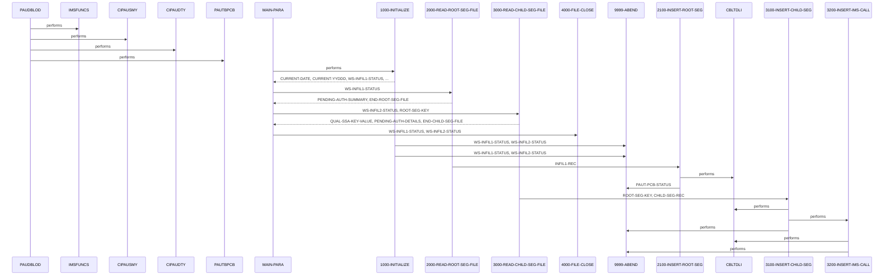

# PAUDBLOD

**File**: `cbl/PAUDBLOD.CBL`
**Type**: FileType.COBOL
**Analyzed**: 2026-02-10 17:10:17.233705

## Purpose

This COBOL program reads root segment records from INFILE1 and child segment records from INFILE2, then inserts them into an IMS database. It reads each file until the end-of-file is reached, indicated by a file status of '10'.

**Business Context**: UNKNOWN

## Inputs

| Name | Type | Description |
|------|------|-------------|
| INFILE1 | IOType.FILE_SEQUENTIAL | Input file containing root segment records for PENDING-AUTH-SUMMARY. |
| INFILE2 | IOType.FILE_SEQUENTIAL | Input file containing child segment records for PENDING-AUTH-DETAILS. |
| PAUTBPCB | IOType.PARAMETER | PCB parameter for IMS database calls. |

## Called Programs

| Program | Call Type | Purpose |
|---------|-----------|---------|
| CBLTDLI | CallType.STATIC_CALL | Inserts root and child segments into the IMS database. |

## Paragraphs/Procedures

### PAUDBLOD
This is the program ID paragraph. It does not contain any executable code. It serves as the identifier for the COBOL program PAUDBLOD. This paragraph is implicitly executed when the program starts. It does not perform any specific actions or call any other paragraphs. It is the entry point for the program but does not contain any logic itself. It is followed by the MAIN-PARA which contains the program's main logic.

### MAIN-PARA
This paragraph serves as the main control flow for the PAUDBLOD program. It first calls 1000-INITIALIZE to perform initialization tasks such as opening input files. Then, it enters a loop that reads root segment records from INFILE1 using 2000-READ-ROOT-SEG-FILE until the end of the file is reached, indicated by END-ROOT-SEG-FILE being set to 'Y'. Subsequently, it enters another loop to read child segment records from INFILE2 using 3000-READ-CHILD-SEG-FILE until END-CHILD-SEG-FILE is set to 'Y'. Finally, it calls 4000-FILE-CLOSE to close the input files. The program then terminates using GOBACK.

### 1000-INITIALIZE
This paragraph initializes the program by accepting the current date and day. It then opens INFILE1 and INFILE2 for input. It checks the file status after each OPEN statement. If the file status for INFILE1 (WS-INFIL1-STATUS) is not spaces or '00', it displays an error message and calls 9999-ABEND to terminate the program. Similarly, if the file status for INFILE2 (WS-INFIL2-STATUS) is not spaces or '00', it displays an error message and calls 9999-ABEND. This paragraph ensures that the input files are opened successfully before proceeding with the data processing.

### 1000-EXIT
This paragraph serves as the exit point for the 1000-INITIALIZE paragraph. It contains the EXIT statement, which returns control to the calling paragraph (MAIN-PARA). It doesn't perform any specific actions or modify any data. It simply marks the end of the initialization process.

### 2000-READ-ROOT-SEG-FILE
This paragraph reads a record from INFILE1. It checks the file status (WS-INFIL1-STATUS). If the file status is spaces or '00', it moves the content of INFIL1-REC to PENDING-AUTH-SUMMARY and then calls 2100-INSERT-ROOT-SEG to insert the root segment into the IMS database. If the file status is '10', it sets END-ROOT-SEG-FILE to 'Y', indicating the end of the file. If the file status is anything else, it displays an error message. This paragraph handles the reading of root segment records and orchestrates the insertion process or handles end-of-file and error conditions.

### 2000-EXIT
This paragraph serves as the exit point for the 2000-READ-ROOT-SEG-FILE paragraph. It contains the EXIT statement, which returns control to the calling paragraph (MAIN-PARA). It doesn't perform any specific actions or modify any data. It simply marks the end of the root segment reading process.

### 2100-INSERT-ROOT-SEG
This paragraph inserts a root segment into the IMS database using the CBLTDLI call. It calls CBLTDLI with the function code FUNC-ISRT, the PCB PAUTBPCB, the segment data PENDING-AUTH-SUMMARY, and the SSA ROOT-UNQUAL-SSA. After the call, it checks the PCB status (PAUT-PCB-STATUS). If the status is spaces, it displays 'ROOT INSERT SUCCESS'. If the status is 'II', it displays 'ROOT SEGMENT ALREADY IN DB'. If the status is neither spaces nor 'II', it displays 'ROOT INSERT FAILED' along with the PCB status and calls 9999-ABEND to terminate the program. This paragraph handles the IMS database insertion and checks for success or failure based on the PCB status.

### 2100-EXIT
This paragraph serves as the exit point for the 2100-INSERT-ROOT-SEG paragraph. It contains the EXIT statement, which returns control to the calling paragraph (2000-READ-ROOT-SEG-FILE). It doesn't perform any specific actions or modify any data. It simply marks the end of the root segment insertion process.

### 3000-READ-CHILD-SEG-FILE
This paragraph reads a record from INFILE2. It checks the file status (WS-INFIL2-STATUS). If the file status is spaces or '00', it checks if ROOT-SEG-KEY is numeric. If it is, it moves ROOT-SEG-KEY to QUAL-SSA-KEY-VALUE, moves CHILD-SEG-REC to PENDING-AUTH-DETAILS, and then calls 3100-INSERT-CHILD-SEG to insert the child segment into the IMS database. If the file status is '10', it sets END-CHILD-SEG-FILE to 'Y', indicating the end of the file. If the file status is anything else, it displays an error message. This paragraph handles the reading of child segment records and orchestrates the insertion process or handles end-of-file and error conditions.

### 3000-EXIT
This paragraph serves as the exit point for the 3000-READ-CHILD-SEG-FILE paragraph. It contains the EXIT statement, which returns control to the calling paragraph (MAIN-PARA). It doesn't perform any specific actions or modify any data. It simply marks the end of the child segment reading process.

### 3100-INSERT-CHILD-SEG
This paragraph attempts to retrieve a root segment from the IMS database and, upon successful retrieval, calls another paragraph to insert a child segment. It first initializes PAUT-PCB-STATUS. It then issues a 'Get Unique' (GU) call to retrieve the root segment PENDING-AUTH-SUMMARY using the PAUTBPCB and ROOT-QUAL-SSA. The paragraph checks the PAUT-PCB-STATUS after the GU call. If the status is spaces, indicating success, it calls 3200-INSERT-IMS-CALL to insert the child segment. If the GU call fails (PAUT-PCB-STATUS is not spaces or 'II'), it displays an error message including the PAUT-PCB-STATUS and PAUT-KEYFB, and then calls 9999-ABEND to terminate the program. The paragraph calls CBLTDLI for the GU operation and 3200-INSERT-IMS-CALL for the child segment insertion.

### 3100-EXIT
This paragraph serves as the exit point for the 3100-INSERT-CHILD-SEG paragraph. It contains a simple EXIT statement, providing a common point for returning control from the paragraph.

### 3200-INSERT-IMS-CALL
This paragraph attempts to insert a child segment into the IMS database. It issues an 'Insert' (ISRT) call using CBLTDLI with FUNC-ISRT, PAUTBPCB, PENDING-AUTH-DETAILS, and CHILD-UNQUAL-SSA. After the ISRT call, it checks the PAUT-PCB-STATUS. If the status is spaces, it displays a success message. If the status is 'II', it displays a message indicating the segment is already in the database. If the status is neither spaces nor 'II', it displays an error message including the PAUT-PCB-STATUS and PAUT-KEYFB, and then calls 9999-ABEND to terminate the program. The paragraph uses CBLTDLI to perform the insert operation and checks the PCB status to determine success or failure.

### 3200-EXIT
This paragraph serves as the exit point for the 3200-INSERT-IMS-CALL paragraph. It contains a simple EXIT statement, providing a common point for returning control from the paragraph.

### 4000-FILE-CLOSE
This paragraph closes two input files, INFILE1 and INFILE2, and checks their respective status codes. It first displays a message indicating that the files are being closed. It then closes INFILE1 and checks WS-INFIL1-STATUS. If the status is spaces or '00', it continues. Otherwise, it displays an error message including the WS-INFIL1-STATUS. The same process is repeated for INFILE2 and WS-INFIL2-STATUS. This paragraph ensures that the input files are properly closed and reports any errors encountered during the closing process.

### 4000-EXIT
This paragraph serves as the exit point for the 4000-FILE-CLOSE paragraph. It contains a simple EXIT statement, providing a common point for returning control from the paragraph.

### 9999-ABEND
This paragraph handles program termination due to an error condition. It displays a message indicating that the IMS load is abending. It then moves the value 16 to RETURN-CODE and executes a GOBACK statement, terminating the program and setting the return code to 16. This paragraph is called when a critical error is encountered during IMS database operations.

### 9999-EXIT
This paragraph serves as the exit point for the 9999-ABEND paragraph. It contains a simple EXIT statement, providing a common point for returning control from the paragraph. However, since 9999-ABEND performs a GOBACK, this paragraph is never actually reached.

## Control Flow

## Open Questions

- ? What is the purpose of the IMS database being updated?
  - Context: The business context of the IMS update is unclear.
- ? What is the structure of the INFILE1 and INFILE2 files?
  - Context: The copybooks for these files are not provided.
- ? What is the purpose of the IMSFUNCS, CIPAUSMY, CIPAUDTY, PAUTBPCB calls in the PAUDBLOD paragraph?
  - Context: The purpose of these calls is unclear.

## Sequence Diagram

