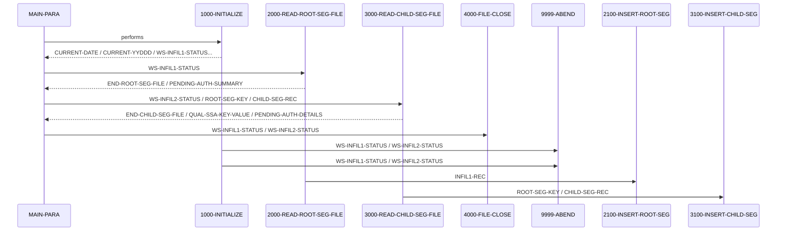

# PAUDBLOD

**File:** PAUDBLOD.CBL
**Type:** COBOL
**Status:** In Progress
**Iterations:** 1
**Analyzed:** 2026-02-24 17:43:32.357547

## Purpose

The COBOL program PAUDBLOD reads two sequential input files, INFILE1 and INFILE2, and inserts data from these files into an IMS database. INFILE1 provides data for the root segment (PAUTSUM0), and INFILE2 provides data for the child segment (PAUTDTL1).

**Business Context:** UNKNOWN
**Program Type:** BATCH
**Citations:** Lines 18, 26, 32, 226, 230

## Calling Context

**Entry Points:** DLITCBL
**Linkage Section:** IO-PCB-MASK, PAUTBPCB

## Inputs

### INFILE1
- **Type:** FILE_SEQUENTIAL
- **Description:** Sequential file containing data for the root segment (PAUTSUM0) of the IMS database.
- **Copybook:** [CIPAUSMY](../copybooks/CIPAUSMY.cpy.md)
- **Lines:** 26, 201, 226

### INFILE2
- **Type:** FILE_SEQUENTIAL
- **Description:** Sequential file containing data for the child segment (PAUTDTL1) of the IMS database.
- **Copybook:** [CIPAUDTY](../copybooks/CIPAUDTY.cpy.md)
- **Lines:** 32, 209, 180

### IO-PCB-MASK
- **Type:** PARAMETER
- **Description:** IO PCB Mask passed to the program.
- **Copybook:** [PAUTBPCB](../copybooks/PAUTBPCB.cpy.md)
- **Lines:** 164

### PAUTBPCB
- **Type:** PARAMETER
- **Description:** PAUTBPCB is a PCB mask passed to the program.
- **Copybook:** [PAUTBPCB](../copybooks/PAUTBPCB.cpy.md)
- **Lines:** 165

## Outputs

### IMS Database (PAUTSUM0, PAUTDTL1)
- **Type:** IMS_SEGMENT
- **Description:** IMS database segments PAUTSUM0 (root) and PAUTDTL1 (child) are populated with data from INFILE1 and INFILE2 respectively.
- **Lines:** 230

## Copybooks Used

| Copybook | Location | Purpose | Line |
|----------|----------|---------|------|
| [IMSFUNCS](../copybooks/IMSFUNCS.cpy.md) | WORKING_STORAGE | Contains IMS function definitions. | 142 |
| [CIPAUSMY](../copybooks/CIPAUSMY.cpy.md) | WORKING_STORAGE | Defines the layout of the PENDING-AUTH-SUMMARY segment (root segment). | 149 |
| [CIPAUDTY](../copybooks/CIPAUDTY.cpy.md) | WORKING_STORAGE | Defines the layout of the PENDING-AUTH-DETAILS segment (child segment). | 153 |
| [PAUTBPCB](../copybooks/PAUTBPCB.cpy.md) | LINKAGE | Defines the PCB mask. | 114 |

## Data Flow

### Reads From
- **INFILE1**: INFIL1-REC
  (Lines: 226)
- **INFILE2**: ROOT-SEG-KEY, CHILD-SEG-REC
  (Lines: 180)

### Writes To
- **PAUTSUM0 (IMS Segment)**: PENDING-AUTH-SUMMARY
  (Lines: 230)
- **PAUTDTL1 (IMS Segment)**: PENDING-AUTH-DETAILS
  (Lines: 180)

### Transformations
- **INFIL1-REC** → **PENDING-AUTH-SUMMARY**: Data from INFILE1 record is moved to the PENDING-AUTH-SUMMARY structure.
  (Lines: 229)

## Key Paragraphs

### MAIN-PARA
**Purpose:** MAIN-PARA is the main control paragraph of the PAUDBLOD program. It orchestrates the overall program flow by calling other paragraphs to perform initialization, file reading, and database insertion. It starts by displaying a message indicating the program's start (line 173). It then calls 1000-INITIALIZE to perform initial setup tasks such as accepting the current date and opening the input files (INFILE1 and INFILE2). After initialization, it enters a loop that reads records from INFILE1 (root segment data) using 2000-READ-ROOT-SEG-FILE and inserts them into the IMS database using 2100-INSERT-ROOT-SEG. This loop continues until the end of INFILE1 is reached. Subsequently, it enters another loop to read records from INFILE2 (child segment data) using 3000-READ-CHILD-SEG-FILE. Finally, it calls 4000-FILE-CLOSE to close the input files and terminates the program with GOBACK.
- Calls: 1000-INITIALIZE, 2000-READ-ROOT-SEG-FILE, 3000-READ-CHILD-SEG-FILE, 4000-FILE-CLOSE
- Lines: 169-187

### 1000-INITIALIZE
**Purpose:** The 1000-INITIALIZE paragraph performs the initial setup tasks required for the PAUDBLOD program to run successfully. It begins by accepting the current date and current year/day from the system (lines 172-173). It then displays the current date on the console (lines 196-197). The paragraph proceeds to open INFILE1 and INFILE2 for input (lines 201, 209). It checks the file status after each OPEN operation (WS-INFIL1-STATUS, WS-INFIL2-STATUS). If the file status is not equal to spaces or '00' (indicating a successful open), it displays an error message and calls 9999-ABEND to terminate the program. Otherwise, it continues processing. No data is written in this paragraph. This paragraph is called by MAIN-PARA to ensure that the program's environment is properly initialized before processing any data.
- Called by: MAIN-PARA
- Calls: 9999-ABEND
- Lines: 190-219

### 2000-READ-ROOT-SEG-FILE
**Purpose:** The 2000-READ-ROOT-SEG-FILE paragraph reads records from INFILE1, which contains data for the root segment (PAUTSUM0) of the IMS database. It starts by reading a record from INFILE1 (line 226). It then checks the file status (WS-INFIL1-STATUS) to determine if the read was successful. If the file status is equal to spaces or '00', it moves the data from the input record (INFIL1-REC) to the PENDING-AUTH-SUMMARY structure (line 229). After moving the data, it calls 2100-INSERT-ROOT-SEG to insert the root segment into the IMS database. If the file status is '10', it indicates the end of the file, and the program proceeds to the next step. If the file status indicates an error, the program may proceed to an error handling routine (though this is not explicitly shown in the provided snippet). This paragraph is called repeatedly by MAIN-PARA until the end of INFILE1 is reached, as indicated by the END-ROOT-SEG-FILE flag being set to 'Y'.
- Called by: MAIN-PARA
- Calls: 2100-INSERT-ROOT-SEG
- Lines: 222-233

### 3000-READ-CHILD-SEG-FILE
**Purpose:** The 3000-READ-CHILD-SEG-FILE paragraph is responsible for reading records from INFILE2, which contains data for the child segment (PAUTDTL1) of the IMS database. The provided code snippet only shows the paragraph being performed until END-CHILD-SEG-FILE is equal to 'Y' (line 181). The actual READ statement and subsequent processing of the INFILE2 data are not included in the provided code. Based on the program's overall purpose, it's likely that this paragraph would read a record from INFILE2, move the relevant data to the PENDING-AUTH-DETAILS structure, and then call another paragraph (similar to 2100-INSERT-ROOT-SEG) to insert the child segment into the IMS database. Error handling for file status would also likely be present. This paragraph is called repeatedly by MAIN-PARA until the end of INFILE2 is reached.
- Called by: MAIN-PARA
- Lines: 180-181

### 4000-FILE-CLOSE
**Purpose:** The 4000-FILE-CLOSE paragraph is responsible for closing the input files INFILE1 and INFILE2. The code for this paragraph is not provided in the snippet. However, based on standard COBOL programming practices, this paragraph would contain CLOSE statements for both INFILE1 and INFILE2. It would also likely check the file status after each CLOSE operation and perform error handling if any errors occur during the close process. This paragraph is called by MAIN-PARA after all records have been read from both input files to ensure that the files are properly closed before the program terminates.
- Called by: MAIN-PARA
- Lines: 183-183

## Inter-Paragraph Data Flow

| Caller | Callee | Inputs | Outputs | Purpose |
|--------|--------|--------|---------|---------|
| MAIN-PARA | 1000-INITIALIZE | - | CURRENT-DATE, CURRENT-YYDDD, WS-INFIL1-STATUS, WS-INFIL2-STATUS, END-ROOT-SEG-FILE, END-CHILD-SEG-FILE | Initializes the program by accepting current date values and opening input files INFILE1 and INFILE2, setting status flags accordingly. |
| MAIN-PARA | 2000-READ-ROOT-SEG-FILE | WS-INFIL1-STATUS | END-ROOT-SEG-FILE, PENDING-AUTH-SUMMARY | Reads a record from INFILE1 and moves it to PENDING-AUTH-SUMMARY if successful, otherwise sets END-ROOT-SEG-FILE flag on end-of-file. |
| MAIN-PARA | 3000-READ-CHILD-SEG-FILE | WS-INFIL2-STATUS, ROOT-SEG-KEY, CHILD-SEG-REC | END-CHILD-SEG-FILE, QUAL-SSA-KEY-VALUE, PENDING-AUTH-DETAILS | Reads a record from INFILE2, populates child segment data and key for IMS insertion if valid, or sets end-of-file flag. |
| MAIN-PARA | 4000-FILE-CLOSE | WS-INFIL1-STATUS, WS-INFIL2-STATUS | - | Closes both INFILE1 and INFILE2 and displays error messages if either file fails to close. |
| 1000-INITIALIZE | 9999-ABEND | - | RETURN-CODE | Terminates the program abnormally by setting RETURN-CODE to 16 after displaying an abend message. |
| 1000-INITIALIZE | 9999-ABEND | WS-INFIL1-STATUS, WS-INFIL2-STATUS | - | Abends the program with return code 16 when an input file fails to open. |
| 2000-READ-ROOT-SEG-FILE | 2100-INSERT-ROOT-SEG | INFIL1-REC | - | Inserts a root segment into the IMS database using data read from INFILE1. |
| 2100-INSERT-ROOT-SEG | 9999-ABEND | PAUT-PCB-STATUS | - | Abends the program if the root segment insert operation fails with an unexpected status code. |
| 3000-READ-CHILD-SEG-FILE | 3100-INSERT-CHILD-SEG | ROOT-SEG-KEY, CHILD-SEG-REC | - | Inserts a child segment into the IMS database after qualifying the parent root segment using the root key. |
| 3100-INSERT-CHILD-SEG | 3200-INSERT-IMS-CALL | - | - | Performs an IMS insert call to add a child segment to the database after successfully retrieving the parent segment. |
| 3100-INSERT-CHILD-SEG | 9999-ABEND | - | - | Abends the program with return code 16 when the GU call to the root segment fails. |
| 3200-INSERT-IMS-CALL | 9999-ABEND | - | - | Abends the program with return code 16 when the ISRT call for the child segment fails. |

## Error Handling

- **WS-INFIL1-STATUS not equal to SPACES or '00' during OPEN:** DISPLAY error message and ABEND
  (Lines: 205, 206)
- **WS-INFIL2-STATUS not equal to SPACES or '00' during OPEN:** DISPLAY error message and ABEND
  (Lines: 213, 214)

## Open Questions

- **What is the purpose of the IMSFUNCS copybook?**
  - Context: The code only includes a COPY statement, but not the contents of the copybook.
  - Suggestion: Examine the IMSFUNCS copybook to understand the IMS functions used by the program.
- **What is the purpose of the 'DLITCBL' entry point?**
  - Context: The purpose of this entry point is not clear from the provided code.
  - Suggestion: Consult IMS documentation to understand the purpose of the 'DLITCBL' entry point and how it is used in this program.

## Resolved Questions

- **Q:** What is the exact logic within 4000-FILE-CLOSE?
  **A:** The logic within `4000-FILE-CLOSE` in `PAUDBLOD.CBL` is as follows:

1.  Displays the message 'CLOSING THE FILE'.
2.  Closes `INFILE1`.
3.  Checks the status of `INFILE1` (`WS-INFIL1-STATUS`). If the status is spaces or '00', the program continues. Otherwise, it displays an error message indicating an error occurred while closing `INFILE1`.
4.  Closes `INFILE2`.
5.  Checks the status of `INFILE2` (`WS-INFIL2-STATUS`). If the status is spaces or '00', the program continues. Otherwise, it displays an error message indicating an error occurred while closing `INFILE2`.
6.  `4000-EXIT` is performed, which simply contains an `EXIT` statement.
- **Q:** What is the exact logic within 3000-READ-CHILD-SEG-FILE and the paragraph that inserts the child segment?
  **A:** The logic in `3000-READ-CHILD-SEG-FILE` is as follows:

1.  **Read Child Segment File:** Reads a record from `INFILE2` into `INFIL2-REC` (line 272).
2.  **Check File Status:** Checks the file status `WS-INFIL2-STATUS` (line 274).
    *   If the status is spaces or '00' (success), it proceeds.
    *   If the status is '10' (end of file), it sets `END-CHILD-SEG-FILE` to 'Y' (line 285).
    *   If the status is anything else, it displays an error message (line 287).
3.  **Validate Root Segment Key:** Checks if `ROOT-SEG-KEY` is numeric (line 275).
4.  **Move Data and Perform Insert:**
    *   Moves `ROOT-SEG-KEY` to `QUAL-SSA-KEY-VALUE` (line 277). This key is used to qualify the root segment during the IMS call.
    *   Moves `CHILD-SEG-REC` to `PENDING-AUTH-DETAILS` (line 280).
    *   Performs `3100-INSERT-CHILD-SEG` to insert the child segment (line 281).

The paragraph that inserts the child segment is `3100-INSERT-CHILD-SEG`. Here's the logic:

1.  **Initialize PCB Status:** Initializes `PAUT-PCB-STATUS` (line 295).
2.  **Get Unique Root Segment:** Calls IMS function 'GU' (Get Unique) to retrieve the root segment `PAUTSUM0` using the qualified SSA `ROOT-QUAL-SSA` (lines 296-299). The `ROOT-QUAL-SSA` contains the key value from the child record.
3.  **Check PCB Status after GU:** Checks the PCB status `PAUT-PCB-STATUS` after the 'GU' call (line 305).
    *   If the status is spaces (success), it performs `3200-INSERT-IMS-CALL` to insert the child segment (line 309).
    *   If the status is not spaces, it displays an error message and abends (lines 311-313).
4.  **3200-INSERT-IMS-CALL:** This paragraph performs the actual IMS insert call.
    *   It calls IMS function 'ISRT' to insert the child segment `PENDING-AUTH-DETAILS` using the unqualified SSA `CHILD-UNQUAL-SSA` (lines 321-324).
    *   It then checks the PCB status `PAUT-PCB-STATUS` to determine if the insert was successful and displays relevant messages (lines 326-336).
- **Q:** What is the exact logic within 2100-INSERT-ROOT-SEG?
  **A:** ```cobol
2100-INSERT-ROOT-SEG.
    CALL 'CBLTDLI'       USING  FUNC-ISRT
                                PAUTBPCB
                                PENDING-AUTH-SUMMARY
                                ROOT-UNQUAL-SSA.
```

The logic within `2100-INSERT-ROOT-SEG` consists of a call to `CBLTDLI` with the following parameters:
- `FUNC-ISRT`:  Indicates the IMS function to be performed, which is "insert".
- `PAUTBPCB`:  The PCB (Program Communication Block) associated with the PAUTSUM0 root segment.
- `PENDING-AUTH-SUMMARY`: The data to be inserted into the PAUTSUM0 root segment.  This data is moved from `INFIL1-REC` earlier in the program.
- `ROOT-UNQUAL-SSA`:  The unqualified SSA (Segment Search Argument) for the root segment, which specifies the segment to be accessed without any specific key values.

## Sequence Diagram



---
*Generated by War Rig WAR_RIG*