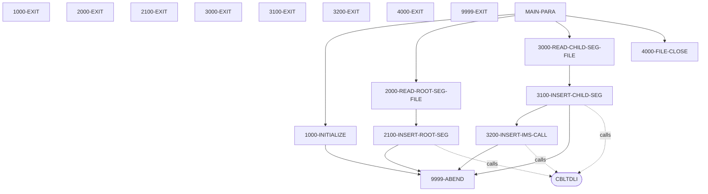
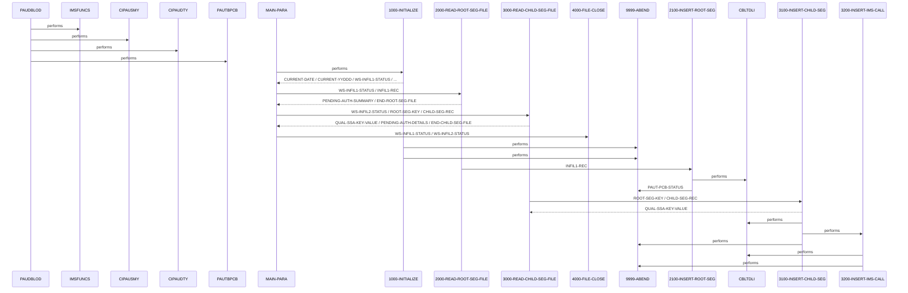

# PAUDBLOD

**File**: `cbl/PAUDBLOD.CBL`
**Type**: FileType.COBOL
**Analyzed**: 2026-03-03 16:44:46.902117

## Purpose

This COBOL program reads root segment records from INFILE1 and child segment records from INFILE2, then inserts them into an IMS database. It uses CBLTDLI calls to perform the database insertions, handling potential errors during the process.

**Business Context**: UNKNOWN

## Inputs

| Name | Type | Description |
|------|------|-------------|
| INFILE1 | IOType.FILE_SEQUENTIAL | Contains root segment records for insertion into the IMS database. |
| INFILE2 | IOType.FILE_SEQUENTIAL | Contains child segment records for insertion into the IMS database. |

## Outputs

| Name | Type | Description |
|------|------|-------------|
| IMS Database | IOType.IMS_SEGMENT | The program inserts root and child segment records into the IMS database. |

## Called Programs

| Program | Call Type | Purpose |
|---------|-----------|---------|
| CBLTDLI | CallType.STATIC_CALL | Performs IMS database operations, specifically inserting root and child segments. |
| IMSFUNCS | CallType.OTHER | UNKNOWN |
| CIPAUSMY | CallType.OTHER | UNKNOWN |
| CIPAUDTY | CallType.OTHER | UNKNOWN |
| PAUTBPCB | CallType.OTHER | UNKNOWN |

## Paragraphs/Procedures

### PAUDBLOD
> [Source: PAUDBLOD.cbl.md](PAUDBLOD.CBL.d/PAUDBLOD.cbl.md)
This is the program ID paragraph. It appears to be the entry point of the program, but its function is unclear from the provided code snippet. It calls several other programs (IMSFUNCS, CIPAUSMY, CIPAUDTY, PAUTBPCB), but the purpose of these calls cannot be determined without further context. The paragraph itself doesn't perform any explicit data manipulation or logic. It's likely that the called programs perform the core functionality of the application, but their roles are unknown. Without more information, the exact purpose of this paragraph remains unclear.

### MAIN-PARA
> [Source: MAIN-PARA.cbl.md](PAUDBLOD.CBL.d/MAIN-PARA.cbl.md)

```
MAIN-PARA  (7 statements, depth=1)
PARAGRAPH
├── UNKNOWN: ENTRY 'DLITCBL' USING PAUTBPCB
├── DISPLAY: DISPLAY 'STARTING PAUDBLOD'
├── PERFORM_THRU: PERFORM 1000-INITIALIZE THRU 1000-EXIT
├── PERFORM_THRU: PERFORM 2000-READ-ROOT-SEG-FILE THRU 2000-EXIT UNTIL END-ROOT-SEG-FIL...
├── PERFORM_THRU: PERFORM 3000-READ-CHILD-SEG-FILE THRU 3000-EXIT UNTIL END-CHILD-SEG-F...
├── PERFORM_THRU: PERFORM 4000-FILE-CLOSE THRU 4000-EXIT
└── GOBACK: GOBACK
```
This paragraph serves as the main control flow for the program. It first calls 1000-INITIALIZE to perform initial setup, such as opening files. Then, it enters a loop that reads root segment records from INFILE1 using 2000-READ-ROOT-SEG-FILE until the end-of-file is reached (END-ROOT-SEG-FILE = 'Y'). Subsequently, it enters another loop to read child segment records from INFILE2 using 3000-READ-CHILD-SEG-FILE until the end-of-file is reached (END-CHILD-SEG-FILE = 'Y'). Finally, it calls 4000-FILE-CLOSE to close the input files. The program then terminates using GOBACK.

### 1000-INITIALIZE
> [Source: 1000-INITIALIZE.cbl.md](PAUDBLOD.CBL.d/1000-INITIALIZE.cbl.md)

```
1000-INITIALIZE  (17 statements, depth=3)
PARAGRAPH
├── ACCEPT: ACCEPT CURRENT-DATE FROM DATE
├── ACCEPT: ACCEPT CURRENT-YYDDD FROM DAY
├── DISPLAY: DISPLAY '*-------------------------------------*'
├── DISPLAY: DISPLAY 'TODAYS DATE :' CURRENT-DATE
├── DISPLAY: DISPLAY ' '
├── OPEN: OPEN INPUT INFILE1
├── IF: IF WS-INFIL1-STATUS = SPACES OR '00' CONTINUE ELSE DISPLAY 'ERROR IN ...
│   ├── CONTINUE: CONTINUE
│   └── ELSE: ELSE
│       ├── DISPLAY: DISPLAY 'ERROR IN OPENING INFILE1:' WS-INFIL1-STATUS
│       └── PERFORM: PERFORM 9999-ABEND
├── OPEN: OPEN INPUT INFILE2
└── IF: IF WS-INFIL2-STATUS = SPACES OR '00' CONTINUE ELSE DISPLAY 'ERROR IN ...
    ├── CONTINUE: CONTINUE
    └── ELSE: ELSE
        ├── DISPLAY: DISPLAY 'ERROR IN OPENING INFILE2:' WS-INFIL2-STATUS
        └── PERFORM: PERFORM 9999-ABEND
```
This paragraph initializes the program by accepting the current date and day from the system. It then displays the current date. It opens INFILE1 and INFILE2 for input. If the open operation for INFILE1 is unsuccessful (WS-INFIL1-STATUS is not spaces or '00'), an error message is displayed, and the program abends via 9999-ABEND. Similarly, if the open operation for INFILE2 is unsuccessful (WS-INFIL2-STATUS is not spaces or '00'), an error message is displayed, and the program abends via 9999-ABEND. This paragraph ensures that the input files are successfully opened before proceeding with the rest of the program.

### 1000-EXIT
> [Source: 1000-EXIT.cbl.md](PAUDBLOD.CBL.d/1000-EXIT.cbl.md)

```
1000-EXIT  (1 statements, depth=1)
PARAGRAPH
└── EXIT: EXIT
```
This paragraph simply contains the EXIT statement, marking the end of the 1000-INITIALIZE paragraph. It serves as a return point for the PERFORM THRU statement in MAIN-PARA.

### 2000-READ-ROOT-SEG-FILE
> [Source: 2000-READ-ROOT-SEG-FILE.cbl.md](PAUDBLOD.CBL.d/2000-READ-ROOT-SEG-FILE.cbl.md)

```
2000-READ-ROOT-SEG-FILE  (9 statements, depth=5)
PARAGRAPH
├── READ: READ INFILE1
└── IF: IF WS-INFIL1-STATUS = SPACES OR '00' MOVE INFIL1-REC TO PENDING-AUTH-...
    ├── MOVE: MOVE INFIL1-REC TO PENDING-AUTH-SUMMARY
    ├── PERFORM_THRU: PERFORM 2100-INSERT-ROOT-SEG THRU 2100-EXIT
    └── ELSE: ELSE
        └── IF: IF WS-INFIL1-STATUS = '10' MOVE 'Y' TO END-ROOT-SEG-FILE ELSE DISPLAY...
            ├── MOVE: MOVE 'Y' TO END-ROOT-SEG-FILE
            └── ELSE: ELSE
                └── DISPLAY: DISPLAY 'ERROR READING ROOT SEG INFILE'
```
This paragraph reads a record from INFILE1. If the read is successful (WS-INFIL1-STATUS is spaces or '00'), the record is moved to PENDING-AUTH-SUMMARY, and 2100-INSERT-ROOT-SEG is performed to insert the root segment into the IMS database. If the read is unsuccessful and the file status is '10' (end-of-file), END-ROOT-SEG-FILE is set to 'Y'. If the read is unsuccessful and the file status is not '10', an error message is displayed. This paragraph manages the reading of root segment records and delegates the insertion process to another paragraph.

### 2000-EXIT
> [Source: 2000-EXIT.cbl.md](PAUDBLOD.CBL.d/2000-EXIT.cbl.md)

```
2000-EXIT  (1 statements, depth=1)
PARAGRAPH
└── EXIT: EXIT
```
This paragraph simply contains the EXIT statement, marking the end of the 2000-READ-ROOT-SEG-FILE paragraph. It serves as a return point for the PERFORM THRU statement in MAIN-PARA.

### 2100-INSERT-ROOT-SEG
> [Source: 2100-INSERT-ROOT-SEG.cbl.md](PAUDBLOD.CBL.d/2100-INSERT-ROOT-SEG.cbl.md)

```
2100-INSERT-ROOT-SEG  (10 statements, depth=2)
PARAGRAPH
├── CALL: CALL 'CBLTDLI' USING FUNC-ISRT PAUTBPCB PENDING-AUTH-SUMMARY ROOT-UNQ...
├── DISPLAY: DISPLAY ' *******************************'
├── DISPLAY: DISPLAY ' *******************************'
├── IF: IF PAUT-PCB-STATUS = SPACES DISPLAY 'ROOT INSERT SUCCESS ' END-IF
│   └── DISPLAY: DISPLAY 'ROOT INSERT SUCCESS '
├── IF: IF PAUT-PCB-STATUS = 'II' DISPLAY 'ROOT SEGMENT ALREADY IN DB' END-IF
│   └── DISPLAY: DISPLAY 'ROOT SEGMENT ALREADY IN DB'
└── IF: IF PAUT-PCB-STATUS NOT EQUAL TO SPACES AND 'II' DISPLAY 'ROOT INSERT ...
    ├── DISPLAY: DISPLAY 'ROOT INSERT FAILED :' PAUT-PCB-STATUS
    └── PERFORM: PERFORM 9999-ABEND
```
This paragraph inserts a root segment into the IMS database using a CBLTDLI call with the FUNC-ISRT function code. It uses PAUTBPCB, PENDING-AUTH-SUMMARY, and ROOT-UNQUAL-SSA as parameters for the call. After the call, it checks the PAUT-PCB-STATUS. If the status is spaces, it displays 'ROOT INSERT SUCCESS'. If the status is 'II', it displays 'ROOT SEGMENT ALREADY IN DB'. If the status is neither spaces nor 'II', it displays 'ROOT INSERT FAILED' along with the PAUT-PCB-STATUS and then abends via 9999-ABEND. This paragraph handles the actual IMS database insertion and checks for potential errors.

### 2100-EXIT
> [Source: 2100-EXIT.cbl.md](PAUDBLOD.CBL.d/2100-EXIT.cbl.md)

```
2100-EXIT  (1 statements, depth=1)
PARAGRAPH
└── EXIT: EXIT
```
This paragraph simply contains the EXIT statement, marking the end of the 2100-INSERT-ROOT-SEG paragraph. It serves as a return point for the PERFORM THRU statement in 2000-READ-ROOT-SEG-FILE.

### 3000-READ-CHILD-SEG-FILE
> [Source: 3000-READ-CHILD-SEG-FILE.cbl.md](PAUDBLOD.CBL.d/3000-READ-CHILD-SEG-FILE.cbl.md)

```
3000-READ-CHILD-SEG-FILE  (11 statements, depth=5)
PARAGRAPH
├── READ: READ INFILE2
└── IF: IF WS-INFIL2-STATUS = SPACES OR '00' IF ROOT-SEG-KEY IS NUMERIC *> DI...
    ├── IF: IF ROOT-SEG-KEY IS NUMERIC *> DISPLAY 'GNGTO ROOT SEG KEY' MOVE ROOT-...
    │   ├── MOVE: MOVE ROOT-SEG-KEY TO QUAL-SSA-KEY-VALUE
    │   ├── MOVE: MOVE CHILD-SEG-REC TO PENDING-AUTH-DETAILS
    │   └── PERFORM_THRU: PERFORM 3100-INSERT-CHILD-SEG THRU 3100-EXIT
    └── ELSE: ELSE
        └── IF: IF WS-INFIL2-STATUS = '10' MOVE 'Y' TO END-CHILD-SEG-FILE ELSE DISPLA...
            ├── MOVE: MOVE 'Y' TO END-CHILD-SEG-FILE
            └── ELSE: ELSE
                └── DISPLAY: DISPLAY 'ERROR READING CHILD SEG INFILE'
```
This paragraph reads a record from INFILE2. If the read is successful (WS-INFIL2-STATUS is spaces or '00') and ROOT-SEG-KEY is numeric, it moves ROOT-SEG-KEY to QUAL-SSA-KEY-VALUE, moves CHILD-SEG-REC to PENDING-AUTH-DETAILS, and performs 3100-INSERT-CHILD-SEG to insert the child segment into the IMS database. If the read is unsuccessful and the file status is '10' (end-of-file), END-CHILD-SEG-FILE is set to 'Y'. If the read is unsuccessful and the file status is not '10', an error message is displayed. This paragraph manages the reading of child segment records, performs a data transformation, and delegates the insertion process to another paragraph.

### 3000-EXIT
> [Source: 3000-EXIT.cbl.md](PAUDBLOD.CBL.d/3000-EXIT.cbl.md)

```
3000-EXIT  (1 statements, depth=1)
PARAGRAPH
└── EXIT: EXIT
```
This paragraph simply contains the EXIT statement, marking the end of the 3000-READ-CHILD-SEG-FILE paragraph. It serves as a return point for the PERFORM THRU statement in MAIN-PARA.

### 3100-INSERT-CHILD-SEG
> [Source: 3100-INSERT-CHILD-SEG.cbl.md](PAUDBLOD.CBL.d/3100-INSERT-CHILD-SEG.cbl.md)

```
3100-INSERT-CHILD-SEG  (11 statements, depth=3)
PARAGRAPH
├── INITIALIZE: INITIALIZE PAUT-PCB-STATUS
├── CALL: CALL 'CBLTDLI' USING FUNC-GU PAUTBPCB PENDING-AUTH-SUMMARY ROOT-QUAL-SSA
├── DISPLAY: DISPLAY '***************************'
├── DISPLAY: DISPLAY '***************************'
└── IF: IF PAUT-PCB-STATUS = SPACES DISPLAY 'GU CALL TO ROOT SEG SUCCESS' *> ...
    ├── DISPLAY: DISPLAY 'GU CALL TO ROOT SEG SUCCESS'
    ├── PERFORM_THRU: PERFORM 3200-INSERT-IMS-CALL THRU 3200-EXIT
    └── IF: IF PAUT-PCB-STATUS NOT EQUAL TO SPACES AND 'II' DISPLAY 'ROOT GU CALL...
        ├── DISPLAY: DISPLAY 'ROOT GU CALL FAIL:' PAUT-PCB-STATUS
        ├── DISPLAY: DISPLAY 'KFB AREA IN CHILD:' PAUT-KEYFB
        └── PERFORM: PERFORM 9999-ABEND
```
This paragraph attempts to retrieve a root segment from the IMS database and then insert a child segment. It initializes PAUT-PCB-STATUS and calls CBLTDLI with FUNC-GU to retrieve the root segment using the PAUTBPCB and ROOT-QUAL-SSA. It checks the PAUT-PCB-STATUS after the call; if the status is spaces, it assumes the retrieval was successful and performs 3200-INSERT-IMS-CALL to insert the child segment. If the PAUT-PCB-STATUS is not spaces or 'II', it displays an error message and calls 9999-ABEND to terminate the program. The paragraph consumes PAUTBPCB, PENDING-AUTH-SUMMARY, and ROOT-QUAL-SSA as input and potentially modifies the IMS database by inserting a child segment. Error handling includes checking the PCB status and abending if the root segment retrieval fails.

### 3100-EXIT
> [Source: 3100-EXIT.cbl.md](PAUDBLOD.CBL.d/3100-EXIT.cbl.md)

```
3100-EXIT  (1 statements, depth=1)
PARAGRAPH
└── EXIT: EXIT
```
This paragraph serves as the exit point for the 3100-INSERT-CHILD-SEG paragraph. It contains a simple EXIT statement and ensures a clean return from the 3100-INSERT-CHILD-SEG paragraph. It does not consume any inputs or produce any outputs. It is a standard COBOL paragraph used for structured programming.

### 3200-INSERT-IMS-CALL
> [Source: 3200-INSERT-IMS-CALL.cbl.md](PAUDBLOD.CBL.d/3200-INSERT-IMS-CALL.cbl.md)

```
3200-INSERT-IMS-CALL  (9 statements, depth=2)
PARAGRAPH
├── CALL: CALL 'CBLTDLI' USING FUNC-ISRT PAUTBPCB PENDING-AUTH-DETAILS CHILD-UN...
├── IF: IF PAUT-PCB-STATUS = SPACES DISPLAY 'CHILD SEGMENT INSERTED SUCCESS' ...
│   └── DISPLAY: DISPLAY 'CHILD SEGMENT INSERTED SUCCESS'
├── IF: IF PAUT-PCB-STATUS = 'II' DISPLAY 'CHILD SEGMENT ALREADY IN DB' END-IF
│   └── DISPLAY: DISPLAY 'CHILD SEGMENT ALREADY IN DB'
└── IF: IF PAUT-PCB-STATUS NOT EQUAL TO SPACES AND 'II' DISPLAY 'INSERT CALL ...
    ├── DISPLAY: DISPLAY 'INSERT CALL FAIL FOR CHILD:' PAUT-PCB-STATUS
    ├── DISPLAY: DISPLAY 'KFB AREA IN CHILD:' PAUT-KEYFB
    └── PERFORM: PERFORM 9999-ABEND
```
This paragraph attempts to insert a child segment into the IMS database. It calls CBLTDLI with FUNC-ISRT, using PAUTBPCB, PENDING-AUTH-DETAILS, and CHILD-UNQUAL-SSA. It then checks the PAUT-PCB-STATUS. If the status is spaces, it displays a success message. If the status is 'II', it indicates the child segment already exists. If the status is neither spaces nor 'II', it displays an error message and calls 9999-ABEND. The paragraph consumes PAUTBPCB, PENDING-AUTH-DETAILS and CHILD-UNQUAL-SSA as input and potentially modifies the IMS database by inserting a child segment. Error handling involves checking the PCB status and abending if the insert fails.

### 3200-EXIT
> [Source: 3200-EXIT.cbl.md](PAUDBLOD.CBL.d/3200-EXIT.cbl.md)

```
3200-EXIT  (1 statements, depth=1)
PARAGRAPH
└── EXIT: EXIT
```
This paragraph serves as the exit point for the 3200-INSERT-IMS-CALL paragraph. It contains a simple EXIT statement and ensures a clean return from the 3200-INSERT-IMS-CALL paragraph. It does not consume any inputs or produce any outputs. It is a standard COBOL paragraph used for structured programming.

### 4000-FILE-CLOSE
> [Source: 4000-FILE-CLOSE.cbl.md](PAUDBLOD.CBL.d/4000-FILE-CLOSE.cbl.md)

```
4000-FILE-CLOSE  (11 statements, depth=3)
PARAGRAPH
├── DISPLAY: DISPLAY 'CLOSING THE FILE'
├── CLOSE: CLOSE INFILE1
├── IF: IF WS-INFIL1-STATUS = SPACES OR '00' CONTINUE ELSE DISPLAY 'ERROR IN ...
│   ├── CONTINUE: CONTINUE
│   └── ELSE: ELSE
│       └── DISPLAY: DISPLAY 'ERROR IN CLOSING 1ST FILE:'WS-INFIL1-STATUS
├── CLOSE: CLOSE INFILE2
└── IF: IF WS-INFIL2-STATUS = SPACES OR '00' CONTINUE ELSE DISPLAY 'ERROR IN ...
    ├── CONTINUE: CONTINUE
    └── ELSE: ELSE
        └── DISPLAY: DISPLAY 'ERROR IN CLOSING 2ND FILE:'WS-INFIL2-STATUS
```
This paragraph closes the input files INFILE1 and INFILE2. It displays a message indicating that the files are being closed. It checks the file status after each close operation (WS-INFIL1-STATUS and WS-INFIL2-STATUS). If the status is not spaces or '00', it displays an error message indicating a problem during the close operation. The paragraph consumes WS-INFIL1-STATUS and WS-INFIL2-STATUS as input and closes INFILE1 and INFILE2. Error handling involves checking the file status after each close and displaying an error message if the close fails.

### 4000-EXIT
> [Source: 4000-EXIT.cbl.md](PAUDBLOD.CBL.d/4000-EXIT.cbl.md)

```
4000-EXIT  (1 statements, depth=1)
PARAGRAPH
└── EXIT: EXIT
```
This paragraph serves as the exit point for the 4000-FILE-CLOSE paragraph. It contains a simple EXIT statement and ensures a clean return from the 4000-FILE-CLOSE paragraph. It does not consume any inputs or produce any outputs. It is a standard COBOL paragraph used for structured programming.

### 9999-ABEND
> [Source: 9999-ABEND.cbl.md](PAUDBLOD.CBL.d/9999-ABEND.cbl.md)

```
9999-ABEND  (3 statements, depth=1)
PARAGRAPH
├── DISPLAY: DISPLAY 'IMS LOAD ABENDING ...'
├── MOVE: MOVE 16 TO RETURN-CODE
└── GOBACK: GOBACK
```
This paragraph is the program's abend routine. It displays a message indicating that the IMS load is abending, sets the RETURN-CODE to 16, and then terminates the program using GOBACK. It does not consume any specific inputs but is triggered by error conditions in other paragraphs. It produces an output by setting the RETURN-CODE, which can be used by the calling job to determine the program's failure status. This paragraph is called when a critical error occurs during IMS processing, such as a failed database call.

### 9999-EXIT
> [Source: 9999-EXIT.cbl.md](PAUDBLOD.CBL.d/9999-EXIT.cbl.md)

```
9999-EXIT  (1 statements, depth=1)
PARAGRAPH
└── EXIT: EXIT
```
This paragraph serves as the exit point for the 9999-ABEND paragraph. It contains a simple EXIT statement and ensures a clean return from the 9999-ABEND paragraph. It does not consume any inputs or produce any outputs. It is a standard COBOL paragraph used for structured programming.

## Dead Code

The following artifacts were identified as dead code by static analysis:

| Artifact | Type | Line | Reason |
|----------|------|------|--------|
| INFIL1-REC | record_layout | 44 | Record layout 'INFIL1-REC' is never used by any program |
| INFIL2-REC | record_layout | 46 | Record layout 'INFIL2-REC' is never used by any program |
| ROOT-QUAL-SSA | record_layout | 113 | Record layout 'ROOT-QUAL-SSA' is never used by any program |

## Control Flow


```mermaid
flowchart TD
    %% Title: PAUDBLOD.CBL
    1000_EXIT["1000-EXIT"]
    1000_INITIALIZE["1000-INITIALIZE"]
    9999_ABEND["9999-ABEND"]
    2000_EXIT["2000-EXIT"]
    2000_READ_ROOT_SEG_FILE["2000-READ-ROOT-SEG-FILE"]
    2100_INSERT_ROOT_SEG["2100-INSERT-ROOT-SEG"]
    2100_EXIT["2100-EXIT"]
    CBLTDLI__ext(["CBLTDLI"])
    3000_EXIT["3000-EXIT"]
    3000_READ_CHILD_SEG_FILE["3000-READ-CHILD-SEG-FILE"]
    3100_INSERT_CHILD_SEG["3100-INSERT-CHILD-SEG"]
    3100_EXIT["3100-EXIT"]
    3200_INSERT_IMS_CALL["3200-INSERT-IMS-CALL"]
    3200_EXIT["3200-EXIT"]
    4000_EXIT["4000-EXIT"]
    4000_FILE_CLOSE["4000-FILE-CLOSE"]
    9999_EXIT["9999-EXIT"]
    MAIN_PARA["MAIN-PARA"]
    1000_INITIALIZE --> 9999_ABEND
    2000_READ_ROOT_SEG_FILE --> 2100_INSERT_ROOT_SEG
    2100_INSERT_ROOT_SEG --> 9999_ABEND
    2100_INSERT_ROOT_SEG -.->|calls| CBLTDLI__ext
    3000_READ_CHILD_SEG_FILE --> 3100_INSERT_CHILD_SEG
    3100_INSERT_CHILD_SEG --> 3200_INSERT_IMS_CALL
    3100_INSERT_CHILD_SEG --> 9999_ABEND
    3100_INSERT_CHILD_SEG -.->|calls| CBLTDLI__ext
    3200_INSERT_IMS_CALL --> 9999_ABEND
    3200_INSERT_IMS_CALL -.->|calls| CBLTDLI__ext
    MAIN_PARA --> 1000_INITIALIZE
    MAIN_PARA --> 2000_READ_ROOT_SEG_FILE
    MAIN_PARA --> 3000_READ_CHILD_SEG_FILE
    MAIN_PARA --> 4000_FILE_CLOSE
```

## Open Questions

- ? What is the purpose of the called programs IMSFUNCS, CIPAUSMY, CIPAUDTY, and PAUTBPCB?
  - Context: The code snippet only shows the calls to these programs without any context about their functionality or parameters.
- ? What is the structure of the INFILE1 and INFILE2 files?
  - Context: The code reads records from these files but doesn't define their structure or the copybooks used to describe them.
- ? What is the purpose of the ROOT-UNQUAL-SSA and QUAL-SSA variables?
  - Context: These variables are used in the CBLTDLI call, but their exact purpose and structure are unclear.
- ? What is the structure and meaning of the PAUTBPCB parameter?
  - Context: This parameter is passed to CBLTDLI, but its exact purpose and structure are unclear. It seems to be related to the IMS PCB.
- ? What is the purpose of the FUNC-ISRT parameter?
  - Context: This parameter is passed to CBLTDLI, but its exact purpose is unclear. It seems to be a function code for the IMS call.

## Sequence Diagram


```mermaid
sequenceDiagram
    participant PAUDBLOD as PAUDBLOD
    participant IMSFUNCS as IMSFUNCS
    participant CIPAUSMY as CIPAUSMY
    participant CIPAUDTY as CIPAUDTY
    participant PAUTBPCB as PAUTBPCB
    participant MAIN_PARA as MAIN-PARA
    participant 1000_INITIALIZE as 1000-INITIALIZE
    participant 2000_READ_ROOT_SEG_FILE as 2000-READ-ROOT-SEG-FILE
    participant 3000_READ_CHILD_SEG_FILE as 3000-READ-CHILD-SEG-FILE
    participant 4000_FILE_CLOSE as 4000-FILE-CLOSE
    participant 9999_ABEND as 9999-ABEND
    participant 2100_INSERT_ROOT_SEG as 2100-INSERT-ROOT-SEG
    participant CBLTDLI as CBLTDLI
    participant 3100_INSERT_CHILD_SEG as 3100-INSERT-CHILD-SEG
    participant 3200_INSERT_IMS_CALL as 3200-INSERT-IMS-CALL
    PAUDBLOD->>IMSFUNCS: performs
    PAUDBLOD->>CIPAUSMY: performs
    PAUDBLOD->>CIPAUDTY: performs
    PAUDBLOD->>PAUTBPCB: performs
    MAIN_PARA->>1000_INITIALIZE: performs
    1000_INITIALIZE-->>MAIN_PARA: CURRENT-DATE / CURRENT-YYDDD / WS-INFIL1-STATUS / ...
    MAIN_PARA->>2000_READ_ROOT_SEG_FILE: WS-INFIL1-STATUS / INFIL1-REC
    2000_READ_ROOT_SEG_FILE-->>MAIN_PARA: PENDING-AUTH-SUMMARY / END-ROOT-SEG-FILE
    MAIN_PARA->>3000_READ_CHILD_SEG_FILE: WS-INFIL2-STATUS / ROOT-SEG-KEY / CHILD-SEG-REC
    3000_READ_CHILD_SEG_FILE-->>MAIN_PARA: QUAL-SSA-KEY-VALUE / PENDING-AUTH-DETAILS / END-CHILD-SEG-FILE
    MAIN_PARA->>4000_FILE_CLOSE: WS-INFIL1-STATUS / WS-INFIL2-STATUS
    1000_INITIALIZE->>9999_ABEND: performs
    1000_INITIALIZE->>9999_ABEND: performs
    2000_READ_ROOT_SEG_FILE->>2100_INSERT_ROOT_SEG: INFIL1-REC
    2100_INSERT_ROOT_SEG->>CBLTDLI: performs
    2100_INSERT_ROOT_SEG->>9999_ABEND: PAUT-PCB-STATUS
    3000_READ_CHILD_SEG_FILE->>3100_INSERT_CHILD_SEG: ROOT-SEG-KEY / CHILD-SEG-REC
    3100_INSERT_CHILD_SEG-->>3000_READ_CHILD_SEG_FILE: QUAL-SSA-KEY-VALUE
    3100_INSERT_CHILD_SEG->>CBLTDLI: performs
    3100_INSERT_CHILD_SEG->>3200_INSERT_IMS_CALL: performs
    3100_INSERT_CHILD_SEG->>9999_ABEND: performs
    3200_INSERT_IMS_CALL->>CBLTDLI: performs
    3200_INSERT_IMS_CALL->>9999_ABEND: performs
```
