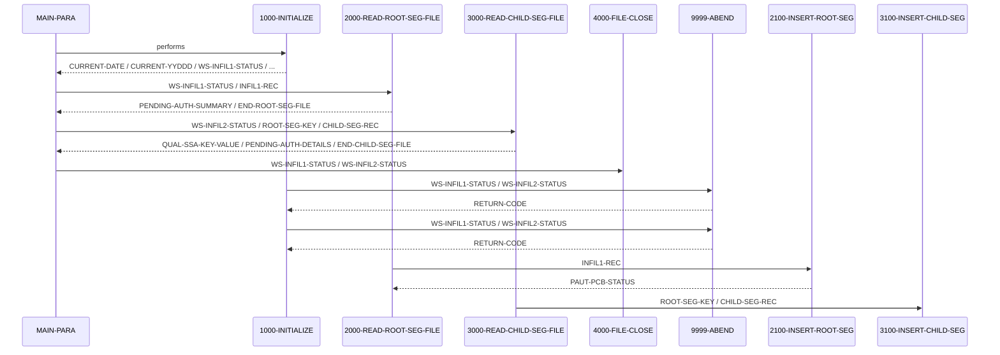

# PAUDBLOD

**File**: `cbl/PAUDBLOD.CBL`
**Type**: FileType.COBOL
**Analyzed**: 2026-02-27 14:51:28.531679

## Purpose

The COBOL program PAUDBLOD reads two sequential input files (INFILE1 and INFILE2), treats the records as IMS database segments (root and child), and inserts them into an IMS database. It reads records from INFILE1 into PENDING-AUTH-SUMMARY (root segment) and INFILE2 into PENDING-AUTH-DETAILS (child segment), then calls IMS functions to insert these segments into the database.

**Business Context**: This program is likely part of a larger system dealing with pending authorizations, possibly related to financial transactions or security clearances. The program's function is to load data from sequential files into an IMS database for further processing or querying.

## Inputs

| Name | Type | Description |
|------|------|-------------|
| INFILE1 | IOType.FILE_SEQUENTIAL | Sequential file containing root segment records for pending authorization summaries. |
| INFILE2 | IOType.FILE_SEQUENTIAL | Sequential file containing child segment records for pending authorization details. |

## Outputs

| Name | Type | Description |
|------|------|-------------|
| IMS Database | IOType.IMS_SEGMENT | The program inserts root (PAUTSUM0) and child (PAUTDTL1) segments into an IMS database. |

## Called Programs

| Program | Call Type | Purpose |
|---------|-----------|---------|
| DLITCBL | CallType.STATIC_CALL | Entry point for IMS DL/I calls. |

## Paragraphs/Procedures

### MAIN-PARA
> [Source: MAIN-PARA.cbl.md](PAUDBLOD.CBL.d/MAIN-PARA.cbl.md)

```
MAIN-PARA  (7 statements, depth=0)
PARAGRAPH
├── UNKNOWN: ENTRY 'DLITCBL'                 USING PAUTBPCB
├── DISPLAY: DISPLAY 'STARTING PAUDBLOD'
├── PERFORM_THRU: PERFORM 1000-INITIALIZE                THRU 1000-EXIT
├── PERFORM_THRU: PERFORM 2000-READ-ROOT-SEG-FILE        THRU 2000-EXIT UNTIL   END-ROO...
├── PERFORM_THRU: PERFORM 3000-READ-CHILD-SEG-FILE       THRU 3000-EXIT UNTIL   END-CHI...
├── PERFORM_THRU: PERFORM 4000-FILE-CLOSE THRU 4000-EXIT
└── GOBACK: GOBACK
```
The MAIN-PARA is the primary control flow for the PAUDBLOD program. It begins by calling the IMS entry point 'DLITCBL' to establish the connection to the IMS database. It then performs 1000-INITIALIZE to open the input files (INFILE1 and INFILE2) and initialize working storage variables, including accepting the current date. After initialization, it enters two processing loops. The first loop reads root segments from INFILE1 by performing 2000-READ-ROOT-SEG-FILE until the end of the file is reached. The second loop reads child segments from INFILE2 by performing 3000-READ-CHILD-SEG-FILE until the end of the file is reached. Finally, it calls 4000-FILE-CLOSE to close the input files and terminates the program with a GOBACK statement.

### 1000-INITIALIZE
> [Source: 1000-INITIALIZE.cbl.md](PAUDBLOD.CBL.d/1000-INITIALIZE.cbl.md)

```
1000-INITIALIZE  (17 statements, depth=1)
PARAGRAPH
├── ACCEPT: ACCEPT CURRENT-DATE     FROM DATE
├── ACCEPT: ACCEPT CURRENT-YYDDD    FROM DAY
├── DISPLAY: DISPLAY '*-------------------------------------*'
├── DISPLAY: DISPLAY 'TODAYS DATE            :' CURRENT-DATE
├── DISPLAY: DISPLAY ' '
├── OPEN: OPEN INPUT  INFILE1
├── IF: IF WS-INFIL1-STATUS =  SPACES OR '00'
│   ├── CONTINUE: CONTINUE
│   └── ELSE: ELSE
│       ├── DISPLAY: DISPLAY 'ERROR IN OPENING INFILE1:' WS-INFIL1-STATUS
│       └── PERFORM: PERFORM 9999-ABEND
├── OPEN: OPEN INPUT INFILE2
└── IF: IF WS-INFIL2-STATUS =  SPACES OR '00'
    ├── CONTINUE: CONTINUE
    └── ELSE: ELSE
        ├── DISPLAY: DISPLAY 'ERROR IN OPENING INFILE2:' WS-INFIL2-STATUS
        └── PERFORM: PERFORM 9999-ABEND
```
The 1000-INITIALIZE paragraph performs initial setup tasks for the program. It accepts the current date and day from the system and displays them. It then opens INFILE1 and INFILE2 for input. If either file fails to open (file status is not SPACES or '00'), an error message is displayed, and the program abends by performing 9999-ABEND. This paragraph ensures that the input files are accessible before the main processing loop begins. The paragraph sets up the environment for reading the input files.

### 2000-READ-ROOT-SEG-FILE
> [Source: 2000-READ-ROOT-SEG-FILE.cbl.md](PAUDBLOD.CBL.d/2000-READ-ROOT-SEG-FILE.cbl.md)

```
2000-READ-ROOT-SEG-FILE  (9 statements, depth=3)
PARAGRAPH
├── READ: READ INFILE1
└── IF: IF WS-INFIL1-STATUS =  SPACES OR '00'
    ├── MOVE: MOVE INFIL1-REC TO PENDING-AUTH-SUMMARY
    ├── PERFORM_THRU: PERFORM 2100-INSERT-ROOT-SEG THRU 2100-EXIT
    └── ELSE: ELSE
        └── IF: IF WS-INFIL1-STATUS = '10'
            ├── MOVE: MOVE 'Y' TO END-ROOT-SEG-FILE
            └── ELSE: ELSE
                └── DISPLAY: DISPLAY 'ERROR READING ROOT SEG INFILE'
```
The 2000-READ-ROOT-SEG-FILE paragraph reads records from INFILE1 and processes them as root segments. It reads a record from INFILE1. If the read is successful (WS-INFIL1-STATUS is SPACES or '00'), it moves the record to PENDING-AUTH-SUMMARY and performs 2100-INSERT-ROOT-SEG to insert the segment into the IMS database. If the end of the file is reached (WS-INFIL1-STATUS is '10'), it sets the END-ROOT-SEG-FILE flag to 'Y'. If any other error occurs during the read, an error message is displayed. This paragraph handles reading and preparing the root segment data for insertion into the IMS database.

### 3000-READ-CHILD-SEG-FILE
> [Source: 3000-READ-CHILD-SEG-FILE.cbl.md](PAUDBLOD.CBL.d/3000-READ-CHILD-SEG-FILE.cbl.md)

```
3000-READ-CHILD-SEG-FILE  (11 statements, depth=3)
PARAGRAPH
├── READ: READ INFILE2
└── IF: IF WS-INFIL2-STATUS =  SPACES OR '00'
    ├── IF: IF ROOT-SEG-KEY IS NUMERIC
    │   ├── MOVE: MOVE ROOT-SEG-KEY  TO QUAL-SSA-KEY-VALUE
    │   ├── MOVE: MOVE CHILD-SEG-REC TO PENDING-AUTH-DETAILS
    │   └── PERFORM_THRU: PERFORM 3100-INSERT-CHILD-SEG THRU 3100-EXIT
    └── ELSE: ELSE
        └── IF: IF WS-INFIL2-STATUS = '10'
            ├── MOVE: MOVE 'Y' TO END-CHILD-SEG-FILE
            └── ELSE: ELSE
                └── DISPLAY: DISPLAY 'ERROR READING CHILD SEG INFILE'
```
The 3000-READ-CHILD-SEG-FILE paragraph reads records from INFILE2. The logic for processing the records is not present in the provided code snippet. The paragraph reads a record from INFILE2. The code to handle the file status and process the record is missing. The paragraph is intended to read and process child segment records from INFILE2, but the implementation details are not provided in the given extract.

### 4000-FILE-CLOSE
> [Source: 4000-FILE-CLOSE.cbl.md](PAUDBLOD.CBL.d/4000-FILE-CLOSE.cbl.md)

```
4000-FILE-CLOSE  (11 statements, depth=1)
PARAGRAPH
├── DISPLAY: DISPLAY 'CLOSING THE FILE'
├── CLOSE: CLOSE INFILE1
├── IF: IF WS-INFIL1-STATUS =  SPACES OR '00'
│   ├── CONTINUE: CONTINUE
│   └── ELSE: ELSE
│       └── DISPLAY: DISPLAY 'ERROR IN CLOSING 1ST FILE:'WS-INFIL1-STATUS
├── CLOSE: CLOSE INFILE2
└── IF: IF WS-INFIL2-STATUS =  SPACES OR '00'
    ├── CONTINUE: CONTINUE
    └── ELSE: ELSE
        └── DISPLAY: DISPLAY 'ERROR IN CLOSING 2ND FILE:'WS-INFIL2-STATUS
```
The 4000-FILE-CLOSE paragraph is responsible for closing the input files. The implementation details are not present in the provided code snippet. The paragraph is intended to close INFILE1 and INFILE2, releasing the file resources. The actual CLOSE statements and error handling are missing from the provided code.

## Dead Code

The following artifacts were identified as dead code by static analysis:

| Artifact | Type | Line | Reason |
|----------|------|------|--------|
| INFIL1-REC | record_layout | 44 | Record layout 'INFIL1-REC' is never used by any program |
| INFIL2-REC | record_layout | 46 | Record layout 'INFIL2-REC' is never used by any program |
| ROOT-QUAL-SSA | record_layout | 113 | Record layout 'ROOT-QUAL-SSA' is never used by any program |

## Control Flow


```mermaid
flowchart TD
    %% Title: PAUDBLOD.CBL
    1000_EXIT["1000-EXIT"]
    1000_INITIALIZE["1000-INITIALIZE"]
    9999_ABEND["9999-ABEND"]
    2000_EXIT["2000-EXIT"]
    2000_READ_ROOT_SEG_FILE["2000-READ-ROOT-SEG-FILE"]
    2100_INSERT_ROOT_SEG["2100-INSERT-ROOT-SEG"]
    2100_EXIT["2100-EXIT"]
    CBLTDLI__ext(["CBLTDLI"])
    3000_EXIT["3000-EXIT"]
    3000_READ_CHILD_SEG_FILE["3000-READ-CHILD-SEG-FILE"]
    3100_INSERT_CHILD_SEG["3100-INSERT-CHILD-SEG"]
    3100_EXIT["3100-EXIT"]
    3200_INSERT_IMS_CALL["3200-INSERT-IMS-CALL"]
    3200_EXIT["3200-EXIT"]
    4000_EXIT["4000-EXIT"]
    4000_FILE_CLOSE["4000-FILE-CLOSE"]
    9999_EXIT["9999-EXIT"]
    MAIN_PARA["MAIN-PARA"]
    1000_INITIALIZE --> 9999_ABEND
    2000_READ_ROOT_SEG_FILE --> 2100_INSERT_ROOT_SEG
    2100_INSERT_ROOT_SEG --> 9999_ABEND
    2100_INSERT_ROOT_SEG -.->|calls| CBLTDLI__ext
    3000_READ_CHILD_SEG_FILE --> 3100_INSERT_CHILD_SEG
    3100_INSERT_CHILD_SEG --> 3200_INSERT_IMS_CALL
    3100_INSERT_CHILD_SEG --> 9999_ABEND
    3100_INSERT_CHILD_SEG -.->|calls| CBLTDLI__ext
    3200_INSERT_IMS_CALL --> 9999_ABEND
    3200_INSERT_IMS_CALL -.->|calls| CBLTDLI__ext
    MAIN_PARA --> 1000_INITIALIZE
    MAIN_PARA --> 2000_READ_ROOT_SEG_FILE
    MAIN_PARA --> 3000_READ_CHILD_SEG_FILE
    MAIN_PARA --> 4000_FILE_CLOSE
```

## Open Questions

- ? What is the purpose of the 2100-INSERT-ROOT-SEG paragraph?
  - Context: The code for this paragraph is not included in the provided extract, making it impossible to determine how the root segment is inserted into the IMS database.
- ? What is the purpose of the 3000-READ-CHILD-SEG-FILE paragraph?
  - Context: The code for this paragraph is incomplete in the provided extract, making it impossible to determine how the child segment is processed.
- ? What is the purpose of the 4000-FILE-CLOSE paragraph?
  - Context: The code for this paragraph is not included in the provided extract, making it impossible to determine how the files are closed.
- ? What is the purpose of the 9999-ABEND paragraph?
  - Context: The code for this paragraph is not included in the provided extract, making it impossible to determine how the program terminates in case of an error.

## Sequence Diagram


```mermaid
sequenceDiagram
    participant MAIN_PARA as MAIN-PARA
    participant 1000_INITIALIZE as 1000-INITIALIZE
    participant 2000_READ_ROOT_SEG_FILE as 2000-READ-ROOT-SEG-FILE
    participant 3000_READ_CHILD_SEG_FILE as 3000-READ-CHILD-SEG-FILE
    participant 4000_FILE_CLOSE as 4000-FILE-CLOSE
    participant 9999_ABEND as 9999-ABEND
    participant 2100_INSERT_ROOT_SEG as 2100-INSERT-ROOT-SEG
    participant 3100_INSERT_CHILD_SEG as 3100-INSERT-CHILD-SEG
    MAIN_PARA->>1000_INITIALIZE: performs
    1000_INITIALIZE-->>MAIN_PARA: CURRENT-DATE / CURRENT-YYDDD / WS-INFIL1-STATUS / ...
    MAIN_PARA->>2000_READ_ROOT_SEG_FILE: WS-INFIL1-STATUS / INFIL1-REC
    2000_READ_ROOT_SEG_FILE-->>MAIN_PARA: PENDING-AUTH-SUMMARY / END-ROOT-SEG-FILE
    MAIN_PARA->>3000_READ_CHILD_SEG_FILE: WS-INFIL2-STATUS / ROOT-SEG-KEY / CHILD-SEG-REC
    3000_READ_CHILD_SEG_FILE-->>MAIN_PARA: QUAL-SSA-KEY-VALUE / PENDING-AUTH-DETAILS / END-CHILD-SEG-FILE
    MAIN_PARA->>4000_FILE_CLOSE: WS-INFIL1-STATUS / WS-INFIL2-STATUS
    1000_INITIALIZE->>9999_ABEND: WS-INFIL1-STATUS / WS-INFIL2-STATUS
    9999_ABEND-->>1000_INITIALIZE: RETURN-CODE
    1000_INITIALIZE->>9999_ABEND: WS-INFIL1-STATUS / WS-INFIL2-STATUS
    9999_ABEND-->>1000_INITIALIZE: RETURN-CODE
    2000_READ_ROOT_SEG_FILE->>2100_INSERT_ROOT_SEG: INFIL1-REC
    2100_INSERT_ROOT_SEG-->>2000_READ_ROOT_SEG_FILE: PAUT-PCB-STATUS
    3000_READ_CHILD_SEG_FILE->>3100_INSERT_CHILD_SEG: ROOT-SEG-KEY / CHILD-SEG-REC
```
