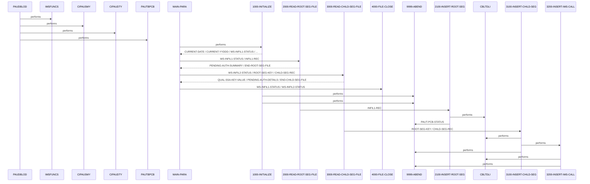

# PAUDBLOD

**File**: `cbl/PAUDBLOD.CBL`
**Type**: FileType.COBOL
**Analyzed**: 2026-03-04 03:23:11.126617

## Purpose

The COBOL program PAUDBLOD reads root and child segment files (INFILE1 and INFILE2), and inserts them into an IMS database. It reads PENDING-AUTH-SUMMARY records from INFILE1 and inserts them as root segments, then reads PENDING-AUTH-DETAILS records from INFILE2 and inserts them as child segments related to the root segments.

**Business Context**: UNKNOWN

## Inputs

| Name | Type | Description |
|------|------|-------------|
| INFILE1 | IOType.FILE_SEQUENTIAL | Input file containing PENDING-AUTH-SUMMARY records to be inserted as root segments in the IMS database. |
| INFILE2 | IOType.FILE_SEQUENTIAL | Input file containing PENDING-AUTH-DETAILS records to be inserted as child segments in the IMS database. |

## Called Programs

| Program | Call Type | Purpose |
|---------|-----------|---------|
| CBLTDLI | CallType.STATIC_CALL | Inserts root and child segments into the IMS database. |
| IMSFUNCS | CallType.OTHER | UNKNOWN |
| CIPAUSMY | CallType.OTHER | UNKNOWN |
| CIPAUDTY | CallType.OTHER | UNKNOWN |
| PAUTBPCB | CallType.OTHER | UNKNOWN |

## Paragraphs/Procedures

### PAUDBLOD
> [Source: PAUDBLOD.cbl.md](PAUDBLOD.CBL.d/PAUDBLOD.cbl.md)
This is the program entry point. It is called using 'DLITCBL' and 'PAUTBPCB'. It displays 'STARTING PAUDBLOD' to the console. The program then performs MAIN-PARA.

### MAIN-PARA
> [Source: MAIN-PARA.cbl.md](PAUDBLOD.CBL.d/MAIN-PARA.cbl.md)

```
MAIN-PARA  (7 statements, depth=1)
PARAGRAPH
├── UNKNOWN: ENTRY 'DLITCBL' USING PAUTBPCB
├── DISPLAY: DISPLAY 'STARTING PAUDBLOD'
├── PERFORM_THRU: PERFORM 1000-INITIALIZE THRU 1000-EXIT
├── PERFORM_THRU: PERFORM 2000-READ-ROOT-SEG-FILE THRU 2000-EXIT UNTIL END-ROOT-SEG-FIL...
├── PERFORM_THRU: PERFORM 3000-READ-CHILD-SEG-FILE THRU 3000-EXIT UNTIL END-CHILD-SEG-F...
├── PERFORM_THRU: PERFORM 4000-FILE-CLOSE THRU 4000-EXIT
└── GOBACK: GOBACK
```
This paragraph is the main control flow of the program. It first calls 1000-INITIALIZE to open files and perform initial setup. Then, it enters a loop to read root segments from INFILE1 using 2000-READ-ROOT-SEG-FILE until the end-of-file is reached (END-ROOT-SEG-FILE = 'Y'). Subsequently, it enters another loop to read child segments from INFILE2 using 3000-READ-CHILD-SEG-FILE until the end-of-file is reached (END-CHILD-SEG-FILE = 'Y'). Finally, it calls 4000-FILE-CLOSE to close the input files. The program then terminates using GOBACK.

### 1000-INITIALIZE
> [Source: 1000-INITIALIZE.cbl.md](PAUDBLOD.CBL.d/1000-INITIALIZE.cbl.md)

```
1000-INITIALIZE  (17 statements, depth=3)
PARAGRAPH
├── ACCEPT: ACCEPT CURRENT-DATE FROM DATE
├── ACCEPT: ACCEPT CURRENT-YYDDD FROM DAY
├── DISPLAY: DISPLAY '*-------------------------------------*'
├── DISPLAY: DISPLAY 'TODAYS DATE :' CURRENT-DATE
├── DISPLAY: DISPLAY ' '
├── OPEN: OPEN INPUT INFILE1
├── IF: IF WS-INFIL1-STATUS = SPACES OR '00' CONTINUE ELSE DISPLAY 'ERROR IN ...
│   ├── CONTINUE: CONTINUE
│   └── ELSE: ELSE
│       ├── DISPLAY: DISPLAY 'ERROR IN OPENING INFILE1:' WS-INFIL1-STATUS
│       └── PERFORM: PERFORM 9999-ABEND
├── OPEN: OPEN INPUT INFILE2
└── IF: IF WS-INFIL2-STATUS = SPACES OR '00' CONTINUE ELSE DISPLAY 'ERROR IN ...
    ├── CONTINUE: CONTINUE
    └── ELSE: ELSE
        ├── DISPLAY: DISPLAY 'ERROR IN OPENING INFILE2:' WS-INFIL2-STATUS
        └── PERFORM: PERFORM 9999-ABEND
```
This paragraph initializes the program by accepting the current date and displaying it. It then opens INFILE1 and INFILE2 for input. If either file fails to open (WS-INFIL1-STATUS or WS-INFIL2-STATUS is not spaces or '00'), an error message is displayed, and the program abends by calling 9999-ABEND. The paragraph checks the file status after each OPEN statement. If the file status is not equal to spaces or '00', an error message is displayed along with the file status, and the program terminates by calling 9999-ABEND.

### 1000-EXIT
> [Source: 1000-EXIT.cbl.md](PAUDBLOD.CBL.d/1000-EXIT.cbl.md)

```
1000-EXIT  (1 statements, depth=1)
PARAGRAPH
└── EXIT: EXIT
```
This paragraph simply contains an EXIT statement and serves as the exit point for the 1000-INITIALIZE paragraph.

### 2000-READ-ROOT-SEG-FILE
> [Source: 2000-READ-ROOT-SEG-FILE.cbl.md](PAUDBLOD.CBL.d/2000-READ-ROOT-SEG-FILE.cbl.md)

```
2000-READ-ROOT-SEG-FILE  (9 statements, depth=5)
PARAGRAPH
├── READ: READ INFILE1
└── IF: IF WS-INFIL1-STATUS = SPACES OR '00' MOVE INFIL1-REC TO PENDING-AUTH-...
    ├── MOVE: MOVE INFIL1-REC TO PENDING-AUTH-SUMMARY
    ├── PERFORM_THRU: PERFORM 2100-INSERT-ROOT-SEG THRU 2100-EXIT
    └── ELSE: ELSE
        └── IF: IF WS-INFIL1-STATUS = '10' MOVE 'Y' TO END-ROOT-SEG-FILE ELSE DISPLAY...
            ├── MOVE: MOVE 'Y' TO END-ROOT-SEG-FILE
            └── ELSE: ELSE
                └── DISPLAY: DISPLAY 'ERROR READING ROOT SEG INFILE'
```
This paragraph reads a record from INFILE1. If the read is successful (WS-INFIL1-STATUS is spaces or '00'), the INFIL1-REC is moved to PENDING-AUTH-SUMMARY, and 2100-INSERT-ROOT-SEG is performed to insert the root segment into the IMS database. If the read results in an end-of-file condition (WS-INFIL1-STATUS is '10'), END-ROOT-SEG-FILE is set to 'Y'. If any other error occurs during the read, an error message is displayed. The file status is checked after the READ statement. If the status is spaces or '00', the record is processed. If the status is '10', it indicates end-of-file, and END-ROOT-SEG-FILE is set to 'Y'. Otherwise, an error message is displayed.

### 2000-EXIT
> [Source: 2000-EXIT.cbl.md](PAUDBLOD.CBL.d/2000-EXIT.cbl.md)

```
2000-EXIT  (1 statements, depth=1)
PARAGRAPH
└── EXIT: EXIT
```
This paragraph simply contains an EXIT statement and serves as the exit point for the 2000-READ-ROOT-SEG-FILE paragraph.

### 2100-INSERT-ROOT-SEG
> [Source: 2100-INSERT-ROOT-SEG.cbl.md](PAUDBLOD.CBL.d/2100-INSERT-ROOT-SEG.cbl.md)

```
2100-INSERT-ROOT-SEG  (10 statements, depth=2)
PARAGRAPH
├── CALL: CALL 'CBLTDLI' USING FUNC-ISRT PAUTBPCB PENDING-AUTH-SUMMARY ROOT-UNQ...
├── DISPLAY: DISPLAY ' *******************************'
├── DISPLAY: DISPLAY ' *******************************'
├── IF: IF PAUT-PCB-STATUS = SPACES DISPLAY 'ROOT INSERT SUCCESS ' END-IF
│   └── DISPLAY: DISPLAY 'ROOT INSERT SUCCESS '
├── IF: IF PAUT-PCB-STATUS = 'II' DISPLAY 'ROOT SEGMENT ALREADY IN DB' END-IF
│   └── DISPLAY: DISPLAY 'ROOT SEGMENT ALREADY IN DB'
└── IF: IF PAUT-PCB-STATUS NOT EQUAL TO SPACES AND 'II' DISPLAY 'ROOT INSERT ...
    ├── DISPLAY: DISPLAY 'ROOT INSERT FAILED :' PAUT-PCB-STATUS
    └── PERFORM: PERFORM 9999-ABEND
```
This paragraph inserts a root segment into the IMS database using a CBLTDLI call with FUNC-ISRT. It uses PAUTBPCB, PENDING-AUTH-SUMMARY, and ROOT-UNQUAL-SSA as parameters. After the call, it checks the PAUT-PCB-STATUS. If the status is spaces, it displays 'ROOT INSERT SUCCESS'. If the status is 'II', it displays 'ROOT SEGMENT ALREADY IN DB'. If the status is neither spaces nor 'II', it displays 'ROOT INSERT FAILED' along with the PAUT-PCB-STATUS and calls 9999-ABEND to terminate the program. The paragraph checks the IMS PCB status after the ISRT call to determine if the insert was successful. Different messages are displayed based on the PCB status, and the program abends if the insert fails.

### 2100-EXIT
> [Source: 2100-EXIT.cbl.md](PAUDBLOD.CBL.d/2100-EXIT.cbl.md)

```
2100-EXIT  (1 statements, depth=1)
PARAGRAPH
└── EXIT: EXIT
```
This paragraph simply contains an EXIT statement and serves as the exit point for the 2100-INSERT-ROOT-SEG paragraph.

### 3000-READ-CHILD-SEG-FILE
> [Source: 3000-READ-CHILD-SEG-FILE.cbl.md](PAUDBLOD.CBL.d/3000-READ-CHILD-SEG-FILE.cbl.md)

```
3000-READ-CHILD-SEG-FILE  (11 statements, depth=5)
PARAGRAPH
├── READ: READ INFILE2
└── IF: IF WS-INFIL2-STATUS = SPACES OR '00' IF ROOT-SEG-KEY IS NUMERIC *> DI...
    ├── IF: IF ROOT-SEG-KEY IS NUMERIC *> DISPLAY 'GNGTO ROOT SEG KEY' MOVE ROOT-...
    │   ├── MOVE: MOVE ROOT-SEG-KEY TO QUAL-SSA-KEY-VALUE
    │   ├── MOVE: MOVE CHILD-SEG-REC TO PENDING-AUTH-DETAILS
    │   └── PERFORM_THRU: PERFORM 3100-INSERT-CHILD-SEG THRU 3100-EXIT
    └── ELSE: ELSE
        └── IF: IF WS-INFIL2-STATUS = '10' MOVE 'Y' TO END-CHILD-SEG-FILE ELSE DISPLA...
            ├── MOVE: MOVE 'Y' TO END-CHILD-SEG-FILE
            └── ELSE: ELSE
                └── DISPLAY: DISPLAY 'ERROR READING CHILD SEG INFILE'
```
This paragraph reads a record from INFILE2. If the read is successful (WS-INFIL2-STATUS is spaces or '00') and ROOT-SEG-KEY is numeric, ROOT-SEG-KEY is moved to QUAL-SSA-KEY-VALUE, CHILD-SEG-REC is moved to PENDING-AUTH-DETAILS, and 3100-INSERT-CHILD-SEG is performed to insert the child segment into the IMS database. If the read results in an end-of-file condition (WS-INFIL2-STATUS is '10'), END-CHILD-SEG-FILE is set to 'Y'. If any other error occurs during the read, an error message is displayed. The file status is checked after the READ statement. If the status is spaces or '00', and the ROOT-SEG-KEY is numeric, the data is moved and the child segment is inserted. If the status is '10', it indicates end-of-file, and END-CHILD-SEG-FILE is set to 'Y'. Otherwise, an error message is displayed.

### 3000-EXIT
> [Source: 3000-EXIT.cbl.md](PAUDBLOD.CBL.d/3000-EXIT.cbl.md)

```
3000-EXIT  (1 statements, depth=1)
PARAGRAPH
└── EXIT: EXIT
```
This paragraph simply contains an EXIT statement and serves as the exit point for the 3000-READ-CHILD-SEG-FILE paragraph.

### 3100-INSERT-CHILD-SEG
> [Source: 3100-INSERT-CHILD-SEG.cbl.md](PAUDBLOD.CBL.d/3100-INSERT-CHILD-SEG.cbl.md)

```
3100-INSERT-CHILD-SEG  (11 statements, depth=3)
PARAGRAPH
├── INITIALIZE: INITIALIZE PAUT-PCB-STATUS
├── CALL: CALL 'CBLTDLI' USING FUNC-GU PAUTBPCB PENDING-AUTH-SUMMARY ROOT-QUAL-SSA
├── DISPLAY: DISPLAY '***************************'
├── DISPLAY: DISPLAY '***************************'
└── IF: IF PAUT-PCB-STATUS = SPACES DISPLAY 'GU CALL TO ROOT SEG SUCCESS' *> ...
    ├── DISPLAY: DISPLAY 'GU CALL TO ROOT SEG SUCCESS'
    ├── PERFORM_THRU: PERFORM 3200-INSERT-IMS-CALL THRU 3200-EXIT
    └── IF: IF PAUT-PCB-STATUS NOT EQUAL TO SPACES AND 'II' DISPLAY 'ROOT GU CALL...
        ├── DISPLAY: DISPLAY 'ROOT GU CALL FAIL:' PAUT-PCB-STATUS
        ├── DISPLAY: DISPLAY 'KFB AREA IN CHILD:' PAUT-KEYFB
        └── PERFORM: PERFORM 9999-ABEND
```
This paragraph attempts to retrieve a root segment from the IMS database and, upon successful retrieval, proceeds to insert a child segment. It initializes PAUT-PCB-STATUS, then calls CBLTDLI with FUNC-GU to retrieve the root segment PENDING-AUTH-SUMMARY using the ROOT-QUAL-SSA. After the call, it checks the PAUT-PCB-STATUS. If the status is spaces, indicating success, it calls 3200-INSERT-IMS-CALL to insert the child segment. If the status is not spaces or 'II', it displays an error message including the PAUT-PCB-STATUS and PAUT-KEYFB, and then performs 9999-ABEND to terminate the program. The paragraph uses DISPLAY statements for debugging and monitoring the IMS calls.

### 3100-EXIT
> [Source: 3100-EXIT.cbl.md](PAUDBLOD.CBL.d/3100-EXIT.cbl.md)

```
3100-EXIT  (1 statements, depth=1)
PARAGRAPH
└── EXIT: EXIT
```
This paragraph serves as the exit point for the 3100-INSERT-CHILD-SEG paragraph. It contains a simple EXIT statement to allow control to return to the calling paragraph.

### 3200-INSERT-IMS-CALL
> [Source: 3200-INSERT-IMS-CALL.cbl.md](PAUDBLOD.CBL.d/3200-INSERT-IMS-CALL.cbl.md)

```
3200-INSERT-IMS-CALL  (9 statements, depth=2)
PARAGRAPH
├── CALL: CALL 'CBLTDLI' USING FUNC-ISRT PAUTBPCB PENDING-AUTH-DETAILS CHILD-UN...
├── IF: IF PAUT-PCB-STATUS = SPACES DISPLAY 'CHILD SEGMENT INSERTED SUCCESS' ...
│   └── DISPLAY: DISPLAY 'CHILD SEGMENT INSERTED SUCCESS'
├── IF: IF PAUT-PCB-STATUS = 'II' DISPLAY 'CHILD SEGMENT ALREADY IN DB' END-IF
│   └── DISPLAY: DISPLAY 'CHILD SEGMENT ALREADY IN DB'
└── IF: IF PAUT-PCB-STATUS NOT EQUAL TO SPACES AND 'II' DISPLAY 'INSERT CALL ...
    ├── DISPLAY: DISPLAY 'INSERT CALL FAIL FOR CHILD:' PAUT-PCB-STATUS
    ├── DISPLAY: DISPLAY 'KFB AREA IN CHILD:' PAUT-KEYFB
    └── PERFORM: PERFORM 9999-ABEND
```
This paragraph inserts a child segment into the IMS database. It calls CBLTDLI with FUNC-ISRT to insert the PENDING-AUTH-DETAILS segment using the CHILD-UNQUAL-SSA. After the call, it checks the PAUT-PCB-STATUS. If the status is spaces, it displays a success message. If the status is 'II', it displays a message indicating the segment is already in the database. If the status is neither spaces nor 'II', it displays an error message including the PAUT-PCB-STATUS and PAUT-KEYFB, and then performs 9999-ABEND to terminate the program. The paragraph uses DISPLAY statements for debugging and monitoring the IMS calls.

### 3200-EXIT
> [Source: 3200-EXIT.cbl.md](PAUDBLOD.CBL.d/3200-EXIT.cbl.md)

```
3200-EXIT  (1 statements, depth=1)
PARAGRAPH
└── EXIT: EXIT
```
This paragraph serves as the exit point for the 3200-INSERT-IMS-CALL paragraph. It contains a simple EXIT statement to allow control to return to the calling paragraph.

### 4000-FILE-CLOSE
> [Source: 4000-FILE-CLOSE.cbl.md](PAUDBLOD.CBL.d/4000-FILE-CLOSE.cbl.md)

```
4000-FILE-CLOSE  (11 statements, depth=3)
PARAGRAPH
├── DISPLAY: DISPLAY 'CLOSING THE FILE'
├── CLOSE: CLOSE INFILE1
├── IF: IF WS-INFIL1-STATUS = SPACES OR '00' CONTINUE ELSE DISPLAY 'ERROR IN ...
│   ├── CONTINUE: CONTINUE
│   └── ELSE: ELSE
│       └── DISPLAY: DISPLAY 'ERROR IN CLOSING 1ST FILE:'WS-INFIL1-STATUS
├── CLOSE: CLOSE INFILE2
└── IF: IF WS-INFIL2-STATUS = SPACES OR '00' CONTINUE ELSE DISPLAY 'ERROR IN ...
    ├── CONTINUE: CONTINUE
    └── ELSE: ELSE
        └── DISPLAY: DISPLAY 'ERROR IN CLOSING 2ND FILE:'WS-INFIL2-STATUS
```
This paragraph closes the input files INFILE1 and INFILE2. It displays a message indicating that the files are being closed. It then closes INFILE1 and checks the WS-INFIL1-STATUS. If the status is spaces or '00', it continues. Otherwise, it displays an error message including the WS-INFIL1-STATUS. It repeats this process for INFILE2 and WS-INFIL2-STATUS. This paragraph handles the closing of input files and checks for errors during the close operation.

### 4000-EXIT
> [Source: 4000-EXIT.cbl.md](PAUDBLOD.CBL.d/4000-EXIT.cbl.md)

```
4000-EXIT  (1 statements, depth=1)
PARAGRAPH
└── EXIT: EXIT
```
This paragraph serves as the exit point for the 4000-FILE-CLOSE paragraph. It contains a simple EXIT statement to allow control to return to the calling paragraph.

### 9999-ABEND
> [Source: 9999-ABEND.cbl.md](PAUDBLOD.CBL.d/9999-ABEND.cbl.md)

```
9999-ABEND  (3 statements, depth=1)
PARAGRAPH
├── DISPLAY: DISPLAY 'IMS LOAD ABENDING ...'
├── MOVE: MOVE 16 TO RETURN-CODE
└── GOBACK: GOBACK
```
This paragraph handles abnormal termination of the program. It displays a message indicating that the IMS load is abending. It then moves 16 to the RETURN-CODE and performs a GOBACK to terminate the program. This paragraph is called when an unrecoverable error occurs during the IMS processing.

### 9999-EXIT
> [Source: 9999-EXIT.cbl.md](PAUDBLOD.CBL.d/9999-EXIT.cbl.md)

```
9999-EXIT  (1 statements, depth=1)
PARAGRAPH
└── EXIT: EXIT
```
This paragraph serves as the exit point for the 9999-ABEND paragraph. It contains a simple EXIT statement to allow control to return to the calling paragraph.

## Dead Code

The following artifacts were identified as dead code by static analysis:

| Artifact | Type | Line | Reason |
|----------|------|------|--------|
| INFIL1-REC | record_layout | 44 | Record layout 'INFIL1-REC' is never used by any program |
| INFIL2-REC | record_layout | 46 | Record layout 'INFIL2-REC' is never used by any program |
| ROOT-QUAL-SSA | record_layout | 113 | Record layout 'ROOT-QUAL-SSA' is never used by any program |

## Control Flow


```mermaid
flowchart TD
    %% Title: PAUDBLOD.CBL
    1000_EXIT["1000-EXIT"]
    1000_INITIALIZE["1000-INITIALIZE"]
    9999_ABEND["9999-ABEND"]
    2000_EXIT["2000-EXIT"]
    2000_READ_ROOT_SEG_FILE["2000-READ-ROOT-SEG-FILE"]
    2100_INSERT_ROOT_SEG["2100-INSERT-ROOT-SEG"]
    2100_EXIT["2100-EXIT"]
    CBLTDLI__ext(["CBLTDLI"])
    3000_EXIT["3000-EXIT"]
    3000_READ_CHILD_SEG_FILE["3000-READ-CHILD-SEG-FILE"]
    3100_INSERT_CHILD_SEG["3100-INSERT-CHILD-SEG"]
    3100_EXIT["3100-EXIT"]
    3200_INSERT_IMS_CALL["3200-INSERT-IMS-CALL"]
    3200_EXIT["3200-EXIT"]
    4000_EXIT["4000-EXIT"]
    4000_FILE_CLOSE["4000-FILE-CLOSE"]
    9999_EXIT["9999-EXIT"]
    MAIN_PARA["MAIN-PARA"]
    1000_INITIALIZE --> 9999_ABEND
    2000_READ_ROOT_SEG_FILE --> 2100_INSERT_ROOT_SEG
    2100_INSERT_ROOT_SEG --> 9999_ABEND
    2100_INSERT_ROOT_SEG -.->|calls| CBLTDLI__ext
    3000_READ_CHILD_SEG_FILE --> 3100_INSERT_CHILD_SEG
    3100_INSERT_CHILD_SEG --> 3200_INSERT_IMS_CALL
    3100_INSERT_CHILD_SEG --> 9999_ABEND
    3100_INSERT_CHILD_SEG -.->|calls| CBLTDLI__ext
    3200_INSERT_IMS_CALL --> 9999_ABEND
    3200_INSERT_IMS_CALL -.->|calls| CBLTDLI__ext
    MAIN_PARA --> 1000_INITIALIZE
    MAIN_PARA --> 2000_READ_ROOT_SEG_FILE
    MAIN_PARA --> 3000_READ_CHILD_SEG_FILE
    MAIN_PARA --> 4000_FILE_CLOSE
```

## Open Questions

- ? What is the purpose of the called programs IMSFUNCS, CIPAUSMY, CIPAUDTY, and PAUTBPCB?
  - Context: The program calls these programs, but their purpose is not clear from the code.
- ? What is the structure of the INFILE1-REC and INFILE2-REC?
  - Context: The copybooks for these files are not provided.
- ? What is the structure of the PENDING-AUTH-SUMMARY and PENDING-AUTH-DETAILS?
  - Context: The copybooks for these data structures are not provided.
- ? What is the purpose of ROOT-UNQUAL-SSA?
  - Context: The purpose of this variable is not clear from the code.
- ? What is the business context of this program?
  - Context: The business context is not clear from the code.

## Sequence Diagram


```mermaid
sequenceDiagram
    participant PAUDBLOD as PAUDBLOD
    participant IMSFUNCS as IMSFUNCS
    participant CIPAUSMY as CIPAUSMY
    participant CIPAUDTY as CIPAUDTY
    participant PAUTBPCB as PAUTBPCB
    participant MAIN_PARA as MAIN-PARA
    participant 1000_INITIALIZE as 1000-INITIALIZE
    participant 2000_READ_ROOT_SEG_FILE as 2000-READ-ROOT-SEG-FILE
    participant 3000_READ_CHILD_SEG_FILE as 3000-READ-CHILD-SEG-FILE
    participant 4000_FILE_CLOSE as 4000-FILE-CLOSE
    participant 9999_ABEND as 9999-ABEND
    participant 2100_INSERT_ROOT_SEG as 2100-INSERT-ROOT-SEG
    participant CBLTDLI as CBLTDLI
    participant 3100_INSERT_CHILD_SEG as 3100-INSERT-CHILD-SEG
    participant 3200_INSERT_IMS_CALL as 3200-INSERT-IMS-CALL
    PAUDBLOD->>IMSFUNCS: performs
    PAUDBLOD->>CIPAUSMY: performs
    PAUDBLOD->>CIPAUDTY: performs
    PAUDBLOD->>PAUTBPCB: performs
    MAIN_PARA->>1000_INITIALIZE: performs
    1000_INITIALIZE-->>MAIN_PARA: CURRENT-DATE / CURRENT-YYDDD / WS-INFIL1-STATUS / ...
    MAIN_PARA->>2000_READ_ROOT_SEG_FILE: WS-INFIL1-STATUS / INFIL1-REC
    2000_READ_ROOT_SEG_FILE-->>MAIN_PARA: PENDING-AUTH-SUMMARY / END-ROOT-SEG-FILE
    MAIN_PARA->>3000_READ_CHILD_SEG_FILE: WS-INFIL2-STATUS / ROOT-SEG-KEY / CHILD-SEG-REC
    3000_READ_CHILD_SEG_FILE-->>MAIN_PARA: QUAL-SSA-KEY-VALUE / PENDING-AUTH-DETAILS / END-CHILD-SEG-FILE
    MAIN_PARA->>4000_FILE_CLOSE: WS-INFIL1-STATUS / WS-INFIL2-STATUS
    1000_INITIALIZE->>9999_ABEND: performs
    1000_INITIALIZE->>9999_ABEND: performs
    2000_READ_ROOT_SEG_FILE->>2100_INSERT_ROOT_SEG: INFIL1-REC
    2100_INSERT_ROOT_SEG->>CBLTDLI: performs
    2100_INSERT_ROOT_SEG->>9999_ABEND: PAUT-PCB-STATUS
    3000_READ_CHILD_SEG_FILE->>3100_INSERT_CHILD_SEG: ROOT-SEG-KEY / CHILD-SEG-REC
    3100_INSERT_CHILD_SEG->>CBLTDLI: performs
    3100_INSERT_CHILD_SEG->>3200_INSERT_IMS_CALL: performs
    3100_INSERT_CHILD_SEG->>9999_ABEND: performs
    3200_INSERT_IMS_CALL->>CBLTDLI: performs
    3200_INSERT_IMS_CALL->>9999_ABEND: performs
```
