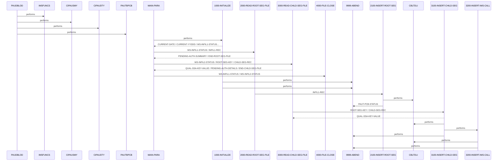

# PAUDBLOD

**File:** PAUDBLOD.CBL
**Type:** COBOL
**Status:** In Progress
**Iterations:** 1
**Analyzed:** 2026-03-04 04:39:48.005847

## Purpose

The COBOL program PAUDBLOD reads root and child segment files (INFILE1 and INFILE2), and inserts them into an IMS database. It reads PENDING-AUTH-SUMMARY records from INFILE1 and inserts them as root segments, then reads PENDING-AUTH-DETAILS records from INFILE2 and inserts them as child segments related to the root segments.
**Program Type:** BATCH
**Citations:** Lines 9, 11, 14

## Calling Context

**Linkage Section:** PAUTBPCB

## Inputs

### INFILE1
- **Type:** FILE_SEQUENTIAL
- **Description:** Sequential file containing PENDING-AUTH-SUMMARY records to be inserted as root segments in the IMS database.
- **Lines:** 34, 57

### INFILE2
- **Type:** FILE_SEQUENTIAL
- **Description:** Sequential file containing PENDING-AUTH-DETAILS records to be inserted as child segments in the IMS database.
- **Lines:** 42, 104

## Called Programs

| Program | Call Type | Purpose | Line |
|---------|-----------|---------|------|
| [CBLTDLI](./CBLTDLI.cbl.md) | STATIC_CALL | Inserts root and child segments into the IMS database. | 77 |

## Data Flow

### Reads From
- **INFILE1**: INFIL1-REC
  (Lines: 57)
- **INFILE2**: CHILD-SEG-REC, ROOT-SEG-KEY
  (Lines: 104)

### Writes To
- **PENDING-AUTH-SUMMARY**: INFIL1-REC
  (Lines: 60)
- **PENDING-AUTH-DETAILS**: CHILD-SEG-REC
  (Lines: 112)
- **QUAL-SSA-KEY-VALUE**: ROOT-SEG-KEY
  (Lines: 109)

## Key Paragraphs

### PAUDBLOD
**Purpose:** This is the program-id paragraph. It does not contain any executable logic.
- Lines: 1-1

### MAIN-PARA
**Purpose:** This paragraph serves as the main control flow for the PAUDBLOD program. It first calls 1000-INITIALIZE to open the input files (INFILE1 and INFILE2) and perform initial setup. Then, it enters a loop that reads root segment records from INFILE1 using 2000-READ-ROOT-SEG-FILE until the end-of-file is reached (END-ROOT-SEG-FILE = 'Y'). Subsequently, it enters another loop to read child segment records from INFILE2 using 3000-READ-CHILD-SEG-FILE until the end-of-file is reached (END-CHILD-SEG-FILE = 'Y'). Finally, it calls 4000-FILE-CLOSE to close the input files before terminating the program.
- Calls: 1000-INITIALIZE, 2000-READ-ROOT-SEG-FILE, 3000-READ-CHILD-SEG-FILE, 4000-FILE-CLOSE
- Lines: 3-21

### 1000-INITIALIZE
**Purpose:** This paragraph initializes the program by accepting the current date and opening the input files INFILE1 and INFILE2. It first accepts the current date and day from the system. Then, it opens INFILE1 and checks the file status (WS-INFIL1-STATUS). If the file status is not spaces or '00', it displays an error message and calls 9999-ABEND to terminate the program. Similarly, it opens INFILE2 and checks the file status (WS-INFIL2-STATUS). If the file status is not spaces or '00', it displays an error message and calls 9999-ABEND to terminate the program.
- Calls: 9999-ABEND, 9999-ABEND
- Lines: 23-48

### 1000-EXIT
**Purpose:** This paragraph is the exit point for the 1000-INITIALIZE paragraph. It simply contains an EXIT statement to return control to the calling paragraph.
- Lines: 50-51

### 2000-READ-ROOT-SEG-FILE
**Purpose:** This paragraph reads records from INFILE1 and processes them as root segments. It reads a record from INFILE1 and checks the file status (WS-INFIL1-STATUS). If the file status is spaces or '00', it moves the INFIL1-REC to PENDING-AUTH-SUMMARY and performs 2100-INSERT-ROOT-SEG to insert the root segment into the IMS database. If the file status is '10', it sets END-ROOT-SEG-FILE to 'Y' to indicate the end of the file. If the file status is anything else, it displays an error message.
- Calls: 2100-INSERT-ROOT-SEG
- Lines: 53-68

### 2000-EXIT
**Purpose:** This paragraph is the exit point for the 2000-READ-ROOT-SEG-FILE paragraph. It simply contains an EXIT statement to return control to the calling paragraph.
- Lines: 71-72

### 2100-INSERT-ROOT-SEG
**Purpose:** This paragraph inserts a root segment into the IMS database using the CBLTDLI call. It calls CBLTDLI with the FUNC-ISRT function code, PAUTBPCB, PENDING-AUTH-SUMMARY, and ROOT-UNQUAL-SSA. After the call, it checks the PAUT-PCB-STATUS. If the status is spaces, it displays 'ROOT INSERT SUCCESS'. If the status is 'II', it displays 'ROOT SEGMENT ALREADY IN DB'. If the status is anything else, it displays an error message and performs 9999-ABEND to terminate the program.
- Calls: CBLTDLI, 9999-ABEND
- Lines: 75-96

### 2100-EXIT
**Purpose:** This paragraph is the exit point for the 2100-INSERT-ROOT-SEG paragraph. It simply contains an EXIT statement to return control to the calling paragraph.
- Lines: 98-99

### 3000-READ-CHILD-SEG-FILE
**Purpose:** This paragraph reads records from INFILE2 and processes them as child segments. It reads a record from INFILE2 and checks the file status (WS-INFIL2-STATUS). If the file status is spaces or '00', and if ROOT-SEG-KEY is numeric, it moves ROOT-SEG-KEY to QUAL-SSA-KEY-VALUE, moves CHILD-SEG-REC to PENDING-AUTH-DETAILS, and performs 3100-INSERT-CHILD-SEG to insert the child segment into the IMS database. If the file status is '10', it sets END-CHILD-SEG-FILE to 'Y' to indicate the end of the file. If the file status is anything else, it displays an error message.
- Calls: 3100-INSERT-CHILD-SEG
- Lines: 101-121

### 3000-EXIT
**Purpose:** This paragraph is the exit point for the 3000-READ-CHILD-SEG-FILE paragraph. It simply contains an EXIT statement to return control to the calling paragraph.
- Lines: 123-124

### 3100-INSERT-CHILD-SEG
**Purpose:** This paragraph retrieves a root segment from the IMS database and then inserts a child segment. It first initializes PAUT-PCB-STATUS. Then, it calls CBLTDLI with FUNC-GU to retrieve the root segment PENDING-AUTH-SUMMARY using ROOT-QUAL-SSA. If the PCB status is spaces, indicating a successful retrieval, it performs 3200-INSERT-IMS-CALL to insert the child segment. If the root segment retrieval fails (PCB status is not spaces or 'II'), it displays an error message and calls 9999-ABEND to terminate the program. The paragraph uses PAUTBPCB for the PCB and handles potential errors during the root segment retrieval.
- Calls: CBLTDLI, 3200-INSERT-IMS-CALL, 9999-ABEND
- Lines: 1-23

### 3100-EXIT
**Purpose:** This paragraph serves as the exit point for the 3100-INSERT-CHILD-SEG paragraph. It contains only the EXIT statement and ensures a clean exit from the paragraph.
- Called by: 3100-INSERT-CHILD-SEG
- Lines: 25-26

### 3200-INSERT-IMS-CALL
**Purpose:** This paragraph inserts a child segment into the IMS database. It calls CBLTDLI with FUNC-ISRT to insert the PENDING-AUTH-DETAILS segment using CHILD-UNQUAL-SSA. If the PCB status is spaces, indicating a successful insertion, it displays a success message. If the PCB status is 'II', it displays a message indicating the segment is already in the database. If the insertion fails (PCB status is not spaces or 'II'), it displays an error message and calls 9999-ABEND to terminate the program. The paragraph uses PAUTBPCB for the PCB and handles potential errors during the child segment insertion.
- Called by: 3100-INSERT-CHILD-SEG
- Calls: CBLTDLI, 9999-ABEND
- Lines: 28-46

### 3200-EXIT
**Purpose:** This paragraph serves as the exit point for the 3200-INSERT-IMS-CALL paragraph. It contains only the EXIT statement and ensures a clean exit from the paragraph.
- Called by: 3200-INSERT-IMS-CALL
- Lines: 49-50

### 4000-FILE-CLOSE
**Purpose:** This paragraph closes the input files INFILE1 and INFILE2. It displays a message indicating that the files are being closed. It checks the status of each file after closing and displays an error message if the close operation was not successful (WS-INFIL1-STATUS or WS-INFIL2-STATUS is not spaces or '00'). The paragraph handles potential errors during the file closing process.
- Lines: 52-67

### 4000-EXIT
**Purpose:** This paragraph serves as the exit point for the 4000-FILE-CLOSE paragraph. It contains only the EXIT statement and ensures a clean exit from the paragraph.
- Called by: 4000-FILE-CLOSE
- Lines: 69-70

### 9999-ABEND
**Purpose:** This paragraph handles program termination due to errors. It displays a message indicating that the IMS load is abending. It sets the RETURN-CODE to 16 and then terminates the program using GOBACK.
- Called by: 3100-INSERT-CHILD-SEG, 3200-INSERT-IMS-CALL
- Lines: 72-78

### 9999-EXIT
**Purpose:** This paragraph serves as the exit point for the 9999-ABEND paragraph. It contains only the EXIT statement and ensures a clean exit from the paragraph.
- Called by: 9999-ABEND
- Lines: 80-81

## Inter-Paragraph Data Flow

| Caller | Callee | Inputs | Outputs | Purpose |
|--------|--------|--------|---------|---------|
| MAIN-PARA | 1000-INITIALIZE | - | CURRENT-DATE, CURRENT-YYDDD, WS-INFIL1-STATUS, WS-INFIL2-STATUS, END-ROOT-SEG-FILE, END-CHILD-SEG-FILE | Initializes the program by accepting current date values and opening input files INFILE1 and INFILE2, setting up file status flags. |
| MAIN-PARA | 2000-READ-ROOT-SEG-FILE | WS-INFIL1-STATUS, INFIL1-REC | PENDING-AUTH-SUMMARY, END-ROOT-SEG-FILE | Reads a record from INFILE1 and moves it to the pending authorization summary if successful, or sets end-of-file flag if no more records. |
| MAIN-PARA | 3000-READ-CHILD-SEG-FILE | WS-INFIL2-STATUS, ROOT-SEG-KEY, CHILD-SEG-REC | QUAL-SSA-KEY-VALUE, PENDING-AUTH-DETAILS, END-CHILD-SEG-FILE | Reads a record from INFILE2, validates the root segment key, and populates child segment data for insertion if valid, or sets end-of-file flag. |
| MAIN-PARA | 4000-FILE-CLOSE | WS-INFIL1-STATUS, WS-INFIL2-STATUS | - | Closes both INFILE1 and INFILE2 and displays error messages if either file fails to close. |
| 1000-INITIALIZE | 9999-ABEND | - | RETURN-CODE | Terminates the program abnormally by setting RETURN-CODE to 16 and displaying an abend message. |
| 1000-INITIALIZE | 9999-ABEND | - | - | Abends the program with return code 16 when an input file fails to open. |
| 2000-READ-ROOT-SEG-FILE | 2100-INSERT-ROOT-SEG | INFIL1-REC | - | Inserts a root segment into the IMS database using data read from INFILE1. |
| 2100-INSERT-ROOT-SEG | 9999-ABEND | PAUT-PCB-STATUS | - | Abends the program if the root segment insertion into IMS fails with an unexpected status code. |
| 3000-READ-CHILD-SEG-FILE | 3100-INSERT-CHILD-SEG | ROOT-SEG-KEY, CHILD-SEG-REC | QUAL-SSA-KEY-VALUE | Inserts a child segment into the IMS database after setting up the qualifying SSA with the root key. |
| 3100-INSERT-CHILD-SEG | 3200-INSERT-IMS-CALL | - | - | Performs an IMS insert call to add a child segment after successfully retrieving the parent root segment. |
| 3100-INSERT-CHILD-SEG | 9999-ABEND | - | - | Abends the program with return code 16 when a root GU call fails. |
| 3200-INSERT-IMS-CALL | 9999-ABEND | - | - | Abends the program with return code 16 when an insert call for a child segment fails. |

## Error Handling

- **WS-INFIL1-STATUS NOT = SPACES OR '00':** DISPLAY 'ERROR IN OPENING INFILE1:' WS-INFIL1-STATUS and PERFORM 9999-ABEND
  (Lines: 35, 39)
- **WS-INFIL2-STATUS NOT = SPACES OR '00':** DISPLAY 'ERROR IN OPENING INFILE2:' WS-INFIL2-STATUS and PERFORM 9999-ABEND
  (Lines: 43, 47)
- **WS-INFIL1-STATUS NOT = SPACES OR '00' and NOT = '10':** DISPLAY 'ERROR READING ROOT SEG INFILE'
  (Lines: 59, 67)
- **PAUT-PCB-STATUS NOT EQUAL TO SPACES AND 'II':** DISPLAY 'ROOT INSERT FAILED  :' PAUT-PCB-STATUS and PERFORM 9999-ABEND
  (Lines: 92, 94)
- **WS-INFIL2-STATUS NOT = SPACES OR '00' and NOT = '10':** DISPLAY 'ERROR READING CHILD SEG INFILE'
  (Lines: 106, 119)

## Open Questions

- **What is the purpose of the PAUTBPCB parameter?**
  - Context: It is used in the CBLTDLI call, but its exact role is unclear without more context.
  - Suggestion: Consult IMS documentation or subject matter experts to understand the function of PAUTBPCB.
- **What is the format and purpose of ROOT-SEG-KEY and QUAL-SSA-KEY-VALUE?**
  - Context: ROOT-SEG-KEY is moved to QUAL-SSA-KEY-VALUE, but their exact purpose is unclear.
  - Suggestion: Examine related documentation or code to understand the relationship between root and child segments.

## Resolved Questions

- **Q:** What is the structure of INFILE1-REC and CHILD-SEG-REC?
  **A:** INFILE1-REC is PIC X(100). CHILD-SEG-REC is PIC X(200).

## Sequence Diagram

```mermaid
sequenceDiagram
    participant PAUDBLOD as PAUDBLOD
    participant IMSFUNCS as IMSFUNCS
    participant CIPAUSMY as CIPAUSMY
    participant CIPAUDTY as CIPAUDTY
    participant PAUTBPCB as PAUTBPCB
    participant MAIN_PARA as MAIN-PARA
    participant 1000_INITIALIZE as 1000-INITIALIZE
    participant 2000_READ_ROOT_SEG_FILE as 2000-READ-ROOT-SEG-FILE
    participant 3000_READ_CHILD_SEG_FILE as 3000-READ-CHILD-SEG-FILE
    participant 4000_FILE_CLOSE as 4000-FILE-CLOSE
    participant 9999_ABEND as 9999-ABEND
    participant 2100_INSERT_ROOT_SEG as 2100-INSERT-ROOT-SEG
    participant CBLTDLI as CBLTDLI
    participant 3100_INSERT_CHILD_SEG as 3100-INSERT-CHILD-SEG
    participant 3200_INSERT_IMS_CALL as 3200-INSERT-IMS-CALL
    PAUDBLOD->>IMSFUNCS: performs
    PAUDBLOD->>CIPAUSMY: performs
    PAUDBLOD->>CIPAUDTY: performs
    PAUDBLOD->>PAUTBPCB: performs
    MAIN_PARA->>1000_INITIALIZE: performs
    1000_INITIALIZE-->>MAIN_PARA: CURRENT-DATE / CURRENT-YYDDD / WS-INFIL1-STATUS...
    MAIN_PARA->>2000_READ_ROOT_SEG_FILE: WS-INFIL1-STATUS / INFIL1-REC
    2000_READ_ROOT_SEG_FILE-->>MAIN_PARA: PENDING-AUTH-SUMMARY / END-ROOT-SEG-FILE
    MAIN_PARA->>3000_READ_CHILD_SEG_FILE: WS-INFIL2-STATUS / ROOT-SEG-KEY / CHILD-SEG-REC
    3000_READ_CHILD_SEG_FILE-->>MAIN_PARA: QUAL-SSA-KEY-VALUE / PENDING-AUTH-DETAILS / END-CHILD-SEG-FILE
    MAIN_PARA->>4000_FILE_CLOSE: WS-INFIL1-STATUS / WS-INFIL2-STATUS
    1000_INITIALIZE->>9999_ABEND: performs
    1000_INITIALIZE->>9999_ABEND: performs
    2000_READ_ROOT_SEG_FILE->>2100_INSERT_ROOT_SEG: INFIL1-REC
    2100_INSERT_ROOT_SEG->>CBLTDLI: performs
    2100_INSERT_ROOT_SEG->>9999_ABEND: PAUT-PCB-STATUS
    3000_READ_CHILD_SEG_FILE->>3100_INSERT_CHILD_SEG: ROOT-SEG-KEY / CHILD-SEG-REC
    3100_INSERT_CHILD_SEG-->>3000_READ_CHILD_SEG_FILE: QUAL-SSA-KEY-VALUE
    3100_INSERT_CHILD_SEG->>CBLTDLI: performs
    3100_INSERT_CHILD_SEG->>3200_INSERT_IMS_CALL: performs
    3100_INSERT_CHILD_SEG->>9999_ABEND: performs
    3200_INSERT_IMS_CALL->>CBLTDLI: performs
    3200_INSERT_IMS_CALL->>9999_ABEND: performs
```

---
*Generated by War Rig WAR_RIG*