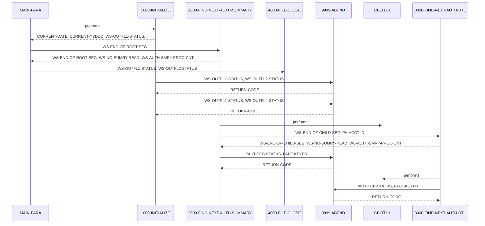

# PAUDBUNL

**File**: `cbl/PAUDBUNL.CBL`
**Type**: FileType.COBOL
**Analyzed**: 2026-02-09 15:45:19.462117

## Purpose

This COBOL program, named PAUDBUNL, unloads data from an IMS database related to pending authorizations and writes it to two sequential output files. It reads pending authorization summary segments (root) and pending authorization detail segments (child) from the IMS database and writes them to OPFILE1 and OPFILE2 respectively, filtering for numeric PA-ACCT-ID.

**Business Context**: UNKNOWN

## Inputs

| Name | Type | Description |
|------|------|-------------|
| IMS Database (PAUTSUM0/PAUTDTL1) | IOType.IMS_SEGMENT | Pending Authorization Summary (root segment PAUTSUM0) and Detail (child segment PAUTDTL1) segments from an IMS database. |
| PAUTBPCB | IOType.PARAMETER | PCB mask passed to the program. |

## Outputs

| Name | Type | Description |
|------|------|-------------|
| OPFILE1 | IOType.FILE_SEQUENTIAL | Contains records of PENDING-AUTH-SUMMARY segments (root segments) from the IMS database where PA-ACCT-ID is numeric. |
| OPFILE2 | IOType.FILE_SEQUENTIAL | Contains records of PENDING-AUTH-DETAILS segments (child segments) from the IMS database, associated with the root segments written to OPFILE1. |

## Called Programs

| Program | Call Type | Purpose |
|---------|-----------|---------|
| CBLTDLI | CallType.STATIC_CALL | Interface with IMS database to retrieve segments. |
| CBLTDLI | CallType.STATIC_CALL | Interface with IMS database to retrieve child segments. |

## Business Rules

- **BR001**: Only write root segments to OPFILE1 if the PA-ACCT-ID is numeric.

## Paragraphs/Procedures

### MAIN-PARA
This is the main control paragraph of the program. It first calls 1000-INITIALIZE to perform initial setup tasks such as accepting the current date and opening the output files (OPFILE1 and OPFILE2). After initialization, it enters a loop that continues until WS-END-OF-ROOT-SEG is set to 'Y', indicating the end of the root segments in the IMS database. Inside the loop, it calls 2000-FIND-NEXT-AUTH-SUMMARY to retrieve and process the next pending authorization summary segment. Once all root segments have been processed, it calls 4000-FILE-CLOSE to close the output files. The program then terminates using GOBACK. The paragraph also contains an ENTRY point 'DLITCBL' which also uses PAUTBPCB.

### 1000-INITIALIZE
This paragraph performs initialization tasks for the program. It accepts the current date and day from the system. It then displays the program name and current date to the console. It opens OPFILE1 and OPFILE2 for output. If either OPEN operation fails (WS-OUTFL1-STATUS or WS-OUTFL2-STATUS is not SPACES or '00'), it displays an error message and calls 9999-ABEND to terminate the program. This paragraph ensures that the output files are ready for writing before the main processing loop begins. It consumes system date and sets up output files.

### 2000-FIND-NEXT-AUTH-SUMMARY
This paragraph retrieves the next pending authorization summary segment (root segment) from the IMS database. It initializes PAUT-PCB-STATUS, then calls the CBLTDLI routine with FUNC-GN to retrieve the next segment using the PAUTBPCB, PENDING-AUTH-SUMMARY, and ROOT-UNQUAL-SSA. If the PCB status is SPACES, indicating a successful read, it increments WS-NO-SUMRY-READ and WS-AUTH-SMRY-PROC-CNT, moves the PENDING-AUTH-SUMMARY to OPFIL1-REC, and writes the record to OPFILE1 if PA-ACCT-ID is numeric. It then calls 3000-FIND-NEXT-AUTH-DTL to process the child segments associated with the current root segment, continuing until WS-END-OF-CHILD-SEG is 'Y'. If the PCB status is 'GB', indicating the end of the database, it sets WS-END-OF-ROOT-SEG to 'Y'. If the PCB status is neither SPACES nor 'GB', it displays an error message and calls 9999-ABEND. This paragraph controls the retrieval and processing of root segments and their associated child segments.

### 3000-FIND-NEXT-AUTH-DTL
This paragraph retrieves the next pending authorization detail segment (child segment) from the IMS database. It calls the CBLTDLI routine with FUNC-GNP to retrieve the next child segment using PAUTBPCB, PENDING-AUTH-DETAILS and CHILD-UNQUAL-SSA. If the PCB status is SPACES, indicating a successful read, it sets MORE-AUTHS to TRUE, increments WS-NO-SUMRY-READ and WS-AUTH-SMRY-PROC-CNT, moves the PENDING-AUTH-DETAILS to CHILD-SEG-REC, and writes the record to OPFILE2. If the PCB status is 'GE', indicating that no more child segments exist for the current root, it sets WS-END-OF-CHILD-SEG to 'Y'. If the PCB status is neither SPACES nor 'GE', it displays an error message and calls 9999-ABEND. Finally, it initializes PAUT-PCB-STATUS. This paragraph is responsible for retrieving and writing the child segments associated with a root segment.

### 4000-FILE-CLOSE
This paragraph closes the output files OPFILE1 and OPFILE2. It displays a message to the console indicating that the files are being closed. It then closes each file and checks the file status (WS-OUTFL1-STATUS and WS-OUTFL2-STATUS). If the file status is not SPACES or '00' for either file, it displays an error message. This paragraph ensures that the output files are properly closed after all processing is complete.

### 9999-ABEND
This paragraph handles abnormal termination of the program. It displays a message indicating that the program is abending. It sets the RETURN-CODE to 16. The program then terminates using GOBACK. This paragraph is called when a critical error occurs, such as a file open or close error, or an IMS call failure.

## Control Flow

## Open Questions

- ? What is the business context of this program?
  - Context: The code does not provide information about the specific business process it supports.
- ? What are the exact layouts of the IMS segments defined in CIPAUSMY and CIPAUDTY?
  - Context: The copybooks themselves are not provided, so the exact field definitions are unknown.
- ? What are the possible values and meanings of the parameters in PRM-INFO?
  - Context: The code comments out the ACCEPT statement for PRM-INFO, and the meaning of P-EXPIRY-DAYS, P-CHKP-FREQ, P-CHKP-DIS-FREQ, and P-DEBUG-FLAG is unclear.

## Sequence Diagram

