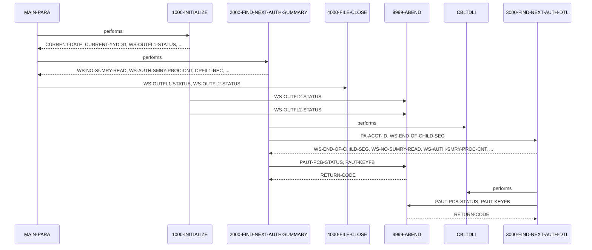

# PAUDBUNL

**File**: `cbl/PAUDBUNL.CBL`
**Type**: FileType.COBOL
**Analyzed**: 2026-02-10 17:17:39.576155

## Purpose

This COBOL program, named PAUDBUNL, unloads data from an IMS database related to pending authorizations and writes it to two sequential output files. It reads pending authorization summary segments (root) and pending authorization detail segments (child) from the IMS database and writes them to OPFILE1 and OPFILE2 respectively, if the PA-ACCT-ID is numeric.

**Business Context**: This program is likely part of a larger system for managing and processing pending authorizations, potentially for financial transactions or access control.

## Inputs

| Name | Type | Description |
|------|------|-------------|
| IMS Database (PAUTSUM0, PAUTDTL1) | IOType.IMS_SEGMENT | Pending Authorization Summary (root segment PAUTSUM0) and Detail (child segment PAUTDTL1) segments from an IMS database. |
| PAUTBPCB | IOType.PARAMETER | PCB mask for IMS calls. |

## Outputs

| Name | Type | Description |
|------|------|-------------|
| OPFILE1 | IOType.FILE_SEQUENTIAL | Contains pending authorization summary records (root segments) extracted from the IMS database. |
| OPFILE2 | IOType.FILE_SEQUENTIAL | Contains pending authorization detail records (child segments) extracted from the IMS database. |

## Called Programs

| Program | Call Type | Purpose |
|---------|-----------|---------|
| CBLTDLI | CallType.STATIC_CALL | Interface with IMS DL/I to retrieve database segments. |
| CBLTDLI | CallType.STATIC_CALL | Interface with IMS DL/I to retrieve database segments. |

## Business Rules

- **BR001**: Only write the summary and detail records to the output files if the account ID (PA-ACCT-ID) is numeric.

## Paragraphs/Procedures

### MAIN-PARA
This is the main control paragraph of the PAUDBUNL program. It orchestrates the entire process of unloading data from the IMS database and writing it to sequential files. It first calls 1000-INITIALIZE to perform initial setup tasks such as accepting the current date and opening the output files (OPFILE1 and OPFILE2). After initialization, it enters a loop that continues as long as WS-END-OF-ROOT-SEG is not set to 'Y'. Inside the loop, it repeatedly calls 2000-FIND-NEXT-AUTH-SUMMARY to retrieve the next pending authorization summary segment from the IMS database. Once all summary segments have been processed (WS-END-OF-ROOT-SEG = 'Y'), the paragraph calls 4000-FILE-CLOSE to close the output files. Finally, the program terminates using GOBACK.

### 1000-INITIALIZE
This paragraph performs the initialization tasks required before processing the IMS database. It accepts the current date and day from the system. It then displays the program name and current date to the console for logging purposes. The paragraph proceeds to open the two output files, OPFILE1 and OPFILE2, for writing. It checks the file status after each OPEN operation. If the file status is not spaces or '00', indicating a successful open, an error message is displayed, and the program abends by calling 9999-ABEND. This paragraph ensures that the output files are available before the program attempts to write data to them.

### 2000-FIND-NEXT-AUTH-SUMMARY
This paragraph retrieves the next pending authorization summary segment (root segment) from the IMS database. It first initializes the PAUT-PCB-STATUS field. Then, it calls the CBLTDLI routine with the FUNC-GN (Get Next) function code to retrieve the next summary segment. The parameters passed to CBLTDLI include the PCB mask (PAUTBPCB), the PENDING-AUTH-SUMMARY segment, and the ROOT-UNQUAL-SSA. After the IMS call, it checks the PAUT-PCB-STATUS. If the status is spaces (successful retrieval), it increments counters for summary records read and processed, moves the retrieved summary data to OPFIL1-REC, and extracts the account ID (PA-ACCT-ID) to ROOT-SEG-KEY. It then checks if the PA-ACCT-ID is numeric, and if so, writes the OPFIL1-REC to OPFILE1 and calls 3000-FIND-NEXT-AUTH-DTL to retrieve the child segments. If the PAUT-PCB-STATUS is 'GB' (end of database), it sets the END-OF-AUTHDB flag to TRUE and WS-END-OF-ROOT-SEG to 'Y'. If the status is anything else, it displays an error message and abends the program.

### 3000-FIND-NEXT-AUTH-DTL
This paragraph retrieves the next pending authorization detail segment (child segment) from the IMS database for a given summary segment. It calls CBLTDLI with FUNC-GNP (Get Next within Parent) to retrieve the next detail segment. The parameters include PAUTBPCB, PENDING-AUTH-DETAILS, and CHILD-UNQUAL-SSA. After the call, it checks PAUT-PCB-STATUS. If the status is spaces, it sets MORE-AUTHS to TRUE, increments counters, moves the detail segment to CHILD-SEG-REC, and writes it to OPFILE2. If the status is 'GE' (end of segments for the current parent), it sets WS-END-OF-CHILD-SEG to 'Y'. If the status is anything else, it displays an error message and abends. Finally, it initializes PAUT-PCB-STATUS for the next iteration.

### 4000-FILE-CLOSE
This paragraph closes the output files, OPFILE1 and OPFILE2. It displays a message indicating that the files are being closed. It then closes each file and checks the file status. If the file status is not spaces or '00' after closing, an error message is displayed to the console. This paragraph ensures that the output files are properly closed after all data has been written, preventing data loss or corruption.

### 9999-ABEND
This paragraph handles abnormal termination of the program. It displays a message indicating that the program is abending. It then sets the RETURN-CODE to 16, which signals an error condition to the calling environment. Finally, it terminates the program using GOBACK.

## Control Flow

## Open Questions

- ? What is the purpose of the parameters in PRM-INFO?
  - Context: The program contains a commented-out ACCEPT statement for PRM-INFO, suggesting it might have been intended to receive parameters from SYSIN, but it's not currently used. The meaning of P-EXPIRY-DAYS, P-CHKP-FREQ, P-CHKP-DIS-FREQ, and P-DEBUG-FLAG is unclear without further context.

## Sequence Diagram

