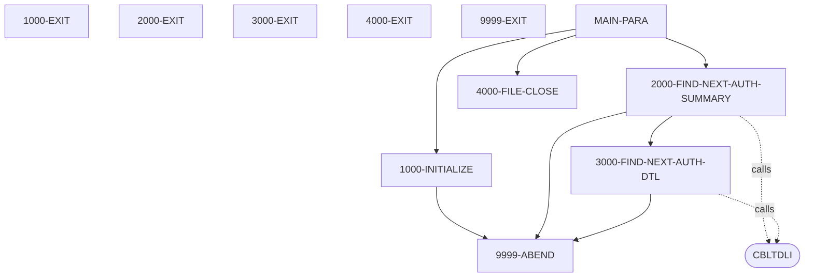
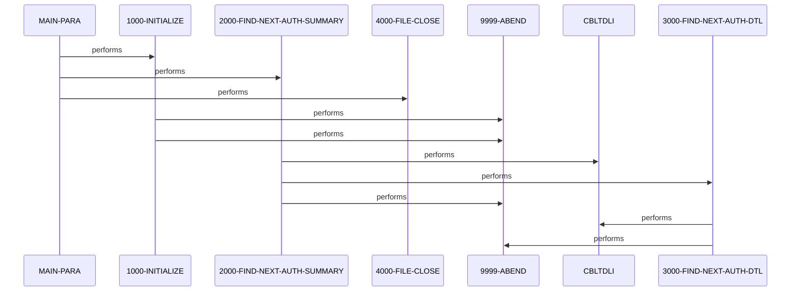

# PAUDBUNL

**File**: `cbl/PAUDBUNL.CBL`
**Type**: FileType.COBOL
**Analyzed**: 2026-02-25 15:35:11.827323

## Purpose

PAUDBUNL is an IMS DL/I unload utility that retrieves all root segments (PAUTSUM0 Pending Authorization Summary) using unqualified GN calls and their dependent child segments (PAUTDTL1 Pending Authorization Details) using GNP calls, writing root records to OPFILE1 and child records (prefixed with root account ID key) to OPFILE2. It processes the entire database until end-of-database (GB status) on root and end-of-segment (GE status) on children. The program initializes files, unloads data in a nested loop structure, closes files, and handles errors by abending.

**Business Context**: Supports unloading of pending authorization data from IMS PAUT database for backup, migration, reporting, or offline processing.

## Inputs

| Name | Type | Description |
|------|------|-------------|
| PAUT Database | IOType.IMS_SEGMENT | Root segments PAUTSUM0 (Pending Auth Summary) and child segments PAUTDTL1 (Pending Auth Details) accessed via PAUTBPCB |

## Outputs

| Name | Type | Description |
|------|------|-------------|
| OPFILE1 | IOType.FILE_SEQUENTIAL | Flat file containing all root PAUTSUM0 segments copied directly from IMS |
| OPFILE2 | IOType.FILE_SEQUENTIAL | Flat file containing all child PAUTDTL1 segments prefixed with root segment key (PA-ACCT-ID) |

## Business Rules

- **BR001**: Unload every root summary segment and all its qualified child detail segments without filtering
- **BR002**: Only process root segments with numeric PA-ACCT-ID for child loop

## Paragraphs/Procedures

### MAIN-PARA
> [Source: MAIN-PARA.cbl.md](PAUDBUNL.CBL.d/MAIN-PARA.cbl.md)
MAIN-PARA serves as the primary entry and orchestration point for the entire unload process, defining the high-level program flow. It first declares an alternate entry point 'DLITCBL' using the PAUTBPCB linkage for IMS PCB access (line 1225033). It consumes no direct inputs beyond the linkage PCB but relies on IMS database availability via the PCB. It produces control flow to subordinate paragraphs and ultimately two output files via initialization and processing. The business logic is a simple sequential process: initialize files and variables, loop through all root segments calling 2000-FIND-NEXT-AUTH-SUMMARY until end-of-root flag is set, then close files and terminate normally. No explicit decisions are made here beyond the loop condition on WS-END-OF-ROOT-SEG. Error handling is delegated to subordinate paragraphs which abend on failures. It calls 1000-INITIALIZE to prepare files (line 12400), repeatedly calls 2000-FIND-NEXT-AUTH-SUMMARY in a loop controlled by WS-END-OF-ROOT-SEG until 'Y' (lines 12600-12800), and 4000-FILE-CLOSE for cleanup (line 15320). Upon loop exit, it executes GOBACK for normal termination (line 16600). This structure ensures complete database unload without gaps.

### 1000-INITIALIZE
> [Source: 1000-INITIALIZE.cbl.md](PAUDBUNL.CBL.d/1000-INITIALIZE.cbl.md)
1000-INITIALIZE handles program startup by accepting system dates into CURRENT-DATE and CURRENT-YYDDD, displaying startup messages including program name and date for logging (lines 17200-17900). It consumes no file or segment data but initializes WS variables implicitly via prior definitions. It produces open output files OPFILE1 and OPFILE2, checking FILE STATUS after each OPEN (lines 19610, 19690). Business logic validates open status: if not SPACES or '00', displays error and calls 9999-ABEND (lines 19620-19660, 19691-19695). No loops or complex decisions; purely sequential setup. Error handling is immediate abend on open failure to prevent processing with invalid files. It calls no other paragraphs but is invoked solely by MAIN-PARA. Exits cleanly to return control (line 19900). This ensures files are ready before unload loop begins.

### 2000-FIND-NEXT-AUTH-SUMMARY
> [Source: 2000-FIND-NEXT-AUTH-SUMMARY.cbl.md](PAUDBUNL.CBL.d/2000-FIND-NEXT-AUTH-SUMMARY.cbl.md)
2000-FIND-NEXT-AUTH-SUMMARY implements the outer loop logic for retrieving and processing each root PAUTSUM0 segment from IMS using unqualified GN call via CBLTDLI (lines 20700-21000). It consumes IMS root segments via PAUTBPCB and SSA ROOT-UNQUAL-SSA, initializing PCB status first (line 20660). It produces increments to counters WS-NO-SUMRY-READ and WS-AUTH-SMRY-PROC-CNT, writes the segment to OPFILE1 via MOVE and WRITE (lines 21900-21906), sets ROOT-SEG-KEY from PA-ACCT-ID (line 21903), and conditionally loops to child processing. Business logic checks PAUT-PCB-STATUS: SPACES triggers write and child loop if PA-ACCT-ID numeric (lines 21400-21910); 'GB' sets end-of-root flags (lines 21920-21950); other statuses display error/key feedback and abend (lines 22000-22600). Error handling abends on unexpected IMS statuses. It calls 3000-FIND-NEXT-AUTH-DTL repeatedly until WS-END-OF-CHILD-SEG='Y' (lines 21908-21909). This paragraph drives the core unload of roots and orchestrates nested child processing.

### 3000-FIND-NEXT-AUTH-DTL
> [Source: 3000-FIND-NEXT-AUTH-DTL.cbl.md](PAUDBUNL.CBL.d/3000-FIND-NEXT-AUTH-DTL.cbl.md)
3000-FIND-NEXT-AUTH-DTL implements the inner loop for retrieving child PAUTDTL1 segments under the current root using GNP call via CBLTDLI with CHILD-UNQUAL-SSA (lines 23700-24000). It consumes IMS child segments qualified by parentage from prior root PA-ACCT-ID in ROOT-SEG-KEY. It produces increments to WS-NO-SUMRY-READ and WS-AUTH-SMRY-PROC-CNT (misnamed, but used here; lines 24400-24500), MOVE to CHILD-SEG-REC, and WRITE to OPFILE2 (lines 24600-24700). Business logic checks PAUT-PCB-STATUS post-GNP: SPACES sets MORE-AUTHS flag and writes record (lines 24200-24800); 'GE' sets WS-END-OF-CHILD-SEG='Y' to exit inner loop (lines 24900-25020); other statuses display error/key feedback and abend (lines 25200-25400). It reinitializes PCB status at end (line 25800). Error handling abends on GNP failures. Called repeatedly by 2000 until child end. This ensures all children per root are fully unloaded.

### 4000-FILE-CLOSE
> [Source: 4000-FILE-CLOSE.cbl.md](PAUDBUNL.CBL.d/4000-FILE-CLOSE.cbl.md)
4000-FILE-CLOSE performs cleanup by closing OPFILE1 and OPFILE2, displaying closure message (lines 26310, 26400, 27100). It consumes file handles opened in 1000-INITIALIZE. It produces checked FILE STATUS post-close, continuing on SPACES/'00' or displaying errors without abend (lines 26600-27000, 27300-27600). No data writes or IMS calls; purely I/O termination. Business logic is conditional display-only on close errors, allowing graceful exit even on minor issues. No loops or calls to others. Invoked once by MAIN-PARA at end. Exits to GOBACK path. This finalizes output files safely.

### 9999-ABEND
> [Source: 9999-ABEND.cbl.md](PAUDBUNL.CBL.d/9999-ABEND.cbl.md)
9999-ABEND is the centralized error termination routine, displaying abend message and setting RETURN-CODE to 16 before GOBACK (lines 36600-36800). It consumes WS error flags/statuses indirectly via callers. It produces non-zero return code for JCL failure. No inputs/outputs beyond display; no business logic or conditions checked here. Error handling is the purpose itself: unconditional abend. Called by 1000 on file open errors, 2000/3000 on IMS call failures. Ensures program does not continue on irrecoverable errors.

## Dead Code

The following artifacts were identified as dead code by static analysis:

| Artifact | Type | Line | Reason |
|----------|------|------|--------|
| 9999-EXIT | paragraph | 316 | Paragraph '9999-EXIT' is never PERFORMed or referenced by any other paragraph or program |
| CHILD-UNQUAL-SSA | record_layout | 115 | Record layout 'CHILD-UNQUAL-SSA' is never used by any program |
| FUNC-CODES | record_layout | 17 | Record layout 'FUNC-CODES' is never used by any program |
| OPFIL1-REC | record_layout | 44 | Record layout 'OPFIL1-REC' is never used by any program |
| OPFIL2-REC | record_layout | 46 | Record layout 'OPFIL2-REC' is never used by any program |
| PAUTBPCB | record_layout | 17 | Record layout 'PAUTBPCB' is never used by any program |
| PRM-INFO | record_layout | 119 | Record layout 'PRM-INFO' is never used by any program |
| ROOT-UNQUAL-SSA | record_layout | 111 | Record layout 'ROOT-UNQUAL-SSA' is never used by any program |

## Control Flow

## Sequence Diagram

