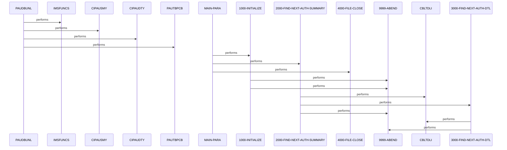

# PAUDBUNL

**File**: `cbl/PAUDBUNL.CBL`
**Type**: FileType.COBOL
**Analyzed**: 2026-02-24 03:51:10.350509

## Purpose

PAUDBUNL is a batch IMS DL/I program that reads root authorization summary segments from an IMS database using GN calls and their child detail segments using GNP calls, writing summary records to OPFILE1 and detail records to OPFILE2. It processes sequentially until end of root segments (PCB status 'GB') and end of child segments ('GE'), accumulating counts of processed summaries and details. The program initializes output files, handles PCB and file status errors by abending, and closes files at termination.

**Business Context**: Serves unbundling of IMS authorization database (AUTHDB) into separate flat files for summary and detail authorizations, likely for reporting, archiving, or further batch processing in a financial or authorization system.

## Inputs

| Name | Type | Description |
|------|------|-------------|
| PAUTBPCB | IOType.IMS_SEGMENT | IMS PCB for AUTHDB database, used to read root AUTH-SUMMARY segments via GN and child AUTH-DTL segments via GNP |
| ROOT-UNQUAL-SSA | IOType.IMS_SEGMENT | Unqualified SSA for root segment key (ROOT-SEG-KEY derived from PA-ACCT-ID) |
| CHILD-UNQUAL-SSA | IOType.IMS_SEGMENT | Unqualified SSA for child detail segments |

## Outputs

| Name | Type | Description |
|------|------|-------------|
| OPFILE1 | IOType.FILE_SEQUENTIAL | Output file for authorization summary records (OPFIL1-REC from PENDING-AUTH-SUMMARY) |
| OPFILE2 | IOType.FILE_SEQUENTIAL | Output file for authorization detail records (OPFIL2-REC from PENDING-AUTH-DETAILS to CHILD-SEG-REC) |
| SYSOUT | IOType.REPORT | Console DISPLAY messages for start date, errors, processing status |

## Called Programs

| Program | Call Type | Purpose |
|---------|-----------|---------|
| CBLTDLI | CallType.STATIC_CALL | IMS DL/I interface to perform database GET NEXT calls (GN for root, GNP for child) |
| 9999-ABEND | CallType.STATIC_CALL | Error handling routine to terminate program on file or IMS errors |

## Business Rules

- **BR001**: Only write summary record to OPFILE1 if PA-ACCT-ID is numeric
- **BR002**: End root processing on IMS PCB status 'GB' (end of database)
- **BR003**: End child processing on IMS PCB status 'GE' (end of parent-qualified children)
- **BR004**: Abend on non-space/non-expected PCB statuses for error recovery

## Paragraphs/Procedures

### PAUDBUNL
> [Source: PAUDBUNL.cbl.md](PAUDBUNL.CBL.d/PAUDBUNL.cbl.md)
This paragraph serves as the program entry point, but no explicit code is visible at line 18 which starts 1000-INITIALIZE; it may be implicit or a section label before PROCEDURE DIVISION. It receives control via ENTRY 'DLITCBL' USING PAUTBPCB from line 4, providing the IMS PCB as linkage input. No data is read or written here directly. No business logic or decisions are implemented. No error handling is present. It transfers control to MAIN-PARA implicitly upon entry.

### MAIN-PARA
> [Source: MAIN-PARA.cbl.md](PAUDBUNL.CBL.d/MAIN-PARA.cbl.md)
MAIN-PARA is the primary orchestration paragraph controlling the overall program flow in this batch IMS unbundler. It begins by performing 1000-INITIALIZE THRU 1000-EXIT to open output files OPFILE1 and OPFILE2 and initialize variables like dates. After initialization, it enters a loop performing 2000-FIND-NEXT-AUTH-SUMMARY THRU 2000-EXIT UNTIL WS-END-OF-ROOT-SEG = 'Y', processing each root summary segment and its children. The loop consumes IMS data via PAUTBPCB and produces writes to output files indirectly through subordinate paragraphs. No direct business decisions are made here, but it relies on WS-END-OF-ROOT-SEG flag set by 2000 on 'GB' status for loop exit. No explicit error handling, deferring to callees. Upon EOF, it performs 4000-FILE-CLOSE THRU 4000-EXIT to close files, then GOBACKs to caller.

### 1000-INITIALIZE
> [Source: 1000-INITIALIZE.cbl.md](PAUDBUNL.CBL.d/1000-INITIALIZE.cbl.md)
1000-INITIALIZE handles program startup by accepting system dates into CURRENT-DATE and CURRENT-YYDDD, displaying startup messages including date. It then opens OUTPUT OPFILE1 and checks WS-OUTFL1-STATUS; if not spaces or '00', displays error and performs 9999-ABEND (line 35-36). Similarly opens OPFILE2 and checks WS-OUTFL2-STATUS, abending on error (lines 42-44). Inputs are system date and implicit file statuses; outputs are opened files ready for write and console DISPLAYs. Business logic enforces file open success before proceeding, with 2 decision points for status checks. Error handling abends immediately on open failures without retry. No subordinate calls except ABEND; exits to 1000-EXIT.

### 1000-EXIT
> [Source: 1000-EXIT.cbl.md](PAUDBUNL.CBL.d/1000-EXIT.cbl.md)
1000-EXIT is a simple exit routine that performs EXIT to return control to the caller paragraph (MAIN-PARA). It consumes no inputs and produces no outputs or modifications. No business logic, decisions, or error handling. No calls made. Serves only as THRU exit point for 1000-INITIALIZE.

### 2000-FIND-NEXT-AUTH-SUMMARY
> [Source: 2000-FIND-NEXT-AUTH-SUMMARY.cbl.md](PAUDBUNL.CBL.d/2000-FIND-NEXT-AUTH-SUMMARY.cbl.md)
2000-FIND-NEXT-AUTH-SUMMARY performs the core loop for reading root authorization summary segments from IMS AUTHDB. It initializes PAUT-PCB-STATUS, calls CBLTDLI with FUNC-GN using PAUTBPCB, PENDING-AUTH-SUMMARY, and ROOT-UNQUAL-SSA to get next root (lines 55-59). If PAUT-PCB-STATUS = SPACES (success), increments counters WS-NO-SUMRY-READ and WS-AUTH-SMRY-PROC-CNT, MOVEs to OPFIL1-REC, initializes keys, MOVEs PA-ACCT-ID to ROOT-SEG-KEY, and if PA-ACCT-ID NUMERIC, WRITEs OPFIL1-REC, resets WS-END-OF-CHILD-SEG, and loops PERFORM 3000-FIND-NEXT-AUTH-DTL THRU 3000-EXIT UNTIL 'Y' to process children (lines 66-81). On 'GB', sets WS-END-OF-ROOT-SEG='Y' to exit main loop (82-85). On other statuses, DISPLAYs error/key feedback and abends (86-90). Inputs: IMS PCB/root SSA; outputs: writes to OPFILE1, child processing, counters/flags. 7 decision points: status=SPACES (process), =GB (end root), else abend, plus NUMERIC check. Error handling: abend on invalid status.

### 2000-EXIT
> [Source: 2000-EXIT.cbl.md](PAUDBUNL.CBL.d/2000-EXIT.cbl.md)
2000-EXIT is a simple exit routine that performs EXIT to return control to the caller (MAIN-PARA loop). No inputs consumed, no outputs produced. No logic, decisions, errors, or calls. THRU exit for 2000-FIND-NEXT-AUTH-SUMMARY.

### 3000-FIND-NEXT-AUTH-DTL
> [Source: 3000-FIND-NEXT-AUTH-DTL.cbl.md](PAUDBUNL.CBL.d/3000-FIND-NEXT-AUTH-DTL.cbl.md)
3000-FIND-NEXT-AUTH-DTL reads next child authorization detail segments parent-qualified by current root. Calls CBLTDLI with FUNC-GNP using PAUTBPCB, PENDING-AUTH-DETAILS, CHILD-UNQUAL-SSA (99-102). If PAUT-PCB-STATUS=SPACES, sets MORE-AUTHS TRUE, increments counters, MOVEs to CHILD-SEG-REC, WRITEs OPFIL2-REC (108-114). On 'GE', sets WS-END-OF-CHILD-SEG='Y' and DISPLAYs flag (115-120). On other statuses, DISPLAYs error/keyfb and abends (121-124). Initializes PAUT-PCB-STATUS at end (126). Inputs: IMS PCB/child SSA from parent context; outputs: writes to OPFILE2, counters/flags. 4 decision points: SPACES (write detail), GE (end children), else abend. Error handling: abend on failure, no retry.

### 3000-EXIT
> [Source: 3000-EXIT.cbl.md](PAUDBUNL.CBL.d/3000-EXIT.cbl.md)
3000-EXIT performs simple EXIT to return to caller (2000 loop). No data I/O, logic, errors, or calls. THRU exit point.

### 4000-FILE-CLOSE
> [Source: 4000-FILE-CLOSE.cbl.md](PAUDBUNL.CBL.d/4000-FILE-CLOSE.cbl.md)
4000-FILE-CLOSE terminates by closing output files and checking statuses. DISPLAYs 'CLOSING THE FILE', CLOSE OPFILE1, if WS-OUTFL1-STATUS not spaces/'00' DISPLAYs error (no abend) (132-139). Then CLOSE OPFILE2, similar status check with DISPLAY error if bad (140-146). Inputs: file statuses post-close; outputs: closed files, console messages. 2 decision points for each close status. Error handling: logs error via DISPLAY but continues without abend. No calls.

### 4000-EXIT
> [Source: 4000-EXIT.cbl.md](PAUDBUNL.CBL.d/4000-EXIT.cbl.md)
4000-EXIT performs EXIT to return to MAIN-PARA before GOBACK. No inputs/outputs/logic/errors/calls. THRU exit.

### 9999-ABEND
> [Source: 9999-ABEND.cbl.md](PAUDBUNL.CBL.d/9999-ABEND.cbl.md)
The 9999-ABEND paragraph serves as the primary abnormal termination handler for the PAUDBUNL program, invoked when a critical error requires program abend. It consumes no specific inputs or data from files or variables, relying instead on being PERFORMed from error conditions elsewhere in the program. The outputs produced include a DISPLAY message 'IMSUNLOD ABENDING ...' sent to the system console or SYSOUT (line 4), and modification of the RETURN-CODE field to 16 (line 6). No business logic or conditional decisions are implemented within this paragraph; it unconditionally performs termination actions. Error handling is inherent as this is the abend routine itself, with no further validation or recovery attempted. This paragraph calls no other paragraphs or external programs. Following the DISPLAY and MOVE, it executes GOBACK (line 7) to end program execution and propagate the return code. Comments above the DISPLAY provide section headers but no additional logic (lines 2-3). The paragraph's role is strictly to ensure a consistent abend with logging and non-zero return code.

### ~~9999-EXIT~~ (Dead Code)
> [Source: 9999-EXIT.cbl.md](PAUDBUNL.CBL.d/9999-EXIT.cbl.md)
*Paragraph '9999-EXIT' is never PERFORMed or referenced by any other paragraph or program*

## Dead Code

The following artifacts were identified as dead code by static analysis:

| Artifact | Type | Line | Reason |
|----------|------|------|--------|
| 9999-EXIT | paragraph | 316 | Paragraph '9999-EXIT' is never PERFORMed or referenced by any other paragraph or program |

## Control Flow

## Open Questions

- ? What are the exact structures of copybooks for PAUTBPCB, PENDING-AUTH-SUMMARY, PENDING-AUTH-DETAILS, etc.?
  - Context: Not present in provided PROCEDURE DIVISION snippet; WORKING-STORAGE/FILE/LINKAGE sections omitted.
- ? Details of 9999-ABEND and 9999-EXIT paragraphs?
  - Context: Referenced but not provided in source snippet.
- ? What defines FUNC-GN, FUNC-GNP, ROOT-UNQUAL-SSA, CHILD-UNQUAL-SSA?
  - Context: Likely WS 01 levels or literals, not shown.
- ? Calling programs or JCL invoking this?
  - Context: ENTRY 'DLITCBL' suggests specific entry, but no callers identified.

## Sequence Diagram

