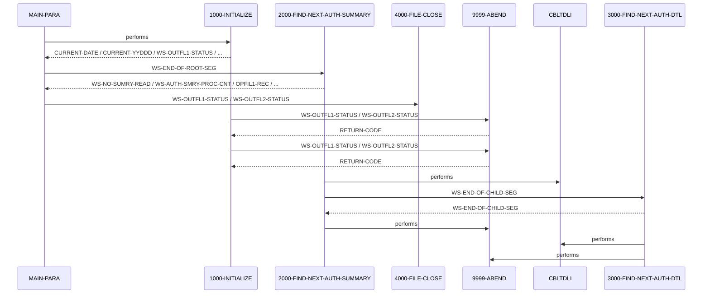

# PAUDBUNL

**File**: `cbl/PAUDBUNL.CBL`
**Type**: FileType.COBOL
**Analyzed**: 2026-02-24 17:42:26.182361

## Purpose

The COBOL program PAUDBUNL unloads pending authorization summary and detail segments from an IMS database and writes them to two sequential output files. It reads the PAUTSUM0 root segment and PAUTDTL1 child segment from the IMS database and writes them to OPFILE1 and OPFILE2 respectively, filtering for numeric PA-ACCT-ID.

## Inputs

| Name | Type | Description |
|------|------|-------------|
| IMS Database (PAUTSUM0, PAUTDTL1 segments) | IOType.IMS_SEGMENT | Pending authorization summary (PAUTSUM0) and detail (PAUTDTL1) segments from an IMS database. |
| PAUTBPCB | IOType.PARAMETER | PCB mask for IMS calls. |

## Outputs

| Name | Type | Description |
|------|------|-------------|
| OPFILE1 | IOType.FILE_SEQUENTIAL | Pending authorization summary records (PAUTSUM0). |
| OPFILE2 | IOType.FILE_SEQUENTIAL | Pending authorization detail records (PAUTDTL1). |

## Called Programs

| Program | Call Type | Purpose |
|---------|-----------|---------|
| CBLTDLI | CallType.STATIC_CALL | Performs IMS database calls. |
| CBLTDLI | CallType.STATIC_CALL | Performs IMS database calls to retrieve child segments. |

## Paragraphs/Procedures

### MAIN-PARA
> [Source: MAIN-PARA.cbl.md](PAUDBUNL.CBL.d/MAIN-PARA.cbl.md)
This is the main control paragraph of the PAUDBUNL program. It orchestrates the entire process of unloading pending authorization data from an IMS database to sequential files. It first calls 1000-INITIALIZE to perform initial setup tasks such as accepting the current date and opening the output files (OPFILE1 and OPFILE2). After initialization, it enters a loop, controlled by the WS-END-OF-ROOT-SEG flag, that repeatedly calls 2000-FIND-NEXT-AUTH-SUMMARY to retrieve and process pending authorization summary segments. Once all summary segments have been processed (WS-END-OF-ROOT-SEG is 'Y'), the paragraph calls 4000-FILE-CLOSE to close the output files. Finally, the program terminates using GOBACK.

### 1000-INITIALIZE
> [Source: 1000-INITIALIZE.cbl.md](PAUDBUNL.CBL.d/1000-INITIALIZE.cbl.md)
This paragraph performs the initialization tasks required before processing the IMS database. It accepts the current date and day from the system. It then opens the two output files, OPFILE1 and OPFILE2, for writing. It checks the file status after each OPEN operation (WS-OUTFL1-STATUS and WS-OUTFL2-STATUS). If the file status is not spaces or '00', indicating a successful open, it displays an error message and calls 9999-ABEND to terminate the program. Otherwise, the program continues. There is no specific input consumed by this paragraph other than system date and parameters. The outputs are the opened files OPFILE1 and OPFILE2. It does not call any other paragraphs other than 9999-ABEND in case of an error.

### 2000-FIND-NEXT-AUTH-SUMMARY
> [Source: 2000-FIND-NEXT-AUTH-SUMMARY.cbl.md](PAUDBUNL.CBL.d/2000-FIND-NEXT-AUTH-SUMMARY.cbl.md)
This paragraph retrieves the next pending authorization summary segment from the IMS database. It initializes the PAUT-PCB-STATUS field and then calls the CBLTDLI routine with the FUNC-GN (Get Next) function code to retrieve the next PAUTSUM0 segment using the ROOT-UNQUAL-SSA. After the IMS call, it checks the PAUT-PCB-STATUS. If the status is spaces, indicating a successful read, it increments counters WS-NO-SUMRY-READ and WS-AUTH-SMRY-PROC-CNT, moves the retrieved PENDING-AUTH-SUMMARY data to OPFIL1-REC, and writes the record to OPFILE1 if PA-ACCT-ID is numeric. It then calls 3000-FIND-NEXT-AUTH-DTL to process the child segments. If the PAUT-PCB-STATUS is 'GB' (End of Database), it sets the WS-END-OF-ROOT-SEG flag to 'Y' to terminate the main processing loop. If the PAUT-PCB-STATUS is neither spaces nor 'GB', it displays an error message and calls 9999-ABEND. The input is the IMS database and the output is the OPFILE1 file. The paragraph calls 3000-FIND-NEXT-AUTH-DTL to process child segments.

### 3000-FIND-NEXT-AUTH-DTL
> [Source: 3000-FIND-NEXT-AUTH-DTL.cbl.md](PAUDBUNL.CBL.d/3000-FIND-NEXT-AUTH-DTL.cbl.md)
This paragraph retrieves the next pending authorization detail segment (PAUTDTL1) for the current summary segment. It calls the CBLTDLI routine with the FUNC-GNP (Get Next within Parent) function code, using the CHILD-UNQUAL-SSA. After the call, it checks the PAUT-PCB-STATUS. If the status is spaces, indicating a successful read, it sets the MORE-AUTHS flag to TRUE, increments counters WS-NO-SUMRY-READ and WS-AUTH-SMRY-PROC-CNT, moves the PENDING-AUTH-DETAILS data to CHILD-SEG-REC, and writes the record to OPFILE2. If the PAUT-PCB-STATUS is 'GE' (Segment Not Found), it sets the WS-END-OF-CHILD-SEG flag to 'Y' to indicate that there are no more detail segments for the current summary segment. If the PAUT-PCB-STATUS is neither spaces nor 'GE', it displays an error message and calls 9999-ABEND. Finally, it initializes PAUT-PCB-STATUS. The input is the IMS database and the output is the OPFILE2 file. No other paragraphs are called other than 9999-ABEND in case of error.

### 4000-FILE-CLOSE
> [Source: 4000-FILE-CLOSE.cbl.md](PAUDBUNL.CBL.d/4000-FILE-CLOSE.cbl.md)
This paragraph closes the output files OPFILE1 and OPFILE2. It displays a message indicating that the files are being closed. It then closes each file and checks the file status (WS-OUTFL1-STATUS and WS-OUTFL2-STATUS) after the CLOSE operation. If the file status is not spaces or '00', indicating a successful close, it displays an error message. The input to this paragraph is the open files OPFILE1 and OPFILE2. The output is the closed files. It does not call any other paragraphs.

### 9999-ABEND
> [Source: 9999-ABEND.cbl.md](PAUDBUNL.CBL.d/9999-ABEND.cbl.md)
This paragraph handles abnormal termination of the program. It displays a message indicating that the program is abending. It sets the RETURN-CODE to 16 and terminates the program using GOBACK. The input is the error condition that led to the abend. There is no output other than the program termination. It does not call any other paragraphs.

## Control Flow

## Open Questions

- ? What is the purpose of the commented out ACCEPT PRM-INFO FROM SYSIN statement?
  - Context: The code is commented out, so it's unclear if it was intended to be used or if it's obsolete.

## Sequence Diagram

