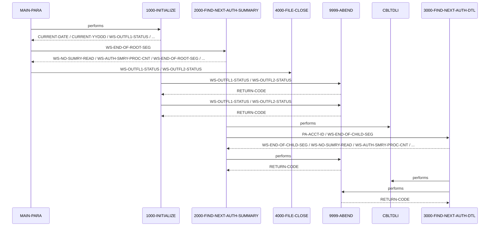

# PAUDBUNL

**File**: `cbl/PAUDBUNL.CBL`
**Type**: FileType.COBOL
**Analyzed**: 2026-03-03 16:54:21.115861

## Purpose

The COBOL program PAUDBUNL unloads data from an IMS database related to pending authorizations. It reads pending authorization summary segments (root) and pending authorization details segments (child) from the IMS database and writes them to sequential output files.

**Business Context**: This program likely supports auditing, reporting, or data migration related to pending authorization records.

## Inputs

| Name | Type | Description |
|------|------|-------------|
| IMS PAUTBPCB | IOType.IMS_SEGMENT | IMS database containing pending authorization summary and detail segments. |
| SYSIN | IOType.PARAMETER | Input parameters, specifically P-EXPIRY-DAYS, P-CHKP-FREQ, P-CHKP-DIS-FREQ, and P-DEBUG-FLAG.  However, the ACCEPT statement is commented out. |

## Outputs

| Name | Type | Description |
|------|------|-------------|
| OPFILE1 | IOType.FILE_SEQUENTIAL | Sequential file containing pending authorization summary records (root segments). |
| OPFILE2 | IOType.FILE_SEQUENTIAL | Sequential file containing pending authorization detail records (child segments). |

## Called Programs

| Program | Call Type | Purpose |
|---------|-----------|---------|
| CBLTDLI | CallType.STATIC_CALL | Performs IMS database calls to retrieve segments. |
| CBLTDLI | CallType.STATIC_CALL | Performs IMS database calls to retrieve child segments. |
| DLITCBL | CallType.STATIC_CALL | Entry point for IMS calls. |

## Paragraphs/Procedures

### MAIN-PARA
> [Source: MAIN-PARA.cbl.md](PAUDBUNL.CBL.d/MAIN-PARA.cbl.md)

```
MAIN-PARA  (5 statements, depth=1)
PARAGRAPH
├── UNKNOWN: ENTRY 'DLITCBL' USING PAUTBPCB
├── PERFORM_THRU: PERFORM 1000-INITIALIZE THRU 1000-EXIT
├── PERFORM_THRU: PERFORM 2000-FIND-NEXT-AUTH-SUMMARY THRU 2000-EXIT UNTIL WS-END-OF-RO...
├── PERFORM_THRU: PERFORM 4000-FILE-CLOSE THRU 4000-EXIT
└── GOBACK: GOBACK
```
This is the main control paragraph of the program. It first calls 1000-INITIALIZE to perform initial setup tasks such as accepting the current date and opening the output files. Then, it enters a loop that repeatedly calls 2000-FIND-NEXT-AUTH-SUMMARY to read and process pending authorization summary segments from the IMS database. The loop continues until the end of the database is reached, indicated by WS-END-OF-ROOT-SEG being set to 'Y'. After processing all summary segments, it calls 4000-FILE-CLOSE to close the output files. Finally, the program terminates using GOBACK. The entry point DLITCBL is defined for IMS.

### 1000-INITIALIZE
> [Source: 1000-INITIALIZE.cbl.md](PAUDBUNL.CBL.d/1000-INITIALIZE.cbl.md)

```
1000-INITIALIZE  (18 statements, depth=3)
PARAGRAPH
├── ACCEPT: ACCEPT CURRENT-DATE FROM DATE
├── ACCEPT: ACCEPT CURRENT-YYDDD FROM DAY
├── DISPLAY: DISPLAY 'STARTING PROGRAM PAUDBUNL::'
├── DISPLAY: DISPLAY '*-------------------------------------*'
├── DISPLAY: DISPLAY 'TODAYS DATE :' CURRENT-DATE
├── DISPLAY: DISPLAY ' '
├── OPEN: OPEN OUTPUT OPFILE1
├── IF: IF WS-OUTFL1-STATUS = SPACES OR '00' CONTINUE ELSE DISPLAY 'ERROR IN ...
│   ├── CONTINUE: CONTINUE
│   └── ELSE: ELSE
│       ├── DISPLAY: DISPLAY 'ERROR IN OPENING OPFILE1:' WS-OUTFL1-STATUS
│       └── PERFORM: PERFORM 9999-ABEND
├── OPEN: OPEN OUTPUT OPFILE2
└── IF: IF WS-OUTFL2-STATUS = SPACES OR '00' CONTINUE ELSE DISPLAY 'ERROR IN ...
    ├── CONTINUE: CONTINUE
    └── ELSE: ELSE
        ├── DISPLAY: DISPLAY 'ERROR IN OPENING OPFILE2:' WS-OUTFL2-STATUS
        └── PERFORM: PERFORM 9999-ABEND
```
This paragraph performs initialization tasks for the program. It accepts the current date and day from the system. It then opens the two output files, OPFILE1 and OPFILE2, for writing. If either file fails to open, an error message is displayed, and the program abends by calling 9999-ABEND. The paragraph displays messages to the console indicating the start of the program and the current date.

### 2000-FIND-NEXT-AUTH-SUMMARY
> [Source: 2000-FIND-NEXT-AUTH-SUMMARY.cbl.md](PAUDBUNL.CBL.d/2000-FIND-NEXT-AUTH-SUMMARY.cbl.md)

```
2000-FIND-NEXT-AUTH-SUMMARY  (20 statements, depth=3)
PARAGRAPH
├── INITIALIZE: INITIALIZE PAUT-PCB-STATUS
├── CALL: CALL 'CBLTDLI' USING FUNC-GN PAUTBPCB PENDING-AUTH-SUMMARY ROOT-UNQUA...
├── IF: IF PAUT-PCB-STATUS = SPACES *> SET NOT-END-OF-AUTHDB TO TRUE ADD 1 TO...
│   ├── ADD: ADD 1 TO WS-NO-SUMRY-READ
│   ├── ADD: ADD 1 TO WS-AUTH-SMRY-PROC-CNT
│   ├── MOVE: MOVE PENDING-AUTH-SUMMARY TO OPFIL1-REC
│   ├── INITIALIZE: INITIALIZE ROOT-SEG-KEY
│   ├── INITIALIZE: INITIALIZE CHILD-SEG-REC
│   ├── MOVE: MOVE PA-ACCT-ID TO ROOT-SEG-KEY
│   └── IF: IF PA-ACCT-ID IS NUMERIC WRITE OPFIL1-REC INITIALIZE WS-END-OF-CHILD-...
│       ├── WRITE: WRITE OPFIL1-REC
│       ├── INITIALIZE: INITIALIZE WS-END-OF-CHILD-SEG
│       └── PERFORM_THRU: PERFORM 3000-FIND-NEXT-AUTH-DTL THRU 3000-EXIT UNTIL WS-END-OF-CHILD-...
├── IF: IF PAUT-PCB-STATUS = 'GB' SET END-OF-AUTHDB TO TRUE MOVE 'Y' TO WS-EN...
│   ├── SET: SET END-OF-AUTHDB TO TRUE
│   └── MOVE: MOVE 'Y' TO WS-END-OF-ROOT-SEG
└── IF: IF PAUT-PCB-STATUS NOT EQUAL TO SPACES AND 'GB' DISPLAY 'AUTH SUM GN ...
    ├── DISPLAY: DISPLAY 'AUTH SUM GN FAILED :' PAUT-PCB-STATUS
    ├── DISPLAY: DISPLAY 'KEY FEEDBACK AREA :' PAUT-KEYFB
    └── PERFORM: PERFORM 9999-ABEND
```
This paragraph retrieves the next pending authorization summary segment (root segment) from the IMS database. It uses the CBLTDLI call with the FUNC-GN (Get Next) function code to read the next segment. If the read is successful (PAUT-PCB-STATUS is spaces), it increments counters, moves the data to OPFIL1-REC, and writes the record to OPFILE1. It then calls 3000-FIND-NEXT-AUTH-DTL to process the child segments. If the end of the database is reached (PAUT-PCB-STATUS is 'GB'), it sets the WS-END-OF-ROOT-SEG flag to 'Y'. If the IMS call fails with any other status code, an error message is displayed, and the program abends.

### 3000-FIND-NEXT-AUTH-DTL
> [Source: 3000-FIND-NEXT-AUTH-DTL.cbl.md](PAUDBUNL.CBL.d/3000-FIND-NEXT-AUTH-DTL.cbl.md)

```
3000-FIND-NEXT-AUTH-DTL  (15 statements, depth=2)
PARAGRAPH
├── CALL: CALL 'CBLTDLI' USING FUNC-GNP PAUTBPCB PENDING-AUTH-DETAILS CHILD-UNQ...
├── IF: IF PAUT-PCB-STATUS = SPACES SET MORE-AUTHS TO TRUE ADD 1 TO WS-NO-SUM...
│   ├── SET: SET MORE-AUTHS TO TRUE
│   ├── ADD: ADD 1 TO WS-NO-SUMRY-READ
│   ├── ADD: ADD 1 TO WS-AUTH-SMRY-PROC-CNT
│   ├── MOVE: MOVE PENDING-AUTH-DETAILS TO CHILD-SEG-REC
│   └── WRITE: WRITE OPFIL2-REC
├── IF: IF PAUT-PCB-STATUS = 'GE' *> SET NO-MORE-AUTHS TO TRUE MOVE 'Y' TO WS...
│   ├── MOVE: MOVE 'Y' TO WS-END-OF-CHILD-SEG
│   └── DISPLAY: DISPLAY 'CHILD SEG FLAG GE : ' WS-END-OF-CHILD-SEG
├── IF: IF PAUT-PCB-STATUS NOT EQUAL TO SPACES AND 'GE' DISPLAY 'GNP CALL FAI...
│   ├── DISPLAY: DISPLAY 'GNP CALL FAILED :' PAUT-PCB-STATUS
│   ├── DISPLAY: DISPLAY 'KFB AREA IN CHILD:' PAUT-KEYFB
│   └── PERFORM: PERFORM 9999-ABEND
└── INITIALIZE: INITIALIZE PAUT-PCB-STATUS
```
This paragraph retrieves the next pending authorization detail segment (child segment) for the current summary segment from the IMS database. It uses the CBLTDLI call with the FUNC-GNP (Get Next within Parent) function code. If the read is successful (PAUT-PCB-STATUS is spaces), it increments counters, moves the data to CHILD-SEG-REC, and writes the record to OPFILE2. If there are no more child segments (PAUT-PCB-STATUS is 'GE'), it sets the WS-END-OF-CHILD-SEG flag to 'Y'. If the IMS call fails with any other status code, an error message is displayed, and the program abends. The PAUT-PCB-STATUS is initialized at the end of the paragraph.

### 4000-FILE-CLOSE
> [Source: 4000-FILE-CLOSE.cbl.md](PAUDBUNL.CBL.d/4000-FILE-CLOSE.cbl.md)

```
4000-FILE-CLOSE  (11 statements, depth=3)
PARAGRAPH
├── DISPLAY: DISPLAY 'CLOSING THE FILE'
├── CLOSE: CLOSE OPFILE1
├── IF: IF WS-OUTFL1-STATUS = SPACES OR '00' CONTINUE ELSE DISPLAY 'ERROR IN ...
│   ├── CONTINUE: CONTINUE
│   └── ELSE: ELSE
│       └── DISPLAY: DISPLAY 'ERROR IN CLOSING 1ST FILE:'WS-OUTFL1-STATUS
├── CLOSE: CLOSE OPFILE2
└── IF: IF WS-OUTFL2-STATUS = SPACES OR '00' CONTINUE ELSE DISPLAY 'ERROR IN ...
    ├── CONTINUE: CONTINUE
    └── ELSE: ELSE
        └── DISPLAY: DISPLAY 'ERROR IN CLOSING 2ND FILE:'WS-OUTFL2-STATUS
```
This paragraph closes the output files, OPFILE1 and OPFILE2. It displays a message to the console indicating that the files are being closed. After each file is closed, the file status is checked. If an error occurs during the close operation, an error message is displayed to the console.

### 9999-ABEND
> [Source: 9999-ABEND.cbl.md](PAUDBUNL.CBL.d/9999-ABEND.cbl.md)

```
9999-ABEND  (3 statements, depth=1)
PARAGRAPH
├── DISPLAY: DISPLAY 'IMSUNLOD ABENDING ...'
├── MOVE: MOVE 16 TO RETURN-CODE
└── GOBACK: GOBACK
```
This paragraph handles program termination due to an error. It displays a message to the console indicating that the program is abending. It sets the RETURN-CODE to 16, indicating an abnormal termination, and then terminates the program using GOBACK.

## Control Flow


```mermaid
flowchart TD
    %% Title: PAUDBUNL.CBL
    1000_EXIT["1000-EXIT"]
    1000_INITIALIZE["1000-INITIALIZE"]
    9999_ABEND["9999-ABEND"]
    2000_EXIT["2000-EXIT"]
    2000_FIND_NEXT_AUTH_SUMMARY["2000-FIND-NEXT-AUTH-SUMMARY"]
    3000_FIND_NEXT_AUTH_DTL["3000-FIND-NEXT-AUTH-DTL"]
    CBLTDLI__ext(["CBLTDLI"])
    3000_EXIT["3000-EXIT"]
    4000_EXIT["4000-EXIT"]
    4000_FILE_CLOSE["4000-FILE-CLOSE"]
    9999_EXIT["9999-EXIT"]
    MAIN_PARA["MAIN-PARA"]
    1000_INITIALIZE --> 9999_ABEND
    2000_FIND_NEXT_AUTH_SUMMARY --> 3000_FIND_NEXT_AUTH_DTL
    2000_FIND_NEXT_AUTH_SUMMARY --> 9999_ABEND
    2000_FIND_NEXT_AUTH_SUMMARY -.->|calls| CBLTDLI__ext
    3000_FIND_NEXT_AUTH_DTL --> 9999_ABEND
    3000_FIND_NEXT_AUTH_DTL -.->|calls| CBLTDLI__ext
    MAIN_PARA --> 1000_INITIALIZE
    MAIN_PARA --> 2000_FIND_NEXT_AUTH_SUMMARY
    MAIN_PARA --> 4000_FILE_CLOSE
```

## Open Questions

- ? What is the purpose of the commented-out ACCEPT PRM-INFO FROM SYSIN statement?
  - Context: The program appears to be designed to accept parameters from SYSIN, but this functionality is currently disabled.
- ? What is the exact structure and content of the IMS database being accessed?
  - Context: The program uses copybooks CIPAUSMY and CIPAUDTY to define the segment layouts, but further details about the IMS database schema and data relationships are needed for a complete understanding.

## Sequence Diagram


```mermaid
sequenceDiagram
    participant MAIN_PARA as MAIN-PARA
    participant 1000_INITIALIZE as 1000-INITIALIZE
    participant 2000_FIND_NEXT_AUTH_SUMMARY as 2000-FIND-NEXT-AUTH-SUMMARY
    participant 4000_FILE_CLOSE as 4000-FILE-CLOSE
    participant 9999_ABEND as 9999-ABEND
    participant CBLTDLI as CBLTDLI
    participant 3000_FIND_NEXT_AUTH_DTL as 3000-FIND-NEXT-AUTH-DTL
    MAIN_PARA->>1000_INITIALIZE: performs
    1000_INITIALIZE-->>MAIN_PARA: CURRENT-DATE / CURRENT-YYDDD / WS-OUTFL1-STATUS / ...
    MAIN_PARA->>2000_FIND_NEXT_AUTH_SUMMARY: WS-END-OF-ROOT-SEG
    2000_FIND_NEXT_AUTH_SUMMARY-->>MAIN_PARA: WS-NO-SUMRY-READ / WS-AUTH-SMRY-PROC-CNT / WS-END-OF-ROOT-SEG / ...
    MAIN_PARA->>4000_FILE_CLOSE: WS-OUTFL1-STATUS / WS-OUTFL2-STATUS
    1000_INITIALIZE->>9999_ABEND: WS-OUTFL1-STATUS / WS-OUTFL2-STATUS
    9999_ABEND-->>1000_INITIALIZE: RETURN-CODE
    1000_INITIALIZE->>9999_ABEND: WS-OUTFL1-STATUS / WS-OUTFL2-STATUS
    9999_ABEND-->>1000_INITIALIZE: RETURN-CODE
    2000_FIND_NEXT_AUTH_SUMMARY->>CBLTDLI: performs
    2000_FIND_NEXT_AUTH_SUMMARY->>3000_FIND_NEXT_AUTH_DTL: PA-ACCT-ID / WS-END-OF-CHILD-SEG
    3000_FIND_NEXT_AUTH_DTL-->>2000_FIND_NEXT_AUTH_SUMMARY: WS-END-OF-CHILD-SEG / WS-NO-SUMRY-READ / WS-AUTH-SMRY-PROC-CNT / ...
    2000_FIND_NEXT_AUTH_SUMMARY->>9999_ABEND: performs
    9999_ABEND-->>2000_FIND_NEXT_AUTH_SUMMARY: RETURN-CODE
    3000_FIND_NEXT_AUTH_DTL->>CBLTDLI: performs
    3000_FIND_NEXT_AUTH_DTL->>9999_ABEND: performs
    9999_ABEND-->>3000_FIND_NEXT_AUTH_DTL: RETURN-CODE
```
