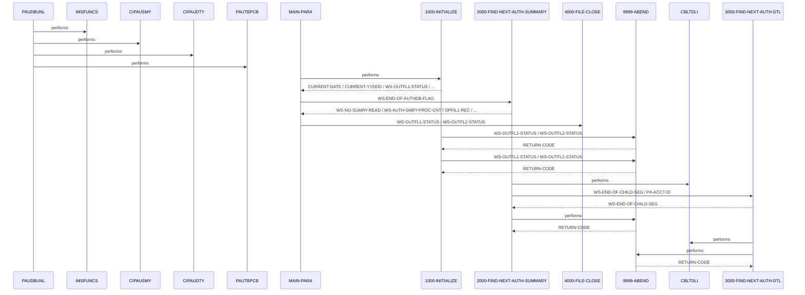

# PAUDBUNL

**File**: `cbl/PAUDBUNL.CBL`
**Type**: FileType.COBOL
**Analyzed**: 2026-02-27 14:39:14.333260

## Purpose

The COBOL program PAUDBUNL extracts pending authorization summary and detail records from an IMS database and writes them to sequential output files. It reads authorization summary records and then retrieves associated detail records, writing each to separate output files.

**Business Context**: UNKNOWN

## Inputs

| Name | Type | Description |
|------|------|-------------|
| PAUTBPCB | IOType.IMS_SEGMENT | IMS PCB used to access the authorization summary and detail segments. |
| PENDING-AUTH-SUMMARY | IOType.IMS_SEGMENT | Pending authorization summary segment from the IMS database. |
| PENDING-AUTH-DETAILS | IOType.IMS_SEGMENT | Pending authorization detail segment from the IMS database. |
| ROOT-UNQUAL-SSA | IOType.OTHER | Unqualified SSA for the root segment. |
| CHILD-UNQUAL-SSA | IOType.OTHER | Unqualified SSA for the child segment. |

## Outputs

| Name | Type | Description |
|------|------|-------------|
| OPFILE1 | IOType.FILE_SEQUENTIAL | Sequential file containing pending authorization summary records. |
| OPFILE2 | IOType.FILE_SEQUENTIAL | Sequential file containing pending authorization detail records. |

## Called Programs

| Program | Call Type | Purpose |
|---------|-----------|---------|
| CBLTDLI | CallType.STATIC_CALL | Issue DL/I calls to the IMS database. |
| CBLTDLI | CallType.STATIC_CALL | Issue DL/I calls to the IMS database. |

## Paragraphs/Procedures

### PAUDBUNL
> [Source: PAUDBUNL.cbl.md](PAUDBUNL.CBL.d/PAUDBUNL.cbl.md)
This is the program ID paragraph. It does not contain any executable code.

### MAIN-PARA
> [Source: MAIN-PARA.cbl.md](PAUDBUNL.CBL.d/MAIN-PARA.cbl.md)

```
MAIN-PARA  (5 statements, depth=0)
PARAGRAPH
├── UNKNOWN: ENTRY 'DLITCBL'                 USING PAUTBPCB
├── PERFORM_THRU: PERFORM 1000-INITIALIZE                THRU 1000-EXIT
├── PERFORM_THRU: PERFORM 2000-FIND-NEXT-AUTH-SUMMARY    THRU 2000-EXIT UNTIL   WS-END-...
├── PERFORM_THRU: PERFORM 4000-FILE-CLOSE THRU 4000-EXIT
└── GOBACK: GOBACK
```
This paragraph serves as the main control flow for the program. It first performs 1000-INITIALIZE to set up the program environment, including opening files. Then, it enters a loop, repeatedly performing 2000-FIND-NEXT-AUTH-SUMMARY until the end of the root segment is reached, indicated by WS-END-OF-ROOT-SEG being set to 'Y'. Finally, it performs 4000-FILE-CLOSE to close the output files before terminating the program. The paragraph uses GOBACK to return control to the calling program.

### 1000-INITIALIZE
> [Source: 1000-INITIALIZE.cbl.md](PAUDBUNL.CBL.d/1000-INITIALIZE.cbl.md)

```
1000-INITIALIZE  (18 statements, depth=1)
PARAGRAPH
├── ACCEPT: ACCEPT CURRENT-DATE     FROM DATE
├── ACCEPT: ACCEPT CURRENT-YYDDD    FROM DAY
├── DISPLAY: DISPLAY 'STARTING PROGRAM PAUDBUNL::'
├── DISPLAY: DISPLAY '*-------------------------------------*'
├── DISPLAY: DISPLAY 'TODAYS DATE            :' CURRENT-DATE
├── DISPLAY: DISPLAY ' '
├── OPEN: OPEN OUTPUT OPFILE1
├── IF: IF WS-OUTFL1-STATUS =  SPACES OR '00'
│   ├── CONTINUE: CONTINUE
│   └── ELSE: ELSE
│       ├── DISPLAY: DISPLAY 'ERROR IN OPENING OPFILE1:' WS-OUTFL1-STATUS
│       └── PERFORM: PERFORM 9999-ABEND
├── OPEN: OPEN OUTPUT OPFILE2
└── IF: IF WS-OUTFL2-STATUS =  SPACES OR '00'
    ├── CONTINUE: CONTINUE
    └── ELSE: ELSE
        ├── DISPLAY: DISPLAY 'ERROR IN OPENING OPFILE2:' WS-OUTFL2-STATUS
        └── PERFORM: PERFORM 9999-ABEND
```
This paragraph initializes the program environment. It accepts the current date and day from the system. It then opens OPFILE1 and OPFILE2 for output. If either OPEN operation fails (WS-OUTFL1-STATUS or WS-OUTFL2-STATUS not equal to spaces or '00'), it displays an error message and performs 9999-ABEND to terminate the program. The paragraph displays a starting message with the current date.

### 1000-EXIT
> [Source: 1000-EXIT.cbl.md](PAUDBUNL.CBL.d/1000-EXIT.cbl.md)

```
1000-EXIT  (1 statements, depth=0)
PARAGRAPH
└── EXIT: EXIT
```
This paragraph is a standard exit point for the 1000-INITIALIZE paragraph. It contains only the EXIT statement and serves as a target for the PERFORM THRU construct.

### 2000-FIND-NEXT-AUTH-SUMMARY
> [Source: 2000-FIND-NEXT-AUTH-SUMMARY.cbl.md](PAUDBUNL.CBL.d/2000-FIND-NEXT-AUTH-SUMMARY.cbl.md)

```
2000-FIND-NEXT-AUTH-SUMMARY  (20 statements, depth=2)
PARAGRAPH
├── INITIALIZE: INITIALIZE PAUT-PCB-STATUS
├── CALL: CALL 'CBLTDLI'            USING  FUNC-GN PAUTBPCB PENDING-AUTH-SUMMAR...
├── IF: IF PAUT-PCB-STATUS = SPACES
│   ├── ADD: ADD 1                 TO WS-NO-SUMRY-READ
│   ├── ADD: ADD 1                 TO WS-AUTH-SMRY-PROC-CNT
│   ├── MOVE: MOVE PENDING-AUTH-SUMMARY TO OPFIL1-REC
│   ├── INITIALIZE: INITIALIZE ROOT-SEG-KEY
│   ├── INITIALIZE: INITIALIZE CHILD-SEG-REC
│   ├── MOVE: MOVE PA-ACCT-ID           TO ROOT-SEG-KEY
│   └── IF: IF PA-ACCT-ID IS NUMERIC
│       ├── WRITE: WRITE OPFIL1-REC
│       ├── INITIALIZE: INITIALIZE WS-END-OF-CHILD-SEG
│       └── PERFORM_THRU: PERFORM 3000-FIND-NEXT-AUTH-DTL THRU 3000-EXIT UNTIL  WS-END-OF-CHILD...
├── IF: IF PAUT-PCB-STATUS = 'GB'
│   ├── SET: SET END-OF-AUTHDB     TO TRUE
│   └── MOVE: MOVE 'Y' TO WS-END-OF-ROOT-SEG
└── IF: IF PAUT-PCB-STATUS NOT EQUAL TO  SPACES AND 'GB'
    ├── DISPLAY: DISPLAY 'AUTH SUM  GN FAILED  :' PAUT-PCB-STATUS
    ├── DISPLAY: DISPLAY 'KEY FEEDBACK AREA    :' PAUT-KEYFB
    └── PERFORM: PERFORM 9999-ABEND
```
This paragraph retrieves the next pending authorization summary record from the IMS database. It initializes PAUT-PCB-STATUS and then calls CBLTDLI with FUNC-GN to retrieve the next root segment (PENDING-AUTH-SUMMARY) using the ROOT-UNQUAL-SSA. If the call is successful (PAUT-PCB-STATUS is spaces), it increments counters, moves the retrieved summary record to OPFIL1-REC, initializes ROOT-SEG-KEY and CHILD-SEG-REC, moves PA-ACCT-ID to ROOT-SEG-KEY, and writes the summary record to OPFILE1. It then calls 3000-FIND-NEXT-AUTH-DTL to retrieve the associated detail records. If PAUT-PCB-STATUS is 'GB', it sets WS-END-OF-ROOT-SEG to 'Y' to indicate the end of the root segment. If the DL/I call fails (PAUT-PCB-STATUS is not spaces or 'GB'), it displays an error message and performs 9999-ABEND.

### 2000-EXIT
> [Source: 2000-EXIT.cbl.md](PAUDBUNL.CBL.d/2000-EXIT.cbl.md)

```
2000-EXIT  (1 statements, depth=0)
PARAGRAPH
└── EXIT: EXIT
```
This paragraph is a standard exit point for the 2000-FIND-NEXT-AUTH-SUMMARY paragraph. It contains only the EXIT statement and serves as a target for the PERFORM THRU construct.

### 3000-FIND-NEXT-AUTH-DTL
> [Source: 3000-FIND-NEXT-AUTH-DTL.cbl.md](PAUDBUNL.CBL.d/3000-FIND-NEXT-AUTH-DTL.cbl.md)

```
3000-FIND-NEXT-AUTH-DTL  (15 statements, depth=1)
PARAGRAPH
├── CALL: CALL 'CBLTDLI'            USING  FUNC-GNP PAUTBPCB PENDING-AUTH-DETAI...
├── IF: IF PAUT-PCB-STATUS = SPACES
│   ├── SET: SET MORE-AUTHS       TO TRUE
│   ├── ADD: ADD 1                 TO WS-NO-SUMRY-READ
│   ├── ADD: ADD 1                 TO WS-AUTH-SMRY-PROC-CNT
│   ├── MOVE: MOVE PENDING-AUTH-DETAILS TO CHILD-SEG-REC
│   └── WRITE: WRITE OPFIL2-REC
├── IF: IF PAUT-PCB-STATUS = 'GE'
│   ├── MOVE: MOVE 'Y' TO WS-END-OF-CHILD-SEG
│   └── DISPLAY: DISPLAY 'CHILD SEG FLAG GE : ' WS-END-OF-CHILD-SEG
├── IF: IF PAUT-PCB-STATUS NOT EQUAL TO  SPACES AND 'GE'
│   ├── DISPLAY: DISPLAY 'GNP CALL FAILED  :' PAUT-PCB-STATUS
│   ├── DISPLAY: DISPLAY 'KFB AREA IN CHILD:' PAUT-KEYFB
│   └── PERFORM: PERFORM 9999-ABEND
└── INITIALIZE: INITIALIZE PAUT-PCB-STATUS
```
This paragraph retrieves the next pending authorization detail record from the IMS database. It calls CBLTDLI with FUNC-GNP to retrieve the next child segment (PENDING-AUTH-DETAILS) using the CHILD-UNQUAL-SSA. If the call is successful (PAUT-PCB-STATUS is spaces), it sets MORE-AUTHS to TRUE, increments counters, moves the retrieved detail record to CHILD-SEG-REC, and writes the detail record to OPFILE2. If PAUT-PCB-STATUS is 'GE', it moves 'Y' to WS-END-OF-CHILD-SEG to indicate the end of the child segment. If the DL/I call fails (PAUT-PCB-STATUS is not spaces or 'GE'), it displays an error message and performs 9999-ABEND. Finally, it initializes PAUT-PCB-STATUS.

### 3000-EXIT
> [Source: 3000-EXIT.cbl.md](PAUDBUNL.CBL.d/3000-EXIT.cbl.md)

```
3000-EXIT  (1 statements, depth=0)
PARAGRAPH
└── EXIT: EXIT
```
This paragraph is a standard exit point for the 3000-FIND-NEXT-AUTH-DTL paragraph. It contains only the EXIT statement and serves as a target for the PERFORM THRU construct.

### 4000-FILE-CLOSE
> [Source: 4000-FILE-CLOSE.cbl.md](PAUDBUNL.CBL.d/4000-FILE-CLOSE.cbl.md)

```
4000-FILE-CLOSE  (11 statements, depth=1)
PARAGRAPH
├── DISPLAY: DISPLAY 'CLOSING THE FILE'
├── CLOSE: CLOSE OPFILE1
├── IF: IF WS-OUTFL1-STATUS =  SPACES OR '00'
│   ├── CONTINUE: CONTINUE
│   └── ELSE: ELSE
│       └── DISPLAY: DISPLAY 'ERROR IN CLOSING 1ST FILE:'WS-OUTFL1-STATUS
├── CLOSE: CLOSE OPFILE2
└── IF: IF WS-OUTFL2-STATUS =  SPACES OR '00'
    ├── CONTINUE: CONTINUE
    └── ELSE: ELSE
        └── DISPLAY: DISPLAY 'ERROR IN CLOSING 2ND FILE:'WS-OUTFL2-STATUS
```
This paragraph closes the output files OPFILE1 and OPFILE2. It displays a message indicating that the files are being closed. After closing each file, it checks the file status (WS-OUTFL1-STATUS and WS-OUTFL2-STATUS). If the file status is not spaces or '00', it displays an error message indicating a problem during the close operation.

### 4000-EXIT
> [Source: 4000-EXIT.cbl.md](PAUDBUNL.CBL.d/4000-EXIT.cbl.md)

```
4000-EXIT  (1 statements, depth=0)
PARAGRAPH
└── EXIT: EXIT
```
This paragraph is a standard exit point for the 4000-FILE-CLOSE paragraph. It contains only the EXIT statement and serves as a target for the PERFORM THRU construct.

### 9999-ABEND
> [Source: 9999-ABEND.cbl.md](PAUDBUNL.CBL.d/9999-ABEND.cbl.md)

```
9999-ABEND  (3 statements, depth=0)
PARAGRAPH
├── DISPLAY: DISPLAY 'IMSUNLOD ABENDING ...'
├── MOVE: MOVE 16 TO RETURN-CODE
└── GOBACK: GOBACK
```
The 9999-ABEND paragraph is responsible for handling the abnormal termination of the program. It first displays the message 'IMSUNLOD ABENDING ...' to the console, indicating that the program is terminating unexpectedly. It then sets the RETURN-CODE to 16, which is a standard convention for signaling an error condition to the calling environment. Finally, it executes the GOBACK statement, which terminates the program and returns control to the operating system or calling program. This paragraph does not consume any specific input files or data structures, but it does output a message to the console and sets the return code. It is called when a critical error occurs that prevents the program from continuing its normal execution. No other paragraphs or programs are called from this paragraph.

### 9999-EXIT
> [Source: 9999-EXIT.cbl.md](PAUDBUNL.CBL.d/9999-EXIT.cbl.md)

```
9999-EXIT  (1 statements, depth=0)
PARAGRAPH
└── EXIT: EXIT
```
The 9999-EXIT paragraph provides a standard exit point for the program. It consists of a single EXIT statement, which simply marks the logical end of the program flow. This paragraph does not perform any specific actions, such as closing files or releasing resources. It serves as a placeholder for potential future exit logic. The paragraph does not consume any input or produce any output. It is called when the program has completed its processing successfully or when a controlled termination is required. No other paragraphs or programs are called from this paragraph.

## Control Flow


```mermaid
flowchart TD
    %% Title: PAUDBUNL.CBL
    1000_EXIT["1000-EXIT"]
    1000_INITIALIZE["1000-INITIALIZE"]
    9999_ABEND["9999-ABEND"]
    2000_EXIT["2000-EXIT"]
    2000_FIND_NEXT_AUTH_SUMMARY["2000-FIND-NEXT-AUTH-SUMMARY"]
    3000_FIND_NEXT_AUTH_DTL["3000-FIND-NEXT-AUTH-DTL"]
    CBLTDLI__ext(["CBLTDLI"])
    3000_EXIT["3000-EXIT"]
    4000_EXIT["4000-EXIT"]
    4000_FILE_CLOSE["4000-FILE-CLOSE"]
    9999_EXIT["9999-EXIT"]
    MAIN_PARA["MAIN-PARA"]
    1000_INITIALIZE --> 9999_ABEND
    2000_FIND_NEXT_AUTH_SUMMARY --> 3000_FIND_NEXT_AUTH_DTL
    2000_FIND_NEXT_AUTH_SUMMARY --> 9999_ABEND
    2000_FIND_NEXT_AUTH_SUMMARY -.->|calls| CBLTDLI__ext
    3000_FIND_NEXT_AUTH_DTL --> 9999_ABEND
    3000_FIND_NEXT_AUTH_DTL -.->|calls| CBLTDLI__ext
    MAIN_PARA --> 1000_INITIALIZE
    MAIN_PARA --> 2000_FIND_NEXT_AUTH_SUMMARY
    MAIN_PARA --> 4000_FILE_CLOSE
```

## Open Questions

- ? What is the purpose of OPFILE2?
  - Context: The description of OPFILE2 is missing.
- ? What is the structure of the IMS segments?
  - Context: The copybooks for the IMS segments are not provided.

## Sequence Diagram


```mermaid
sequenceDiagram
    participant PAUDBUNL as PAUDBUNL
    participant IMSFUNCS as IMSFUNCS
    participant CIPAUSMY as CIPAUSMY
    participant CIPAUDTY as CIPAUDTY
    participant PAUTBPCB as PAUTBPCB
    participant MAIN_PARA as MAIN-PARA
    participant 1000_INITIALIZE as 1000-INITIALIZE
    participant 2000_FIND_NEXT_AUTH_SUMMARY as 2000-FIND-NEXT-AUTH-SUMMARY
    participant 4000_FILE_CLOSE as 4000-FILE-CLOSE
    participant 9999_ABEND as 9999-ABEND
    participant CBLTDLI as CBLTDLI
    participant 3000_FIND_NEXT_AUTH_DTL as 3000-FIND-NEXT-AUTH-DTL
    PAUDBUNL->>IMSFUNCS: performs
    PAUDBUNL->>CIPAUSMY: performs
    PAUDBUNL->>CIPAUDTY: performs
    PAUDBUNL->>PAUTBPCB: performs
    MAIN_PARA->>1000_INITIALIZE: performs
    1000_INITIALIZE-->>MAIN_PARA: CURRENT-DATE / CURRENT-YYDDD / WS-OUTFL1-STATUS / ...
    MAIN_PARA->>2000_FIND_NEXT_AUTH_SUMMARY: WS-END-OF-AUTHDB-FLAG
    2000_FIND_NEXT_AUTH_SUMMARY-->>MAIN_PARA: WS-NO-SUMRY-READ / WS-AUTH-SMRY-PROC-CNT / OPFIL1-REC / ...
    MAIN_PARA->>4000_FILE_CLOSE: WS-OUTFL1-STATUS / WS-OUTFL2-STATUS
    1000_INITIALIZE->>9999_ABEND: WS-OUTFL1-STATUS / WS-OUTFL2-STATUS
    9999_ABEND-->>1000_INITIALIZE: RETURN-CODE
    1000_INITIALIZE->>9999_ABEND: WS-OUTFL1-STATUS / WS-OUTFL2-STATUS
    9999_ABEND-->>1000_INITIALIZE: RETURN-CODE
    2000_FIND_NEXT_AUTH_SUMMARY->>CBLTDLI: performs
    2000_FIND_NEXT_AUTH_SUMMARY->>3000_FIND_NEXT_AUTH_DTL: WS-END-OF-CHILD-SEG / PA-ACCT-ID
    3000_FIND_NEXT_AUTH_DTL-->>2000_FIND_NEXT_AUTH_SUMMARY: WS-END-OF-CHILD-SEG
    2000_FIND_NEXT_AUTH_SUMMARY->>9999_ABEND: performs
    9999_ABEND-->>2000_FIND_NEXT_AUTH_SUMMARY: RETURN-CODE
    3000_FIND_NEXT_AUTH_DTL->>CBLTDLI: performs
    3000_FIND_NEXT_AUTH_DTL->>9999_ABEND: performs
    9999_ABEND-->>3000_FIND_NEXT_AUTH_DTL: RETURN-CODE
```
